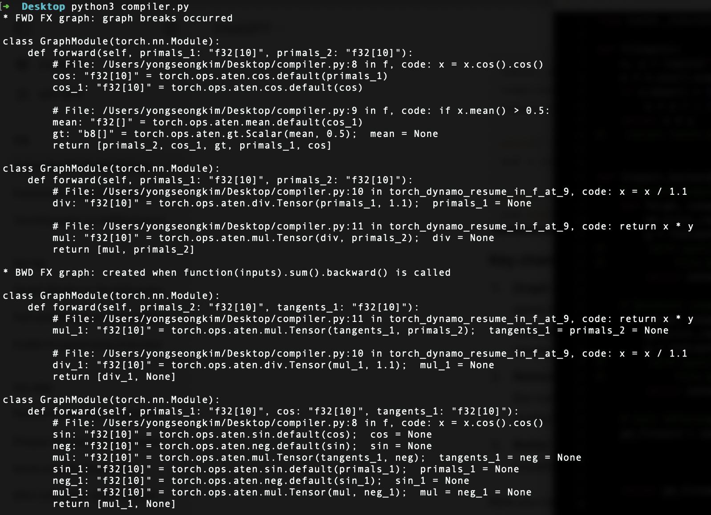
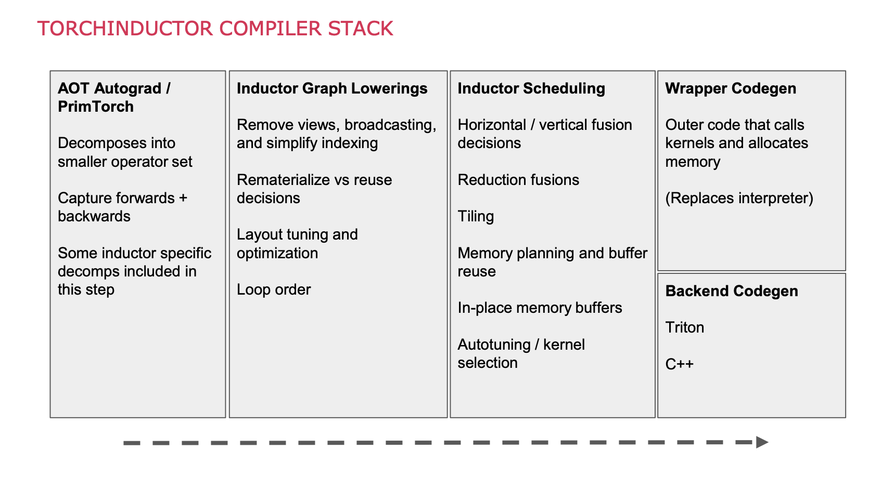

# DL Compilation
---
PyTorch began as a Python rewrite of [Torch7](https://en.wikipedia.org/wiki/Torch_(machine_learning)) (Lua-based, Ronan Collobert et al.) at Facebook AI Research in 2016–17, led by Adam Paszke, Soumith Chintala, and Sam Gross. Its define-by-run eager execution made it the framework of choice for researchers, but deployment and performance demanded compilation. This post traces that arc — from eager mode through TorchScript's limitations to the *torch.compile* stack announced in December 2022 — and covers the systems-level techniques that make large-scale model training and serving practical.

- https://www.youtube.com/watch?v=6hvJr0-adtg&t=262s
- https://www.youtube.com/watch?v=A8tO4D1Gtc0

## I
---

### **1.1. PyTorch 1.x**

 

TensorFlow (Google, November 2015) adopted a define-and-run paradigm: users built a [static computation graph]() (SCG), then executed it in a session. PyTorch chose the opposite — [dynamic computation graphs]() (DCG) via eager execution, where operations execute immediately as Python code runs. This meant standard Python debuggers, control flow (if/else, loops), and print statements worked out of the box, making PyTorch overwhelmingly preferred for research. The design was influenced by [Chainer](https://en.wikipedia.org/wiki/Chainer) (Tokui et al., 2015) and [HIPS/autograd](https://github.com/HIPS/autograd) (Maclaurin, Duvenaud, and Adams at Harvard). The foundational paper, ["PyTorch: An Imperative Style, High-Performance Deep Learning Library"](https://arxiv.org/abs/1912.01703) (Paszke et al., NeurIPS 2019), formalised these design decisions.

A [*torch.Tensor*]() is the core data structure — a homogeneous, multi-dimensional rectangular array. Attributes [*requires_grad, grad, grad_fn*] drive the [automatic differentiation](http://blog.ezyang.com/2019/05/pytorch-internals/) (AD) engine: when operations are performed on tensors with *requires_grad=True*, PyTorch dynamically builds a DCG where *torch.Tensor* instances are nodes and *torch.autograd.Function* objects (e.g. AddBackward0, MulBackward0) are edges. Calling *.backward()* traverses this graph in reverse to compute gradients. Other key attributes — [*size, stride, dtype, device, layout*] — describe the tensor's shape and memory layout, analogous to *numpy.ndarray*.

The Python API delegates computation to C++ backends for performance. [ATen](https://pytorch.org/cppdocs/) ("A Tensor Library") is the core C++ tensor library, wrapping vendor-optimised libraries such as Intel [MKL](), NVIDIA [cuDNN](), and [cuBLAS](). ATen uses code generation (via *torchgen* processing *native_functions.yaml*) to produce boilerplate for 2,000+ operators. [Alban Desmaison](https://pytorch.org/docs/stable/community/persons_of_interest.html) summarised the evolution: "i) the initial PyTorch was simply a Python wrapper + new autograd engine + TH\* [the Torch7 C libraries]; ii) ATen was developed later to provide preferred C++ interfaces; iii) [LibTorch]() is the C++ distribution of PyTorch, replacing the Python wrapper (which used [Pybind11]()) and enabling direct C++ API access."

[TorchScript]() (TS) was introduced to bridge the gap between research (Python) and production (C++/mobile). It offered two APIs: [*torch.jit.trace*]() records tensor operations during a forward pass with example inputs (capturing only the executed branch), while [*torch.jit.script*]() parses Python source code to capture control flow. Both produce an SCG that can execute in the PyTorch JIT runtime or be exported to formats like [ONNX](https://en.wikipedia.org/wiki/Open_Neural_Network_Exchange) for deployment without Python. However, TorchScript supported only a restricted subset of Python — it could not handle arbitrary data structures, many builtins, or third-party libraries — forcing researchers to rewrite code to fit its constraints, losing the "eager charm" that made PyTorch attractive in the first place.

- 
  <a href="https://github.com/t-vi/acdl2020/blob/master/pytorch_introduction.ipynb" target="_blank" style="position: absolute; bottom: -8px; right: 4px; font-size: 12px;">[src]</a> 

### **1.2. PyTorch 2.0**

 

[*torch.compile*](), announced in December 2022 and formally described in ["PyTorch 2: Faster Machine Learning Through Dynamic Python Bytecode Transformation and Graph Compilation"](https://dl.acm.org/doi/10.1145/3620665.3640366) (Ansel et al., ASPLOS 2024), is a domain-specific JIT compiler that converts PyTorch operations into optimised SCGs while letting arbitrary Python code continue to be interpreted. Unlike TorchScript's "compile once, run forever" approach, *torch.compile* dynamically traces at runtime, achieving 93% compatibility across 163 open-source models with a single-line code change and a geometric mean speedup of 2.27× for inference and 1.41× for training on the A100.

[TorchDynamo](https://dev-discuss.pytorch.org/t/torchdynamo-an-experiment-in-dynamic-python-bytecode-transformation/361) (Jason Ansel et al., Meta) is the front-end compiler responsible for Python-level graph capture. It leverages [PEP 523](https://peps.python.org/pep-0523/) — the frame evaluation API added in Python 3.6 — to intercept CPython's *eval_frame* function. Whenever CPython calls a function, Dynamo analyses its bytecode, identifies sequences of *torch.\** operations, and extracts them into [FX graphs](https://dev-discuss.pytorch.org/t/the-nuances-of-pytorch-graph-capture/501) (i.e. *torch.fx.GraphModule* of Torch IR). Non-PyTorch code (Python builtins, I/O, third-party libraries) falls back to the default CPython interpreter. [Graph breaks]() occur when Dynamo encounters untraceable constructs — data-dependent control flow, *.item()* calls, or unsupported C extensions — at which point it compiles the graph traced so far, falls back to Python, and resumes tracing after the break.

A set of [guards]() ensures compiled graphs remain valid at subsequent calls. Guards check tensor metadata (shapes, strides, dtypes, devices), environment flags (*model.training*, autocast settings), and control-flow outcomes. A [shape guard]() triggers recompilation if an input tensor's shape changes (e.g. new batch size), causing the cached graph to be discarded and the function retraced. With *dynamic=True*, Dynamo generates kernels accepting variable shapes, reducing recompilation. APIs such as *torch._dynamo.explain* and *torch.fx.graph_module.GraphModule.print_tabular* help diagnose graph breaks, while *fullgraph=True* raises an error instead of silently falling back.

- 
  <a href="https://pytorch.org/get-started/pytorch-2.0/" target="_blank" style="position: absolute; bottom: -8px; right: 4px; font-size: 12px;">[src]</a> 

<!-- - 
  
 -->

[AOTAutograd]() (originating from the [functorch](https://pytorch.org/functorch/) project) captures both forward and backward graphs ahead of time, before execution. Normally, autograd builds the backward graph lazily during the forward pass; AOTAutograd traces both upfront so the compiler backend can optimise them jointly. It uses [\_\_torch\_dispatch\_\_](), a Python-level extension point that intercepts calls at the ATen operator level — below autograd, at the C++ dispatcher — and routes them back to Python for tracing. At the end of *\_\_torch_dispatch\_\_* tracing, AOTAutograd holds a forward graph and a joint forward-backward graph, then uses a [partitioner]() to isolate them into separate FX graphs. It leverages [PrimTorch]() (*torch/_prims*), which canonicalises PyTorch's 2,000+ operators (including overloads) down to ~250 primitive operations — substantially lowering the barrier for backend compilers that need only implement these primitives.

- 
  

[TorchInductor]() (Jason Ansel, Natalia Gimelshein, and team at Meta) is the default backend compiler for *torch.compile*. It takes ATen IR from AOTAutograd and generates optimised [Triton](https://openai.com/index/triton/) kernels for NVIDIA/AMD GPUs or C++/OpenMP code for CPUs. Key optimisations include [kernel fusion]() (combining multiple operations into a single kernel to reduce memory traffic), loop tiling for cache efficiency, and memory planning for allocation reuse. AOTAutograd may also apply [activation checkpointing]() — recomputing intermediate outputs during the backward pass instead of storing them — trading computation for reduced memory; when paired with Inductor's fusing compiler, recomputed operators can be fused for both memory and runtime savings. Alternative backends include TensorRT (NVIDIA), IPEX (Intel CPUs), XLA (Google TPUs), and custom backends registered via the *register_backend* API.

- 
  <a href="https://hc2023.hotchips.org/assets/program/tutorials/ml/PyTorch%202.0.pdf" target="_blank" style="position: absolute; bottom: -8px; right: 4px; font-size: 12px;">[src]</a> 

- 
  <a href="https://dev-discuss.pytorch.org/t/torchdynamo-update-6-training-support-with-aotautograd/570" target="_blank" style="position: absolute; top: 0px; left: 4px; font-size: 12px;">[src]</a> 

## **II**.
---

### **2.1. Accelerators**

 

NVIDIA dominates the AI accelerator market (~80%, Mizuho Securities) through the combination of GPU hardware and the CUDA software ecosystem — 20 years of development, 4+ million developers, and deep integration with every major framework. Key data centre GPUs include the A100 (Ampere, 2020), H100 (Hopper, 2022), and B200 (Blackwell, 2024). Google's [Tensor Processing Units](https://en.wikipedia.org/wiki/Tensor_Processing_Unit) (TPUs) take a different approach: [systolic arrays]() of multiply-accumulators wired in a fixed dataflow pattern, specialised for matrix operations but unable to run general-purpose software. The TPU v1 (2016, inference-only, 28 nm, 92 TOPS INT8) was secretly operational since 2015 for AlphaGo and Search ranking; TPU v2 (2017) introduced BFloat16 and training support; the latest Ironwood (v7) delivers 4.6 PFLOPS dense FP8 per chip with 192 GB HBM3e.

AWS offers [Inferentia](https://aws.amazon.com/machine-learning/inferentia/) (inference, up to 2.3× throughput vs comparable EC2) and [Trainium](https://aws.amazon.com/machine-learning/trainium/) (training, up to 50% lower cost); Trainium3 (December 2025) reaches 2.52 PFLOPS FP8 per chip. AMD's [Instinct](https://en.wikipedia.org/wiki/AMD_Instinct) series (CDNA architecture, separate from RDNA for gaming) includes the MI300X (2023, CDNA3, 192 GB HBM3) and MI350 (June 2025, 288 GB HBM3E). Apple's [Neural Engine]() (NPU), first introduced in the A11 Bionic (2017), has grown from 600 GOPS to 38 TOPS (M4). As programs targeting specific accelerators are hardware-dependent, they generally support [CPU fallback]() for operations that cannot be accelerated — for example, a custom activation function within a model that has no kernel implementation on the target device.

- 
  <a href="https://arxiv.org/abs/2002.03794" target="_blank" style="position: absolute; bottom: -8px; right: 4px; font-size: 12px;">[src]</a> 

### **2.2. LLM Training**

 

[Kaplan et al. (2020)](https://arxiv.org/abs/2001.08361), "Scaling Laws for Neural Language Models" (OpenAI), established that cross-entropy loss scales as a power-law with model size, dataset size, and compute budget — trends spanning seven orders of magnitude. Their analysis implied that compute-efficient training should favour large models trained on relatively modest data and stopped before convergence. [Hoffmann et al. (2022)](https://arxiv.org/abs/2203.15556), "Training Compute-Optimal Large Language Models" (DeepMind, NeurIPS 2022), challenged this by training 400+ models and finding that model size and training tokens should scale equally. They demonstrated that GPT-3 (175B) and Gopher (280B) were undertrained: [Chinchilla]() (70B), trained on 1.4 trillion tokens (4× Gopher's data) with the same compute budget, outperformed all of them — achieving 67.5% on MMLU, a 7-point improvement over Gopher.

[Mixed precision training](https://arxiv.org/abs/1710.03740) ([Micikevicius et al., 2017](https://arxiv.org/abs/1710.03740), ICLR 2018) halves memory and doubles throughput by storing activations and gradients in FP16 while maintaining an FP32 master copy of weights for accumulation accuracy. Loss scaling preserves small gradient magnitudes in FP16's representable range. Scaling to thousands of GPUs requires combining parallelism strategies: [data parallelism]() (DDP) replicates the model and synchronises gradients via all-reduce; [fully sharded data parallelism]() (FSDP) shards optimizer states, gradients, and parameters across GPUs for linear memory savings; [tensor parallelism]() splits individual layer tensors across GPUs (Megatron-LM); [pipeline parallelism]() distributes layers across GPUs with micro-batched gradient accumulation; and DeepSpeed [ZeRO]() provides three stages of sharding (optimizer states → gradients → parameters). Production training typically combines these in "3D parallelism" configurations.

- 

### **2.3. LLM Serving**

 

During autoregressive generation, each new token attends to all previous tokens. A [KV cache]() stores previously computed key and value tensors so each step only computes projections for the new token, but its memory scales as $\text{batch} \times \text{seq\_len} \times 2 \times \text{layers} \times \text{hidden\_dim} \times \text{bytes}$. For a LLaMA-2 (7B) in FP16 with batch size 1, this requires ~14 GB for weights and ~2 GB for cache — and the cache grows linearly with context length, making large contexts (≥1M tokens) a fundamental memory challenge.

- 

The multi-head attention (MHA) layer computes $h_i = \text{Softmax}(X W_i^{(q)} (X W_i^{(k)})^T / \sqrt{d_{\text{head}}}) \, X W_i^{(v)}$. [Shazeer (2019)](https://arxiv.org/abs/1911.02150), "Fast Transformer Decoding: One Write-Head is All You Need," proposed [multi-query attention]() (MQA): all query heads share a single set of K/V projections, shrinking the KV cache by a factor of $h$ at the cost of quality degradation. [Ainslie et al. (2023)](https://arxiv.org/abs/2305.13245), "GQA: Training Generalized Multi-Query Transformer Models from Multi-Head Checkpoints" (Google, EMNLP 2023), introduced [grouped-query attention]() (GQA) as a middle ground: queries are divided into $g$ groups ($1 \leq g \leq h$), each sharing one K/V head, achieving quality close to MHA with speed close to MQA. They showed existing MHA checkpoints can be uptrained to GQA using only 5% of the original pre-training compute. GQA was adopted by LLaMA 2 (July 2023) and Mistral 7B (September 2023).

- 

[Leviathan et al. (2022)](https://arxiv.org/abs/2211.17192), "Fast Inference from Transformers via Speculative Decoding" (Google, ICML 2023), observed that hard language-modelling tasks often contain simpler subtasks. [Speculative decoding]() uses a smaller, faster draft model to generate $k$ candidate tokens, then the target model verifies all $k$ in a single parallel forward pass using a novel rejection sampling scheme that guarantees the output distribution is identical to the target model — achieving 2–3× acceleration on T5-XXL with no quality loss and no retraining. [Yu et al. (2022)](https://www.usenix.org/conference/osdi22/presentation/yu), "Orca" (Seoul National University, OSDI 2022), introduced [iteration-level scheduling]() (continuous batching): rather than static batching where completed sequences wait for the entire batch, the scheduler determines the batch composition at each decoding iteration, inserting new requests as soon as slots open.

- 

[Kwon et al. (2023)](https://arxiv.org/abs/2309.06180), "Efficient Memory Management for Large Language Model Serving with PagedAttention" (UC Berkeley, SOSP 2023), found that existing systems wasted 60–80% of KV cache memory due to fragmentation and over-reservation. Inspired by OS virtual memory, [PagedAttention]() partitions the KV cache into fixed-size blocks (like pages), maps contiguous logical blocks to non-contiguous physical blocks via a block table (like a page table), and allocates physical blocks on-demand as tokens are generated — achieving under 4% memory waste. The authors released [vLLM](https://github.com/vllm-project/vllm), which achieved up to 24× throughput over HuggingFace Transformers and supported the LMSYS Chatbot Arena's deployment (reducing GPU count by 50% for the same traffic).

- 

[Dao et al. (2022)](https://arxiv.org/abs/2205.14135), "FlashAttention: Fast and Memory-Efficient Exact Attention with IO-Awareness" (Stanford, NeurIPS 2022), identified that standard attention is bottlenecked by memory I/O, not compute. [FlashAttention]() tiles the Q, K, V matrices into blocks, loads them from HBM to on-chip SRAM, computes attention for each tile with an incremental softmax reduction, and never materialises the full $N \times N$ attention matrix in HBM — reducing HBM accesses from $\Theta(Nd + N^2)$ to $\Theta(N^2 d^2 M^{-1})$, where $M$ is SRAM size. FlashAttention-2 (Dao, 2023) rewrote the kernel using CUTLASS 3.x primitives, reaching 230 TFLOPS on A100 (50–73% of theoretical max). FlashAttention-3 (Dao, 2024) leverages the Tensor Memory Accelerator (TMA) on Hopper GPUs for asynchronous data movement and FP8 computation.

- 

[LoRA](https://arxiv.org/abs/2106.09685) (Hu et al., Microsoft, ICLR 2022) freezes pretrained weights $W$ and injects a trainable low-rank decomposition $\Delta W = BA$ where $B \in \mathbb{R}^{d \times r}$, $A \in \mathbb{R}^{r \times k}$, and $r \ll \min(d, k)$. This reduces trainable parameters by 10,000× and GPU memory by 3× versus full fine-tuning of GPT-3 175B, with no additional inference latency since $BA$ can be merged into $W$ at deployment. [QLoRA](https://arxiv.org/abs/2305.14314) (Dettmers et al., U. of Washington, NeurIPS 2023) pushes further by backpropagating through a frozen 4-bit quantised model into LoRA adapters. Its three innovations — the [4-bit NormalFloat]() (NF4) data type (information-theoretically optimal for normally distributed weights), [double quantisation]() (quantising the quantisation constants themselves), and [paged optimisers]() (offloading optimizer states to CPU RAM during memory spikes) — enable fine-tuning a 65B model on a single 48 GB GPU while matching 16-bit fine-tuning quality.

- 
