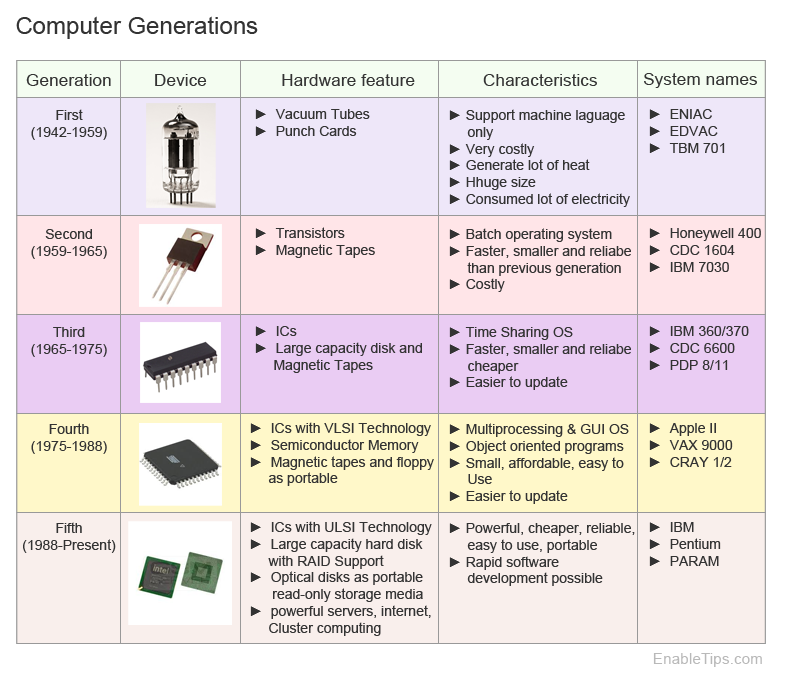
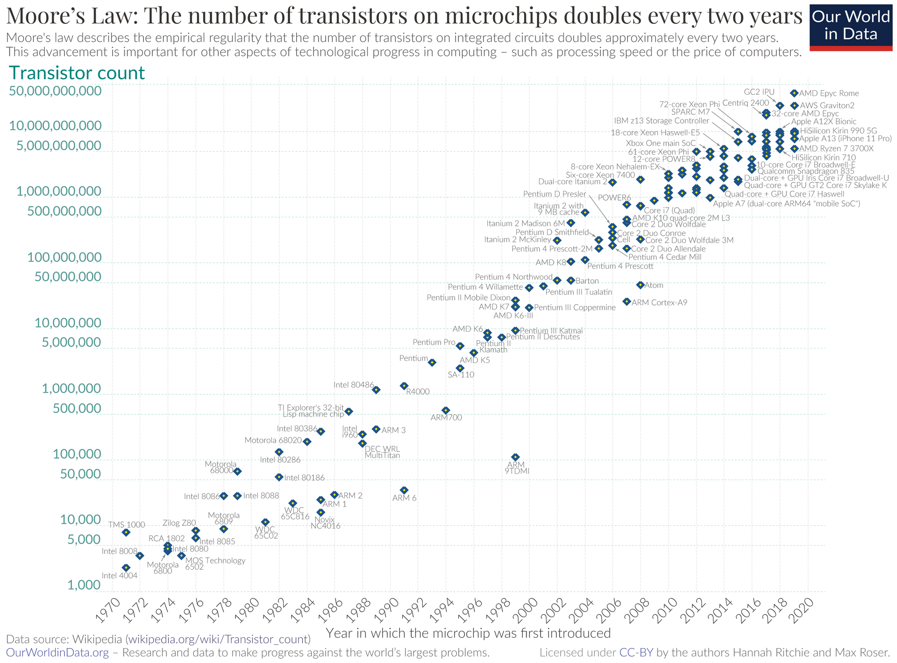
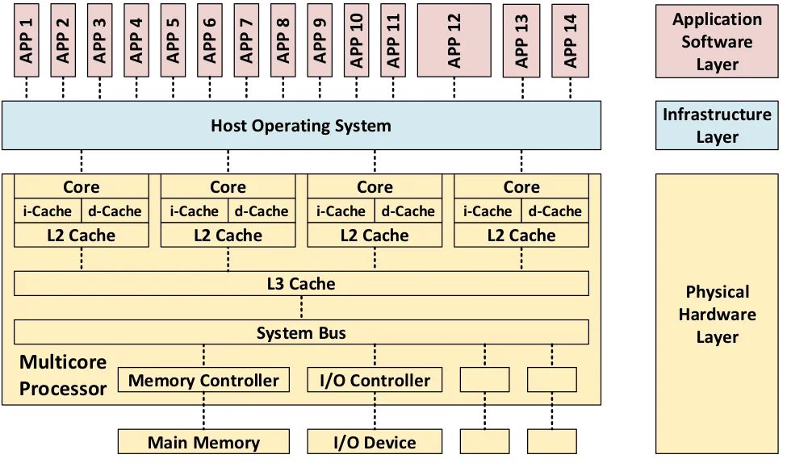
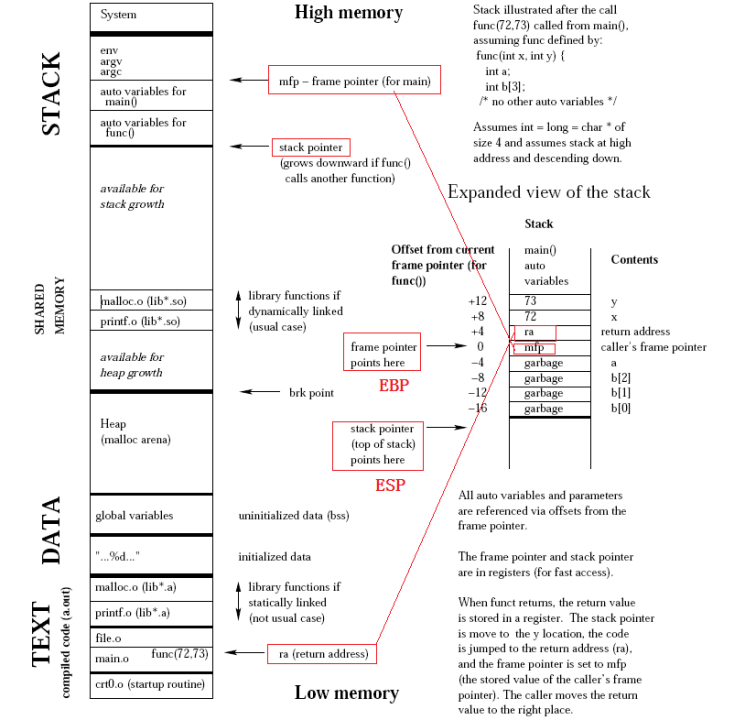

# Computer
---
The cs400 covers the rudimentary elements of Computer Science and aims to enhance the work-related self-efficacy of someone only with a degree in Mathematics. This first post traces the arc from mechanical calculators to modern accelerators, covering the hardware that underpins all computation.

- https://www.youtube.com/watch?v=ISJ44S5sZu8
- https://www.youtube.com/watch?v=HbgzrKJvDRw


## I
---

### **1.1. Computer**

<p style="margin-bottom: 12px;"> </p>

Charles Babbage's [Analytical Engine]() (1837) is widely regarded as the first conceptual design of a general-purpose digital computer. It separated a processing unit from memory, supported conditional branching and loops via three types of [punch cards](), and was Turing-complete by modern definitions. Ada Lovelace wrote what is considered the first computer program for it. Alan Turing, a century later, introduced the famous [Turing Machine]() in [Turing (1936)](https://www.cs.virginia.edu/~robins/Turing_Paper_1936.pdf), an abstract device that formalised the limits of what machines can compute, resolved the [Entscheidungsproblem](https://en.wikipedia.org/wiki/Entscheidungsproblem) negatively, and laid the theoretical foundation for modern computer science.

The [Electronic Numerical Integrator and Computer]() (ENIAC), completed in 1945 by J. Presper Eckert and John Mauchly is perhaps the first programmable electronic general-purpose digital computer. It used 17,468 [vacuum tubes](), occupied a 50×30-foot room, consumed 174 kW, and performed up to 5,000 additions per second, which is orders of magnitude faster than electromechanical predecessors. [Von Neumann (1945)](https://en.wikipedia.org/wiki/First_Draft_of_a_Report_on_the_EDVAC) then described the [stored-program concept](), the idea of storing both instructions and data in the same uniform memory, via the [Von Neumann architecture]() that still dominates computer design.

The [transistor](), demonstrated in 1947 by Bell Labs (Nobel Prize in Physics, 1956), replaced vacuum tubes with devices which were smaller, faster, more reliable, and consumed far less power. The next leap came with the [integrated circuit]() (IC). Jack Kilby at Texas Instruments showed the first working IC on a germanium substrate in 1958 (Nobel Prize in Physics, 2000), while Robert Noyce at Fairchild Semiconductor independently devised the planar silicon IC with aluminium metallisation (January 1959) that enabled mass production. The IC's key innovation was consolidating transistors, resistors, and capacitors onto a single [semiconductor]() substrate.

- <div style="position: relative; display: inline-block;">  <a href="https://www.facebook.com/photo.php?fbid=358029574671575&set=a.402508171866862&id=100063230468379" target="_blank" style="position: absolute; bottom: -8px; right: 4px; font-size: 12px;">[src]</a> </div>

<!-- - <div style="position: relative; display: inline-block;">  <a href="https://www.facebook.com/photo.php?fbid=358029574671575&set=a.402508171866862&id=100063230468379" target="_blank" style="position: absolute; bottom: -8px; right: 4px; font-size: 12px;">[src]</a> </div> -->

[Moore (1965)](https://www.cs.utexas.edu/~fussell/courses/cs352h/papers/moore.pdf) claimed that the number of transistors per IC had been doubling roughly every year (he revised to every two in 1975). This empirical trend, called [Moore's Law](), held for over five decades and guided the semiconductor industry's roadmap. The [Intel 4004](https://en.wikipedia.org/wiki/Intel_4004) (1971), originally commissioned by the Japanese calculator maker [Busicom]() before Intel retained the rights, was the first commercial [microprocessor]() packed 2,300 transistors into a 4-bit CPU on a 12 mm² die. The decade later, the [IBM PC](https://en.wikipedia.org/wiki/IBM_Personal_Computer) (1981), built with an open architecture and Intel's [8088]() processor, standardised personal computing and spawned the clone ecosystem that persists today.

A [motherboard]() provides the physical circuitry implementing the Von Neumann architecture, wiring a CPU socket, RAM slots, storages, I/O ports, and expansion slots via [buses]() and [chipsets](). Modern motherboards support add-in cards such as GPUs and NICs. [Firmware]() (BIOS or UEFI) performs [power-on self-tests]() (POST) and invokes a bootloader (e.g. GRUB - Linux, Boot Manager - Windows) which loads a kernel into RAM from storage. Although computers vary in purpose, as in [personal computers]() for general use, [mainframes]() for high-volume transaction processing, and [supercomputers]() for scientific simulation, they all rest on this stored-program model.

- <div style="position: relative; display: inline-block;">  <a href="https://www.refsmmat.com/courses/751/notes/index.html" target="_blank" style="position: absolute; bottom: -8px; right: 4px; font-size: 12px;">[src]</a> </div>

<!-- - <iframe width="500" height="285" src="https://www.youtube.com/embed/d86ws7mQYIg?si=5FHtHqUPzKoaNcbI" title="YouTube video player" frameborder="0" allow="accelerometer; autoplay; clipboard-write; encrypted-media; gyroscope; picture-in-picture; web-share" referrerpolicy="strict-origin-when-cross-origin" allowfullscreen></iframe> <p style="margin-bottom: 15px;"> </p> -->

<!-- - <figcaption> <a href="https://www.youtube.com/@BranchEducation" target="_blank">src</a> </figcaption> <iframe width="500" height="285" src="https://www.youtube.com/embed/h9Z4oGN89MU?si=lf9syZWAtt_f7k6z" title="YouTube video player" frameborder="0" allow="accelerometer; autoplay; clipboard-write; encrypted-media; gyroscope; picture-in-picture; web-share" referrerpolicy="strict-origin-when-cross-origin" allowfullscreen></iframe> -->

### **1.2. Central Processing Unit**

<p style="margin-bottom: 12px;"> </p>

A [central processing unit]() (CPU) executes instructions via the [fetch-decode-execute]() cycle: fetch the instruction at the address in the program counter, decode it to determine the operation and operands, execute it, write back results, and advance the counter. Each core contains an [arithmetic logic unit]() (ALU) for integer and logic operations, a [floating-point unit]() (FPU) for real-number computations, and a [control unit]() (CU) that orchestrates data flow. The CPU's [instruction set architecture](https://en.wikipedia.org/wiki/Instruction_set_architecture) (ISA) defines the binary interface between software and hardware, specifying the set of instructions, registers, addressing modes, and data types that programs may use.

The ISA landscape can be shaped by the [RISC vs CISC](https://en.wikipedia.org/wiki/Reduced_instruction_set_computer) debate. Intel's [x86](https://en.wikipedia.org/wiki/X86) (1978) exemplifies [CISC](): variable-length instructions (1-15 bytes), memory operands in arithmetic, and complex addressing modes. Whereas, Acorn Computers designed [ARM](https://en.wikipedia.org/wiki/ARM_architecture_family) in 1985, with only 25,000 transistors, and it exemplifies [RISC](): fixed-length instructions, a load/store architecture, and a large register file. [RISC-V](https://en.wikipedia.org/wiki/RISC-V), started in 2010 at UC Berkeley, provides a royalty-free, modular open-source ISA. In practice, the distinction has blurred as modern x86 CPUs (since 1995) internally decode CISC instructions into RISC-like micro-ops for [out-of-order execution]().

[Pipelining]() overlaps instruction execution stages so that, ideally, one instruction completes per cycle. The out-of-order execution, first realised in [Tomasulo's algorithm]() on the IBM System/360 Model 91 (1967), uses register renaming and reservation stations to dispatch ready instructions regardless of program order. [Branch prediction]() guesses the direction of conditional branches, reaching 95-99% accuracy but incurring a 10-20 cycle penalty on misprediction. [Speculative execution]() executes past unresolved branches and rolls back on misprediction, the mechanism famously exploited by the [Spectre](https://en.wikipedia.org/wiki/Spectre_(security_vulnerability)) and [Meltdown](https://en.wikipedia.org/wiki/Meltdown_(security_vulnerability)) vulnerabilities (2018).

- <div style="position: relative; display: inline-block;">  <a href="https://faculty.washington.edu/gmobus/Academics/TCSS372/Notes/crash1.html" target="_blank" style="position: absolute; bottom: -8px; right: 4px; font-size: 12px;">[src]</a> </div>

A CPU's [word size](), the number of bits it processes per operation, affects register width, addressable memory, and ISA design. A 32-bit CPU addresses 4 GB, while a 64-bit CPU addresses 16 EB in theory. [Opteron](https://en.wikipedia.org/wiki/Opteron) (2003) from AMD made the jump practical for x86 by introducing [x86-64](https://en.wikipedia.org/wiki/X86-64) (AMD64), an extension Intel later adopted as EM64T. [Clock speed]() measures how quickly instructions are issued, but around 2004 it plateaued at ~3-4 GHz when [Dennard scaling](https://en.wikipedia.org/wiki/Dennard_scaling) (1974), the principle that power density stays constant as transistors shrink, broke down at the 90 nm node as leakage current and threshold voltage stopped tracking.

The industry responded by shifting to [multi-core]() architectures: rather than one core at 6 GHz, use multiple cores at lower frequencies within the same power envelope. Modern examples include Apple's [M-series](https://en.wikipedia.org/wiki/Apple_M1) (ARM-based SoC with heterogeneous big.LITTLE cores and unified memory), AMD's [Zen](https://en.wikipedia.org/wiki/Zen_(microarchitecture)) (chiplet architecture with compute dies on 7 nm + I/O die on 12 nm, connected via Infinity Fabric), and Intel's Alder Lake (hybrid P-core + E-core design). This unlocked true [multiprocessing]() for many software developers, given that the OS can schedule independent processes onto separate cores in parallel rather than time-slicing them on a single core CPU.

- <div style="position: relative; display: inline-block;">  <a href="https://www.sei.cmu.edu/blog/multicore-processing/" target="_blank" style="position: absolute; bottom: -8px; right: 4px; font-size: 12px;">[src]</a> </div>

### **1.3. Random Access Memory**

<p style="margin-bottom: 12px;"> </p>

Computer memory forms a hierarchy trading off speed, capacity, and cost. At the top, [registers]() (<1 ns) hold data immediately needed by the CPU. A [cache hierarchy]() of L1 (~1 ns, per core), L2 (~3-10 ns, per core or shared), and L3 (~10-20 ns, shared) sits underneath, all built from [static RAM]() (SRAM) that stores each bit in a six-transistor flip-flop requiring no refresh. Main memory uses [dynamic RAM]() (DRAM), which stores each bit in a single transistor plus capacitor, far denser and cheaper but slower (~50-100 ns) and also requiring periodic refresh as capacitors leak charge. The well-known term [memory wall]() was coined by [Wulf and McKee (1995)](https://dl.acm.org/doi/10.1145/216585.216588).

Multiple cores caching the same address means one core's write can desync the others, thus [cache coherence](https://en.wikipedia.org/wiki/Cache_coherence) protocols keep them aligned by broadcasting updates. The [MESI protocol](https://en.wikipedia.org/wiki/MESI_protocol) assigns each cache line one of four states (Modified, Exclusive, Shared, Invalid) and uses [bus snooping]() or directory-based schemes to maintain consistency. [False sharing](https://en.wikipedia.org/wiki/False_sharing) occurs when unrelated data on the same cache line (typically 64 bytes) causes coherence traffic between cores. A well-designed program achieves high temporal and spatial [locality](), accessing the same data repeatedly and accessing contiguous addresses, to maximise [cache hit]() rates.

An instance of a program, known as a [process](), resides in RAM during execution. Its [memory layout]() is divided into segments: the [text segment]() contains executable machine instructions (read-only, with hardware-backed [execution prevention]() such as DEP or NX bit), the [data segment]() holds global and static variables, the [heap]() supports dynamically allocated data (via system calls like *malloc*/*free*), and the [stack]() handles function calls and local variables in a [last-in, first-out]() (LIFO) structure. Stack operations are fast because stacks are preallocated, but heap allocations are more flexible at the cost of fragmentation, cache misses, and potential [memory leaks]().

- <div style="position: relative; background-color: white; display: inline-block;">  <a href="https://www.linkedin.com/pulse/c-memory-layout-naveen-suppala/" target="_blank" style="position: absolute; bottom: -8px; right: 4px; font-size: 12px;">[src]</a> </div>

### **1.4. Persistent Storage**

<p style="margin-bottom: 12px;"> </p>

Persistent storage retains data without power. [Hard disk drives]() (HDDs) store data magnetically on spinning [platters]() with read/write [heads]() on an actuator arm. Performance is dominated by mechanical delays: [seek time]() (~10 ms average) for the head to reach the correct track, and [rotational latency]() (half the rotation period, ~4.2 ms at 7,200 RPM) for the desired sector to pass under the head. Sequential throughput reaches 100-200 MB/s, but random access is severely limited by these physical movements. By the 2010s, driven by falling NAND prices and Intel's early consumer SSDs, SSDs had largely replaced HDDs for primary storage.

[Solid-state drives]() (SSDs) use [NAND flash]() memory, where each cell is a transistor with an electrically isolated [floating gate](). Cells are organised into [pages]() (~4-16 KB, the unit of read/write) and [blocks]() (256-512 pages, the unit of erase). This asymmetry, where data is programmed at page level but erased at block level, necessitates [garbage collection]() (relocating valid pages from partially-stale blocks, then erasing them) and the [TRIM](https://en.wikipedia.org/wiki/Trim_(computing)) command (letting the OS notify the SSD when files are deleted). Each cell has a limited number of program/erase cycles (1K-100K, fewer as more bits are packed per cell), so [wear leveling]() distributes writes evenly across the device.

- <div style="position: relative; display: inline-block;">  <a href="https://www.backblaze.com/blog/ssd-vs-hdd-future-of-storage/" target="_blank" style="position: absolute; bottom: -8px; right: 4px; font-size: 12px;">[src]</a> </div>

## II
---

### **2.1. Graphics Processing Unit**

<p style="margin-bottom: 12px;"> </p>

Early GPUs were fixed-function hardware for graphics rendering, hardwiring vertex transformation, lighting, rasterisation, and texturing with no programmability. NVIDIA's [GeForce 256](https://en.wikipedia.org/wiki/GeForce_256) (1999), marketed as the world's first GPU, moved hardware transform and lighting onto the graphics card but kept the pipeline fixed. Programmable [shaders]() arrived with the [GeForce 3]() (2001), and the decisive shift came with the [Tesla]() microarchitecture (2006) whose [GeForce 8800 GTX]() was the first GPU with unified shaders. That is, vertex and pixel processors were merged into general-purpose streaming processors (128 SPs across 16 SMs, 681M transistors on 90 nm).

A GPU consists of [streaming multiprocessors]() (SMs), each a self-contained processing unit with its own register file, shared mem./L1 cache, warp schedulers, and execution units. The fundamental scheduling unit is a [warp](), a bundle of 32 threads executing the same instruction in lockstep, following the [SIMT](https://en.wikipedia.org/wiki/Single_instruction,_multiple_threads)  model. If threads within a warp take different branches ([warp divergence]()), the SM executes each path separately and wastes slots for inactive threads. Each SM runs multiple [warp schedulers]() that switch to a ready warp the moment one stalls on a memory access, hiding memory latency through parallelism (i.e. more threads) rather than large caches.

[Compute unified device architecture]() (CUDA), released in February 2007, made GPUs programmable for general-purpose computing by providing a C-based programming model that abstracted away graphics concepts. That is, general-purpose GPU required abusing graphics APIs which expressed computations as texture operations in [OpenGL shading language]() (GLSL) or [C for graphics]() (Cg). It enabled researchers to write parallel programs directly, given that wide range of linear algebra can be computed in parallel, and GPUs became natural accelerators beyond graphics, creating the ecosystem that would later prove decisive for the deep learning revolution.

- <div style="position: relative; display: inline-block;">  <a href="https://blog.paperspace.com/a-complete-anatomy-of-a-graphics-card-case-study-of-the-nvidia-a100/" target="_blank" style="position: absolute; bottom: -8px; right: 4px; font-size: 12px;">[src]</a> </div>

### **2.2. CUDA & Tensor Core**

<p style="margin-bottom: 12px;"> </p>

A [CUDA core]() is a scalar execution unit within an SM that performs one floating-point or integer operation per cycle per thread. They suit graphics and general parallel workloads but lack hardware for the dense [matrix multiply-accumulates]() (MMAs), which together with non-linear activation functions is the heart of deep learning. [Tensor cores](), introduced with [Volta]() in the Tesla V100 (2017), address this by performing a 4×4 [mixed-precision]() FMA (FP16 × FP16 → FP32), i.e. 64 multiply-adds per clock. These 640 tensor cores equipped in V100 can deliver 125 TFLOPS mixed-precision, an order of magnitude beyond its 15.7 TFLOPS FP32 CUDA throughput.

[Micikevicius et al. (2017)](https://arxiv.org/abs/1710.03740) showed that most forward and backward computations tolerate FP16 precision, with only weight updates requiring FP32 accuracy. Two techniques make this work: (i) maintaining an FP32 master copy of weights, and (ii) [loss scaling]() to preserve small gradients in FP16's limited range. PyTorch 1.6+ supports [automatic mixed precision]() (AMP) via *@torch.autocast* and *torch.GradScaler*, making this technique accessible with minimal code changes. Subsequent generations expanded tensor core support: the [Ampere](https://images.nvidia.com/aem-dam/en-zz/Solutions/data-center/nvidia-ampere-architecture-whitepaper.pdf) architecture in the A100 (2020) added [TF32](), [BF16](), INT8, and [structured sparsity]() (2:4 pattern, up to 2× speedup); 

The [Hopper](https://resources.nvidia.com/en-us-hopper-architecture/nvidia-h100-tensor-c) architecture in the H100 (2022) introduced the [Transformer Engine](), hardware-software logic that dynamically chooses between FP8 and FP16/BF16 precision per layer during training, maximising throughput while preserving accuracy. The [Blackwell](https://resources.nvidia.com/en-us-blackwell-architecture) architecture in the B200 (2024) also added 5th-generation tensor cores with a 2nd-generation Transformer Engine. That is, GPU hardware co-evolved as transformer models scaled. Tensor cores shifted to transformer-optimised primitives, adding native support for attention, lower-precision formats (FP8, FP4), and on-chip precision management to match the compute patterns of modern LLMs.

- <div style="position: relative; display: inline-block;">  <a href="https://developer.nvidia.com/blog/nvidia-ampere-architecture-in-depth/" target="_blank" style="position: absolute; bottom: -8px; right: 4px; color: white; font-size: 12px;">[src]</a> </div>

### **2.3. GPU Memory Hierarchy**

<p style="margin-bottom: 12px;"> </p>

GPU memory forms a deep hierarchy: each SM has its own [register file]() (~256 KB on Volta) and [shared memory]() / L1 SRAM (48-164 KB), all SMs share an [L2 cache]() (40 MB on the A100), and off-chip [global memory]() (HBM/GDDR) holds the most capacity at 200-600 cycle latency. Software has evolved to mask transfers at each boundary. PyTorch's *DataLoader(..., pin_memory=True)* paired with *tensor.to(device, non_blocking=True)* enables [direct memory access]() (DMA) from page-locked host RAM, overlapping host→device transfers with compute, while [FlashAttention]() tiles $Q$/$K$/$V$ into SMEM blocks so $A$ never materialises its $N \times N$ score matrix in HBM.

Both tricks raise [arithmetic intensity]() (i.e. FLOPs/byte moved from memory), pulling kernels off the memory-bound regime. The [roofline model](https://en.wikipedia.org/wiki/Roofline_model) in [S Williams (2009)](https://people.eecs.berkeley.edu/~kubitron/cs252/handouts/papers/RooflineVyNoYellow.pdf) formalised it by placing a kernel under either the flat ceiling of peak FLOPS ([compute-bound]()) or the sloped bandwidth ceiling ([memory-bound]()). Modern GPUs widen the gap, with an H100 needing ~300 FLOPs/byte to saturate BF16 tensor cores, far above what most kernels reach. Attention $\mathrm{softmax}(QK^\top)V$, embeddings $E[i]$, and activations $\sigma(x_i)$ are memory-bound, while matmuls $C = AB$ are compute-bound, and thus kernels need coalesced access, shared-memory tiling, and [occupancy]() tuning.

- <div style="position: relative; display: inline-block;">  <a href="https://github.com/Dao-AILab/flash-attention" target="_blank" style="position: absolute; bottom: -8px; right: 4px; font-size: 12px;">[src]</a> </div>

[High-bandwidth memory]() (HBM) achieves its performance through vertical stacking. Multiple DRAM dies interconnected by [through-silicon vias]() (TSVs) and mounted on a silicon interposer next to the GPU die. Each stack exposes a 1,024-bit interface at moderate clock speeds, opposite to GDDR's narrow buses at high clock speeds. Successive generations from SK Hynix and Samsung (HBM2 → HBM2e → HBM3 → HBM3e) pushed per-stack bandwidth from ~250 GB/s to ~1.2 TB/s, while the H100's five HBM3 stacks deliver 3.35 TB/s for 80 GB, and the H200 (HBM3e) reaches ~4.8 TB/s. Wider bus and lower power per bit make HBM the AI/HPC standard.

- <div style="position: relative; display: inline-block;">  <a href="https://news.skhynix.com/semiconductor-back-end-process-episode-4-packages-part-2/" target="_blank" style="position: absolute; bottom: -8px; right: 4px; font-size: 12px;">[src]</a> </div>

### **2.4. Interconnection**

<p style="margin-bottom: 12px;"> </p>

[Peripheral component interconnect express]() (PCIe) is the standard system interconnect, with each generation (Gen) roughly doubling bandwidth, from Gen 1 (2003, ~4 GB/s ×16), Gen 2 (2007, ~8 GB/s), Gen 3 (2010, ~16 GB/s), Gen 4 (2017, ~32 GB/s), Gen 5 (2019, ~64 GB/s), to Gen 6 (2022, ~128 GB/s via PAM-4 modulation). A PCIe link aggregates full-duplex serial lanes (×1, ×4, ×8, ×16) with differential signalling, replacing the shared parallel PCI and [AGP]() buses of the early 2000s. Yet for multi-GPU HPC and AI workloads this is insufficient, as training large models exchanges gradients, activations, and KV caches at rates that saturate even Gen 5.

[NVLink](https://en.wikipedia.org/wiki/NVLink) (Pascal) is a GPU-to-GPU interconnect doubling per generation, from 1.0 (160 GB/s, P100), 2.0 (300 GB/s, V100), 3.0 (600 GB/s, A100), 4.0 (900 GB/s, H100), to 5.0 (1.8 TB/s, B200). [NVSwitch](https://en.wikipedia.org/wiki/NVSwitch) (Volta) is a switch chip giving all-to-all GPU links at full NVLink bandwidth, past point-to-point topology limits. [DGX](https://en.wikipedia.org/wiki/Nvidia_DGX) systems pack these into multi-GPU servers (e.g. DGX H100 with 8× H100), while the GB200 NVL72 wires 72 Blackwell GPUs at 1.8 TB/s into a rack-scale node. The [nvidia collective communications library](https://github.com/NVIDIA/nccl) (NCCL) implements topology-aware all-reduce, all-gather, and broadcast primitives, the backbone of distributed training in PyTorch and JAX.

For cluster-level communication, [InfiniBand](https://en.wikipedia.org/wiki/InfiniBand), a switched fabric for HPC and AI clusters, provides [remote DMA](https://en.wikipedia.org/wiki/Remote_direct_memory_access) (RDMA), enabling zero-copy, kernel-bypass transfer at sub-$\mu\mathrm{s}$ latency. Bandwidth has grown from SDR (10 Gbps) to [NDR](https://en.wikipedia.org/wiki/InfiniBand) (400 Gbps), with GDR (1.6 Tbps) planned, and NVIDIA acquired Mellanox in 2020 for $6.9 billion. The emerging [Compute Express Link]() (CXL) standard, on the PCIe physical layer, adds cache-coherent protocols (CXL.io, CXL.cache, CXL.mem) letting CPUs and accelerators share coherent memory, unlocking heterogeneous compute and memory pooling.

- <div style="position: relative; display: inline-block;">  <a href="https://blog.paperspace.com/a-complete-anatomy-of-a-graphics-card-case-study-of-the-nvidia-a100/" target="_blank" style="position: absolute; bottom: -8px; right: 4px; font-size: 12px;">[src]</a> </div>

<!-- - <div style="position: relative; display: inline-block;">  <a href="https://blog.paperspace.com/a-complete-anatomy-of-a-graphics-card-case-study-of-the-nvidia-a100/" target="_blank" style="position: absolute; bottom: -8px; right: 4px; color: white; font-size: 12px;">[src]</a> </div> -->

### **2.5. Benchmark**

<p style="margin-bottom: 12px;"> </p>

GPU compute performance is measured in [floating-point operations per second]() (FLOPS). Peak FLOPS depends on core count, clock speed, and precision format, with lower precision yielding higher throughput since more operations fit per cycle. For instance, A100 delivers 19.5 TFLOPS at FP32 and 312 TFLOPS at FP16 via tensor cores, while achieved FLOPS falls well below peak in practice due to memory bottlenecks, kernel launch overhead, and idle cycles. Subsequently, [Model FLOPS utilisation]() (MFU), which is the ratio of achieved to theoretical peak, is the standard efficiency metric for training runs where 30-60% is typical at scale.

Notice that FLOPS and FLOPs, both looking like a twin, measure different things. FLOPS is a rate, counting floating-point operations completed per second, used in peak-performance claims as in "312 TFLOPS on the A100". [FLoating point OPerations]() (FLOPs) is a count measuring the total operations in a workload, used in ratios like arithmetic intensity (FLOPs/byte) or training budgets ($\sim 3.14 \times 10^{23}$ FLOPs for GPT-3). The two relate via "wallclock time" $\approx$ "total FLOPs" $/$ "effective FLOPS", so the same workload runs faster either by reducing its FLOPs (e.g. quantisation, sparsity) or by raising delivered FLOPS (e.g. better kernels, higher MFU).

| **Architecture** | **Year** | **AWS** | **Key Innovation** |
|---|---|---|---|
| Tesla | 2006 | - | Unified shaders; CUDA; 128 SPs (G80) |
| Fermi | 2010 | - | L1/L2 cache hierarchy; ECC memory; 512 CUDA cores |
| Kepler | 2012 | P2 (K80) | Dynamic Parallelism; Hyper-Q; SMX units |
| Maxwell | 2014 | G3 (M60) | Power efficiency; unified virtual memory |
| Pascal | 2016 | - | HBM2; NVLink 1.0; 16 nm FinFET; 3,840 CUDA cores (GP100) |
| Volta | 2017 | P3 (V100) | Tensor Cores; independent thread scheduling; 5,120 CUDA cores (V100) |
| Turing | 2018 | G4dn (T4) | RT Cores (ray tracing); 2nd-gen Tensor Cores |
| Ampere | 2020 | P4d (A100) | TF32/BF16/INT8/sparsity; 6,912 CUDA cores (A100); MIG |
| Hopper | 2022 | P5 (H100) | Transformer Engine (FP8); 4th-gen Tensor Cores; NVLink 4.0 |
| Blackwell | 2024 | P6 (B200) | 5th-gen Tensor Cores; NVLink 5.0 (1.8 TB/s); two-die design (208B transistors) |

<!-- <p style="margin-bottom: 20px;"> </p> -->
<!---->
<!-- We wrap up with an example. The [A100]() GPU packs 7 [graphics processing clusters]() (GPCs), each with 6 [texture processing clusters]() (TPCs) of 2 SMs apiece, totalling 84 SMs (108 in the full die, some disabled for yield). Each SM carries 64 CUDA cores, 4 third-gen tensor cores, 4 warp schedulers, 256 KB of registers, and 192 KB of configurable L1 cache/SMEM. Its memory hierarchy features a 40 MB L2 cache and 40/80 GB of HBM2e at 1.55-2.0 TB/s, while interconnects include NVLink 3.0 (600 GB/s bidirectional) and PCIe Gen 4 (64 GB/s), alongside [multi-instance GPU]() (MIG) technology that partitions a single GPU into up to 7 isolated instances. -->
<!---->
<!-- <!-- <p style="margin-bottom: 12px;"> </p> --> -->
<!---->
<!-- ```python -->
<!-- A100_for_illustration = { -->
<!--     'graphics_processing_cluster': [  # i.e. repeat for 7 GPCs -->
<!--         { -->
<!--             'name': 'GPC1', -->
<!--             'texture_processing_cluster': [  # i.e. repeat for 6 TPCs/GPC -->
<!--                 { -->
<!--                     'name': 'TPC1', -->
<!--                     'streaming_multiprocessor': [  # i.e. repeat for 2 SMs/TPC -->
<!--                         { -->
<!--                             'name': 'SM1', -->
<!--                             'cuda_cores': 64, -->
<!--                             'tensor_cores': 4, -->
<!--                             'warp_schedulers': 4, -->
<!--                             'sm_local_memory': {'registers': '256 KB/SM', 'L1_cache/SMEM': '192 KB'} -->
<!--                         }, -->
<!--                     ] -->
<!--                 }, -->
<!--             ] -->
<!--         }, -->
<!--     ], -->
<!--     'memory_hierarchy': { -->
<!--         'L2_cache': '40 MB', -->
<!--         'VRAM': {'interface': '5120-bit HBM2e', 'num_stacked': 5, 'memory': '40/80 GB', 'bandwidth': '1.55/2.0 TB/s'}, -->
<!--     }, -->
<!--     'interconnect': {'NVLink_3.0': '600 GB/s bidirectional', 'PCIe_Gen4': '64 GB/s'}, -->
<!--     'multi_instance_gpu': {'support': True, 'max_num_instances': 7} -->
<!-- } -->
<!-- ``` -->
