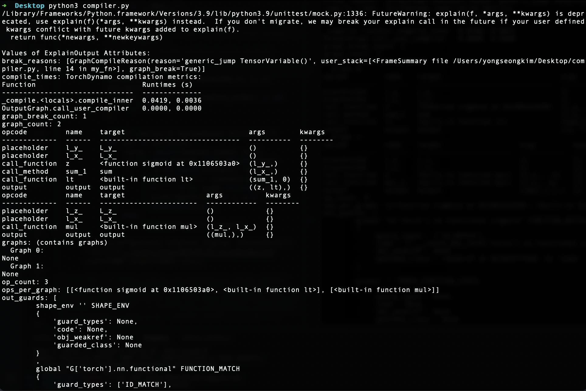

# DL Compilation
---
The cs400 covers the rudimentary elements of Computer Science and aims to enhance the work-related self-efficacy of someone only with a degree in Mathematics. This first post is intended to celebrate the announcement of *torch.compile* in early March 2023. Pytorch 1.0 was released in 2017 essentially to provide Python API wrapper around C++ kernel. 

## I
---
### **1.1. Introduction**

 

Charles Babbage designed the [Analytical Engine]() (1837), that is considered the first conceptualised general-purpose digital computer, which featured an arithmetic logic unit, control flow with conditional branching and loops, and memory modules. Later on, Alan Turing proposed the [Turing Machine]() (1936), establishing a theoretical framework for analysing computational capabilities and limitations, which laid the foundation for Computer Science. The [electronic numerical integrator and computer]() (ENIAC) (1945), developed by John Mauchly and J. Presper Eckert, became arguably the first programmable and electronic digital computer (i.e. against the Z3).

Computers, which vary in size, processing power, and usage, generally fall into one of these categories. i) [Personal computers]() (PCs): highly versatile systems used by individuals for a broad spectrum of tasks, including office work, web browsing, gaming, multimedia, and etc; ii) [mainframes](): used for high-volume transaction processing, large-scale data management, and mission-critical operations which require reliability and scalability; iii) [supercomputers](): deliver extraordinary processing speed and computing power, suitable for computational-heavy tasks such as climate modeling; As programmers, we write code to control and manipulate computers.

At a high-level, the [motherboard]() provides the physical circuitry for the key components of [Von Neumann architecture]() (1945). It serves as the central hub where the CPU socket, RAM slots, storage interfaces, I/O ports, and other peripherals communicate through [buses]() and [chipsets](). Modern computers also have expanded slots for graphics cards, sound cards, or additional storages, offering enhanced capabilities and/or flexibilities. The BIOS/UEFI [firmware]() being embedded into the motherboard performs [self-tests]() (POST) as soon as the power supplies, then the bootloader (e.g. Linux's GRUB, Windows's Boot Manager) loads the kernel from the SSD into RAM.

- <iframe width="500" height="285" src="https://www.youtube.com/embed/3PcIJKd1PKU?si=a7VnJqSVAdW54VsY" title="YouTube video player" frameborder="0" allow="accelerometer; autoplay; clipboard-write; encrypted-media; gyroscope; picture-in-picture; web-share" referrerpolicy="strict-origin-when-cross-origin" allowfullscreen></iframe>

<!-- - <figcaption> <a href="https://www.youtube.com/@BranchEducation" target="_blank">src</a> </figcaption> <iframe width="500" height="285" src="https://www.youtube.com/embed/h9Z4oGN89MU?si=lf9syZWAtt_f7k6z" title="YouTube video player" frameborder="0" allow="accelerometer; autoplay; clipboard-write; encrypted-media; gyroscope; picture-in-picture; web-share" referrerpolicy="strict-origin-when-cross-origin" allowfullscreen></iframe> -->

### **1.2. Central Processing Unit**

 

A [central processing unit]() (CPU or processor) executes a set of instructions, known as a [program](), via the [fetch-decode-execute]() cycle. Each core within the CPU has its own [arithmetic logic unit]() (ALU) and [control unit]() (CU). Modern CPUs have 4 to 64 cores, often with [floating point unit]() (FPU) to handle complex calculations and enable parallel processing. [Registers]()—the fastest memory—temporarily store data and instructions required immediately by the CPU, while the [cache]() hierarchy {'L1': smallest-fastest, 'L2': larger-slower, 'L3': largest-shared across cores} mitigates memory latency. Clock speed refers to the rate at which the component executes instructions.

<!-- - <iframe width="500" height="285" src="https://www.youtube.com/embed/d86ws7mQYIg?si=5FHtHqUPzKoaNcbI" title="YouTube video player" frameborder="0" allow="accelerometer; autoplay; clipboard-write; encrypted-media; gyroscope; picture-in-picture; web-share" referrerpolicy="strict-origin-when-cross-origin" allowfullscreen></iframe> 

 
 -->

### **1.3. Random Access Memory**

 

A computer memory is essentially an array of bytes each with a unique address. That is, [random access memory]() (RAM), register, and cache are all some abstractions. The latency of  [dynamic RAM]() (DRAM) can be estimated as $T_{\text{precharge}} + T_{\text{row activation}} + T_{\text{col. access}}$. The access is fastest if data is in an active row (i.e. contiguous) given that the physical design of memory cells heavily matters. [Static RAM]() (SRAM) is better suited for cache memory due to its high speed and stability, despite its higher cost. A disk sometimes can be used as [virtual memory](), via [paging]() or [segmentation](), to free up RAM for a process, while excessive swapping may lead to [thrashing]().

- 
  <a href="https://www.refsmmat.com/courses/751/notes/index.html" target="_blank" style="position: absolute; bottom: -8px; right: 4px; font-size: 12px;">[src]</a> 

### **1.4. Persistent Storage**

 

Persistent storage typically refers to [hard disk drives]() (HDDs) or [solid-state drives]() (SSDs). Both are non-volatile, and so can retain data without constant power supply. HDDs are mechanical in which the physical movement required in reading data yields slower access, whereas SSDs use electronic signals for much faster access. In recent years, many computing devices released have featured [non-volatile memory express]() (NVMe) SSDs, which operate over the [peripheral component interconnect express]() (PCIe) interface, enabling direct communication between the SSD and CPU. Flash memory, similar to SSDs, is also commonly used for storing applications.

- 
  <a href="https://www.backblaze.com/blog/ssd-vs-hdd-future-of-storage/" target="_blank" style="position: absolute; bottom: -8px; right: 4px; font-size: 12px;">[src]</a> 

### **1.5. I/O Device**

 

I/O devices (e.g. {I: 'keyboard', O: 'monitor'}) facilitate communication between a computer and its external environment by converting human actions into [binary]() which the CPU can process. For instance, each key press on a keyboard is translated into a corresponding binary using encoding standards. The [unicode transformation format-8]() (UTF-8) is a variable-length encoding standard that represents characters as sequences of 8-bit bytes, allowing for over a million distinct codepoints. It is a superset of all characters in widespread use today, including those defined by Hex and ASCII (i.e. a 7-bit encoding standard that only defines 128 characters for English text).

- 
  <a href="https://pandulaofficial.medium.com/unicode-utf-8-explained-with-examples-using-go-5f8b7f4521d" target="_blank" style="position: absolute; bottom: -8px; right: 4px; font-size: 12px;">[src]</a> 

## II
---
### **2.1. Graphics Processing Unit**

 

A [graphics processing unit]() (GPU) is an integral part of a graphics card, built for [single instruction, multiple threads]() (SIMT) execution of relatively simple and repetitive tasks. GPUs have significantly more cores than CPUs, with each operating at a lower clock speed, but they ensure efficient computation and high throughput together with high-bandwidth memory. [Floating point operations per second]() (FLOPS) measures the GPU’s computational capacity, while [floating point operations]() (FLOPs) indicates the computation demands of neural networks (NNs) which, in the case of LLMs, are hugely influenced by the number of parameters and amount of training tokens.

A [data processing unit]() (DPU) is a relatively newer programmable processor that is typically based on the [arm architecture](). It primiarily optimises data-centric (rather than computationally expensive) tasks occurring in large data centers, such as data movement, storage (e.g. compression and encryption), and network packet processing (e.g. routing and security). DPUs offload data management from CPUs and orchestrate data flow between CPUs, GPUs, and storages. NVIDIA introduced DPUs with robust security features, such as isolation of data flows with hardware-level encryption and access control, that is critical for cloud-native and virtual environments.
 
- 
  <a href="https://www.backblaze.com/blog/ssd-vs-hdd-future-of-storage/" target="_blank" style="position: absolute; bottom: -8px; right: 4px; font-size: 12px;">[src]</a> 

### **2.2. GPU Architecture**

 

Note that similar hardware specifications can exhibit huge differences in performance. For instance, the use of smaller [transistors]() may reduce power consumption, require lower voltage thresholds, generate less heat, and so allow for a higher density of transistors to be integrated into the design and enhancing overall performance. That is, architectural innovations are indeed important, even though data access patterns is the most influential factor for the maximum GPU utilisation. A simplified JSON representation of the [Ampere architecture](https://www.nvidia.com/en-us/technologies/) (A100 40GB) highlights key components that can also be found in there latestest models.

- A100 of the GA100 contains 7 GPCs, 7-8 TPCs/GPC, 2 SMs/TPC, up to 16 SMs/GPC, 108 SMs.

        { 
                graphics_processingc_cluster: [  # i.e. repeat for 7 GPCs
                        {
                                name: GPC1,
                                texture_processing_cluster: [  # i.e. repeat for 6 TPCs/GPC 
                                        {
                                                name: TPC1,
                                                "streaming_multiprocessor": [  # i.e. repeat for 2 SMs/TPC 
                                                        {
                                                                name: SM1
                                                                "cuda_cores": 64,
                                                                "tensor_cores": 4,
                                                                "warp_schedulers": 4,
                                                                "sm_local_memory": {"registers": "256 KB/SM", "L1_cache/SMEM": "192 KB"}
                                                        },
                                                ]
                                        },  
                                ]
                        },
                ],
                memory_hierarchy: {
                        "L2_cache": "40 MB"
                        "VRAM": {"interface": "5120-bit HBM2", "num_stacked": 5, "memory": "40 GB", "bandwidth": "1.55 TB/s"},
                },
                interconnect: {"NVLink-Bridge for 2 GPUs": "600 GB/s", "PCIe": "64 GB/s"}
                multi_instance_gpu: {support: True, max_num_instances: 7}
        }

### **2.3. GPU Processor**

 

A [streaming multiprocessor]() (SM) is a core processing unit responsible for executing thread blocks. When a [thread]() is the smallest unit of execution that handles a portion of tensor operation (e.g. an element-wise multiplication), [warps]() are threads organised with uniform size to execute instructions under the SIMT model, and a [block]() is a collection of warps assigned to each SM. If more thread blocks than the number of SMs are properly dispatched in modern GPUs, then the [warp scheduler]() facilitates the switching between warps within the SMs whenever a core stalls, and enables maximum utilisation via effective latency masking and higher throughput.

A [CUDA core]() in a SM is a general-purpose processing units, essentially an ALU, designed for parallel computing across thousands of threads. In particular, each CUDA core typically handles one instruction per cycle per thread, supporting both FP and INT operations for basic arithmetic ($+$, $\times$) and control flow ($\land$, $\lor$, $\neg$). The CUDA cores are absolutely well-suited for graphics rendering, simulations, and other general-purpose parallel workloads, but they still lack abilities in handling specialised mathematical operations such as a general matrix mutiplication (GEMMs), and therefore, must be supplemented by other components within a GPU to overcome.

- 
  <a href="https://blog.paperspace.com/a-complete-anatomy-of-a-graphics-card-case-study-of-the-nvidia-a100/" target="_blank" style="position: absolute; bottom: -8px; right: 4px; font-size: 12px;">[src]</a> 

A [tensor core](), introduced in the Tesla V100, is a specialised hardware unit designed for 64 [mixed-precision]() (i.e. FP16$\,\times\,$FP16 → FP32) matrix operations per clock cycle, often known as [fused multiply-add]() (FMA). Given that the back-propagation can be sensitive to low bit-width data formats such as FP16 as gradient values may fall outside the representable range, [Micikevicius et al. (2017)](https://arxiv.org/abs/1710.03740) i) kept the weights in an FP32 master copy; and (ii) up/down-scaled gradients via a scaling factor; to avoid underflow (i.e. zero clipping). Pytorch 1.6+ and a CUDA-capable GPU supports the package for [automatic mixed precision]() (AMP): '*@torch.autocast*' and '*torch.GradScaler*'.

- 
  <a href="https://developer.nvidia.com/blog/nvidia-ampere-architecture-in-depth/" target="_blank" style="position: absolute; bottom: -8px; right: 4px; color: white; font-size: 12px;">[src]</a> 

### **2.4. GPU Memory**

 

A memory hierarchy of GPU is optimised for high throughput and low latency. For instance, the V100 has integrated [shared memory]() (SMEM or SHM) and L1 cache, allowing L1 cache to take advantages of SMEM’s high-bandwidth performance and low-latency. In the A100, SMEM also supports rapid data exchange within the SM, and L1 cache stores frequently accessed data, both reducing the need for slower global memory access. The L2 cache, an off-chip memory shared across all SMs, enhances throughput to L1/SMEM by enabling quick access to larger datasets. It facilitates efficient data flow between SMs and the [high-bandwidth memory]() (HBM2). 

A high performance of HBM is essentially attributed to its vertical stacking architecture, i.e. multiple DRAM dies layered on top of each other and interconnected with [through-silicon vias]() (TSVs). However, an NVIDIA's [architect](https://www.youtube.com/watch?v=n6M8R8-PlnE&t=75s) described, a primary bottleneck in GPU utilisation is memory bandwidth, not peak TFLOPS. Theoretically, the highest bandwidth of the A100 is 9,750 GB/s (64 bytes/SM × 108 SMs × 1410 MHz), yet HBM2's 1,555 GB/s is 6.3 times less than what the SMs require. Data access patterns pose a another challenge in utilisation; Developers should be aware of the contiguous memory allocation as CUDA (C for GPU) does not enforce it.

- 
  <a href="https://developer.nvidia.com/blog/mastering-llm-techniques-inference-optimization/" target="_blank" style="position: absolute; bottom: -8px; right: 4px; font-size: 12px;">[src]</a> 

### **2.5. GPU Interconnect (TODO)**

 

An [interconnect]() is a communication link that enables data transfer between components within a computer system. In the context of GPUs and CPUs, interconnects allow different parts of a system—like processors, memory, storage devices, and expansion cards—to communicate efficiently. They can be physical connections like cables or circuit pathways on a motherboard, or even software protocols that manage how data flows between components. For example, tech like NVIDIA’s [NVLink]() is an inter-GPU and GPU-CPU Interconnects, managing data transfer across various types of multiple processing units, and allowing GPUs to efficiently share data. 

Whereas, system interconnects link the broader components of a system, such as processors, memory, storage, and expansion cards. Common interfaces like PCIe supports high-throughput connections essential for tasks that depend on rapid access to storage or network resources, maintaining data flow throughout the entire system... A large model may not fit into VRAM and force it to be distributed across ...

<!-- - 
  <a href="https://developer.nvidia.com/blog/?p=53977" target="_blank" style="position: absolute; bottom: -8px; right: 4px; color: white; font-size: 12px;">[src]</a> 
 -->
  
<!--  -->
<!--  -->

<!-- [Stanford CS149](https://www.youtube.com/watch?v=V1tINV2-9p4&list=PLoROMvodv4rMp7MTFr4hQsDEcX7Bx6Odp): Keep it for parallel processing chapter-->

<!-- https://www.youtube.com/watch?v=E48LqfvSSOw -->

## III
---
### **3.1. Accelerator**

 

One overtakes a control of ... has been continuously chaning.

- 
  <a href="https://spj.science.org/doi/10.34133/icomputing.0040" target="_blank" style="position: absolute; bottom: -8px; right: 4px; font-size: 12px;">[src]</a> 

  
Specialised processors are equipped to offload computational workloads from the CPU and increase performance. GPUs are currently the most widely recognised accelerator, whereas [application-specific integrated circuits]() (ASICs) offer greater efficiency despite their limited programmability. Notable ASIC-based hardware includes AWS Inferentia and Trainium, Google's TPU, and Apple's neural engine (ANE). As programs relying on specific accelerators are hardware-dependent and require compilation for the target machinery, they support [CPU fallback](https://www.quora.com/What-is-CPU-fallback) for a set of operations (e.g. a custom activation function within a ML model) which cannot be accelerated.

- 
  <a href="https://arxiv.org/abs/2002.03794" target="_blank" style="position: absolute; bottom: -8px; right: 4px; font-size: 12px;">[src]</a> 

<!-- - 
  <a href="https://medium.com/iosg-ventures/ai-training-and-inference-tech-stack-from-silicon-to-sentience-227a6eab3603" target="_blank" style="position: absolute; bottom: -8px; right: 4px; font-size: 12px;">[src]</a> 
 -->
  
<!-- -   -->

<!-- -  -->

<!-- -  -->

### **3.2. Compiler**

 

[Low-level virtual machine]() (LLVM), released in 2003 by Chris Lattner, is a compiler and toolchain set designed to minimise the need for language-hardware-specific compilers. Given that a compiler pipeline generally consists of front-, middle-, and back-end, LLVM takes an [intermediate representation]() (IR) from a front-end, apply multiple optimisation techniques, and emits an optimised IR in one of these extension: i) human-readable assembly (.ll); ii) bitcode (.bc); and iii) C++ object code (.o); LLVM follows the [static single assignment]() (SSA) form to simplify the analysis of dependencies among variables, and so allows an efficient program optimisation-in-compilation.

<!-- -  <a href="https://aosabook.org/en/v1/llvm.html" target="_blank">[src]</a> -->

<!-- -  <a href="https://www.skenz.it/compilers/llvm" target="_blank">[src]</a> -->

<!-- -   -->
  
In practice, a front-end compiler makes an IR with i) lexical analyser (Lexer): breaks the [source code]() into tokens (e.g. keyword, literal, identifier); ii) parser: builds an [abstract syntax tree]() (AST) based on the analysed tokens and the language's grammar to represent the hierarchical structure of the source code; iii) semantic analyser: further ensures correctness of the program beyond syntax (e.g. type checking, variable declarations, and scope resolution); and iv) IR generator: transforms the examined source code into a universal IR; Modern C compilers (e.g. Clang, GCC) are [self-hosting]() (i.e. also written in C/C++) and were developed via [bootstrapping]() processes.

Subsequently, the [LLVM Core]() takes a role in IR optimisations (e.g. dead code elimination), and a back-end can compile the outputted IR [ahead-of-time]() (AOT) (i.e. *llc* cmd), or execute it directly using a [just-in-time]() (JIT) compiler (i.e. *lli* cmd). However, as the expressive power of an IR and its ability to capture high-level semantics largely determine the sophistication of a front-end compiler, a lot of high-level languages have developed their own AST for associated infrastructures (e.g. Swift-SIL, Rust-MIR, Pytorch-TorchScript), and this led to the unnecessary coexistence of various modules (i.e. performing similar tasks) across languages and/or hardwares specific IRs.

- 
  <a href="https://www.researchgate.net/publication/35151154" target="_blank" style="position: absolute; bottom: -8px; right: 4px; font-size: 12px;">[src]</a> 

The [multi-level intermediate representation]() (MLIR), a sub-project of LLVM, is a framework positioned between a language's AST and LLVM IR, enabling different levels of abstraction to coexist. While it is a powerful representation, MLIR does not aim to provide low-level machine (-executable) code generation algorithms (e.g. register allocation, instruction scheduling), as such tasks are handled by lower-level optimisers (i.e. LLVM). Nor does it intend to serve as a source language for user-defined kernels, analogous to CUDA C++. MLIR uses [dialects]() to represent the semantics of both general-purpose and [domain-specific languages]() (DSLs) as first-class entities.

One has to define domain-specific operations, types, and attributes in MLIR by extending the IR to make a custom dialect. Specifically, it involves i) specifying the dialect using MLIR’s C++ API or [table-driven declarative rewrite rule]() (DRR), ii) defining the semantics of the new operations, and iii) integrating them into the MLIR framework. Numerous custom dialects illustrate MLIR’s adaptability, including the Standard dialect for general-purpose computation (e.g. arithmetic), the LLVM dialect for LLVM IR interoperability, and the Tensor and Linalg dialects for some maths. The GPU and SPIR-V dialects are well-known domain-specific dialects for hardware acceleration.

- 
  <a href="http://lastweek.io/notes/MLIR/" target="_blank" style="position: absolute; bottom: -8px; right: 4px; font-size: 12px;">[src]</a> 

<!-- -  <a href="https://dl.acm.org/doi/fullHtml/10.1145/3458744.3473354" target="_blank">[src]</a> -->

<!-- -  <a href="https://blog.lambdaclass.com/cairo-and-mlir/" target="_blank">[src]</a> -->

<!-- -  <a href="https://codeplay.com/portal/blogs/2024/02/09/experiences-building-an-mlir-based-sycl-compiler" target="_blank">[src]</a> -->

<!-- - <iframe width="500" height="285" src="https://www.youtube.com/embed/m8G_S5LwlTo?si=oVZN98jpLrCEqIju" title="YouTube video player" frameborder="0" allow="accelerometer; autoplay; clipboard-write; encrypted-media; gyroscope; picture-in-picture; web-share" referrerpolicy="strict-origin-when-cross-origin" allowfullscreen></iframe> -->

### **3.3. CUDA & Triton**

 

[Compute unified device architecture]() (CUDA) is a parallel computing platform featuring compilers, libraries, and developer tools. It was created in 2006 by NVIDIA and embedded within C/C++ as a DSL for programming their own GPUs. [NVIDIA CUDA Compiler]() (NVCC) which uses NVVM, an NVIDIA derivative of LLVM, compiles a .cu into a i) [parallel thread execution]() (.ptx) human-readable assembly; or ii) directly executable [CUDA-specific binary]() (.cubin); The .cu extension allows NVCC to delegate the compilation of [host code]() (i.e. CPU-related: *#include*) to Clang, and focus on compiling [device code]() (i.e. code with CUDA extension: *\_\_global\_\_*, and *\_\_device\_\_*).

- 
  <a href="https://www.kapilsharma.dev/posts/deep-dive-into-triton-internals/" target="_blank" style="position: absolute; bottom: -8px; right: 4px; font-size: 12px;">[src]</a> 

CUDA programming in C/C++ is generally more cumbersome due to the need for manual handling of: i) memory coalescing; ii) SMEM synchronisation and conflict management; iii) scheduling within SMs; and iv) scheduling across SMs; Thus, OpenAI introduced [Triton]() in 2021 as Python-based framework and DSL, making it easier for ML researchers and practitioners to write optimised GPU code (i.e. primitive tensor operations). Built on top of the LLVM-MLIR infrastructure, Trition automates the first three challenges inherent to the SIM"T" model by enabling tile-based programming with multi-dimensional blocks (i.e. rather than operating on individual "T"hreads). 

<!-- - 
  <a href="https://www.zdnet.com/article/openai-proposes-triton-language-as-an-alternative-to-nvidias-cuda/" target="_blank" style="position: absolute; bottom: -8px; right: 4px; font-size: 12px;">[src]</a> 
 -->
  
<!-- -  -->

<!-- -  <a href="https://www.nvidia.com/en-us/glossary/numba/" target="_blank">[src]</a> -->

The [Triton compiler]() captures the AST of a kernel, that is written in *triton.language* and also decorated by *@triton.jit*, and progressively generates IRs through MLIR dialects: i) Triton Tensor Graph IR (TTGIR): a hardware-agnostic IR for high-level opt.; ii) Triton-GPU IR: a more optimised hardware-specific IR for efficient GPU code generation; and iii) LLVM IR: LLVM lowers the IRs into an executable; While it offers finer control over SMEM and HBM compared to eager mode PyTorch (i.e. had the C/C++ backend), the throughputs of the fused softmax in Trition seems higher than both the *F.softmax* and PyTorch-native implementation invoked with  *@torch.jit.script*.

<!-- Note that programming in Triton differs from [Numba](), despite both uses LLVM in generating an executable, the latter directly translates Python code into LLVM IR, focusing on low-level JIT compilation without the multi-level abstraction capabilities. This distinction makes Triton more suitable for domain-specific tasks in machine learning systems, enabling a seamless integration to ML compiler stacks (i.e. "ML graphs"). -->

- 
  <a href="https://blog.ujw.tw/triton-compiler-tutorial-practice/" target="_blank" style="position: absolute; bottom: -8px; right: 4px; font-size: 12px;">[src]</a> 

<!-- -  <a href="https://github.com/triton-lang/triton/issues/1192" target="_blank">[src]</a> -->

<!-- -  <a href="https://pytorch.org/blog/triton-kernel-compilation-stages/" target="_blank">[src]</a> -->
  
<!-- https://tinkerd.net/blog/machine-learning/cuda-basics/ -->

### **3.4. Pytroch 1.x**

 

PyTorch (PT), evolved from the [Torch7]() library, is an open-source deep learning (DL) framework developed by Facebook. TensorFlow 1.x began with [static computation graph]() (SCG) for finer serialisation and deployment, but PT 1.x instead export [dynamic computation graph]() (DCG) for flexibility and easy debugging. A [*torch.Tensor*]() class is the core data structure representing homogeneous, multi-dim. rectangular arrays. These attributes: [*requires_grad, grad, grad_fn*] are the key to enable [automatic differentiation]() (AD) within a DCG. Similar to *numpy.array*, tensors also contain useful metadata: [*size, stride, dtype, device, layout*] which describe its shape in memory.
 
<!-- Torch was implemented in [Lua]() for scientific computing. -->

PT 1.x. include many built-in Function classes (e.g. AddBackward0, MulBackward0) for instances and subclasses of *torch.Tensor* (e.g. *nn.Module.weight*, *torch.nn.Parameter*) to enable gradient computation and backpropagation. A new operation can also be defined via [*torch.autograd.Function*](). During execution, PT dynamically builds a DCG, where *torch.Tensor* instances and *torch.autograd.Function* objects act as the nodes, and the edges represent the data flow and logic of the program. *Tensor.register_hook* may also be invoked during the backward pass to inspect, modify, and even visualise gradients as they are computed within a neural network (NN) model.

- 
  <a href="https://afuncan.com/" target="_blank" style="position: absolute; bottom: -8px; right: 4px; font-size: 12px;">[src]</a> 

<!-- - 
  <a href="https://pytorch.org/blog/how-computational-graphs-are-executed-in-pytorch/" target="_blank" style="position: absolute; bottom: -8px; right: 4px; font-size: 12px;">[src]</a> 
 -->

<!-- <iframe width="560" height="315" src="https://www.youtube.com/embed/MswxJw-8PvE?si=OCOqZErQrPaWxEnv" title="YouTube video player" frameborder="0" allow="accelerometer; autoplay; clipboard-write; encrypted-media; gyroscope; picture-in-picture; web-share" referrerpolicy="strict-origin-when-cross-origin" allowfullscreen></iframe> -->

PT 1.x heavily  rely on its C++ backend to address the slow executions associated with [eager mode](https://pytorch.org/blog/optimizing-production-pytorch-performance-with-graph-transformations/). The Python API primarily served as a high-level interface, delegating tasks to lower-level modules designed for AD and other tensor operations. In particular, [A tensor library]() (ATen) is a C++ wrapper for C and CUDA libraries such as the [math kernel library]() (MKL), [CUDA deep neural network]() (cuDNN), and [CUDA basic linear algebra subprogram]() (cuBLAS). Note that the lowest-level modules handle primitive tensor operations without native AD supports, and thus ATen incorporates an autograd engine, preserving flexibility while leveraging the performance of CUDA.

[Alban Desmaison](https://pytorch.org/docs/stable/community/persons_of_interest.html) commented: "Given that Torch7 (i.e. written in [Lua]()) relied on these C/C++ libraries: Tensor Handling (TH/THNN) and Tensor Handling CUDA (THC/THCUNN being CUDA dependent) for CPU/GPU computing, i) the initial PT is simply a Python wrapper + new autograd engine + TH\*; ii) Aten was developed later to provide more preferred C++ interfaces, resulting in new functionalities in PT 1.x being implemented within ATen rather than TH\*; iii) [LibTorch]() is the distribution of PyTorch, a replacement and/or supplmenet for the Python wrapper (i.e. which used [Pybind11]() to wrap ATen), enabling more direct access to the core backends through the C++ API".
<!-- https://medium.com/@pouyahallaj/libtorch-the-c-powerhouse-driving-pytorch-ee0d4f7b8743 -->

<!-- Facebook utilised LibTorch and added *torch.jit.trace* to support JIT compilation. It records operations during a forward pass with fixed inputs, and emits a SCG that is ideal for models with predictable execution paths (i.e. control flows may break compilation). They later added *torch.jit.script* which directly compiles Python code (for input-dependent models). Any [TorchScript]() program can be saved from a Python process and loaded in a process where there is no Python dependency (i.e. train.py $\to$ deploy.cpp). It may be exported to the [Open Neural Network Exchange]() (ONNX), but dynamic models may need adjustments to meet ONNX's static graph requirements. -->

They also featured [TorchScript]() (TS) based on LibTorch to support [script mode](). The two front-end compilation APIs: [*torch.jit.trace*]() and [*torch.jit.script*]() can produce a SGD as the TS IR. The former runs a model with [proxies]() and only traces (i.e. records) tensor operations, whereas the latter parses the entire source code in .py. Any TS-compiled program can be executed by the PT JIT runtime or exported into non-Python env. (e.g. train.py $\to$ deploy.cpp), where the [Open Neural Network Exchange]() (ONNX) is the industry standard format that they shall comply with. Scripting may be more flexible as it analyses pure Python code (e.g. allows dynamic control flows in NNs).

<!-- - One of the standout features that facilitate the interaction between PyTorch (Python) and LibTorch (C++) is TorchScript. TorchScript is a subset of PyTorch that allows models to be serialized and run independently of Python, making it possible to train models in Python and deploy them in C++ environments seamlessly. -->

- 
  <a href="https://github.com/t-vi/acdl2020/blob/master/pytorch_introduction.ipynb" target="_blank" style="position: absolute; bottom: -8px; right: 4px; font-size: 12px;">[src]</a> 

### **3.5. Pytroch 2.x (TODO)**

 

In fact, TS does not support certain libraries or Python features (e.g. generator, comprehension), instead forces incompatible modules to be either wrapped/avoided. To overcome these limitations, the [*torch.compile*]() API was introduced as a domain-specific compiler for [Pytorch 2.0]() (PT2). It identifies PyTorch-specific regions within a program and represents them as a DCG for optimisation or execution, while arbitrary Python code continues to be interpreted as usual, maintaining its "pythonic" nature. Shortly, *torch.compile* performs: i) graph acquisition (i.e. tracing); ii) graph lowering (i.e. high-level optimisation); and iii) seamless integration to prepackaged back-ends.

- 
  <a href="https://pytorch.org/get-started/pytorch-2.0/" target="_blank" style="position: absolute; bottom: -8px; right: 4px; font-size: 12px;">[src]</a> 

<!-- - 
  <a href="https://pytorch.org/blog/training-production-ai-models/?utm_source=social-facebook&utm_medium=m4d&utm_campaign=organic&utm_content=post-url&utm_offering=artificial-intelligence&utm_product=training-production-ai-models_01302024&eventSource=organicsocialm4d&content_id=FmvhyYO3MCBLU8r" target="_blank" style="position: absolute; bottom: -8px; right: 4px; font-size: 12px;">[src]</a> 
 -->

<!-- - 
  <a href="https://python.plainenglish.io/torchdynamo-igniting-performance-in-pytorch-models-25ca6505b271" target="_blank" style="position: absolute; top: 0px; left: 4px; font-size: 12px;">[src]</a> 
 -->

<!-- 
- TorchDynamo is a generalisation of torch.jit.trace
  - 자연스레 Autograd도 AOT-mode에서 fx (i.e. graph)로 동작하도록 rebuild.
  - Inductor는 다양한 compiler back-end에 붙일 수 있는데.. (얘가 fused ops.를 맡음)
  - PyTorch 2.0 (PT2)의 default back-end는 Triton이고.. fx에서 IR로 lowering을 마친 ops을 Inductor가 fusion하여 Triton의 kernel로 표현함. -->

The compiler of CPython compiles source code into [bytecode]() (i.e. .pyc). A [CodeObject]() is generated during the compilation process to store the bytecode instructions along with static data (e.g. consts list, variable names, exception table) required for execution. As the *PyEval_EvalCode* function in [Python/ceval.c]() executes a CodeObject, a [PyFrameObject]() is constructed to hold the runtime state for the execution, where its *f_code* attribute points to the corresponding CodeObject (i.e. the CodeObject acts as a blueprint). By default, the *PyEval_EvalFrame* calls *_PyEval_EvalFrameDefault* for frame execution, but as per [PEP 523](), the evaluation function is configurable.

<!-- Compiled graphs are cached in the Python process's (in-) memory and reused to strike a balance between Python's dynamic nature and high execution speed of static graphs.  -->

[TorchDynamo]() (i.e. Dynamo) serves as the front-end, leveraging PEP 523 (i.e. frame evaluation API) and the [functional transformation]() (FX) framework to represent Python code as high-level SCGs compatible with downstream compilers. For graph acquisition, Dynamo i) [hooks]() into bytecode execution using PEP 523; ii) analyses bytecode and identifies torch.* and non-torch.* bits of a program; and iii) convert compilable regions into a graph; *torch.fx.symbolic_trace* can be used with [proxies]() to simulate captured torch.* operations and record them as nodes in an [FX graph](). A [graph break]() occurs when it encounters operations it cannot capture during dynamic tracing.

When a graph break occurs, operations that cannot be captured by Dynamo (e.g.) are processed by the default interpreter, bypassing the graph representation. Reducing breaks is vital in PT2 (i.e. dynamic-to-static compilation) as they degrades performance. APIs like *torch._dynamo.explain* and *torch.fx.graph_module.GraphModule.print_tabular* help diagnose graph breaks. Apparently, *torch.compile* offers the *fullgraph* parameter, controlling the granularity of tracing. When set to *True*, it requires the entire function to be capturable into a single graph, whereas the default *False* attempts to discover compileable regions in the function that it will optimise.

<!-- Developers can also catch graph breaks early by wrapping function calls in try-except blocks. -->

- 
  <a href="https://pytorch.org/docs/stable/torch.compiler_dynamo_overview.html" target="_blank" style="position: absolute; bottom: -8px; right: 4px; font-size: 12px;">[src]</a> 

<!-- - E.g. ...

        import torch
        import torch._dynamo as dynamo
        
        def my_backend(gm: torch.fx.GraphModule, example_inputs: list[torch.Tensor]):
              print("Custom backend called with FX graph:")
              gm.graph.print_tabular()
              return gm.forward

        def my_fn(x, y):
              z = torch.nn.functional.sigmoid(y)
              if x.sum() < 0:
                   x = x * -1
              return z * x

        if __name__ == '__main__':
              x, y = torch.randn(10), torch.randn(10)
              explain_output = dynamo.explain(my_fn, x, y)
                      
              # dynamo.reset() 
              # my_fn_opt = dynamo.optimize(my_backend)(my_fn)(x, y)

              print("\nValues of ExplainOutput Attributes:")
              for attr in [attr for attr in dir(explain_output) if not "__" in attr]:
                   value = getattr(explain_output, attr)
                   if isinstance(value, list) and len(value) > 0 and hasattr(value[0], "graph"):
                          print(f"* {attr}: (contains graphs)")
                          for i, g in enumerate(value):
                               print("\n", f"  Graph {i}: ", "\n");  g.graph.print_tabular()
                          print("")
                  else:
                          print(f"* {attr}: {value}")
- res ... 
  
  
  
 -->
  
<!-- -  <a href="https://semianalysis.com/2023/01/16/nvidiaopenaitritonpytorch/" target="_blank">[src]</a>  -->

<!-- Operations that Dynamo cannot support (e.g. logging, printing, tensor-dependent conditions) fall back to CPython (i.e. default interpreter).  -->

A set of [guards]() collectively ensures the correctness and efficiency of compiled graphs by validating that runtime conditions remain consistent with the assumptions made during tracing. When analysing bytecode, it seeks for the operation that cannot be represented in the graph but requires the value of the graph (e.g. print tensors, tensor-dependent control flows). E.g. if a tensor shape is shifted by a  new batch size, the shape guard triggers a recompilation, discarding the cached graph and retracing the function to accommodate the new state. Dynamo supports [symbolic shape](), i.e. it analyses and generalises its expected shape whenever the shape guard fails.

<!-- press "cmd + ." with some lines of code-->
- 
  <a href="https://pytorch.org/get-started/pytorch-2.0/" target="_blank" style="position: absolute; bottom: -8px; right: 4px; font-size: 12px;">[src]</a> 

Dynamo handling graph capture and AOTAutograd optimizing the autograd parts of the captured graphs. AOT Autograd optimizes gradient computation for the captured subgraphs, particularly for functions requiring backpropagation. How it works: Once Dynamo identifies a subgraph, AOTAutograd takes it and splits it into forward and backward computation graphs. These graphs can then be further optimized (e.g., using backend compilers like TorchInductor, TVM, or others). 

It works by analyzing the forward pass of your model and generating an optimized backward pass ahead of time. This is in contrast to the traditional approach where the backward pass is dynamically generated during runtime. By doing this ahead of time, AOT Autograd can apply optimizations that are not possible at runtime. During the forward pass, intermediate values (activations) are usually saved for use in the backward pass. AOTAutograd can employ techniques like activation checkpointing or recompute-on-demand to manage this memory-pressure tradeoff.

While the backward pass is typically more computationally expensive, its performance is tightly coupled to the efficiency of the forward pass. That is, the backward pass relies on the intermediate results produced during the forward pass (e.g., activations, pre-activation values). Hence optimizing the forward pass can reduce the amount of intermediate data that needs to be saved or recomputed, leading to reduced memory usage and faster backward computation. By treating the forward and backward passes as distinct subgraphs, AOTAutograd can: optimize the forward pass independently. It includes fusing operations, eliminating redundant computations, or reducing memory footprints. Moreover, it can generate a minimal backward pass tailored to the forward pass.

<!-- along with the prepackaged compilers -->

- 
  <a href="https://dev-discuss.pytorch.org/t/torchdynamo-update-6-training-support-with-aotautograd/570" target="_blank" style="position: absolute; bottom: -8px; right: 4px; font-size: 12px;">[src]</a> 

<!-- MLIR is integrated into specific components of PyTorch, particularly in TorchDynamo and TorchInductor, to improve performance and enable hardware-specific code generation.... -->

<!-- - 
  <a href="https://github.com/llvm/torch-mlir/blob/main/docs/images/roadmap_frontend.png" target="_blank" style="position: absolute; bottom: -8px; right: 4px; font-size: 12px;">[src]</a> 
 -->

<!-- - 
  <a href="https://www.lei.chat/posts/mlir-codegen-dialects-for-machine-learning-compilers" target="_blank" style="position: absolute; bottom: -8px; right: 4px; font-size: 12px;">[src]</a> 
 -->
<!-- 
-  <a href="https://www.lei.chat/posts/mlir-codegen-dialects-for-machine-learning-compilers/" target="_blank">[src]</a> -->

FX graphs, as the container of key operations (i.e. computations) in a program, are core elements of Torch IR. Using Aten and [primitive operations]() (PrimTorch), Torch IR can be converted to even lower-level representations and get closer to the target backend. PrimTorch are a set of highly optimized and hardware-specific operations that can further speed up the computation, particularly on GPUs. They are often used to replace more general operations with more specialized ones that take better advantage of hardware features.

<!-- PrimTorch canonicalizes ~2000+ PyTorch operators down to a closed set of ~250 primitive operators that developers can target to build a complete PyTorch backend. This substantially lowers the barrier of writing a PyTorch feature or backend... TorchInductor is a deep learning compiler that generates fast code for multiple accelerators and backends. For NVIDIA and AMD GPUs, it uses OpenAI Triton as a key building block.... It uses Triton to emit an executable, and supports various backends including TensorRT, NVFuser, OpenMP, XLA, [and others](https://github.com/merrymercy/awesome-tensor-compilers?tab=readme-ov-file#compiler-and-ir-design) (i.e. mostly LLVM-based)...

[AOTAutograd](), as it was before, generates a backward computation graph... [TorchInductor]() then consumes to yield optimised kernels... The internals of *torch.compile* can be used independently. For example, symbolic tracing in isolation could capture a form of the code purely for analytical purposes (i.e. not transformation), or code generator may be utilised for programmatically generating models (e.g. based on an arbitrary config file).

  
<!-- - ONNX is just a framework-independent storage format...
- Pytorch -> ONNX -> TensorRT is popular when using NVIDIA's GPUs
  - You don't often need to write any extra code for PT -> ONNX conversion in 99.9% cases, *torch.onnx.export* does the job.
  - However, one of the issues with ONNX is that you 1. need to have a valid mapping from all PyTorch operators to ONNX operators and 2. you need a valid mapping of all ONNX operators to TensorRT Layers via the ONNX parser. This is not always the case and has been a blocking problem for many users
    - Torch-TensorRT uses TorchScript which is a built in IR for PyTorch which has much better coverage of PyTorch Operators. *torch_tensorrt.compile* goes directly from TorchScript to TensorRT
      - TorchScript is an intermediate representation of a PyTorch model (subclass of nn. Module ) that can then be run in a high-performance environment like C++
      - model with control flow is the only case when TorchScript is superior to any other ONNX-supported runtime -->
  
[TorchInductor]() (i.e. Inductor) is ... 
PT2 provide various back-ends.... i) training & inference: {TorchInductor, CUDA graphs, IPEX, ONNX}; ii)  inference-only: {Torch-TensorRT, IPEX , TVM, OpenVINO}. Note that IPEX is for CPU. By using user-defined Triton kernels with torch.compile, you can integrate these optimized computations into your PyTorch model, potentially achieving significant performance improvement. That is, a kernel fusion and quantisation (see **) are core part of its LLVM-kind optimisation pipeline.... A graceful compilation requires some understanding of its internals .... Compilation stack is followed.... We shall actively use Triton because CUDA is closed.... 

<!-- Next parts of the post contains some research papers that influenced the use/design of modern hardware... -->

## **IV**.
---
### **4.1. Model Training - LLM**

 

[Hoffmann et al. (2022)](https://arxiv.org/abs/2203.15556) revealed the "Scaling Laws for Neural Language Models", introduced in [Kaplan et al. (2020)](), by stating that the optimal compute utilisation in FLOPs is achieved by proportionally scaling model parameters and training tokens. In particular, they observed that extremely large LLMs, such as *GPT-3 (170B)* and *Gopher (280B)*, have been underfitted due to an insufficient amount of training data relative to their parameter counts, and so trained *Chinchilla (70B)* with the same compute budget as *Gopher* but with 1.4 trillion tokens (i.e. 4x bigger), outperforming many parameter-heavy models on many benchmarks, except those related to Maths.

- 

### **4.2. Model Serving - LLM**

 

DeepMind's new training principles hyped smaller LLMs, inspired by *Transformer* introduced in [Vaswani et al. (2017)](), but inferencing at the production level needs further compute and memory optimisations, since they generate $K$ and $V$ autoregressively during the decoding. A [KV cache]() is specifically designed to reduce FLOPs by storing precomputed vectors in VRAM, but its size scales quickly with $\text{batch size}$ * $\text{context size}$ * $2$ * $\text{num. layers}$ * $\text{dim. hidden}$ * $\text{sizeof(precision)}$, limiting large context sizes (e.g. ≥ 1M). For example, a *LLaMA-2 (7B)* loaded in FP16/BF16 (2 bytes/element) and a batch size of 1 needs 14GB for weights and 2GB for cache.

- 
<!-- https://developer-blogs.nvidia.com/wp-content/uploads/2023/11/key-value-caching_.png -->

The MHA layer in *Transformer* computes each attention head $h_{i} = \text{Attn}(Q_{i}, V_{i}, K_{i}) = \text{SM}(X W_{i}^{(q)} (X W_{i}^{(k)})^T / \sqrt{d_{\text{head}}}) X W_{i}^{(v)}$, where $h_{i} \in \mathbb{R}^{\text{batch size} \,\times\, \text{seq. length} \,\times\, \text{dim. head}}$, but studies reported that using MHA with KV cache for longer sequences $X$ is infeasible. In fact, [Shazeer (2019)](https://arxiv.org/abs/1911.02150) proposed MQA that uses a single set of mean-pooled key-value pairs for all $h_{i}$, to lower memory requirements for such $X$ at the cost of a potential degradation in model accuracy. [Ainslie et al. (2023)](https://arxiv.org/abs/2305.13245), a group of fellows at Google, revisited MHA and MQA then presented GQA, which offers greater flexibility in pairing through an extra training with a checkpoint (i.e. via adaption).

- 
<!--  -->

[Leviathan et al. (2022)](https://arxiv.org/abs/2211.17192) proposed [speculative decoding](https://arxiv.org/abs/2211.17192), given the fact that language-modeling tasks often contain simpler subtasks, as an alternative to autoregressive decoding algorithms (e.g. [beam search]()). It reduces inter-token latency (rather than TTFT) in memory-bound LLM inference by i) drafting: generate a speculative sequence with a smaller, faster auxiliary model; ii) verification: the original model evaluates drafts in parallel using causal self-attention, accepting only matching tokens and discarding mismatches; [Cai et al. (2024)]() developed *Medusa* which self-speculates and decodes using decoding heads, tree-based attention, and typical acceptance.

- 

<!-- Page attention... aims to achieve almost zero waste in KV cache... vLLM built on top of page attention is a framework for LLM serving... 

        - https://tech.scatterlab.co.kr/serving-architecture-3/
        - https://hyperconnect.github.io/2022/12/13/infra-cost-optimization-with-aws-inferentia.html
-->
<!--  -->

An [iteration-level scheduling]() (i.e. continuous batching), proposed by [Yu et al. (2022)](), reduced latency by determining the batch size at each iteration. However, existed systems reserved contiguous memory blocks for KV cache, leading to unused slots, internal/external fragmentation, and thus limiting throughput. [Kwon et al. (2023)](https://arxiv.org/abs/2309.06180) addressed these with i) [PagedAttention](), a non-contiguous on-demand physical memory allocation algorithm inspired by virtual memory and paging; and ii) KV cache sharing across and within requests; The authors released [vLLM](https://github.com/vllm-project/vllm): A library for fast LLM serving - support PagedAttention and other useful techniques mentioned in this section.

<!-- 
- vLLM은 prompt를 처리하는데 필요한 블록만을 초기에 할당, 생성 가능한 최대 시퀀스 길이만큼 초기화할 필요가 없음. $\text{len(prompt)} + \text{len(output)} \leq \text{context size (e.g., 2048)}$; E.g. 2GB/request for KV cache.
- Other techniques: i) fast model execution with CUDA/HIP graph (i.e. compilation); ii) optimized CUDA kernels (e.g. FlashAttention); iii) speculative decoding; iv) quantizations; v) continuous batching; vi) Multi-LoRA; vii) and others; -->

- 

As shown, fine-tuning on commodity hardware can also be optimised. LoRA, by [Hu et al. (2021)](), accomplishes this by updating only a small set of low-rank matrices, leaving the original model intact, with extra memory and compute usages during inference. Moreover, [Dettmers et al. (2023)]() introduced QLoRA with three key innovations: (i) the 4-bit NormalFloat (NF4) data type built on top of quantile quantisation; (ii) applying double quantisation on the 64 block constants; and (iii) leveraging a paged optimiser that offloads its states to RAM when needed; They observed that other [quantisation](https://www.youtube.com/watch?v=6l8GZDPbFn8) methods often fail to properly dequantise weight values $W \sim N(0,1)$.

-  
<!--  -->

In GPU computing, a kernel is a small, parallelisable program (i.e. code blocks) running on cores, with each launch incurring overhead such as memory transfers. [Kernel fusion]() lowers the overheads via consolidation of kernels into a single kernel, and [Dao et al. (2022)](https://arxiv.org/abs/2205.14135) proposed a fused I/O-aware attention that i) loads tiles of $Q, K, V$ from HBM to on-chip SRAM; ii) performs tile multiplications and incremental softmax reduction; and iii) obtains attention during the backward pass with a precomputed softmax normalising factor; Frameworks like PyTorch (i.e. automatic during compilation), CUDA, and TensorRT (i.e. for self-implementation) support kernel fusion.

- 

<!-- https://huggingface.co/docs/transformers/main/en/perf_train_gpu_one -->

<!-- - 
- 
-  <a href="https://pytorch.org/blog/cuda-free-inference-for-llms/" target="_blank">[src]</a> -->

Some CS-related concepts and terminologies may be reviewed in another posts....