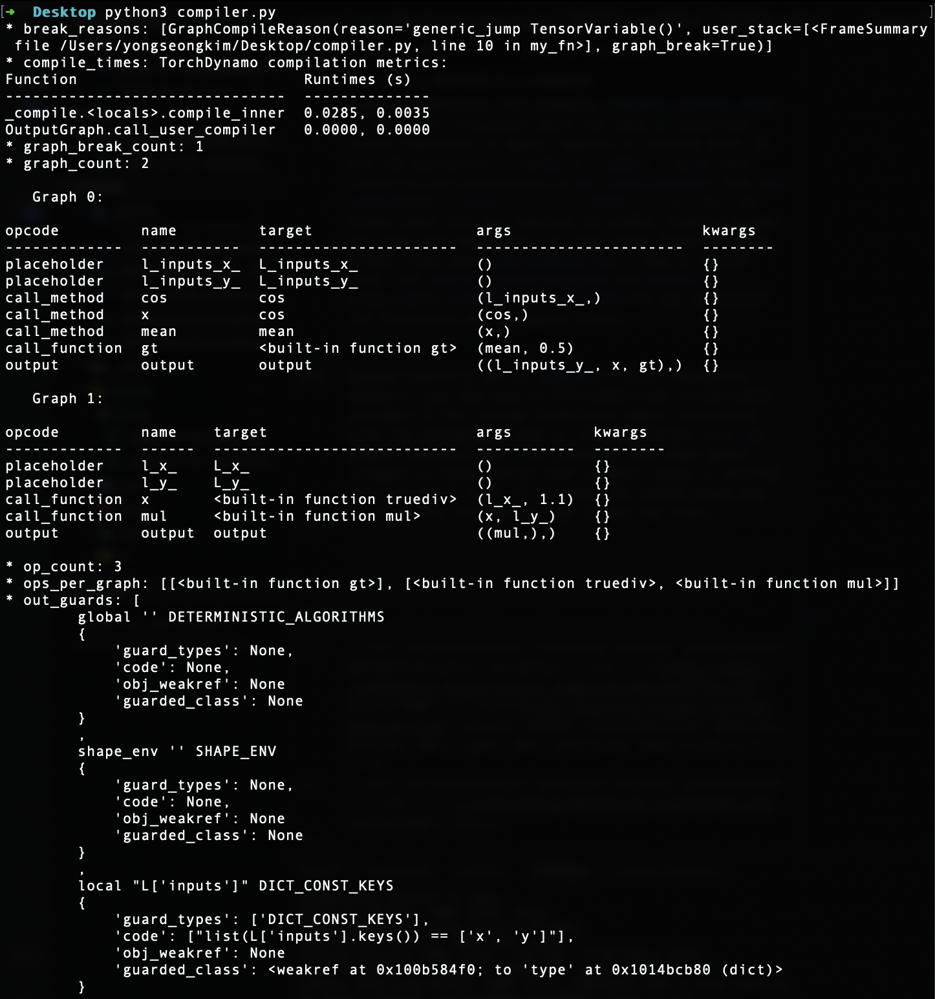

# DL Compilation
---
The cs400 covers the rudimentary elements of Computer Science and aims to enhance the work-related self-efficacy of someone only with a degree in Mathematics. This first post is intended to celebrate the announcement of *torch.compile* in early March 2023. Pytorch 1.0 was released in 2017 essentially to provide Python API wrapper around C++ kernel. 

## I
---
### **1.1. Computer**

 

Charles Babbage designed the [Analytical Engine]() (1837), that is considered the first conceptualised general-purpose digital computer, which featured an arithmetic logic unit, control flow with conditional branching and loops, and memory modules. Later on, Alan Turing proposed the [Turing Machine]() (1936), establishing a theoretical framework for analysing computational capabilities and limitations, which laid the foundation for Computer Science. The [electronic numerical integrator and computer]() (ENIAC) (1945), developed by John Mauchly and J. Presper Eckert, became arguably the first programmable and electronic digital computer (i.e. against the Z3).

Computers, which vary in size, processing power, and usage, generally fall into one of these categories. i) [Personal computers]() (PCs): highly versatile systems used by individuals for a broad spectrum of tasks, including office work, web browsing, gaming, multimedia, and etc; ii) [mainframes](): used for high-volume transaction processing, large-scale data management, and mission-critical operations which require reliability and scalability; iii) [supercomputers](): deliver extraordinary processing speed and computing power, suitable for computational-heavy tasks such as climate modeling; As programmers, we deliver instructions to control and manipulate computers.

At a high-level, the [motherboard]() provides the physical circuitry for the key components of [Von Neumann architecture]() (1945). It serves as the central hub where the CPU socket, RAM slots, storage interfaces, I/O ports, and other peripherals communicate through [buses]() and [chipsets](). Modern computers also have expanded slots for graphics cards, sound cards, or additional storages, offering enhanced capabilities and/or flexibilities. The BIOS/UEFI [firmware]() being embedded into the motherboard performs [self-tests]() (POST) as soon as the power supplies, then the bootloader (e.g. Linux's GRUB, Windows's Boot Manager) loads the kernel from the SSD into RAM.

- 
  <a href="https://www.refsmmat.com/courses/751/notes/index.html" target="_blank" style="position: absolute; bottom: -8px; right: 4px; font-size: 12px;">[src]</a> 

<!-- - <iframe width="500" height="285" src="https://www.youtube.com/embed/d86ws7mQYIg?si=5FHtHqUPzKoaNcbI" title="YouTube video player" frameborder="0" allow="accelerometer; autoplay; clipboard-write; encrypted-media; gyroscope; picture-in-picture; web-share" referrerpolicy="strict-origin-when-cross-origin" allowfullscreen></iframe> 
 
 -->

<!-- - <figcaption> <a href="https://www.youtube.com/@BranchEducation" target="_blank">src</a> </figcaption> <iframe width="500" height="285" src="https://www.youtube.com/embed/h9Z4oGN89MU?si=lf9syZWAtt_f7k6z" title="YouTube video player" frameborder="0" allow="accelerometer; autoplay; clipboard-write; encrypted-media; gyroscope; picture-in-picture; web-share" referrerpolicy="strict-origin-when-cross-origin" allowfullscreen></iframe> -->

### **1.2. Central Processing Unit**

 

A [central processing unit]() (CPU or processor) executes a set of instructions, known as a [program](https://youtu.be/RU1u-js7db8?si=cGIkhRbh6XW_mr34), via the [fetch-decode-execute]() cycle. Each core within the CPU has its own [arithmetic logic unit]() (ALU) and [control unit]() (CU). Modern CPUs have 4 to 64 cores, usually with [floating point unit]() (FPU) to handle complex calculations and enable parallel processing. [Registers]()—the fastest memory—temporarily store data and instructions required immediately by the CPU, while its [cache]() hierarchy {'L1': smallest-fastest, 'L2': larger-slower, 'L3': largest-shared across cores} mitigates memory latency. Clock speed refers to the rate at which the component executes instructions.

Notably, the [word size](http://cpuville.com/Projects/Original-CPU/programming.html) of the CPU refers to the number of bits it can process in a single operation (e.g. 32-bit or 64-bit). It determines the register size, the data bus width, and the design of the [instruction set architecture](https://www.slideshare.net/slideshow/instruction-set-architecture-254097280/254097280#2) (ISA). In particualr, the instructions are a group of commands represented in [binary](), that abstracts various aspects of the hardware and facilitates the software-to-hardware interface. Larger sizes allow the CPU to process more data at once and address larger memory spaces. In fact, indiscriminately increasing the word length can introduce more complexity in circuitry design, making it more challenging to achieve an optimal performance.

For example, the 4-bit processor (calculator) can execute only  $2^4 = 16$ unique instructions on small data (i.e. 4 bits at a time), ranging between $[0, 15]$ or $[-8, 7]$. In contrast, a 32-bit system is vastly more capable, supporting millions of operations and addressing up to 4 GB of memory. When programming, using appropriate [data types]() that align with the CPU's native word size often results in efficient computations, but languages like C loosely define its sizes based on minimum standards {e.g. int: 4 bytes} to ensure portability across CPU architectures. Modern CPUs usually use techniques such as [pipelining]() and [branch prediction]() to maximise instruction throughput. 

<!-- Therefore, they may not fully utilise the native capabilities of every processor -->

- 
  <a href="https://faculty.washington.edu/gmobus/Academics/TCSS372/Notes/crash1.html" target="_blank" style="position: absolute; bottom: -8px; right: 4px; font-size: 12px;">[src]</a> 

<!-- - 
  <a href="https://www.chegg.com/homework-help/questions-and-answers/instruction-set-architecture-1-instruction-set-present-list-instructions-typical-risc-redu-q71095102" target="_blank" style="position: absolute; bottom: -8px; right: 4px; font-size: 12px;">[src]</a> 
 -->

<!-- - 
  <a href="https://girdhargopalbansal.blogspot.com/2013/10/isa-machine-language-and-number-systems.html" target="_blank" style="position: absolute; bottom: -8px; right: 4px; font-size: 12px;">[src]</a> 
 -->
  
<!-- - 
  <a href="https://www.scs.stanford.edu/05au-cs240c/lab/i386/s02_02.htm" target="_blank" style="position: absolute; bottom: -8px; right: 4px; font-size: 12px;">[src]</a> 
 -->

### **1.3. Random Access Memory**

 

<!-- that is ~= namely -->
A computer memory is essentially an array of bytes each with a unique address. In fact, [random access memory]() (RAM), register, and cache differ in speed and width. The latency of [dynamic RAM]() (DRAM) can be estimated as $T_{\text{precharge}} + T_{\text{row activation}} + T_{\text{col. access}}$, while (contiguous) data being in an active row yields the fastest access. Indeed, the physical design of memory cells heavily matters. [Static RAM]() (SRAM) is better suited for cache memory due to its high speed and stability, despite its higher cost. A well-designed program (e.g. contiguous memory allocations) can achieve a higher temproal and spatial [locality](), which then improves [cache hit]() rates.
 
An instance of a (user-) program, known as a [process](), resides in RAM during execution. The [text segment]() of the process, as depicted in its [memory layout](), contains the program’s executable code, comprising machine instructions (e.g. 4-bit, 8-bit, 32-bit) that the CPU fetches and executes. To protect the integrity of the program and prevent accidental or malicious alterations, the segment is typically marked as read-only, and moreover, many OS implement hardware-backed security mechanisms, such as [execution prevention]() (e.g. DEP or NX bit), to ensure that this code cannot be executed from unintended regions of memory (e.g. stack, heap, or data segments).

More interestingly, local variables and function parameters are stored in the [stack](), which operates in a [last-in, first-out]() (LIFO) manner. [Stack frames](), created by [function calls](https://www.youtube.com/watch?v=cSSpnq362Bk), are sequentially pushed onto the [call stack](), with their addresses tracked by the [stack pointer](). A contiguous block allocated by the stack improves cache locality, the size of stack is predetermined at compile time, and the stack does not invoke [system calls](). However, [heap]() allocations for dynamically- or largly-sized data, such as variable-length arrays, involve sending system calls to an OS to be given memory chunks. It is way more prone to cache misses, fragmentation, and [memory leaks]().

<!-- [Sreedharan](https://arjunsreedharan.org/post/69303442896/how-to-find-the-size-of-an-array-in-c-without) shows the inner mechanism (and some uses of pointers in C) by getting the size of an array.... -->

- 
  <a href="https://www.linkedin.com/pulse/c-memory-layout-naveen-suppala/" target="_blank" style="position: absolute; bottom: -8px; right: 4px; font-size: 12px;">[src]</a> 

<!-- - 
  <a href="https://www-user.tu-chemnitz.de/~heha/hsn/chm/avr-libc.chm/malloc.html" target="_blank" style="position: absolute; bottom: -8px; right: 4px; font-size: 12px;">[src]</a> 
 -->

### **1.4. Persistent Storage**

 

<!-- Punch cards were the major …. Note that the limitations of cycle access memory yielded to developments of random access memory … https://www.youtube.com/watch?v=TQCr9RV7twk&list=PL8dPuuaLjXtNlUrzyH5r6jN9ulIgZBpdo&index=20 -->

Persistent storage typically refers to [hard disk drives]() (HDDs) or [solid-state drives]() (SSDs). Both are non-volatile, and so can retain data without constant power supply. HDDs are mechanical in which the physical movement required in reading data yields slower access, whereas SSDs use electronic signals for much faster access. In recent years, many computing devices released have featured [non-volatile memory express]() (NVMe) SSDs, which operate over the [peripheral component interconnect express]() (PCIe) interface, enabling direct communication between the SSD and CPU. Flash memory, similar to SSDs, is also commonly used for storing applications.

A disk can also be used as [virtual memory](), via [paging]() or [segmentation](), to free up RAM for a process. But, excessive swapping leads to [thrashing]()....

<!-- - 
  <a href="https://outofordercore.github.io/timing-analysis/" target="_blank" style="position: absolute; bottom: -8px; right: 4px; font-size: 12px;">[src]</a> 
 -->

- 
  <a href="https://www.backblaze.com/blog/ssd-vs-hdd-future-of-storage/" target="_blank" style="position: absolute; bottom: -8px; right: 4px; font-size: 12px;">[src]</a> 

### **1.5. I/O Device**

 

I/O devices allow beginners to manipulate complex systems without requiring deep knowledge of binary encoding or CPU instructions. In particular, {I: 'keyboard', O: 'monitor'}  are equipped for communications between a computer and its external environment. Each key press is converted into a corresponding binary using encoding standards. For instance, the [unicode transformation format-8]() (UTF-8) is a variable-length standard representing over a million codepoints as sequences of 8-bit bytes. This is a superset of all characters in widespread use today, including those defined by [Hex]() and [ASCII]() (i.e. 7-bit encoding standard supporting $2^7 = 128$ English letters).

Programmers interact with computers through programming. At the lowest level, [assembly languages]() (e.g. x86, ARM, MIPS) are used because it is more human-readable. The syntax corresponds to the instructions defined by an ISA, translating mnemonics to machine instructions: {'ADD': { Hex: 0x8, Semantic: A $\gets$ A $+$ B }}. [Low-level languages]() like C (C++?) offer greater abstraction while preserving hardware control, with compilers translating source code into executable files. Finally, [high-level languages](), such as Python, Java, and Golang abstract away hardware details entirely, relying on interpreters and/or JIT compilers to compile and then execute code.

<!-- Whereas, programmers directly interact with computers by coding. The lowest-level developments that programmers can practically proceed is done with [assembly]() language (e.g. x86, ARM, MIPS), since it is far more human-readable than the ISA (i.e. machine code), as a result of layering human-readable mnemonics, {e.g. *ADD*: { Hex: 8, Semantic: A $\gets$ A $+$ B }}, that are translated back into machine code. Low-level languages like C rely on [compilers](https://www.reddit.com/r/ProgrammingLanguages/comments/1475h9o/how_to_make_a_compiler/) to convert [source code]() into an [executable](), but offer higher abstraction while maintaining hardware control. The high-level languages such as Python and Java abstract away hardware complexities and use compilers or [interpreters]() (i.e. may or may not use JIT).... -->

<!-- - 
  <a href="https://pandulaofficial.medium.com/unicode-utf-8-explained-with-examples-using-go-5f8b7f4521d" target="_blank" style="position: absolute; bottom: -8px; right: 4px; font-size: 12px;">[src]</a> 
 -->

The choice of programming languages often comes down to [execution speed]() and the types of projects. Compiled languages such as C++ and Rust are preferred for tasks requiring high performance and low latency (e.g. game engines, real-time systems). In contrast, interpreted languages such as Python, JavaScript, and Ruby are used when implementation speed and flexibility are critical (e.g. web development, [data analysis]()). Said differently, the [execution model]()—whether interpreted, compiled, or JIT-compiled—hugely influences the choice of language. More details are discussed below regarding the execution model context of [machine learning]() (ML).

- <iframe width="500" height="285" src="https://www.youtube.com/embed/3PcIJKd1PKU?si=a7VnJqSVAdW54VsY" title="YouTube video player" frameborder="0" allow="accelerometer; autoplay; clipboard-write; encrypted-media; gyroscope; picture-in-picture; web-share" referrerpolicy="strict-origin-when-cross-origin" allowfullscreen></iframe> 
 

## II
---
### **2.1. Graphics Processing Unit**

 

A [graphics processing unit]() (GPU) is an integral part of a graphics card, built for [single instruction, multiple threads]() (SIMT) execution of relatively simple and repetitive tasks. GPUs feature a way more cores operating at lower clock speeds, compared to CPUs, delivering high computational throughput and efficiency in conjunction with the high-bandwidth memory. [Floating point operations per second]() (FLOPS) measures the GPU’s computational capacity, while [floating point operations]() (FLOPs) indicates the computation demands of neural networks (NNs) which, in the case of LLMs, are hugely influenced by the number of parameters and amount of training tokens.

Similar to CPUs, a [streaming multiprocessor]() (SM) serves as a core of the GPU which executes a thread block. Given that a [thread]() is the smallest unit of execution that handles a portion of tensor operation (e.g. element-wise multiplications), an [warp]() is a set of threads organised in a uniform size to be following the SIMT model, and multiple [warp schedulers]() facilitate the switching between warps within the SMs whenever a core stalls. A [block]() is a collection of warps assigned to each SM. More blocks than a number of SMs should be properly dispatched in modern GPUs to maximise utilisation and ensure higher throughput. This is known as [latency masking]().

- 
  <a href="https://blog.paperspace.com/a-complete-anatomy-of-a-graphics-card-case-study-of-the-nvidia-a100/" target="_blank" style="position: absolute; bottom: -8px; right: 4px; font-size: 12px;">[src]</a> 

<!-- A [data processing unit]() (DPU) is a relatively newer programmable processor that is typically based on the [arm architecture](). It primiarily optimises data-centric (rather than computationally expensive) tasks occurring in large data centers, such as data movement, storage (e.g. compression and encryption), and network packet processing (e.g. routing and security). DPUs offload data management from CPUs and orchestrate data flow between CPUs, GPUs, and storages. NVIDIA introduced DPUs with robust security features, such as isolation of data flows with hardware-level encryption and access control, that is critical for cloud-native and virtual environments. -->

### **2.2. CUDA & Tensor Core**

 

A [CUDA core]() in a SM is a general-purpose processing units, essentially an ALU, designed for parallel computing across thousands of threads. In particular, each CUDA core typically handles one instruction per cycle per thread, supporting both FP and INT operations for basic arithmetic ($+$, $\times$) and control flow ($\land$, $\lor$, $\neg$). The CUDA cores are absolutely well-suited for graphics rendering, simulations, and other general-purpose parallel workloads, but they still lack abilities in handling specialised mathematical operations, including a [general matrix mutiplication]() (GEMMs). Consequently, they must be supplemented by other components of a GPU to overcome these.

A [tensor core](), introduced in the Tesla V100, is a specialised hardware unit designed for 64 [mixed-precision]() (i.e. FP16$\,\times\,$FP16 → FP32) matrix operations per clock cycle, often known as [fused multiply-add]() (FMA). Given that the back-propagation can be sensitive to low bit-width data formats such as FP16 as gradient values may fall outside the representable range, [Micikevicius et al. (2017)](https://arxiv.org/abs/1710.03740) i) kept the weights in an FP32 master copy; and (ii) up/down-scaled gradients via a scaling factor; to avoid underflow (i.e. zero clipping). Pytorch 1.6+ and a CUDA-capable GPU supports the package for [automatic mixed precision]() (AMP): '*@torch.autocast*' and '*torch.GradScaler*'.

- 
  <a href="https://developer.nvidia.com/blog/nvidia-ampere-architecture-in-depth/" target="_blank" style="position: absolute; bottom: -8px; right: 4px; color: white; font-size: 12px;">[src]</a> 

### **2.3. High-Bandwidth Memory**

 

Its memory hierarchies are also optimised for high throughput and low latency. For instance, the V100 has integrated shared memory (SMEM) and L1 cache, allowing L1 cache to enjoy SMEM’s high-bandwidth performance and low-latency. Both SMEM and L1 cache store more frequently accessed data to reduce the need for slower global memory access (i.e. VRAM). On the other hand,  L2 cache, an off-chip memory can be shared across all SMs. They facilitates efficient data flow between SMs and the [high-bandwidth memory]() (HBM), and ultimately enhance throughputs to L1/SMEM by enabling quick access to larger datasets in VRAM.

A high performance of HBM is essentially attributed to its vertical stacking architecturem. As shown below, several DRAM dies layered on top of each other and interconnected by [through-silicon vias]() (TSVs). However, an NVIDIA's [architect](https://www.youtube.com/watch?v=n6M8R8-PlnE&t=75s) also agreed that the memory bandwidth cannot fully support the peak TFLOPS of their GPUs. For example, the highest bandwidth of the A100 is theoretically 9,750 GB/s (64 bytes/SM × 108 SMs × 1410 MHz), yet HBM2's 1,555 GB/s is 6.3 times less than what the SMs request. CUDA developers hence must pay attention to data access pattern because CUDA (i.e. GPU's C) does not enforce the contiguous memory allocation.

- 
  <a href="https://news.skhynix.com/semiconductor-back-end-process-episode-4-packages-part-2/" target="_blank" style="position: absolute; bottom: -8px; right: 4px; font-size: 12px;">[src]</a> 

<!-- ### **2.4. On- vs. Off-Chip Module** -->
### **2.4. GPU Architecture**

 

<!-- Similar hardware specifications can exhibit significant differences in performance. For example, the usage of smaller transistors could reduce power consumption, require lower voltage thresholds, generate less heat, and ultimately enable a higher density of transistors to be integrated into the chip. This example illustrates that architectural innovations are the second most important factor in achieving maximum GPU utilisation, next to data access patterns. Meanwhile, industry observations have indicated that the computing power is generally sufficient (i.e. the more cores the better). The primary bottleneck in model training, however, lies in the limitations of VRAM. -->

For instance, the A100 GPU has 7 [graphics processing clusters]() (GPCs). Each GPC contains 6 [texture processing clusters]() (TPCs), and each TPC has 2 SMs. Each SM includes 64 CUDA cores, 4 tensor cores, 4 warp schedulers, and 256 KB of local registers along with 192 KB of L1 cache/SMEM. The memory hierarchy features a 40 MB L2 cache and 40 GB of VRAM leveraging a 5120-bit HBM2 interface with 5 stacked modules, delivering a [bandwidth]() of 1.55 TB/s. For interconnects, the A100 supports NVLink Bridge (600 GB/s for 2 GPUs) and PCIe (64 GB/s), and also multi-instance GPU (MIG) technology, allowing up to 7 instances per GPU.

<!-- The following illustrates the [Ampere architecture](https://www.nvidia.com/en-us/technologies/) (A100 40GB) as a simplified JSON, highlighting key components which can also be found in their recent products. -->

        A100_for_illustration = { 
                graphics_processingc_cluster: [  # i.e. repeat for 7 GPCs
                        {
                                name: GPC1,
                                texture_processing_cluster: [  # i.e. repeat for 6 TPCs/GPC 
                                        {
                                                name: TPC1,
                                                "streaming_multiprocessor": [  # i.e. repeat for 2 SMs/TPC 
                                                        {
                                                                name: SM1
                                                                "cuda_cores": 64,
                                                                "tensor_cores": 4,
                                                                "warp_schedulers": 4,
                                                                "sm_local_memory": {"registers": "256 KB/SM", "L1_cache/SMEM": "192 KB"}
                                                        },
                                                ]
                                        },  
                                ]
                        },
                ],
                memory_hierarchy: {
                        "L2_cache": "40 MB"
                        "VRAM": {"interface": "5120-bit HBM2", "num_stacked": 5, "memory": "40 GB", "bandwidth": "1.55 TB/s"},
                },
                interconnect: {NVLink-Bridge for 2 GPUs: 600 GB/s, PCIe: 64 GB/s}
                multi_instance_gpu: {support: True, max_num_instances: 7}
        }
        
### **2.5. Interconnection**

 

An [interconnect]() is a communication link that enables data transfer between components within a computer system. In the context of GPUs and CPUs, interconnects allow different parts of a system—like processors, memory, storage devices, and expansion cards—to communicate efficiently. They can be physical connections like cables or circuit pathways on a motherboard, or even software protocols that manage how data flows between components. For example, tech like NVIDIA’s [NVLink]() is an inter-GPU and GPU-CPU Interconnects, managing data transfer across various types of multiple processing units, and allowing GPUs to efficiently share data. 

System interconnects link the broader components of a system, such as processors, memory, storage, and expansion cards. Common interfaces like PCIe supports high-throughput connections essential for tasks that depend on rapid access to storage or network resources, maintaining data flow throughout the entire system... A large model may not fit into VRAM and force it to be distributed across ...

- 
  <a href="https://www.backblaze.com/blog/ssd-vs-hdd-future-of-storage/" target="_blank" style="position: absolute; bottom: -8px; right: 4px; font-size: 12px;">[src]</a> 

<!-- - 
  <a href="https://blog.paperspace.com/a-complete-anatomy-of-a-graphics-card-case-study-of-the-nvidia-a100/" target="_blank" style="position: absolute; bottom: -8px; right: 4px; color: white; font-size: 12px;">[src]</a> 
 -->
  
<!-- - [Stanford CS149](https://www.youtube.com/watch?v=V1tINV2-9p4&list=PLoROMvodv4rMp7MTFr4hQsDEcX7Bx6Odp): Keep it for parallel processing chapter -->

## III
---
### **3.1. Compiler Framework**

 

[Low-level virtual machine]() (LLVM), released in 2003 by Chris Lattner, is a compiler and toolchain set designed to minimise the need for language-hardware-specific compilers. Given that a compiler pipeline generally consists of front-, middle-, and back-end, LLVM takes an [intermediate representation]() (IR) from a front-end, apply multiple optimisation techniques, and emits an optimised IR in one of these extension: i) human-readable assembly (.ll); ii) bitcode (.bc); and iii) C++ object code (.o); LLVM follows the [static single assignment]() (SSA) form to simplify the analysis of dependencies among variables, and so allows an efficient program optimisation-in-compilation.

In practice, a front-end compiler makes an IR with i) lexical analyser (Lexer): breaks the [source code]() into tokens (e.g. keyword, literal, identifier); ii) parser: builds an [abstract syntax tree]() (AST) based on the analysed tokens and the language's grammar to represent the hierarchical structure of the source code; iii) semantic analyser: further ensures correctness of the program beyond syntax (e.g. type checking, variable declarations, and scope resolution); and iv) IR generator: transforms the examined source code into a universal IR; Modern C compilers (e.g. Clang, GCC) are [self-hosting]() (i.e. also written in C/C++) and were developed via [bootstrapping]() processes.

Subsequently, the [LLVM Core]() takes a role in IR optimisations (e.g. dead code elimination), and a back-end can compile the outputted IR [ahead-of-time]() (AOT) (i.e. *llc* cmd), or execute it directly using a [just-in-time]() (JIT) compiler (i.e. *lli* cmd). However, as the expressive power of an IR and its ability to capture high-level semantics largely determine the sophistication of a front-end compiler, a lot of high-level languages have developed their own AST for associated infrastructures (e.g. Swift-SIL, Rust-MIR, Pytorch-TorchScript), and this led to the unnecessary coexistence of various modules (i.e. performing similar tasks) across languages and/or hardwares specific IRs.

- 
  <a href="https://www.researchgate.net/publication/35151154" target="_blank" style="position: absolute; bottom: -8px; right: 4px; font-size: 12px;">[src]</a> 

<!-- -  <a href="https://aosabook.org/en/v1/llvm.html" target="_blank">[src]</a> -->

<!-- -  <a href="https://www.skenz.it/compilers/llvm" target="_blank">[src]</a> -->

<!-- -   -->

The [multi-level intermediate representation]() (MLIR), located in llvm-project/mlir, is a framework placed between a language's AST and LLVM IR, enabling different levels of abstraction to coexist. While MLIR is a powerful representation, it does not intend to provide low-level machine code (e.g. .exc file) generation algorithms (e.g. register allocation, instruction scheduling), as such tasks are handled by lower-level optimisers (i.e. LLVM). Nor does it intend to serve as a source language for user-defined kernels, analogous to CUDA C++. MLIR uses [dialects]() to represent the semantics of both general-purpose and [domain-specific languages]() (DSLs) as first-class entities.

One has to define domain-specific operations, types, and attributes in MLIR by extending the IR to make a custom dialect. Specifically, it involves i) specifying the dialect using MLIR’s C++ API or [table-driven declarative rewrite rule]() (DRR), ii) defining the semantics of the new operations, and iii) integrating them into the MLIR framework. Numerous custom dialects illustrate MLIR’s adaptability, including the Standard dialect for general-purpose computation (e.g. arithmetic), the LLVM dialect for LLVM IR interoperability, and the Tensor and Linalg dialects for some maths. The GPU and SPIR-V dialects are well-known domain-specific dialects for hardware acceleration.

- 
  <a href="http://lastweek.io/notes/MLIR/" target="_blank" style="position: absolute; bottom: -8px; right: 4px; font-size: 12px;">[src]</a> 

<!-- -  <a href="https://dl.acm.org/doi/fullHtml/10.1145/3458744.3473354" target="_blank">[src]</a> -->

<!-- -  <a href="https://blog.lambdaclass.com/cairo-and-mlir/" target="_blank">[src]</a> -->

<!-- -  <a href="https://codeplay.com/portal/blogs/2024/02/09/experiences-building-an-mlir-based-sycl-compiler" target="_blank">[src]</a> -->

<!-- - <iframe width="500" height="285" src="https://www.youtube.com/embed/m8G_S5LwlTo?si=oVZN98jpLrCEqIju" title="YouTube video player" frameborder="0" allow="accelerometer; autoplay; clipboard-write; encrypted-media; gyroscope; picture-in-picture; web-share" referrerpolicy="strict-origin-when-cross-origin" allowfullscreen></iframe> -->

### **3.2. Interpreter (w/wo JIT)**

 

Cross-compiling has become more accessible with LLVM, but despite extensive research, compiler development remains challenging and limits their widespread use. Accordingly, interpreters have gained popularity among ML researchers who favour iterative and also experimental workflows. Modern interpreters compile source code into [bytecode](https://www.youtube.com/watch?v=HY7cMB0Rx8w), which is i) hardware-agnostic: independent of the varing ISAs; and so ii) executable on any platform (e.g. Linux, macOS, Window) with a compatible [virtual machine]() (VM); The VM in the context often provides an abstraction layer to execute the bytecode by simulating a standardised runtime environment over an OS.

<!-- Compilation is often faster than -to binary and a VM executes instruction sequentially, making interpreters so dynamic. -->

The [CPython]() compiler's design is outlined in [PEP 339](https://peps.python.org/pep-0339/) (i.e. withdrawn), but in essence, it converts source code (i.e. .py) into bytecode (i.e. .pyc), that consists of [operation codes]() (opcodes) and corresponding [operands]() (i.e. if exist). Opcodes are lower-level instructions, and operands represent various entities depending on the context of opcode. Operands can vary from literal constants or immutables (e.g. number, string, tuple), variable or attribute names, or [code blocks]() (e.g. function, class, comprehension). Similar to how assembly instructions like *pop*, *push*, and *ret* are represented numerically, each operand corresponds to an integer (i.e. *dis.opname[int]*).

CPython continues to improve its efficiency via various optimisations. Regarding opcodes, the [adaptive interpreter](), introduced in [PEP 659](https://docs.python.org/3/whatsnew/3.11.html#whatsnew311-pep659), dynamically replaces generic opcodes with specialised, faster versions at runtime based on profiling data. It reduces overhead for frequently executed instructions, and so significantly enhances execution speed. One can attempt to disassemble opcodes using the *dis* module or examine further through the CPython source code: [[Include/opcode.h](https://github.com/python/cpython/blob/main/Include/opcode.h), [Python/opcode_targets.h](https://github.com/python/cpython/blob/main/Python/opcode_targets.h), [Lib/opcode.py](https://github.com/python/cpython/blob/main/Lib/opcode.py)]. In short, Bytecode, formed by combining opcodes and operands, serves as an IR which the CPython interpreter can efficiently execute. 

- 
  <a href="https://blog.sourcerer.io/python-internals-an-introduction-d14f9f70e583" target="_blank" style="position: absolute; bottom: -8px; right: 4px; font-size: 12px;">[src]</a> 

  
<!-- - 
  <a href="https://blogs.brain-mentors.com/lets-discuss-how-python-work-internally/" target="_blank" style="position: absolute; bottom: -8px; right: 4px; color: white; font-size: 12px;">[src]</a> 
 -->

<!-- - 
  <a href="https://onlinelibrary.wiley.com/doi/10.1002/spe.3267" target="_blank" style="position: absolute; bottom: -8px; right: 4px; font-size: 12px;">[src]</a> 
 -->

The *_PyAST_Compile* function in Python/compile.c is the main entry point for compilation. This generates a *[PyCodeObject]()* struct that represents a chunk of executable code that has not yet been bound into a function. The struct encapsulates i) *co_code*: the sequence of opcodes and operands representing bytedcode instructions; ii) *co_consts*: constants (e.g. number, tuple) or nested *PyCodeObject* instances (e.g. function, class, comprehension); iii) *co_names*: variable and attribute names; iv) *co_varnames*: local variable names; v) *co_freevars* / *co_cellvars*: variables used in closures; vi) *co_filename* / *co_name*: the source file and code block name; and others;

<!-- PyObject is the base for all Python objects, including primitive types like integers and strings. For an integer or string, the actual data (like the value 42 or the string "hello") is stored within the PyObject structure. Primitive types are thus wrapped inside PyObject instances, which also manage memory and provide information about their types. Refer to the below href="https://p403n1x87.github.io/deterministic-and-statistical-python-profiling.html"-->

The [Python virtual machine]() (PVM), a stack-based interpreter, then executes the compiled bytecode at runtime by simulating a CPU's execution model (i.e. stack machine). The (legacy API-) *PyFrame_New* in Objects/frameobject.c emits a [*PyFrameObject*]() that models a stack frame, representing the execution context of a function call. A frame object has i) *[f_code]()*: a reference to the *PyCodeObject*; ii) *[f_back]()*: a path to the last frame; iii) f_locals: local variables of the function; iv) f_globals: accessible global variables; and others; Note that *f_back* forms a [linked list]() of *PyFrameObject* pointers, while one can examine objects and frames with the *inspect* or *sys* modules.

The *_PyEval_EvalFrameDefault* in Python/ceval.c serves as the main interpreter loop and, as specified in [PEP 523](), it is configurable. All Python objects and data structures are heap-allocated by construction. A *PyCodeObject* act as a blueprint, and a *PyFrameObject* holds the execution context for the function call, so the call stack itself is handled in the traditional stack memory. \*\**In recent updates, Python 3.11 splits the stack frame object into: a PyFrameObject and a struct [_PyInterpreterFrame](). Also, Python 3.12, as proposed in [PEP 709](https://peps.python.org/pep-0709/), inlines comprehensions into the code rather than compiling them as nested functions that isolate iteration variables*.\*\*

<!-- Heap memory is used to store dynamically allocated memory. It is large and flexible, but slower compared to stack memory because allocations and deallocations happen dynamically. Heap memory is ideal for storing large data, such as big arrays or complex objects, since it provides a large amount of space. Unlike stack memory, developers must manually allocate and release heap memory in many programming languages. This makes memory management more complex and prone to errors. However, in Python, garbage collection automatically handles memory management. In Python, all objects are stored in heap memory. For example, consider the following code: -->

- 
  <a href="https://aosabook.org/en/500L/a-web-crawler-with-asyncio-coroutines.html" target="_blank" style="position: absolute; bottom: -8px; right: 4px; font-size: 12px;">[src]</a> 

<!-- - 
  <a href="https://p403n1x87.github.io/deterministic-and-statistical-python-profiling.html" target="_blank" style="position: absolute; bottom: -8px; right: 4px; font-size: 12px;">[src]</a> 
 -->

<!-- - 
  <a href="https://www.slideserve.com/carillo/reverse-engineering-dynamic-languages-a-focus-on-python-powerpoint-ppt-presentation" target="_blank" style="position: absolute; bottom: -8px; right: 4px; font-size: 12px;">[src]</a> 
 -->

<!-- - 
  <a href="https://www.slideserve.com/carillo/reverse-engineering-dynamic-languages-a-focus-on-python-powerpoint-ppt-presentation" target="_blank" style="position: absolute; bottom: -8px; right: 4px; font-size: 12px;">[src]</a> 
 -->

<!-- - 
  <a href="https://jasonleaster.github.io/2016/02/21/architecture-of-python-virtual-machine/" target="_blank" style="position: absolute; bottom: -8px; right: 4px; font-size: 12px;">[src]</a> 
 -->

Compared to OG interpreters which traversed ASTs recursively during runtime (and suffered from slow execution), the introduction of a VM and bytecode input significantly improved performance and portability. ASTs are well-suited for representing program structure but are not optimised for efficient execution. On the other hand, a lower-level IR allows more sophisticated optimisations and custom implementations. For instance, [PEP 3147]() introduced the .pyc repository directory, known as [\_\_pycache\_\_](https://peps.python.org/pep-3147/), to better organise files and improve cross-version compatibility. CPython can skip recompilation if an up-to-date .pyc file is present in the directory.

- 
  <a href="https://peps.python.org/pep-3147/" target="_blank" style="position: absolute; top: 0px; left: 4px; font-size: 12px;">[src]</a> 

Ultimately, JIT compilers appeared to further accelerate execution speed. Given that AOS (i.e. general-case) compilation can be very slow, as Omer Iqbal mentioned in his [presentation](https://www.youtube.com/watch?v=sQTOIkOMDIw), traditional JIT compilers that can be found in other languages, such as Java (JVM) or JavaScript (V8 engine), employ multi-tiered optimisation strategies. These tiers, such as the 'warm' or 'hot' stages, adeptly detect and categorise frequently executed code paths, while the code regions will be compiled into machine code during runtime. CPython, the reference-only implementation of Python, lacks the feature, but one can find other implementations incorporating JIT compilation.

- 
  <a href="https://onlinelibrary.wiley.com/doi/10.1002/spe.3267" target="_blank" style="position: absolute; top: 0px; left: 4px; font-size: 12px;">[src]</a> 

<!-- - 
  <a href="https://thevaluable.dev/difference-between-compiler-interpreter/" target="_blank" style="position: absolute; bottom: -8px; right: 4px; font-size: 12px;">[src]</a> 
 -->

### **3.3. GPU Programming**

 

[Compute unified device architecture]() (CUDA) is a parallel computing platform featuring compilers, libraries, and developer tools. It was created in 2006 by NVIDIA and embedded within C/C++ as a DSL for programming their own GPUs. [NVIDIA CUDA Compiler](https://docs.nvidia.com/cuda/cuda-compiler-driver-nvcc/contents.html) (NVCC), which uses NVVM (i.e. their derivatvie of LLVM), compiles a .cu into a i) [parallel thread execution]() (.ptx) human-readable assembly; or ii) directly executable [CUDA-specific binary](https://docs.nvidia.com/cuda/cuda-compiler-driver-nvcc/index.html#cuda-compilation-trajectory__cuda-compilation-from-cu-to-executable) (.cubin); This .cu extension allows NVCC to delegate the compilation of [host code]() (i.e. CPU-related: *#include*) to Clang, while focusing on [device code]() (i.e. w/ CUDA extension: *\_\_global\_\_*, or *\_\_device\_\_*) compilation.

- 
  <a href="https://www.kapilsharma.dev/posts/deep-dive-into-triton-internals/" target="_blank" style="position: absolute; bottom: -8px; right: 4px; font-size: 12px;">[src]</a> 

<!-- - 
  <a href="https://cuda-programming.blogspot.com/2013/01/compile-and-run-cuda-cc-programs.html" target="_blank" style="position: absolute; bottom: -8px; left: 4px; color: white; font-size: 12px;">[src]</a> 
 -->

[CUDA programming]() in C/C++ is generally more cumbersome due to the need for manual handling of: i) memory coalescing; ii) SMEM synchronisation and conflict management; iii) scheduling within SMs; and iv) scheduling across SMs; Thus, OpenAI introduced [Triton](https://triton-lang.org/main/getting-started/tutorials/01-vector-add.html#sphx-glr-getting-started-tutorials-01-vector-add-py) in 2021 as Python-based framework and DSL, making it easier for ML researchers and practitioners to write optimised GPU code (i.e. primitive tensor operations). Built on top of the LLVM-MLIR infrastructure, Trition automates the first three challenges inherent to the SIM"T" model by enabling tile-based programming with multi-dimensional blocks (i.e. rather than operating on individual "T"hreads). 

<!-- - 
  <a href="https://www.zdnet.com/article/openai-proposes-triton-language-as-an-alternative-to-nvidias-cuda/" target="_blank" style="position: absolute; bottom: -8px; right: 4px; font-size: 12px;">[src]</a> 
 -->
  
<!-- -  -->

<!-- -  <a href="https://www.nvidia.com/en-us/glossary/numba/" target="_blank">[src]</a> -->

The [Triton compiler]() captures the AST of a kernel, that is written in *triton.language* and also decorated by *@triton.jit*, and progressively generates IRs through MLIR dialects: i) Triton Tensor Graph IR (TTGIR): a hardware-agnostic IR for high-level opt.; ii) Triton-GPU IR: a more optimised hardware-specific IR for efficient GPU code generation; and iii) LLVM IR: LLVM lowers the IRs into an executable; While it offers finer control over SMEM and HBM compared to eager mode PyTorch (i.e. had the C/C++ backend), the throughputs of the fused softmax in Trition seems higher than both the *F.softmax* and JIT-compiled (i.e. TorchScript) PyTorch-native implementation.

<!-- Note that programming in Triton differs from [Numba](), despite both uses LLVM in generating an executable, the latter directly translates Python code into LLVM IR, focusing on low-level JIT compilation without the multi-level abstraction capabilities. This distinction makes Triton more suitable for domain-specific tasks in machine learning systems, enabling a seamless integration to ML compiler stacks (i.e. "ML graphs"). -->

- 
  <a href="https://blog.ujw.tw/triton-compiler-tutorial-practice/" target="_blank" style="position: absolute; bottom: -8px; right: 4px; font-size: 12px;">[src]</a> 

<!-- -  <a href="https://github.com/triton-lang/triton/issues/1192" target="_blank">[src]</a> -->

<!-- -  <a href="https://pytorch.org/blog/triton-kernel-compilation-stages/" target="_blank">[src]</a> -->
  
<!-- https://tinkerd.net/blog/machine-learning/cuda-basics/ -->

### **3.4. PyTorch 1.x**

 

PyTorch (PT) is an open-source deep learning (DL) framework developed by Facebook (-evolved from the [Torch7]() library). TensorFlow began with [static computation graph]() (SCG) for finer serialisation and deployment, but PT 1.x operate with [dynamic computation graph]() (DCG) as they sincerely value flexibility in modelling. A [*torch.Tensor*]() class is the data structure representing homogeneous, multi-dim. rectangular arrays. Attributes abstrated by the class, [*requires_grad, grad, grad_fn*], are one of a core of [automatic differentiation](http://blog.ezyang.com/2019/05/pytorch-internals/) (AD) engine alongside a DCG. Other key attributes, [*size, stride, dtype, device, layout*], describe shapes in memory, similar to *numpy.array*.
 
PT 1.x. has many built-in Function classes (e.g. AddBackward0, MulBackward0), for instances and/or subclasses of *torch.Tensor* (e.g. *nn.Module.weight*, *torch.nn.Parameter*), to enable gradient computation in backpropagation. A new operation can also be defined via [*torch.autograd.Function*](). When PT dynamically builds a DCG at runtime, *torch.Tensor* instances and *torch.autograd.Function* objects become the nodes and the edges, both of which represent data flow and logic of the program. *Tensor.register_hook* can be invoked in the backward pass to inspect, modify, and/or visualise gradients as they are being computed within a neural network (NN) model.

- 
  <a href="https://afuncan.com/" target="_blank" style="position: absolute; bottom: -8px; right: 4px; font-size: 12px;">[src]</a> 

<!-- https://www.youtube.com/watch?v=syLFCVYua6Q -->

<!-- - 
  <a href="https://pytorch.org/blog/how-computational-graphs-are-executed-in-pytorch/" target="_blank" style="position: absolute; bottom: -8px; right: 4px; font-size: 12px;">[src]</a> 
 -->

<!-- <iframe width="560" height="315" src="https://www.youtube.com/embed/MswxJw-8PvE?si=OCOqZErQrPaWxEnv" title="YouTube video player" frameborder="0" allow="accelerometer; autoplay; clipboard-write; encrypted-media; gyroscope; picture-in-picture; web-share" referrerpolicy="strict-origin-when-cross-origin" allowfullscreen></iframe> -->

While the Python API primarily served as a high-level interface which delegates tasks to lower-level modules designed for AD or basic tensor operations, PT 1.x rely on its C++ backends to address the slow executions associated with [eager mode](https://pytorch.org/blog/optimizing-production-pytorch-performance-with-graph-transformations/). In particular, [A tensor library]() (ATen) is a C++ wrapper for C and CUDA libraries, such as the [math kernel library]() (MKL), [CUDA deep neural network]() (cuDNN), and [CUDA basic linear algebra subprogram]() (cuBLAS). However, the lowest-level modules handle primitive tensor operations without native AD supports, and thus ATen incorporates an autograd engine, preserving flexibility while leveraging the performance of CUDA.

[Alban Desmaison](https://pytorch.org/docs/stable/community/persons_of_interest.html) commented: "Given that Torch7 (i.e. written in [Lua]()) relied on these C/C++ libraries: Tensor Handling (TH/THNN) and Tensor Handling CUDA (THC/THCUNN being CUDA dependent) for CPU/GPU computing, i) the initial PT is simply a Python wrapper + new autograd engine + TH\*; ii) Aten was developed later to provide more preferred C++ interfaces, resulting in new functionalities in PT 1.x being implemented within ATen rather than TH\*; iii) [LibTorch]() is the distribution of PyTorch, a replacement and/or supplmenet for the Python wrapper (i.e. which used [Pybind11]() to wrap ATen), enabling more direct access to the core backends through the C++ API".
<!-- https://medium.com/@pouyahallaj/libtorch-the-c-powerhouse-driving-pytorch-ee0d4f7b8743 -->

<!-- Facebook utilised LibTorch and added *torch.jit.trace* to support JIT compilation. It records operations during a forward pass with fixed inputs, and emits a SCG that is ideal for models with predictable execution paths (i.e. control flows may break compilation). They later added *torch.jit.script* which directly compiles Python code (for input-dependent models). Any [TorchScript]() program can be saved from a Python process and loaded in a process where there is no Python dependency (i.e. train.py $\to$ deploy.cpp). It may be exported to the [Open Neural Network Exchange]() (ONNX), but dynamic models may need adjustments to meet ONNX's static graph requirements. -->

[Script mode]() can achieve higher throughputs at inference. They implemented [TorchScript]() (TS) on top of LibTorch to ace deployments, while preserving a clean UX with two APIs: [*torch.jit.trace*]() and [*torch.jit.script*](). The former traces a model on some [proxies]() and records tensor operations, whereas the latter parses the entire source code, that is, both produce a SCG of potentially different regions being captured. An TS-compiled Python program can be either executed at the PT JIT runtime, or, exported into non-Python env. such as the [Open Neural Network Exchange](https://www.reddit.com/r/MachineLearning/comments/strteu/d_torchscript_model_vs_onnx/) (ONNX) format which others shall comply with to implement a workflow: "train.py $\to$ deploy.cpp".

<!-- - One of the standout features that facilitate the interaction between PyTorch (Python) and LibTorch (C++) is TorchScript. TorchScript is a subset of PyTorch that allows models to be serialized and run independently of Python, making it possible to train models in Python and deploy them in C++ environments seamlessly. -->
 
- 
  <a href="https://github.com/t-vi/acdl2020/blob/master/pytorch_introduction.ipynb" target="_blank" style="position: absolute; bottom: -8px; right: 4px; font-size: 12px;">[src]</a> 

### **3.5. PyTorch 2.0**

 

However, TS does not support some libraries or Python features (e.g. generator, comprehension), but forces incompatible modules to be either wrapped/avoided. TS-compiled models also loss some of its eager charm (i.e. eager execution flexibility). The [*torch.compile*]() API is a new domain-specific JIT compiler, advertised as [Pytorch 2.0]() (PT2). It still converts PyTorch-related regions into a SCG (i.e. as TS), but can continue to interpret arbitary Python code and reamin "pythonic". They reported this dynamic trace (unlike TS-"once and for all") works 93% on the 163 open-source models, and the (partially-) compiled model runs 43% faster in training on the A100.

<!-- - 
  <a href="https://pytorch.org/get-started/pytorch-2.0/" target="_blank" style="position: absolute; bottom: -8px; right: 4px; font-size: 12px;">[src]</a> 
 -->

<!-- - 
  <a href="https://python.plainenglish.io/torchdynamo-igniting-performance-in-pytorch-models-25ca6505b271" target="_blank" style="position: absolute; top: 0px; left: 4px; font-size: 12px;">[src]</a> 
 -->

[TorchDynamo](https://dev-discuss.pytorch.org/t/torchdynamo-an-experiment-in-dynamic-python-bytecode-transformation/361) (i.e. Dynamo) is the front-end compiler designed for Python-level graph acquisition. It leverages PEP 523 (i.e. the frame evaluation API) and [functional transformation]() (FX) toolkit. Dynamo initially i) hooks into bytecode execution; ii) analyses bytecode with proxies and identifies torch.\* and non-torch.\* calls; and iii) transform compilable regions as an [FX graph](https://dev-discuss.pytorch.org/t/the-nuances-of-pytorch-graph-capture/501) (i.e. *torch.fx.GraphModule*) of Torch IR; E.g. If a mock .py of {[torch.* ops, torch.tensor]: TorchVariable, Py\_builtin\_variables: BuiltInVariable, Py\_lists: ListVariable}, then the operations on a [TensorVariable]() adds a FX node, which can be drawn by *torch.fx.symbolic_trace* (or, *torch._dynamo.export*).

- 
  <a href="https://pytorch.org/assets/pytorch2-2.pdf" target="_blank" style="position: absolute; bottom: -8px; right: 4px; font-size: 12px;">[src]</a> 

<!-- while general Python code segment in non-torch.* fall back to CPython (i.e. default interpreter). -->

[Graph breaks]() can occur when Dynamo encounters complex behaviours, such as [dynamic control flow](), refering to situations where the path of execution depends on runtime data (e.g. new inputs). For example, if a program has *condition = lambda x: x.mean() > 0.5*, that relies on the values held in *x: torch.Tensor*, then the corresponding region *if condition(x): return x / 1.1; return x / y;* will be represented by two FX graphs. Dynamo must trace all FXs for higher compilability, but frequent graph breaks often mean [performance hit]() because the runtime checks introduced by guards can increase latency, which we want to avoid especially in situations like inference pipelines.

A set of [guards](), which act as runtime checkpoints, collectively validate that the conditions under which the FX graphs were compiled remain consistent during execution. For instance, a shape guard triggers recompilation if a shape of tensor is shifted by a new batch size, causing the cached graph to be discarded and the function retraced. Dynamo employs various types of guards, including those for types, constants, and nn.Module structures. These guards would also ensure the correctness of AOTAutograd (i.e. on a BWD FX). APIs such as *torch._dynamo.explain* and *torch.fx.graph_module.GraphModule.print_tabular* are helpful for diagnosing graph breaks. <!-- Dynamo will revert back to  -->

<!-- Dynamo supports [symbolic shape](), i.e. it analyses and generalises its expected shape whenever the shape guard fails. Recompilation happens if none of cached guards satisfy the new input conditions. -->

<!-- press "cmd + ." with some lines of code-->
- 
  <a href="https://pytorch.org/get-started/pytorch-2.0/" target="_blank" style="position: absolute; bottom: -8px; right: 4px; font-size: 12px;">[src]</a> 

<!-- - 
  
 -->

High-level FX graphs (i.e. Torch IR) produced by Dynamo accommodate guards, making them challenging for downstream compilers to process. Also, the nodes in FX graphs are missing a *grad_fn* to be *.backward*-callable, while separate graphs for a backward pass (i.e. BWD), that are tightly coupled to the efficiency of the forward pass (i.e. FWD), are not yet constructed. [AOTAutograd]() (i.e. AOT) under the *torch._functorch.aot_autograd* module addresses this by i) decomposing all IR nodes into functional operators; ii) capturing both FWD and BWD graphs (i.e. ATen IR); and iii) sending them to hardware-specific back-end compilers using \_\_torch_dispatch\_\_;
 
[\_\_torch_dispatch\_\_]() does .... \_\_torch_dispatch\_\_ is the only way to go from C++ back into Python....  At the end of \_\_torch_dispatch\_\_ tracing, AOT Autograd has a forward graph and joint forward-backward graph. AOT Autograd then uses a partitioner to isolate the forward and backward graph.... 

<!-- Note that AOTAutograd compiles computations within the dynamic context of Dynamo (i.e. prior to execution). The term "ahead-of-time" is relative to a specific computation being intercepted and optimised at runtime.... -->

<!-- It relies on [\_\_torch_dispatch\_\_]() hooks to intercept tensor-level operations, and works in conjunction with Dynamo for better traceability. -->

- 
  

AOT leverages [PrimTorch]() (torch/_prims), a minimal abstraction of ATen designed for graph-based workflows, reducing ~2k of PyTorch operators to ~250 streamlined primitives. While pointwise operators are [memory-bound](), these primitives map efficiently to low-level hardware instructions, enabling backend compilers to fuse ops. AOT may also use [activation checkpointing](https://pytorch.org/functorch/0.2.0/notebooks/aot_autograd_optimizations.html) to recompute intermediate outputs during the backward pass, trading computation for reduced memory usage. When paired with a fusing compiler, recomputed operators can be fused for both memory and runtime. Examples include NNC (fuses pointwise ops for CPU) and nvFuser (for CUDA).
<!-- AOT, in conjunction with Dynamo, is what actually brings performance improvements by tracing both the FWD and BWD passes as a joint graph and partitioning it into two separate FXs graphs. -->

<!-- The components of PT2 compilation stack can be used independent, but they are complementary rather than exclusive. However, if AOT is used without Dynamo, it does not capture Python control flow (e.g. loop, condition, or dynamic branching). Instead, it focuses only on the tensor operations executed during the eager-mode forward pass, making it less powerful in acquiring full program graphs compared to Dynamo.... On the other hand, if Dynamo is used standalone, it does not further optimise its FX graph in Torch IR, nor construct one for backward computations. By default, *torch.compile* uses Dynamo AOT are used together.... -->

- 
  <a href="https://dev-discuss.pytorch.org/t/torchdynamo-update-6-training-support-with-aotautograd/570" target="_blank" style="position: absolute; top: 0px; left: 4px; font-size: 12px;">[src]</a> 

<!-- - 
  <a href="https://dev-discuss.pytorch.org/t/what-and-why-is-torch-dispatch/557" target="_blank" style="position: absolute; bottom: -8px; right: 4px; font-size: 12px;">[src]</a> 
 -->

[TorchInductor]() (i.e. Inductor) is a PyTorch-native compiler ... 
PT2 provide various back-ends.... i) training & inference: {TorchInductor, CUDA graphs, IPEX, ONNX}; ii)  inference-only: {Torch-TensorRT, IPEX , TVM, OpenVINO}. Note that IPEX is for CPU. By using user-defined Triton kernels with torch.compile, you can integrate these optimized computations into your PyTorch model, potentially achieving significant performance improvement. That is, a kernel fusion and quantisation (see **) are core part of its LLVM-kind optimisation pipeline.... 
<!-- TorchInductor is a deep learning compiler that generates fast code for multiple accelerators and backends. For NVIDIA and AMD GPUs, it uses OpenAI Triton as a key building block.... It uses Triton to emit an executable, and supports various backends including TensorRT, NVFuser, OpenMP, XLA, [and others](https://github.com/merrymercy/awesome-tensor-compilers?tab=readme-ov-file#compiler-and-ir-design) (i.e. mostly LLVM-based)... -->

A graceful compilation requires some understanding of its internals .... Compilation stack is followed.... We shall actively use Triton because CUDA is closed.... Currently, *torch.compile* has the *fullgraph* parameter that controls the granularity of tracing. When set the default *False*, it attempts to discover compileable regions in the function. If set to *True*, the entire function must be capturable into a single graph. It also has the *dynamic* parameter. If the argment is set to .... 

- 
  <a href="https://hc2023.hotchips.org/assets/program/tutorials/ml/PyTorch%202.0.pdf" target="_blank" style="position: absolute; bottom: -8px; right: 4px; font-size: 12px;">[src]</a> 

<!-- - 
  <a href="https://pytorch.org/blog/training-production-ai-models/?utm_source=social-facebook&utm_medium=m4d&utm_campaign=organic&utm_content=post-url&utm_offering=artificial-intelligence&utm_product=training-production-ai-models_01302024&eventSource=organicsocialm4d&content_id=FmvhyYO3MCBLU8r" target="_blank" style="position: absolute; bottom: -10px; right: 4px; font-size: 12px;">[src]</a> 
 -->

## **IV**.
---
### **4.1. Wrap up**

 

Specialised processors are equipped to offload computational workloads from the CPU and increase performance. GPUs are currently the most widely recognised accelerator, whereas [application-specific integrated circuits]() (ASICs) offer greater efficiency despite their limited programmability. Notable ASIC-based hardware includes AWS Inferentia and Trainium, Google's TPU, and Apple's neural engine (ANE). As programs relying on specific accelerators are hardware-dependent and require compilation for the target machinery, they support [CPU fallback](https://www.quora.com/What-is-CPU-fallback) for a set of operations (e.g. a custom activation function within a ML model) which cannot be accelerated.

- 
  <a href="https://arxiv.org/abs/2002.03794" target="_blank" style="position: absolute; bottom: -8px; right: 4px; font-size: 12px;">[src]</a> 

<!-- -   -->

<!-- -  -->

<!-- -  -->

<!-- - 
  <a href="https://spj.science.org/doi/10.34133/icomputing.0040" target="_blank" style="position: absolute; bottom: -8px; right: 4px; font-size: 12px;">[src]</a> 
 -->

### **4.2. LLM Training (Extra)**

 

[Hoffmann et al. (2022)](https://arxiv.org/abs/2203.15556) revealed the "Scaling Laws for Neural Language Models", introduced in [Kaplan et al. (2020)](), by stating that the optimal compute utilisation in FLOPs is achieved by proportionally scaling model parameters and training tokens. In particular, they observed that extremely large LLMs, such as *GPT-3 (170B)* and *Gopher (280B)*, have been underfitted due to an insufficient amount of training data relative to their parameter counts, and so trained *Chinchilla (70B)* with the same compute budget as *Gopher* but with 1.4 trillion tokens (i.e. 4x bigger), outperforming many parameter-heavy models on many benchmarks, except those related to Maths.

- 

### **4.3. LLM Serving (Extra)**

 

DeepMind's new training principles hyped smaller LLMs, inspired by *Transformer* introduced in [Vaswani et al. (2017)](), but inferencing at the production level needs further compute and memory optimisations, since they generate $K$ and $V$ autoregressively during the decoding. A [KV cache]() is specifically designed to reduce FLOPs by storing precomputed vectors in VRAM, but its size scales quickly with $\text{batch size}$ * $\text{context size}$ * $2$ * $\text{num. layers}$ * $\text{dim. hidden}$ * $\text{sizeof(precision)}$, limiting large context sizes (e.g. ≥ 1M). For example, a *LLaMA-2 (7B)* loaded in FP16/BF16 (2 bytes/element) and a batch size of 1 needs 14GB for weights and 2GB for cache.

- 
<!-- https://developer-blogs.nvidia.com/wp-content/uploads/2023/11/key-value-caching_.png -->

The MHA layer in *Transformer* computes each attention head $h_{i} = \text{Attn}(Q_{i}, V_{i}, K_{i}) = \text{SM}(X W_{i}^{(q)} (X W_{i}^{(k)})^T / \sqrt{d_{\text{head}}}) X W_{i}^{(v)}$, where $h_{i} \in \mathbb{R}^{\text{batch size} \,\times\, \text{seq. length} \,\times\, \text{dim. head}}$, but studies reported that using MHA with KV cache for longer sequences $X$ is infeasible. In fact, [Shazeer (2019)](https://arxiv.org/abs/1911.02150) proposed MQA that uses a single set of mean-pooled key-value pairs for all $h_{i}$, to lower memory requirements for such $X$ at the cost of a potential degradation in model accuracy. [Ainslie et al. (2023)](https://arxiv.org/abs/2305.13245), a group of fellows at Google, revisited MHA and MQA then presented GQA, which offers greater flexibility in pairing through an extra training with a checkpoint (i.e. via adaption).

- 
<!--  -->

Given the fact that language-modeling tasks often contain simpler subtasks, [Leviathan et al. (2022)](https://arxiv.org/abs/2211.17192) proposed [speculative decoding](https://arxiv.org/abs/2211.17192) as an alternative to autoregressive decoding algorithms (e.g. [beam search]()). It reduces inter-token latency (rather than TTFT) in memory-bound LLM inference by i) drafting: generate a speculative sequence with a smaller, faster auxiliary model; ii) verification: the original model evaluates drafts in parallel using causal self-attention, accepting only matching tokens and discarding mismatches; [Cai et al. (2024)]() developed *Medusa* which self-speculates and decodes using decoding heads, tree-based attention, and typical acceptance.

- 

<!-- Page attention... aims to achieve almost zero waste in KV cache... vLLM built on top of page attention is a framework for LLM serving... 

        - https://tech.scatterlab.co.kr/serving-architecture-3/
        - https://hyperconnect.github.io/2022/12/13/infra-cost-optimization-with-aws-inferentia.html
-->
<!--  -->

An [iteration-level scheduling]() (i.e. continuous batching), proposed by [Yu et al. (2022)](), reduced latency by determining the batch size at each iteration. However, existed systems reserved contiguous memory blocks for KV cache, leading to unused slots, internal/external fragmentation, and thus limiting throughput. [Kwon et al. (2023)](https://arxiv.org/abs/2309.06180) addressed these with i) [PagedAttention](), a non-contiguous on-demand physical memory allocation algorithm inspired by virtual memory and paging; and ii) KV cache sharing across and within requests; The authors released [vLLM](https://github.com/vllm-project/vllm): A library for fast LLM serving - support PagedAttention and other useful techniques mentioned in this section.

<!-- 
- vLLM은 prompt를 처리하는데 필요한 블록만을 초기에 할당, 생성 가능한 최대 시퀀스 길이만큼 초기화할 필요가 없음. $\text{len(prompt)} + \text{len(output)} \leq \text{context size (e.g., 2048)}$; E.g. 2GB/request for KV cache.
- Other techniques: i) fast model execution with CUDA/HIP graph (i.e. compilation); ii) optimized CUDA kernels (e.g. FlashAttention); iii) speculative decoding; iv) quantizations; v) continuous batching; vi) Multi-LoRA; vii) and others; -->

- 

As shown, fine-tuning on commodity hardware can also be optimised. LoRA, by [Hu et al. (2021)](), accomplishes this by updating only a small set of low-rank matrices, leaving the original model intact, with extra memory and compute usages during inference. Moreover, [Dettmers et al. (2023)]() introduced QLoRA with three key innovations: (i) the 4-bit NormalFloat (NF4) data type built on top of quantile quantisation; (ii) applying double quantisation on the 64 block constants; and (iii) leveraging a paged optimiser that offloads its states to RAM when needed; They observed that other [quantisation](https://www.youtube.com/watch?v=6l8GZDPbFn8) methods often fail to properly dequantise weight values $W \sim N(0,1)$.

-  
<!--  -->

In GPU computing, a kernel is a small, parallelisable program (i.e. code blocks) running on cores, with each launch incurring overhead such as memory transfers. [Kernel fusion]() lowers the overheads via consolidation of kernels into a single kernel, and [Dao et al. (2022)](https://arxiv.org/abs/2205.14135) proposed a fused I/O-aware attention that i) loads tiles of $Q, K, V$ from HBM to on-chip SRAM; ii) performs tile multiplications and incremental softmax reduction; and iii) obtains attention during the backward pass with a precomputed softmax normalising factor; Frameworks like PyTorch (i.e. automatic during compilation), CUDA, and TensorRT (i.e. for self-implementation) support kernel fusion.

- 

<!-- https://huggingface.co/docs/transformers/main/en/perf_train_gpu_one -->

<!-- - 
- 
-  <a href="https://pytorch.org/blog/cuda-free-inference-for-llms/" target="_blank">[src]</a> -->

Some CS-related concepts and terminologies may be reviewed in another posts....

<!-- 

** Python Internals

  - https://busuncle.github.io/old_articles/python-vm-and-bytecode.html
  - https://blog.sourcerer.io/python-internals-an-introduction-d14f9f70e583
  - https://tenthousandmeters.com/blog/python-behind-the-scenes-4-how-python-bytecode-is-executed/
  - https://realpython.com/cpython-source-code-guide/

** Low-level Kernel (e.g. Linalg)

  - https://junstar92.tistory.com/242
  - ..

** Autograd

  - https://dabletech.oopy.io/99645b3b-d58a-4225-9253-3589b98c5bb1

** Scripting vs Traicing

  - https://se.ewi.tudelft.nl/desosa2019/chapters/pytorch/ 
  - https://ppwwyyxx.com/blog/2022/TorchScript-Tracing-vs-Scripting/

-->

