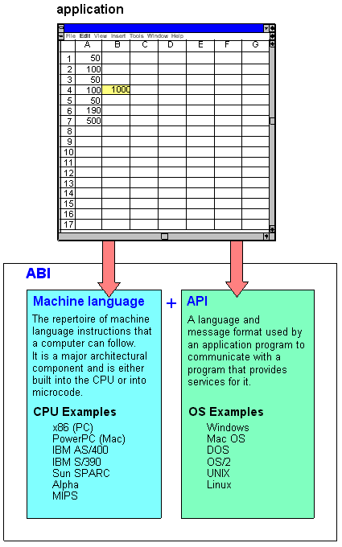

# Operating System
---
A computer is ultimately a set of interconnected peripheral. The [operating system](https://www.youtube.com/watch?v=26QPDBe-NB8) (OS) makes it usable by hiding complexity and offering a programmable interface. Though often taken for granted, the OS is less than a century old yet underpins nearly all computing devices today. We inevitably encounter it when moving from high-level code down to low-level hardware instructions.

<!-- https://pravin-hub-rgb.github.io/BCA/resources/sem2/operating_sys/index.html -->
<!-- https://www.jmeiners.com/lc3-vm/#:lc3.c -->
<!-- https://www.youtube.com/watch?v=ioJkA7Mw2-U -->
<!-- https://www.youtube.com/watch?v=xFMXIgvlgcY -->
<!-- https://youtu.be/eP_P4KOjwhs?si=gOPQIxLH6cQMk8vq -->

<!-- round robin, fifo, ... -->
<!-- If data is large or its size varies, we use heap, and in stack, we just maintain a reference (i.e. pointer) to the value.... The *malloc* function in C internally uses *mmap* to free up a dedicated space and reclaim the OS for reusability. *free* does .... By using linked list, we do not need large amounts of contiguous memory, although the this data structure leads to decreased probabilities of cache hits. If our aim is to maintain compactness in our list, what we need is an array list (e.g. an array wrapped in the C struct with relevant metadata) -->


## I
---
### **1.1. Overview**
<p style="margin-bottom: 12px;"> </p>

In the earliest generation of electronic computers (1940s–50s), machines such as the ENIAC were programmed manually in absolute machine code, often by rewiring circuits or feeding in [punched cards](). Programs ran in isolation, required laborious setup, and so took significant idle time between jobs. The concept of an operating system began to emerge in the 1950s with the introduction of [batch processing systems](), and a major milestone was [GM-NAA I/O]() developed by General Motors (GM) for the [IBM 701](). It enabled users to group jobs into batches (i.e. still favoured homogeneity within batches), and execute them sequentially without manual intervention.

The 1960s witnessed a shift toward [multiprogramming]() and [time-sharing systems]() (TSS), which enabled the [concurrent execution]() of multiple programs residing in memory while the CPU rapidly switched between them. The shift catalysed the development of a TSS called [Multics](), jointly built by AT&T Bell Labs, GE, and MIT. It aimed to provide a robust, multi-user computing environment. However, dissatisfaction with its complexity led researchers at Bell Labs to develop [Unix]() in the early 1970s. This simper OS adopted a modular kernel, hardware abstraction, and multi-user support, while these principles still remain central to modern operating system design.

The 1980s ushered in the era of personal computing, shifting OS development from [command-line interfaces]() (CLI) toward [graphical user interfaces]() (GUI) to improve accessibility for non-technical users. Microsoft introduced [MS-DOS]() in 1981, a single-tasking CLI-based OS, followed by successive versions of [Windows]() that adopted cooperative and later preemptive multitasking. Concurrently, Apple’s [Macintosh OS]() (macOS) brought the GUI into mainstream. In the 1990s, [Linux]() emerged as a free and open-source Unix-like alternative. Rooted in Unix philosophy, Linux fuelled innovation across servers, mobile devices, and also embedded systems.

- <iframe width="500" height="280" src="https://www.youtube.com/embed/kKJxzay85Vk?si=nemG0E7zqsjleTpG" title="YouTube video player" frameborder="0" allow="accelerometer; autoplay; clipboard-write; encrypted-media; gyroscope; picture-in-picture; web-share" referrerpolicy="strict-origin-when-cross-origin" allowfullscreen></iframe>

### **1.2. Operating System**
<p style="margin-bottom: 12px;"> </p>

A modern OS enforces a strict seperation between [user mode]() (unprivileged) and [kernel mode]() (privileged). This hardware-supported principle protects the system by preventing unprivileged programs from directly accessing critical hardware resources. For example, [application programs](), such as the text editor, are generally run as unprivileged processes and must rely on the services exposed by the OS (e.g. file I/O or memory allocation). [System programs]() including shells, compilers, [daemons](), and init systems, that also reside in user space, provide runtime infrastructure which interprets user instructions and translates them into requests the kernel can fulfill.

As drawn below, the [application programming interface]() (API) provided by standard libraries (e.g. libc on Unix-like systems) abstracts the complexity of invoking system calls directly from user mode. That is, when a user-space program requires privileged functionality (e.g. spawning a process), it leverages a high-level API routine which internally issues one or more [system calls](). These serve as well-defined entry points into the kernel, usually implemented through software interrupts, trap instructions, or CPU-specific mechanisms. This controlled access is generally preferred to ensure only trusted kernel code can modify hardware or access protected memory.

While APIs define the data structures and function signatures available to programmers, the [application binary interface](https://stackoverflow.com/questions/3784389/difference-between-api-and-abi) (ABI) governs how a compiled program communicates with the OS at the binary level. It specifies calling conventions (i.e. how params passed from the program to the OS - typically via registers or the stack), register usage, and system call invocation method. ABI differences also encompass executable formats - {Linux: [executable and linkable format]() (ELF), Windows: [portable executable]() (PE)}, directory layouts, process models, and available runtime libraries. As a result, most programs are not only architecture-specific but also OS-dependent.

- <div style="position: relative; display: inline-block; background-color: white;">  <a href="https://www.sciencedirect.com/topics/computer-science/application-binary-interface" target="_blank" style="position: absolute; bottom: -8px; right: 4px; font-size: 12px;">[src]</a> </div>

On Linux running on [x86-64]() (i.e. the Intel and AMD CPU architecture), for instance, when calling *write()* via the C standard library to output data to a file, the predefined system call which executes in kernel mode to perform the actual operation is invoked by placing the "syscall number" (e.g. 1) in the [rax](https://www.cs.uaf.edu/2017/fall/cs301/lecture/09_11_registers.html) register, and arguments ("file descriptor", "buffer pointer", "byte count") are passed via [rdi](), [rsi](), and [rdx](), respectively. In contrast, Windows uses *WriteFile()* with a distinct ABI and system call interface. Cross-platform compatibility relies on standard APIs such as POSIX or the use of portability layers such as the JVM or Python interpreter.

```
section .data
    msg		db	"Hello", 10	; "Hello\n"
    msg_len	equ	$ - msg		; Length of the message

section .text
    global _start

_start:
    mov		rax, 1			; syscall number for write
    mov		rdi, 1			; file descriptor (stdout)
    mov		rsi, msg			; pointer to buffer
    mov		rdx, msg_len		; number of bytes
    syscall						; invoke kernel

    ; Exit the program (syscall 60)
    mov		rax, 60			; syscall number for exit
    xor		rdi, rdi			; exit code 0
    syscall
```

### **1.3. Shell & Kernel**
<p style="margin-bottom: 12px;"> </p>

Accordingly, interaction with the OS kernel often occurs through two common interfaces: i) standard libraries that wrap system calls; ii) [shells]() that act as command interpreters; In both cases, transitions from user mode to kernel mode are necessary for any privileged operations. Specifically, the [kernel](), which operates at the highest privilege level, forms the operating system's core and mediates all access to hardware and protected resources, while the shell serves as the outermost user-facing interface. Note that the dual-mode architecture is enforced by hardware (e.g. using a mode bit), but both the kernel and shell themselves are implemented in software.

Advanced CLI-based shells (e.g. [Bourne Again Shell]() (Bash), [Zsh](), and [Fish]()) support scripting, I/O redirection, job control, and process substitution. They parse user commands (e.g. *ls*, *ps*, *cat*), resolves the appropriate binaries, and initiates execution using system calls such as *fork()*, *exec()*, and *wait()*. [Terminal emulators]() (e.g., macOS Terminal, GNOME Terminal) merely host shell processes, and thus, should not be confused with the shell itself. Likewise, graphical environments (e.g., [GNOME](), [Windows Explorer]()), though visually distinct, provide a user-friendly interface to the same underlying system calls and kernel services.

While the kernel manages low-level operations such as CPU scheduling, memory management, IPC, and device I/O, its architectural design critically affects system performance, modularity, and fault tolerance. [Monolithic kernels]() (e.g. Linux) bundle all core services into a single privileged binary, enabling fast in-kernel communication but increasing the risk of system-wide failure. [Microkernels]() (e.g. seL4) retain only minimal services (e.g. scheduling) in kernel space, delegating others (e.g. file systems) to user space to improve modularity and fault isolation. [Hybrid kernels]() (e.g. XNU in macOS) adopt a layered structure to reconcile these trade-offs.

<!-- - <div style="position: relative; display: inline-block;">  <a href="https://minnie.tuhs.org/CompArch/Lectures/week07.html" target="_blank" style="position: absolute; bottom: -8px; right: 4px; font-size: 12px;">[src]</a> </div> -->

<!-- - <div style="position: relative; display: inline-block;">  <a href="https://namu.wiki/w/%EC%9A%B4%EC%98%81%EC%B2%B4%EC%A0%9C" target="_blank" style="position: absolute; bottom: -8px; right: 4px; font-size: 12px;">[src]</a> </div> -->

<!-- - <div style="position: relative; display: inline-block;">  <a href="https://effective-shell.com/part-2-core-skills/what-is-a-shell/" target="_blank" style="position: absolute; top: 0px; left: 4px; font-size: 12px;">[src]</a> </div> -->

<!-- - <div style="position: relative; display: inline-block;">  <a href="http://ibgwww.colorado.edu/~lessem/psyc5112/usail/concepts/anatomy-of-unix/anatomy.html" target="_blank" style="position: absolute; top: 0px; left: 4px; font-size: 12px;">[src]</a> </div> -->

<!-- https://velog.io/@juliejung98/%EC%89%98%EA%B3%BC-%EC%BB%A4%EB%84%90-Shell-Kernel -->


<!-- https://www.josehu.com/technical/2021/05/24/os-kernel-models.html -->

<!-- When a system boots, the kernel is loaded from the storage drive into memory and remains resident there throughout the system’s uptime. The kernel binary is typically located in a reserved partition on disk—like /boot/vmlinuz in Linux—and is loaded into RAM by a bootloader such as GRUB or Windows Boot Manager. Once loaded, the kernel takes control of the machine, initializes memory and I/O subsystems, mounts the root filesystem, and starts the first user-space process (commonly init or systemd). From this point onward, the kernel remains in kernel space, a protected region of memory that is isolated from unprivileged programs. This privilege separation, enforced by hardware-level mechanisms such as CPU rings or modes, ensures that only trusted kernel code can execute sensitive operations, thereby preserving system integrity and stability. Although it begins its life on disk, the kernel’s operational lifetime is fully in memory, where it orchestrates all software and hardware activity on the system. -->

- <div style="position: relative; display: inline-block; background-color: white;">  <a href="https://leimao.github.io/blog/Microkernel-VS-Monolithic-Kernel-OS/" target="_blank" style="position: absolute; top: 0px; left: 4px; font-size: 12px;">[src]</a> </div>

<!-- - <div style="position: relative; display: inline-block;">  <a href="https://kuleuven-diepenbeek.github.io/osc-course/ch1-introos/intro-os/" target="_blank" style="position: absolute; top: 0px; left: 4px; font-size: 12px;">[src]</a> </div> -->

### **1.4. System Call**
<p style="margin-bottom: 12px;"> </p>

TODO...

<!-- - <iframe width="500" height="280" src="https://www.youtube.com/embed/H4SDPLiUnv4?si=ml8bT-7fhG9_0xkU" title="YouTube video player" frameborder="0" allow="accelerometer; autoplay; clipboard-write; encrypted-media; gyroscope; picture-in-picture; web-share" referrerpolicy="strict-origin-when-cross-origin" allowfullscreen></iframe> -->

<!-- strace to monitor system calls -->
<!-- https://www.youtube.com/watch?v=19_vVxmTfPg -->
<!-- System calls in modern OS are the primary mechanism by which user-space programs request services from the kernel. Because direct access to hardware and critical resources is prohibited in user mode, programs must rely on the kernel to perform operations such as file I/O, memory allocation, process creation, and network communication. These requests are issued through system calls, which act as controlled entry points into kernel space. High-level programming interfaces provided by standard libraries (e.g. [libc](), [glibc](), or language runtimes such as Python’s *os* module) abstract these calls into user-friendly functions, translating them into low-level instructions that prepare the necessary registers and trigger the transition into kernel mode.

This transition is supported by [dual-mode]() CPU operation, which enforces a strict boundary between user mode and kernel mode. When a system call is invoked—on x86-64, typically using the syscall instruction—the processor switches from [user mode]() to [kernel mode](), saving the user context and transferring control to a predefined system call handler in the kernel. The system call number (usually passed in a designated register) determines which kernel routine to execute, and the accompanying arguments are validated for correctness and security. After the operation completes, the kernel restores the original execution context and returns to user mode, resuming the program. This architecture ensures that while applications can access powerful system capabilities, they do so through a carefully controlled interface that preserves system integrity, prevents unauthorized access, and isolates faults. -->

<!-- In modern OS, user-space software must invoke kernel functionality via [system calls]()—entry points into the kernel provided by standard libraries such as *libc*, *glibc*, or language-specific runtimes (e.g. Python’s *os*, *sys*). These libraries translate user-friendly API calls into low-level requests to the kernel. The CPU enforces this boundary via dual-mode operation: [user mode]() restricts direct hardware access, while [kernel mode]() permits it. A system call triggers a [context switch]() to kernel mode; after execution, control returns to the calling process. This controlled handoff ensures safety, enforces isolation, and maintains system integrity. -->

<!-- System calls are the primary interface (i.e. APIs exposed by the kernel) through which user-space programs request services from the kernel. Because user programs run in restricted user mode, they are not permitted to directly access hardware or critical system resources. Instead, when a program needs to perform a privileged operation—such as reading from a file, allocating memory, or creating a new process—it issues a system call. This triggers a controlled context switch into kernel mode, where the requested operation is validated and executed. Once the operation is complete, control is returned to the user process along with any relevant results or error codes. This mechanism ensures both safety (by enforcing privilege boundaries) and consistency (by standardizing access to resources). -->

<!-- 
To simplify system call usage, most application developers interact with them indirectly through standard libraries like libc, glibc, or language runtimes. For instance, when a C program calls fopen(), the library internally prepares arguments, invokes the lower-level open() system call, and handles return values. This layered abstraction hides architecture-specific details (e.g., syscall numbers, register conventions) from the programmer, enabling portability and maintainability. Behind the scenes, invoking a system call typically involves placing parameters in CPU registers and executing a trap instruction—such as syscall on x86_64 or svc on ARM—that transitions the CPU into kernel mode at a predefined entry point.

System calls can be grouped into several broad categories, reflecting the types of services the OS provides. Process control calls (fork(), exec(), wait()) handle creation and lifecycle management of processes. File operations (read(), write(), open(), close()) enable programs to perform I/O on file descriptors abstracting real or virtual files. Memory management calls (mmap(), brk()) govern the allocation and mapping of address space. Device and network I/O are handled through calls like ioctl() and socket(). There are also informational calls (getpid(), uname()) that report system state. By keeping this interface minimal and stable, the kernel enforces strict control over hardware access while allowing rich functionality in user space, supporting everything from desktop applications to network servers and container runtimes.

- <div style="position: relative; display: inline-block; background-color: white;">  <a href="https://pravin-hub-rgb.github.io/BCA/resources/sem2/operating_sys/intro/index.html" target="_blank" style="position: absolute; bottom: -8px; right: 4px; font-size: 12px;">[src]</a> </div> -->

<!-- https://pravin-hub-rgb.github.io/BCA/resources/sem2/images/typesc.svg -->

<!-- - <iframe width="500" height="280" src="https://www.youtube.com/embed/eP_P4KOjwhs?si=wDkkO45KIt-r8pln" title="YouTube video player" frameborder="0" allow="accelerometer; autoplay; clipboard-write; encrypted-media; gyroscope; picture-in-picture; web-share" referrerpolicy="strict-origin-when-cross-origin" allowfullscreen></iframe> -->

<!-- - <div style="position: relative; display: inline-block;">  <a href="https://velog.io/@ongddree/%EC%9A%B4%EC%98%81%EC%B2%B4%EC%A0%9C-%EC%9D%B4%EC%A4%91-%EB%8F%99%EC%9E%91-%EB%AA%A8%EB%93%9COS-dual-mode-operation" target="_blank" style="position: absolute; bottom: -8px; right: 4px; font-size: 12px;">[src]</a> </div>\ -->

<!-- 시스템 콜이 성공적으로 처리되면 커널은 IRET(Interrupt Return) 명령어를 사용하여 커널 모드에서 사용자 모드로 전환하고 응용 프로그램이 시스템 콜을 호출한 위치로 돌아간다. -- https://velog.io/@ongddree/%EC%9A%B4%EC%98%81%EC%B2%B4%EC%A0%9C-%EC%9D%B4%EC%A4%91-%EB%8F%99%EC%9E%91-%EB%AA%A8%EB%93%9COS-dual-mode-operation -->

<!-- 
### **1.4. OS Virtualisation**
<p style="margin-bottom: 12px;"> </p>


- https://insights.sei.cmu.edu/blog/virtualization-via-containers/

- https://blog.bytebytego.com/p/what-are-the-differences-between

- https://stackoverflow.com/questions/71955661/what-is-the-difference-between-containers-and-process-vms-not-system-vms  

Virtualization abstracts hardware resources, enabling multiple virtual systems to run on a single physical machine as though each were operating independently. It improves resource utilization, isolation, and scalability, forming the backbone of modern computing environments. Hardware virtualization, achieved through hypervisors, is a key approach. Type 1 hypervisors like VMware ESXi run directly on hardware for high performance, while Type 2 hypervisors like VirtualBox operate atop an existing OS, providing ease of use at the cost of efficiency.

OS-level virtualization, exemplified by containers like Docker, isolates applications within lightweight environments that share the host OS kernel. Containers are faster to deploy and consume fewer resources than virtual machines, making them ideal for microservices and cloud-native applications. However, their reliance on a shared kernel requires robust isolation mechanisms to maintain security.

- <div style="position: relative; display: inline-block;">  <a href="https://insights.sei.cmu.edu/blog/virtualization-via-containers/" target="_blank" style="position: absolute; top: 0px; left: 4px; font-size: 12px;">[src]</a> </div> -->

<!-- Containersiation (i.e. OS-level virtualisation using a conainer) is ... || https://blog.bytebytego.com/p/what-are-the-differences-between -->


## II
---
### **2.1. Unix (WIP)**
<p style="margin-bottom: 12px;"> </p>

Heading back to the history, Unix originated in 1969 at Bell Labs, when Ken Thompson and Dennis Ritchie repurposed a spare [PDP-7]() minicomputer to develop a lightweight, interactive operating system. Initially dubbed “Unics” (i.e. a pun on the earlier Multics project), the system abandoned the complexity of its predecessor in favor of simplicity and modularity. Key design choices, such as a [hierarchical file system]() (HFS), segmented memory, dynamic linking, and a minimal but powerful API, reflected an emerging philosophy of composability, portability, and clear separation of concerns between kernel-level mechanisms and user-space utilities.

A foundational abstraction in Unix was its uniform treatment of input/output. By representing all I/O resources, including files, devices, IPC endpoints, as [file descriptors](), Unix allowed disparate resources to be accessed via the same read/write interface. This “everything is a file” model, combined with the system’s use of plain-text configuration and output, led the environment very scriptable. Programs inherently were designed as small, single-purpose utilities that could be chained together using [pipes]() (\|). For example, the command *cat log.txt \| grep error \| sort \| uniq -c* reads a log file, filters lines containing “error,” sorts them, and collapses duplicates into counts.

Another notable contribution was indeed portability. In the early 1970s, Unix was rewritten from assembly into the newly developed [C programming language](https://seriouscomputerist.atariverse.com/media/pdf/book/C%20Programming%20Language%20-%202nd%20Edition%20(OCR).pdf), that was also created by Ritchie at Bell Labs. C evolved from the earlier [B programming language]() (i.e. derived from BCPL) and introduced key features such as typed variables, structured control flow, and more direct memory manipulation. This decoupling from machine-specific assembly code enabled Unix to be recompiled on a wide variety of hardware platforms, marking it as the first widely portable operating system, while the co-evolution of Unix and C defined a generation of system-level programming.

- <iframe width="500" height="280" src="https://www.youtube.com/embed/tc4ROCJYbm0?si=HTFkF_s-YHnPd35_" title="YouTube video player" frameborder="0" allow="accelerometer; autoplay; clipboard-write; encrypted-media; gyroscope; picture-in-picture; web-share" referrerpolicy="strict-origin-when-cross-origin" allowfullscreen></iframe>

Although Bell Labs developed Unix, its parent company AT&T was prohibited by the 1934 Communications Act and a 1956 antitrust consent decree from entering the commercial computing market. As a result, Unix was distributed at little or no cost to universities and research institutions, which led to widespread academic adoption. One of the most influential offshoots was the Berkeley Software Distribution (BSD), initiated in the late 1970s by Bill Joy and the Computer Systems Research Group (CSRG) at the University of California, Berkeley. BSD began as a set of enhancements to AT&T Unix but matured into a standalone operating system by the late 1980s. Backed by DARPA funding, BSD introduced foundational features for modern networking, including the first complete implementation of the TCP/IP protocol stack, positioning it as a reference platform for early Internet development.

BSD’s permissive licensing model and advanced technical capabilities attracted commercial interest during the 1980s and 1990s. Major vendors adopted BSD-derived codebases in systems such as SunOS (Sun Microsystems), DEC Ultrix (Digital Equipment Corporation), and NeXTSTEP (NeXT Inc.). BSD also laid the groundwork for enduring open-source projects, including FreeBSD, NetBSD, OpenBSD, and DragonFly BSD, which continue to support servers, research environments, and embedded systems. Its architectural principles and clean codebase allowed BSD to become deeply embedded in mainstream products: Apple’s Darwin, the Unix core of macOS and iOS, is based on FreeBSD; parts of Microsoft Windows’ networking subsystem are BSD-derived; and its influence can be found in home routers, enterprise appliances, and gaming consoles like the PlayStation 5.

The increasing diversity of Unix variants, however, led to fragmentation that complicated software portability and system interoperability. To address this, the IEEE developed the POSIX (Portable Operating System Interface) standard in the late 1980s. POSIX defined a common set of system calls, shell commands, and utility behaviors to ensure consistent programming and runtime interfaces across Unix-like systems. Although POSIX compliance did not eliminate all difference (i.e. particularly among proprietary vendors) it significantly narrowed the gap and promoted a shared baseline. This effort played a key role in unifying the Unix ecosystem, allowing cross-platform development, and influencing the design of modern operating systems beyond the traditional Unix family.

- <div style="position: relative; display: inline-block; background-color: white;">  <a href="https://en.wikipedia.org/wiki/Unix-like" target="_blank" style="position: absolute;  bottom: -8px; right: 4px; font-size: 12px;">[src]</a> </div>

<!-- - <iframe width="500" height="280" src="https://www.youtube.com/embed/HADp3emVABg?si=slBlmD7_ktsw0__u" title="YouTube video player" frameborder="0" allow="accelerometer; autoplay; clipboard-write; encrypted-media; gyroscope; picture-in-picture; web-share" referrerpolicy="strict-origin-when-cross-origin" allowfullscreen></iframe> -->

### **2.1. Linux**
### **2.1. Linux’s FHS**
### **2.1. Linux Distributions**