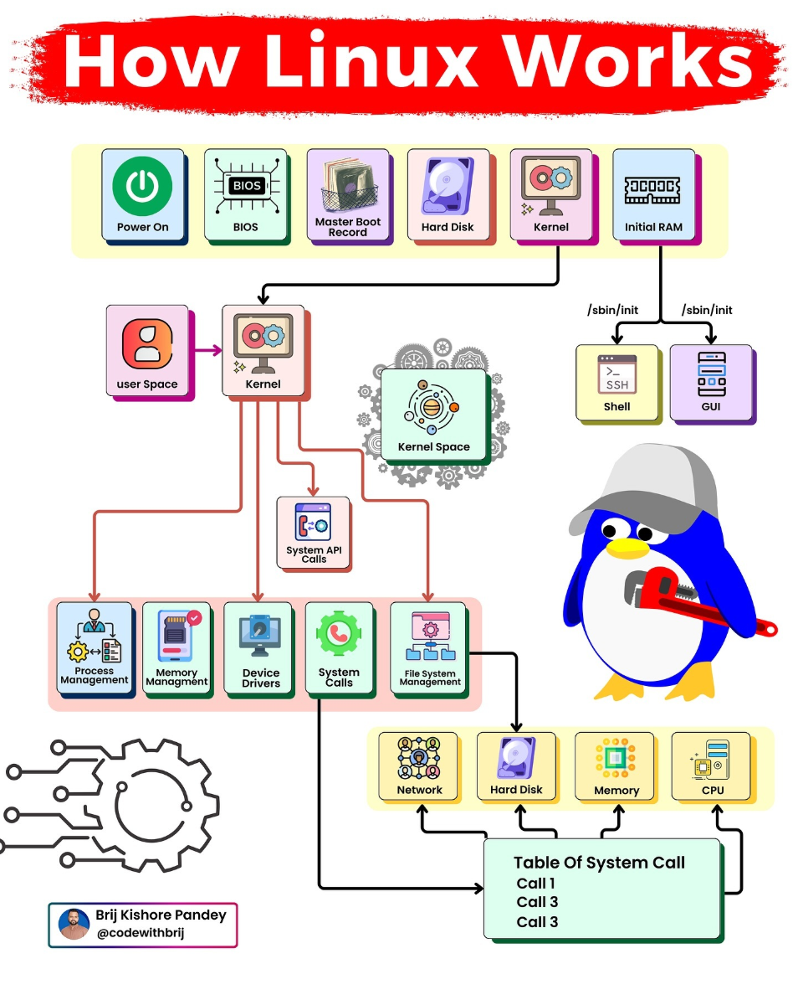

# Operating System
---
<!-- https://pravin-hub-rgb.github.io/BCA/resources/sem2/operating_sys/index.html -->
<!-- https://www.jmeiners.com/lc3-vm/#:lc3.c -->
<!-- https://www.youtube.com/watch?v=ioJkA7Mw2-U -->
<!-- https://www.youtube.com/watch?v=xFMXIgvlgcY -->
<!-- https://youtu.be/eP_P4KOjwhs?si=gOPQIxLH6cQMk8vq -->

<!-- <iframe width="560" height="315" src="https://www.youtube.com/embed/26QPDBe-NB8?si=J8FBjnS8tE8PHY5k" title="YouTube video player" frameborder="0" allow="accelerometer; autoplay; clipboard-write; encrypted-media; gyroscope; picture-in-picture; web-share" referrerpolicy="strict-origin-when-cross-origin" allowfullscreen></iframe> -->

<!-- Once the kernel is successfully loaded, it takes over the full control of ...

<!-- round robin, fifo, ... -->

<!-- If data is large or its size varies, we use heap, and in stack, we just maintain a reference (i.e. pointer) to the value.... The *malloc* function in C internally uses *mmap* to free up a dedicated space and reclaim the OS for reusability. *free* does .... By using linked list, we do not need large amounts of contiguous memory, although the this data structure leads to decreased probabilities of cache hits. If our aim is to maintain compactness in our list, what we need is an array list (e.g. an array wrapped in the C struct with relevant metadata) -->

## I
---
### **1.1. The Origin: From Punch Cards to Linux**

 

In the earliest generation of electronic computers (1940s–50s), machines like the ENIAC were manually programmed in absolute machine code, with no system software to manage resources or automate tasks. Programs were executed one at a time, and computers were operated directly by engineers using [switches]() and [punch cards](). The concept of an [operating system]() (OS) began to emerge in the 1950s, with the introduction of batch processing systems such as [GMOS](), developed by General Motors for the [IBM 701](). These systems grouped jobs into batches, automating job transitions and reducing idle time.

The 1960s saw the birth of [multiprogramming]() and [time-sharing systems](), which allowed multiple jobs or users to share the CPU, giving rise to interactive computing. Projects like MIT’s [compatible time-sharing system]() (CTSS) and [Multics]() pioneered key OS concepts such as [hierarchical file systems](https://www.usenix.org/legacy/event/hotos09/tech/full_papers/seltzer/seltzer.pdf) (HFS), memory protection, and user-level abstraction. These ideas culminated in the development of Unix in the early 1970s, which introduced principles of modularity, portability, and multi-user design that still influence OS design today. The spread of minicomputers such as the [programmed data processor]() (PDP) helped popularise the use of OS outside institutional settings.

<!-- Early OS designs focused on batch processing, where jobs were executed sequentially, bringing basic concepts like scheduling and resource allocation. Then the advent of [time-sharing systems]() in the 1960s allowed multiple users to interact with a computer simultaneously, pioneering multi-user capabilities.  -->

The 1980s ushered in the personal computing era, where OS development became focused on the [graphical user interfaces]() (GUI) over the traditional [command-line interfaces]() (CLI). Microsoft introduced [MS-DOS]() in 1981, followed by [Windows]() in subsequent years, ultimately becoming the dominant OS in the consumer market. Around the same time, Apple’s [Macintosh OS]() (macOS) brought GUI to the mainstream. Meanwhile, [Linux](), inspired by [Unix](), emerged in the 1990s as a free, open-source OS, fueling innovation across servers, mobile devices, and embedded systems. That is, operating systems in these days form the foundation for nearly all computing platforms. <!-- by managing hardware resources and enabling applications to run securely and efficiently. -->

<iframe width="560" height="315" src="https://www.youtube.com/embed/nwDq4adJwzM?si=JZexAZMHwrcAvPbN" title="YouTube video player" frameborder="0" allow="accelerometer; autoplay; clipboard-write; encrypted-media; gyroscope; picture-in-picture; web-share" referrerpolicy="strict-origin-when-cross-origin" allowfullscreen></iframe>

<!-- - 
  <a href="https://www.vbforums.com/showthread.php?900608-Punch-cards" target="_blank" style="position: absolute; bottom: -8px; right: 4px; font-size: 12px;">[src]</a> 
 -->

<!-- Apparently, the maximum utilisation of computer hardware is challenging since a computer is just a set of metal components, each has a unique and complex design, that are being wired up. Only the level of abstraction achieved by the operating system's kernel can free up users because it is relatively easier to communicate with the OS when borrowing compute power from hardware. Thereby we define a modern [operating system]() (OS) as an intermediary program which resides in RAM and manages hardware resources for its users and their applications through its kernel and system programs.  -->

<!-- History of OS... https://pravin-hub-rgb.github.io/BCA/resources/sem2/operating_sys/intro/index.html -->

<!-- In the early days, ... || [Batch Processing Systems]() (1950s-60s): The earliest systems handling sequential execution of jobs, leading to concepts of scheduling and resource allocation. || [Time-Sharing Systems]() (1960s-70s): Enabled multiple users to share computer resources interactively, paving the way for multi-user systems.  -->

<!-- Modern OS are tailored to diverse needs from personal computing to clouding, and balance efficiency, flexibility, and security by managing process scheduling, memory allocation, and device communication. Operating systems simplify interaction via [graphical user interfaces]() (GUIs) while offering powerful tools like [command-line interfaces]() (CLIs) for advanced users. || Mobile OS: Android, iOS || Real-time OS: designed for time-critical tasks, emerged to handle applications like industrial control and aerospace systems. -->

### **1.2. Operating System**

 

<!-- An operating system is the intermediary between hardware and software, managing system resources and enabling users and programs to interact with the machine efficiently. At a basic level, the OS abstracts (i.e. shields) the raw hardware complexity and provides standardized services such as program execution, memory allocation, file system access, device communication, and network handling. Whether it’s loading a browser or accessing a file, these tasks rely on the operating system to coordinate execution, resource sharing, and access permissions. -->

[Application programs]() are initiated and interacted with directly by the user and are generally unprivileged processes that rely on OS services to function. [System programs](), while also running in user space, provide essential services closer to the OS itself: examples include shells, system utilities, compilers, init systems, and background [daemons](https://en.wikipedia.org/wiki/Daemon_(computing)). These programs often serve as intermediaries between user commands and kernel-level operations. || That is, an OS is the fundamental software layer that provides an abstraction of hardware resources and defines the execution environment for application programs. It serves as both a resource manager <!--—controlling CPU scheduling, memory allocation, I/O operations, and file systems--> and a virtual machine, exposing high-level, consistent [application program interfaces]() (APIs) for user-space programs to interact with disparate hardware. <!-- Note that it may be best to loosely define an OS due to its diverse roles and responsibilities. -->

<!-- - 
  <a href="https://minnie.tuhs.org/CompArch/Lectures/week07.html" target="_blank" style="position: absolute; bottom: -8px; right: 4px; font-size: 12px;">[src]</a> 
 -->

<!-- - 
  <a href="https://namu.wiki/w/%EC%9A%B4%EC%98%81%EC%B2%B4%EC%A0%9C" target="_blank" style="position: absolute; bottom: -8px; right: 4px; font-size: 12px;">[src]</a> 
 -->

<!-- - 
  <a href="https://429151971640327878.weebly.com/blog/introduction-to-operating-system" target="_blank" style="position: absolute; top: 0px; left: 4px; font-size: 12px;">[src]</a> 
 -->

To interact with hardware or perform privileged operations, user-space software must communicate with the kernel. However, this interaction is mediated by standard libraries (such as *libc*, *glibc*, or language-specific runtimes such as Python's *os* and *sys*), which expose user-friendly APIs, known as [system calls]() (i.e. the entry points to the kernel), that eventually translate into kernel requests (so users no need to invoke the kernel directly). || This transition from user code to kernel code is safeguarded by the CPU’s dual-mode operation: [user mode]() for regular processes, and kernel mode for the OS. System calls act as controlled gates that trigger a [context switch]() into [kernel mode](). Once the OS completes the requested operation, control returns to the user program. This hardware-enforced [privilege separation]() ensures that application code cannot directly manipulate devices or memory, preserving the system’s stability and security.

Because these interfaces and behaviors vary across operating systems, most programs are OS-specific by default, and so they depend on a particular system’s binary format (e.g., ELF on Linux, PE on Windows), system call conventions, directory structure, and available runtime libraries. Cross-platform compatibility is possible but requires adhering to standardised APIs (such as [Portable Operating System InterFace for Unix](https://velog.io/@bjk1649/POSIX%EB%9E%80) (POSIX)) or using portability layers (e.g. JVM or Python interpreter). As a result, developers often write and compile programs with a specific OS target in mind, reinforcing the OS’s role as the defining execution context for all software.

- <iframe width="560" height="315" src="https://www.youtube.com/embed/H4SDPLiUnv4?si=ml8bT-7fhG9_0xkU" title="YouTube video player" frameborder="0" allow="accelerometer; autoplay; clipboard-write; encrypted-media; gyroscope; picture-in-picture; web-share" referrerpolicy="strict-origin-when-cross-origin" allowfullscreen></iframe>

<!-- - 
  <a href="https://velog.io/@ongddree/%EC%9A%B4%EC%98%81%EC%B2%B4%EC%A0%9C-%EC%9D%B4%EC%A4%91-%EB%8F%99%EC%9E%91-%EB%AA%A8%EB%93%9COS-dual-mode-operation" target="_blank" style="position: absolute; bottom: -8px; right: 4px; font-size: 12px;">[src]</a> 
\ -->
 
 
### **1.3. Shell & Kernel**

 

The operating system acts as an interface between user-level applications and hardware, and this mediation is chiefly realized through two core components: the shell and the kernel. The [shell]() is the outermost user-facing layer of the OS, providing a command-line or graphical interface through which users interact with the system. When a user issues a command—like listing files, launching a program, or moving data—the shell parses the input, interprets it, and forwards appropriate requests to the kernel. Popular shells include Bash (Bourne Again SHell), Zsh, and Fish for command-line interfaces, and graphical shells like GNOME Shell or Windows Explorer for GUI-based environments. Shells are themselves system programs running in user space, offering convenience and abstraction without requiring users to directly invoke low-level operations.

The [kernel](), in contrast, is the privileged core of the OS. It executes in kernel mode and is solely responsible for managing the system’s hardware resources—CPU, memory, storage, and I/O devices—ensuring secure and efficient operation of all processes. It handles process scheduling, memory management, file systems, device drivers, and inter-process communication (IPC). || For example, Linux first operates on ...

<!-- - 
  <a href="https://effective-shell.com/part-2-core-skills/what-is-a-shell/" target="_blank" style="position: absolute; top: 0px; left: 4px; font-size: 12px;">[src]</a> 
 -->
<!-- - 
  <a href="http://ibgwww.colorado.edu/~lessem/psyc5112/usail/concepts/anatomy-of-unix/anatomy.html" target="_blank" style="position: absolute; top: 0px; left: 4px; font-size: 12px;">[src]</a> 
 -->

<!-- https://velog.io/@juliejung98/%EC%89%98%EA%B3%BC-%EC%BB%A4%EB%84%90-Shell-Kernel -->

Kernels can be classified into several architectures. A [monolithic kernel]() (e.g., Linux) includes all core services in a single large binary, providing fast performance through tight integration but making modularity more challenging. A [microkernel]() (e.g., MINIX, QNX) keeps only essential services in kernel space (such as scheduling and IPC), delegating others (like drivers and filesystems) to user space, which improves fault tolerance at the cost of performance. There are also [hybrid kernels]() (e.g., Windows NT, XNU in macOS), which blend aspects of both, and exokernels, which expose low-level hardware interfaces to user space for maximum customizability and minimal abstraction.

<!-- https://www.josehu.com/technical/2021/05/24/os-kernel-models.html -->

<!-- When a system boots, the kernel is loaded from the storage drive into memory and remains resident there throughout the system’s uptime. The kernel binary is typically located in a reserved partition on disk—like /boot/vmlinuz in Linux—and is loaded into RAM by a bootloader such as GRUB or Windows Boot Manager. Once loaded, the kernel takes control of the machine, initializes memory and I/O subsystems, mounts the root filesystem, and starts the first user-space process (commonly init or systemd). From this point onward, the kernel remains in kernel space, a protected region of memory that is isolated from unprivileged programs. This privilege separation, enforced by hardware-level mechanisms such as CPU rings or modes, ensures that only trusted kernel code can execute sensitive operations, thereby preserving system integrity and stability. Although it begins its life on disk, the kernel’s operational lifetime is fully in memory, where it orchestrates all software and hardware activity on the system. -->

- 
  <a href="https://kuleuven-diepenbeek.github.io/osc-course/ch1-introos/intro-os/" target="_blank" style="position: absolute; top: 0px; left: 4px; font-size: 12px;">[src]</a> 

### **1.4. System Call**

System calls are the primary interface (i.e. APIs exposed by the kernel) through which user-space programs request services from the kernel. Because user programs run in restricted user mode, they are not permitted to directly access hardware or critical system resources. Instead, when a program needs to perform a privileged operation—such as reading from a file, allocating memory, or creating a new process—it issues a system call. This triggers a controlled context switch into kernel mode, where the requested operation is validated and executed. Once the operation is complete, control is returned to the user process along with any relevant results or error codes. This mechanism ensures both safety (by enforcing privilege boundaries) and consistency (by standardizing access to resources).

To simplify system call usage, most application developers interact with them indirectly through standard libraries like libc, glibc, or language runtimes. For instance, when a C program calls fopen(), the library internally prepares arguments, invokes the lower-level open() system call, and handles return values. This layered abstraction hides architecture-specific details (e.g., syscall numbers, register conventions) from the programmer, enabling portability and maintainability. Behind the scenes, invoking a system call typically involves placing parameters in CPU registers and executing a trap instruction—such as syscall on x86_64 or svc on ARM—that transitions the CPU into kernel mode at a predefined entry point.

System calls can be grouped into several broad categories, reflecting the types of services the OS provides. Process control calls (fork(), exec(), wait()) handle creation and lifecycle management of processes. File operations (read(), write(), open(), close()) enable programs to perform I/O on file descriptors abstracting real or virtual files. Memory management calls (mmap(), brk()) govern the allocation and mapping of address space. Device and network I/O are handled through calls like ioctl() and socket(). There are also informational calls (getpid(), uname()) that report system state. By keeping this interface minimal and stable, the kernel enforces strict control over hardware access while allowing rich functionality in user space, supporting everything from desktop applications to network servers and container runtimes.

- 
  <a href="https://pravin-hub-rgb.github.io/BCA/resources/sem2/operating_sys/intro/index.html" target="_blank" style="position: absolute; bottom: -8px; right: 4px; font-size: 12px;">[src]</a> 

<!-- https://pravin-hub-rgb.github.io/BCA/resources/sem2/images/typesc.svg -->

<!-- 
### **1.4. OS Virtualisation**

 

- https://insights.sei.cmu.edu/blog/virtualization-via-containers/

- https://blog.bytebytego.com/p/what-are-the-differences-between

- https://stackoverflow.com/questions/71955661/what-is-the-difference-between-containers-and-process-vms-not-system-vms  

Virtualization abstracts hardware resources, enabling multiple virtual systems to run on a single physical machine as though each were operating independently. It improves resource utilization, isolation, and scalability, forming the backbone of modern computing environments. Hardware virtualization, achieved through hypervisors, is a key approach. Type 1 hypervisors like VMware ESXi run directly on hardware for high performance, while Type 2 hypervisors like VirtualBox operate atop an existing OS, providing ease of use at the cost of efficiency.

OS-level virtualization, exemplified by containers like Docker, isolates applications within lightweight environments that share the host OS kernel. Containers are faster to deploy and consume fewer resources than virtual machines, making them ideal for microservices and cloud-native applications. However, their reliance on a shared kernel requires robust isolation mechanisms to maintain security.

- 
  <a href="https://insights.sei.cmu.edu/blog/virtualization-via-containers/" target="_blank" style="position: absolute; top: 0px; left: 4px; font-size: 12px;">[src]</a> 
 -->

<!-- Containersiation (i.e. OS-level virtualisation using a conainer) is ... || https://blog.bytebytego.com/p/what-are-the-differences-between -->

## II
---

### **2.1. Unix**
todo...

<!-- 

 

OS Implementations have been evolving ... || Unix, first developed at AT&T’s Bell Labs in 1969 and released in 1971, revolutionized operating system design with its emphasis on portability, modularity, and simplicity. Unlike earlier systems tied to specific hardware, Unix was written in the C programming language, allowing it to be easily ported across different architectures. This innovation made Unix one of the first truly versatile operating systems. Its hierarchical file system introduced a logical and consistent method for organizing files and directories, while features like pipes and redirection enabled powerful command-line utilities to be combined for complex tasks. These characteristics set the foundation for Unix’s widespread adoption in academia, research, and enterprise environments.

Unix introduced a philosophy of building small, modular tools that perform specific tasks well, which could be combined to achieve greater functionality. This approach not only made Unix extensible but also encouraged innovation in software development. Key principles, such as treating everything as a file (including devices), further simplified interactions between hardware and software. Over the decades, Unix evolved into various commercial and open-source derivatives, including BSD, AIX, and HP-UX, which retained its foundational principles while adding enhancements tailored to specific use cases.

Today, Unix serves as the backbone of many modern operating systems, influencing everything from Linux to macOS. Its legacy lives on in the standardized POSIX interface, ensuring compatibility across Unix-like systems. Unix’s design principles remain relevant, providing a model for creating robust, efficient, and scalable software systems that have stood the test of time.

<!-- [Unix](), first released in 1971, revolutionised OS design with portability, hierarchical file systems, and modularity. -->

- 
  <a href="https://namu.wiki/w/Unix" target="_blank" style="position: absolute; bottom: -8px; right: 4px; font-size: 12px;">[src]</a> 

### **3.2. Linux**

 

Linux, introduced by Linus Torvalds in 1991, is an open-source operating system inspired by Unix. As a kernel, Linux became the foundation for a wide variety of distributions (distros), each tailored to different use cases. Unlike proprietary systems, Linux’s open-source nature encourages collaboration and innovation, allowing developers worldwide to contribute improvements. It inherits Unix’s modularity and hierarchical file system, making it familiar to those with Unix experience.

Linux is highly adaptable, running on devices ranging from personal computers to servers, smartphones, and embedded systems. Its flexibility, combined with a strong focus on security and stability, has made it a favorite for developers, system administrators, and enterprises. Linux distributions often bundle the Linux kernel with system utilities and applications to form a complete operating system. Popular distros include Ubuntu, Fedora, Debian, and CentOS, each catering to specific audiences, from beginners to advanced users and enterprise environments.

Despite being a descendant of Unix, Linux stands out due to its emphasis on community-driven development. The GPL (General Public License) ensures that Linux remains free to use, modify, and distribute. This has led to its widespread adoption in cloud computing, web hosting, and supercomputing. As a direct competitor to proprietary systems like Windows and macOS, Linux continues to grow, shaping the future of open-source computing.

<!-- [Linux]() and [macOS](), as the main alternatives to Windows, are all decendants of Unix, and so have common on their structure and conventions. || The prior is an open-source OS that has led to the development of  -->

<!-- [Disk operating system]() (DOS) also made a huge impact on personal computing. While DOS provided file systems like FAT12 and FAT16 which users could manage files on disk, directories, and applications through [command-line interfaces]() (CLI), it merely operated on basic hardware components and experienced limitations in memory access (i.e. 640KB), multitasking, and native support for [graphical user interfaces]() (GUI). Microsoft (through acquisition) rebranded it as MS-DOS in 1981, and later introduced a graphical interface with Windows 1.0 layered on top of MS-DOS in 1985. MS-DOS was compatible with IBM PCs in the 1980s, but shortly [Windows]() evolved into a standalone OS in the 1990s. -->

<!-- - 
  <a href="https://www.instagram.com/p/DExccqLTHZo/" target="_blank" style="position: absolute; top: 0px; left: 4px; font-size: 12px;">[src]</a> 
 -->

### **3.3. Linux Distro**

 

Linux distributions, commonly referred to as distros, are complete operating systems built around the Linux kernel. They bundle system utilities, libraries, and applications to provide a cohesive user experience. Each distribution is tailored to specific user needs, whether it’s for general use, development, enterprise systems, or specialized environments. Popular examples include Ubuntu, known for its user-friendliness and beginner appeal, and Debian, a stable and community-driven distro that serves as the foundation for many others, including Ubuntu itself. Fedora offers cutting-edge software and is often used by developers, while CentOS provides a stable environment for servers.

Enterprise distributions like Red Hat Enterprise Linux (RHEL) and SUSE Linux Enterprise are designed for corporate environments, offering professional support and long-term stability. In contrast, lightweight distros like Arch Linux and Alpine Linux cater to advanced users and specific use cases, such as minimalistic systems or containerized environments. The diversity of Linux distros ensures that users can find a version suited to their technical proficiency and requirements.

The strength of Linux distributions lies in their customizability. Users can tailor the system to their preferences, choosing desktop environments (e.g., GNOME, KDE) or adding specific packages. The package management systems used by distros, such as APT for Debian-based systems or YUM/DNF for Red Hat-based ones, make software installation and updates seamless. This diversity and flexibility underscore the unique appeal of Linux in the computing world.

### **3.4. Filesystem Hierarchy Standard**

The Filesystem Hierarchy Standard (FHS) is a key convention defining the directory structure and layout of Unix-like operating systems. It provides guidelines for organizing files and directories to ensure consistency and predictability across systems. For instance, the root directory (”/”) serves as the base, with standard subdirectories like /bin for essential binaries, /etc for configuration files, and /var for variable data like logs and caches. This standardization simplifies system administration and software development by creating a predictable environment for locating files.

FHS ensures that critical system components are logically separated. For example, /usr houses user-installed software, while /home contains personal files for individual users. Temporary files are stored in /tmp, ensuring they do not interfere with other parts of the system. This separation enhances both security and maintainability, making it easier to back up user data, update system files, or troubleshoot issues.

While not all Unix-like systems strictly adhere to FHS, most Linux distributions follow it closely, ensuring interoperability and simplifying the learning curve for users and administrators. By providing a clear structure, FHS contributes to the reliability and organization of Unix-like systems, reinforcing their reputation for robustness and ease of use.

## III
---
### **2._. CPU Scheduling**

 

### **2.1. Process Management**

 

A process is an execution unit that requires hardware resources, such as CPU time and memory, to function. An OS handles processes by assigning resources and CPU time

	•	Process states (e.g., running, waiting, ready).
	•	Context switching.
	•	Interprocess communication (IPC).
	•	Deadlock handling.
	•	Process synchronization.

[Process Life Cycle]() introduces process states (e.g., New, Running, Waiting, Terminated) || [Scheduling Algorithms](): Explain scheduling types like Round-Robin, First-Come-First-Served, and Priority-based, emphasizing their impact on performance. || A [thread]() is the smallest unit of ...
 
- 
  <a href="https://pravin-hub-rgb.github.io/BCA/resources/sem2/operating_sys/unit2/index.html" target="_blank" style="position: absolute; bottom: -8px; right: 4px; font-size: 12px;">[src]</a> 

[Context switching]() refers to ...

- 
  <a href="https://pravin-hub-rgb.github.io/BCA/resources/sem2/operating_sys/unit2/index.html" target="_blank" style="position: absolute; bottom: -8px; right: 4px; font-size: 12px;">[src]</a> 

### **2.2. Memory Management**

 

The main responsiblities of modern OS includes... [Memory Management](): Explain how the OS allocates, protects, and releases memory across applications, handling both RAM and virtual memory. || [Paging and Segmentation](): Cunks of memory are called pages. Explain these memory management techniques, their differences, and roles in efficient memory use. || [Virtual Memory](): Describe its role in extending physical memory and how the OS handles page replacement policies (e.g., Least Recently Used).

<!-- Memory Allocation:
	•	When a program requests memory (e.g., using malloc in C), the runtime library typically makes system calls like brk or mmap to ask the OS for memory.
	•	The OS allocates memory from available resources, keeping track of which parts of memory are free or in use.
	3.	Paging: If the system runs out of physical memory, the OS may use a swap file on disk to simulate more memory, moving data between RAM and disk as needed. -->

<!-- A quick recap from the undergraduate operating systems course: information is grouped into pages in memory, and sometimes, we need to transfer chunks of information from one page to another. This is another hassle we must contend with when transferring information from the CPU to the GPU or vice-versa. 

NVIDIA has a new unified memory feature that does automatic page-to-page transfers between the CPU and GPU for error-free GPU processing when the GPU occasionally runs out of memory. The authors use this feature to allocate paged memory for the optimizer states, which are then automatically evicted to CPU RAM when the GPU runs out of memory and paged back into GPU memory when the memory is needed in the optimizer update step.

An operating system (OS) facilitates the execution of machine code by loading the binary executable into memory, setting up the process environment, and delegating its execution to the CPU. It reads the executable’s format (e.g., ELF, PE, or Mach-O), allocates memory, and initializes resources like the stack and heap. The CPU fetches and executes the machine code instructions directly, while the OS manages system calls, resource allocation, and interruptions to ensure smooth execution. Although the OS doesn’t interpret machine code itself, it plays a critical role in organizing and controlling its execution.

- https://wandb.ai/sauravmaheshkar/QLoRA/reports/What-is-QLoRA---Vmlldzo2MTI2OTc5
- https://stackoverflow.com/questions/26891413/diff-between-logical-memory-and-physical-memory -->

### **2.3. File Management**

 

A file is .... Note that a file is a passive storage entity for data, while a program is an active entity designed to manipulate data and perform actions, often using files as part of its operation....

[File System](): Structure and manage data storage on drives, handling file creation, access, and organization. || [File Allocation Methods](): Briefly mention methods like contiguous allocation and inode-based systems. || [Journaling](): Discuss how modern file systems like NTFS and ext4 log changes before making them permanent, enhancing data integrity.

### **2.4. Device Management**

 

[Device Management and Drivers](): Role of drivers in enabling communication between OS and hardware devices. || [Plug and Play]() (PnP): Describe how modern OSs automatically detect and configure new devices. -->

<!-- - responsible for memory allocation (stack and data regions); devs should be able to magage mem in heap region (e.g. malloc) -->

<!-- Paging -->
<!-- User mode (vs kernel model) -->
<!-- File systems -->
<!-- System calls -->
<!-- Multitasking (multi-threading or multi-processing) -->

-->