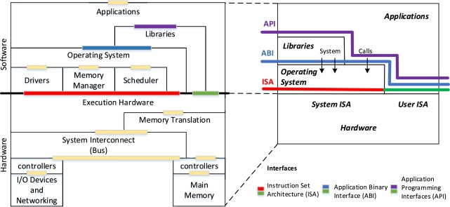
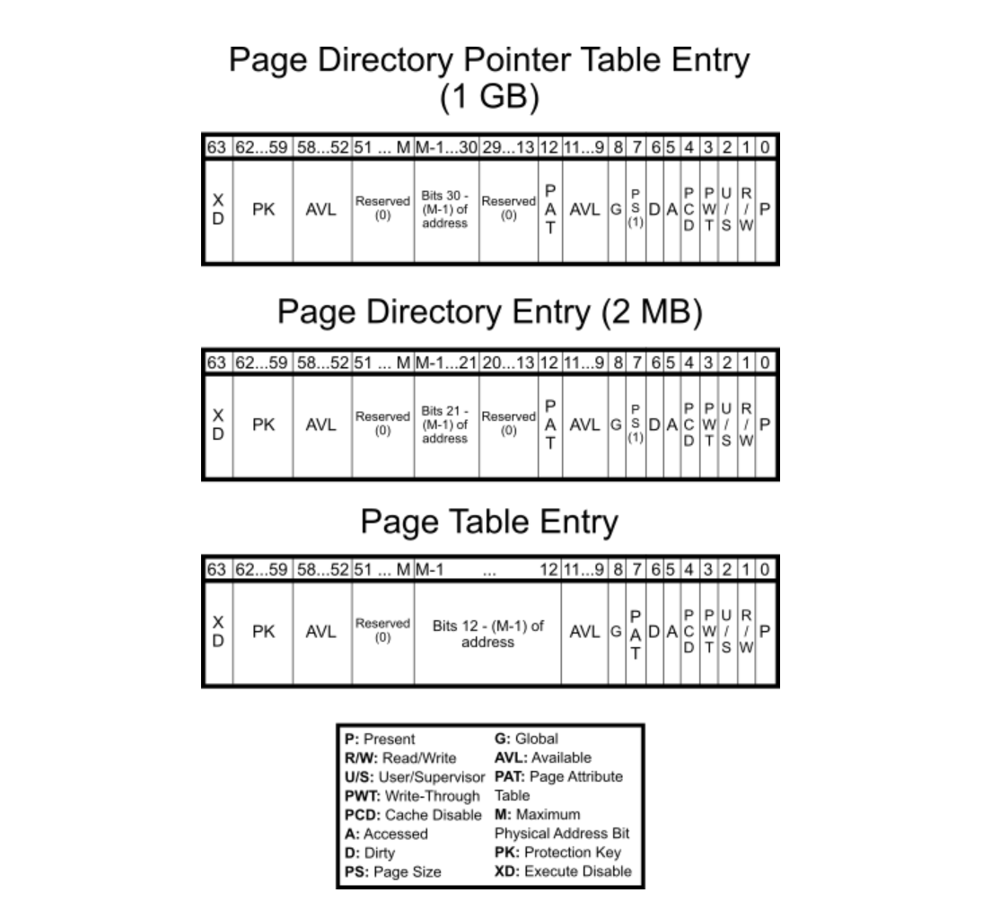

# Operating System

---
A digital computer is bare metal without the [operating system](https://www.youtube.com/watch?v=26QPDBe-NB8) (OS) in which it is often taken for granted while being less than a century old yet underpins nearly all computing devices today. We inevitably encounter it when moving from high-level code down to low-level hardware instructions. yoonjobabo

<!-- https://pravin-hub-rgb.github.io/BCA/resources/sem2/operating_sys/index.html -->
<!-- https://www.jmeiners.com/lc3-vm/#:lc3.c -->
<!-- https://www.youtube.com/watch?v=ioJkA7Mw2-U -->
<!-- https://www.youtube.com/watch?v=xFMXIgvlgcY -->
<!-- https://youtu.be/eP_P4KOjwhs?si=gOPQIxLH6cQMk8vq -->

<!-- round robin, fifo, ... -->
<!-- If data is large or its size varies, we use heap, and in stack, we just maintain a reference (i.e. pointer) to the value.... The *malloc* function in C internally uses *mmap* to free up a dedicated space and reclaim the OS for reusability. *free* does .... By using linked list, we do not need large amounts of contiguous memory, although the this data structure leads to decreased probabilities of cache hits. If our aim is to maintain compactness in our list, what we need is an array list (e.g. an array wrapped in the C struct with relevant metadata) -->

## I

---

### **1.1. Overview**

 

In the earliest generation of electronic computers (1940s–50s), machines such as the ENIAC were programmed manually in absolute machine code, often by rewiring circuits or feeding in [punched cards](). Programs ran in isolation, required laborious setup, and so took significant idle time between jobs. The concept of an operating system began to emerge in the 1950s with the introduction of [batch processing systems](), and a major milestone was [GM-NAA I/O]() developed by General Motors (GM) for the [IBM 701](). It enabled users to group jobs into batches (i.e. while favoured homogeneity within batches), and execute them sequentially without manual intervention.

The 1960s witnessed a shift toward [multiprogramming]() and [time-sharing systems]() (TSS), which presented the [concurrent execution]() of multiple programs residing in memory, supported by the CPU switching between them. It gave rise to the birth of [Multics](), a pioneering TSS designed to provide a robust, multi-user computing environment, and jointly built by AT&T Bell Labs, GE, and MIT. Nevertheless, dissatisfaction with its complexity led researchers at Bell Labs to develop [Unix]() in the early 1970s. This simper OS adopted a modular kernel, hardware abstraction, and multi-user support, while these principles still remain central to modern operating system design.

The 1980s ushered in the era of personal computing, shifting OS development from [command-line interfaces]() (CLI) toward [graphical user interfaces]() (GUI) to improve accessibility for non-technical users. Microsoft introduced [MS-DOS]() in 1981, a single-tasking CLI-based OS, followed by successive versions of [Windows]() that adopted cooperative and later preemptive multitasking. Concurrently, Apple’s [Macintosh OS]() (macOS) brought the GUI into mainstream. In the 1990s, [Linux]() emerged as a free and open-source Unix-like alternative. Rooted in Unix philosophy, Linux fuelled innovation across servers, mobile devices, and also embedded systems.

- <iframe width="500" height="280" src="https://www.youtube.com/embed/kKJxzay85Vk?si=nemG0E7zqsjleTpG" title="YouTube video player" frameborder="0" allow="accelerometer; autoplay; clipboard-write; encrypted-media; gyroscope; picture-in-picture; web-share" referrerpolicy="strict-origin-when-cross-origin" allowfullscreen></iframe>

### **1.2. Operating System**

 

A modern OS enforces a strict separation between [user mode]() (unprivileged) and [kernel mode]() (privileged). This hardware-supported principle protects the system by preventing unprivileged programs from directly accessing critical hardware resources. For example, [application programs](), such as the text editor, are generally run as unprivileged processes and must rely on the services exposed by the OS (e.g. file I/O or memory allocation). [System programs]() including shells, compilers, [daemons](), and init systems, that also reside in user space, provide runtime infrastructure which interprets user instructions and translates them into requests the kernel can fulfill.

As drawn below, the [application programming interface]() (API) provided by standard libraries (e.g. libc on Unix-like systems) abstracts the complexity of invoking system calls directly from user mode. That is, when a user-space program requires privileged functionality (e.g. spawning a process), it leverages a high-level API routine which internally issues one or more [system calls](). These serve as well-defined entry points into the kernel, usually implemented through software interrupts, trap instructions, or CPU-specific mechanisms. This controlled access is generally preferred to ensure only trusted kernel code can modify hardware or access protected memory.

While APIs define the data structures and function signatures available to programmers, the [application binary interface](https://stackoverflow.com/questions/3784389/difference-between-api-and-abi) (ABI) governs how a compiled program communicates with the OS at the binary level. It specifies calling conventions (i.e. how params passed from the program to the OS - typically via registers or the stack), register usage, and system call invocation method. ABI differences also encompass executable formats - {Linux: [executable and linkable format]() (ELF), Windows: [portable executable]() (PE)}, directory layouts, process models, and available runtime libraries. As a result, most programs are not only architecture-specific but also OS-dependent.

- 
  <a href="https://www.sciencedirect.com/topics/computer-science/application-binary-interface" target="_blank" style="position: absolute; bottom: -8px; right: 4px; font-size: 12px;">[src]</a> 

On Linux running on [x86-64]() (i.e. the Intel and AMD CPU architecture), for instance, when calling *write()* via the C standard library to output data to a file, the predefined system call which executes in kernel mode to perform the actual operation is invoked by placing the "syscall number" (e.g. 1) in the [rax](https://www.cs.uaf.edu/2017/fall/cs301/lecture/09_11_registers.html) register, while its args - ("file descriptor", "buffer pointer", "byte count") are passed via [rdi](), [rsi](), and [rdx](), respectively. In contrast, Windows uses *WriteFile()* with a distinct ABI and system call interface. Cross-platform compatibility of softwares is usually achieved by standardised APIs (e.g. POSIX) or the use of portability layers (e.g. the JVM or Python interpreter). <!-- which abstract away OS-specific details. -->

    section .data
          msg        db  "Hello", 10     ; "Hello\n"
          msg_len   equ $ - msg       ; Length of the message

    section .text
          global _start

    _start:
          ; write(stdout, msg, msg_len)
          mov     rax, 1                      ; syscall: write
          mov     rdi, 1                       ; file descriptor: stdout
          mov     rsi, msg                  ; buffer address
          mov     rdx, msg_len          ; number of bytes to write
          syscall

          ; exit(0)
          mov     rax, 60                    ; syscall: exit
          xor       rdi, rdi                     ; status = 0
          syscall

### **1.3. Shell & Kernel**

 

Accordingly, interaction with the OS kernel often occurs through two common interfaces: i) standard libraries that wrap system calls; ii) [shells]() which act as command interpreters; In both cases, transitions from user mode to kernel mode are necessary for any privileged operations. Specifically, the [kernel](https://www.josehu.com/technical/2021/05/24/os-kernel-models.html), which operates at the highest privilege level, forms the operating system's core and mediates all access to hardware and protected resources, while the shell serves as the outermost user-facing interface. Note that the dual-mode architecture is enforced by hardware (e.g. using a mode bit), but both the kernel and shell themselves are implemented in software.

Advanced CLI-based shells including [Bash](), [Zsh](https://github.com/ohmyzsh/ohmyzsh/wiki/Cheatsheet), and [Fish]() can support scripting, I/O redirection, job control, and process substitution. They parse user commands (e.g. *ls*, *ps*, *cat*), resolve appropriate binaries, and initiate execution through the system calls (e.g. *fork()*, *exec()*, and *wait()*). Note that [terminal emulators]() (e.g. Mac Terminal) merely host shell processes and should not be mistaken for the shell itself. On graphical systems, user interaction is instead mediated via desktop environments - {Linux: [GNOME](), macOS: [Finder](), Windows: [Explorer]()}, that provide a visual interface and invoke the same system calls and kernel services underneath. In fact, I use:

<!-- EMULATOR SECTION: CUSTOM STYLING APPLIED -->

  <pre>
  🖥️ Emulator: iTerm2
  |
  +-- 🐚 Shell: Zsh
      |
      |     • ohmyzsh (framework for zsh configuration)
      |
      +-- 📦 Package Manager: Homebrew
      |
      |     • lsd (ls deluxe - modern replacement for ls)
      |     • bat (better cat - enhanced syntax highlighting)
      |     • fzf (fuzzy finder)
      |     • fd, ripgrep, htop, etc.
      |
      +-- ✏️ Text Editor: Neovim
      |
      |     • Config: LazyVim
      |     • Plugins: custom configs/additions
  </pre>

<!-- SCOPED STYLE ONLY FOR THE EMULATOR PRE BLOCK -->

While the kernel manages low-level operations such as CPU scheduling, memory management, IPC, and device I/O, its architectural design critically affects system performance, modularity, and fault tolerance. [Monolithic kernels]() (e.g. Linux) bundle all core services into a single privileged binary, enabling fast in-kernel communication but increasing the risk of system-wide failure. [Microkernels]() (e.g. seL4) retain only minimal services (e.g. scheduling) in kernel space, delegating others (e.g. file systems) to user space to improve modularity and fault isolation. Meanwhile, [hybrid kernels]() (e.g. XNU in macOS) adopt a layered structure to reconcile these trade-offs.

<!-- - 
  <a href="https://minnie.tuhs.org/CompArch/Lectures/week07.html" target="_blank" style="position: absolute; bottom: -8px; right: 4px; font-size: 12px;">[src]</a> 
 -->

<!-- - 
  <a href="https://namu.wiki/w/%EC%9A%B4%EC%98%81%EC%B2%B4%EC%A0%9C" target="_blank" style="position: absolute; bottom: -8px; right: 4px; font-size: 12px;">[src]</a> 
 -->

<!-- - 
  <a href="https://effective-shell.com/part-2-core-skills/what-is-a-shell/" target="_blank" style="position: absolute; top: 0px; left: 4px; font-size: 12px;">[src]</a> 
 -->

<!-- - 
  <a href="http://ibgwww.colorado.edu/~lessem/psyc5112/usail/concepts/anatomy-of-unix/anatomy.html" target="_blank" style="position: absolute; top: 0px; left: 4px; font-size: 12px;">[src]</a> 
 -->

<!-- https://velog.io/@juliejung98/%EC%89%98%EA%B3%BC-%EC%BB%A4%EB%84%90-Shell-Kernel -->

- 
  <a href="https://leimao.github.io/blog/Microkernel-VS-Monolithic-Kernel-OS/" target="_blank" style="position: absolute; top: 0px; left: 4px; font-size: 12px;">[src]</a> 

<!-- - 
  <a href="https://kuleuven-diepenbeek.github.io/osc-course/ch1-introos/intro-os/" target="_blank" style="position: absolute; top: 0px; left: 4px; font-size: 12px;">[src]</a> 
 -->

### **1.4. System Call**

 

TODO...

<!-- - <iframe width="500" height="280" src="https://www.youtube.com/embed/H4SDPLiUnv4?si=ml8bT-7fhG9_0xkU" title="YouTube video player" frameborder="0" allow="accelerometer; autoplay; clipboard-write; encrypted-media; gyroscope; picture-in-picture; web-share" referrerpolicy="strict-origin-when-cross-origin" allowfullscreen></iframe> -->

<!-- strace to monitor system calls -->
<!-- https://www.youtube.com/watch?v=19_vVxmTfPg -->
<!-- System calls in modern OS are the primary mechanism by which user-space programs request services from the kernel. Because direct access to hardware and critical resources is prohibited in user mode, programs must rely on the kernel to perform operations such as file I/O, memory allocation, process creation, and network communication. These requests are issued through system calls, which act as controlled entry points into kernel space. High-level programming interfaces provided by standard libraries (e.g. [libc](), [glibc](), or language runtimes such as Python’s *os* module) abstract these calls into user-friendly functions, translating them into low-level instructions that prepare the necessary registers and trigger the transition into kernel mode.

This transition is supported by [dual-mode]() CPU operation, which enforces a strict boundary between user mode and kernel mode. When a system call is invoked—on x86-64, typically using the syscall instruction—the processor switches from [user mode]() to [kernel mode](), saving the user context and transferring control to a predefined system call handler in the kernel. The system call number (usually passed in a designated register) determines which kernel routine to execute, and the accompanying arguments are validated for correctness and security. After the operation completes, the kernel restores the original execution context and returns to user mode, resuming the program. This architecture ensures that while applications can access powerful system capabilities, they do so through a carefully controlled interface that preserves system integrity, prevents unauthorized access, and isolates faults. -->

<!-- In modern OS, user-space software must invoke kernel functionality via [system calls]()—entry points into the kernel provided by standard libraries such as *libc*, *glibc*, or language-specific runtimes (e.g. Python’s *os*, *sys*). These libraries translate user-friendly API calls into low-level requests to the kernel. The CPU enforces this boundary via dual-mode operation: [user mode]() restricts direct hardware access, while [kernel mode]() permits it. A system call triggers a [context switch]() to kernel mode; after execution, control returns to the calling process. This controlled handoff ensures safety, enforces isolation, and maintains system integrity. -->

<!-- System calls are the primary interface (i.e. APIs exposed by the kernel) through which user-space programs request services from the kernel. Because user programs run in restricted user mode, they are not permitted to directly access hardware or critical system resources. Instead, when a program needs to perform a privileged operation—such as reading from a file, allocating memory, or creating a new process—it issues a system call. This triggers a controlled context switch into kernel mode, where the requested operation is validated and executed. Once the operation is complete, control is returned to the user process along with any relevant results or error codes. This mechanism ensures both safety (by enforcing privilege boundaries) and consistency (by standardizing access to resources). -->

<!-- 
To simplify system call usage, most application developers interact with them indirectly through standard libraries like libc, glibc, or language runtimes. For instance, when a C program calls fopen(), the library internally prepares arguments, invokes the lower-level open() system call, and handles return values. This layered abstraction hides architecture-specific details (e.g., syscall numbers, register conventions) from the programmer, enabling portability and maintainability. Behind the scenes, invoking a system call typically involves placing parameters in CPU registers and executing a trap instruction—such as syscall on x86_64 or svc on ARM—that transitions the CPU into kernel mode at a predefined entry point.

System calls can be grouped into several broad categories, reflecting the types of services the OS provides. Process control calls (fork(), exec(), wait()) handle creation and lifecycle management of processes. File operations (read(), write(), open(), close()) enable programs to perform I/O on file descriptors abstracting real or virtual files. Memory management calls (mmap(), brk()) govern the allocation and mapping of address space. Device and network I/O are handled through calls like ioctl() and socket(). There are also informational calls (getpid(), uname()) that report system state. By keeping this interface minimal and stable, the kernel enforces strict control over hardware access while allowing rich functionality in user space, supporting everything from desktop applications to network servers and container runtimes.

- 
  <a href="https://pravin-hub-rgb.github.io/BCA/resources/sem2/operating_sys/intro/index.html" target="_blank" style="position: absolute; bottom: -8px; right: 4px; font-size: 12px;">[src]</a> 
 -->

<!-- https://pravin-hub-rgb.github.io/BCA/resources/sem2/images/typesc.svg -->

<!-- - <iframe width="500" height="280" src="https://www.youtube.com/embed/eP_P4KOjwhs?si=wDkkO45KIt-r8pln" title="YouTube video player" frameborder="0" allow="accelerometer; autoplay; clipboard-write; encrypted-media; gyroscope; picture-in-picture; web-share" referrerpolicy="strict-origin-when-cross-origin" allowfullscreen></iframe> -->

<!-- - 
  <a href="https://velog.io/@ongddree/%EC%9A%B4%EC%98%81%EC%B2%B4%EC%A0%9C-%EC%9D%B4%EC%A4%91-%EB%8F%99%EC%9E%91-%EB%AA%A8%EB%93%9COS-dual-mode-operation" target="_blank" style="position: absolute; bottom: -8px; right: 4px; font-size: 12px;">[src]</a> 
\ -->

<!-- 시스템 콜이 성공적으로 처리되면 커널은 IRET(Interrupt Return) 명령어를 사용하여 커널 모드에서 사용자 모드로 전환하고 응용 프로그램이 시스템 콜을 호출한 위치로 돌아간다. -- https://velog.io/@ongddree/%EC%9A%B4%EC%98%81%EC%B2%B4%EC%A0%9C-%EC%9D%B4%EC%A4%91-%EB%8F%99%EC%9E%91-%EB%AA%A8%EB%93%9COS-dual-mode-operation -->

<!-- 
### **1.4. OS Virtualisation**

 

- https://insights.sei.cmu.edu/blog/virtualization-via-containers/

- https://blog.bytebytego.com/p/what-are-the-differences-between

- https://stackoverflow.com/questions/71955661/what-is-the-difference-between-containers-and-process-vms-not-system-vms  

Virtualization abstracts hardware resources, enabling multiple virtual systems to run on a single physical machine as though each were operating independently. It improves resource utilization, isolation, and scalability, forming the backbone of modern computing environments. Hardware virtualization, achieved through hypervisors, is a key approach. Type 1 hypervisors like VMware ESXi run directly on hardware for high performance, while Type 2 hypervisors like VirtualBox operate atop an existing OS, providing ease of use at the cost of efficiency.

OS-level virtualization, exemplified by containers like Docker, isolates applications within lightweight environments that share the host OS kernel. Containers are faster to deploy and consume fewer resources than virtual machines, making them ideal for microservices and cloud-native applications. However, their reliance on a shared kernel requires robust isolation mechanisms to maintain security.

- 
  <a href="https://insights.sei.cmu.edu/blog/virtualization-via-containers/" target="_blank" style="position: absolute; top: 0px; left: 4px; font-size: 12px;">[src]</a> 
 -->

<!-- Containersiation (i.e. OS-level virtualisation using a conainer) is ... || https://blog.bytebytego.com/p/what-are-the-differences-between -->

## II

---

### **2.1. Unix**

 

Looking back at its origins, Unix emerged in 1969 at Bell Labs, when Ken Thompson and Dennis Ritchie repurposed a spare [PDP-7]() 18-bit minicomputer to develop a lightweight, interactive operating system. Initially dubbed “Unics” (i.e. a pun on the earlier Multics), the system abandoned the complexity of its predecessor in favour of simplicity and modularity. Its adoption of a [hierarchical file system]() (HFS), segmented memory, dynamic linking, and a minimal yet powerful API, demonstrate a new design philosophy that is focused on composability, portability, and clear separation of concerns between kernel-level mechanisms and user-space utilities.

A foundational abstraction in Unix was its uniform treatment of input/output. By representing all I/O resources (e.g. files, devices, and IPC endpoints) as file descriptors, Unix allowed disparate resources to be accessed via the same read/write interface. This “everything is a file” model, combined with the system’s use of plain-text configuration and output, led the environment very scriptable. Programs inherently were designed as small, single-purpose utilities that could be chained together using [pipes]() (\|). For example, the command *cat log.txt \| grep error \| sort \| uniq -c* reads a log file, filters lines containing “error,” sorts them, and collapses duplicates into counts.

Another notable contribution was indeed portability. In the early 1970s, Unix was rewritten from assembly into the newly developed [C programming language](https://seriouscomputerist.atariverse.com/media/pdf/book/C%20Programming%20Language%20-%202nd%20Edition%20(OCR).pdf) that was also created by Ritchie at Bell Labs. C evolved from the earlier [B programming language]() (i.e. derived from BCPL) and introduced key features such as typed variables, structured control flow, and more direct memory manipulation. This decoupling from machine-specific assembly code enabled Unix to be recompiled on a wide variety of hardware platforms, marking it as the first widely portable operating system, and the co-evolution of Unix and C unlocked a generation of system-level programming. <!-- make it shorter* -->

- <iframe width="500" height="280" src="https://www.youtube.com/embed/tc4ROCJYbm0?si=HTFkF_s-YHnPd35_" title="YouTube video player" frameborder="0" allow="accelerometer; autoplay; clipboard-write; encrypted-media; gyroscope; picture-in-picture; web-share" referrerpolicy="strict-origin-when-cross-origin" allowfullscreen></iframe>

As AT&T was restricted by the 1934 [Communications Act]() and a 1956 antitrust consent decree from entering in commercial computing, Unix was freely or cheaply distributed and widely adopted in academia. One of its most influential offshoots was the [Berkeley software distribution]() (BSD), launched in the late 1970s by Bill Joy and the [Computer Systems Research Group]() (CSRG) at UC Berkeley. BSD began as a set of enhancements to AT&T Unix, but evolved into a full OS by the late 1980s. With DARPA funding, BSD merged key networking features including the first complete TCP/IP stack, and became a reference platform for early [Internet]() development.

BSD’s permissive licence and technical maturity attracted commercial interest throughout the 1980-90s. Its code was incorporated into systems such as SunOS by Sun Microsystems, Ultrix by Digital Equipment Corporation, and NeXTSTEP by NeXT Inc., and it laid the groundwork for enduring open-source projects including FreeBSD, NetBSD, OpenBSD, and DragonFly BSD. Its influence extended to modern platforms as Apple’s [Darwin](), the Unix core of macOS and iOS, is based on FreeBSD. Microsoft integrated BSD-derived code into Windows networking, and its legacy persists in routers, embedded appliances, and gaming consoles such as the [PlayStation 5]().

As Unix variants proliferated, differences in system calls, utilities, and behaviours hindered software portability and interoperability. To resolve this, the IEEE introduced the [Portable Operating System Interface]() (POSIX) standard in the late 1980s, specifying a consistent API, shell command set, and utility behaviours for Unix-like systems. Although POSIX did not fully unify all implementations (especially proprietary extensions), it established a solid baseline that greatly improved cross-platform compatibility. This standardisation not only helped unify the fragmented Unix landscape but also influenced the development of modern OS, including Linux and BSD derivatives.

- 
  <a href="https://en.wikipedia.org/wiki/Unix-like" target="_blank" style="position: absolute;  bottom: -8px; right: 4px; font-size: 12px;">[src]</a> 

<!-- - 
  <a href="https://namu.wiki/w/Unix" target="_blank" style="position: absolute; bottom: -8px; right: 4px; font-size: 12px;">[src]</a> 
 -->

<!-- - <iframe width="500" height="280" src="https://www.youtube.com/embed/HADp3emVABg?si=slBlmD7_ktsw0__u" title="YouTube video player" frameborder="0" allow="accelerometer; autoplay; clipboard-write; encrypted-media; gyroscope; picture-in-picture; web-share" referrerpolicy="strict-origin-when-cross-origin" allowfullscreen></iframe> -->

### **2.2. Linux**

 

TODO...

<!-- ### **2.2. Linux**

 

Linux began in 1991 as a personal project by Linus Torvalds to develop a free, Unix-like kernel for the Intel 80386 architecture. Inspired by MINIX and licensed under the GPL, it quickly attracted contributions from developers worldwide and was paired with the GNU Project’s user-space tools to form a complete open-source operating system. Unlike proprietary Unix systems, which were tied to specific vendors, Linux grew through a decentralized, community-driven model and rapidly gained adoption across academia, hobbyist circles, and eventually industry.

Architecturally, Linux uses a monolithic kernel, integrating core services such as process scheduling, virtual memory, networking, and file systems into a single privileged binary. To balance flexibility and modularity, it introduced support for loadable kernel modules (LKMs), allowing dynamic insertion of drivers and extensions at runtime. Written in portable C with clean hardware abstraction layers, Linux was quickly ported to multiple architectures beyond x86, including ARM, PowerPC, and SPARC. Over time, it incorporated advanced features such as control groups (cgroups), namespaces, epoll-based I/O, and pluggable schedulers, making it well-suited for containers, cloud platforms, and embedded systems.

While Linux is not derived from any specific Unix source tree, it closely follows POSIX standards and Unix design principles, enabling compatibility with established Unix software. By the early 2000s, it had become the dominant OS for servers and infrastructure, displacing proprietary Unix in many environments. Today, Linux powers a wide range of systems—from Android smartphones and embedded IoT devices to enterprise data centers and all Top500 supercomputers—making it the most widely deployed Unix-like kernel in the world.

<iframe width="500" height="280" src="https://www.youtube.com/embed/E0Q9KnYSVLc?si=Fere9hvODg0z0MtB" title="YouTube video player" frameborder="0" allow="accelerometer; autoplay; clipboard-write; encrypted-media; gyroscope; picture-in-picture; web-share" referrerpolicy="strict-origin-when-cross-origin" allowfullscreen></iframe>

### **2.3. Linux FHS**

 

As Linux distributions proliferated in the 1990s, inconsistencies in directory layouts across systems became a barrier to software portability and system maintenance. To address this, the Filesystem Hierarchy Standard (FHS) was introduced by the Linux Foundation to define a common directory structure and file placement for Unix-like systems. Although not universally enforced, most mainstream distributions—such as Debian, Fedora, and Arch—follow FHS conventions to varying degrees, ensuring predictability for users, package managers, and software developers.

Under FHS, the root directory / serves as the top-level namespace, from which all other paths descend. Essential binaries and libraries needed for booting and single-user mode reside in /bin, /sbin, and /lib, while user home directories are located under /home, and configuration files under /etc. The /usr hierarchy holds secondary programs and libraries not required during early boot, and /var stores variable data such as logs, caches, and spool files. Temporary files reside in /tmp, and system-wide device files are represented under /dev, consistent with Unix’s “everything is a file” philosophy.

This structure helps separate static and dynamic data, as well as system and user space, which in turn supports package management, backups, and cross-distribution compatibility. Some directories—such as /run for volatile runtime data or /srv for service data—reflect modern additions to accommodate newer usage patterns. While some distributions experiment with alternative layouts (e.g. /usr merge), adherence to FHS simplifies development, scripting, and administration across diverse Linux environments, particularly in multi-user or production systems.

### **2.4. Linux Distribution**

 

A Linux distribution (or “distro”) bundles the Linux kernel with a curated set of user-space utilities, libraries, configuration defaults, and package management tools to form a complete operating system. As the Linux kernel alone is insufficient for end users, distributions emerged to provide usable environments tailored to various audiences—ranging from desktop users and system administrators to developers, embedded engineers, and cloud providers. Early distributions such as Slackware (1993), Debian (1993), and Red Hat Linux (1995) laid the groundwork for today’s ecosystem.

Each distribution makes distinct choices in areas such as init systems (e.g. systemd, OpenRC), packaging formats (e.g. .deb, .rpm, source-based), file system layout, release cadence, and included software stacks. For example, Debian emphasizes stability and is widely used as a base for derivatives like Ubuntu, which targets usability and long-term support for both desktops and servers. Red Hat Enterprise Linux (RHEL), and its derivatives like CentOS and AlmaLinux, prioritize commercial support and certification for enterprise workloads, while Arch Linux focuses on minimalism, rolling releases, and user control.

Distributions also diverge in tooling and update strategies. Package managers like apt, dnf, and pacman streamline software installation and system updates, while meta-tools like snap or flatpak aim to standardize application delivery across distros. Despite differences, most distributions remain interoperable through shared adherence to standards like POSIX, FHS, and the Linux Standard Base (LSB). As such, the choice of distribution often reflects the target use case, administrative preferences, or hardware constraints, rather than incompatibilities in the underlying Linux system.
 -->

## III

---

### **3.1. Process Management**

 

Each process executes within its own isolated virtual [address space](), comprising distinct code, data, heap, and stack segments. This isolation ensures protection between processes and underpins system stability. The OS kernel maintains per-process metadata via a structure, known as the [process control block]() (PCB), which contains its identifiers (PID/PPID), execution state, CPU register, memory mappings, scheduling parameters, and open file descriptors. A process advances through a [life cycle](): new (creation), ready (queued for CPU), running (actively scheduled), waiting (blocked on I/O, synchronisation, or an event), and terminated (completed or killed).

The [CPU scheduler](), a core part of the kernel, manages transitions between the mutually exclusive states and determines which ready process to dispatch next. Classical scheduling algorithms may include i) [round robin](https://imbf.github.io/computer-science(cs)/2020/10/18/CPU-Scheduling.html): fixed time slices; ii) [priority scheduling](): fixed or dynamic priority queues; iii) [multi-level feedback queues]() (MLFQ): dynamically adjusts priorities based on process behaviours. In fact, [context switching]() follows process scheduling in which this incurs overhead from cache disruption, TLB flushes, and memory synchronisation. <!-- Modern operating systems such as Linux use the [completely fair scheduler]() (CFS), which maintains a red-black tree to distribute CPU time proportionally by tracking each process’s virtual runtime. --> Indeed, processes on a single core can be executed concurrently via appropriate time-slicing.

<!-- - 
  <a href="https://www.geeksforgeeks.org/operating-systems/process-schedulers-in-operating-system/" target="_blank" style="position: absolute;  bottom: -8px; right: 4px; font-size: 12px;">[src]</a> 
 -->

<!-- - 
  <a href="https://www.geeksforgeeks.org/operating-systems/context-switch-in-operating-system/" target="_blank" style="position: absolute;  bottom: -8px; right: 4px; font-size: 12px;">[src]</a> 
 -->

As systems can execute multiple [cooperating processes](), scheduling should be complemented by [inter-process communication]() (IPC) methods (e.g. pipes, queues, or shared memory buffers) to enable coordination across isolated address spaces. [Message passing]() delegates data transfer to the kernel via abstractions such as pipes, UNIX domain sockets, or System V message queues. Whereas, [shared memory]() provides high-throughput, low-latency communication (e.g. NumPy arrays) but requires explicit [synchronisation](). The former is generally slower due to data copying and kernel involvement, but it well-simplifies coordination and improves fault isolation.

- 
  <a href="https://notes.shichao.io/apue/ch15/" target="_blank" style="position: absolute;  bottom: -8px; right: 4px; font-size: 12px;">[src]</a> 

[Multiprocessing]() refers to concurrent execution of separate processes, each with its own memory space, generally mapped to different CPU cores and coordinated via IPC. For instance, PyTorch's [DataLoader](https://discuss.pytorch.org/t/efficient-gpu-data-movement/63707) relies on Python's *multiprocessing* module <!--, with GPU tensor sharing between worker processes supported through CUDA-aware IPC, --> to parallelise data loading and improve input throughput. In distributed training, *torch.distributed* with [DistributedDataParallel]() (DDP) spawns one process per device (e.g. CPU/GPU) and synchronises gradients at each backward pass. DDP needs communication backends (i.e. IPC layer) such as Gloo for CPUs and [NVIDIA collective communication library]() (NCCL) for GPUs to coordinate model parameters and gradients.

 <!-- employing communication backends such as [Gloo]() or [NCCL](https://docs.nvidia.com/deeplearning/nccl/user-guide/docs/overview.html). PyTorch also extends shared memory with CUDA-aware IPC for GPU tensor sharing.  -->

<!-- . PyTorch also extends shared memory support through CUDA-aware IPC to enable GPU tensor sharing. Specifically,  -->

<!-- Complementary tools like Numba offer thread- or process-level parallelism through JIT compilation to machine code. -->

<!-- Multiprocessing enables the concurrent execution of multiple processes, each with its own isolated memory space and usually mapped to separate CPU cores. Since memory is not shared by default, coordination between processes must be handled using inter-process communication (IPC). In PyTorch, the DataLoader uses Python’s multiprocessing module to spawn worker processes that load and transform batches concurrently, improving input pipeline performance. For distributed training, PyTorch provides the torch.distributed package and its DistributedDataParallel (DDP) wrapper, which enables multiple processes—each with its own model replica—to compute gradients independently and synchronize them efficiently across processes after each backward pass. This design scales well across both multi-core CPUs and multi-GPU systems, with DDP using shared memory or CUDA-aware communication backends (like NCCL) to reduce synchronization overhead. Complementary approaches such as Numba offer thread- and process-level parallelism through JIT compilation to machine code, enabling further parallel acceleration in custom numerical routines. -->

In networked IPC, processes communicate over [sockets]() identified by [IP addresses]() and [ports](), which act as logical [endpoints]() directing traffic to the correct process. For example, web servers typically use port 80 (HTTP) or 443 (HTTPS), while SSH uses port 22. The OS maps ports to socket endpoints and manages connection queues to deliver [packets]() to the correct process. PyTorch also uses specific ports (e.g. [MASTER_PORT](https://tutorials.pytorch.kr/intermediate/dist_tuto.html)) for synchronisation during distributed training, often over [transmission control protocol]() (TCP) or NCCL. As such, this networking concept remains central to distributed systems in the modern ML era.

- 
  <a href="https://pylessons.com/YOLOv4-TF2-multiprocessing" target="_blank" style="position: absolute;  bottom: -8px; right: 4px; font-size: 12px;">[src]</a> 

[Threads]() are lightweight execution units within a process that share the same virtual address space. This shared context enables fine-grained parallelism with lower memory overhead and faster context switches compared to processes. Most modern OSes implement the $1 \colon 1$ threading model (e.g. [native POSIX threads library]()) for each user thread to be directly mapped to a kernel thread, while $m \colon 1$ and $m \colon n$ (e.g. [Go]() programming language) models are less widely adopted.  Threads are independently scheduled by the kernel and require synchronisation primitives such as [mutexes](), [spinlocks](), and condition variables to prevent [race conditions]() and have stability.

The thread-level parallelism in CPython has long been constrained by the [global interpreter lock](https://www.youtube.com/watch?v=dyhKXCpkCGE) (GIL), which is a mutex that serialises the execution of Python bytecode (i.e. one thread at a time) and was primarily implemented for [reference counting]() involved in [garbage collection](), thereby limiting the effectiveness of threading for CPU-bound operations such as matrix multiplication. However, compute-intensive extensions in native C/C++ code (e.g. Numpy or PyTorch - see the [discussion](https://discuss.pytorch.org/t/can-pytorch-by-pass-python-gil/55498)) can often <!-- temporarily --> release the GIL during execution, and thankfully, [PEP 703]() introduces a build-time option to remove the GIL in Python 3.13 albeit with changes to the C API. <!-- Other Python implementation such as [Jython]() or [IronPython]() do not have a GIL. -->

- ... <!-- <iframe width="500" height="280" src="https://www.youtube.com/embed/M9HHWFp84f0?si=B3pvCInh5IWetRvf" title="YouTube video player" frameborder="0" allow="accelerometer; autoplay; clipboard-write; encrypted-media; gyroscope; picture-in-picture; web-share" referrerpolicy="strict-origin-when-cross-origin" allowfullscreen></iframe> -->

### **3.2. Memory Management**

 

Modern multi-process systems provide strong memory isolation, efficient resource sharing, and protection against fragmentation and [out-of-memory]() (OOM) conditions. Early systems which relied solely on physical memory allocation or simple segmentation struggled with these issues. Physical memory management (i.e. as seen in MS-DOS) offered limited protection as any process with an invalid [pointer]() could overwrite another's memory. Segmentation introduced logical divisions (e.g. code, heap, and stack) and some access protection, but quite suffered from external fragmentation and offered limited flexibility for sharing or reallocating memory dynamically.

[Virtual memory](), implemented in cooperation with hardware, abstracts [physical memory]() by providing each process with the illusion of a large, contiguous address space, decoupling logical layout from physical constraints. This decouples the logical layout from physical constraints and supports features such as protection and memory sharing (e.g. common libraries). The OS kernel divides the [address spaces]() into fixed-size units: (virtual-) [pages]() and (physical-) [page frames]() (commonly 4 KB). A process maintains a [page table]() (i.e. data structure) consists of [page table entries]() (PTEs), each of which holds metadata such as frame no., access permissions, and presence.

- 
  <a href="https://sam4k.com/page-table-kernel-exploitation/" target="_blank" style="position: absolute;  bottom: -8px; right: 4px; font-size: 12px;">[src]</a> 

<!-- Paging enables non-contiguous memory allocation and demand paging—where only accessed pages are loaded—supporting lazy allocation and efficient RAM utilisation. Modern CPUs support larger pages (e.g. 2 MB or 1 GB) to reduce address translation overhead at the expense of internal fragmentation, while the page size can be queried via system utilities (e.g. *getconf PAGE_SIZE* on Linux). Although physical memory typically refers to RAM, the memory space may also include device-mapped regions and persistent memory (e.g. via mmap).   ... for translation (i.e. mapping). … This abstraction also enables techniques such as copy-on-write (COW) and memory-mapped files. -->

[Flat page tables]() are however infeasible at scale due to the vast number of pages which must be tracked. For instance, a 64-bit virtual address space divided into 4 KB pages (i.e. $2^{64} \div 2^{12} = 2^{52}$ pages) requires one 8-byte PTE (i.e. $2^{3}$ B) per page, totalling $2^{55}$ B, or, equivalently, 32 PB of page table memory per process. Even limiting the address space to 48 bits, as in x86-64, results in $2^{36}$ entries, requiring 512 GB of memory for a single flat page table. Consequently, modern architectures such as x86-64, ARM, and RISC-V adopt [multi-level page tables]() (e.g. four levels), which hierarchically partition the address space and instantiate only the needed portions.

- 
  <a href="https://sam4k.com/page-table-kernel-exploitation/" target="_blank" style="position: absolute;  bottom: -8px; right: 4px; font-size: 12px;">[src]</a> 

Modern CPUs employ a [memory management unit]() (MMU) that traverses page tables during address translation. Embedded within the MMU is the [translation lookaside buffer]() (TLB), a small, associative cache that stores recent address translations. Unlike L1/L2 caches, which speed up direct memory access, the TLB caches only address mappings to avoid repeated [table walks](). Many partition the TLB into separate instruction (ITLB) and data (DTLB) caches to allow concurrent lookups. A [TLB hit]() allows resolution within a single cycle, but a [TLB miss]() yields a page walk followed by caching the result. Thus its size associativity, and replacement strategy really matter. <!-- especially when multi-level page table traversal may involve several memory accesses that are time-consuming. --> 

At runtime, a page fault is triggered when a process accesses a page not currently backed by physical memory. The kernel responds by allocating a frame and filling it with the appropriate data either by zero-initialising a new page or loading content from [swap space]() or [memory-mapped files]() on disk. If physical memory is exhausted, a page replacement policy (e.g. FIFO, LRU, Clock) selects a victim to evict, and so [dirty pages]() are flushed to disk while [clean pages]() may be discarded. Although this enables [memory overcommitment]() (i.e. over available RAM), sustained faulting can eventually lead to [thrashing]() in which execution stalls due to excessive paging activity.

- 
  <a href="https://userpages.umbc.edu/~squire/cs411_l23.html" target="_blank" style="position: absolute; bottom: -8px; right: 4px; font-size: 12px;">[src]</a> 

<!-- - 
  <a href="https://pages.cs.wisc.edu/~bart/537/lecturenotes/s17.html" target="_blank" style="position: absolute; top: 2px; right: 4px; font-size: 12px;">[src]</a> 
 -->

<!-- a data buffer (or just buffer) is a region of memory used to store data temporarily while it is being moved from one place to another. -->

### **3.3. File Management**

 

TODO...

<!-- A file is a named, persistent sequence of bytes managed by the operating system and stored on physical or virtual media. It serves as an abstraction over raw storage, enabling programs to access data through a consistent interface. Although the OS treats a file as a linear byte stream with no intrinsic meaning, its extension—such as .txt for plain text or .mp3 for audio—often signals the format and intended interpretation of its contents. In practice, the file extension acts as a contract between applications and data, guiding how information is parsed, rendered, or executed. -->
<!---->
<!-- The data within a file may follow arbitrary formats depending on application needs: (i) structured (e.g. CSV, Parquet), (ii) semi-structured (e.g. JSON, XML), or (iii) binary (e.g. compiled code, images, or model checkpoints). In general-purpose computing, files may store text documents, scripts, or executables. In contrast, fields like machine learning and data engineering rely on file formats that embed schema or use compact binary layouts for performance. Examples include .h5 (HDF5), .parquet, and .arrow, which are designed for efficient, structured access and parallel processing at scale. -->
<!---->
<!-- The OS is responsible for file creation, access, naming, storage allocation, and metadata management. It exposes a hierarchical file system that maps human-readable paths (e.g. /home/user/data.csv) to physical data blocks. Key abstractions like inodes (in Unix-like systems) store metadata including file size, timestamps, ownership, and pointers to data blocks. The OS also enforces access control via permissions and user/group ownership and supports special files—such as symbolic links, device nodes, sockets, and FIFOs—that extend file semantics to hardware interfaces and inter-process communication. -->
<!---->
<!-- Interaction with files is mediated through file descriptors, small integers that index open file entries in a process-specific table managed by the kernel. Core file operations—open(), read(), write(), and close()—form the low-level interface exposed via system calls. For more advanced I/O, the mmap() system call allows files to be mapped directly into virtual memory, enabling efficient pointer-based access and inter-process sharing. Behind the scenes, the OS manages caches (e.g. page cache and buffer cache) to reduce disk latency and supports direct I/O or asynchronous I/O for performance-critical workloads. -->
<!---->
<!-- Several advanced mechanisms underpin modern file systems. Mounting attaches a file system (e.g. a USB stick or network volume) to a specific directory path within the global namespace. Journaling, used in systems like ext4 or XFS, logs metadata updates to support crash recovery. Advanced file systems such as ZFS and Btrfs offer features like copy-on-write, snapshots, checksumming, and compression for enhanced reliability. File locking (via flock() or fcntl()) helps avoid race conditions but can introduce deadlocks if not managed carefully. Virtual file systems like /proc and /sys expose live kernel and hardware state through file-like interfaces, enabling introspection tools to query memory usage, CPU load, or device health. -->
<!---->
<!-- In ML and LLM workflows, file handling is central to system performance and model scalability. Datasets are often stored in binary formats such as TFRecord, HDF5, or Apache Arrow, which support partial reads and parallel access across workers. PyTorch’s DataLoader leverages multiprocessing to fetch data from shared disks or cloud object stores mounted via FUSE drivers like s3fs. For inference, quantized model formats such as GPT-generated Unified Format (.gguf) or .pth are optimized for memory alignment, minimal I/O overhead, and streaming. Tools like llama.cpp use memory mapping or chunked loading to reduce memory footprint and accelerate loading. In distributed or multi-node environments, consistency and throughput are maintained via parallel file systems (e.g. Lustre) or eventual-consistency object stores (e.g. Amazon S3), which must support atomic writes and concurrent access to training logs, checkpoints, and model artifacts. -->
<!---->
<!-- https://www.cs.miami.edu/home/visser/Courses/CSC322-09S/Content/UNIXUse/FileSystem.shtml -->
<!-- https://www.reddit.com/r/linux/comments/qkm01c/a_refresher_on_the_linux_file_system_structure/ -->

<!-- ### **3.4. Device Management**

 

- Device drivers: derive definition, NVIDIA CUDA drivers, AMD ROCm, or TPU runtime drivers allow the OS to interface with ML accelerators.
- I/O scheduling: Efficient I/O scheduling is vital for high-throughput data pipelines and sharded dataset loading -->
