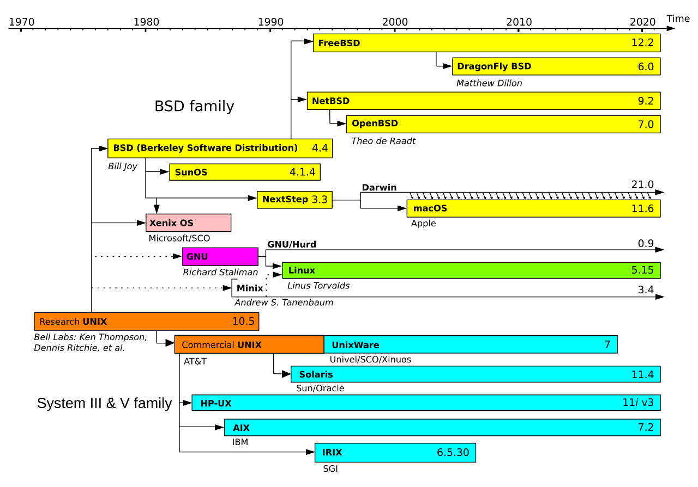
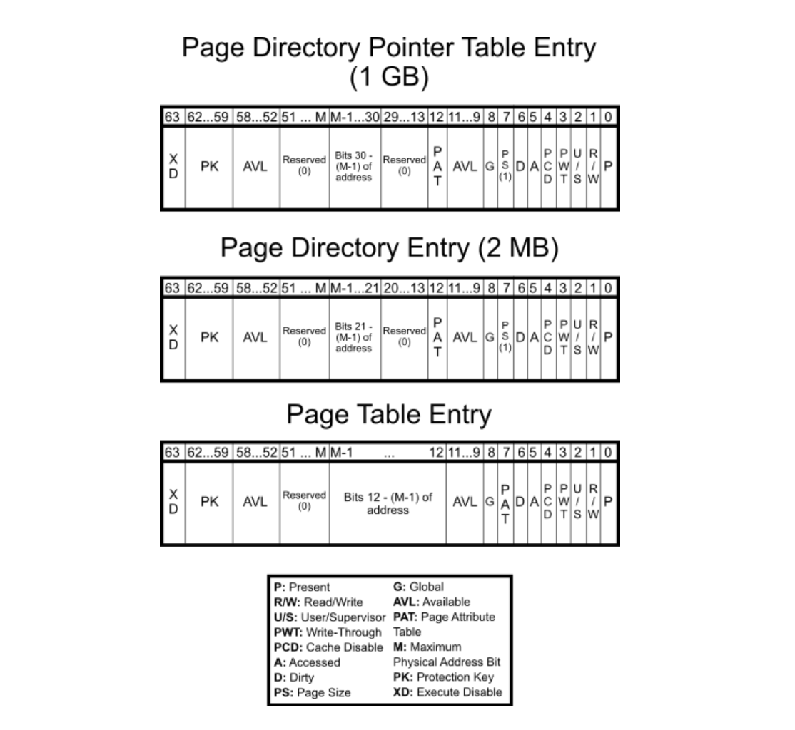

# Operating System

---
A digital computer without an [operating system](https://www.youtube.com/watch?v=26QPDBe-NB8) (OS) is just bare metal. The OS is often overlooked, but this is a crucial invention that supports nearly all modern computing. We encounter it naturally when moving from high-level code to low-level hardware instructions.


<!-- https://pravin-hub-rgb.github.io/BCA/resources/sem2/operating_sys/index.html -->
<!-- https://www.jmeiners.com/lc3-vm/#:lc3.c -->
<!-- https://www.youtube.com/watch?v=ioJkA7Mw2-U -->
<!-- https://www.youtube.com/watch?v=xFMXIgvlgcY -->
<!-- https://youtu.be/eP_P4KOjwhs?si=gOPQIxLH6cQMk8vq -->
- https://www.youtube.com/watch?v=ISJ44S5sZu8
- https://www.youtube.com/watch?v=HbgzrKJvDRw
- https://www.youtube.com/watch?v=D26sUZ6DHNQ  (UDS: unix domain sockets)
- https://www.youtube.com/watch?v=XNGfl3sfErc
- https://www.youtube.com/watch?v=H01FkDtllwc

<!-- round robin, fifo, ... -->
<!-- If data is large or its size varies, we use heap, and in stack, we just maintain a reference (i.e. pointer) to the value.... The *malloc* function in C internally uses *mmap* to free up a dedicated space and reclaim the OS for reusability. *free* does .... By using linked list, we do not need large amounts of contiguous memory, although this data structure leads to decreased probabilities of cache hits. If our aim is to maintain compactness in our list, what we need is an array list (e.g. an array wrapped in the C struct with relevant metadata) -->

## I

---

### **1.1. Evolution**

<p style="margin-bottom: 12px;"> </p>

The earliest generation of electronic computers (1940s–50s), such as the ENIAC, were programmed manually in pure machine code by rewiring circuits or feeding in [punched cards](). Programs ran in isolation, required laborious setup, and left machines idle between jobs. The concept of an OS emerged in the 1950s with <!-- the introduction of --> [batch processing systems]() which grouped similar jobs for sequential execution without manual intervention. <!-- (i.e. favoured homogeneity within a batch) --> A key example is [GM-NAA I/O](), developed <!-- developed by General Motors (GM) --> for the [IBM 701](). The 701 was programmed in assembly, used control cards to interpret jobs and automate execution, and was later adapted to support high-level languages such as [Fortran]() (1957).

The 1960s marked a shift toward [time-sharing systems]() (TSS) and [multiprogramming](), that permitted a [concurrent execution]() of multiple programs residing in memory by rapidly switching the CPU among them. The evolution led to the development of [Multics](), a pioneering TSS, jointly built by AT&T Bell Labs, GE, and MIT to support a robust, multi-user computing environment. However, discontent with its complexity prompted researchers at Bell Labs to develop [Unix]() in the early 1970s. This newer and simpler OS incorporated a modular kernel, hardware abstraction, and multi-user support, in which these principles remain central to modern operating system design.

The 1980s ushered in the era of personal computing, shifting OS development from [command-line interfaces]() (CLI) to [graphical user interfaces]() (GUI) to improve accessibility for non-technical users. Microsoft introduced [MS-DOS]() in 1981, a single-tasking CLI-based OS, followed by successive versions of [Windows]() that adopted cooperative and later preemptive multitasking. Around the same time, Apple’s [Macintosh OS]() (aka. macOS) brought the GUI into mainstream. In the 1990s, [Linux]() emerged as a free and open-source Unix-like alternative. Rooted in Unix philosophy, it became a foundation for innovation across servers, mobiles, and embedded systems.

- <iframe width="500" height="280" src="https://www.youtube.com/embed/kKJxzay85Vk?si=nemG0E7zqsjleTpG" title="YouTube video player" frameborder="0" allow="accelerometer; autoplay; clipboard-write; encrypted-media; gyroscope; picture-in-picture; web-share" referrerpolicy="strict-origin-when-cross-origin" allowfullscreen></iframe>

### **1.2. Operating System**

<p style="margin-bottom: 12px;"> </p>

A modern OS enforces a strict separation between [user mode]() (unprivileged) and [kernel mode]() (privileged). This hardware-supported principle protects the system by preventing unprivileged programs from directly accessing critical hardware resources. For example, [application programs](), such as the web browser, are generally run as unprivileged processes and must rely on the services exposed by the OS (e.g. file I/O or memory allocation). [System programs]() including shells, compilers, [daemons](), and init systems, also reside in user space, provide runtime infrastructure which interprets user instructions and translates them into requests the kernel can fulfill. <!-- Superuser Do (i.e. *sudo*) allows a regular (non-root) user to execute a command with elevated privileges, typically as the root user.-->

As drawn below, the [application programming interface]() (API), provided by standard libraries (e.g. libc on Unix-like systems), abstracts the complexity of invoking system calls directly from user mode. When a user-space program requires privileged functionality (e.g. spawning a process), the OS leverages a high-level API routine and internally issues one or more [system calls](). These serve as well-defined entry points into the kernel, usually implemented through software interrupts, trap instructions, or CPU-specific mechanisms. This controlled access is generally preferred to ensure only trusted kernel code can modify hardware or access protected memory.

While APIs define the data structures and function signatures available to programmers, the [application binary interface](https://stackoverflow.com/questions/3784389/difference-between-api-and-abi) (ABI) governs how a compiled program communicates with the OS at the binary level. It specifies calling conventions (i.e. how params passed from the program to the OS - typically via registers or the stack), register usage, and system call invocation method. Differences across ABIs encompass executable formats - {Linux: [executable and linkable format]() (ELF), Windows: [portable executable]() (PE)}, directory layouts, process models, and available runtime libraries. Hence programs are not only architecture-specific but also OS-dependent.

- <div style="position: relative; display: inline-block; background-color: white;">  <a href="https://www.sciencedirect.com/topics/computer-science/application-binary-interface" target="_blank" style="position: absolute; bottom: -8px; right: 4px; font-size: 12px;">[src]</a> </div>

On Linux running on [x86-64]() (i.e. the Intel and AMD CPU architecture), for instance, when calling *write()* via the C standard library to output data to a file, the predefined system call which executes in kernel mode to perform the actual operation is invoked by placing the "syscall number" (e.g. 1) in the [rax](https://www.cs.uaf.edu/2017/fall/cs301/lecture/09_11_registers.html) register, while its args - ("file descriptor", "buffer pointer", "byte count") are passed via [rdi](), [rsi](), and [rdx](), respectively. In contrast, Windows uses *WriteFile()* with a distinct ABI and system call interface. Cross-platform compatibility of softwares is usually achieved by standardised APIs (e.g. POSIX) or the use of portability layers (e.g. the JVM or Python interpreter). <!-- which abstract away OS-specific details. -->

    section .data
          msg        db  "Hello", 10     ; "Hello\n"
          msg_len   equ $ - msg       ; Length of the message

    section .text
          global _start

    _start:
          ; write(stdout, msg, msg_len)
          mov     rax, 1                      ; syscall: write
          mov     rdi, 1                       ; file descriptor: stdout
          mov     rsi, msg                  ; buffer address
          mov     rdx, msg_len          ; number of bytes to write
          syscall

          ; exit(0)
          mov     rax, 60                    ; syscall: exit
          xor       rdi, rdi                     ; status = 0
          syscall

### **1.3. Shell & Kernel**

<p style="margin-bottom: 12px;"> </p>

The [kernel](https://www.josehu.com/technical/2021/05/24/os-kernel-models.html) is the core of the OS, running at the highest privilege level and mediating all access to hardware and protected resources. User programs interact with the kernel through two main interfaces: i) standard libraries that wrap system calls; ii) [shells]() that act as command interpreters. In both cases, a transition from user mode to kernel mode is required for any privileged operation. The names reflect their roles: the kernel sits at the innermost layer of the system, while the shell wraps around it as the outermost interface exposed to the user. This dual-mode architecture is enforced by hardware (e.g. a mode bit), though both of them are indeed software.

CLI-based shells such as [Bash](), [Zsh](https://github.com/ohmyzsh/ohmyzsh/wiki/Cheatsheet), and [Fish]() support scripting, I/O redirection, job control, and process substitution. They can parse commands (e.g. *ls*, *ps*, *cat*), resolve the appropriate binaries, and invoke system calls (e.g. *fork()*, *exec()*, *wait()*) to execute them. Note that [terminal emulators]() (e.g. Mac Terminal) merely host shell processes and should not be confused with the shell itself. On graphical systems, desktop environments - {Linux: [GNOME](), macOS: [Finder](), Windows: [Explorer]()} - provide a rather visual interface, but also rely on the same system calls and kernel services underneath. For example, my setup looks as below:

```
sungkim@macbook
-----------------------
🖥️          Ghostty
🐚          Zsh + ohmyzsh
✏️          Neovim (LazyVim)
🍺          Homebrew
🔧          lsd, bat, fzf, fd, ripgrep
```

While the kernel manages low-level operations such as CPU scheduling, memory management, IPC, and device I/O, its architectural design critically affects system performance, modularity, and fault tolerance. [Monolithic kernels]() (e.g. Linux) bundle all core services into a single privileged binary, enabling fast in-kernel communication but increasing the risk of system-wide failure. [Microkernels]() (e.g. seL4) retain only minimal services (e.g. scheduling) in kernel space, delegating others (e.g. file systems) to user space to improve modularity and fault isolation. Meanwhile, [hybrid kernels]() (e.g. XNU in macOS) adopt a layered structure to reconcile these trade-offs.

<!-- - <div style="position: relative; display: inline-block;">  <a href="https://minnie.tuhs.org/CompArch/Lectures/week07.html" target="_blank" style="position: absolute; bottom: -8px; right: 4px; font-size: 12px;">[src]</a> </div> -->

<!-- - <div style="position: relative; display: inline-block;">  <a href="https://namu.wiki/w/%EC%9A%B4%EC%98%81%EC%B2%B4%EC%A0%9C" target="_blank" style="position: absolute; bottom: -8px; right: 4px; font-size: 12px;">[src]</a> </div> -->

<!-- - <div style="position: relative; display: inline-block;">  <a href="https://effective-shell.com/part-2-core-skills/what-is-a-shell/" target="_blank" style="position: absolute; top: 0px; left: 4px; font-size: 12px;">[src]</a> </div> -->

<!-- - <div style="position: relative; display: inline-block;">  <a href="http://ibgwww.colorado.edu/~lessem/psyc5112/usail/concepts/anatomy-of-unix/anatomy.html" target="_blank" style="position: absolute; top: 0px; left: 4px; font-size: 12px;">[src]</a> </div> -->

<!-- https://velog.io/@juliejung98/%EC%89%98%EA%B3%BC-%EC%BB%A4%EB%84%90-Shell-Kernel -->

- <div style="position: relative; display: inline-block; background-color: white;">  <a href="https://leimao.github.io/blog/Microkernel-VS-Monolithic-Kernel-OS/" target="_blank" style="position: absolute; top: 0px; left: 4px; font-size: 12px;">[src]</a> </div>

<!-- - <div style="position: relative; display: inline-block;">  <a href="https://kuleuven-diepenbeek.github.io/osc-course/ch1-introos/intro-os/" target="_blank" style="position: absolute; top: 0px; left: 4px; font-size: 12px;">[src]</a> </div> -->


# II

---

### **2.1. Unix**

<p style="margin-bottom: 12px;"> </p>

Looking back at its origins, Unix emerged in 1969 at Bell Labs, when Ken Thompson and Dennis Ritchie repurposed a spare [PDP-7]() 18-bit minicomputer to develop a lightweight, interactive operating system. Initially dubbed “Unics” (i.e. a pun on the earlier Multics), the system abandoned the complexity of its predecessor in favour of simplicity and modularity. Its adoption of a [hierarchical file system]() (HFS), segmented memory, dynamic linking, and a minimal yet powerful API, demonstrated a design philosophy focused on composability, portability, and clear separation of concerns between kernel-level mechanisms and user-space utilities.

A foundational abstraction in Unix was its uniform treatment of input/output. By representing all I/O resources (e.g. files, devices, and IPC endpoints) as file descriptors, Unix allowed disparate resources to be accessed via the same read/write interface. This “everything is a file” model, combined with the system’s use of plain-text config and output, made the environment very scriptable. Programs were inherently designed as small, single-purpose utilities that could be chained together using [pipes]() (\|). For example, the command *cat log.txt \| grep error \| sort \| uniq -c* reads a log file, filters lines containing “error,” sorts them, and collapses duplicates into counts.

Another notable contribution was portability. In the early 1970s, Unix was rewritten from assembly into the [C programming language](https://seriouscomputerist.atariverse.com/media/pdf/book/C%20Programming%20Language%20-%202nd%20Edition%20(OCR).pdf), also created by Ritchie at Bell Labs. C evolved from the earlier [B programming language]() (i.e. derived from BCPL) and introduced key features such as typed variables, structured control flow, and more direct memory manipulation. This decoupling from machine-specific assembly code enabled Unix to be recompiled on a wide variety of hardware platforms, marking it as the first widely portable operating system, and the co-evolution of Unix and C unlocked a generation of system-level programming. <!-- make it shorter* -->

- <iframe width="500" height="280" src="https://www.youtube.com/embed/tc4ROCJYbm0?si=HTFkF_s-YHnPd35_" title="YouTube video player" frameborder="0" allow="accelerometer; autoplay; clipboard-write; encrypted-media; gyroscope; picture-in-picture; web-share" referrerpolicy="strict-origin-when-cross-origin" allowfullscreen></iframe>

As AT&T was restricted by the 1934 [Communications Act]() and a 1956 antitrust consent decree from entering commercial computing, Unix was freely or cheaply distributed and widely adopted in academia. One of its most influential offshoots was the [Berkeley software distribution]() (BSD), launched in the late 1970s by Bill Joy and the [Computer Systems Research Group]() (CSRG) at UC Berkeley. BSD began as a set of enhancements to AT&T Unix, but evolved into a full OS by the late 1980s. With DARPA funding, BSD merged key networking features including the first complete TCP/IP stack, and became a reference platform for early [Internet]() development.

BSD’s permissive licence and technical maturity attracted commercial interest throughout the 1980s–90s. Its code was incorporated into systems such as SunOS by Sun Microsystems, Ultrix by Digital Equipment Corporation, and NeXTSTEP by NeXT Inc., and it laid the groundwork for enduring open-source projects including FreeBSD, NetBSD, OpenBSD, and DragonFly BSD. Its influence extends to modern platforms: Apple’s [Darwin](), the Unix core of macOS and iOS, is based on FreeBSD. Microsoft integrated BSD-derived code into Windows networking, and its legacy persists in routers, embedded appliances, and gaming consoles such as the [PlayStation 5]().

As Unix variants proliferated, differences in system calls, utilities, and behaviours hindered software portability and interoperability. To resolve this, the IEEE introduced the [Portable Operating System Interface]() (POSIX) standard in the late 1980s, specifying a consistent API, shell command set, and utility behaviours for Unix-like systems. Although POSIX did not fully unify all implementations (especially proprietary extensions), it established a solid baseline that greatly improved cross-platform compatibility. This standardisation not only helped unify the fragmented Unix landscape but also influenced the development of modern operating systems, including Linux and BSD derivatives.

- <div style="position: relative; display: inline-block;">  <a href="https://en.wikipedia.org/wiki/Unix-like" target="_blank" style="position: absolute; bottom: -8px; right: 4px; font-size: 12px;">[src]</a> </div>

<!-- - <iframe width="500" height="280" src="https://www.youtube.com/embed/HADp3emVABg?si=slBlmD7_ktsw0__u" title="YouTube video player" frameborder="0" allow="accelerometer; autoplay; clipboard-write; encrypted-media; gyroscope; picture-in-picture; web-share" referrerpolicy="strict-origin-when-cross-origin" allowfullscreen></iframe> -->

### **2.2. Linux**

<p style="margin-bottom: 12px;"> </p>

Linux began in 1991 as a personal project by [Linus Torvalds]() to build a free, Unix-like kernel for the Intel [80386]() architecture. Inspired by [MINIX]() (a teaching OS by Andrew Tanenbaum) and licensed under the [GPL](), it attracted contributions from developers worldwide and was paired with the [GNU Project]()'s user-space tools (e.g. gcc, glibc, coreutils) to form a complete open-source operating system. Unlike proprietary Unix systems tied to specific vendors, Linux grew through a decentralised, community-driven model, a development approach that would later be mirrored by the open-source AI community (e.g. Hugging Face, PyTorch, llama.cpp).

Architecturally, Linux uses a [monolithic kernel](), integrating core services such as process scheduling, virtual memory, networking, and file systems into a single privileged binary. To balance this with modularity, it supports [loadable kernel modules]() (LKMs) that allow dynamic insertion of drivers and extensions at runtime without rebooting. Written in portable C, Linux was quickly ported beyond x86 to architectures including ARM, PowerPC, and SPARC, and later incorporated features such as [control groups]() (cgroups), [namespaces](), and pluggable schedulers that now underpin containerised ML training pipelines (e.g. Kubernetes on GPU clusters).

Though not derived from any Unix source tree, Linux closely follows POSIX standards and Unix design principles. By the early 2000s, it had displaced proprietary Unix as the dominant OS for servers and infrastructure. Today, it runs on everything from Android smartphones to all [Top500]() supercomputers, and serves as the default runtime for virtually all large-scale ML workloads. Cloud ML platforms (e.g. AWS SageMaker) run Linux-based containers, as do distributed training frameworks (e.g. DeepSpeed, Megatron-LM) and inference servers (e.g. vLLM, TGI), because its open-source nature and fine-grained hardware control make it the natural fit.

- <iframe width="500" height="280" src="https://www.youtube.com/embed/E0Q9KnYSVLc?si=Fere9hvODg0z0MtB" title="YouTube video player" frameborder="0" allow="accelerometer; autoplay; clipboard-write; encrypted-media; gyroscope; picture-in-picture; web-share" referrerpolicy="strict-origin-when-cross-origin" allowfullscreen></iframe>

<!-- ### **2.3. Linux Distribution**
<p style=”margin-bottom: 12px;”> </p>

A Linux distribution (or “distro”) bundles the Linux kernel with a curated set of user-space utilities, libraries, configuration defaults, and package management tools to form a complete operating system. As the Linux kernel alone is insufficient for end users, distributions emerged to provide usable environments tailored to various audiences—ranging from desktop users and system administrators to developers, embedded engineers, and cloud providers. Early distributions such as Slackware (1993), Debian (1993), and Red Hat Linux (1995) laid the groundwork for today’s ecosystem.

Each distribution makes distinct choices in areas such as init systems (e.g. systemd, OpenRC), packaging formats (e.g. .deb, .rpm, source-based), file system layout, release cadence, and included software stacks. For example, Debian emphasizes stability and is widely used as a base for derivatives like Ubuntu, which targets usability and long-term support for both desktops and servers. Red Hat Enterprise Linux (RHEL), and its derivatives like CentOS and AlmaLinux, prioritize commercial support and certification for enterprise workloads, while Arch Linux focuses on minimalism, rolling releases, and user control.

Distributions also diverge in tooling and update strategies. Package managers like apt, dnf, and pacman streamline software installation and system updates, while meta-tools like snap or flatpak aim to standardize application delivery across distros. Despite differences, most distributions remain interoperable through shared adherence to standards like POSIX, FHS, and the Linux Standard Base (LSB). As such, the choice of distribution often reflects the target use case, administrative preferences, or hardware constraints, rather than incompatibilities in the underlying Linux system.
 -->

## III

---

### **3.1. Process Management**

<p style="margin-bottom: 12px;"> </p>

Each process executes within its own isolated virtual [address space](), comprising distinct code, data, heap, and stack segments. This isolation ensures protection between processes and underpins system stability. The OS kernel maintains per-process metadata via a structure, known as the [process control block]() (PCB), which contains its identifiers (PID/PPID), execution state, CPU register, memory mappings, scheduling parameters, and open file descriptors. A process advances through a [life cycle](): new (creation), ready (queued for CPU), running (actively scheduled), waiting (blocked on I/O, synchronisation, or an event), and terminated (completed or killed).

The [CPU scheduler](), a core part of the kernel, manages transitions between the mutually exclusive states and determines which ready process to dispatch next. Classical scheduling algorithms may include i) [round robin](https://imbf.github.io/computer-science(cs)/2020/10/18/CPU-Scheduling.html): fixed time slices; ii) [priority scheduling](): fixed or dynamic priority queues; iii) [multi-level feedback queues]() (MLFQ): dynamically adjusts priorities based on process behaviours; [Context switching]() follows scheduling decisions, saving the current process state to its PCB and restoring the next. This incurs overhead from cache invalidation, TLB flushes, and pipeline stalls. Still, single-core systems achieve concurrency by time-slicing across processes. <!-- Modern operating systems such as Linux use the [completely fair scheduler]() (CFS), which maintains a red-black tree to distribute CPU time proportionally by tracking each process’s virtual runtime. -->

<!-- - <div style="position: relative; display: inline-block;">  <a href="https://www.geeksforgeeks.org/operating-systems/process-schedulers-in-operating-system/" target="_blank" style="position: absolute;  bottom: -8px; right: 4px; font-size: 12px;">[src]</a> </div> -->

<!-- - <div style="position: relative; display: inline-block;">  <a href="https://www.geeksforgeeks.org/operating-systems/context-switch-in-operating-system/" target="_blank" style="position: absolute;  bottom: -8px; right: 4px; font-size: 12px;">[src]</a> </div> -->

As systems can execute multiple [cooperating processes](), scheduling should be complemented by [inter-process communication]() (IPC) methods (e.g. pipes, queues, or shared memory buffers) to enable coordination across isolated address spaces. [Message passing]() delegates data transfer to the kernel via abstractions such as pipes, UNIX domain sockets, or System V message queues. In contrast, [shared memory]() provides high-throughput, low-latency communication (e.g. NumPy arrays) but requires explicit [synchronisation](). The former is generally slower due to data copying and kernel involvement, but simplifies coordination and improves fault isolation.

- <div style="position: relative; display: inline-block; background-color: white">  <a href="https://notes.shichao.io/apue/ch15/" target="_blank" style="position: absolute;  bottom: -8px; right: 4px; font-size: 12px;">[src]</a> </div>

[Multiprocessing]() refers to concurrent execution of separate processes, each with its own memory space, generally mapped to different CPU cores and coordinated via IPC. For instance, PyTorch's [DataLoader](https://discuss.pytorch.org/t/efficient-gpu-data-movement/63707) relies on Python's *multiprocessing* module <!--, with GPU tensor sharing between worker processes supported through CUDA-aware IPC, --> to parallelise data loading and improve input throughput. In distributed training, *torch.distributed* with [DistributedDataParallel]() (DDP) spawns one process per device (e.g. CPU/GPU) and synchronises gradients at each backward pass. DDP needs communication backends (i.e. IPC layer) such as Gloo for CPUs and [NVIDIA collective communication library]() (NCCL) for GPUs to coordinate model parameters and gradients.

 <!-- employing communication backends such as [Gloo]() or [NCCL](https://docs.nvidia.com/deeplearning/nccl/user-guide/docs/overview.html). PyTorch also extends shared memory with CUDA-aware IPC for GPU tensor sharing.  -->

<!-- . PyTorch also extends shared memory support through CUDA-aware IPC to enable GPU tensor sharing. Specifically,  -->

<!-- Complementary tools like Numba offer thread- or process-level parallelism through JIT compilation to machine code. -->

<!-- Multiprocessing enables the concurrent execution of multiple processes, each with its own isolated memory space and usually mapped to separate CPU cores. Since memory is not shared by default, coordination between processes must be handled using inter-process communication (IPC). In PyTorch, the DataLoader uses Python’s multiprocessing module to spawn worker processes that load and transform batches concurrently, improving input pipeline performance. For distributed training, PyTorch provides the torch.distributed package and its DistributedDataParallel (DDP) wrapper, which enables multiple processes—each with its own model replica—to compute gradients independently and synchronize them efficiently across processes after each backward pass. This design scales well across both multi-core CPUs and multi-GPU systems, with DDP using shared memory or CUDA-aware communication backends (like NCCL) to reduce synchronization overhead. Complementary approaches such as Numba offer thread- and process-level parallelism through JIT compilation to machine code, enabling further parallel acceleration in custom numerical routines. -->

In networked IPC, processes communicate over [sockets]() identified by [IP addresses]() and [ports](), which act as logical [endpoints]() directing traffic to the correct process. For example, web servers typically use port 80 (HTTP) or 443 (HTTPS), while SSH uses port 22. The OS maps ports to socket endpoints and manages connection queues to deliver [packets]() to the correct process. PyTorch also relies on designated ports (configured via env vars like [MASTER_PORT](https://tutorials.pytorch.kr/intermediate/dist_tuto.html)) for synchronisation during distributed training, usually over [transmission control protocol]() (TCP) or NCCL. As such, this networking concept remains central to distributed systems in the modern ML era.

- <div style="position: relative; display: inline-block; background-color: white">  <a href="https://pylessons.com/YOLOv4-TF2-multiprocessing" target="_blank" style="position: absolute;  bottom: -8px; right: 4px; font-size: 12px;">[src]</a> </div>

[Threads]() are lightweight execution units within a process that share the same virtual address space. This shared context enables fine-grained parallelism with lower memory overhead and faster context switches compared to processes. Most modern OSes implement the $1 \colon 1$ threading model (e.g. [native POSIX threads library]()) where each user thread is directly mapped to a kernel thread, while $m \colon 1$ and $m \colon n$ (e.g. [Go]() programming language) models are less widely adopted. Threads are independently scheduled by the kernel and require synchronisation primitives such as [mutexes](), [spinlocks](), and condition variables to prevent [race conditions]() and ensure stability.

The thread-level parallelism in CPython has long been constrained by the [global interpreter lock](https://www.youtube.com/watch?v=dyhKXCpkCGE) (GIL), which is a mutex that serialises the execution of Python bytecode (i.e. one thread at a time) and was primarily introduced to simplify [reference counting]() in [garbage collection](), thereby limiting the effectiveness of threading for CPU-bound operations such as matrix multiplication. However, compute-intensive extensions in native C/C++ code (e.g. Numpy or PyTorch - see the [discussion](https://discuss.pytorch.org/t/can-pytorch-by-pass-python-gil/55498)) can often <!-- temporarily --> release the GIL during execution, and as many requested, [PEP 703]() introduces a build-time option to remove the GIL in Python 3.13 albeit with changes to the C API. <!-- Other Python implementation such as [Jython]() or [IronPython]() do not have a GIL. -->

- ... <!-- <iframe width="500" height="280" src="https://www.youtube.com/embed/M9HHWFp84f0?si=B3pvCInh5IWetRvf" title="YouTube video player" frameborder="0" allow="accelerometer; autoplay; clipboard-write; encrypted-media; gyroscope; picture-in-picture; web-share" referrerpolicy="strict-origin-when-cross-origin" allowfullscreen></iframe> -->

### **3.2. Memory Management**

<p style="margin-bottom: 12px;"> </p>

Modern multi-process systems provide strong memory isolation, efficient resource sharing, and protection against fragmentation and [out-of-memory]() (OOM) conditions. Early systems which relied solely on physical memory allocation or simple segmentation struggled with these issues. [Physical memory]() management (i.e. as seen in MS-DOS) offered limited protection as any process with an invalid [pointer]() could overwrite another's memory. Segmentation introduced logical divisions (e.g. code, heap, and stack) and some access protection, but suffered from external fragmentation and offered limited flexibility for sharing or reallocating memory dynamically.

[Virtual memory](https://www.cs.rpi.edu/academics/courses/fall04/os/c12/), implemented in cooperation with hardware, abstracts physical memory by providing each process with the illusion of a large, contiguous address space, decoupling logical layout from physical constraints. In turn, this enables protection, memory sharing (e.g. common libraries), and also [copy-on-write]() (CoW) which delays duplication of pages until modification. The OS kernel divides the [address spaces]() into fixed-size units: (virtual-) [pages]() and (physical-) [page frames](). Each process maintains a [page table](https://pages.cs.wisc.edu/~bart/537/lecturenotes/s17.html) (e.g. C *struct*) consisting of [page table entries]() (PTEs), each of which contains metadata including physical page number (PPN) and its presence. 

- <div style="position: relative; display: inline-block; background-color: white">  <a href="https://sam4k.com/page-table-kernel-exploitation/" target="_blank" style="position: absolute;  bottom: -8px; right: 4px; font-size: 12px;">[src]</a> </div>

Given that the virtual address space size is $2^N$, where $N$ denotes the CPU’s bit-width, and the page size is fixed at $2^P$ B (commonly 4 KB, i.e. $P = 12$), the total number of pages per process is $2^{N - P}$. If each PTE occupies $2^E$ B (typically $E = 2$ for 4-byte entries or $E = 3$ for 8-byte entries), then the total memory required for a [flat page table]() is $2^{N - P + E}$ B. The size grows rapidly with increasing $N$ and makes it impractical for 64-bit architectures. For example, with $N = 64$, $P = 12$ and $E = 3$, the table requires $2^{55}$ B or 32 PB per process. Even a 48-bit system would consume $2^{39}$ = 512 GB, making [multi-level page tables]() (e.g. 4-level) essential. <!-- Modern CPUs support larger page sizes (e.g. 2 MB or 1 GB) to reduce address translation overhead, at the cost of increased internal fragmentation. The page size can be queried using system utilities such as *getconf PAGE_SIZE* on Linux, while *ps -e \| wc -l* returns the number of active processes. -->

- <div style="position: relative; display: inline-block; background-color: white">  <a href="https://sam4k.com/page-table-kernel-exploitation/" target="_blank" style="position: absolute;  bottom: -8px; right: 4px; font-size: 12px;">[src]</a> </div>

Modern CPUs employ a [memory management unit]() (MMU) that traverses page tables during [address translation](https://pdos.csail.mit.edu/6.828/2005/readings/i386/s05_02.htm). Embedded within the MMU is the [translation lookaside buffer](https://www.kernel.org/doc/gorman/html/understand/understand006.html) (TLB), a small, associative cache that stores recent address translations. Unlike L1/L2 caches, which speed up direct memory access, the TLB caches only address mappings to avoid repeated table walks. Many partition the TLB into separate instruction (ITLB) and data (DTLB) caches to allow concurrent lookups. A [TLB hit]() allows resolution within a single cycle, but a [TLB miss]() yields a page walk followed by caching the result. Thus its size, associativity, and replacement strategy really matter.

At runtime, a [page fault]() is triggered when a process accesses a page not currently backed by physical memory. The kernel responds by allocating a frame and filling it with the appropriate data either by zero-initialising a new page or loading content from [swap space]() or [memory-mapped files]() on disk. If physical memory is exhausted, a page replacement policy (e.g. FIFO, LRU, Clock) selects a victim to evict, and so [dirty pages]() are flushed to disk while [clean pages]() may be discarded. Although this enables [memory overcommitment]() (i.e. over available RAM), sustained faulting can ultimately lead to [thrashing]() in which execution stalls due to excessive paging activity.

- <div style="position: relative; display: inline-block; background-color: white">  <a href="https://userpages.umbc.edu/~squire/cs411_l23.html" target="_blank" style="position: absolute; bottom: -8px; right: 4px; font-size: 12px;">[src]</a> </div>

<!-- - <div style="position: relative; display: inline-block; background-color: white">  <a href="https://pages.cs.wisc.edu/~bart/537/lecturenotes/s17.html" target="_blank" style="position: absolute; top: 2px; right: 4px; font-size: 12px;">[src]</a> </div> -->

### **3.3. File & Device Management**

<p style="margin-bottom: 12px;"> </p>

A file is a named, persistent sequence of bytes stored on physical or virtual media. The OS treats it as a linear byte stream with no intrinsic meaning; the extension (e.g. .txt, .mp3, .parquet) acts as a contract between applications and data, signalling how contents should be parsed or executed. File contents may be structured (e.g. CSV, Parquet), semi-structured (e.g. JSON, XML), or binary (e.g. compiled code, model checkpoints). The OS exposes a [hierarchical file system]() that maps human-readable paths (e.g. /home/user/data.csv) to physical data blocks. [Inodes]() (in Unix-like systems) store metadata including file size, timestamps, ownership, and block pointers. The OS also supports special files — symbolic links, device nodes, sockets, and FIFOs — that extend file semantics to hardware interfaces and IPC. On flash-based storage, the drive’s [flash translation layer]() (FTL) maps logical blocks to physical NAND pages.

- 

To standardise this hierarchy, the [Filesystem Hierarchy Standard]() (FHS) defines a common directory layout for Unix-like systems. The root directory / serves as the top-level namespace: essential binaries in /bin and /sbin, configuration in /etc, user homes under /home, variable data in /var, secondary programs in /usr, device files in /dev, and temporary data in /tmp. Interaction with files is mediated through [file descriptors](), small integers indexing open file entries in a per-process kernel table. Core operations — open(), read(), write(), close() — form the system call interface, while mmap() maps files directly into virtual memory for pointer-based access and inter-process sharing. The OS manages a [page cache]() to reduce disk latency and supports direct I/O or asynchronous I/O for performance-critical workloads.

The "everything is a file" model extends naturally to devices. A [device driver]() is a kernel-level component that translates generic OS commands into hardware-specific operations, exposing standardised entry points (read, write, ioctl) so that user-space programs access hardware via the same file descriptor interface used for regular files. Virtual file systems like /proc and /sys expose live kernel and hardware state through file-like interfaces, enabling introspection of memory usage, CPU load, or device health. [Journaling]() (e.g. ext4, XFS) logs metadata updates to support crash recovery, while advanced file systems like ZFS and Btrfs add copy-on-write, snapshots, and checksumming. [I/O scheduling]() determines the order in which requests are serviced: classic schedulers (e.g. CFQ, Deadline) were designed for rotational media, while modern NVMe SSDs largely bypass them due to low latency and high parallelism.
