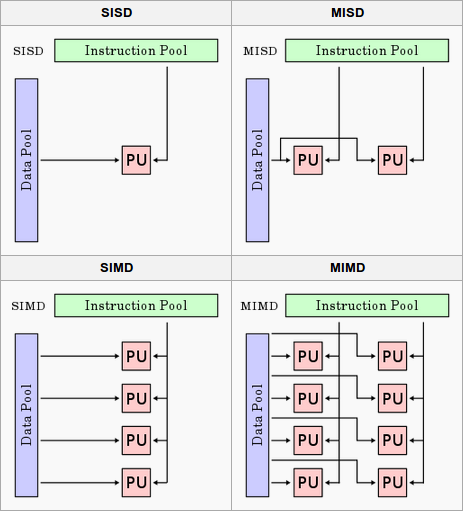

# Multitasking
---
Both [Amdahl's Law](https://en.wikipedia.org/wiki/Amdahl%27s_law) and [Gustafson's Law](https://en.wikipedia.org/wiki/Gustafson%27s_law) formalise the limits on parallel speedup. The former says that if a fraction $f$ of a program is sequential, the maximum speedup is $\lim_{p \to \infty} 1/(f + (1-f)/p) = 1/f$, so even 5% sequential code caps speedup at maximum of 20×. The latter counters that problem size often scales with available processors, making parallelisation more effective in practice.

## I
---

### **1.1. Concurrency and Parallelism**

 

[Concurrency]() is the logical simultaneity of multiple tasks making progress through interleaved execution. [Parallelism]() is physical simultaneity, where multiple tasks execute at the exact same instant on different processing units. Parallelism requires hardware support and is a subset of concurrency, while modern systems combine both: concurrently scheduling threads and processes across parallel cores.

[Flynn's taxonomy](https://en.wikipedia.org/wiki/Flynn%27s_taxonomy) classifies hardware architectures by instruction and data streams. I.e. a single-core CPU is [SISD]() (Single Instruction, Single Data), while multi-core CPUs operate as [MIMD]() (Multiple Instruction, Multiple Data) where each core independently executes different instructions on different data. [SIMD]() (Single Instruction, Multiple Data) extends a single core with vector units (e.g. SSE, AVX) that apply one instruction to multiple data elements simultaneously. GPUs take this further with [SIMT](https://forums.developer.nvidia.com/t/simd-versus-simt-what-is-the-difference-between-simt-vs-simd/10459/8), essentially SIMD combined with multithreading, where groups of threads (warps-CUDA, wavefronts-AMD) execute the same instruction in lockstep on different data.

The hardware memory architectures underpinning IPC determine concurrency performance. CPU-GPU communication is bridged via [DMA](https://en.wikipedia.org/wiki/Direct_memory_access) (e.g. PyTorch's *pin_memory=True* allocates [page-locked memory](https://docs.pytorch.org/tutorials/intermediate/pinmem_nonblock.html) for direct transfer to VRAM). Real hardware often combines shared memory and message passing: [UMA](https://en.wikipedia.org/wiki/Uniform_memory_access) (Uniform Memory Access) serves all processors with equal latency, while [NUMA](https://en.wikipedia.org/wiki/Non-uniform_memory_access) (Non-UMA) assigns each processor a local memory bank with faster access. CUDA's [Unified Memory](https://developer.nvidia.com/blog/unified-memory-cuda-beginners/) abstracts this further, offering a single address space across CPU and GPU with driver-managed page migration.

- 
  <a href="https://en.wikipedia.org/wiki/Flynn%27s_taxonomy" target="_blank" style="position: absolute; bottom: -8px; right: 4px; font-size: 12px;">[src]</a> 

- 
  <a href="https://notes.shichao.io/apue/ch15/" target="_blank" style="position: absolute;  bottom: -8px; right: 4px; font-size: 12px;">[src]</a> 

### **1.2. Synchronisation and Memory Ordering**

 

[Memory consistency models](https://en.wikipedia.org/wiki/Consistency_model) define ordering guarantees for operations across threads. Sequential consistency ensures a global order, but most hardware provides relaxed consistency (e.g. x86-TSO, ARM weak ordering) that allows reordering for performance. [Happens-before](https://en.wikipedia.org/wiki/Happened-before) relationships and memory barriers (fences) provide the primitives for reasoning about ordering. [Cache coherence protocols](https://en.wikipedia.org/wiki/Cache_coherence) such as MESI (Modified, Exclusive, Shared, Invalid) maintain consistency across per-core caches, while [false sharing](https://en.wikipedia.org/wiki/False_sharing) (unrelated data on the same 64-byte cache line) causes lines to bounce between cores.

Beyond basic mutexes and spinlocks, [semaphores](https://en.wikipedia.org/wiki/Semaphore_(programming)) generalise mutual exclusion with a counter controlling access to $N$ resources, while [condition variables]() allow threads to wait for predicates without busy-waiting. Variants such as [reentrant locks]() and [read-write locks]() (concurrent reads, exclusive writes) address different access patterns. [Atomic operations](https://en.wikipedia.org/wiki/Linearizability) such as compare-and-swap (CAS) provide the building blocks for [lock-free](https://en.wikipedia.org/wiki/Non-blocking_algorithm) data structures, bypassing locks entirely for higher throughput under contention.

[Deadlock](https://en.wikipedia.org/wiki/Deadlock) occurs when threads are permanently blocked in a circular dependency. The four [Coffman conditions]() must all hold: (1) mutual exclusion, (2) hold-and-wait, (3) no preemption, and (4) circular wait. Prevention strategies include consistent lock ordering, timeout mechanisms, and deadlock detection algorithms. [Livelock]() (threads continuously change state without making progress) and [starvation]() (a thread perpetually denied access) are related failure modes that can be equally difficult to diagnose in production systems.

### **1.3. Threading and Scheduling**

 

The [$m \colon n$ model]() (hybrid) multiplexes many user threads onto fewer kernel threads, combining the lightweight switching of $m \colon 1$ with the true parallelism of $1 \colon 1$. Go's [goroutines]() schedule onto OS threads via a [work-stealing]() scheduler, achieving nanosecond context switching with parallelism controlled by GOMAXPROCS. Erlang processes follow a similar model. [Cooperative scheduling]() (async/await, coroutines) requires threads to yield explicitly, while [preemptive scheduling]() allows the OS to forcibly switch. Thread pools amortise creation cost, and work-stealing balances load by letting idle threads steal from busy threads' queues.

## II
---

### **2.1. Asynchronous Programming and Event Loops**

 

An [event loop]() is a programming construct that continuously runs in a single thread, repeatedly polling for and dispatching events such as I/O readiness, timers, and callbacks. The event loop maintains a queue of pending callbacks and uses I/O multiplexing to monitor which file descriptors are ready. Rather than blocking on each operation, it registers interest in I/O events and continues processing other ready events, enabling high concurrency for I/O-bound applications without the overhead of thread creation and context switching. This pattern is central to Node.js, Python's asyncio, and high-performance network servers like Nginx.

[Coroutines](https://en.wikipedia.org/wiki/Coroutine) are functions that can suspend their execution at specific points (yield control) and later resume from exactly where they left off, maintaining their local state between suspensions. Unlike threads, which are preemptively scheduled by the OS, coroutines are cooperative—they explicitly yield control using keywords like *yield* or *await*. Coroutine switching is lightweight, typically taking nanoseconds compared to microseconds for OS thread context switches, because it does not require kernel mode transitions, full CPU register saves, TLB flushes, or memory protection changes. [Stackful coroutines]() maintain their own stack (like threads but lighter), while [stackless coroutines]() use heap-allocated activation records. The async/await syntax in modern languages (Python, JavaScript, Rust, C#) provides syntactic sugar over promises and futures, enabling exception propagation in async contexts and composition of async functions.

[I/O multiplexing](https://en.wikipedia.org/wiki/Multiplexing) is the syscall layer that event loops depend on. The API evolved from *select()* (fixed fd limit) to *poll()* (dynamic but O(n) scanning) to *[epoll](https://man7.org/linux/man-pages/man7/epoll.7.html)()* (Linux, O(1) event delivery) and *kqueue()* (BSD/macOS), with *IOCP* (Windows) providing a completion-based model. [Edge-triggered]() notifications fire only on state changes (e.g. data arrives), while [level-triggered]() notifications fire whenever a condition holds (e.g. data is available). Zero-copy I/O mechanisms such as *sendfile()* and *splice()* avoid copying data between kernel and user space, further reducing overhead for high-throughput applications.

### **2.2. Language-Specific Implementations**

 

Since the GIL serialises bytecode execution, CPython's concurrency model centres on async I/O and multiprocessing. Python's [asyncio]() module provides an event loop with coroutines, tasks, and futures, while *concurrent.futures* offers ThreadPoolExecutor (useful when C extensions release the GIL) and ProcessPoolExecutor. The distinction between [WSGI]() (Web Server Gateway Interface) and [ASGI]() (Asynchronous Server Gateway Interface) reflects this evolution: WSGI is synchronous and blocking (Flask, Django), while ASGI leverages asyncio for high-concurrency I/O (FastAPI, Starlette), supporting WebSockets, HTTP/2, and long-polling. ASGI servers (Uvicorn, Hypercorn) typically run multiple worker processes with each running a single event loop, and *asyncio.to_thread()* (Python 3.9+) offloads blocking operations to a thread pool.

JavaScript and Node.js use a single-threaded event loop (via [libuv]()) with non-blocking I/O, achieving high concurrency through callbacks, promises, and async/await. Worker threads provide true parallelism for CPU-bound tasks, and the cluster module enables process-based parallelism. This event-loop-only model contrasts with systems languages that offer richer concurrency primitives: Go uses [channels]() for [CSP](https://en.wikipedia.org/wiki/Communicating_sequential_processes)-style message passing with non-deterministic *select*, Rust enforces concurrency safety at compile time through its ownership system and Send/Sync traits (async/await powered by [tokio]()), and Java's [Project Loom]() introduces virtual threads for lightweight $m \colon n$ concurrency atop *java.util.concurrent*.

### **2.3. I/O-Bound vs CPU-Bound Workloads**

 

[I/O-bound]() workloads (network requests, disk I/O, database queries) spend most of their time waiting for external resources. Async I/O with event loops is the most efficient approach, as thousands of concurrent operations can be multiplexed onto a single thread. Thread pools limit the number of threads to avoid context-switching overhead, and connection pooling reuses established connections (e.g. HTTP keep-alive, database connection pools) to amortise setup costs. [CPU-bound]() workloads (numerical computation, image processing, encryption) require true parallelism via multiprocessing or multithreading in GIL-free runtimes, where NUMA-aware memory allocation becomes important for memory-bandwidth-limited computation.

Hybrid workloads combine both patterns. Pipeline architectures (I/O → CPU → I/O) decompose processing into stages, and producer-consumer patterns with bounded queues decouple components with different throughput characteristics. [Backpressure]() mechanisms handle situations where producers outpace consumers, preventing unbounded memory growth. Identifying whether a bottleneck is I/O-bound or CPU-bound is the first step toward choosing the right concurrency strategy.

## III
---

### **3.1. Distributed Systems**

 

Distributed concurrency extends threading and synchronisation primitives across network boundaries, where communication is unreliable and latency is orders of magnitude higher than shared-memory access. Systems must contend with [network partitions]() (where nodes cannot communicate), partial failures (where some nodes crash while others continue), and clock skew. The [CAP theorem](https://en.wikipedia.org/wiki/CAP_theorem) formalises a fundamental constraint: a distributed system can guarantee at most two of Consistency, Availability, and Partition tolerance. In practice, partitions are inevitable, so systems choose between CP (e.g. ZooKeeper, etcd) and AP (e.g. Cassandra, DynamoDB) trade-offs. [Eventual consistency](https://en.wikipedia.org/wiki/Eventual_consistency) relaxes strong guarantees, allowing replicas to temporarily diverge and converge over time through conflict resolution strategies such as last-writer-wins, vector clocks, or CRDTs.

[Consensus](https://en.wikipedia.org/wiki/Consensus_(computer_science)) is the problem of getting multiple nodes to agree on a single value or sequence of values in the presence of failures. [Paxos](https://en.wikipedia.org/wiki/Paxos_(computer_science)), proposed by Lamport (1998), was the first provably correct consensus protocol but is notoriously difficult to implement. [Raft](https://raft.github.io/) (2014) was designed as an understandable alternative, decomposing consensus into leader election, log replication, and safety. Both use quorum-based decisions: a majority of nodes must agree before a value is committed. Coordination services like [ZooKeeper](https://zookeeper.apache.org/) and [etcd](https://etcd.io/) build on consensus to provide distributed locks, leader election, and service discovery.

The [actor model](https://en.wikipedia.org/wiki/Actor_model), popularised by Erlang, encapsulates state within actors that communicate exclusively through asynchronous message passing, eliminating shared mutable state by design. Frameworks like Akka (JVM) and Ray (Python) implement this pattern. Message queues such as RabbitMQ and Apache Kafka extend asynchronous communication across services, decoupling producers from consumers for high-throughput stream processing with durability and replay guarantees.

### **3.2. Parallel Patterns**

 

[MapReduce](https://en.wikipedia.org/wiki/MapReduce), introduced by Dean and Ghemawat at Google (2004), formalises a pattern where input data is split into partitions, each processed independently by a *map* function, and intermediate results are aggregated by a *reduce* function. [Apache Spark](https://spark.apache.org/) improves upon Hadoop's MapReduce with in-memory computation and lazy evaluation of RDD transformations, achieving significant speedups for iterative algorithms. The *shuffle* phase, where intermediate key-value pairs are redistributed across nodes, remains the primary bottleneck due to serialisation, network transfer, and disk I/O.

The [fork-join]() model recursively decomposes problems into independent sub-problems (fork), solves them in parallel, and combines results (join). Java's ForkJoinPool and Cilk's spawn/sync implement this with [work-stealing]() schedulers, where idle threads steal tasks from the tail of busy threads' deques, achieving good load balancing while preserving cache locality. [Pipeline parallelism]() distributes sequential stages across processors, with bounded buffers regulating flow, where throughput is limited by the slowest stage.

In ML, these patterns map onto two axes: [data parallelism]() replicates the model across devices and partitions the input (e.g. DDP), while [model parallelism]() partitions the model itself. Pipeline parallelism (e.g. GPipe, PipeDream) is a form of model parallelism that distributes layers across GPUs, allowing different micro-batches to occupy different stages simultaneously. [Tensor parallelism]() (e.g. Megatron-LM) splits individual layers across devices for very large models.

### **3.3. Data Structures and Performance**

 

[Lock-based](https://en.wikipedia.org/wiki/Lock_(computer_science)) concurrent data structures range from coarse-grained locking (a single lock protecting the entire structure, simple but poor scalability) to fine-grained locking (per-node or per-bucket locks, better concurrency but more complex). [Lock-free](https://en.wikipedia.org/wiki/Non-blocking_algorithm) data structures use atomic compare-and-swap (CAS) operations instead of locks, ensuring system-wide progress even if individual threads are delayed. The [ABA problem](https://en.wikipedia.org/wiki/ABA_problem), where a value changes from A to B and back to A making CAS believe nothing changed, is addressed through versioning (tagged pointers) or hazard pointers. [Wait-free]() structures provide the strongest guarantee—every operation completes in bounded steps—while [transactional memory](https://en.wikipedia.org/wiki/Transactional_memory) (hardware via Intel TSX, or software STM) offers an optimistic alternative that executes speculatively and rolls back on conflict.

Concurrency introduces several categories of overhead. Context switching costs 1–10 microseconds per switch and degrades cache locality. Lock contention arises when threads compete for the same lock: spinning wastes CPU cycles but avoids scheduling latency, while blocking frees the CPU but incurs wake-up overhead. False sharing causes the MESI coherence protocol to bounce cache lines between cores even when threads access unrelated data, and padding structures to cache-line boundaries mitigates this. Memory allocator contention is another bottleneck; allocators like jemalloc and tcmalloc use per-thread arenas to reduce it.

Optimisation strategies include lock-free algorithms (reducing contention via CAS), batching (amortising synchronisation cost), CPU affinity (*taskset*, *pthread_setaffinity_np*) to preserve cache warmth, and prefetching (*__builtin_prefetch*) to hide memory latency. Profiling tools such as *perf* (Linux), Instruments (macOS), and Intel VTune provide hardware performance counters. Thread-specific profilers (*py-spy*, *async-profiler*, *pprof*) identify lock contention hotspots, while [ThreadSanitizer]() (TSan) detects data races at runtime. For distributed systems, [Jaeger]() and Zipkin provide distributed tracing across services.

### **3.4. Real-World Applications**

 

Traditional web servers like Apache use a thread-per-request model, spawning a thread for each incoming connection. This scales poorly as each thread consumes ~1 MB of stack memory. Event-driven servers like [Nginx](https://nginx.org/) and Node.js use a single-threaded event loop with non-blocking I/O multiplexing, handling tens of thousands of concurrent connections with minimal memory overhead. Nginx uses a multi-process architecture where each worker runs an independent event loop, while Node.js delegates CPU-bound work to a thread pool via libuv.

[Database systems](https://en.wikipedia.org/wiki/Database) are among the most complex concurrent systems. [Transaction isolation levels](https://en.wikipedia.org/wiki/Isolation_(database_systems)), Read Uncommitted, Read Committed, Repeatable Read, and Serialisable, define the degree to which concurrent transactions observe each other's intermediate state. [MVCC](https://en.wikipedia.org/wiki/Multiversion_concurrency_control) (Multi-Version Concurrency Control), used by PostgreSQL, MySQL/InnoDB, and Oracle, allows readers and writers to operate concurrently by maintaining multiple row versions, avoiding read-write locks entirely. Distributed databases like CockroachDB and Spanner extend these guarantees across nodes using distributed consensus and synchronised clocks.

In ML, the key concurrency challenge is overlapping computation with communication. DataLoader prefetches batches concurrently with GPU computation, while DDP overlaps backward computation with gradient synchronisation via bucketed [AllReduce](https://pytorch.org/docs/stable/generated/torch.nn.parallel.DistributedDataParallel.html)—the primary communication bottleneck in distributed training. High-frequency trading represents the opposite extreme: sub-microsecond latencies achieved through lock-free data structures (e.g. LMAX Disruptor), CPU affinity and interrupt isolation (*isolcpus*), and kernel bypass techniques (DPDK, RDMA).

- 
  <a href="https://pylessons.com/YOLOv4-TF2-multiprocessing" target="_blank" style="position: absolute;  bottom: -8px; right: 4px; font-size: 12px;">[src]</a> 

Common concurrency bugs include [race conditions]() (correctness depends on timing), [data races](https://en.wikipedia.org/wiki/Race_condition) (unsynchronised concurrent access with at least one write), [TOCTOU](https://en.wikipedia.org/wiki/Time-of-check_to_time-of-use) bugs (state changes between check and use), and atomicity violations. Testing is inherently difficult due to non-determinism—stress testing with randomised scheduling, [model checking](https://en.wikipedia.org/wiki/Model_checking) (e.g. TLA+), and formal verification supplement traditional unit tests. Design principles that prevent these bugs at the architecture level include immutability, message passing, the actor model, and functional programming.
