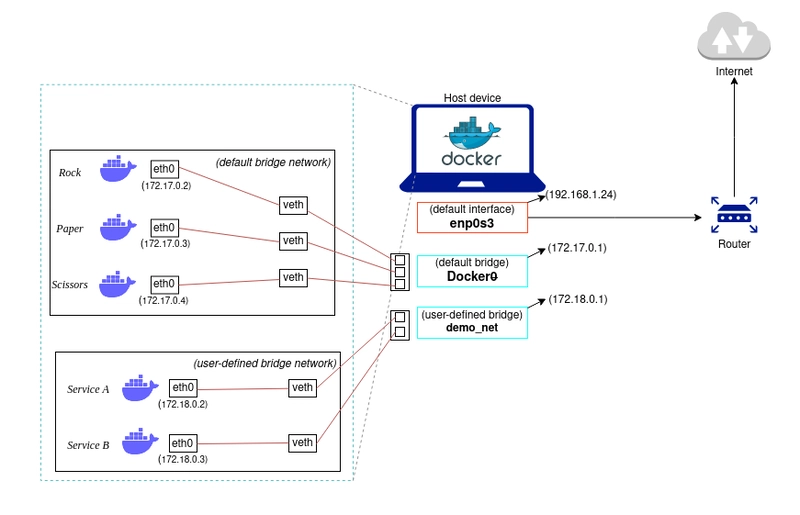
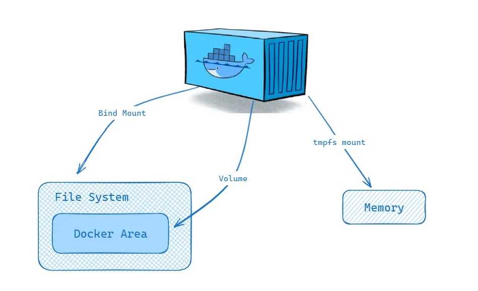

# Virtualisation
---
Hardware used to dictate what software could do. Virtualisation inverted that relationship. Since [IBM CP-40]() (1967), the story has been to "abstract the machine away" $\to$ "slice it thinner" $\to$ "pack more workloads onto fewer boxes", first with hypervisors which fake entire computers, then containers that fake entire OSes, and now orchestrators that manage thousands of both.

<!-- - https://www.youtube.com/watch?v=zh0OMXg2Kog -->

## I
---

### **1.1. Virtual Machine**

 

A [virtual machine]() (VM) is a software emulation of a complete physical computer with its own virtualised hardware and [guest]() OS, and a [hypervisor]() (aka. [VM monitor]() (VMM)) is the software layer that creates and manages VMs. Given that an instruction is: i) [sensitive]() if it depends on or affects processor state; and ii) [privileged]() if it traps when executed in user mode, [GJ Popek (1974)](https://dl.acm.org/doi/10.1145/361011.361073) proves that an ISA is efficiently virtualisable if every sensitive instruction is privileged, thus formalising the condition for the hypervisor. When this holds, the hypervisor runs the guest in user mode and intercepts every sensitive operation via [trap-and-emulate]() since each one triggers a trap.

[Type 1 hypervisors]() (bare-metal) run directly on the host hardware without an underlying OS. The dominant examples include VMware ESXi, MS Hyper-V, and [KVM]() (i.e. kernel-based VM) powering big cloud providers (e.g. AWS, GCP). They achieve better performance and stronger isolation than [Type 2 hypervisors]() (hosted), such as VirtualBox and VMware Workstation which runs as applications on a conventional OS, because no host kernel interposes between hypervisor and hardware. *The hypervisor manages its own scheduler for virtual CPUs, its own memory allocator for guest physical memory, and its own device model for virtualised I/O.*

- ...

The key value of virtualisation lies in [server consolidation]() and [multi-tenant]() isolation. Each application generally used to be required its own physical server which led to sprawl and low utilisation (e.g. reportedly 10-15%), but VMs enabled dozens of isolated workloads to share a single physical machine, each believing it has exclusive access to its own hardware. As noted, this consolidation, combined with the ability to snapshot, clone, and migrate running instances, transformed data centre economics and gave rise to the cloud computing model where providers sell virtualised resources on demand. An AWS [EC2 instance](), for example, is a VM running on KVM.

### **1.2. Virtualisation: x86**

 

The x86 architecture violates the Popek-Goldberg condition. Certain instructions, such as *POPF* (which modifies the interrupt flag) and *SGDT* (which reads the global descriptor table register), are sensitive but not privileged, meaning they execute silently in user mode rather than trapping to the hypervisor. This made classical trap-and-emulate impossible on x86, and virtualisation on the platform required workarounds for nearly two decades.

VMware's approach (1998) was [binary translation](), where the hypervisor scans the guest's instruction stream at runtime and rewrites problematic instructions into safe sequences that trap or produce the correct emulated effect. The translated blocks are cached for reuse, conceptually similar to JIT compilation. Xen took a different path with [paravirtualisation]() (2003), modifying the guest OS kernel to replace sensitive instructions with explicit [hypercalls]() to the hypervisor, analogous to how a user-space program makes system calls. This yielded excellent performance but required patching the guest kernel.

Intel [VT-x]() (2005) and AMD [AMD-V]() resolved the problem in hardware by introducing a new execution mode. The processor gained a root mode (for the hypervisor) and a non-root mode (for the guest), with a hardware-defined [VM control structure]() (VMCS on Intel, VMCB on AMD) that specifies which guest operations should cause a [VM exit](), transferring control to the hypervisor. Sensitive instructions now trap regardless of privilege level in non-root mode, satisfying the Popek-Goldberg condition by hardware extension. The hypervisor handles the exit, adjusts the guest state as needed, and executes a *VMRESUME* to return control to the guest.

- ...

KVM (2007) leverages these hardware extensions by turning the Linux kernel itself into a hypervisor. KVM is a kernel module that exposes virtualisation to user space through */dev/kvm*, while [QEMU]() provides device emulation (virtual disks, NICs, display) and manages the guest lifecycle. In this split architecture, KVM handles CPU and memory virtualisation at near-native speed via VT-x or AMD-V, and QEMU emulates the remaining hardware the guest expects to see.

[Extended page tables]() (EPT on Intel, NPT on AMD) addressed the remaining major source of overhead. Without hardware support, the hypervisor maintained [shadow page tables]() that merged the guest's virtual-to-physical mapping with the hypervisor's physical-to-machine mapping, requiring the hypervisor to intercept every guest page table update. EPT adds a second level of address translation in hardware, where the MMU automatically walks both the guest page table and the EPT in a single memory access. This two-dimensional page walk is more expensive per TLB miss (up to 24 memory references in the worst case for 4-level paging) but eliminates the constant trap overhead of shadow page tables, resulting in a net performance gain for most workloads.

### **1.3. Virtualisation: HW**

 

The hypervisor presents each VM with virtual CPUs (vCPUs) that it schedules onto physical cores. A host with 64 physical cores might run 200 vCPUs across its VMs through [overcommitment](), time-slicing physical cores among vCPUs just as the OS time-slices a core among processes. The hypervisor's scheduler must balance fairness, latency, and cache affinity, and VM scheduling adds a layer of complexity because the guest OS scheduler is unaware that its vCPUs are themselves being preempted. This can cause [lock-holder preemption](), where a guest thread holding a spinlock is descheduled, and other guest threads spin wastefully waiting for a lock whose holder is not running.

Memory virtualisation adds a second level of indirection between guest virtual addresses, guest physical addresses, and machine addresses, handled by shadow page tables or EPT as described above. [Memory ballooning]() allows the hypervisor to reclaim memory from underutilising VMs by inflating a balloon driver inside the guest that allocates pages the guest then cannot use, forcing the guest to page out less critical data and surrender physical memory back to the host.

Storage virtualisation presents virtual disks as files (VMDK, QCOW2, VHD) on the host file system. [Thin provisioning]() allocates physical storage only as the guest writes data rather than reserving the full virtual disk size upfront, so a 100 GB virtual disk might occupy only 20 GB on the host. [Snapshots]() capture the disk state at a point in time by freezing the current file and redirecting subsequent writes to a new differencing layer, enabling instant rollback. [Live migration]() moves a running VM between physical hosts by iteratively copying memory pages while the VM continues executing, converging when the rate of dirtied pages falls below the network transfer rate, then briefly pausing the VM (typically under 100 ms) to copy the final dirty pages and switch execution to the destination host.

Network virtualisation assigns each VM one or more virtual NICs connected through a [virtual switch]() (e.g. Open vSwitch) running on the host. The virtual switch forwards frames between VMs on the same host at memory speed and routes external traffic through the physical NIC. Assigning a physical device directly to a VM requires an [IOMMU]() such as Intel [VT-d]() (Virtualisation Technology for Directed I/O). The IOMMU remaps DMA addresses so a device can only access memory belonging to its assigned VM, and provides interrupt remapping that routes device interrupts to the correct virtual CPU without hypervisor intervention. [SR-IOV]() (Single Root I/O Virtualisation) builds on this by allowing a single physical NIC to present multiple lightweight [virtual functions]() (VFs) on the PCI bus, each assignable to a different VM via the IOMMU. Each VF appears as an independent NIC to the guest, with DMA access to its own queue pair on the physical hardware, bypassing the hypervisor's virtual switch entirely.

## II
---

### **2.1. Virtualisation: SW**

 

VMs virtualise the entire hardware stack and run a full guest OS, which provides strong isolation but at significant cost in memory and boot time. [OS-level virtualisation](https://en.wikipedia.org/wiki/OS-level_virtualization) (also called [containerisation]()) takes a fundamentally different approach by sharing the host kernel across isolated groups of processes, achieving millisecond startup times, megabyte-scale memory footprints, and densities of hundreds of instances per host. The trade-off is weaker isolation, since all containers share the same kernel and a kernel vulnerability can compromise every container on the host.

Linux containers rely on two kernel subsystems. [Namespaces](https://man7.org/linux/man-pages/man7/namespaces.7.html) partition global system resources so that each container perceives its own isolated instance. The PID namespace gives each container its own process tree (with PID 1 inside the container mapping to an arbitrary PID on the host). The network namespace provides a separate network stack with its own interfaces, routing tables, and iptables rules. The mount namespace isolates the file system view, so a container's root file system can differ entirely from the host's. Additional namespaces cover hostname (UTS), inter-process communication (IPC), and user/group IDs (user namespace, enabling rootless containers where UID 0 inside the container maps to an unprivileged UID on the host). The combined effect is that each container perceives its own complete operating system, with its own process tree, network stack, and root filesystem, despite sharing a single kernel underneath.

[Cgroups](https://man7.org/linux/man-pages/man7/cgroups.7.html) (control groups) complement namespaces by enforcing resource limits. While namespaces control what a process can *see*, cgroups control what it can *use*. A cgroup hierarchy assigns each container budgets for CPU shares (via the completely fair scheduler's bandwidth throttling), memory limits (with an OOM killer that terminates the container's processes rather than the host's), I/O bandwidth (via blkio controller), and device access (restricting which */dev* nodes are accessible). Cgroups v2 unified the previously fragmented v1 controller hierarchies into a single tree and exposes per-cgroup [pressure stall information]() (PSI) that quantifies how much time processes spend stalled waiting for CPU, memory, or I/O.

FreeBSD [jails]() (2000) and Solaris [Zones]() (2005) pioneered similar isolation models before Linux. The missing piece was tooling, since configuring namespaces and cgroups by hand required deep kernel knowledge. [LXC](https://linuxcontainers.org/) (2008) provided the first user-space tools for Linux containers, but it was Docker that made the abstraction accessible to application developers.

- ...

### **2.2. Docker**

 

[Docker](https://www.docker.com/) (2013) transformed containers from a Linux kernel feature into a developer workflow by introducing a standardised image format, a build system, and a distribution mechanism. A [Dockerfile]() specifies a sequence of instructions (FROM, RUN, COPY, CMD) that build a [container image](), an immutable snapshot of a file system containing the application and its dependencies. Each instruction produces a read-only [layer](), and layers are stacked using a [union file system]() (typically OverlayFS) that presents them as a single coherent directory tree. At runtime, a thin read-write layer is added on top, and [copy-on-write]() semantics ensure that modifications within the container do not affect the underlying image layers.

The layering mechanism is what makes Docker images efficient to build, store, and distribute. If two images share a common base (e.g. *ubuntu:22.04*), only the differing layers need to be transferred. [Docker Hub]() and private registries (AWS ECR, Google Artifact Registry) host images and serve layer blobs via a content-addressable API. Multi-stage builds allow compilation in one stage (with the full toolchain) and copying only the resulting artefacts into a minimal runtime image, dramatically reducing image size. The [Open Container Initiative]() (OCI) standardised the image format and runtime specification, decoupling the ecosystem from Docker's implementation and enabling alternative runtimes like [containerd]() and [CRI-O]().

The *docker run* command orchestrates the full container lifecycle in a single invocation. It pulls the image (if not cached locally), creates a union file system mount from the image layers, sets up namespaces for process, network, mount, UTS, and IPC isolation, applies cgroup resource limits, configures networking (creating a veth pair connecting the container to a bridge), and starts the specified entry point process. The container's PID 1 receives signals directly, so when it exits the container stops. [Docker Compose]() extends this to multi-container applications by declaring an entire service topology (web server, database, cache) in a single YAML file, where *docker compose up* instantiates all containers with their networking and volumes, and *docker compose down* tears them down. In practice, teams wrap these invocations behind a [Makefile]() so that *make up* and *make down* reduce the full lifecycle to a single keystroke.

- ...

Docker's default networking creates a [bridge]() (*docker0*) on the host and assigns each container an IP address on a private subnet (typically 172.17.0.0/16). Each container receives a [veth]() (virtual Ethernet) pair, with one end inside the container's network namespace and the other attached to the bridge. Containers on the same bridge communicate directly via layer-2 forwarding, while outbound traffic is NATed through iptables rules on the host. Port mapping (*-p 8080:80*) adds DNAT rules that forward host-port traffic into the container. For multi-host communication, [overlay networks]() encapsulate container traffic in VXLAN tunnels, assigning each container a cluster-wide IP that is routable across hosts without manual NAT configuration.

In practice, most deployments replace the default bridge with [user-defined bridge networks]() that provide automatic DNS resolution, allowing containers to reach each other by name rather than IP address, while containers on different networks are fully isolated unless explicitly connected. For workloads where network isolation is unnecessary, [host networking]() (*--network host*) bypasses the bridge entirely and binds the container directly to the host's network stack, eliminating NAT overhead at the cost of port conflicts if multiple containers listen on the same port.

- 
  <a href="https://dev.to/nobleman97/docker-networking-101-a-blueprint-for-seamless-container-connectivity-3i5b" target="_blank" style="position: absolute; bottom: -8px; right: 4px; font-size: 12px;">[src]</a> 

Container storage is ephemeral by default, since the read-write layer atop the union file system exists only for the lifetime of the container. [Volumes]() provide persistent storage by mounting a host-managed directory (stored under */var/lib/docker/volumes/*) into the container, bypassing the union file system for direct I/O. [Bind mounts]() map arbitrary host paths into the container, useful for development workflows where source code edits on the host should appear immediately inside the container. [tmpfs mounts]() provide in-memory storage for sensitive data that should never be written to disk.

- 
  <a href="https://therahulsarkar.medium.com/understanding-docker-volumes-a-comprehensive-guide-46339aa9ac53" target="_blank" style="position: absolute; bottom: -8px; right: 4px; font-size: 12px;">[src]</a>

## III
---

### **3.1. Container Orchestration**

 

Running containers on a single host with *docker run* suffices for development, but production deployments must schedule workloads across a cluster, restart failed instances, balance load, discover services, and manage rolling updates. [Container orchestration]() platforms solve this by treating a pool of machines as a single logical compute surface. The orchestrator maintains a [desired state]() (e.g. "run 5 replicas of this container with 2 CPUs and 4 GB each") and continuously reconciles reality to match that state through a [control loop]() that observes the current state, computes the difference, and takes corrective action. This declarative model is the central design principle that distinguishes orchestration from ad-hoc scripting.

[Kubernetes](https://kubernetes.io/) (K8s), originally developed at Google from the lessons of their internal Borg system and open-sourced in 2014, has become the dominant orchestration platform. Its architecture separates the [control plane]() from [worker nodes](). The control plane consists of the [API server]() (the single entry point for all cluster operations, exposing a RESTful interface over HTTPS), [etcd]() (a distributed key-value store that holds all cluster state with strong consistency via Raft consensus), the [scheduler]() (which assigns unscheduled pods to nodes based on resource availability, affinity rules, and constraints), and the [controller manager]() (which runs control loops for Deployments, ReplicaSets, and other resources). Each worker node runs a [kubelet]() agent that receives pod specifications from the API server and delegates container creation to a runtime like containerd or CRI-O.

The fundamental unit of deployment in Kubernetes is the [pod](), a group of one or more containers that share a network namespace (and thus an IP address and port space), storage volumes, and scheduling constraints. Pods are ephemeral by design, forcing applications to be stateless or to externalise state, which makes them resilient to node failures. Higher-level controllers such as Deployments and StatefulSets maintain the desired number of pod replicas and replace failed pods automatically.

### **3.2. Kubernetes Abstractions**

 

[Deployments]() manage stateless applications by declaring a desired replica count and a pod template. The Deployment controller creates a [ReplicaSet]() that ensures the specified number of identical pods are running at all times. On an update (e.g. a new container image version), the Deployment performs a [rolling update]() by gradually creating pods with the new template and terminating old ones. If the new version fails health checks, the Deployment can automatically roll back to the previous ReplicaSet. [StatefulSets]() extend this model for stateful workloads (databases, distributed ML parameter servers) that require stable network identities (pod-0, pod-1, ...) and persistent storage that survives pod rescheduling. [DaemonSets]() ensure that a copy of a specific pod runs on every node, commonly used for logging agents, monitoring daemons, or GPU device plugins.

[Services](https://kubernetes.io/docs/concepts/services-networking/service/) solve the problem of addressing ephemeral pods. A Service defines a stable virtual IP (ClusterIP) and DNS name that load-balances traffic across the set of pods matching a label selector, with kube-proxy programming iptables or IPVS rules on each node to forward traffic to a healthy backend pod. [NodePort]() Services expose the application on a static port on every node, and [LoadBalancer]() Services provision an external cloud load balancer. [Ingress]() resources define HTTP-level routing (hostname and path matching, TLS termination) and are implemented by controllers such as Nginx Ingress or Traefik.

[ConfigMaps]() and [Secrets]() inject configuration and credentials into pods as environment variables or mounted files, separating configuration from the container image. Resource [requests]() and [limits]() specify the CPU and memory each container needs (requests inform scheduling) and the maximum it may consume (limits trigger throttling or OOM kills). The [Horizontal Pod Autoscaler]() (HPA) adjusts replica count based on observed CPU utilisation, memory usage, or custom metrics exposed via the Metrics API, closing the feedback loop between load and capacity.

### **3.3. ML Infrastructure**

 

GPU scheduling in Kubernetes requires the [NVIDIA device plugin](), a DaemonSet that registers GPU resources (*nvidia.com/gpu*) with the kubelet. When a pod requests a GPU via its resource limits, the scheduler places it on a node with available GPUs, and the device plugin mounts the appropriate */dev/nvidia** device nodes, driver libraries, and CUDA runtime into the container. The [NVIDIA GPU Operator]() automates the full stack, deploying GPU drivers, container toolkit, device plugin, and [DCGM]() (Data Center GPU Manager) for monitoring, as a set of Kubernetes-native resources that adapt to the host's hardware.

For distributed training across multiple pods and nodes, [Kubeflow](https://www.kubeflow.org/) and its [Training Operator]() define custom resources (PyTorchJob, TFJob, MPIJob) that coordinate multi-worker training sessions. A PyTorchJob specification declares the number of workers and a master, and the operator handles pod creation, environment variable injection for rank and world size, and failure recovery (restarting failed workers while preserving the training run).

Storage for ML workloads involves [PersistentVolumes]() (PVs) backed by network file systems (NFS), cloud block storage (EBS, GCE PD), or parallel file systems (Lustre, GPFS). [PersistentVolumeClaims]() (PVCs) decouple pod specifications from storage provisioning, and [StorageClasses]() enable dynamic provisioning so that requesting a PVC automatically creates the underlying volume. For large-scale training where datasets exceed terabytes, data pipelines often stream directly from object stores (S3, GCS) via FUSE mounts or specialised data loaders rather than pre-staging to persistent volumes. Monitoring and observability at this scale rely on [Prometheus]() for time-series metrics collection, [Grafana]() for visualisation and alerting, and log aggregation systems like [Fluentd]() or [Loki]() for debugging training failures across hundreds of pods.

<!-- ## IV -->
<!-- --- -->
<!---->
<!-- ### **4.1. Isolation Spectrum** -->
<!---->
<!-- 
 
 -->
<!---->
<!-- Several projects have sought intermediate points on the isolation spectrum between VMs and containers. [Kata Containers]() runs each container inside a lightweight VM with a stripped-down guest kernel, providing hardware-level isolation with container-like ergonomics. Boot time is ~100 ms with ~5 MB memory overhead per micro-VM. AWS [Firecracker]() (the technology behind Lambda and Fargate) takes a similar approach with a purpose-built [virtual machine monitor]() written in Rust, designed to launch micro-VMs in under 125 ms with minimal memory and a reduced device model (no USB, no GPU passthrough, only virtio-net and virtio-block) that shrinks the attack surface. Google's [gVisor]() takes yet another approach by interposing a user-space kernel (called Sentry) that intercepts container system calls via ptrace or the KVM platform, reimplementing a subset of the Linux syscall interface in a memory-safe language (Go). This sandboxes the container without the overhead of a full VM, at the cost of incomplete syscall compatibility and some performance overhead on I/O-heavy workloads. -->
<!---->
<!-- In practice, modern cloud infrastructure layers multiple isolation mechanisms. Cloud providers run Kubernetes clusters inside VMs ([GKE](https://cloud.google.com/kubernetes-engine), [EKS](https://aws.amazon.com/eks/), [AKS](https://azure.microsoft.com/en-us/products/kubernetes-service)), combining the security boundary of the hypervisor with the packaging efficiency of containers. Multi-tenant platforms like AWS Fargate use Firecracker to isolate each customer's containers in separate micro-VMs. Even within a single organisation, [pod security standards]() in Kubernetes restrict container capabilities (dropping Linux capabilities, enforcing read-only root filesystems, preventing privilege escalation) to limit the blast radius of a compromised container. The choice along this spectrum depends on the threat model, the trust level of the workload, and the performance requirements. -->
<!---->
<!---->
<!-- ### **4.2. Infrastructure as Code** -->
<!---->
<!-- 
 
 -->
<!---->
<!-- Virtualisation decouples infrastructure from physical hardware, and [infrastructure as code]() (IaC) takes this further by defining compute, storage, and networking resources in declarative configuration files that can be version-controlled, reviewed, tested, and reproducibly applied. Rather than manually provisioning servers through a web console, engineers describe the desired state in code and let a tool converge the actual infrastructure to match. This makes infrastructure reproducible (the same configuration yields the same environment), auditable (changes are tracked in version control), and composable (modules can be reused across projects). -->
<!---->
<!-- [Terraform](https://www.terraform.io/) by HashiCorp is the dominant IaC tool for cloud resources. It uses a plugin architecture where [providers]() implement CRUD operations for specific platforms (AWS, GCP, Azure, Kubernetes), and a declarative language (HCL) describes the desired resource graph. Terraform computes a plan (the diff between desired and actual state), presents it for review, and applies changes in dependency order. [Ansible](https://www.ansible.com/) complements Terraform by handling configuration management and application deployment, executing tasks over SSH without requiring agents on managed hosts. [Helm]() packages Kubernetes manifests into reusable [charts]() with templated values, so deploying a complex application (database, cache, web server, ingress) reduces to specifying a values file. -->
<!---->
<!-- For ML teams, IaC enables reproducible infrastructure end-to-end. A single repository can define GPU node pools, VPC networking rules, storage classes, container images, and training job templates. [CI/CD]() pipelines (GitHub Actions, GitLab CI, Argo Workflows) trigger on a git push to provision infrastructure, build and push container images, launch distributed training jobs, evalu, and deploy approved models to serving endpoints. This infrastructure layer completes the stack from hardware to deployment, making the entire lifecycle from code commit to production inference reproducible, auditable, and scalable. -->
