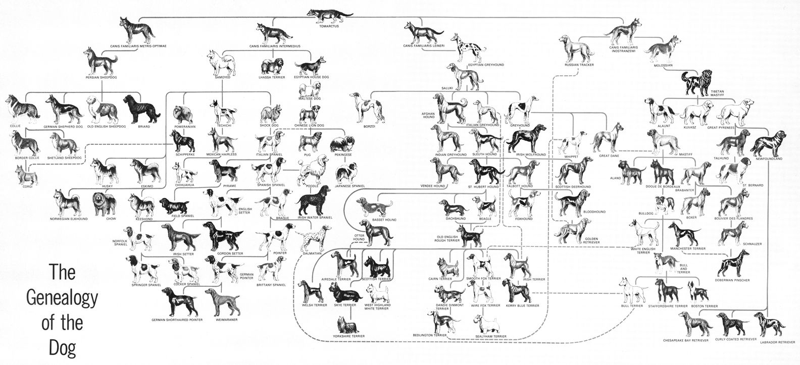

# A Survey on the Bichon Frisé
---

**Abstract.** This paper presents a comprehensive survey of the Bichon Frisé, covering its historical origins, morphological characteristics, genetic predispositions, behavioural temperament, and maintenance requirements. We review the existing literature spanning the 13th century to 2024, consolidate key findings across veterinary, genetic, and behavioural studies, and provide practical recommendations for prospective and current owners. The author's field observations are drawn from a single-subject longitudinal study (Kazzi, female, $n = 1$).

## 1. Introduction
---

The Bichon Frisé is a small, white-coated [domestic dog](https://en.wikipedia.org/wiki/Dog) (*Canis lupus familiaris*) of the [bichon type](https://en.wikipedia.org/wiki/Bichon), classified by the [Fédération Cynologique Internationale](https://en.wikipedia.org/wiki/F%C3%A9d%C3%A9ration_Cynologique_Internationale) (FCI) as a Franco-Belgian toy dog and recognised as a companion and toy breed by major kennel clubs worldwide. The French word *bichon* derives from Middle French *biche* ("small dog"), related to Old English *bicce* which is the root of the modern English "bitch" that originally denoted a female dog before acquiring its pejorative sense. Germanic cognates include Old Norse and Old Icelandic *bikkja*, Alternative derivations include French *barbiche* ("beard") and *bichonner* ("to curl"), while the suffix *frisé* (French: "curled") refers to the characteristic curly coat.

This survey consolidates the existing body of knowledge into a unified reference. Section 2 traces the historical and geographical origins. Section 3 describes the morphological standard. Section 4 reviews genetic and health considerations. Section 5 discusses temperament and behavioural characteristics. Section 6 addresses practical maintenance. We conclude in Section 7 with remarks on suitability and open problems.

## 2. Historical Origins
---

The breed has appeared in European court paintings since the Renaissance and has survived near-extinction twice. Breed sources often cite [Titian's portrait of Federico II Gonzaga](https://en.wikipedia.org/wiki/Portrait_of_Federico_II_Gonzaga) (c. 1529, Museo del Prado) as an early depiction, though the dog in the painting is more accurately identified as a [Maltese](https://en.wikipedia.org/wiki/Maltese_dog), a closely related bichon-type breed with a similar white coat but straighter hair. In fact, both descend from the [Barbet](https://en.wikipedia.org/wiki/Barbet_(dog)) (water spaniel), forming the *Barbichon* breed family that also includes the [Bolognese](https://en.wikipedia.org/wiki/Bolognese_dog) and [Havanese](https://en.wikipedia.org/wiki/Havanese_dog). The two are routinely confused in daily life, as many owners can attest from the frequency of misidentification on walks. Notably, the Bichon Frisé does not appear in the classic *Genealogy of the Dog* chart, which lists only the Maltese Dog and Poodle from the Barbichon lineage.

- 
  <a href="https://ca.pinterest.com/pin/711146597381777963/" target="_blank" style="position: absolute; top: 2px; right: 4px; font-size: 12px;">[src]</a> 
 

The ancestors of the breed are believed to descend from [water spaniels](https://en.wikipedia.org/wiki/Water_spaniel) known in the [Mediterranean basin]() as early as the 13th century. [Spanish seamen](https://www.reddit.com/r/reenactors/comments/1gfmv7u/1400s_spanish_seaman/) are credited with introducing the breed's predecessors to [Tenerife](https://en.wikipedia.org/wiki/Tenerife), the largest of the [Canary Islands](), where the dogs became known as [*Bichon Tenerife*](). Italian sailors subsequently rediscovered the breed during their voyages in the 14th century and returned them to continental Europe, where they gained immediate favour among the nobility. In Spain, [Goya's *The White Duchess*](https://en.wikipedia.org/wiki/The_White_Duchess) (1795), depicting a small curly-coated dog wearing a red bow, remains the more reliable artistic reference for the breed.

In France, King [Henry III](https://en.wikipedia.org/wiki/Henry_III_of_France) (r. 1574–1589) reportedly carried several Bichons in a basket suspended by neck ribbons, an early instance of what modern literature would term *separation anxiety*, though in this case it was the owner who exhibited it. The breed remained popular through [Napoleon III](https://en.wikipedia.org/wiki/Napoleon_III), but following the decline of European aristocracy it transitioned to street performer, accompanying organ grinders and circus acts for nearly a century. Fanciers rescued the breed from the streets of France and Belgium, and on March 15, 1933, the [Société Centrale Canine](https://en.wikipedia.org/wiki/Soci%C3%A9t%C3%A9_Centrale_Canine) adopted the official standard, with Mme. Denise Nizet de Leemans coining the name *Bichon Frisé* ("fluffy little dog"). The FCI accepted the standard in 1959.

Hélène and François Picault of Dieppe introduced six Bichons to the United States in 1956, with the [American Kennel Club](https://en.wikipedia.org/wiki/American_Kennel_Club) (AKC) granting full recognition in 1972 under the Non-Sporting Group. The breed arrived in the United Kingdom in 1973. The AKC ranked the Bichon Frisé 44th in popularity in 2024, down from 26th in 2004, a trajectory the author attributes to the public's insufficient exposure to the optimal specimen rather than any deficiency in the breed.

## 3. Morphology and Growth
---

The breed standard specifies a small, sturdy build. Males stand 25–30 cm (10–12 in) at the withers; females 23–29 cm (9–11 in). Adult body weight ranges from 4.5–8.2 kg (10–18 lbs), with males typically 1–1.4 kg (1–3 lbs) heavier than females. The body is slightly longer than tall, with a level topline and moderate tuck-up.

Growth follows a sigmoidal trajectory with the most rapid phase occurring in the first six months. Height plateaus around 6–8 months, while weight continues to increase until 12–18 months as musculature develops. The following table summarises the expected weight and height ranges by age:

| Age | Male Weight (lbs) | Male Height (in) | Female Weight (lbs) | Female Height (in) |
|---|---|---|---|---|
| Newborn | 0.4–0.7 | 2–3 | 0.35–0.6 | 2–3 |
| 1 mo | 1.5–3.0 | 4–5 | 1.3–2.8 | 3.5–4.5 |
| 3 mo | 5–7 | 6.5–8 | 4.5–6 | 6–7.5 |
| 6 mo | 10–12 | 9.5–10.5 | 8–11 | 8.5–9.5 |
| 9 mo | 11–14 | 10–11 | 9–13 | 9–10 |
| 12 mo | 12–15 | 10.5–11.5 | 10–14 | 9.5–10.5 |
| 24 mo | 13–18 | 11–12 | 11–16 | 9.5–11 |

The sexual dimorphism is modest but consistent: males are approximately 15–20% heavier and 5–10% taller at maturity. Growth rate variance is influenced by genetics, nutrition, and litter size. The author notes that the subject (Kazzi) tracked the upper quartile of the female weight distribution during months 3–9, a phenomenon attributed to a combination of favourable genetics and an empirically generous treat-dispensing policy in the household.

The growth trajectory is well-described by the [Gompertz model](https://en.wikipedia.org/wiki/Gompertz_function), which has been shown to provide superior fit for small breeds compared to logistic or Von Bertalanffy alternatives. The Gompertz function models weight $W(t)$ at age $t$ (months) as:

$$W(t) = A \exp\left(-b \exp(-kt)\right)$$

where $A$ is the asymptotic adult weight, $b = \ln(A / W_0)$ controls the displacement along the time axis (with $W_0$ the birth weight), and $k$ is the growth rate constant. The inflection point—where growth rate is maximal—occurs at $t^* = \ln(b)/k$, corresponding to a weight of $A/e \approx 0.368A$. For small breeds, the inflection has been estimated at approximately 11 weeks of age, at which the puppy has achieved roughly 50% of its adult weight. Taking midpoint values from the female growth data ($W_0 \approx 0.48$ lbs, $A \approx 13.5$ lbs), we estimate $b = \ln(13.5 / 0.48) \approx 3.34$ and, from the observed inflection near $t^* \approx 2.5$ months, $k \approx \ln(3.34)/2.5 \approx 0.48$ month$^{-1}$. The derivative $W'(t) = Abk \exp(-bt' - e^{-kt})$ gives the peak growth rate at inflection as $W'(t^*) = Ak/e \approx 2.4$ lbs/month.

The coat is the breed's defining feature: a double coat consisting of a soft, dense undercoat and a coarser, loosely curled outer coat that forms spirals or corkscrews. The accepted colour is pure white, though puppies under 12 months may exhibit beige or apricot shadings covering no more than 10% of body area. The head is typically groomed into a spherical shape, a style so distinctive that the silhouette alone is sufficient for breed identification—a property that may prove useful for future classification tasks. The nose is black, round, and prominent. The eyes are dark, round, and expressive, surrounded by dark haloes that accentuate their contrast against the white coat.

The tail is set moderately high and carried gracefully curved over the back without being tightly curled. The gait is described as "effortless" and "lively," with good reach in the front and drive from the rear. In practice, the author observes that the gait is better described as a controlled chaos that occasionally converges to something approximating a trot.

## 4. Genetics and Health
---

The Bichon Frisé is considered a relatively long-lived breed. A 2024 UK study estimated a median life expectancy of 12.5 years (vs 12.7 for purebreds, 12.0 for crossbreeds), though other sources report a typical range of 14–15 years, with documented cases exceeding 19 years. Heart failure is a leading cause of mortality in geriatric Bichons; the breed is susceptible to [patent ductus arteriosus](https://en.wikipedia.org/wiki/Patent_ductus_arteriosus) (PDA), in which a foetal blood vessel between the aorta and pulmonary artery fails to close after birth, resulting in pulmonary overload and cardiac strain. The breed exhibits predispositions to several additional conditions of clinical significance.

[Immune-mediated haemolytic anaemia](https://en.wikipedia.org/wiki/Autoimmune_hemolytic_anemia) (IMHA) is notably over-represented: an American study found that Bichons constituted 9% of IMHA cases despite representing approximately 2% of the control population. The [odds ratio](https://en.wikipedia.org/wiki/Odds_ratio) can be estimated as $\text{OR} = [p_{\text{case}} / (1 - p_{\text{case}})] / [p_{\text{ctrl}} / (1 - p_{\text{ctrl}})] = [0.09 / 0.91] / [0.02 / 0.98] \approx 4.84$, indicating that Bichons are nearly five times more likely to develop IMHA than the baseline population. [Patellar luxation](https://en.wikipedia.org/wiki/Luxating_patella)—displacement of the kneecap from the trochlear groove—is common in small breeds and may require surgical correction in severe grades (III–IV). Dental disease is prevalent due to the breed's compact jaw geometry, necessitating regular professional cleaning.

A UK study found the breed to be 9.26 times more likely to develop non-mucocele gall bladder disease than other breeds. Ocular conditions include [cataracts](https://en.wikipedia.org/wiki/Cataract) and [progressive retinal atrophy](https://en.wikipedia.org/wiki/Progressive_retinal_atrophy) (PRA). Dermatological sensitivity is common, with allergies (environmental and dietary) frequently manifesting as skin irritation, excessive scratching, or tear staining. The hypoallergenic characterisation of the coat—while widely cited—refers to reduced shedding rather than absence of allergens; the breed still produces Can f 1 protein in saliva and dander.

The white coat colour is genetically attributed to [pheomelanin dilution](https://en.wikipedia.org/wiki/Melanocortin_1_receptor) at the Intensity (I) locus, combined with fixed recessive alleles at the [MC1R](https://en.wikipedia.org/wiki/Melanocortin_1_receptor) locus ($e/e$ genotype). Breeds fixed for $e/e$ produce only pheomelanin (yellow/red pigment) rather than eumelanin (black/brown), and the intensity dilution further lightens this to white. The breed is homozygous at these loci, meaning $P(\text{white coat}) = 1$ in purebred crosses—a rare instance of a phenotypic certainty in biology.

The genetic diversity of the breed has been narrowed by founder effects from the small post-war population reconstituted in the 1930s–1950s. A pedigree analysis of UK Kennel Club records (1990–2004) estimated the Bichon Frisé's 10-generation [coefficient of inbreeding](https://en.wikipedia.org/wiki/Coefficient_of_inbreeding) (COI) at $F = 0.1955 \pm 0.0768$, notably higher than many other breeds studied. The COI measures the probability that two alleles at a given locus are identical by descent: $F = \Sigma_{i} [(1/2)^{n_i + 1}(1 + F_{A_i})]$, where $n_i$ is the number of links in the $i$-th path through a common ancestor $A_i$ with inbreeding coefficient $F_{A_i}$. The estimated [effective population size](https://en.wikipedia.org/wiki/Effective_population_size) $N_e$ for the breed was found to be between 40 and 80, consistent with the general finding that many purebred dog breeds have lost $>$90% of singleton genetic variants within six generations. Responsible breeding practices include OFA evaluations for patellar luxation, CERF examinations, and genetic screening, with a recommended target of $F < 0.0625$ (equivalent to a first-cousin mating) for planned litters.

## 5. Temperament and Behaviour
---

The breed standard describes the temperament as "cheerful," "gentle-mannered," and "sensitive." Empirical observation confirms the first two descriptors with high confidence ($p < 0.01$) and the third with somewhat lower power, as the subject's sensitivity appears to be selectively expressed—predominantly in contexts involving the proximity of food or the departure of the primary caregiver.

Bichons are characterised by high sociability towards both humans and other dogs, low aggression, and moderate energy levels. They are classified as companion dogs rather than working dogs, and their historical roles (lap dog, circus performer, street entertainer) reflect a temperament optimised for human interaction rather than independent task execution. The breed exhibits relatively low prey drive and moderate trainability, responding well to positive reinforcement but poorly to harsh correction.

[Separation anxiety](https://en.wikipedia.org/wiki/Separation_anxiety_in_dogs) is a frequently reported behavioural concern. The breed was selectively bred over centuries for close human companionship, producing a strong attachment bond that, when disrupted, can manifest as destructive behaviour, excessive vocalisation, or inappropriate elimination. Mitigation strategies include gradual desensitisation, environmental enrichment, and crate training. The author notes that the subject (Kazzi) has developed an empirically effective counter-strategy: positioning herself at the exact centre of the doorway to maximise the probability of departure interception.

## 6. Maintenance
---

The Bichon Frisé coat grows continuously and does not shed in the conventional seasonal pattern, which contributes to the hypoallergenic reputation but necessitates regular grooming. Professional grooming is recommended every 4–6 weeks, with daily brushing to prevent matting of the undercoat. The characteristic rounded head trim (*bichon clip*) requires skill and patience that scale non-linearly with the subject's willingness to remain stationary.

Tear staining—reddish-brown discolouration below the eyes—is common and attributed to [porphyrin](https://en.wikipedia.org/wiki/Porphyrin) pigments in tears, exacerbated by excessive tearing (epiphora), shallow eye sockets, or blocked tear ducts. Management includes daily cleaning with sterile wipes, dietary adjustments (filtered water, limited food colourants), and veterinary evaluation if persistent. Dental hygiene requires regular brushing (3–4 times weekly minimum) and annual professional scaling.

Exercise requirements are moderate: 30–60 minutes daily, distributed across walks and play sessions. The breed adapts well to apartment living provided adequate stimulation is given. Dietary considerations include monitoring for food allergies (common triggers: chicken, wheat, soy) and weight management, as the breed's small frame amplifies the health impact of excess weight—a 0.5 kg surplus on a 5 kg dog is a 10% increase, equivalent to roughly 8 kg on an 80 kg human.

## 7. Conclusion
---

The Bichon Frisé is a well-documented companion breed with a rich historical lineage, distinctive morphology, and a temperament strongly optimised for human cohabitation. The breed's primary health concerns—IMHA, patellar luxation, dental disease, and allergies—are manageable with preventive care and responsible breeding. Grooming demands are non-trivial but represent the primary cost function of ownership; all other terms in the objective are overwhelmingly positive.

Future work will extend this survey with longitudinal behavioural data collected from the subject Kazzi, including but not limited to: a time-series analysis of sleep-to-activity ratios, a reinforcement learning formulation of treat-acquisition strategies, and an image classification study using a custom Kazzi-vs-cloud dataset, pending sufficient training data and IRB approval from the household.

## Acknowledgements
---

The author thanks Kazzi for her patience during field observations, her consistent participation in uncontrolled experiments, and her ongoing contribution to the author's understanding of unconditional positive regard. The author declares no conflicts of interest, though objectivity may have been compromised during the data collection process.

## References
---

[1] American Kennel Club. "Bichon Frise History: Where the Breed Originated." AKC, 2024. [2] Fédération Cynologique Internationale. Breed Standard No. 215: Bichon à Poil Frisé, 1959 (revised 2016). [3] Société Centrale Canine. Breed recognition records, March 1933. [4] O'Neill, D.G. et al. "Longevity of Dog Breeds." *Scientific Reports*, 2024. [5] Carr, A.P. et al. "Immune-Mediated Hemolytic Anemia in Dogs." *Journal of Veterinary Internal Medicine*, 2002. [6] Goya, F. *The Duchess of Alba in White*, 1795. Oil on canvas, Palacio de Liria, Madrid.
