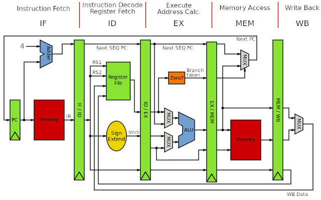

# Computer
---
> The cs600 covers the rudimentary elements of Computer Science and aims to enhance the work-related self-efficacy of someone only with a degree in Mathematics. This first post traces the arc from mechanical calculators to modern accelerators, covering the hardware that underpins all computation.

<!-- - https://www.youtube.com/watch?v=ISJ44S5sZu8 -->
<!-- - https://www.youtube.com/watch?v=HbgzrKJvDRw -->
<!-- - https://www.youtube.com/watch?v=7xWaijDmKDY -->
<!-- - https://www.youtube.com/watch?v=16zrEPOsIcI -->

<!-- - <iframe width="500" height="300" src="https://www.youtube.com/embed/kKJxzay85Vk?si=nemG0E7zqsjleTpG" title="YouTube video player" frameborder="0" allow="accelerometer; autoplay; clipboard-write; encrypted-media; gyroscope; picture-in-picture; web-share" referrerpolicy="strict-origin-when-cross-origin" allowfullscreen></iframe> -->

## I
---

### **1.1. Computer**

<p style="margin-bottom: 12px;"> </p>

Charles Babbage's [analytical engine]() (1837) is widely regarded as the first conceptual design of a general-purpose computer. It separated a processing unit from memory, supported conditional branching and loops via three types of punch cards, and was Turing-complete by modern definitions. *Ada Lovelace wrote what is considered the first computer program for the machine (an algorithm for computing Bernoulli numbers, published as Note G to her 1843 translation of Menabrea's paper on the engine)*. A century later, the Turing machine was introduced in [Turing (1936)](https://www.cs.virginia.edu/~robins/Turing_Paper_1936.pdf), an abstract device that formalised the limits of what machines can compute, resolved the [Entscheidungsproblem](https://en.wikipedia.org/wiki/Entscheidungsproblem) negatively, and laid the theoretical foundation for modern computer science.

The [Electronic numerical integrator and computer]() (ENIAC), completed in 1945 by J. Presper Eckert and John Mauchly is perhaps the first programmable electronic general-purpose digital computer. It used 17,468 [vacuum tubes](), occupied a 50×30-foot room, consumed ~150 kW, and performed up to 5,000 additions per second, which is orders of magnitude faster than electromechanical predecessors. [Von Neumann (1945)](https://en.wikipedia.org/wiki/First_Draft_of_a_Report_on_the_EDVAC) then described the [stored-program concept](), the idea of storing both instructions and data in the same uniform memory, via the Von Neumann architecture that still dominates computer design.

The [transistor](), demonstrated in 1947 by Bell Labs (Nobel Prize in Physics, 1956), replaced vacuum tubes with devices which were smaller, faster, more reliable, and consumed far less power. The next leap came with the [integrated circuit]() (IC). Jack Kilby at Texas Instruments showed the first working IC on a germanium substrate in 1958 (Nobel Prize in Physics, 2000), while Robert Noyce at Fairchild Semiconductor independently devised the planar silicon IC with aluminium metallisation (January 1959) that enabled mass production. The IC's key innovation was consolidating transistors, resistors, and capacitors onto a single [semiconductor]() substrate.

- <div style="position: relative; display: inline-block;">  <a href="https://www.facebook.com/photo.php?fbid=358029574671575&set=a.402508171866862&id=100063230468379" target="_blank" style="position: absolute; bottom: -8px; right: 4px; font-size: 12px;">[src]</a> </div>

<!-- - <div style="position: relative; display: inline-block;">  <a href="https://www.facebook.com/photo.php?fbid=358029574671575&set=a.402508171866862&id=100063230468379" target="_blank" style="position: absolute; bottom: -8px; right: 4px; font-size: 12px;">[src]</a> </div> -->

[Moore's Law]() drove successive waves of integration. [Moore (1965)](https://www.cs.utexas.edu/~fussell/courses/cs352h/papers/moore.pdf) observed that the number of transistors per IC doubled roughly every year (i.e. revised to every two in 1975), an empirical trend that guided the semiconductor roadmap for five decades. Having said that, the [Intel 4004](https://en.wikipedia.org/wiki/Intel_4004) (1971) was the first commercial [microprocessor](), which packed 2,300 transistors into a 4-bit CPU on a 12 mm² die, and was originally commissioned by Busicom (i.e. the Japanese calculator maker). The [IBM PC](https://en.wikipedia.org/wiki/IBM_Personal_Computer) (1981), built with an open architecture and Intel's [8088]() processor, standardised personal computing and spawned the clone ecosystem that persists today. 

[Clock speed]() plateaued at ~3-4 GHz around 2004 as [Dennard scaling]() broke down. The industry moved to acquire multiple cores on a single die at lower frequencies within the same power envelope, while a [system on chip]() (SoC) paradigm introduced a unified design where core components and specialised accelerators (e.g. NPU - inference, ISP - camera) all live on a die. For example, [Apple Silicon]() (M1, 2020) places 8 CPU cores, 8 GPU cores, a 16-core Neural Engine, and LPDDR memory dies co-packaged on the same substrate (system-in-package) at 5 nm<!-- 16 billion transistors -->. Desktops and servers indeed prefer wiring components onto a [motherboard](https://www.youtube.com/watch?v=d86ws7mQYIg&t=21s) for upgradability, connecting the hardware peripherals <!--processor, RAM slots, storage, I/O ports, and expansion slots-->via [buses]() and [chipsets](). 

<!-- [Peripheral component interconnect express]() (PCIe) slots allow discrete add-in cards such as GPUs and NICs to communicate with the CPU through serial point-to-point lanes. [Direct Memory Access]() (DMA) allows devices to read/write host memory without CPU involvement, enabling transfers between GPU, NIC, storage controllers, and DRAM while the CPU does other work. SoCs simplify the board to mainly power delivery and connectors. -->

- <div style="position: relative; display: inline-block;">  <a href="https://www.youtube.com/watch?v=mHEWMiHgyU8" target="_blank" style="position: absolute; bottom: -8px; right: 4px; font-size: 12px;">[src]</a> </div>

- <div style="position: relative; display: inline-block;">  <a href="https://www.refsmmat.com/courses/751/notes/index.html" target="_blank" style="position: absolute; bottom: -8px; right: 4px; font-size: 12px;">[src]</a> </div>

<!-- - <iframe width="450" height="285" src="https://www.youtube.com/embed/d86ws7mQYIg?si=5FHtHqUPzKoaNcbI" title="YouTube video player" frameborder="0" allow="accelerometer; autoplay; clipboard-write; encrypted-media; gyroscope; picture-in-picture; web-share" referrerpolicy="strict-origin-when-cross-origin" allowfullscreen></iframe> <p style="margin-bottom: 15px;"> </p> -->

<!-- - <iframe width="500" height="300" src="https://www.youtube.com/embed/d86ws7mQYIg?si=ukinzUgb-I3f3n1t" title="YouTube video player" frameborder="0" allow="accelerometer; autoplay; clipboard-write; encrypted-media; gyroscope; picture-in-picture; web-share" referrerpolicy="strict-origin-when-cross-origin" allowfullscreen></iframe> -->

### **1.2. Central Processing Unit**

<p style="margin-bottom: 12px;"> </p>

A [central processing unit](https://www.youtube.com/watch?v=16zrEPOsIcI) (CPU) implements an [instruction set architecture]() (ISA), the set of predefined operations the hardware could perform. Every computation reduces to a sequence of these instructions in which dedicated units within the CPU execute them. An [arithmetic logic unit]() (ALU) performs integer and bitwise logic operations, a [floating-point unit]() (FPU) performs IEEE 754 arithmetic, and a [control unit]() (CU) sequences instruction execution and routes data between them, as the diagram illustrates a minimal 4-bit CPU with a 16-instruction ISA. The two dominant ISA families reflect a fundamental [trade-off](https://www.youtube.com/watch?v=d-8M6Rks860) between simplicity and density of instructions.

Intel's [x86]() (1978) exemplifies [complex instruction set computer]() (CISC): variable-length instructions (1-15 bytes), memory operands in arithmetic, and complex addressing modes accumulated 1,500+ instructions in which backwards compatibility forbids removing legacy ones. Whereas, [Acorn RISC Machine]() (ARM, 1985) has [reduced instruction set computer](https://www.youtube.com/shorts/UZrNRR87sS0) (RISC): fixed-length instructions, a load-and-store architecture, and a large register file, resulting in only ~350 base instructions. [RISC-V]() (2010) pushes the RISC philosophy further with a minimal base integer ISA (~47 instructions) and optional extensions, released royalty-free via UC Berkeley.

<!-- IBM required Intel to second-source the 8086 for the IBM PC, so Intel licensed x86 to AMD. Both companies now implement x86-64, the 64-bit extension AMD designed in 2003 after Intel's own [Itanium]() (IA-64) failed in the market. --> The practical consequence of the CISC design is [decode complexity](). x86's variable-length format forces the decoder to inspect each byte sequentially to find instruction boundaries, and modern x86 CPUs from both vendors dedicate substantial die area to [front-end decoders]() that crack these into fixed-width [micro-ops]() ($\mu$ops), effectively translating CISC to RISC internally. ARM's fixed 4-byte format eliminates this overhead, yielding simpler decode logic, shorter pipelines, and lower power per instruction retired. This efficiency gap drove Apple's transition to ARM-based Apple Silicon (M1-M4). <!-- and in servers AWS [Graviton]() (2018) and Ampere [Altra]() deliver competitive throughput at lower power per rack unit. -->

- <div style="position: relative; display: inline-block;">  <a href="https://faculty.washington.edu/gmobus/Academics/TCSS372/Notes/crash1.html" target="_blank" style="position: absolute; bottom: -8px; right: 4px; font-size: 12px;">[src]</a> </div>

Every CPU runs the same [fetch-decode-execute]() cycle: fetch the instruction at the PC $\to$ decode it $\to$ execute on the appropriate unit $\to$ write back. While there are various types of registers (e.g. PC, SP, GPRs, flags), <!--[Registers]() hold the data and state for this cycle. A [program counter]() (PC) points to the next instruction, an [instruction register]() (IR) holds the fetched instruction during decoding, [general-purpose registers]() (GPRs) hold operands, a [stack pointer]() (SP) tracks the call stack, a [flags register]() stores ALU condition bits (zero, carry, overflow), and [SIMD registers]() hold vector operands.-->a CPU's [word size]() is the width of its GPRs in bits, which typically matches the ALU and data path width. Modern memory is [byte-addressable](), meaning each address refers to a single byte (8 bits), and an $N$-bit CPU can address $2^N$ bytes (e.g. $2^{32}$ = 4 GB for 32-bit, $2^{64}$ $\approx$ 16 EB for 64-bit). A variable wider than one byte (e.g. a 4-byte integer) occupies consecutive addresses, and its [pointer]() holds the address of the first byte. Addresses are conventionally written in [hexadecimal]() (base-16, prefixed 0x), since each hex digit maps to exactly 4 bits, making binary patterns compact and readable.

Byte-addressable memory (each address = 1 byte)

Address:  0x0000  0x0001  0x0002  0x0003  0x0004  0x0005  0x0006  0x0007  ...
Content:  [ 2A  ] [ 00  ] [ 00  ] [ 00  ] [ 48  ] [ 65  ] [ 6C  ] [ 6C  ] ...
          |________ int x = 42 ________|  |____ char s[] = "Hell" ________|
          (4 bytes, little-endian)         (4 bytes, one char per byte)

          &x = 0x0000                     &s = 0x0004
          (pointer to first byte)         (pointer to first byte)

On a 64-bit CPU (N=64):
  - each address is 64 bits wide
  - total addressable bytes = 2^64 ~ 18.4 x 10^18 (18.4 exabytes)
  - but physical RAM is much smaller (e.g. 16 GB = 2^34 bytes)
  - the OS bridges this gap via virtual memory (page tables)

<!-- Word size is independent of instruction width (x86 instructions vary 1-15 bytes on a 64-bit CPU) and SIMD width (AVX-512 processes 512 bits). [Opteron]() (2003) from AMD made the 64-bit jump practical for x86 by introducing [x86-64]() (AMD64), an extension Intel later adopted as EM64T. -->

[Pipelining]() increases throughput by overlapping execution stages, so after the pipeline fills one instruction completes per cycle rather than one per $k$ cycles for a $k$-stage pipeline. [Out-of-order execution](), first realised in [Tomasulo's algorithm (1967)](), keeps the pipeline fed by dispatching ready instructions regardless of program order via register renaming and reservation stations. [Branch prediction]() guesses the direction of conditional branches (95-99% accuracy, 10-20 cycle penalty on misprediction). [Speculative execution]() runs past unresolved branches, rolling back on misprediction. The latter was exploited by the [Meltdown & Spectre (2018)](https://meltdownattack.com/) vulnerabilities.

<!-- - <div style="position: relative; display: inline-block;"> </div> -->
- <div style="position: relative; display: inline-block;">  <a href="https://simplecpudesign.com/simple_cpu_v4/index.html" target="_blank" style="position: absolute; bottom: -8px; right: 4px; font-size: 12px;">[src]</a> </div>

<!-- - <iframe width="500" height="300" src="https://www.youtube.com/embed/16zrEPOsIcI?si=nu74zcncLo0FWfEU" title="YouTube video player" frameborder="0" allow="accelerometer; autoplay; clipboard-write; encrypted-media; gyroscope; picture-in-picture; web-share" referrerpolicy="strict-origin-when-cross-origin" allowfullscreen></iframe> -->

### **1.3. Random Access Memory**

<p style="margin-bottom: 12px;"> </p>

Registers are fast but scarce (a few KB per core), so computer memory forms a [hierarchy]() trading off speed, capacity, and cost. A [cache hierarchy]() of L1 (~1 ns, per core), L2 (~3-10 ns, per core or shared), and L3 (~10-20 ns, shared) is built from [static RAM]() (SRAM). Off-chip main memory uses [dynamic RAM]() (DRAM), which stores each bit in a single transistor plus capacitor, far denser and cheaper but slower (~50-100 ns). A well-designed program achieves high temporal and spatial [locality](), accessing the same data repeatedly and accessing contiguous addresses, to minimise [cache misses]() that cascade through successively slower levels.<!--The gap between processor speed and memory speed continues to widen, the phenomenon [Wulf and McKee (1995)](https://dl.acm.org/doi/10.1145/216585.216588) named the [memory wall]().-->

_When multiple cores cache the same physical address, one core's write can desync the others. [Cache coherence]() protocols keep them aligned by broadcasting updates. The [MESI protocol]() assigns each cache line one of four states: {Modified, Exclusive, Shared, Invalid} and uses [bus snooping]() or directory-based schemes to maintain consistency. [False sharing]() occurs when unrelated data on the same cache line (typically 64 bytes) causes coherence traffic between cores. The overhead scales with core count, making coherence a limiting factor in shared-memory parallelism._

Allocating variable-sized blocks of physical memory leads to [fragmentation](), so [virtual memory]() partitions both address spaces and physical RAM into fixed-size [pages]() and interposes a hardware translation layer. The [memory management unit]() (MMU) in the CPU translates every virtual address to a physical frame number by consulting a [page table](). The [translation lookaside buffer]() (TLB) caches recent translations, resolving most lookups in 1-2 cycles. A [TLB miss]() triggers a hardware page table walk (4 memory reads on x86-64); if the page has no physical backing, the CPU raises a [page fault]() exception that the OS kernel handles (§603). This indirection isolates processes, enables overcommitment, and eliminates external fragmentation.

- <div style="position: relative; display: inline-block;">  <a href="https://en.wikipedia.org/wiki/Memory_management_unit" target="_blank" style="position: absolute; bottom: -8px; right: 4px; font-size: 12px;">[src]</a> </div>

- <div style="position: relative; display: inline-block;">  <a href="https://mean9park.github.io/DRAM_Operation/" target="_blank" style="position: absolute; bottom: -8px; right: 4px; font-size: 12px;">[src]</a> </div>

<!--
============================
DIAGRAM 1: Cache Hierarchy
============================

DRAM (100 cells, 10 per row)

Physical grid:
         col0  col1  col2  col3  col4  col5  col6  col7  col8  col9
row 0  [  0  |  1  |  2  |  3  |  4  |  5  |  6  |  7  |  8  |  9  ]
row 1  [ 10  | 11  | 12  | 13  | 14  | 15  | 16  | 17  | 18  | 19  ]
row 2  [ 20  | 21  | 22  | 23  | 24  | 25  | 26  | 27  | 28  | 29  ]
row 3  [ 30  | 31  | 32  | 33  | 34  | 35  | 36  | 37  | 38  | 39  ]
row 4  [ 40  | 41  | 42  | 43  | 44  | 45  | 46  | 47  | 48  | 49  ]
  ...

CPU sees flat addresses: [ 0 | 1 | 2 | ... | 37 | ... | 98 | 99 ]

Core 0                              Core 1
┌──────────────────────────┐        ┌──────────────────────────┐
│ L1 Cache (2 lines, ~1ns) │        │ L1 Cache (2 lines, ~1ns) │
│ ┌────────────────────┐   │        │ ┌────────────────────┐   │
│ │ Line 0: 0-9        │   │        │ │ Line 0: (empty)    │   │
│ │ Line 1: (empty)    │   │        │ │ Line 1: (empty)    │   │
│ └────────────────────┘   │        │ └────────────────────┘   │
│                          │        │                          │
│ L2 Cache (4 lines, ~5ns) │        │ L2 Cache (4 lines, ~5ns) │
│ ┌────────────────────┐   │        │ ┌────────────────────┐   │
│ │ Line 0: 0-9        │   │        │ │ Line 0: (empty)    │   │
│ │ Line 1: 10-19      │   │        │ │ Line 1: (empty)    │   │
│ │ Line 2: (empty)    │   │        │ │ Line 2: (empty)    │   │
│ │ Line 3: (empty)    │   │        │ │ Line 3: (empty)    │   │
│ └────────────────────┘   │        │ └────────────────────┘   │
└──────────────────────────┘        └──────────────────────────┘
             │                                   │
             └──────────────┬────────────────────┘
                            │
              ┌─────────────┴─────────────┐
              │ L3 Cache (8 lines, ~15ns) │  shared
              │ ┌───────────────────────┐ │
              │ │ Line 0: 0-9           │ │
              │ │ Line 1: 10-19         │ │
              │ │ Line 2: 40-49         │ │
              │ │ Line 3: (empty)       │ │
              │ │ ...                   │ │
              │ └───────────────────────┘ │
              └─────────────┬─────────────┘
                            │
                    ┌───────┴───────┐
                    │  DRAM (~100ns)│
                    │  0-99         │
                    └───────────────┘

Core 0 requests address 37:
  1. L1 check → Line 0 has 0-9, Line 1 empty → MISS
  2. L2 check → Lines have 0-9, 10-19 → MISS
  3. L3 check → Lines have 0-9, 10-19, 40-49 → MISS
  4. DRAM fetch → controller decodes 37 → row 3, col 7
     → loads 30-39 into L3, L2, and L1 (~100ns)
  5. Next access to 38 → L1 HIT (~1ns, spatial locality)
  6. Access to 5       → L1 HIT (~1ns, already cached)
  7. Access to 72      → L1 MISS → L2 MISS → L3 MISS → DRAM (~100ns)

On a miss, data is loaded into all levels on the way back
(DRAM → L3 → L2 → L1). L1/L2 are per-core, L3 is shared.
The cache doesn't know about DRAM rows — it caches contiguous
address ranges. The 2D grid is invisible to the cache.

============================
DIAGRAM 2: malloc → Virtual → Physical → DRAM
============================

What each layer sees when a program calls malloc(4):

  PROGRAM        malloc(4) → virtual addr 0x4003
                 sees: [ 0x4003 | 0x4004 | 0x4005 | 0x4006 ]
                        contiguous bytes, no idea where they are
                            │
  OS KERNEL      page table: virtual 0x4xxx → physical frame 3
                 sees: pages (4 KB chunks), maps virtual → physical
                            │
  HARDWARE       physical addr 27 → row 3, col 3
                 sees: row/column grid, activates rows, selects columns

  DRAM chip (simplified: 8 rows × 8 columns = 64 cells, each cell = 1 byte)

              col0   col1   col2   col3   col4   col5   col6   col7
         ┌──────┬──────┬──────┬──────┬──────┬──────┬──────┬──────┐
  row 0  │  00  │  01  │  02  │  03  │  04  │  05  │  06  │  07  │
         ├──────┼──────┼──────┼──────┼──────┼──────┼──────┼──────┤
  row 1  │  08  │  09  │  10  │  11  │  12  │  13  │  14  │  15  │
         ├──────┼──────┼──────┼──────┼──────┼──────┼──────┼──────┤
  row 2  │  16  │  17  │  18  │  19  │  20  │  21  │  22  │  23  │
         ├──────┼──────┼──────┼──────┼──────┼──────┼──────┼──────┤
  row 3  │  24  │  25  │  26  │ [27] │ [28] │ [29] │ [30] │  31  │
         ├──────┼──────┼──────┼──────┼──────┼──────┼──────┼──────┤
  row 4  │  32  │  33  │  34  │  35  │  36  │  37  │  38  │  39  │
         ├──────┼──────┼──────┼──────┼──────┼──────┼──────┼──────┤
  row 5  │  40  │  41  │  42  │  43  │  44  │  45  │  46  │  47  │
         ├──────┼──────┼──────┼──────┼──────┼──────┼──────┼──────┤
  row 6  │  48  │  49  │  50  │  51  │  52  │  53  │  54  │  55  │
         ├──────┼──────┼──────┼──────┼──────┼──────┼──────┼──────┤
  row 7  │  56  │  57  │  58  │  59  │  60  │  61  │  62  │  63  │
         └──────┴──────┴──────┴──────┴──────┴──────┴──────┴──────┘

                                 [27] [28] [29] [30] = int x = 42

  How DRAM reads address 27:
    1. activate row 3     → entire row loads into row buffer
       row buffer: [ 24 | 25 | 26 | 27 | 28 | 29 | 30 | 31 ]
    2. select col 3       → read byte 27
    3. row stays open     → cols 4,5,6 (bytes 28,29,30) are fast (same row)
                            this is why sequential access is fast

  Each layer's "contiguous" might not be contiguous in the layer below.
  Two adjacent virtual pages could map to distant physical frames,
  which could sit on different DRAM rows.
-->


### **1.4. Persistent Storage**

<p style="margin-bottom: 12px;"> </p>

Persistent storage retains data without power. [Hard disk drives]() (HDDs) store data magnetically on spinning [platters]() with read/write [heads]() on an actuator arm. Performance is dominated by mechanical delays: [seek time]() (~10 ms average) for the head to reach the correct track, and [rotational latency]() (half the rotation period, ~4.2 ms at 7,200 RPM) for the desired sector to pass under the head. Sequential throughput reaches 100-200 MB/s, but random access is severely limited by these physical movements. By the 2010s, driven by falling NAND prices and Intel's early consumer SSDs, SSDs had largely replaced HDDs for primary storage.

[Solid-state drives]() (SSDs) use [NAND flash]() memory, where each cell is a transistor with an electrically isolated [floating gate](). Cells are organised into [pages]() (~4-16 KB, the unit of read/write) and [blocks]() (256-512 pages, the unit of erase). This asymmetry, where data is programmed at page level but erased at block level, necessitates [garbage collection]() (relocating valid pages from partially-stale blocks, then erasing them) and the [TRIM]() command (letting the OS notify the SSD when files are deleted). Each cell has a limited number of program/erase cycles (1K-100K, fewer as more bits are packed per cell), so [wear leveling]() distributes writes evenly across the device.

- <div style="position: relative; display: inline-block;">  <a href="https://www.backblaze.com/blog/ssd-vs-hdd-future-of-storage/" target="_blank" style="position: absolute; bottom: -8px; right: 4px; font-size: 12px;">[src]</a> </div>

## II
---

### **2.1. Graphics Processing Unit**

<p style="margin-bottom: 12px;"> </p>

[Flynn's taxonomy]() classifies processor architectures by instruction and data streams. A single-core CPU is [SISD]() (Single Instruction, Single Data), while multi-core CPUs operate as [MIMD]() (Multiple Instruction, Multiple Data). [SIMD]() (Single Instruction, Multiple Data) extends a single core with vector units (e.g. SSE, AVX) that apply one instruction to multiple data elements simultaneously. GPUs take this further with [SIMT](), essentially SIMD combined with multithreading, where groups of threads (warps in CUDA, wavefronts in AMD) execute the same instruction in lockstep on different data.

Early GPUs were fixed-function hardware for graphics rendering, hardwiring vertex transformation, lighting, rasterisation, and texturing with no programmability. NVIDIA's [GeForce 256](https://en.wikipedia.org/wiki/GeForce_256) (1999), marketed as the world's first GPU, moved hardware transform and lighting onto the graphics card but kept the pipeline fixed. Programmable [shaders]() arrived with the [GeForce 3]() (2001), and the decisive shift came with the [Tesla]() microarchitecture (2006) whose [GeForce 8800 GTX]() was the first GPU with unified shaders, merging vertex and pixel processors into general-purpose streaming processors so that no fixed-function stage sat idle when another was saturated (128 SPs across 16 SMs, 681M transistors on 90 nm).

A [discrete GPU]() (dGPU) sits on a separate PCIe card with its own dedicated VRAM (e.g. NVIDIA A100, 80 GB HBM2e), while an [integrated GPU]() (iGPU) shares the die and main memory with the CPU (e.g. Apple Silicon). iGPUs are power-efficient but lack the memory bandwidth and compute density of discrete cards. ML frameworks (PyTorch, JAX) abstract the hardware behind device backend APIs, e.g. *torch.device("cuda \| mps \| cpu")*, dispatching kernels and memory allocation to the appropriate driver. CUDA's mature toolchain (cuDNN, cuBLAS, NCCL, TensorRT) gives NVIDIA a dominant position in production ML.

[Compute unified device architecture]() (CUDA), released in 2006, made GPUs programmable for general-purpose computing by providing a C-based programming model that abstracted away graphics concepts. That is, general-purpose GPU required abusing graphics APIs which expressed computations as texture operations in [OpenGL shading language]() (GLSL) or [C for graphics]() (Cg). Matrix operations exhibit data parallelism that maps naturally onto GPU hardware, and CUDA's ecosystem would later prove decisive for the deep learning revolution.

- <div style="position: relative; display: inline-block;">  <a href="https://blog.paperspace.com/a-complete-anatomy-of-a-graphics-card-case-study-of-the-nvidia-a100/" target="_blank" style="position: absolute; bottom: -8px; right: 4px; font-size: 12px;">[src]</a> </div>

<!-- - <figcaption> <a href="https://www.youtube.com/@BranchEducation" target="_blank">src</a> </figcaption> <iframe width="500" height="285" src="https://www.youtube.com/embed/h9Z4oGN89MU?si=lf9syZWAtt_f7k6z" title="YouTube video player" frameborder="0" allow="accelerometer; autoplay; clipboard-write; encrypted-media; gyroscope; picture-in-picture; web-share" referrerpolicy="strict-origin-when-cross-origin" allowfullscreen></iframe> -->

### **tmp. --**

<p style="margin-bottom: 12px;"> </p>

GPU compute performance is measured in [floating-point operations per second]() (FLOPS). Peak FLOPS depends on core count, clock speed, and precision format, with lower precision yielding higher throughput since more operations fit per cycle. For instance, A100 delivers 19.5 TFLOPS at FP32 and 312 TFLOPS at FP16 via tensor cores, while achieved FLOPS falls well below peak in practice due to memory stalls, warp divergence, low occupancy, and synchronisation overhead. Subsequently, [Model FLOPS utilisation]() (MFU), which is the ratio of achieved to theoretical peak, is the standard efficiency metric for training runs where 30-60% is typical at scale.

Notice that FLOPS and FLOPs, both looking like a twin, measure different things. FLOPS is a rate, counting floating-point operations completed per second, used in peak-performance claims as in "312 TFLOPS on the A100". [FLoating point OPerations]() (FLOPs) is a count measuring the total operations in a workload, used in ratios like arithmetic intensity (FLOPs/byte) or training budgets ($\sim 3.14 \times 10^{23}$ FLOPs for GPT-3). The two relate via "wallclock time" $\approx$ "total FLOPs" $/$ "effective FLOPS", so the same workload runs faster either by reducing its FLOPs (e.g. quantisation, sparsity) or by raising delivered FLOPS (e.g. better kernels, higher MFU).

<!-- | **Architecture** | **Year** | **AWS** | **Key Innovation** | -->
<!-- |---|---|---|---| -->
<!-- | Tesla | 2006 | - | Unified shaders; CUDA; 128 SPs (G80) | -->
<!-- | Fermi | 2010 | - | L1/L2 cache hierarchy; ECC memory; 512 CUDA cores | -->
<!-- | Kepler | 2012 | P2 (K80) | Dynamic Parallelism; Hyper-Q; SMX units | -->
<!-- | Maxwell | 2014 | G3 (M60) | Power efficiency; unified virtual memory | -->
<!-- | Pascal | 2016 | - | HBM2; NVLink 1.0; 16 nm FinFET; 3,840 CUDA cores (GP100) | -->
<!-- | Volta | 2017 | P3 (V100) | Tensor Cores; independent thread scheduling; 5,120 CUDA cores (V100) | -->
<!-- | Turing | 2018 | G4dn (T4) | RT Cores (ray tracing); 2nd-gen Tensor Cores | -->
<!-- | Ampere | 2020 | P4d (A100) | TF32/BF16/INT8/sparsity; 6,912 CUDA cores (A100); MIG | -->
<!-- | Hopper | 2022 | P5 (H100) | Transformer Engine (FP8); 4th-gen Tensor Cores; NVLink 4.0 | -->
<!-- | Blackwell | 2024 | P6 (B200) | 5th-gen Tensor Cores; NVLink 5.0 (1.8 TB/s); two-die design (208B transistors) | -->
<!-- | Rubin | 2026 | - | HBM4; next-gen NVLink; announced Computex 2024 | -->
<!---->

- ...

### **2.2. Streaming Multiprocessor**

<p style="margin-bottom: 12px;"> </p>

A GPU consists of [streaming multiprocessors]() (SMs), each a self-contained processing unit with its own register file, shared mem./L1 cache, warp schedulers, and execution units. The fundamental scheduling unit is a [warp](), a bundle of 32 threads executing the same instruction in lockstep, following the [SIMT](https://en.wikipedia.org/wiki/Single_instruction,_multiple_threads)  model. If threads within a warp take different branches ([warp divergence]()), the SM executes each path separately and wastes slots for inactive threads. Each SM runs multiple [warp schedulers]() that switch to a ready warp the moment one stalls on a memory access, hiding memory latency through parallelism (i.e. more threads) rather than large caches.

A [CUDA core]() is a scalar execution unit within an SM that performs one floating-point or integer operation per cycle per thread. They suit graphics and general parallel workloads but lack hardware for the dense [matrix multiply-accumulates]() (MMAs), which together with non-linear activation functions are the heart of deep learning. [Tensor cores](), introduced with [Volta]() in the Tesla V100 (2017), address this by performing a 4×4×4 [mixed-precision]() matrix multiply-accumulate (FP16 × FP16 → FP32), i.e. 64 multiply-adds per clock. These 640 tensor cores equipped in V100 can deliver 125 TFLOPS mixed-precision, an order of magnitude beyond its 15.7 TFLOPS FP32 CUDA throughput.

[Micikevicius et al. (2017)](https://arxiv.org/abs/1710.03740) showed that most forward and backward computations tolerate FP16 precision, with only weight updates requiring FP32 accuracy. Two techniques make this work: (i) maintaining an FP32 master copy of weights, and (ii) [loss scaling]() to preserve small gradients in FP16's limited range. PyTorch 1.6+ supports [automatic mixed precision]() (AMP) via *@torch.autocast* and *torch.GradScaler*, making this technique accessible with minimal code changes. Subsequent generations expanded tensor core support: the [Ampere](https://images.nvidia.com/aem-dam/en-zz/Solutions/data-center/nvidia-ampere-architecture-whitepaper.pdf) architecture in the A100 (2020) added [TF32](), [BF16](), INT8, and [structured sparsity]() (2:4 pattern, up to 2× speedup).

The [Hopper](https://resources.nvidia.com/en-us-hopper-architecture/nvidia-h100-tensor-c) architecture in the H100 (2022) introduced the [Transformer Engine](), hardware-software logic that dynamically chooses between FP8 and FP16/BF16 precision per layer during training, maximising throughput while preserving accuracy. The [Blackwell](https://resources.nvidia.com/en-us-blackwell-architecture) architecture in the B200 (2024) also added 5th-generation tensor cores with a 2nd-generation Transformer Engine. That is, GPU hardware co-evolved as transformer models scaled. Tensor cores shifted to transformer-optimised primitives, adding native support for attention, lower-precision formats (FP8, FP4), and on-chip precision management to match the compute patterns of modern LLMs.

- <div style="position: relative; display: inline-block;">  <a href="https://developer.nvidia.com/blog/nvidia-ampere-architecture-in-depth/" target="_blank" style="position: absolute; bottom: -8px; right: 4px; color: white; font-size: 12px;">[src]</a> </div>

### **2.3. GPU Memory**

<p style="margin-bottom: 12px;"> </p>

GPU memory forms a deep hierarchy: each SM has its own [register file]() (~256 KB on Volta) and [shared memory]() / L1 SRAM (48-164 KB), all SMs share an [L2 cache]() (40 MB on the A100), and off-chip [global memory]() (HBM/GDDR) holds the most capacity at 200-600 cycle latency. Software has evolved to mask transfers at each boundary of this hierarchy. DMA allows the GPU to read/write host memory without CPU involvement, but the DMA engine operates on physical addresses and cannot safely access [pageable]() host memory since the OS may swap it out. The CUDA driver therefore stages data via a [page-locked]() (pinned) buffer before initiating DMA. <!-- PyTorch's *DataLoader(..., pin_memory=True)* copies tensors into pinned memory during loading, so *.to(device, non_blocking=True)* can DMA directly to VRAM and overlap the transfer with computation (without pinning, *non_blocking* is silently ignored). -->

[High-bandwidth memory]() (HBM), commonly referred to as [VRAM](), achieves its performance through vertical stacking. Multiple DRAM dies interconnected by [through-silicon vias]() (TSVs) and mounted on a silicon interposer next to the GPU die. Each stack exposes a 1,024-bit interface at moderate clock speeds, opposite to GDDR's narrow buses at high clock speeds. Successive generations from SK Hynix and Samsung (HBM2 → HBM2e → HBM3 → HBM3e) pushed per-stack bandwidth from ~250 GB/s to ~1.2 TB/s, while the H100's five HBM3 stacks deliver 3.35 TB/s for 80 GB, and the H200 (HBM3e) reaches ~4.8 TB/s. Wider bus and lower power per bit make HBM the AI/HPC standard.

- <div style="position: relative; display: inline-block;">  <a href="https://news.skhynix.com/semiconductor-back-end-process-episode-4-packages-part-2/" target="_blank" style="position: absolute; bottom: -8px; right: 4px; font-size: 12px;">[src]</a> </div>

The [roofline model](https://en.wikipedia.org/wiki/Roofline_model) in [S Williams (2009)](https://people.eecs.berkeley.edu/~kubitron/cs252/handouts/papers/RooflineVyNoYellow.pdf) formalises GPU performance by placing a kernel under either the flat ceiling of peak FLOPS ([compute-bound]()) or the sloped bandwidth ceiling ([memory-bound]()), determined by its [arithmetic intensity]() (FLOPs/byte moved from memory). Modern GPUs widen the gap, with an H100 needing ~300 FLOPs/byte to saturate BF16 tensor cores, far above what most kernels reach. Attention $\mathrm{softmax}(QK^\top)V$, embeddings $E[i]$, and activations $\sigma(x_i)$ are memory-bound, while matmuls $C = AB$ are compute-bound. [FlashAttention]() tiles $Q$/$K$/$V$ into shared memory blocks so that the $N \times N$ score matrix never materialises in HBM, converting a memory-bound operation into a compute-bound one.

- <div style="position: relative; display: inline-block;">  <a href="https://github.com/Dao-AILab/flash-attention" target="_blank" style="position: absolute; bottom: -8px; right: 4px; font-size: 12px;">[src]</a> </div>

### **2.4. Interconnect**

<p style="margin-bottom: 12px;"> </p>

PCIe is the standard system interconnect, with each generation (Gen) roughly doubling bandwidth, from Gen 1 (2003, ~4 GB/s ×16), Gen 2 (2007, ~8 GB/s), Gen 3 (2010, ~16 GB/s), Gen 4 (2017, ~32 GB/s), Gen 5 (2019, ~64 GB/s), to Gen 6 (2022, ~128 GB/s via PAM-4 modulation). A PCIe link aggregates full-duplex serial lanes (×1, ×4, ×8, ×16) with differential signalling, replacing the shared parallel PCI and [AGP]() buses of the early 2000s. Yet for multi-GPU HPC and AI workloads this is insufficient, as training large models exchanges gradients, activations, and KV caches at rates that saturate even Gen 5.

[NVLink](https://en.wikipedia.org/wiki/NVLink) (Pascal) is a GPU-to-GPU interconnect doubling per generation, from 1.0 (160 GB/s, P100), 2.0 (300 GB/s, V100), 3.0 (600 GB/s, A100), 4.0 (900 GB/s, H100), to 5.0 (1.8 TB/s, B200). [NVSwitch](https://en.wikipedia.org/wiki/NVSwitch) (Volta) is a switch chip giving all-to-all GPU links at full NVLink bandwidth, past point-to-point topology limits. [DGX](https://en.wikipedia.org/wiki/Nvidia_DGX) systems pack these into multi-GPU servers (e.g. DGX H100 with 8× H100), while the GB200 NVL72 wires 72 Blackwell GPUs at 1.8 TB/s into a rack-scale node. The [nvidia collective communications library](https://github.com/NVIDIA/nccl) (NCCL) implements topology-aware all-reduce, all-gather, and broadcast primitives, the backbone of distributed training in PyTorch and JAX.

For cluster-level communication, [InfiniBand](https://en.wikipedia.org/wiki/InfiniBand), a switched fabric for HPC and AI clusters, provides [remote DMA](https://en.wikipedia.org/wiki/Remote_direct_memory_access) (RDMA), enabling zero-copy, kernel-bypass transfer at sub-$\mu\mathrm{s}$ latency. Bandwidth has grown from SDR (10 Gbps) to [NDR](https://en.wikipedia.org/wiki/InfiniBand) (400 Gbps), with XDR (1.6 Tbps) planned, and NVIDIA acquired Mellanox in 2020 for $6.9 billion. The emerging [Compute Express Link]() (CXL) standard, on the PCIe physical layer, adds cache-coherent protocols (CXL.io, CXL.cache, CXL.mem) letting CPUs and accelerators share coherent memory, unlocking heterogeneous compute and memory pooling.

- <div style="position: relative; display: inline-block;">  <a href="https://blog.paperspace.com/a-complete-anatomy-of-a-graphics-card-case-study-of-the-nvidia-a100/" target="_blank" style="position: absolute; bottom: -8px; right: 4px; font-size: 12px;">[src]</a> </div>

<!-- - <div style="position: relative; display: inline-block;">  <a href="https://blog.paperspace.com/a-complete-anatomy-of-a-graphics-card-case-study-of-the-nvidia-a100/" target="_blank" style="position: absolute; bottom: -8px; right: 4px; color: white; font-size: 12px;">[src]</a> </div> -->

<!-- <p style="margin-bottom: 20px;"> </p> -->
<!---->
<!-- We wrap up with an example. The [A100]() GPU packs 7 [graphics processing clusters]() (GPCs), each with 6 [texture processing clusters]() (TPCs) of 2 SMs apiece, totalling 84 SMs (108 in the full die, some disabled for yield). Each SM carries 64 CUDA cores, 4 third-gen tensor cores, 4 warp schedulers, 256 KB of registers, and 192 KB of configurable L1 cache/SMEM. Its memory hierarchy features a 40 MB L2 cache and 40/80 GB of HBM2e at 1.55-2.0 TB/s, while interconnects include NVLink 3.0 (600 GB/s bidirectional) and PCIe Gen 4 (64 GB/s), alongside [multi-instance GPU]() (MIG) technology that partitions a single GPU into up to 7 isolated instances. -->
<!---->
<!-- <!-- <p style="margin-bottom: 12px;"> </p> --> -->
<!---->
<!-- ```python -->
<!-- A100_for_illustration = { -->
<!--     'graphics_processing_cluster': [  # i.e. repeat for 7 GPCs -->
<!--         { -->
<!--             'name': 'GPC1', -->
<!--             'texture_processing_cluster': [  # i.e. repeat for 6 TPCs/GPC -->
<!--                 { -->
<!--                     'name': 'TPC1', -->
<!--                     'streaming_multiprocessor': [  # i.e. repeat for 2 SMs/TPC -->
<!--                         { -->
<!--                             'name': 'SM1', -->
<!--                             'cuda_cores': 64, -->
<!--                             'tensor_cores': 4, -->
<!--                             'warp_schedulers': 4, -->
<!--                             'sm_local_memory': {'registers': '256 KB/SM', 'L1_cache/SMEM': '192 KB'} -->
<!--                         }, -->
<!--                     ] -->
<!--                 }, -->
<!--             ] -->
<!--         }, -->
<!--     ], -->
<!--     'memory_hierarchy': { -->
<!--         'L2_cache': '40 MB', -->
<!--         'VRAM': {'interface': '5120-bit HBM2e', 'num_stacked': 5, 'memory': '40/80 GB', 'bandwidth': '1.55/2.0 TB/s'}, -->
<!--     }, -->
<!--     'interconnect': {'NVLink_3.0': '600 GB/s bidirectional', 'PCIe_Gen4': '64 GB/s'}, -->
<!--     'multi_instance_gpu': {'support': True, 'max_num_instances': 7} -->
<!-- } -->

