# Computer
---
> The cs600 covers the rudimentary elements of Computer Science and aims to enhance the work-related self-efficacy of someone only with a degree in Mathematics. This first post traces the arc from mechanical calculators to modern accelerators, covering the hardware that underpins all computation.

<!-- - https://www.youtube.com/watch?v=ISJ44S5sZu8 -->
<!-- - https://www.youtube.com/watch?v=HbgzrKJvDRw -->
<!-- - https://www.youtube.com/watch?v=7xWaijDmKDY -->
<!-- - https://www.youtube.com/watch?v=16zrEPOsIcI -->
<!-- - https://www.youtube.com/embed/kKJxzay85Vk -->
<!-- - https://www.youtube.com/watch?v=d86ws7mQYIg -->
<!-- - https://www.youtube.com/shorts/UZrNRR87sS0 -->
<!-- - https://www.youtube.com/embed/h9Z4oGN89MU -->
<!-- - https://www.youtube.com/watch?v=yOyaJXpAYZQ&t=15s -->
<!-- - https://www.youtube.com/watch?v=eNtADpJ2EC4&t=491s -->


## I
---

### **1.1. Computer**

<p style="margin-bottom: 12px;"> </p>

Babbage's [analytical engine]() (1837) is the first conceptual design of a general-purpose computer that separated a processing unit (i.e. the *mill*) from memory (i.e. the *store*), supported conditional branching and loops through three types of punch card, and was Turing-complete by modern definitions. [Lovelace (1843)]() gave an algorithm computing Bernoulli numbers, the engine's first program, in her translation of [Menabrea (1842)](https://historyofinformation.com/detail.php?entryid=546). A century later, [Turing (1936)](https://www.cs.virginia.edu/~robins/Turing_Paper_1936.pdf) defined the Turing machine, an abstract model of computation in which a finite control reads and writes symbols on an unbounded tape, and proved that the [Entscheidungsproblem (1928)](https://en.wikipedia.org/wiki/Entscheidungsproblem) is unsolvable<!-- and founding modern computer science-->.

Electronic switching produced the first electronic computers. In particular, the [Electronic numerical integrator and computer]() (ENIAC, 1945), built by Eckert and Mauchly, is regarded as the first programmable electronic general-purpose digital computer. It used 17,468 [vacuum tubes](), occupied a 50×30-foot room, consumed ~150 kW, and performed up to 5,000 additions per second, that is orders of magnitude faster than electromechanical predecessors, though reprogramming it meant rewiring the machine by hand. [Von Neumann (1945)](https://en.wikipedia.org/wiki/First_Draft_of_a_Report_on_the_EDVAC) described the stored-program concept, in which one memory holds instructions and data so programs are loaded, not wired<!--, the basis of the Von Neumann architecture still dominant today-->.

The [transistor](), demonstrated in 1947 by Bell Labs (Nobel Prize in Physics, 1956), replaced vacuum tubes with smaller, faster, more reliable devices that drew far less power. The next leap came with the [integrated circuit]() (IC). Kilby at Texas Instruments built the first working IC on a germanium substrate in 1958 (Nobel Prize in Physics, 2000), while Noyce at Fairchild Semiconductor independently devised the planar silicon IC with aluminium metallisation in January 1959, which enabled mass production. The IC's key innovation was consolidating transistors, resistors, and capacitors onto a single [semiconductor]() substrate.

- <div style="position: relative; display: inline-block;"> 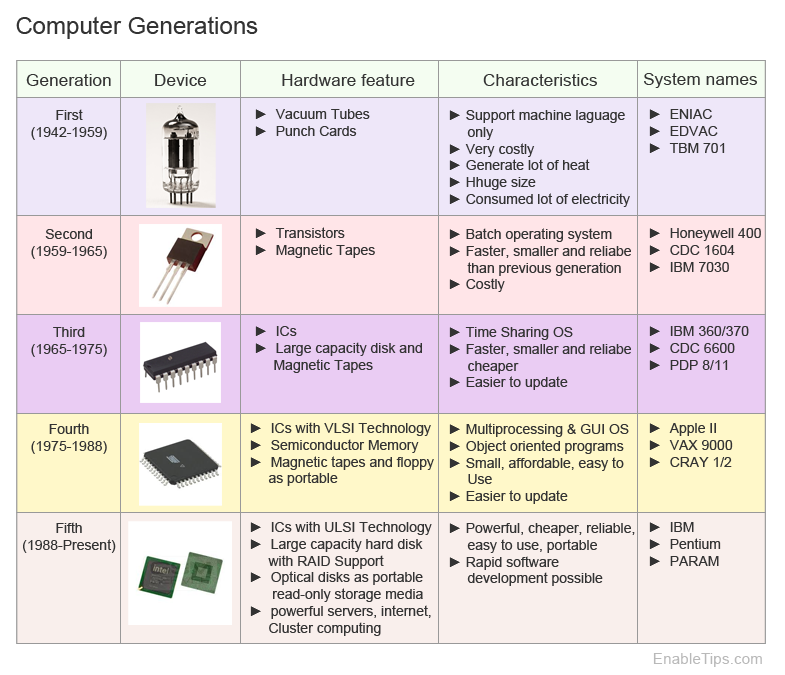 <a href="https://www.facebook.com/photo.php?fbid=358029574671575&set=a.402508171866862&id=100063230468379" target="_blank" style="position: absolute; top: 4px; right: 4px; font-size: 12px;">[src]</a> </div>

<!-- - <div style="position: relative; display: inline-block;"> 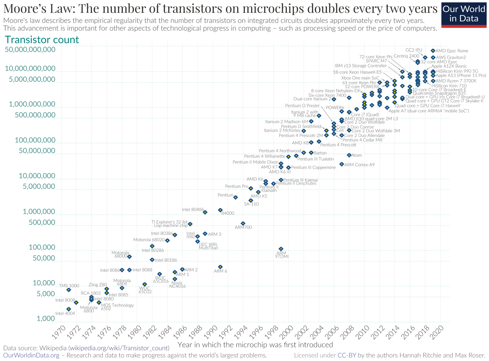 <a href="https://www.facebook.com/photo.php?fbid=358029574671575&set=a.402508171866862&id=100063230468379" target="_blank" style="position: absolute; bottom: -8px; right: 4px; font-size: 12px;">[src]</a> </div> -->

[Moore's Law]() drove successive waves of integration. [Moore (1965)](https://www.cs.utexas.edu/~fussell/courses/cs352h/papers/moore.pdf) observed that the number of transistors per IC doubled roughly every two years, an empirical trend that guided the semiconductor roadmap for five decades. Packing more transistors would ordinarily raise power and heat, yet [Dennard scaling]() (1974) held that as a transistor shrank, its voltage and current fell in step, so power per unit area stayed roughly constant. Moore's rising count and Dennard's constant power density together let [clock speed]() (the rate the CPU steps, one cycle per tick, in Hz) and performance climb for three decades within a fixed thermal budget.

As that density grew, an entire CPU came to fit on one chip, the [microprocessor](). The Intel 4004 (1971) was the first commercial one, packing 2,300 transistors into a 4-bit CPU on a 12 mm² die, originally commissioned by Busicom (i.e. the Japanese calculator maker). The IBM PC (1981), built with an open architecture and Intel's 8088 processor, standardised personal computing and spawned the clone ecosystem that persists today. In that model, the processor is one chip on a [motherboard](), connected to RAM, storage, I/O ports, and expansion slots through [buses]() and [chipsets](), each part separately upgradable. 

Clock speed plateaued at ~3-4 GHz around 2004 as Dennard scaling broke down. The industry turned to multiple cores at lower frequencies within the same power envelope, and to the [system on chip]() (SoC), a unified die holding core components and specialised accelerators (e.g. NPU<!-- for inference-->), so the board carries little more than power and connectors. Apple Silicon, for example, co-packages a 5 nm, 16-billion-transistor SoC (CPU cores, GPU cores, a Neural Engine) with LPDDR (one DRAM flavour, alongside desktop DDR, graphics GDDR, and stacked HBM) onto one substrate, a [system in package]() (SiP). Its memory model stays Von Neumann; such integration is a packaging matter<!-- not an architectural one-->.


SoC vs SiP, two levels of integration:

               System on Chip (SoC)         System in Package (SiP)
  unit         one die (single silicon)     one package (multiple dies)
  integrates   CPU, GPU, controllers, and   separate dies wired through a
               accelerators, fabricated     shared substrate / interposer
               together on one die
  made by      fabrication (one process)    packaging (post-fab assembly)

M1: the SoC is a single 5 nm die of 16 billion transistors (CPU, GPU, Neural
Engine); co-packaged with separate LPDDR DRAM dies onto one substrate, the
whole module is a SiP. The DRAM is a neighbour in the package, not on the die.


- <div style="display: inline-block;"> <div style="position: relative; display: inline-block;"> 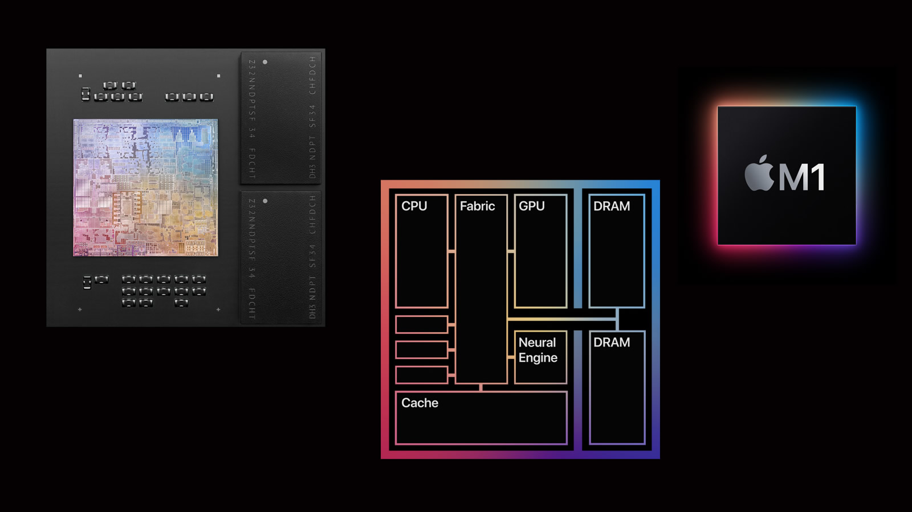 <a href="https://www.myapheus.com/2020/11/the-new-apple-m1-processor-set-to-change-everything/" target="_blank" style="position: absolute; bottom: -8px; right: 4px; color: white; font-size: 12px;">[src]</a> </div> <div style="font-size: 12px; color: #888; margin-top: 8px;">The Apple M1's unified memory: two LPDDR DRAM packages flank the SoC die (left), and CPU, GPU, and Neural Engine share that one DRAM pool through the fabric and a system-level cache (right).</div> </div>

- <div style="display: inline-block;"> <div style="position: relative; display: inline-block;"> 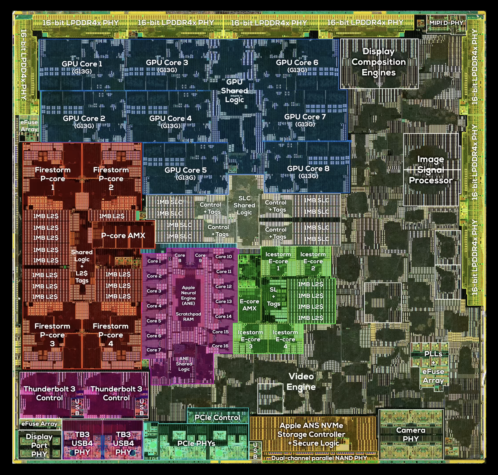 <a href="https://www.youtube.com/watch?v=mHEWMiHgyU8" target="_blank" style="position: absolute; bottom: -8px; right: 4px; color: white; font-size: 12px;">[src]</a> </div> <div style="font-size: 12px; color: #888; margin-top: 8px;">The Apple M1 die (2020). Integrated on a single chip, its CPU cores are still ruled by the Von Neumann architecture.</div> </div>

<!-- - <div style="position: relative; display: inline-block;">  <a href="https://www.refsmmat.com/courses/751/notes/index.html" target="_blank" style="position: absolute; bottom: -8px; right: 4px; font-size: 12px;">[src]</a> </div> -->

### **1.2. Central Processing Unit**

<p style="margin-bottom: 12px;"> </p>

<!-- Arc of 1.2, an instruction = opcode + operands:
  p1-3  the ISA (the contract): the three-layer frame, then CISC vs RISC
  p4-6  the Von Neumann machine: registers, the fetch-decode-execute cycle and opcode/operand, then addressing and representation
  p7-9  making it fast: iron law (CPI is the lever), then ILP (pipelining, OoO), then speculation and the multicore wall
  Spine: contract -> machine -> performance. -->

A [central processing unit]() (CPU) is in essence an implementation of an [instruction set architecture](https://namu.wiki/w/%EB%AA%85%EB%A0%B9%EC%96%B4%20%EC%A7%91%ED%95%A9) (ISA), the software-facing interface which specifies the operations, the registers they act on, and the addressing modes that name their operands. The [microarchitecture]() realises the interface in a particular processor through dedicated execution units, including an arithmetic logic unit (ALU)<!-- for integer and bitwise logic -->, a floating-point unit (FPU)<!-- for IEEE 754 arithmetic -->, and a control unit (CU)<!-- that sequences and routes between them -->. Different realisations differ in performance, yet a single compiled binary runs unaltered on all (e.g. x86-64: Intel vs AMD). [Fabrication]() materialises the design in silicon, in-house (e.g. Intel) or at a foundry (e.g. TSMC, Samsung).


ISA and fabrication are bought in; the microarchitecture is Apple's own.

Layer              | M1                        | Apple's relationship
-------------------|---------------------------|--------------------------------
ISA                | ARM64 (from ARM Holdings)  | licenses (architecture licence)
Microarchitecture  | Firestorm/Icestorm cores   | designs in-house
Fabrication        | TSMC, 5 nm                 | pays to manufacture

The ISA is the seam between software (which targets it) and hardware (which honours it)
Everything above the ISA produces instructions; everything below executes them:

           +-----------+  +-----------------------------------+
           | Compiler  |  |            Application             |
           +-----------+  +-----------------------------------+
  SOFTWARE +-----------+  +-----------------------------------+
  (targets | Assembler |  |         Operating System          |
   the ISA)+-----------+--+----------+-----------+------------+
           |  Linker   |  Loader  | Scheduler | Device Drivers |
    ^      +-----------+----------+-----------+----------------+
    |      ==================================================
   ISA     || Instruction Set Architecture (S/H interface) ||
    |      ==================================================
    v      +-------------------+------------+---------------+
           |     Processor     |   Memory   |   I/O System  |
  HARDWARE +-------------------+------------+---------------+
  (honours |          Datapath & Control Design             |
   the ISA)+------------------------------------------------+
           |               Digital Logic Design             |
           +------------------------------------------------+
           |                  Circuit Design                |
           +------------------------------------------------+
           |            Physical (IC Layout) Design         |
           +------------------------------------------------+

One instruction, ADD R1, R2, R3 ("R1 = R2 + R3"; both x86 and ARM have ADD), down the stack:

Layer             | Role                | For ADD R1, R2, R3
------------------|---------------------|-----------------------------------------------
Compiler          | lowers source code  | turns a = b + c into ADD, allocating R1/R2/R3
Assembler         | encodes the mnemonic| turns the ADD R1, R2, R3 text into its binary word
ISA               | the contract        | defines what ADD means and its bit-encoding, no more
Microarchitecture | implements it       | routes R2, R3 through an ALU adder in some pipeline
Physical          | becomes silicon     | the transistors of that carry-lookahead adder, at 5 nm

Same binary runs on Zen and Firestorm because both honour the identical ISA contract.


The two dominant ISA families reflect a fundamental trade-off between instruction density and simplicity. Intel's [x86]() (1978) exemplifies [complex instruction set computer]() (CISC), whose instructions vary in length, operate directly on memory, and admit various addressing modes. The set has grown past 1,500 instructions, none of which backwards compatibility permits removing, and the richness is billed to the microarchitecture. Variable length forces a bytewise scan for instruction boundaries, and hence x86 CPUs spend substantial die area on front-end decoders that crack instructions into fixed-width micro-ops ($\mu$ops), a RISC-like core behind a CISC interface.<!-- IBM required Intel to second-source the 8086 for the IBM PC, thus Intel licensed x86 to AMD. Both companies now implement x86-64, the 64-bit extension AMD designed in 2003 after Intel's own [Itanium]() (IA-64) failed in the market. -->

[Acorn RISC Machine]() (ARM, 1985) inverted the trade-off with [reduced instruction set computer]() (RISC), whose ~350 instructions span a fixed 4 bytes, access memory only through explicit loads and stores<!-- a load-store architecture -->, and retain operands in a large register file. Absent the bytewise scan, decode is simpler, pipelines shorter, and power per instruction lower<!-- ; Apple's move from x86 to ARM (M1-M4) is the proof -->.<!-- and in servers AWS [Graviton]() (2018) and Ampere [Altra]() deliver competitive throughput at lower power per rack unit. --> RISC does not remove the complexity but relocates it onto the compiler (§602#2.1), which schedules instructions and allocates registers such that several simple operations replace one CISC instruction. [RISC-V]() (2010), royalty-free<!-- released by UC Berkeley -->, advances the philosophy with a minimal base<!-- integer --> ISA (~47 instructions) and optional extensions.

- <div style="display: inline-block;"> <div style="position: relative; display: inline-block;"> 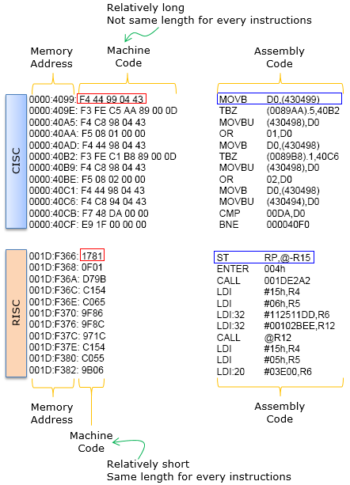 <a href="https://www.sharetechnote.com/html/EmbeddedSystem_CISC_RISC.html" target="_blank" style="position: absolute; bottom: -8px; right: 4px; font-size: 12px;">[src]</a> </div> <div style="font-size: 12px; color: #888; margin-top: 8px;">One CISC multiply works directly on memory, its encoding the five hex bytes F4 44 99 04 43 (variable, 1-15); RISC spells it out as load, multiply, store in fixed 4-byte instructions.</div> </div>

A CPU holds its operands and control state in [registers](), its fastest, on-chip storage. These typically include an instruction register (IR)<!-- holds the fetched instruction -->, a program counter (PC)<!-- next-instruction address -->, a stack pointer (SP)<!-- call-stack top -->, and general-purpose registers (GPRs)<!-- operands --><!-- also a flags register for ALU condition bits (zero, carry, overflow), and SIMD registers for vectors -->. Thus, as a consequence of the stored-program model, the CPU repeats the [fetch-decode-execute]() cycle: it fetches the instruction at the PC into the IR $\to$ decodes it $\to$ executes on the appropriate unit $\to$ writes the result back to a register, then steps the PC. Each instruction pairs the [opcode]() (i.e. operation) with [operands]() (i.e. the data it acts on), and the decoder splits them so the opcode drives the CU while the operands feed the ALU or FPU.

A CPU's [word size]() is its natural unit of data, the width of the ALU and data path in bits, which the GPRs match. The same $N$ bits also form a memory address such that the CPU reaches at most $2^N$ bytes off-chip (e.g. $2^{32}$ = 4 GB). This memory is [byte-addressable](), its smallest unit one byte (i.e. 8 bits), yet neither its reach nor its granularity holds exactly in practice, since a design wires fewer address bits<!-- than the word size--> (e.g. x86-64 pairs 64-bit words with 48-bit virtual addr.) and the OS allocates in coarser 4 KB pages (§603#3.2)<!-- a full 64-bit space would need impractically large page tables -->. Addresses are written in [hexadecimal]() (base-16, <!--prefixed 0x, -->e.g. 0x7ffe), where each digit encodes 4 bits, so a byte is two digits whose bit pattern reads off more directly.


From bits to stored bytes: int x = 42

  1. value    42
  2. binary   0000 0000  0000 0000  0000 0000  0010 1010   (32-bit int)
  3. hex      group each 4 bits into 1 digit  ->  0x0000002A

                last byte  0010 1010
                            |    |
                            2    A            (0010=2, 1010=10=A)
                0x2A = 2*16 + 10 = 42

  4. bytes    split into 4 bytes              ->  00 00 00 2A

>
Stored little-endian (least-significant byte at the lowest address):

Address:  0x0000  0x0001  0x0002  0x0003  |  0x0004  0x0005  0x0006  0x0007
Content:  [ 2A ]  [ 00 ]  [ 00 ]  [ 00 ]  |  [ 44 ]  [ 61 ]  [ 74 ]  [ 61 ]
          |==== int x = 42 ====|         |  |=== char s[4] = "Data" ===|
           2A first (little-endian)         'D'     'a'     't'     'a'   (ASCII)

Each address names 1 byte (8 bits); a multi-byte value spans consecutive
addresses. Hex is only notation: 4 bits = 1 digit, so 1 byte = 2 digits.

>
Four granularities, each owned by a different layer (don't conflate):

  byte        1 B      addressing unit         CPU
  word        8 B      compute/pointer width   CPU  (= 64 bits)
  cache line  64 B     RAM<->cache transfer    hardware  (= 8 words)
  page        4 KB     allocation / mapping    OS (§603)


What the bits denote is fixed by convention. Unsigned integers read $N$ bits as base-2; [two's complement]() encodes a signed $-x$ as $2^N - x$, so a single adder serves both, with range $[-2^{N-1}, 2^{N-1}-1]$ and overflow modulo $2^N$ (§602#1.2). [IEEE 754]() (1985) splits a float into a sign, a biased exponent, and a mantissa<!-- valued (-1)^s × 1.m × 2^(e-bias) for normals; subnormals use 0.m × 2^(1-bias) for gradual underflow; an all-ones exponent encodes ±∞ and NaN -->, {1, 8, 23} bits for FP32, while BF16 retains the 8 exponent bits as {1, 8, 7} to trade precision for range. A multi-byte value occupies consecutive addresses, and [endianness]() fixes their order; [little-endian]() (x86, ARM) places the least significant byte first, a machine-local convention that serialisation must neutralise on the wire (§605#4.1).


 The nuance worth keeping straight:

  - Bit = the physical thing actually stored (a charge/voltage). Data ultimately is bits.
  - Byte = the smallest addressable grouping (8 bits). Since you can't hand out an address finer than a byte, every stored item occupies at least one whole byte, rounded up. A single boolean (1 bit of real information) still consumes a full byte in memory.

>
Type widths (bytes = bits / 8); every value is a whole number of bytes:

  char                   1 B     8 bits
  short                  2 B     16
  int / float            4 B     32
  long / double / ptr    8 B     64    (= word size)
  long double           16 B     80 used, padded to 128  (x86 extended)
  __int128 / IEEE quad  16 B     128
  SIMD vector (ZMM)     64 B     512   (AVX-512; holds many values, not one)

Largest scalar the ALU handles in one op = the 8-byte word. Wider types (128-bit, SIMD) split across words or use dedicated wide registers. A data structure has no fixed max: it composes these atoms and is bounded only by the address space (2^48 virtual on x86-64), not a type width.

 
- <div style="display: inline-block;"> <div style="position: relative; display: inline-block;">  <a href="https://faculty.washington.edu/gmobus/Academics/TCSS372/Notes/crash1.html" target="_blank" style="position: absolute; bottom: -8px; right: 4px; font-size: 12px;">[src]</a> </div> <div style="font-size: 12px; color: #888; margin-top: 8px;">A minimal 4-bit CPU. The 16 opcodes on the right are its entire ISA, wired into the decoder; the registers and data path on the left are its microarchitecture. Each cycle, the instruction pointer (IP) selects one of the 16 memory cells, and its 8-bit instruction, a 4-bit opcode plus a 4-bit operand address ($2^4$ each), crosses the data path into the IR for decoding.</div> </div>

With the clock stalled at a few GHz, a faster chip can no longer come from a faster clock, and the [iron law]() (Emer & Clark, 1984) shows what remains, factoring execution time as $\text{time} = \text{instructions} \times \text{CPI} \times \text{cycle time}$. Two of the three terms lie beyond the microarchitecture's control. The instruction count is settled by the ISA and compiler, the stake CISC and RISC divide over, and the cycle time by the now-capped clock. That leaves [cycles per instruction]() (CPI), the average cycles an instruction takes, as the one lever the microarchitecture can pull, and every technique that follows drives CPI down.

[Pipelining]() overlaps the stages, so once it fills one instruction retires per cycle rather than one per $k$ cycles for a $k$-stage pipeline, and CPI approaches 1, while a [superscalar]() core issues several per cycle across duplicated units to push it below 1. [Out-of-order execution](), first realised in [Tomasulo's algorithm (1967)](), keeps the pipeline fed by dispatching ready instructions regardless of program order. [Register renaming]() makes this safe by mapping the ISA's handful of architectural registers onto a larger physical file, so a reused name raises no false dependency, and [reservation stations]() hold each instruction until its operands arrive.

[Branch prediction]() guesses the direction of conditional branches (95-99% accuracy, 10-20 cycle penalty on misprediction), and [speculative execution]() runs past the unresolved branch and discards the work on a wrong guess. That speculative state is architecturally invisible yet leaves microarchitectural traces in the cache, the side channel the [Meltdown & Spectre (2018)](https://meltdownattack.com/) vulnerabilities exploited. Such tricks extract [instruction-level parallelism]() from one stream, but the returns diminish, which is why the clock plateau pushed the industry towards multiple cores and explicit parallelism (§604).

- <div style="display: inline-block;"> <div style="position: relative; display: inline-block;"> 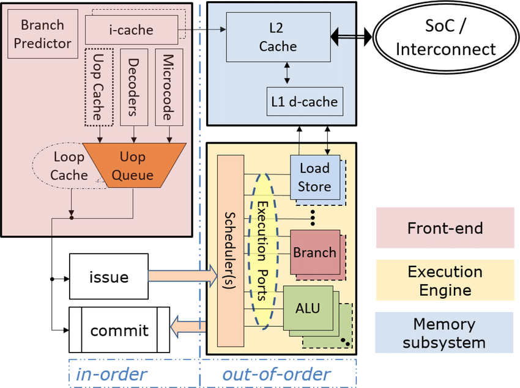 <a href="https://www.researchgate.net/figure/Abstraction-of-processor-core-microarchitecture_fig3_338028324" target="_blank" style="position: absolute; bottom: -8px; right: 4px; font-size: 12px;">[src]</a> </div> <div style="font-size: 12px; color: #888; margin-top: 8px;">An abstracted core: the in-order front-end fetches and decodes instructions into $\mu$ops, the out-of-order execution engine schedules them across its ports, and the memory subsystem feeds both.</div> </div>

<!-- - <div style="display: inline-block;"> <div style="position: relative; display: inline-block;"> 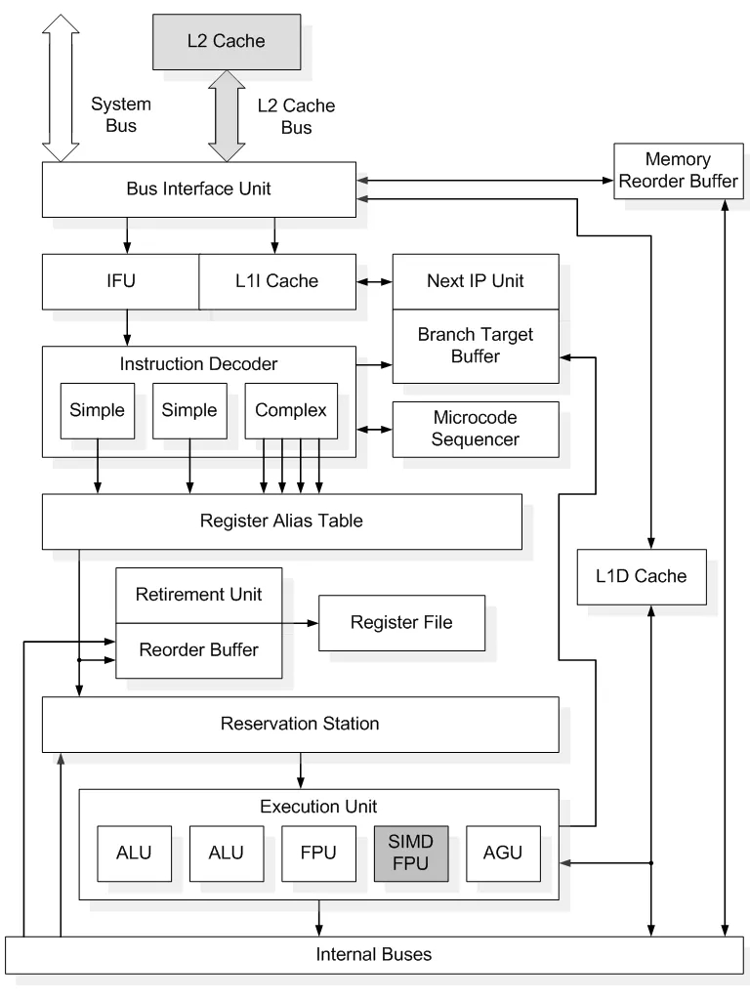 <a href="https://en.namu.wiki/w/%EC%9D%B8%ED%85%94%20P6%20%EB%A7%88%EC%9D%B4%ED%81%AC%EB%A1%9C%EC%95%84%ED%82%A4%ED%85%8D%EC%B2%98" target="_blank" style="position: absolute; top: 4px; right: 4px; font-size: 12px;">[src]</a> </div> <div style="font-size: 12px; color: #888; margin-top: 8px;">Intel's P6 core: decoders crack x86 into $\mu$ops, the register alias table renames, reservation stations dispatch out of order, and the reorder buffer retires in order.</div> </div> -->

<!-- - <div style="position: relative; display: inline-block;"> 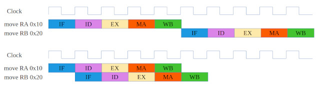 <a href="https://simplecpudesign.com/simple_cpu_v4/index.html" target="_blank" style="position: absolute; bottom: -8px; right: 4px; font-size: 12px;">[src]</a> </div> -->

### **1.3. Volatile Memory**

<p style="margin-bottom: 12px;"> </p>

Registers are fast but scarce (a few KB per core), so computer memory forms a [hierarchy](), where each level down accepts roughly an order of magnitude more latency in exchange for capacity at lower cost per byte. A [cache hierarchy]() of L1 (~1 ns, 32-64 KB per core), L2 (~3-10 ns, 256 KB-2 MB), and L3 (~10-20 ns, tens of MB shared) is built from [static RAM]() (SRAM), whose cell spends ~6 transistors per bit yet holds it as long as power lasts. L1 alone splits into separate instruction and data caches (a [modified Harvard]() arrangement), while L2, L3, and main memory remain unified, so the model above the split stays Von Neumann. 

When multiple cores cache the same physical address, one core's write can desync the others. [Cache coherence]() protocols keep them aligned by broadcasting updates. The [MESI protocol]() assigns each cache line one of four states: {Modified, Exclusive, Shared, Invalid} and uses [bus snooping]() or directory-based schemes to maintain coherence. [False sharing]() occurs when unrelated data on the same cache line causes coherence traffic between cores. The overhead scales with core count, so coherence becomes a limiting factor in shared-memory parallelism (§604#2.3).

- <div style="display: inline-block;"> <div style="position: relative; display: inline-block;"> 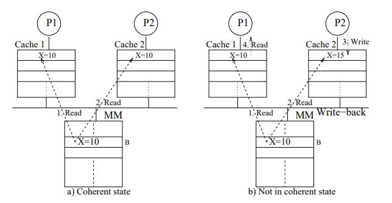 <a href="https://www.naukri.com/code360/library/cache-coherence" target="_blank" style="position: absolute; bottom: -8px; right: 4px; font-size: 12px;">[src]</a> </div> <div style="font-size: 12px; color: #888; margin-top: 8px;">P2's write to X leaves P1's cached copy stale, the incoherence that MESI exists to prevent.</div> </div>
 
[Virtual memory]() interposes a translation layer between the addresses a program issues and physical RAM, so each program names a large, contiguous space of its own without regard to where its data physically resides. Both the virtual space and physical RAM divide into fixed-size [pages]() and frames (typically 4 KB), and every virtual address splits into a page number and an offset, of which only the page number is translated. The [memory management unit]() (MMU) maps each virtual page to a physical frame through a per-process [page table](), then concatenates the untouched offset to form the physical address. Because that table itself resides in memory, the [translation lookaside buffer]() (TLB), a small SRAM cache of recent mappings, answers the common case in one or two cycles, so most accesses bypass the table entirely.

A [TLB miss]() sends the MMU to walk the page table in hardware, four dependent memory reads on x86-64's four-level structure, after which it caches the mapping for reuse. The cost of a single reference thus spans orders of magnitude, roughly one cycle on a TLB hit, a few hundred on a walk, and millions on a [page fault](). A page fault arises when translation cannot complete, most commonly because the page resides on disk rather than in a physical frame, whereupon the CPU traps to the OS kernel, which fetches the page and restarts the instruction. Everything up to the trap is hardware mechanism, whereas which frame to evict, how to isolate processes, and whether to overcommit are policy the OS sets (§603#3.2).

- <div style="position: relative; display: inline-block;"> 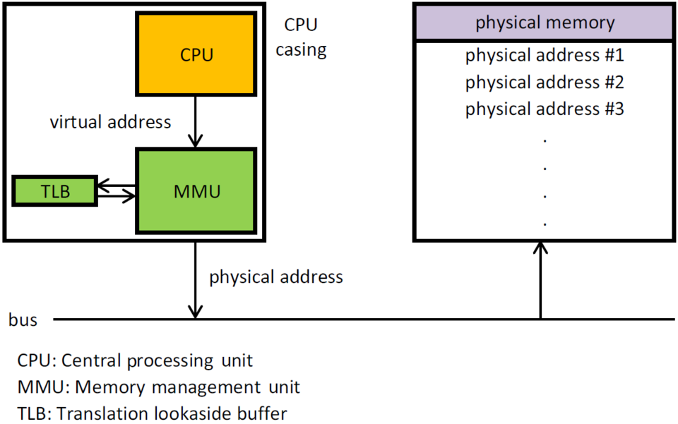 <a href="https://en.wikipedia.org/wiki/Memory_management_unit" target="_blank" style="position: absolute; bottom: -8px; right: 4px; font-size: 12px;">[src]</a> </div> 
Off-chip main memory uses [dynamic RAM]() (DRAM), which stores each bit in a single transistor plus capacitor, far denser and cheaper but slower (~50-100 ns), and *dynamic* because the capacitor leaks, so every bit must be refreshed every ~64 ms. Data moves between levels in [cache lines]() (typically 64 bytes), and a well-designed program achieves high temporal and spatial [locality](), i.e. it re-references an address within a short window and references addresses within one cache line, to minimise [cache misses]() that cascade through successively slower levels.<!--The gap between processor speed and memory speed continues to widen, the phenomenon [Wulf and McKee (1995)](https://dl.acm.org/doi/10.1145/216585.216588) named the [memory wall]().-->
 
DRAM packs its density into [banks](), each a grid of rows and columns of 1T1C cells. Reaching a byte first activates its entire row into a [row buffer]() (the row access, RAS), then selects one column from it (the column access, CAS). A later access to the same row, a [row hit](), reads straight from the buffer and is fast; a different row, a [row conflict](), must precharge and re-activate at far higher cost. Spatial locality therefore pays twice, a cache-line fill above and a row-buffer hit below, so sequential access outruns random at every level of the hierarchy. Scanning a row-major matrix with its contiguous index innermost (*for i: for j: A[i][j]*) runs several times faster than the swapped order, which strides a full row per step and misses in both the cache and the row buffer. Volatile throughout, both SRAM and DRAM forget on power loss; what survives the cut is persistent storage.

<!--
============================
DIAGRAM 1: Cache Hierarchy
============================

DRAM (100 cells, 10 per row)

Physical grid:
         col0  col1  col2  col3  col4  col5  col6  col7  col8  col9
row 0  [  0  |  1  |  2  |  3  |  4  |  5  |  6  |  7  |  8  |  9  ]
row 1  [ 10  | 11  | 12  | 13  | 14  | 15  | 16  | 17  | 18  | 19  ]
row 2  [ 20  | 21  | 22  | 23  | 24  | 25  | 26  | 27  | 28  | 29  ]
row 3  [ 30  | 31  | 32  | 33  | 34  | 35  | 36  | 37  | 38  | 39  ]
row 4  [ 40  | 41  | 42  | 43  | 44  | 45  | 46  | 47  | 48  | 49  ]
  ...

CPU sees flat addresses: [ 0 | 1 | 2 | ... | 37 | ... | 98 | 99 ]

Core 0                              Core 1
┌──────────────────────────┐        ┌──────────────────────────┐
│ L1 Cache (2 lines, ~1ns) │        │ L1 Cache (2 lines, ~1ns) │
│ ┌────────────────────┐   │        │ ┌────────────────────┐   │
│ │ Line 0: 0-9        │   │        │ │ Line 0: (empty)    │   │
│ │ Line 1: (empty)    │   │        │ │ Line 1: (empty)    │   │
│ └────────────────────┘   │        │ └────────────────────┘   │
│                          │        │                          │
│ L2 Cache (4 lines, ~5ns) │        │ L2 Cache (4 lines, ~5ns) │
│ ┌────────────────────┐   │        │ ┌────────────────────┐   │
│ │ Line 0: 0-9        │   │        │ │ Line 0: (empty)    │   │
│ │ Line 1: 10-19      │   │        │ │ Line 1: (empty)    │   │
│ │ Line 2: (empty)    │   │        │ │ Line 2: (empty)    │   │
│ │ Line 3: (empty)    │   │        │ │ Line 3: (empty)    │   │
│ └────────────────────┘   │        │ └────────────────────┘   │
└──────────────────────────┘        └──────────────────────────┘
             │                                   │
             └──────────────┬────────────────────┘
                            │
              ┌─────────────┴─────────────┐
              │ L3 Cache (8 lines, ~15ns) │  shared
              │ ┌───────────────────────┐ │
              │ │ Line 0: 0-9           │ │
              │ │ Line 1: 10-19         │ │
              │ │ Line 2: 40-49         │ │
              │ │ Line 3: (empty)       │ │
              │ │ ...                   │ │
              │ └───────────────────────┘ │
              └─────────────┬─────────────┘
                            │
                    ┌───────┴───────┐
                    │  DRAM (~100ns)│
                    │  0-99         │
                    └───────────────┘

Core 0 requests address 37:
  1. L1 check → Line 0 has 0-9, Line 1 empty → MISS
  2. L2 check → Lines have 0-9, 10-19 → MISS
  3. L3 check → Lines have 0-9, 10-19, 40-49 → MISS
  4. DRAM fetch → controller decodes 37 → row 3, col 7
     → loads 30-39 into L3, L2, and L1 (~100ns)
  5. Next access to 38 → L1 HIT (~1ns, spatial locality)
  6. Access to 5       → L1 HIT (~1ns, already cached)
  7. Access to 72      → L1 MISS → L2 MISS → L3 MISS → DRAM (~100ns)

On a miss, data is loaded into all levels on the way back
(DRAM → L3 → L2 → L1). L1/L2 are per-core, L3 is shared.
The cache doesn't know about DRAM rows — it caches contiguous
address ranges. The 2D grid is invisible to the cache.

============================
DIAGRAM 2: malloc → Virtual → Physical → DRAM
============================

What each layer sees when a program calls malloc(4):

  PROGRAM        malloc(4) → virtual addr 0x4003
                 sees: [ 0x4003 | 0x4004 | 0x4005 | 0x4006 ]
                        contiguous bytes, no idea where they are
                            │
  OS KERNEL      page table: virtual 0x4xxx → physical frame 3
                 sees: pages (4 KB chunks), maps virtual → physical
                            │
  HARDWARE       physical addr 27 → row 3, col 3
                 sees: row/column grid, activates rows, selects columns

  DRAM chip (simplified: 8 rows × 8 columns = 64 cells, each cell = 1 byte)

              col0   col1   col2   col3   col4   col5   col6   col7
         ┌──────┬──────┬──────┬──────┬──────┬──────┬──────┬──────┐
  row 0  │  00  │  01  │  02  │  03  │  04  │  05  │  06  │  07  │
         ├──────┼──────┼──────┼──────┼──────┼──────┼──────┼──────┤
  row 1  │  08  │  09  │  10  │  11  │  12  │  13  │  14  │  15  │
         ├──────┼──────┼──────┼──────┼──────┼──────┼──────┼──────┤
  row 2  │  16  │  17  │  18  │  19  │  20  │  21  │  22  │  23  │
         ├──────┼──────┼──────┼──────┼──────┼──────┼──────┼──────┤
  row 3  │  24  │  25  │  26  │ [27] │ [28] │ [29] │ [30] │  31  │
         ├──────┼──────┼──────┼──────┼──────┼──────┼──────┼──────┤
  row 4  │  32  │  33  │  34  │  35  │  36  │  37  │  38  │  39  │
         ├──────┼──────┼──────┼──────┼──────┼──────┼──────┼──────┤
  row 5  │  40  │  41  │  42  │  43  │  44  │  45  │  46  │  47  │
         ├──────┼──────┼──────┼──────┼──────┼──────┼──────┼──────┤
  row 6  │  48  │  49  │  50  │  51  │  52  │  53  │  54  │  55  │
         ├──────┼──────┼──────┼──────┼──────┼──────┼──────┼──────┤
  row 7  │  56  │  57  │  58  │  59  │  60  │  61  │  62  │  63  │
         └──────┴──────┴──────┴──────┴──────┴──────┴──────┴──────┘

                                 [27] [28] [29] [30] = int x = 42

  How DRAM reads address 27:
    1. activate row 3     → entire row loads into row buffer
       row buffer: [ 24 | 25 | 26 | 27 | 28 | 29 | 30 | 31 ]
    2. select col 3       → read byte 27
    3. row stays open     → cols 4,5,6 (bytes 28,29,30) are fast (same row)
                            this is why sequential access is fast

  Each layer's "contiguous" might not be contiguous in the layer below.
  Two adjacent virtual pages could map to distant physical frames,
  which could sit on different DRAM rows.
--> 

- <div style="position: relative; display: inline-block;"> 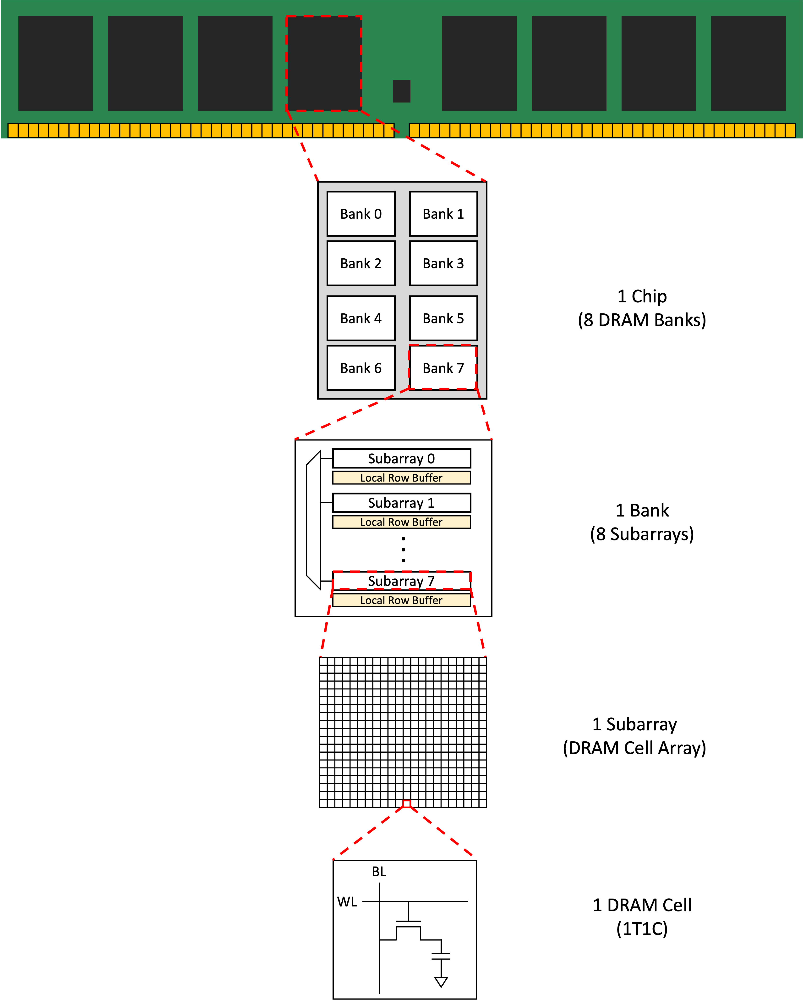 <a href="https://mean9park.github.io/DRAM_Operation/" target="_blank" style="position: absolute; bottom: -8px; right: 4px; font-size: 12px;">[src]</a> </div>

 
### **1.4. Persistent Storage**

<p style="margin-bottom: 12px;"> </p>

Persistent storage retains data without power. [Hard disk drives]() (HDDs) store data magnetically on spinning [platters]() with read/write [heads]() on an actuator arm. Performance is dominated by mechanical delays: [seek time]() (~10 ms average) for the head to reach the correct track, and [rotational latency]() (half the rotation period, ~4.2 ms at 7,200 RPM) for the desired sector to pass under the head. Sequential throughput reaches 100-200 MB/s, but random access is severely limited by these physical movements. By the 2010s, driven by falling NAND prices and Intel's early consumer SSDs, SSDs had largely replaced HDDs for primary storage.

[Solid-state drives]() (SSDs) use [NAND flash]() memory, where each cell is a transistor with an electrically isolated [floating gate](). Cells are organised into [pages]() (~4-16 KB, the unit of read/write) and [blocks]() (256-512 pages, the unit of erase). This asymmetry, where data is programmed at page level but erased at block level, necessitates [garbage collection]() (relocating valid pages from partially-stale blocks, then erasing them) and the [TRIM]() command (letting the OS notify the SSD when files are deleted). Each cell has a limited number of program/erase cycles (1K-100K, fewer as more bits are packed per cell), so [wear leveling]() distributes writes evenly across the device.

- <div style="position: relative; display: inline-block;">  <a href="https://www.backblaze.com/blog/ssd-vs-hdd-future-of-storage/" target="_blank" style="position: absolute; bottom: -8px; right: 4px; font-size: 12px;">[src]</a> </div>

## II
---

### **2.1. Graphics Processing Unit**

<p style="margin-bottom: 12px;"> </p>

[Flynn's taxonomy]() classifies processor architectures by instruction and data streams. A single-core CPU is [SISD]() (Single Instruction, Single Data), while multi-core CPUs operate as [MIMD]() (Multiple Instruction, Multiple Data). [SIMD]() (Single Instruction, Multiple Data) extends a single core with vector units (e.g. SSE, AVX) that apply one instruction to multiple data elements simultaneously. GPUs take this further with [SIMT](), essentially SIMD combined with multithreading, where groups of threads (warps in CUDA, wavefronts in AMD) execute the same instruction in lockstep on different data.

Early GPUs were fixed-function hardware for graphics rendering, hardwiring vertex transformation, lighting, rasterisation, and texturing with no programmability. NVIDIA's [GeForce 256](https://en.wikipedia.org/wiki/GeForce_256) (1999), marketed as the world's first GPU, moved hardware transform and lighting onto the graphics card but kept the pipeline fixed. Programmable [shaders]() arrived with the [GeForce 3]() (2001), and the decisive shift came with the [Tesla]() microarchitecture (2006) whose [GeForce 8800 GTX]() was the first GPU with unified shaders, merging vertex and pixel processors into general-purpose streaming processors so that no fixed-function stage sat idle when another was saturated (128 SPs across 16 SMs, 681M transistors on 90 nm).

[Compute unified device architecture]() (CUDA), released in 2006, made GPUs programmable for general-purpose computing by providing a C-based programming model that abstracted away graphics concepts. That is, general-purpose GPU required abusing graphics APIs which expressed computations as texture operations in [OpenGL shading language]() (GLSL) or [C for graphics]() (Cg). Matrix operations exhibit data parallelism that maps naturally onto GPU hardware, and CUDA's ecosystem would later prove decisive for the deep learning revolution (§602#2.2 examines its compiler).

A [discrete GPU]() (dGPU) sits on a separate PCIe card with its own dedicated VRAM (e.g. NVIDIA A100, 80 GB HBM2e), while an [integrated GPU]() (iGPU) shares the die and main memory with the CPU (e.g. Apple Silicon). iGPUs are power-efficient but lack the memory bandwidth and compute density of discrete cards. ML frameworks (PyTorch, JAX) abstract the hardware behind device backend APIs, e.g. *torch.device("cuda \| mps \| cpu")*, dispatching kernels and memory allocation to the appropriate driver. CUDA's mature toolchain (cuDNN, cuBLAS, NCCL, TensorRT) gives NVIDIA a dominant position in production ML.

- <div style="position: relative; display: inline-block;">  <a href="https://blog.paperspace.com/a-complete-anatomy-of-a-graphics-card-case-study-of-the-nvidia-a100/" target="_blank" style="position: absolute; bottom: -8px; right: 4px; font-size: 12px;">[src]</a> </div>
GPU compute performance is measured in [floating-point operations per second]() (FLOPS). Peak FLOPS depends on core count, clock speed, and precision format, with lower precision yielding higher throughput since more operations fit per cycle. For instance, A100 delivers 19.5 TFLOPS at FP32 and 312 TFLOPS at FP16 via tensor cores, while achieved FLOPS falls well below peak in practice due to memory stalls, warp divergence, low occupancy, and synchronisation overhead. Subsequently, [Model FLOPS utilisation]() (MFU), which is the ratio of achieved to theoretical peak, is the standard efficiency metric for training runs where 30-60% is typical at scale.

Notice that FLOPS and FLOPs, both looking like a twin, measure different things. FLOPS is a rate, counting floating-point operations completed per second, used in peak-performance claims as in "312 TFLOPS on the A100". [FLoating point OPerations]() (FLOPs) is a count measuring the total operations in a workload, used in ratios like arithmetic intensity (FLOPs/byte) or training budgets ($\sim 3.14 \times 10^{23}$ FLOPs for GPT-3). The two relate via "wallclock time" $\approx$ "total FLOPs" $/$ "effective FLOPS", so the same workload runs faster either by reducing its FLOPs (e.g. quantisation, sparsity) or by raising delivered FLOPS (e.g. better kernels, higher MFU).

<!-- | **Architecture** | **Year** | **AWS** | **Key Innovation** | -->
<!-- |---|---|---|---| -->
<!-- | Tesla | 2006 | - | Unified shaders; CUDA; 128 SPs (G80) | -->
<!-- | Fermi | 2010 | - | L1/L2 cache hierarchy; ECC memory; 512 CUDA cores | -->
<!-- | Kepler | 2012 | P2 (K80) | Dynamic Parallelism; Hyper-Q; SMX units | -->
<!-- | Maxwell | 2014 | G3 (M60) | Power efficiency; unified virtual memory | -->
<!-- | Pascal | 2016 | - | HBM2; NVLink 1.0; 16 nm FinFET; 3,840 CUDA cores (GP100) | -->
<!-- | Volta | 2017 | P3 (V100) | Tensor Cores; independent thread scheduling; 5,120 CUDA cores (V100) | -->
<!-- | Turing | 2018 | G4dn (T4) | RT Cores (ray tracing); 2nd-gen Tensor Cores | -->
<!-- | Ampere | 2020 | P4d (A100) | TF32/BF16/INT8/sparsity; 6,912 CUDA cores (A100); MIG | -->
<!-- | Hopper | 2022 | P5 (H100) | Transformer Engine (FP8); 4th-gen Tensor Cores; NVLink 4.0 | -->
<!-- | Blackwell | 2024 | P6 (B200) | 5th-gen Tensor Cores; NVLink 5.0 (1.8 TB/s); two-die design (208B transistors) | -->
<!-- | Rubin | 2026 | - | HBM4; next-gen NVLink; announced Computex 2024 | -->
<!---->

### **2.2. Streaming Multiprocessor**

<p style="margin-bottom: 12px;"> </p>

A GPU consists of [streaming multiprocessors]() (SMs), each a self-contained processing unit with its own register file, shared mem./L1 cache, warp schedulers, and execution units. The fundamental scheduling unit is a [warp](), a bundle of 32 threads executing the same instruction in lockstep, following the [SIMT](https://en.wikipedia.org/wiki/Single_instruction,_multiple_threads)  model. If threads within a warp take different branches ([warp divergence]()), the SM executes each path separately and wastes slots for inactive threads. Each SM runs multiple [warp schedulers]() that switch to a ready warp the moment one stalls on a memory access, hiding memory latency through parallelism (i.e. more threads) rather than large caches.

A [CUDA core]() is a scalar execution unit within an SM that performs one floating-point or integer operation per cycle per thread. They suit graphics and general parallel workloads but lack hardware for the dense [matrix multiply-accumulates]() (MMAs), which together with non-linear activation functions are the heart of deep learning. [Tensor cores](), introduced with [Volta]() in the Tesla V100 (2017), address this by performing a 4×4×4 [mixed-precision]() matrix multiply-accumulate (FP16 × FP16 → FP32), i.e. 64 multiply-adds per clock. These 640 tensor cores equipped in V100 can deliver 125 TFLOPS mixed-precision, an order of magnitude beyond its 15.7 TFLOPS FP32 CUDA throughput.

[Micikevicius et al. (2017)](https://arxiv.org/abs/1710.03740) showed that most forward and backward computations tolerate FP16 precision, with only weight updates requiring FP32 accuracy. Two techniques make this work: (i) maintaining an FP32 master copy of weights, and (ii) [loss scaling]() to preserve small gradients in FP16's limited range. PyTorch 1.6+ supports [automatic mixed precision]() (AMP) via *@torch.autocast* and *torch.GradScaler*, making this technique accessible with minimal code changes. Subsequent generations expanded tensor core support: the [Ampere](https://images.nvidia.com/aem-dam/en-zz/Solutions/data-center/nvidia-ampere-architecture-whitepaper.pdf) architecture in the A100 (2020) added [TF32](), [BF16](), INT8, and [structured sparsity]() (2:4 pattern, up to 2× speedup).

The [Hopper](https://resources.nvidia.com/en-us-hopper-architecture/nvidia-h100-tensor-c) architecture in the H100 (2022) introduced the [Transformer Engine](), hardware-software logic that dynamically chooses between FP8 and FP16/BF16 precision per layer during training, maximising throughput while preserving accuracy. The [Blackwell](https://resources.nvidia.com/en-us-blackwell-architecture) architecture in the B200 (2024) also added 5th-generation tensor cores with a 2nd-generation Transformer Engine. That is, GPU hardware co-evolved as transformer models scaled. Tensor cores shifted to transformer-optimised primitives, adding native support for attention, lower-precision formats (FP8, FP4), and on-chip precision management to match the compute patterns of modern LLMs.

- <div style="position: relative; display: inline-block;">  <a href="https://developer.nvidia.com/blog/nvidia-ampere-architecture-in-depth/" target="_blank" style="position: absolute; bottom: -8px; right: 4px; color: white; font-size: 12px;">[src]</a> </div>

### **2.3. GPU Memory**

<p style="margin-bottom: 12px;"> </p>

GPU memory forms a deep hierarchy: each SM has its own [register file]() (~256 KB on Volta) and [shared memory]() / L1 SRAM (48-164 KB), all SMs share an [L2 cache]() (40 MB on the A100), and off-chip [global memory]() (HBM/GDDR) holds the most capacity at 200-600 cycle latency. Software has evolved to mask transfers at each boundary of this hierarchy. DMA allows the GPU to read/write host memory without CPU involvement, but the DMA engine operates on physical addresses and cannot safely access [pageable]() host memory since the OS may swap it out. The CUDA driver therefore stages data via a [page-locked]() (pinned) buffer before initiating DMA. <!-- PyTorch's *DataLoader(..., pin_memory=True)* copies tensors into pinned memory during loading, so *.to(device, non_blocking=True)* can DMA directly to VRAM and overlap the transfer with computation (without pinning, *non_blocking* is silently ignored). -->

[High-bandwidth memory]() (HBM), commonly referred to as [VRAM](), achieves its performance through vertical stacking. Multiple DRAM dies interconnected by [through-silicon vias]() (TSVs) and mounted on a silicon interposer next to the GPU die. Each stack exposes a 1,024-bit interface at moderate clock speeds, opposite to GDDR's narrow buses at high clock speeds. Successive generations from SK Hynix and Samsung (HBM2 → HBM2e → HBM3 → HBM3e) pushed per-stack bandwidth from ~250 GB/s to ~1.2 TB/s, while the H100's five HBM3 stacks deliver 3.35 TB/s for 80 GB, and the H200 (HBM3e) reaches ~4.8 TB/s. Wider bus and lower power per bit make HBM the AI/HPC standard.

- <div style="position: relative; display: inline-block;">  <a href="https://news.skhynix.com/semiconductor-back-end-process-episode-4-packages-part-2/" target="_blank" style="position: absolute; bottom: -8px; right: 4px; font-size: 12px;">[src]</a> </div>

The [roofline model](https://en.wikipedia.org/wiki/Roofline_model) in [S Williams (2009)](https://people.eecs.berkeley.edu/~kubitron/cs252/handouts/papers/RooflineVyNoYellow.pdf) formalises attainable performance as $P = \min(P_{\text{peak}},\ I \times BW)$, where a kernel's [arithmetic intensity]() $I$ (FLOPs/byte moved from memory) places it under either the flat ceiling of peak FLOPS ([compute-bound]()) or the sloped bandwidth ceiling ([memory-bound]()), the two meeting at the ridge $I^* = P_{\text{peak}}/BW$. Modern GPUs push the ridge outward, with an H100 needing $989/3.35 \approx 300$ FLOPs/byte to saturate BF16 tensor cores, far above what most kernels reach. In their unfused implementations, attention $\mathrm{softmax}(QK^\top)V$, embeddings $E[i]$, and activations $\sigma(x_i)$ are memory-bound, while large matmuls $C = AB$ are compute-bound. [FlashAttention]() tiles $Q$/$K$/$V$ into shared memory blocks so that the $N \times N$ score matrix never materialises in HBM, converting a memory-bound operation into a compute-bound one.

- <div style="position: relative; display: inline-block;">  <a href="https://github.com/Dao-AILab/flash-attention" target="_blank" style="position: absolute; bottom: -8px; right: 4px; font-size: 12px;">[src]</a> </div>

### **2.4. Interconnect**

<p style="margin-bottom: 12px;"> </p>

PCIe is the standard system interconnect, with each generation (Gen) roughly doubling bandwidth, from Gen 1 (2003, ~4 GB/s ×16), Gen 2 (2007, ~8 GB/s), Gen 3 (2010, ~16 GB/s), Gen 4 (2017, ~32 GB/s), Gen 5 (2019, ~64 GB/s), to Gen 6 (2022, ~128 GB/s via PAM-4 modulation). A PCIe link aggregates full-duplex serial lanes (×1, ×4, ×8, ×16) with differential signalling, replacing the shared parallel PCI and [AGP]() buses of the early 2000s. Yet for multi-GPU HPC and AI workloads this is insufficient, as training large models exchanges gradients and activations<!-- KV caches are exchanged at inference (e.g. disaggregated prefill/decode serving), not during training --> at rates that saturate even Gen 5.

[NVLink](https://en.wikipedia.org/wiki/NVLink) (Pascal) is a GPU-to-GPU interconnect doubling per generation, from 1.0 (160 GB/s, P100), 2.0 (300 GB/s, V100), 3.0 (600 GB/s, A100), 4.0 (900 GB/s, H100), to 5.0 (1.8 TB/s, B200). [NVSwitch](https://en.wikipedia.org/wiki/NVSwitch) (Volta) is a switch chip giving all-to-all GPU links at full NVLink bandwidth, past point-to-point topology limits. [DGX](https://en.wikipedia.org/wiki/Nvidia_DGX) systems pack these into multi-GPU servers (e.g. DGX H100 with 8× H100), while the GB200 NVL72 wires 72 Blackwell GPUs at 1.8 TB/s into a rack-scale node. The [nvidia collective communications library](https://github.com/NVIDIA/nccl) (NCCL) implements topology-aware all-reduce, all-gather, and broadcast primitives, the backbone of distributed training in PyTorch and JAX.

For cluster-level communication, [InfiniBand](https://en.wikipedia.org/wiki/InfiniBand), a switched fabric for HPC and AI clusters, provides [remote DMA](https://en.wikipedia.org/wiki/Remote_direct_memory_access) (RDMA), enabling zero-copy transfer at sub-$\mu\mathrm{s}$ latency by bypassing the kernel socket path that ordinary network I/O traverses (§605#2.2). Bandwidth has grown from SDR (10 Gbps) to [NDR](https://en.wikipedia.org/wiki/InfiniBand) (400 Gbps) and XDR (800 Gbps), and NVIDIA acquired Mellanox in 2020 for $6.9 billion. The emerging [Compute Express Link]() (CXL) standard, on the PCIe physical layer, adds cache-coherent protocols (CXL.io, CXL.cache, CXL.mem) letting CPUs and accelerators share coherent memory, unlocking heterogeneous compute and memory pooling.

- <div style="position: relative; display: inline-block;">  <a href="https://blog.paperspace.com/a-complete-anatomy-of-a-graphics-card-case-study-of-the-nvidia-a100/" target="_blank" style="position: absolute; bottom: -8px; right: 4px; font-size: 12px;">[src]</a> </div>

<!-- - <div style="position: relative; display: inline-block;">  <a href="https://blog.paperspace.com/a-complete-anatomy-of-a-graphics-card-case-study-of-the-nvidia-a100/" target="_blank" style="position: absolute; bottom: -8px; right: 4px; color: white; font-size: 12px;">[src]</a> </div> -->

<!-- <p style="margin-bottom: 20px;"> </p> -->
<!---->
<!-- We wrap up with an example. The [A100]() GPU packs 7 [graphics processing clusters]() (GPCs), each with 6 [texture processing clusters]() (TPCs) of 2 SMs apiece, totalling 84 SMs (108 in the full die, some disabled for yield). Each SM carries 64 CUDA cores, 4 third-gen tensor cores, 4 warp schedulers, 256 KB of registers, and 192 KB of configurable L1 cache/SMEM. Its memory hierarchy features a 40 MB L2 cache and 40/80 GB of HBM2e at 1.55-2.0 TB/s, while interconnects include NVLink 3.0 (600 GB/s bidirectional) and PCIe Gen 4 (64 GB/s), alongside [multi-instance GPU]() (MIG) technology that partitions a single GPU into up to 7 isolated instances. -->
<!---->
<!-- <!-- <p style="margin-bottom: 12px;"> </p> --> -->
<!---->
<!-- ```python -->
<!-- A100_for_illustration = { -->
<!--     'graphics_processing_cluster': [  # i.e. repeat for 7 GPCs -->
<!--         { -->
<!--             'name': 'GPC1', -->
<!--             'texture_processing_cluster': [  # i.e. repeat for 6 TPCs/GPC -->
<!--                 { -->
<!--                     'name': 'TPC1', -->
<!--                     'streaming_multiprocessor': [  # i.e. repeat for 2 SMs/TPC -->
<!--                         { -->
<!--                             'name': 'SM1', -->
<!--                             'cuda_cores': 64, -->
<!--                             'tensor_cores': 4, -->
<!--                             'warp_schedulers': 4, -->
<!--                             'sm_local_memory': {'registers': '256 KB/SM', 'L1_cache/SMEM': '192 KB'} -->
<!--                         }, -->
<!--                     ] -->
<!--                 }, -->
<!--             ] -->
<!--         }, -->
<!--     ], -->
<!--     'memory_hierarchy': { -->
<!--         'L2_cache': '40 MB', -->
<!--         'VRAM': {'interface': '5120-bit HBM2e', 'num_stacked': 5, 'memory': '40/80 GB', 'bandwidth': '1.55/2.0 TB/s'}, -->
<!--     }, -->
<!--     'interconnect': {'NVLink_3.0': '600 GB/s bidirectional', 'PCIe_Gen4': '64 GB/s'}, -->
<!--     'multi_instance_gpu': {'support': True, 'max_num_instances': 7} -->
<!-- } -->

