# Program
---
> The gap between human intent and machine execution is bridged by programming languages, which vary in how much abstraction (aka. context) they provide over the underlying hardware. The sequence of instructions written in a language constitutes a program, and the tools that translate it into something the machine can execute determine how that program runs.

## I
---

### **1.1. Programming Language**

 


§I topic coverage (standard intro-to-PL curriculum):
  1. Syntax and semantics (grammars, ambiguity)        → §1.1 P2, §2.1
  2. Variables, binding, scope (lexical vs dynamic)     → §1.1 P5
  3. Data types (primitives, compound, constructors)    → §1.2 P1, P4, P5
  4. Type systems (static/dynamic, strong/weak, infer.) → §1.2 P6, P7
  5. Abstraction (ADTs, encapsulation, info hiding)     → §1.2 P2
  6. Memory management (stack/heap, GC, ownership)      → §1.3
  7. Control flow (structured, iteration, recursion)    → §1.1 P4
  8. Functions (first-class, closures, higher-order)    → §1.1 P5
  9. Error handling (exceptions, error codes, alg types)→ §1.4
  10. Paradigms (imperative, OOP, FP)                   → §1.1 P4
  11. Evaluation (compilation vs interpretation)         → §II, §III

  Not covered:
  - parameter passing (by value/ref/name), subtyping
  - polymorphism (parametric, ad hoc, subtype), concurrency (→ §604).

§1.1 arc:
  - Program: the product (a sequence of instructions)
  - Programming language: the tool (formal system of syntax and semantics)
  - Programming paradigm: the discipline (constraints that shape how you structure programs)


A [program]() is a sequence of instructions which directs a computer to perform a task, often classified as [system programs]() that provide OS utilities and programming environments (e.g. compilers, shells, daemons) or [application programs]() that meet end-users' needs (e.g. web browsers, text editors), both running in user space. A shell (§603#2.1) is itself a system program that invokes compiled binaries such as the Unix commands under _/usr/bin/_ (e.g. _cat_, _ls_<!-- trim: whether pre- or user-installed -->), whereas terminal emulators (e.g. Ghostty) and file browsers (e.g. Finder) are application programs providing interfaces to the same underlying tools. Note that either kind reach kernel services exclusively through system calls.


User space vs kernel space

   ┌─────────────────────────────────────────────┐
   │  User space                                 │
   │                                             │
   │  Application programs    System programs    │
   │  ┌──────────────┐       ┌───────────────┐   │
   │  │ web browser  │       │ shell (bash)  │   │
   │  │ text editor  │       │ compiler (gcc)│   │
   │  │ file browser │       │ daemon (sshd) │   │
   │  │ terminal emu │       │ ls, cat, grep │   │
   │  └──────┬───────┘       └────────┬──────┘   │
   │         │    syscalls (§603#2.2) │          │
   ├─────────┴────────────────────────┴──────────│
   │  Kernel space                               │
   │  ┌──────────────────────────────────────┐   │
   │  │ process scheduler    memory manager  │   │
   │  │ filesystem (ext4)    device drivers  │   │
   │  │ network stack        pipe, dup2      │   │
   │  └──────────────────────────────────────┘   │
   └─────────────────────────────────────────────┘


A [programming language]() (PL) is a formal system of syntax and semantics for expressing instructions. A computer cannot infer precisely from its context, thus every construct<!-- i.e. syntactic element --> resolves to exactly one interpretation, a rigour mathematical notation only approximates<!-- human readers resolve its overloading from context -->. The two diverge in what they primarily express. The notation states what is true (e.g. $x^2 + y^2 = r^2$: a circle, $\pi r^2$: an area), but a program specifies what to do (e.g. draw that circle on pixels) under finite memory, discrete representation, execution order, and so on. Reals, for instance, are stored as finite binary approximations, hence some decimals are left inexact (e.g. under IEEE 754, $0.1 + 0.2 = 0.3 + 5.6 \times 10^{-17}$). 

PLs form a spectrum ordered by how much control and overhead the programmer bears, from [assembly]() (i.e. a near bijection with ISA) through [systems languages]() (e.g. C, Rust) that attend closely to data types and memory, to [high-level languages]() (e.g. Python, JavaScript) which abstract both along with many hardware details. Formula translating system (Fortran, 1957) was the first compiled high-level PL, and the tools that translate source code into executables have co-evolved with PLs ever since. High-level abstraction let programs scale to millions of lines, yet the [software crisis]() (1968) followed, where undisciplined _goto_ and global state made them hard to reason about<!--, test, or modify-->.


goto is an unconditional jump to an arbitrary labelled line:
    start:
      x = x + 1;
      if (x < 10) goto start;
      goto end;
      y = 5;        // never executed
    end:
With enough gotos, control flow becomes untraceable ("spaghetti code").
Dijkstra (1968) argued for structured constructs (if/else, while, for)
with single entry and single exit, making programs readable top-to-bottom.


- 
 
 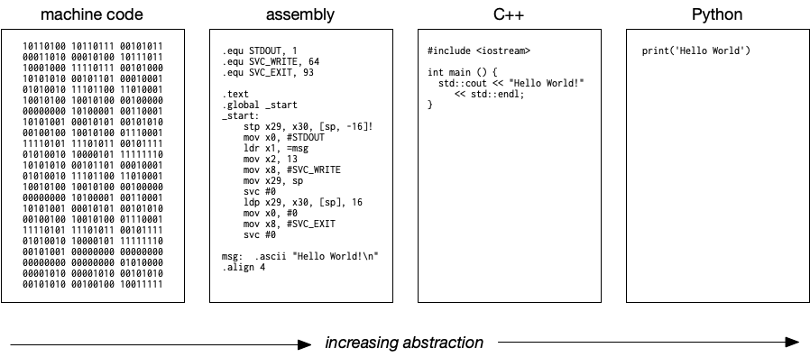 <a href="https://www.uvm.edu/~cbcafier/cs1210/book/02_programming_and_the_python_shell/programming.html" target="_blank" style="position: absolute; top: 2px; right: 4px; font-size: 11px;">[src]</a> 
 
Read right to left, each panel is what the one beside it translates into, and only the machine code column ever executes.
 

Programming paradigms imposed discipline on program structures. [Structured programming]() (Dijkstra, 1968) restricted control flow to sequence, selection, and iteration, which the [Böhm-Jacopini theorem]() (1966) had proved sufficient for any flowchart program. [Object-oriented programming]() (Simula, 1967; Smalltalk, 1980) organised programs around objects hiding state behind interfaces<!-- Simula originated in simulation modelling -->. [Functional programming]() ([lambda calculus](), 1936; Lisp, 1958) favoured pure functions and immutable data which became useful for concurrency. Apparently, PL designers shape syntax, type systems, and std. libraries around a preferred paradigm, though most features serve several.


Lisp (McCarthy, 1958) introduced a remarkable number of firsts:
  
  - heap allocation (§1.3 P1)
  - garbage collection (§1.3 P3)
  - first-class functions (§1.1 P5)
  - recursion as a primary control structure
  - REPL (§3.1 P1)
  - homoiconicity (code and data share the same structure via S-expressions)

First language grounded in a formal model (lambda calculus, Church 1936),
whereas Fortran was engineering-driven. Nearly every major PL idea since
can be traced back to Lisp or its descendants (Scheme, Clojure, Racket).

Paradigm syntax conventions (same ADT operation, different philosophy):

  - OOP:        a.add(b)    — data owns behaviour ("send add to a")
  - FP:         add(a, b)   — function operates on data ("apply add")
  - Procedural: add(a, b)   — same syntax as FP, different motivation
  - Operator:   a + b       — paradigm-neutral sugar for one of the above

All invoke the same abstract operation defined by the type (§1.2 ADT).


For instance, every language must fix its scoping rule, which determines where a binding is visible. [Dynamic scoping]() resolves a variable to the most recent binding on the call stack, whereas [lexical scoping]() (ALGOL 60, 1960; Scheme, 1975) resolves by position in the source text, so a function sees the environment in which it was defined. In turn, nearly all modern languages adopted the latter for predictable reasoning, each with its own lookup order (e.g. Python's LEGB: Local, Enclosing, Global, Built-in). Combined with [first-class functions]()<!-- functions treated as values -->, lexical scoping yields [closures]()<!-- functions that capture their defining environment (i.e. state) -->, which then underpin callbacks, decorators, and also stateful higher-order functions ([PEP 227](), [PEP 318]()).


Closure in C (no native support — must build manually):

    typedef struct { int n; } Env;
    int add(Env* env, int x) { return x + env->n; }
    Env* make_adder(int n) {
        Env* env = malloc(sizeof(Env));  // heap-allocate captured state
        env->n = n;
        return env;
    }

    Env* env = make_adder(5);
    add(env, 3);  // 8
    free(env);    // manual cleanup — no GC
    // function ptr (code) + ptr to heap struct (env) + manual free

Closure in Python (language handles it automatically):

    def make_adder(n):      # n lives in make_adder's stack frame
        def add(x):
            return x + n    # add captures n
        return add          # make_adder returns → its frame is destroyed

    add5 = make_adder(5)    # make_adder's frame is gone
    add5(3)                 # but n=5 must still be accessible → 8
    # PyObject = code + env, GC reclaims — no manual cleanup

Why heap: the captured variable (n) may outlive the creating scope's stack frame. Code lives in the text segment (always alive), parameters (x) live on the stack (known lifetime), but captured variables have unknown lifetime → must be heap-allocated. This is what §3.1 P4b describes with "heap-allocated frames that outlive the C stack."

BEFORE make_adder returns:
  Text segment (fixed)     Stack                     Heap
  ┌──────────────────┐     ┌──────────────────┐
  │ make_adder code  │     │ make_adder frame  │
  │ add code         │     │   n = 5           │
  └──────────────────┘     │   add = ──────────────→ ┌────────────────┐
                           └──────────────────┘      │ function object│
                           ┌──────────────────┐      │  code: &add    │
                           │ caller frame     │      │  env: {n: 5}   │
                           └──────────────────┘      └────────────────┘

AFTER make_adder returns:
  Text segment (fixed)     Stack                     Heap
  ┌──────────────────┐     ┌──────────────────┐
  │ make_adder code  │     │ caller frame     │      ┌────────────────┐
  │ add code         │     │   add5 = ──────────────→│ function object│
  └──────────────────┘     └──────────────────┘      │  code: &add    │
                                                     │  env: {n: 5}   │
                           make_adder's frame         └────────────────┘
                           is GONE, but n=5
                           survives in the closure

WHEN add5(3) is called:
  Text segment (fixed)     Stack                     Heap
  ┌──────────────────┐     ┌──────────────────┐
  │ make_adder code  │     │ add frame        │      ┌────────────────┐
  │ add code         │     │   x = 3          │      │ function object│
  └──────────────────┘     │   return x + n ──────→  │  code: &add    │
                           └──────────────────┘      │  env: {n: 5}   │
                           ┌──────────────────┐      └────────────────┘
                           │ caller frame     │        n read from heap
                           │   add5 = ────────────→  x from stack
                           └──────────────────┘

Closures and objects are duals:
  - Class: bundles state explicitly in self.x
  - Closure: bundles state implicitly in captured variables
  Both associate behaviour with state, from opposite directions.

Python note: the nonlocal keyword (PEP 3104) was needed to allow
closures to mutate enclosing variables.


<!-- Historically, writing source code required the programmer to manually translate intent into formal syntax, a process that enforced understanding of the underlying abstractions. With AI-assisted code generation, this translation is increasingly automated, shifting the programmer's role from authoring instructions to specifying intent and verifying correctness. -->

<!-- One language, multiple implementations:
  C:          GCC, Clang, MSVC, TCC — all implement ISO C11/C17
  JavaScript: V8 (Chrome/Node), SpiderMonkey (Firefox), JavaScriptCore (Safari) — all implement ECMAScript
  Java:       HotSpot (Oracle), OpenJ9 (Eclipse/IBM), GraalVM — all implement the JVM spec
  Python:     CPython (bytecode interpreter), PyPy (tracing JIT), GraalPy (partial evaluation JIT) -->

- 
 
 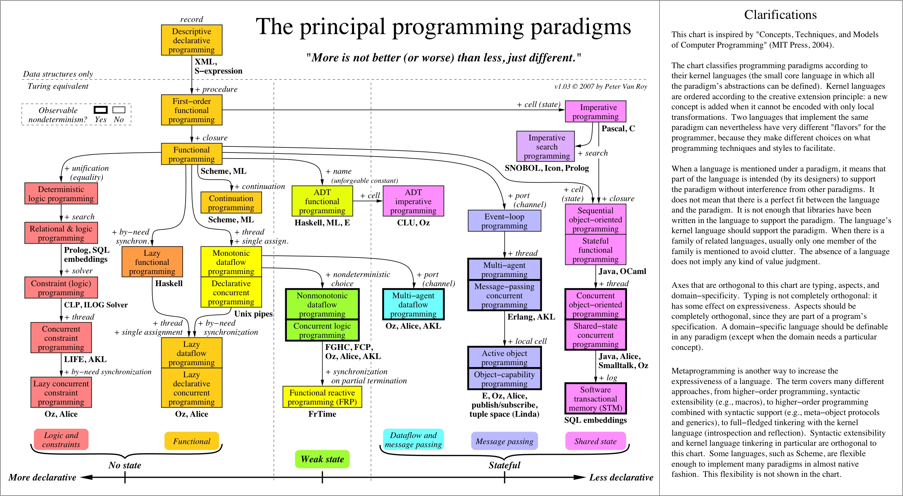 <a href="https://blog.acolyer.org/2019/01/25/programming-paradigms-for-dummies-what-every-programmer-should-know/" target="_blank" style="position: absolute; top: 4px; left: 4px; font-size: 11px;">[src]</a> 
 
Van Roy's map of the principal paradigms, each reached from another by adding one concept.
 

### **1.2. Type System**

 

A bit pattern means nothing until given a type. The byte 01100001 is the integer 97 under arithmetic (e.g. $+, \times$) or the character _'a'_ under concatenation (per ASCII/Unicode<!-- trim: the latter fixed by ASCII and generalised to every script by Unicode (UTF-8, 1-4 bytes) -->). A [data type]() is the tag that supplies missing context, a domain of values and the operations permitted on them, and the [type system]() comprises a PL's rules for assigning and checking these types. Concretely, [primitive types]() (e.g. int, float, char, bool) have fixed representations, and [data structures]() (e.g. stack, list, tree, hash map) carry invariant-bound internal state that any C code can access (e.g. _s.data[50]_<!-- trim: on a stack struct -->). Such access silently broke dependents as codebases grew in the 1960s-70s.

As a remedy, Barbara Liskov introduced the [abstract data type]() (ADT, 1974), a specification of operations and invariants (e.g. _peek_, _push_, _pop_ preserving LIFO order) independent of implementation<!-- trim: e.g. array or linked-list backed --> and language. Her own CLU (Turing Award, 2008) was the first to enforce it, for its compiler rejects access to a type's hidden representation<!-- trim: through the cluster construct, which bundles the hidden representation with public operations -->. [Encapsulation](), as it came to be called, further provided i) correctness; ii) modularity; and iii) substitutability (the [Liskov Substitution Principle](), 1987). Modern languages inherit that compiler-enforced access control (e.g. Java, Rust)<!-- trim: private in Java/C++, pub in Rust -->, dynamic languages enforce only at runtime (e.g. Ruby)<!-- trim: private raises on call with an explicit receiver -->, while Python's _\__ prefix is convention, not enforcement.

<!-- - 
  <a href="https://www.geeksforgeeks.org/dsa/abstract-data-types/" target="_blank" style="position: absolute; bottom: -8px; right: 4px; font-size: 11px;">[src]</a> 
 -->


  type vs ADT vs data structure:
    - type = declaration (syntactic label: x: List[Int])
    - ADT  = specification (what operations exist + what invariants they satisfy)
    - DS   = implementation (memory layout + algorithms + performance tradeoffs)
    - int as ADT specifies +, -, ×; int32 vs int64 vs BigInt are different implementations

Before ADT — C exposes everything:

  struct stack {
      int data[100];
      int top;
  };
  void push(struct stack *s, int x) { s->data[s->top++] = x; }
  int pop(struct stack *s) { return s->data[--s->top]; }

  // Nothing stops this — push/pop are optional, not enforced:
  s->data[50] = 42;   // bypasses LIFO, corrupts state
  s->top = -1;        // breaks internal invariant

After ADT — Java enforces the separation (inherits CLU's idea via C++):

  public class Stack<T> {
      private Object[] data;   // hidden — compiler rejects external access
      private int top;         // hidden

      public void push(T x) { data[top++] = x; }
      public T pop() { return (T) data[--top]; }
  }

  Stack<Integer> s = new Stack<>();
  s.push(42);          // OK — public operation
  s.data[50] = 42;     // ERROR: data has private access
  s.top = -1;          // ERROR: top has private access

  CLU (1974) → C++ class/private (1979) → Java (1995) → Rust pub (2010)
  Liskov didn't fix C. She built CLU, and later languages adopted the idea.

Python — the outlier:

  class Stack:
      def __init__(self):
          self._data = []    # _ prefix = "please don't touch"
          self._top = 0      # convention, not enforcement

  s = Stack()
  s._data[50] = 42     # works — Python won't stop you
  s._top = -1          # works — no compiler guarantee

  Python's _ prefix is advisory. Even __name_mangling can be bypassed
  with _ClassName__attr. Enforcement is social, not mechanical.


A violation is an operation outside a type's domain, and PLs differ in when their type system detects one (i.e. type discipline). [Statically-typed]() languages catch them before the program runs, whereas [dynamically-typed]() ones check values as execution reaches them. Even Java, statically typed, defers array bounds to runtime<!-- trim: trading certainty for flexibility; and enables optimisations (e.g. monomorphisation) -->. On the other hand, [strong typing]() rejects implicit coercion (e.g. _2 + '2'_ raises _TypeError_ in Python), while [weak typing]() permits it (e.g. _2 + '2'_ yields _'22'_ in JavaScript, and C silently truncates _int x = 3.14_ to 3 despite its static checks). Both axes decide where a PL's bugs surface, at compile time, at runtime, or never<!-- trim: as with C's silent truncation just shown; early Fortran read a misspelled RADUIS in AREA = 3.14*RADUIS*RADUIS as a fresh implicitly-declared REAL and delivered a wrong area, not an error; a laxity of the rules themselves (implicit declaration), on neither axis, fixed by IMPLICIT NONE --><!-- trim: Fortran typed variables implicitly by name (I-N: int, otherwise: float); IMPLICIT NONE was added to disable this -->.


Fortran implicit typing example:

  RADIUS = 2.5       ! starts with R → implicitly real
  AREA = 3.14 * RADUIS * RADUIS
  !                     ^^^^^^ typo: RADUIS instead of RADIUS
  ! Fortran silently creates a new variable RADUIS = 0.0
  ! AREA computes as 0.0 — no warning, no error

  Misspelling a variable name doesn't raise an error; it creates
  a new variable whose type is inferred from its first letter.
  This is what "silent type errors" means in practice.
  IMPLICIT NONE (Fortran 77+) was introduced specifically to
  disable this behaviour and require explicit declarations.


Static typing was safe but verbose. Robin Milner (Turing Award, 1991) dissolved the tradeoff using Hindley-Milner (HM) [type inference]() in Meta Language (ML), where _let f(x) = x + 1_ compiles to $f : \text{int} \to \text{int}$ without annotations. HM works because each use of a value constrains its type variable, and unification solves for the [principal type]() (Damas and Milner, 1982). It enabled Haskell and influenced Rust, Swift, and Kotlin. [Gradual typing]() (Siek and Taha, 2006) took the opposite path, retrofitting optional annotations as implemented in Python's type hints ([PEP 484]()), checked by external tools (e.g. mypy, pyright) but ignored at CPython runtime, e.g. _def f(x: int) -> int_.

- 
 
 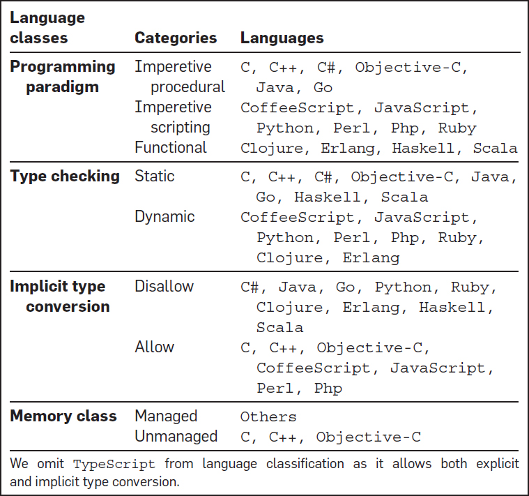 <a href="https://cacm.acm.org/research/a-large-scale-study-of-programming-languages-and-code-quality-in-github/" target="_blank" style="position: absolute; top: 4px; right: 4px; font-size: 11px;">[src]</a> 
 
Languages classified by paradigm, checking time, implicit conversion, and memory management.
 

In the terms of [abstract algebra](), an ADT is an [algebraic structure]() $(S, \{o_i\}, \mathcal{A})$. Its domain, operations, and invariants are respectively the carrier set $S$, family $\{o_i\}$, and axioms $\mathcal{A}$. While the ADJ group at IBM made this reading exact via [initial-algebra semantics]() (Goguen et al., 1977), the field studies what is deducible from the axioms alone, so a theorem proved once holds in every structure satisfying them.<!-- trim: The same axioms can govern different carriers under different operations. Weaker axioms prove less but apply more broadly, and stronger axioms prove more but apply to fewer structures --> One such theorem, the uniqueness of inverses, therefore applies to any group, from $(\mathbb{Z}, +)$ to $(S_n, \circ)$<!-- symmetric group: permutations under composition --> to $(GL_n(\mathbb{R}), \times)$<!-- general linear group: invertible matrices under multiplication -->. Both group and stack thus specify what must hold, silent on what carries it out. The correspondence buys programming equational reasoning and generic code<!-- trim: over any type satisfying the axioms; and formal verification via proof assistants -->.

The parallel extends even to what an operation excludes. $\sqrt{-1}$ is undefined in $\mathbb{R}$, _.append()_ is undefined on an integer<!-- trim: each operand outside its domain -->, and each system rejects rather than guesses. Yet the parallel breaks at extension and membership. Unlike mathematics, which chains its number systems $\mathbb{N} \subset \mathbb{Z} \subset \mathbb{Q} \subset \mathbb{R} \subset \mathbb{C}$ to admit new solutions (e.g. $x + 3 = 1$ in $\mathbb{Z}$, $x^2 = -1$ in $\mathbb{C}$<!-- trim: 2x = 3 in Q, x^2 = 2 in R -->), types form a lattice rather than a chain (e.g. numbers, lists, trees). In membership, $3 \in \mathbb{Z}$ and $3 \in \mathbb{R}$ are the same object, while int 3 (0x00000003) and float 3.0 (0x40400000) are in distinct hexadecimal. Therefore, the embedding $\mathbb{Z} \hookrightarrow \mathbb{R}$ costs maths a single act of identification but a program pays a conversion instruction.

Implementations realise these specifications under finite hardware, exactly or approximately. _int32_ realises the quotient ring $\mathbb{Z}/2^{32}\mathbb{Z}$ exactly, for wrapping arithmetic is reduction mod $2^{32}$, and approximates the infinite $(\mathbb{Z}, +, \times)$ using the representatives $[-2^{31}, 2^{31}-1]$.<!-- signed and unsigned share the same mod-2^32 sum and product bits, differing only in the choice of coset representatives (balanced vs non-negative); C leaves signed overflow undefined, so the ring structure is lawful only under unsigned or explicitly wrapping semantics --> _str_ approximates a [free monoid]() $(\Sigma^\ast, \cdot, \varepsilon)$ <!-- Σ* = all finite sequences over Σ (Kleene star); e.g. a, ab, abc ∈ Σ* --> as a byte array bounded by memory. Concatenation is its operation<!-- trim: "ab" . "cd" = "abcd" -->, the empty string $\varepsilon$ its identity, and the monoid is free, i.e. nothing holds beyond the axioms<!-- trim: hence no inverses, no commutativity; every sequence is a distinct element -->. _list_ approximates the same free monoid over a type $T$, $(T^\ast, \cdot, [])$, and _list[str]_ is then $\Sigma^{\ast\ast}$ <!-- (Σ*)* -->, the construction applied twice<!-- trim: char -> str -> list[str] -->. Whatever storage and algorithms realise them remain details the ADT hides<!-- ADT also adds operations beyond the algebraic core — int: <, >, %, &; str: indexing, len(), split(); list: index, len, map -->.


Not all mathematical structures are purely algebraic — a Hilbert space mixes
algebraic structure (inner product) with a topological condition (completeness),
and topological spaces, metric spaces, and partial orders are defined by
distinct kinds of data entirely.

Analogy with probability:
  Both the Kleene star and the power set are constructors that build a
  richer structure from a base set, but they produce different things:
    - Power set 2^Ω: all subsets (unordered, no repetition)
    - Kleene star Σ*: all finite sequences (ordered, with repetition)

  Probability: Ω (outcomes) → 𝓕 (sigma-algebra) → P : 𝓕 → [0,1]
  Algebra:     Σ (characters) → Σ* (strings) → Σ** (lists of strings)


- 

  <table>
    <tr><th>Structure</th><th>Ops</th><th>Axioms</th><th>Example</th><th>What works</th><th>What doesn't</th></tr>
    <tr><td>monoid</td><td>one</td><td>associativity, identity</td><td>$(\mathbb{N}, +)$, $(\mathbb{N}, \max)$</td><td>$3 + 5 = 8$, $\max(3,5) = 5$</td><td>$(-5) \notin \mathbb{N}$, no inverse for $\max$</td></tr>
    <tr><td>group</td><td>one</td><td>monoid + inverses</td><td>$(\mathbb{Z}, +)$</td><td>$8 + (-5) = 3$</td><td>—</td></tr>
    <tr><td>ring</td><td>two</td><td>additive group, multiplicative monoid, distributivity</td><td>$(\mathbb{Z}, +, \times)$</td><td>$3 \times 5 = 15$</td><td>$5^{-1} \notin \mathbb{Z}$</td></tr>
    <tr><td>field</td><td>two</td><td>ring + commutativity + multiplicative inverses</td><td>$(\mathbb{R}, +, \times)$</td><td>$5x = 3 \Rightarrow x = 3 \cdot 5^{-1}$</td><td>—</td></tr>
    <tr><td>vector space</td><td>two</td><td>abelian group $(V,+)$ + scalar mult. from field $F$</td><td>$(\mathbb{R}^n, +, \cdot)$</td><td>$\vec{u} + \vec{v}$, $\alpha \vec{u}$</td><td>no vector $\times$ vector</td></tr>
    <tr><td>Hilbert space</td><td>three</td><td>vector space + inner product + completeness (topological, not equational)</td><td>$(L^2, +, \cdot, \langle\cdot,\cdot\rangle)$</td><td>$\langle f, g \rangle = \int f \bar{g}$</td><td>—</td></tr>
  </table>
  

 

Types also compose in the terms of [set theory](). A struct or tuple is a [Cartesian product]() ($\text{String} \times \text{Int} = \Sigma^\ast \times \mathbb{Z}$), a tagged union or enum is a [disjoint union]() (Rust's $\text{Result}\langle T, E \rangle = T \sqcup E$), and a function type $A \to B$ has $\vert B\vert ^{\vert A\vert }$ inhabitants for finite $A$, $B$. These are known as [algebraic data types]() because their cardinalities follow arithmetic ($\vert A \times B\vert  = \vert A\vert  \cdot \vert B\vert $, $\vert A \sqcup B\vert  = \vert A\vert  + \vert B\vert $), and the arithmetic predicts real counts. $\text{Bool} \to \text{Bool}$ has exactly $2^2 = 4$ inhabitants (identity, negation, constant true, constant false), and $\text{Option}\langle T \rangle = T \sqcup 1$ has $\vert T\vert  + 1$ values, the extra one being _None_. Type constructors like List go further as [functors]() $\textbf{Type} \to \textbf{Type}$, lifting a function $f : A \to B$ to $\text{map}(f) : A^\ast \to B^\ast$ while preserving composition<!-- map(g ∘ f) = map(g) ∘ map(f); trim: sending any type T to T* -->.

Under the [Curry-Howard correspondence](https://www.cs.cmu.edu/~crary/819-f09/Howard80.pdf) (Curry, 1934; Howard, 1969), the same constructions read in the terms of [mathematical logic](). A type is a proposition and its inhabitant is a proof, hence $A \times B$ is conjunction (evidence of both), $A \sqcup B$ is disjunction<!-- trim: evidence of either -->, and $A \to B$ is implication, where a function claims to construct evidence of $B$ from evidence of $A$ and its body is the proof. The empty type admits no inhabitants and so no proofs, which makes it falsehood. [Type-checking]() thereby becomes [proof-checking](), and [Lean]() and Coq exploit it as theorem provers. A theorem is stated as a type, its proof is a program of that type, and the compiler checks the given proof mechanically<!-- trim: every step checked, no human reviewer needed -->.


Curry-Howard in detail: type-checking = proof-checking

  A type is a proposition. A program of that type is a proof.
  f : A → B claims "given evidence of A, I can produce evidence of B."
  The function body IS the proof — it takes an input of type A and
  constructs an output of type B. If the compiler accepts it
  (type-checks), the proof is valid.

  The correspondence:
    proposition        ↔  type
    proof              ↔  program
    A ⇒ B (implication)↔  A → B (function)
    A ∧ B (conjunction)↔  A × B (tuple)
    A ∨ B (disjunction)↔  A ⊔ B (enum)
    ⊥ (false)          ↔  Void (no inhabitants)
    proved             ↔  type-checks

  A type with no inhabitants (Void) means the proposition is false —
  you can't construct a proof. A type with at least one inhabitant
  means the proposition is true — the inhabitant IS the proof.

  In Lean, a theorem is stated as a type:
    theorem pythagorean : a² + b² = c²
  and the proof is a program that inhabits that type. The type-checker
  verifies every step mechanically. If it compiles, the theorem is
  proved — no human reviewer needed. This is why Tao uses Lean:
  the verification is algorithmic, not human.


- 

  <table>
    <tr><th></th><th>Mathematics</th><th>CS</th></tr>
    <tr><td><b>Object</b></td><td>element of a set ($3 \in \mathbb{Z}$, $f \in L^p$)</td><td>bit pattern with a type label</td></tr>
    <tr><td><b>Structure</b></td><td>carrier + operations + axioms (e.g. group, field)</td><td>ADT: carrier + signature (e.g. int, list)</td></tr>
    <tr><td><b>Implementation</b></td><td>—</td><td>data structure (e.g. hash map, BST)</td></tr>
    <tr><td><b>Context</b></td><td>implicit (mathematician tracks it)</td><td>explicit (type annotation or inference)</td></tr>
    <tr><td><b>Composition</b></td><td>$A \times B$, $A \sqcup B$, $A \to B$</td><td>product, sum, function types</td></tr>
    <tr><td><b>Cardinality</b></td><td>infinite ($\vert\mathbb{Z}\vert = \aleph_0$)</td><td>finite (int32 has $2^{32}$ values)</td></tr>
    <tr><td><b>Verification</b></td><td>peer review, proof</td><td>type checker, compiler</td></tr>
  </table>
  

 

### **1.3. Memory Management**

 


Arc: why the heap exists, how to reclaim it — at runtime by GC, at compile time by ownership — and what each language pays.
  p1: problem — dynamic data forces the heap; manual reclamation fails at scale (70% memory bugs)
  p2: GC — refcount, mark-and-sweep, incremental, generational; each fixes the last's flaw, all cost pauses
  p3: ownership — Rust moves reclamation to compile time; borrow checker, no collector, no data races
  p4: CPython — refcounts free promptly, gc sweeps cycles; INCREF/DECREF discipline, the GIL's reason; del, views, fork CoW in practice
  p5: cost — runtime type info decides what is heap-allocated and automated; C, Java, Python spectrum


Every object a program allocates occupies memory for its lifetime, and memory being finite, a program that never [reclaims]() memory for reuse will exhaust it. [Static allocation](), as in Fortran, left nothing to reclaim, sizes fixed at compile time and slots held for the whole run<!-- trim: surrendered only at process exit -->. Dynamic data<!-- trim: e.g. variable-size lists, hash maps --> arrived with Lisp's [heap allocation]()<!-- its computation model (recursive list processing with S-expressions) required runtime-created data with unpredictable lifetimes --> for objects of unknown size/lifetime<!-- e.g. a closure's captured variables (§1.1 P5) outlive the creating scope --> (§603#3.1). While it reclaimed the heap automatically via [garbage collection](https://adamansky.bitbucket.io/slides/gc/index.html?full#1 ) (GC), C (1972) left it to the programmer through _malloc_/_free_ from its std. library. In practice, manual discipline failed at scale, as Microsoft (MSRC, 2019) and [Chromium](https://www.chromium.org/chromium-projects/) (2020) each attribute ~70% of their C/C++ vulnerabilities to memory bugs<!-- e.g. buffer overflow (writing beyond bounds), use-after-free (accessing a dangling pointer after deallocation) -->.

How a collector finds garbage splits GC into three forms: i) [reference counting]() (e.g. CPython): each object carries a count and is freed the moment it drops to zero, though cycles keep counts positive<!-- trim: e.g. A -> B -> A -->; ii) [mark-and-sweep](): the collector traces reachable objects from roots (e.g. globals, stack variables) and frees the rest, which classically stops the world<!-- pausing all application threads so the object graph holds still during the trace -->, though incremental and concurrent variants run [tri-colour marking]() alongside the program to keep each pause short; and iii) [generational collection]() (e.g. Java, .NET): most objects die young, thus the youngest generation is collected most often. All three conveniently automate reclamation at the cost of non-deterministic pauses.

Rust's [ownership system]() takes the third path, where the compiler itself schedules reclamation. Each value belongs to exactly one owner (e.g. the variable holding it) and is freed the moment that owner leaves scope, with a [borrow checker]() rejecting at compile time any reference that would outlive it<!-- trim: or alias a value while it is mutated -->. Assignment itself moves ownership, hence using the moved-from name is a compile error, and where one owner proves too strict, _Rc_/_Arc_ opt individual values back into reference counting. Reclamation thus becomes a compile-time proof, trading GC's pauses for stricter rules on the programmer, rules that also exclude data races by construction.

CPython sits at the opposite pole by staking reclamation on that reference counting, while the cyclic collector (the _gc_ module) backstops cycles. The counts free memory promptly and deterministically, while C extensions must balance _Py\_INCREF_/_Py\_DECREF_ by hand<!-- trim: a missing decrement leaks, a stray one frees live memory -->. Given that a simple read also mutates the count (i.e. _ob\_refcnt_), the GIL (§604#1.3) guards these writes, and the free-threaded build makes the counts atomic and locks per object instead. In practice, _del_ merely unbinds a name and decrements, and an object is freed only when its last reference goes (e.g. a NumPy [view]() pins its base array). A forked worker loses its copy-on-write pages just by reading (§603#3.1)<!-- trim: freed small objects return to pymalloc's arenas rather than the OS, hence a process may not shrink after a large delete -->.

How much type information a PL preserves at runtime shapes what it heap-allocates, what it automates, and what each value costs. C, a statically-typed language, erases types after compilation and places local variables on the stack as raw bits (e.g. *int*, 4 bytes), reclaimed manually<!-- trim: by the programmer, to prevent memory leaks --><!-- C has no methods on data types because it predates the concept (1972, pre-OOP). Methods don't require runtime type info: Rust's i32 is stack-allocated raw bits yet has methods (e.g. x.pow(2)), resolved via static dispatch at compile time. Python needs runtime type info (ob_type) because types are determined dynamically. -->. Java, also statically-typed, heap-allocates its objects (e.g. *Integer*, ~16 bytes; GC-managed) but stack-allocates primitives (e.g. *int*, 4 bytes). Python, dynamically-typed, binds type information to every value as a heap-allocated *PyObject* (e.g. *int*, ~28 bytes) carrying per-value metadata (e.g. reference count, type pointer, payload)<!-- methods on all values are a consequence of the object model, not of memory allocation -->.<!-- §3.1 examines the execution consequences -->


C → Java → Python: PL increasingly reliant on GC.

  - C: no GC — programmer manages everything manually
  - Java: GC for objects — primitives bypass it (stack-allocated)
  - Python: GC for everything — every value is heap-allocated

They increasingly depend on GC because they increasingly heap-allocate,
and they increasingly heap-allocate because they preserve more type
information at runtime. The chain:

  more runtime type info →
  more heap allocation →
  more GC dependence → 
  higher per-value cost → less programmer burden

Memory model comparison:

                C (1972)        Rust (2015)     Java (1995)         Python (1991)
  int storage   4 B, raw bits   4 B, raw bits   4 B prim / ~16 B    ~28 B (PyObject)
  stack/heap    stack default,  stack default,  prim stack,         everything heap
                heap via malloc heap via Box    objects heap
  runtime type  none (erased)   none (erased)   on objects (vtable) on all (ob_type)
  methods       no (pre-OOP)    yes (static)    on objects only     on all values
  dispatch      —               compile-time    static + virtual    runtime (ob_type)
  reclamation   manual (free)   ownership       GC (generational)   GC (refcount+cycle)

Key: methods and runtime type info are independent. Rust has methods
without runtime type info (resolved at compile time). Python needs
runtime type info because it doesn't know the type until execution.

PyObject layout:
  PyObject (on heap):
  ├── ob_refcnt: 1          (reference count for GC)
  ├── ob_type: &PyLong_Type (pointer to the int type object)
  └── ob_digit: [5]         (the actual value)

Go and Rust use escape analysis / explicit Box to decide stack vs heap.


- 
 
 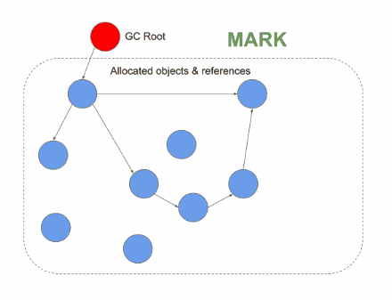 <a href="https://deepu.tech/memory-management-in-v8/" target="_blank" style="position: absolute; top: 4px; right: 4px; font-size: 11px;">[src]</a> 
 
Mark-and-sweep tracing reachable objects from the GC root before sweeping the rest.
 

### **1.4. Error Handling**

 


Arc: failures invisible at their origin, then a spectrum of ways to surface them; compile time vs runtime bridges to §II.
  p1: problem — unchecked sentinels, null, Ariane 5; all three fail far from the code at fault
  p2: trade-off — clean happy path vs visible failure; exceptions, Go error codes, algebraic types reconcile
  p3: bug vs recoverable — the correct-program test; Python's Exception/BaseException divide, EAFP


An [error]() is a condition preventing a call from producing its desired result, and every such call must report back to its caller. In practice, the failures differ in where the report is lost, i) the caller: C, for instance, signals failure with a [sentinel value]() (-1, NULL) and _errno_ that one unchecked return silently discards; ii) the PL: Tony Hoare's [null reference]() (ALGOL W, 1965), a "billion-dollar mistake" in his words, inhabits every reference type and turns every dereference into a latent error; and iii) the context: Ariane 5 (1996, $370M) inherited code from Ariane 4, and a conversion<!-- trim: of a 64-bit float to a 16-bit integer --> that could never overflow on the old rocket did on the new one. All three fail far from the code at fault.

C's successors traded between two goods, a clean happy path and visible failure. [Exceptions]() (PL/I, 1964, ON-conditions; formalised in CLU, 1979) chose cleanliness, unwinding the call stack to a matching handler while hiding the set of possible failures from the signature. Go (2009) chose visibility, returning to explicit [error codes]() that expose failure at every call site (_if err != nil_). [Algebraic error types]() such as Haskell's _Either_ and Rust's _Result$\langle$T, E$\rangle$_ reconcile the two by encoding success or failure in the type, hence the programmer must handle or propagate it and the compiler warns when a _Result_ is discarded.

Yet not every error deserves handling. A [bug]() is a defect in the program itself, whereas a recoverable condition (e.g. a missing file) is still an error but one arising from the outside world. The test is whether it could befall a correct program, hence a contract violation (e.g. an index out of bounds) signals a bug beyond local repair. Python, specifically, marks the divide in its exception hierarchy, where handlers catch _Exception_ to recover, while _BaseException_ subclasses (e.g. _KeyboardInterrupt_) terminate the run. Furthermore, Python's [EAFP]() idiom<!-- easier to ask forgiveness than permission --> treats recoverable errors as ordinary control flow, trying the operation and catching what fails rather than checking beforehand.

<!-- Java's checked exceptions moved failure into the signature but bred empty catch blocks, and successors dropped them (e.g. Kotlin). Erlang instead recovers at a coarser boundary, "let it crash", where a supervisor restarts a failed process in a known-good state. Each design decides what is settled before execution and what must be survived during it. -->

## II
---

### **2.1. Compiler**

 

A [compiler](https://www.youtube.com/watch?v=yOyaJXpAYZQ&t=15s) is a program that batch-translates source code into a lower-level language, often assembly or machine code, before execution<!-- trim: (e.g. C/C++: GCC, Clang, MSVC) -->. While Von Neumann reportedly dismissed even an assembler as a clerical waste of a scientific device, Grace Hopper's A-0 system (1952)<!-- for the UNIVAC I (Universal Automatic Computer I), one of the first commercial computers -->, the first so-called compiler, mapped mathematical notation to pre-written subroutines. Five years later, Fortran settled the argument with machine code that rivalled hand-written assembly. Theory then caught up, as the [Chomsky hierarchy]() (1956) classified grammars by expressive power, [Backus-Naur form]() (BNF, 1959) gave them a notation, and Lex and Yacc (1975) automated lexer and parser generation.


A-0 (subroutine linker):
  Input:  Y = X² + 5
  Output: CALL SUB_SQUARE(X, T1)   ← pre-written subroutine
          CALL SUB_ADD(T1, 5, Y)   ← another pre-written subroutine
  No optimisation — chains existing pieces (like calling library functions).

Fortran (optimising compiler):
  Input:  Y = X**2 + 5
  Output: LOAD  R1, X
          MUL   R1, R1      ← inline multiply, no subroutine overhead
          ADD   R1, 5
          STORE R1, Y
  Matches what a human would write by hand.

---

Step-by-step: "3 + 5 * 2"

1. Chomsky hierarchy — PLs use context-free grammars (CFG):
     <expr>   ::= <expr> "+" <term> | <term>
     <term>   ::= <term> "*" <factor> | <factor>
     <factor> ::= "(" <expr> ")" | <number>

2. BNF — the notation above IS BNF. It specifies the grammar
   formally enough for tools to consume.

3. Lex — turns source text into tokens (via regex rules):
     [0-9]+  → NUMBER
     "+"     → PLUS
     "*"     → STAR
     Input:  3 + 5 * 2
     Output: NUMBER(3) PLUS NUMBER(5) STAR NUMBER(2)

4. Yacc — turns tokens into an AST (via BNF rules):
     expr
      ├── 3
      └── +
           ├── 5
           └── *
                └── 2
   i.e. +(3, *(5, 2)) = 13, not *(+(3, 5), 2) = 16

---

C build chain — file extensions at each stage:

  main.c  →  main.i  →  main.s  →  main.o  →  a.out
   source    preprocessed  assembly   object     executable
             (-E)          (-S)       (-c)

  mylib.s ──────────────→ mylib.o ──↗
                           (-c)

Because the pipeline has well-defined intermediate formats, code can
enter at any stage. For example, a hand-written assembly file (mylib.s)
skips the preprocessor and compiler entirely, entering at the assembler
stage to produce an object file that the linker merges with compiler-
generated object files from C source.

LLVM generalises this: any front-end (Clang, rustc, swiftc) emits
the same IR. Optimisation and machine code generation are "free" —
the compiler developer's job is to translate their language's
semantics into LLVM IR correctly.


These formalisms underpin the first stage of the standard compilation pipeline. Specifically, the front-end carries out i) lexical analysis: breaks source code into tokens; ii) parsing: builds an [abstract syntax tree]() (AST)<!-- trim: from the grammar -->; iii) semantic analysis: checks types and resolves scopes; and iv) [intermediate representation]() (IR) generation. The middle-end optimises the resulting IR (e.g. constant folding and propagation, dead-code elimination, inlining) through [static single assignment]() (SSA) form<!-- trim: where each variable is assigned exactly once to simplify data-flow analysis -->. The back-end finally lowers the optimised IR to machine code for a target ISA, while a linker combines object files (e.g. .o, .obj) into an executable bound to a specific OS and ISA.

This division of labour has evolved over generations of compilers. For example, early compilers were monolithic, built for one language on one target. The [GNU Compiler Collection]() (GCC, 1987), the first major free compiler, proved that a single codebase could serve many languages and target ISAs. GCC is moreover [self-hosting]() in that it compiles its own source through [bootstrapping]()<!-- trim: an initial version written in another language is progressively recompiled by its own output -->. However, its IRs (i.e. GENERIC, GIMPLE, RTL) stayed internal and unstable. Each front-end was therefore written against GCC's shifting internals instead of a stable interface, and supporting $N$ languages on $M$ targets meant wiring every language-target pair, an effort proportional to $N \times M$.<!-- trim: Its move to [GPLv3]() (2007) further discouraged adoption by proprietary [toolchains]() (e.g. Apple replaced GCC with Clang in Xcode, 2012). -->

- 
 
 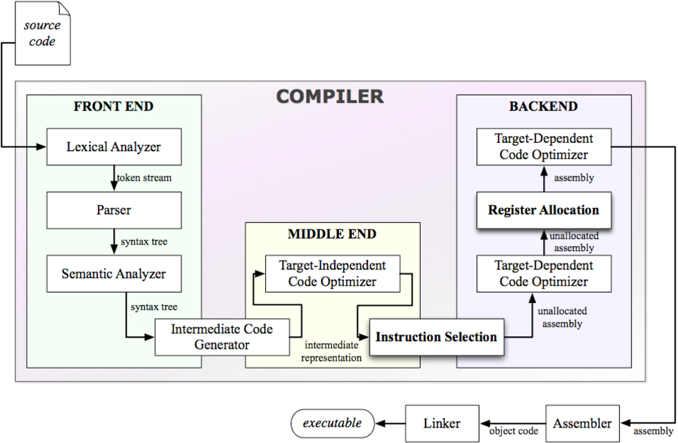 <a href="https://www.semanticscholar.org/paper/Lecture-Notes-on-Compiler-Design%3A-Overview-Pfenning/ba66b0ca1f3b7e00516b0682663eeaa665c5cec6" target="_blank" style="position: absolute; top: 4px; right: 4px; font-size: 11px;">[src]</a> 
 
The front-end and middle-end feeding target-dependent back-end stages, with the assembler and linker outside the compiler proper.
 

[Low-level virtual machine]() (LLVM, 2003), begun as Chris Lattner's graduate project at the University of Illinois, collapsed the product to the sum $N + M$ by defining a stable, target-independent IR in SSA form (textual .ll, binary .bc). The pattern is general, for wiring both sides of such a dependency to a shared hub requires only $N + M$, an argument that recurs for editor-language and agent-tool protocols (§605#4.4). The developer's dividend is that the task reduces to emitting correct LLVM IR since optimisation and code generation come free. A new ISA's dividend is symmetric in that one back-end shared by every language replaces a change to each compiler.

- 
 
 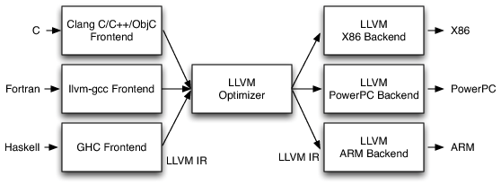 <a href="https://www.kc-ml2.com/posts/blog_LLVMAsia2025" target="_blank" style="position: absolute; bottom: -8px; right: 4px; font-size: 11px;">[src]</a> 
 
Three front-ends and three back-ends meeting at one optimiser over LLVM IR.
 

Both dividends played out first in C's own toolchain. LLVM initially relied on GCC as its front-end (llvm-gcc) until [Clang]() (2007) replaced it with a native C/C++/Objective-C front-end. The shared middle-end and back-ends indeed stayed untouched, while the one IR Clang emits lowers to any supported ISA, which the back-end can compile [ahead-of-time]() (AOT) via _llc_ or execute [just-in-time]() (JIT) via _lli_. A flag moreover pauses the pipeline after any stage of compilation and exposes its output. For example, the preprocessor expands macros and \#includes (_-E_), the compiler emits assembly (_-S_), the assembler produces an object file (_-c_), and a full run carries on through linking.

- 
 
  <a href="https://www.researchgate.net/publication/35151154" target="_blank" style="position: absolute; top: 4px; right: 4px; font-size: 11px;">[src]</a> 
 
The Clang front-end feeding LLVM's shared middle-end and back-ends.
 

<!-- -  <a href="https://aosabook.org/en/v1/llvm.html" target="_blank">[src]</a> -->

<!-- -  <a href="https://www.skenz.it/compilers/llvm" target="_blank">[src]</a> -->

<!-- -   -->


PyTorch's evolution illustrates the pattern. In eager mode, each operation
dispatches individually at runtime, incurring type lookup and kernel launch
overhead on every op. Before 2.0, TorchScript attempted graph compilation by
tracing Python into a custom IR, but Python's dynamism made reliable tracing
difficult. PyTorch 2.0 replaced it with TorchDynamo, which captures the graph
at the Python bytecode level and delegates compilation to TorchInductor,
generating Triton kernels (§2.2) for GPU or C++ for CPU, enabling
cross-operation optimisations (e.g. fusing matmul + relu into a single kernel).


The linker combines object files, potentially from different source languages, but the result is correct only if all were compiled against the same [application binary interface](https://stackoverflow.com/questions/3784389/difference-between-api-and-abi) (ABI), which specifies calling conventions, data type sizes, struct layout, and name mangling. To combine, the linker resolves each file's references to symbols the others define and relocates their sections to final addresses. [Static linking]() embeds all dependencies into the executable, while [dynamic linking]() defers resolution to shared libraries (e.g. .so, .dylib) at load time via a [runtime linker]() (_ld.so_ on Linux, _dyld_ on macOS). An ABI mismatch may silently corrupt data or crash at runtime.

<!-- - 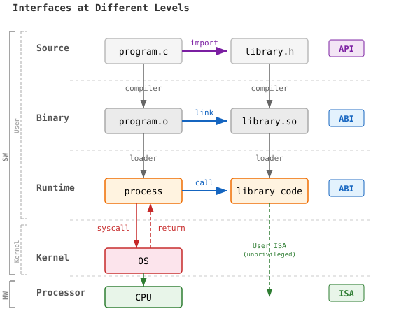 -->

<!-- - 
 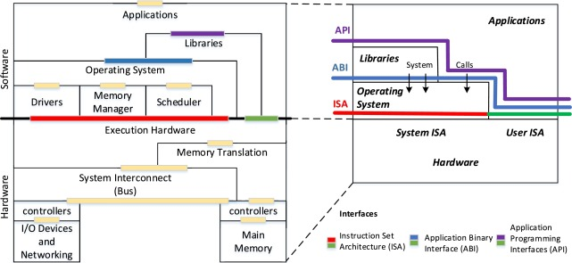 <a href="https://www.sciencedirect.com/topics/computer-science/application-binary-interface" target="_blank" style="position: absolute; bottom: -8px; right: 4px; font-size: 11px;">[src]</a> 
 -->

The finished binary is the program itself, its sequence of instructions now bound to a triple $(\text{ISA}, \text{vendor}, \text{OS})$, thus running it elsewhere needs translation. Apple's [Rosetta 2](), for instance, bridges the ISA mismatch by rewriting x86\_64 binaries for ARM (i.e. AOT as default, JIT as a fallback). The OS field then decides the on-disk format. Linux, Windows, and macOS define the [executable and linkable format]() (ELF), the [portable executable]() (PE), and [Mach-O](), respectively. Each lays out machine code and data as segments behind a header that the OS loader reads to map the executable into memory, and a process is the executable image extended with a heap and a stack (§603#3.1).<!-- trim: That is, executing clang add.c -o add on a Mac produces what file reports as Mach-O 64-bit arm64. --><!-- trim: On macOS, applications appear as single icons in Finder but are actually directories called bundles. A .app bundle (e.g. /Applications/Safari.app/) contains an Info.plist (metadata), a Resources/ directory (assets), and the actual Mach-O executable under Contents/MacOS/. The "program" in the strict sense is the Mach-O binary inside, the bundle is packaging that Finder renders as a clickable icon, and cd /Applications/Safari.app/Contents/MacOS/ reveals the executable directly. -->

- 
 
 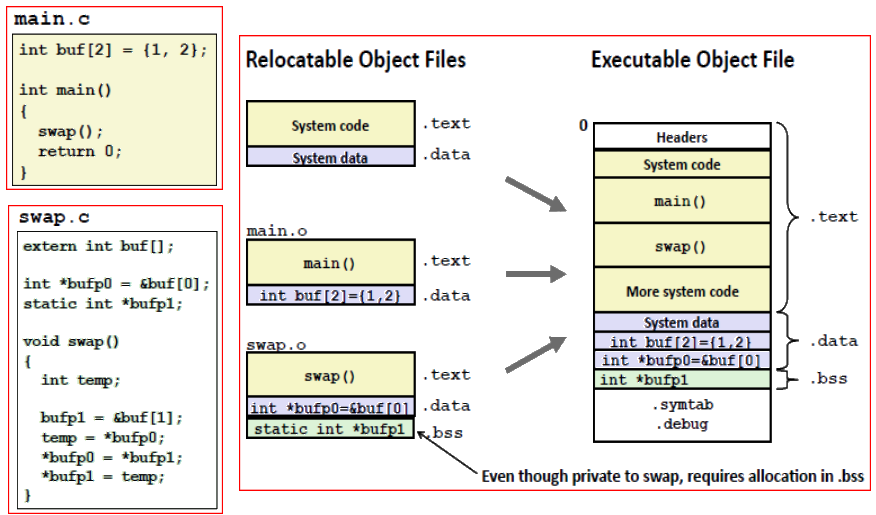 <a href="https://people.cs.pitt.edu/~xianeizhang/notes/Linking.html" target="_blank" style="position: absolute; top: 2px; right: 2px; font-size: 11px;">[src]</a> 
 
Two relocatable object files merging section by section into one executable, headers in front.
 

<!-- - 
 
 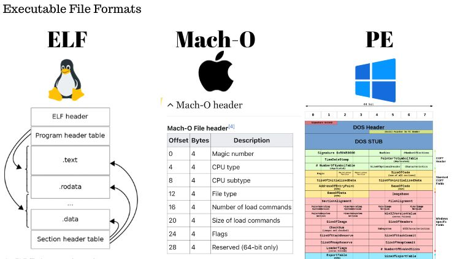 <a href="https://www.linkedin.com/posts/hnaser_recently-learned-that-compiled-executable-activity-7125897574854610944-5S05/" target="_blank" style="position: absolute; top: 4px; right: 4px; font-size: 11px;">[src]</a> 
 
One executable format per OS, ELF's sections, the Mach-O header, and PE's DOS legacy.
 
 -->

<!-- - <iframe width="500" height="285" src="https://www.youtube.com/embed/XJC5WB2Bwrc?si=J3maJExgz5iRKCCN" title="YouTube video player" frameborder="0" allow="accelerometer; autoplay; clipboard-write; encrypted-media; gyroscope; picture-in-picture; web-share" referrerpolicy="strict-origin-when-cross-origin" allowfullscreen></iframe> -->

### **2.2. Domain-Specific Compiler**

 

A [general-purpose language]() (GPL) commits to no particular domain, whereas a [domain-specific language]() (DSL) confines its abstractions to one and encodes domain knowledge as primitives that a GPL must reconstruct by loops, conditionals, and data structures. Each DSL is backed by its own compiler or interpreter, but unlike a GPL compiler that emits standalone machine code, a DSL compiler targets its own executor (e.g. DB engine, regex engine, GPU runtime). In particular, a [structured query language]() (SQL) offers grouping (_GROUP BY_) and aggregation (_AVG_) as primitives<!-- trim: that Python must rebuild as a loop over a dict -->, and the query processor in DB compiles such a declarative query into a physical execution plan (§606#3.2).

Note that confining the language is what licenses guarantees a GPL compiler cannot make. For example, a [regular expression]() (regex) is a language sufficiently restricted that any pattern<!-- trim: (e.g. _\d+_ for one or more digits) --> compiles into a [finite automaton](), whose execution costs one step per character.<!-- a machine that reads text one character at a time and never goes back--> Google's RE2 (2010) rests on this bound and matches in linear time, while backtracking engines (e.g. Python's _re_) admit an exponential worst case exploitable as a [denial of service]() (ReDoS).<!-- trim: a finite automaton in engines like RE2 though a backtracking search in most (e.g. PCRE, Python's _re_) --> SQL also enjoys the same freedom. A rewrite such as join reordering is a universal theorem of relational algebra valid for all queries, while a compiler given the same query as loops must prove each transformation safe per program.

While SQL and regex stand alone with their own grammar, an [embedded DSL]() resides inside a host GPL and borrows the host's toolchain and, typically, its syntax yet keeps its own compiler. The embedding takes several forms, i) operator overloading: _df.filter(df["age"] > 21)_ in PySpark redefines _>_ to build a query plan optimised by Catalyst rather than a boolean; ii) decorated functions: a GPU kernel marked _@triton.jit_ is compiled outside the Python interpreter; and iii) pattern strings: even regex often appears embedded, passed to _re.findall_. Residence is thus a property of use, not of the language, as the same pattern grammar serves _grep_ standalone and Python embedded.<!-- trim: MATLAB began as a matrix DSL and drifted into a GPL -->

In the ML era, a flagship embedded DSL is [Compute unified device architecture]() (CUDA), extending C/C++ with GPU-specific constructs for programming NVIDIA hardware (§601#2.1). Its dedicated [NVIDIA CUDA compiler](https://docs.nvidia.com/cuda/cuda-compiler-driver-nvcc/contents.html) (NVCC) breaks source code from a _.cu_ file into [device code]() (i.e. kernels marked with *\_\_global\_\_*/*\_\_device\_\_*) and [host code]() (i.e. CPU logic), translates the former through [NVIDIA's LLVM derivative (NVVM)]() to parallel thread execution assembly (.ptx) or a directly executable CUDA binary (.cubin), and delegates the rest to the host compiler<!-- GCC on Linux, MSVC on Windows -->. For example, a kernel launch *add<<<grid, block>>>(args)* is invalid C++ until NVCC rewrites it into runtime API calls.

- 
 
  <a href="https://docs.nvidia.com/cuda/cuda-programming-guide/02-basics/nvcc.html" target="_blank" style="position: absolute; top: 4px; right: 4px; font-size: 11px;">[src]</a> 
 
NVCC splitting a .cu file, host code to the host compiler and kernels through ptxas into a fatbinary (simplified to one architecture).
 

<!-- - https://docs.nvidia.com/cuda/cuda-compiler-driver-nvcc/index.html#cuda-compilation-trajectory__cuda-compilation-from-cu-to-executable -->
<!-- - 
  <a href="https://cuda-programming.blogspot.com/2013/01/compile-and-run-cuda-cc-programs.html" target="_blank" style="position: absolute; bottom: -8px; left: 4px; color: white; font-size: 11px;">[src]</a> 
 -->

Many DSLs long paid the price of a full toolchain built from scratch as CUDA did. GPL compilers had already escaped this cost by sharing the LLVM hub, but the hub covers only the bottom half of the compilation pipeline, which lowers unoptimised IR down to machine code, and yields little for a DSL whose value lives above the IR. For instance, a lowered tensor operation is mere loop nests of scalar arithmetic with no record that they constitute a matmul, hence fusing two such operations into one kernel is intractable.<!-- trim: LLVM IR is a portable assembly, i.e. below C; domain-specific semantics e.g. tensor operations, ownership constraints, or protocol conformance; the compiler cannot reason about structure it does not encode --> Consequently, each project rebuilt its own middle layer (e.g. Swift-SIL, Rust-MIR, TorchScript) above LLVM IR and duplicated passes, lowering, and verification.


Without MLIR:
  Swift   → [Swift AST → SIL → ???  ] → LLVM IR → machine code
  Rust    → [Rust AST  → MIR → ???  ] → LLVM IR → machine code
  PyTorch → [Python AST → TorchScript] → LLVM IR → machine code
             ^^^^^^^^^^^^^^^^^^^^^^^^^^
             each builds its own IR infra (duplicated work)

With MLIR:
  Swift   → [Swift dialect  ]
  Rust    → [Rust dialect   ] → MLIR → LLVM IR → machine code
  PyTorch → [Tensor dialect ]
             ^^^^^^^^^^^^^^^^^
             shared framework (reusable passes, lowering, verification)

LLVM standardised:       IR ──→ machine code
MLIR standardises: AST ──→ IR


Chris Lattner repeated the consolidation one level higher with the [multi-level intermediate representation]() (MLIR) at Google in 2019. It introduced the [dialect]() (i.e. a domain's operations and types) and supplies the shared infrastructure (passes, verification, rewriting) along the way down to LLVM IR. Built-in dialects (arith, linalg, gpu) are maintained by the LLVM community, and external projects make their own (e.g. [torch-mlir](https://github.com/llvm/torch-mlir), [IREE](https://github.com/iree-org/iree)). A PyTorch tensor addition lowers from _torch.aten.add_ (Torch dialect) to element-wise loops (_linalg.generic_) to scalar arithmetic (_llvm.fadd_).<!-- trim: Each step is a systematic dialect-to-dialect transformation. --> In sum, LLVM standardised everything below the IR, and MLIR standardises everything above it.

[Triton](https://triton-lang.org/main/getting-started/tutorials/01-vector-add.html#sphx-glr-getting-started-tutorials-01-vector-add-py) (OpenAI, 2021), once Philippe Tillet's PhD project, is a Python DSL<!-- not C/C++ --> for GPU tensor operations built on MLIR, which evidence that a DSL now costs only its dialect. It automates what CUDA leaves manual (i.e. coalescing, synchronisation, SM scheduling) by replacing the per-thread SIMT model with tile-based programming.<!-- trim: over multi-dimensional blocks --><!-- trim: CUDA exposes the hardware model directly --> Its compiler captures the kernel's AST and lowers it dialect-by-dialect: Triton IR (TTIR, hardware-agnostic) → TritonGPU IR (TTGIR, hardware-specific) → LLVM IR → executable. Triton sits between eager-mode PyTorch (no kernel control) and raw CUDA (full manual control) and exposes shared memory and HBM but not thread-level scheduling.


Naive example: one tensor addition, source to binary (syntax simplified).

  PyTorch source          def f(a, b):
  (front-end's job)           return a + b
         │
         │ torch.compile traces the call
         ▼
  Torch dialect           %2 = torch.aten.add.Tensor %0, %1 : !torch.vtensor<[4],f32>
  (whole-tensor op)
         │
         │ dialect-to-dialect rewrite
         ▼
  linalg dialect          %2 = linalg.generic { arith.addf } ins(%0, %1) outs(%out)
  (loops over elements)
         │
         │ dialect-to-dialect rewrite
         ▼
  LLVM IR                 %5 = fadd float %3, %4
  (scalars only, MLIR's exit)
         │
         │ instruction selection, register allocation
         ▼
  machine code            vaddps %ymm0, %ymm1, %ymm0    (x86 AVX; PTX for a GPU)
         │
         │ assemble, link
         ▼
  binary

The rewrites run on the shared pass manager. The DSL author owns only the first step (source -> their dialect's ops); everything below is LLVM/MLIR community code.


<!-- - <iframe width="500" height="285" src="https://www.youtube.com/embed/m8G_S5LwlTo?si=oVZN98jpLrCEqIju" title="YouTube video player" frameborder="0" allow="accelerometer; autoplay; clipboard-write; encrypted-media; gyroscope; picture-in-picture; web-share" referrerpolicy="strict-origin-when-cross-origin" allowfullscreen></iframe> -->

<!-- - 
  <a href="http://lastweek.io/notes/MLIR/" target="_blank" style="position: absolute; bottom: -8px; right: 4px; font-size: 11px;">[src]</a> 
 -->

- 
 
  <a href="https://codeplay.com/portal/blogs/2024/02/09/experiences-building-an-mlir-based-sycl-compiler" target="_blank" style="position: absolute; top: 4px; right: 4px; font-size: 11px;">[src]</a> 
 
MLIR's dialects filling the abstraction gap between the AST and LLVM IR.
 

<!-- - 
  <a href="https://www.zdnet.com/article/openai-proposes-triton-language-as-an-alternative-to-nvidias-cuda/" target="_blank" style="position: absolute; bottom: -8px; right: 4px; font-size: 11px;">[src]</a> 
 -->

<!-- -  -->

<!-- -  <a href="https://www.nvidia.com/en-us/glossary/numba/" target="_blank">[src]</a> -->

<!-- Note that programming in Triton differs from Numba, despite both uses LLVM in generating an executable, the latter directly translates Python code into LLVM IR, focusing on low-level JIT compilation without the multi-level abstraction capabilities. This distinction makes Triton more suitable for domain-specific tasks in machine learning systems, enabling a seamless integration to ML compiler stacks (i.e. "ML graphs"). -->

<!-- - 
  <a href="https://blog.ujw.tw/triton-compiler-tutorial-practice/" target="_blank" style="position: absolute; bottom: -8px; right: 4px; font-size: 11px;">[src]</a> 
 -->

<!-- -  <a href="https://github.com/triton-lang/triton/issues/1192" target="_blank">[src]</a> -->

<!-- -  <a href="https://pytorch.org/blog/triton-kernel-compilation-stages/" target="_blank">[src]</a> -->

<!-- https://tinkerd.net/blog/machine-learning/cuda-basics/ -->

## III
---

### **3.1. Interpreter**

 

A compiler buys maximum runtime speed ahead of time, whereas an [interpreter]() executes source-level representations without producing a standalone binary, trading speed for immediacy and portability.<!-- trim: Immediacy means no build step stands between an edit and its effect, while portability means the same source runs wherever an interpreter exists. --> The approach began unintentionally when [*eval*](), a Lisp function that evaluates any Lisp program, appeared as pure theory in an ACM paper (McCarthy, 1960). His student Steve Russell then hand-translated it<!-- trim: to McCarthy's surprise --> into IBM 704 machine code, yielding the first Lisp interpreter and in time the [read-eval-print loop]() (REPL). Interpreters enable runtime dynamism (e.g. *eval("2+3")*, *getattr(obj, "method")*) which a standalone AOT binary supports only by bundling an interpreter of its own.

The Unix shell (1971, §603#2.1) had meanwhile made an interpreter every programmer's front door to the OS, a REPL whose expressions are commands. Interpreters then carried programming into the home, where [Altair BASIC]() (1975) launched Microsoft<!-- trim: its founding product, which Bill Gates and Paul Allen built the company on --> and late-70s machines booted straight into a ROM BASIC as their sole interface. The REPL's modern face is the [Jupyter]() notebook, grown from physics graduate student Fernando Pérez's [IPython]() (2001). Hardware underwrote each step, as timesharing first made computing conversational and every generation of Moore's law shrank the interpreter's constant-factor penalty against the programmer hours it saved (Ousterhout, 1998).

What an interpreter re-executes is a representation, thus the choice sets the speed. Early interpreters [tree-walked](), re-traversing the AST with per-node pointer chasing on every run. A [bytecode](https://kate.io/blog/2017/08/24/python-constants-in-bytecode/) interpreter instead splits the work in two, i) compilation: the tree (e.g. _ast.parse_) is flattened once into an instruction array<!-- trim: (e.g. _dis.dis_) -->; and ii) execution: one loop dispatches each instruction to its handler. Reading a pre-decoded instruction like _LOAD_FAST 0_ (i.e. push local variable slot 0) is clearly cheaper than re-deriving a node's meaning at every visit. Locality also favours bytecode because consecutive instructions share a cache line while each AST pointer may land on a cold one.<!-- trim: one indirect jump per instruction -->

- 
  <a href="https://blog.sourcerer.io/python-internals-an-introduction-d14f9f70e583" target="_blank" style="position: absolute; bottom: -8px; left: 4px; font-size: 11px;">[src]</a> 

 
<!-- - 
 
 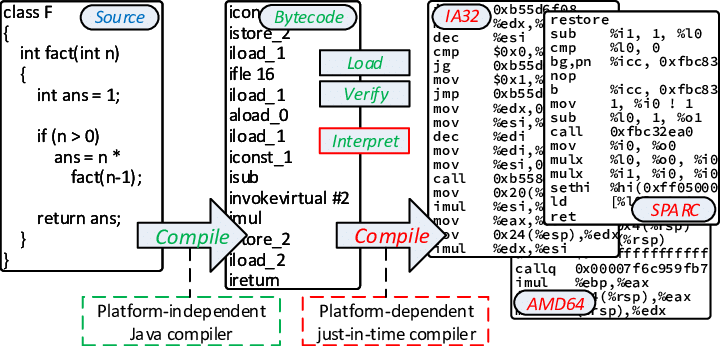 <a href="https://www.researchgate.net/figure/Java-source-code-is-first-compiled-to-bytecode-and-subsequently-interpreted-or-executed_fig1_318376879" target="_blank" style="position: absolute; bottom: -8px; left: 4px; font-size: 11px;">[src]</a> 
 
Source compiled once to bytecode, which the VM then interprets or JIT-compiles.
 
 -->


Pre-decoded, spelled out:

  The hard part (which operation, which variable slot) was decided at compilation
  and baked into the opcode + operand. The run-time loop therefore never
  inspects node types, follows child pointers, or recurses. It only
  fetches the next opcode and jumps to its handler.

  A tree-walker re-does that deciding on every execution, since the AST
  is the only form the program exists in.


The shell and R's default evaluator remain tree-walkers since code run once gains nothing from flattening. Bytecode by contrast requires an executor of its own. As machine code is bound to a specific ISA, bytecode is bound to a specific virtual machine (VM), a machine made of software rather than silicon. A system VM implements the full computer (§607#1.1), whereas an interpreter uses a [process VM]() that implements only a CPU, whose invented ISA (e.g. *BUILD_LIST*) exists in no silicon. The process VM is thus an ordinary user process that executes natively, delegates everything physical (memory, I/O) to its host OS<!-- trim: born at launch and gone at exit -->, and compiles for any platform, which earns bytecode its portability.<!-- trim: Being software earns the VM instructions tailored to the language's semantics. -->

The model is older than its slogan. [UCSD Pascal]() (1978) already compiled to [p-code]() that a small interpreter ran on any machine, 17 years before Sun sold the JVM as write once, run anywhere. Java (1995) popularised it with its [Java virtual machine]() (JVM) that became a compilation target of other languages (e.g. Scala, 2004). [Stack-based]() VMs (e.g. JVM, CPython) push and pop operands on an implicit stack, which keeps each instruction tiny and the compiler simple, whereas [register-based]() VMs name operand locations in each instruction and so need fewer of them. Lua switched from the former to the latter at 5.0 (2003), judging fewer dispatches worth the fatter encoding.


Stack-based (a + b):
  LOAD_FAST  a       # push a onto stack
  LOAD_FAST  b       # push b onto stack
  BINARY_ADD         # pop two, push result
  → 3 instructions, each small (opcode + one operand at most)

Register-based (a + b):
  ADD  r3, r1, r2    # one instruction encodes destination + two sources
  → 1 instruction, but more bytes to encode three register names


In particular, [CPython]() (1991) by Guido van Rossum<!-- trim: at CWI over the 1989 Christmas holidays as a hobby successor to ABC --> is a compiled C binary of the two halves, a compiler that turns source into bytecode held in code objects and a PVM for its execution. The bytecode consists of [operation codes]() (opcodes) paired with [operands](), each similar to an assembly mnemonic (e.g. *LOAD_FAST*, *BINARY_ADD*<!-- trim: *RETURN_VALUE* -->) whose operand indexes into the code object's tables (e.g. the [*dis*]() module disassembles bytecode into this readable form).<!-- trim: (e.g. constants, variable names, nested code objects) --> The compiled code objects are also serialised (§605#4.1) as \_\_pycache\_\_/\*.pyc ([PEP 3147](https://peps.python.org/pep-3147/)), and this disk cache spares recompilation between runs, until the source changes or the header's [magic number]() names another release.<!-- trim: Runtime type resolution on every operation still makes CPython roughly 10-100x slower than compiled C for CPU-bound logic, though the gap narrows for I/O-bound workloads where wait time dominates execution. -->


Physical vs Virtual — same three layers:

  Physical              Virtual
  ─────────             ─────────
  assembly    <->       opcode + operand (dis.dis)
      |                     |
  machine code <->      bytecode (.pyc)
      |                     |
  ISA / CPU   <->       VM (JVM, PVM)

  Top: human-readable. Middle: binary format. Bottom: executor.
  P2 covers bottom two rows, P3 covers top two.

Why not reuse machine code / x86 as the VM's instruction set?
  Bytecode is tailored to the language's semantics:
    - JVM: new (object alloc), invokevirtual (method dispatch), checkcast
    - CPython: LOAD_ATTR (dynamic lookup), DICT_MERGE, BUILD_LIST
    - x86: only registers, memory addresses, arithmetic — no notion of objects or dicts
  One bytecode instruction (e.g. CALL_FUNCTION) would require dozens of x86 instructions.
  Bytecode sits at a semantic sweet spot: high enough to express language abstractions
  in one or two instructions, low enough to be dispatched efficiently by the VM.


- 
 
 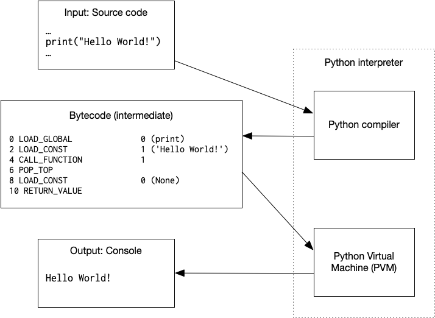 <a href="https://www.uvm.edu/~cbcafier/cs1210/book/02_programming_and_the_python_shell/programming.html" target="_blank" style="position: absolute; top: 4px; right: 4px; font-size: 11px;">[src]</a> 
 
The interpreter's two halves, a compiler emitting bytecode and a PVM executing it.
 

In the C source, the compilation entry point (i.e. *_PyAST_Compile* in Python/compile.c) transforms the AST into a [*PyCodeObject*](), which encapsulates the bytecode (*co_code*) with its tables (i.e. constants, names, closures). The PVM, C functions linked into that same binary<!-- trim: no separate program -->, executes it in a dispatch loop (i.e. *_PyEval_EvalFrameDefault* in Python/ceval.c, the evaluator in C, still named for *eval*), an ordinary C function behind a swappable pointer ([PEP 523]()). Each iteration fetches one opcode, decodes its operand, and jumps to the C handler that performs it, the fetch-decode-execute cycle (§601#1.2) rendered in software<!-- trim: dispatch via computed gotos, falling back to a switch statement on compilers without goto *; (e.g. *LOAD_FAST* fetches a local variable and pushes it onto the operand stack), and advances the instruction pointer -->. Note that the GIL lets a single thread into this loop at a time.

C pins machine code in the text segment and per-call state in a stack frame popped at return. CPython instead puts code object, function object, and [frame]() all on the heap managed by GC<!-- trim: lifetimes decided by the reference counts -->. The frame is the call's workspace, its locals and operand stack (*localsplus*)<!-- trim: the implicit stack the stack-based design assumed -->, linked to its caller (*f_back*) in the chain the [traceback]() prints<!-- trim: on an unhandled exception -->.<!-- trim: a chain mirroring the call stack --> On this ground stand the stateful functions. The function object is the first-class value and the surviving frame is the captured environment, which closures<!-- trim: (PEP 227, 2001) owned by 1.1 -->, generators ([PEP 255](), 2001), and coroutines ([PEP 492](), 2015) build on. For instance, a suspended generator keeps its frame frozen at the *yield*<!-- trim: operand stack and instruction offset intact -->, which may be seen as a user-space context switch (§604#1.3).<!-- trim: and a coroutine likewise at *await*, lets asyncio run thousands of tasks on one thread --><!-- trim: Since 3.11 plain frames live in contiguous per-thread memory and the heap *PyFrameObject* materialises only on demand (e.g. *sys._getframe*), which cheapened calls. -->


"Outlive the C stack" — why heap allocation matters:

  C stack (plates):          Heap (warehouse):

  ┌─────────────┐
  │ make_adder(5)│ ───────→  PyFrameObject
  ├─────────────┤            ├ f_back
  │   main()     │            ├ f_code
  └─────────────┘            └ locals: n=5  ← heap-allocated

  make_adder returns → plate removed, but frame stays:

  ┌─────────────┐
  │   main()     │            PyFrameObject  ← still alive!
  └─────────────┘            └ locals: n=5

  add5(3) → closure reads n=5 from the surviving frame.
  Same mechanism lets generators pause and coroutines suspend.

  In C, n dies when the function returns (stack-allocated).
  In Python, n persists on the heap until GC reclaims it.

Python 3.11 splits PyFrameObject into PyFrameObject + _PyInterpreterFrame.
Python 3.12 (PEP 709) inlines comprehensions rather than compiling them as nested functions.

 
The [adaptive interpreter]() ([PEP 659](https://docs.python.org/3/whatsnew/3.11.html#whatsnew311-pep659)) specialises hot opcodes (e.g. *BINARY_OP* → *BINARY_OP_ADD_INT*) but does not close the dispatch gap<!-- trim: narrows the dispatch overhead --> for compute-heavy workloads. Performance-critical Python instead bypasses the interpreter through [C extensions](), as NumPy delegates linear algebra to BLAS/LAPACK, PyTorch dispatches to CUDA kernels, and the standard library itself wraps C implementations (e.g. *json*, *re*<!-- trim: , *hashlib* -->). The bindings come via CPython's C API, Cython, or *pybind11*<!-- trim: , ctypes/cffi -->, and the shipped wheels must match the interpreter's ABI unless built to the [stable ABI]() (*abi3*, [PEP 384]())<!-- trim: spanning releases -->. Python orchestrates while heavy computation runs at native speed, which is why it dominates ML and scientific computing<!-- trim: despite its interpreter overhead -->.

- 
 
 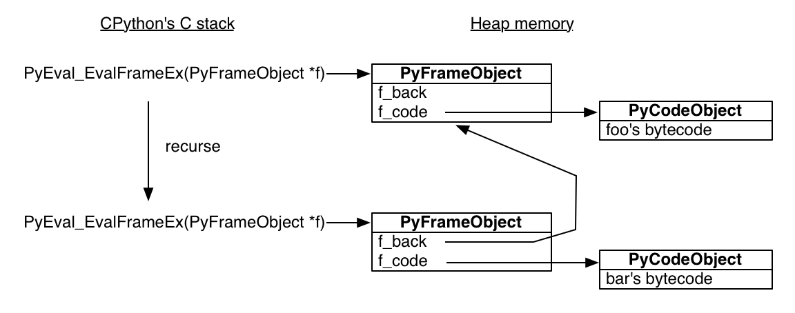 <a href="https://aosabook.org/en/500L/a-web-crawler-with-asyncio-coroutines.html" target="_blank" style="position: absolute; bottom: -8px; left: 4px; font-size: 11px;">[src]</a> 
 
Each call links a heap PyFrameObject to its caller via f_back while the C stack recurses.
 

<!-- - 
 
 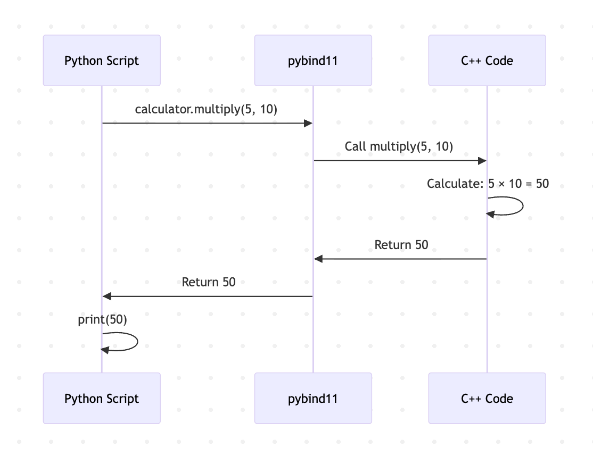 <a href="https://medium.com/@manish.surya.r/a-minimal-pybind11-eample-calling-c-from-python-61352b8306da" target="_blank" style="position: absolute; bottom: -8px; right: 4px; font-size: 11px;">[src]</a> 
 
A Python call crossing pybind11 into C++ and returning with the result.
 
 -->

<!-- - <iframe width="485" height="280" src="https://www.youtube.com/embed/3PcIJKd1PKU?si=a7VnJqSVAdW54VsY" title="YouTube video player" frameborder="0" allow="accelerometer; autoplay; clipboard-write; encrypted-media; gyroscope; picture-in-picture; web-share" referrerpolicy="strict-origin-when-cross-origin" allowfullscreen></iframe> -->


Two nested fetch-decode-execute loops:

┌─────────────────────────────────────────────┐
│              Physical CPU                   │
│          fetch-decode-execute               │
│          on machine instructions            │
│                                             │
│  ┌───────────────────────────────────────┐  │
│  │     CPython process (C binary)        │  │
│  │                                       │  │
│  │  ┌─────────────────────────────────┐  │  │
│  │  │    PVM eval loop (ceval.c)      │  │  │
│  │  │    fetch-decode-execute         │  │  │
│  │  │    on bytecode                  │  │  │
│  │  │                                 │  │  │
│  │  │  BINARY_ADD                     │  │  │
│  │  │    │                            │  │  │
│  │  │    ▼                            │  │  │
│  │  │  PyNumber_Add()  ← C code       │  │  │
│  │  │    │                            │  │  │
│  │  └────│────────────────────────────┘  │  │
│  │       │                               │  │
│  └───────│───────────────────────────────┘  │
│          │                                  │
│          ▼                                  │
│    x86/ARM instructions                     │
│    (add, mov, cmp, jmp...)                  │
│    executed by hardware                     │
│                                             │
└─────────────────────────────────────────────┘

With JIT, the inner box disappears:
bytecode → JIT compile → x86/ARM → physical CPU directly


### **3.2. Just-In-Time Compilation**

 

[Just-in-time]() (JIT) compilation translates source into machine instructions during execution, pairing the interpreter's schedule with the AOT compiler's output. The runtime however [profiles]() execution to identify the frequently executed regions (i.e. [hot spots]()), and restricts compilation to the small fraction of the codebase that dominates the running time, as the [90/10 rule]() measured by Knuth (1971) on the FORTRAN programs<!-- roughly 90% of a program's execution time is spent in about 10% of its code; measured by Knuth on FORTRAN programs (under 4% of code taking half the time), the 90/10 name is later folklore popularised by Hennessy and Patterson -->. Compilation is deferred into the run because only the executed program reveals where the hot spots lie. Ideally, the hybrid achieves interpret-less speed at compile-less overhead, nearing what those extensions deliver without their rewriting effort.

A JIT compiler arbitrates the pull between interpret-less and compile-less by counting function and loop executions. It compiles a region over the threshold, patches its call site, and later calls skip the interpreter.<!-- trim: into machine code --> Observed runtime types enable [speculative optimisations]() an AOT compiler cannot make and [deoptimisation]() reverses them when an assumption fails.<!-- trim: or a [polymorphic inline cache]() memoising method lookup at each call site; falling back to the interpreter --> Production runtimes further stack tiers from a fast baseline to a slower optimiser and promote a region upward as its count rises. Runtime compilation predates its name, from QED (Ken Thompson, 1968) compiling regular expressions mid-run up to CPython gaining a JIT in 3.13 (2024) under the <!--un-retired--> Guido van Rossum.

<!-- - 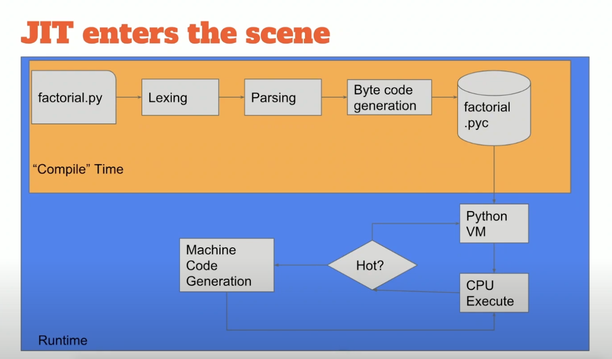 -->

<!-- - 
 
  <a href="https://onlinelibrary.wiley.com/doi/10.1002/spe.3267" target="_blank" style="position: absolute; top: 0px; left: 4px; font-size: 11px;">[src]</a> 
 
Interpreter and JIT pipelines compared across Python implementations.
 
 -->

<!-- - 
  <a href="https://thevaluable.dev/difference-between-compiler-interpreter/" target="_blank" style="position: absolute; bottom: -8px; right: 4px; font-size: 11px;">[src]</a> 
 -->

The same pull recurs in the deep learning frameworks, [TensorFlow]() (Google, 2015) and [PyTorch]() (Facebook, 2017), where the compilation unit is a tensor program. Each implements the program's two primitives, the tensor, an order-$n$ array of the coordinates of a multilinear object in fixed bases, and differentiable operations on tensors (e.g. matrix multiplication). A neural network amounts to a composition $f_\theta = f_k \circ \cdots \circ f_1$ of those operations, and trained by gradient-based optimiser whose every step requires $\partial J/\partial \theta_i$ of the objective $J$ w.r.t. each parameter $\theta_i$. Both frameworks build a graph to backpropagate the gradients but differ in when it is formed and how it is executed.<!-- trim: PyTorch tried AOT first, found the graph purchasable only by a rewrite, and reached the JIT after that retreat. --> 

PyTorch adopted [define-by-run]() (i.e. eager execution) and forms a [dynamic computation graph]() (DCG) as the model runs. Each operation dispatches its kernel on its Python line, and hence debuggers, *print*, and native control flow apply unchanged. TensorFlow committed to [define-and-run]() (i.e. graph execution) where the user constructs a [static computation graph]() (SCG)<!-- trim: of tensor operations --> and executes it in a session. The SCG is therefore optimisable and exportable whole before it runs. While research widely embraced eager execution (Paszke et al., 2019), even TF 2.0 (2019) made it the default, and the easier graph had quietly lost to the easier code, a verdict the compiler would reopen.<!-- trim: The convenience settled the field, as the framework whose graph was easiest to build lost to the one whose code was easiest to write. --><!-- trim: The convenience carries a cost, as the graph a compiler needs never exists whole, only as kernels already dispatched. -->

- 
 
 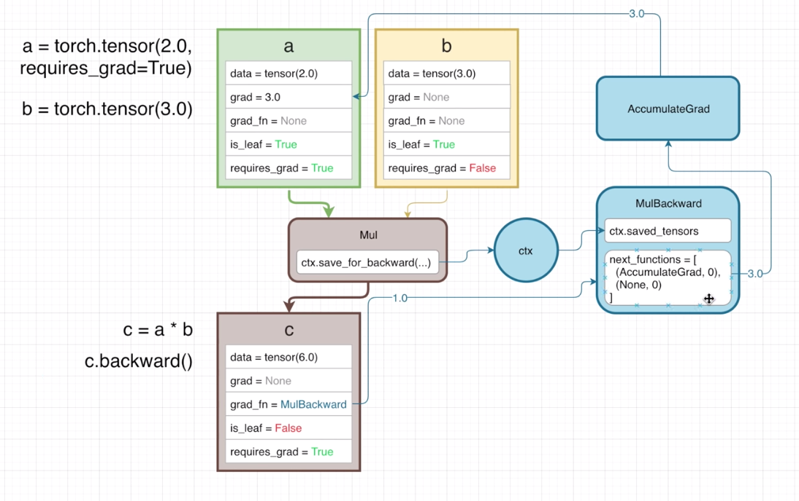 <a href="https://www.kaggle.com/code/residentmario/pytorch-autograd-explained" target="_blank" style="position: absolute; top: 4px; right: 4px; font-size: 11px;">[src]</a> 
 
A single multiplication recorded, where the output's grad_fn reaches the backward node whose next_functions route the gradient to the leaf that requires it. See <a href="http://blog.ezyang.com/2019/05/pytorch-internals/">PyTorch internals</a> (Yang, 2019).
 

Yet eager's DCG is built solely for the $\partial J/\partial \theta_i$ and survives a single forward-backward pass. Specifically, [Autograd]() records each operation on a *torch.Tensor* with *requires_grad=True* into a graph of *torch.autograd.Function* objects rooted at the output's *grad_fn*, such that *.backward()* traverses it in reverse (reverse-mode [automatic differentiation]()). Reverse suits a network mapping many parameters to one scalar objective, as one traversal yields every partial derivative. The record is therefore a tape of what executed<!-- trim: , not what was written -->, rebuilt each forward pass, divergent when a branch differs, discarded once backward consumes it. A compiler is left with no persistent graph to optimise or export.

The [transformer]() architecture (Vaswani et al., 2017) made that persistent graph worth having, the need urgent on three counts and none met by eager's one precompiled kernel per operation, i) throughput: its elementwise kernels have low arithmetic intensity and sit under the bandwidth ceiling (§601#2.3), as *(a + b) * c* writes the sum to HBM and reads it straight back for the product, a round trip that only a compiler seeing both can fuse away by keeping the sum in SRAM ([He, 2022]()); ii) deployment: the artefact must carry neither Python nor a GIL which serialises concurrent requests; iii) portability: one graph must retarget to accelerators no hand-written kernel would reach.

Billed as the bridge to production, [TorchScript]() (PyTorch 1.0, 2018) captures the model AOT as a persistent SCG written in TorchScript IR, as [*torch.jit.trace*]() tapes the path a mock input exercises and [*torch.jit.script*]() parses the source to preserve control flow. Either serialises to a *.pt* archive, yet no machine code is emitted despite the *torch.jit* namespace. Execution then falls to [LibTorch](), PyTorch's Python-free C++ distribution, whose interpreter walks the graph node by node into the same precompiled kernels, the way CPython walks bytecode. The architecture tackled deployment alone, while the rewrite of an existing model into its typed Python dialect cost eager's convenience.


The rewrite into the TorchScript dialect.

1. NumPy has no TS type, so calls become tensor ops:
   before: x = np.sqrt((a ** 2).sum())
   after:  x = torch.sqrt((a ** 2).sum())

2. dynamic Python is removed, so module containers become typed registries:
   before: self.blocks = {'enc': enc, 'dec': dec}
   after:  self.blocks = nn.ModuleDict({'enc': enc, 'dec': dec})

3. TS IR is statically typed, so annotations are added
   (unannotated arguments default to Tensor):
   before: def forward(self, x, n):
   after:  def forward(self, x: Tensor, n: int):


The TorchScript IR it captured is domain-level, just below the source, far above the loop-level and scalar IRs of machine code, and each node names a whole tensor operation that LLVM IR dissolves into scalar arithmetic. It differs from LLVM IR only in its atoms, the form a shared typed SSA graph. The altitude keeps a graph rewrite tractable, as each optimisation applies where its structure is visible, and the middle-end passes followed (e.g. dead-code elimination, constant propagation, a limited NNC fusion of elementwise chains). The descent is one-way, lowering discards structure no pass can recover, and TorchScript's stopped above the loops, where it sits in maintenance.

- 
 <iframe src="../assets/blog/ir-ladder.html" width="620" height="185" style="border: none; overflow: hidden;" scrolling="no"></iframe> 
The 1.x stack twice, its components on the left and one source line descending every altitude on the right.
 


The IR ladder, one source line at every altitude. y = x @ w stays a single
matmul node through the graph IRs, becomes loops at the cliff, and the word
never appears again below it.

y = x @ w  (Python source, PEP 465)
        |
CPython bytecode           LOAD_FAST x; LOAD_FAST w; BINARY_OP @
        |
TorchScript IR             %y : Tensor = aten::matmul(%x, %w)     \
Torch IR (FX graph)        %y = call_function[target=torch.matmul] > one node = whole op
ATen IR (FX graph)         %y = aten.mm(%x, %w)                   /
        |
------- the cliff: node -> loops, matmul unrecoverable below -------
        |
Inductor IR                for i0, i1: ops.load(x,..) ops.load(w,..) ops.store(y,..)
Triton IR (TTIR)           %c = tt.dot %a, %b        (tiles, last trace of the word)
        |
LLVM IR                    %3 = fadd float %1, %2 ; %4 = fmul float %0, %2
        |
PTX / machine code         fma.rn.f32 %f4, %f1, %f2, %f3

lowering: easy, one-way down. raising: intractable. TS IR, Torch IR, and ATen IR
are one altitude in three notations. TS stopped at the top band and interpreted
it; torch.compile rides the ladder to the bottom.


[torch.compile]() (PyTorch 2.0, 2023) moved capture into the run. Front-end, IR, and back-end make up this tracing JIT (i.e. compiling what it executes).<!-- trim: , not what is written --> Its front-end [TorchDynamo]() replaces CPython's frame-evaluation pointer (PEP 523), walks the bytecode, and extracts tensor operations into an [FX graph]() (Reed et al., 2022) in Torch IR. The run produces many guarded subgraphs (i.e. partial SCGs) rather than the one whole graph TorchScript demanded upfront. The SCGs descend through the back-end to machine code, winning the throughput that graph-walking never did. Nothing need be rewritten, as the untraceable is handed back rather than rejected, eager's price refunded.<!-- trim: which is the whole of TorchScript's price refunded -->

<!-- - 
 
 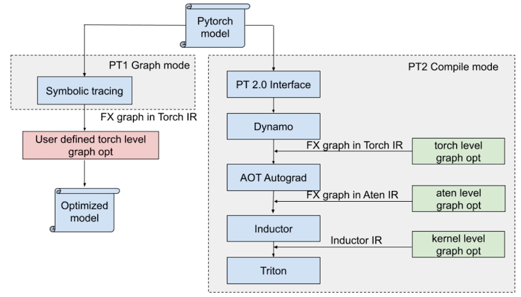 <a href="https://x.com/PyTorch/status/1735693331747774541" target="_blank" style="position: absolute; top: 4px; right: 4px; font-size: 11px;">[src]</a> 
 
Symbolic tracing handing the user a graph to optimise, against the compile-mode stack that lowers it through Torch IR, ATen IR, and Inductor IR on its own.
 
 -->

The first bound on the gain is what is visible to the front-end and the same limit leaves the SCGs partial. A [graph break]() arises where the bytecode walk meets Python it cannot trace<!-- trim: symbolically --> (e.g. a data-dependent branch, *.item()*). The break splits the function into subgraphs stitched by resume functions that the plain interpreter runs. *torch._dynamo.explain* lists each break and its cause, while *fullgraph=True* turns the silent split into an error. The break costs more than the interpreted stretch itself, since fusion cannot cross the boundary and the live tensors at it must be materialised for the interpreter to hold. A break inside the innermost loop can thus consume the whole gain.

The other bound is what the trace assumed, recorded as [guards]() (e.g. dtypes, shapes) rechecked on every later call. An unseen shape fails its guard and forces a retrace. The second shape is what teaches the compiler because automatic dynamic marks the dimension that moved and retraces it with a symbolic size (*SymInt*) that any later shape satisfies. [Dynamic shapes]() may instead be declared up front to skip the wasted first pass. The tolerance is finite, since a frame recompiled past *cache_size_limit* (eight by default) is abandoned to the interpreter permanently, the speculation and deoptimisation of any JIT replayed on tensors.

<!-- - 
 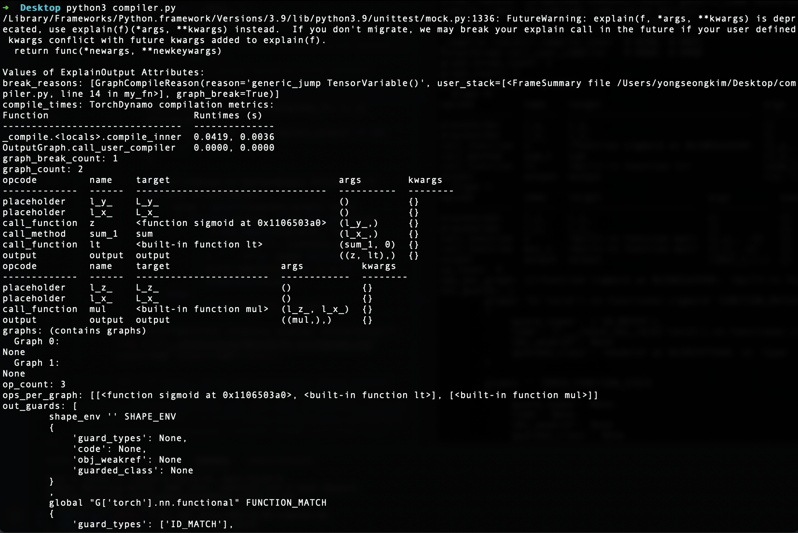 
TorchDynamo reporting a graph break and the guards the trace depends on.
 
 -->

- 

    

      
      <a href="https://docs.pytorch.org/docs/2.13/user_guide/torch_compiler/torch.compiler_dynamo_overview.html" target="_blank" style="position: absolute; bottom: -8px; right: 4px; font-size: 11px;">[src]</a>
      
Each call diverted into guards, a graph, and bytecode.

    

    

      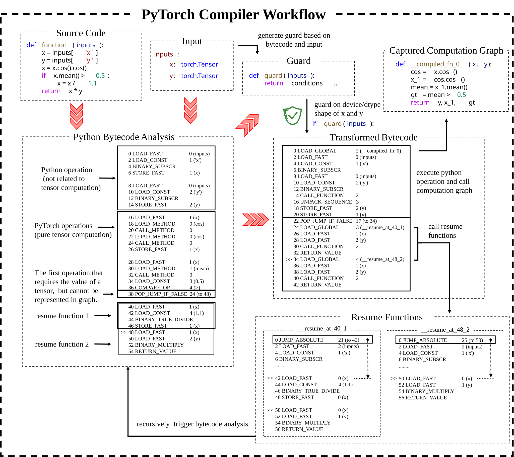
      <a href="https://depyf.readthedocs.io/en/latest/walk_through.html" target="_blank" style="position: absolute; bottom: -8px; right: 4px; font-size: 11px;">[src]</a>
      
A graph break, with resume functions either side of it.

    

  

The descent through the back-end begins ahead of execution, as [AOTAutograd]() traces the forward and backward passes together, where eager autograd builds the backward lazily. Holding both lets the compiler optimise them jointly (e.g. recomputing a cheap activation in backward over storing it). Along the way the 2,000+ operators of [ATen]() ("A Tensor Library"), PyTorch's C++ tensor library over the vendor kernels of MKL, cuDNN, and cuBLAS, are decomposed into roughly 250 primitive operations. A new back-end need implement only the primitives. The result is a pair of FX graphs in ATen IR, a stable contract between capture and code generation.

[TorchInductor](), the default back-end, lowers ATen IR into its own loop-level IR. It then applies loop tiling, memory planning, and [kernel fusion](), which folds chains of pointwise operations into a single kernel to spare round trips through GPU memory. It emits [Triton]() kernels for GPUs and C++/OpenMP for CPUs. The back-end is pluggable, as TensorRT, XLA, and IPEX register through the same interface and [torch-mlir]() routes the graph into MLIR's Torch dialect for hardware the stack has never met. Some hardware admits nothing else, as AWS [Inferentia]() and [Trainium]() instances run only what their Neuron compiler emits, making capture a precondition of running rather than an optimisation.

The warm-up bill remains, as the first calls pay for tracing and compilation. Deployment therefore settles it ahead of time. [torch.export]() captures the whole program as a single graph with no Python fallback, [AOTInductor]() compiles that graph into a shared library which serves without the interpreter<!-- trim: free of Python -->, and [ExecuTorch]() carries it onto mobile. Together they retire TorchScript's last deployment role. The trade has measured well, as the PyTorch 2 paper (Ansel et al., 2024) reports geometric-mean speedups of 2.27x for inference and 1.41x for training on an A100 across 180+ models, each from a one-line change.

- 
 
 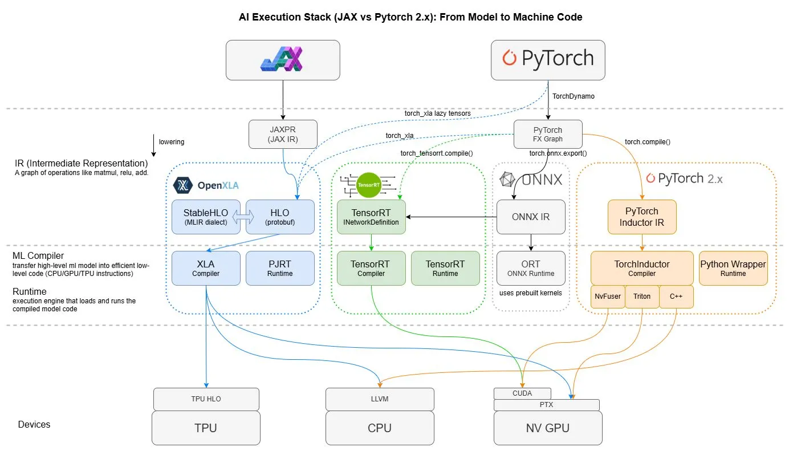 <a href="https://medium.com/@nijesh-kanjinghat/deep-learning-in-practice-a-technical-comparison-of-pytorch-and-jax-6458a115dcde" target="_blank" style="position: absolute; bottom: -8px; right: 4px; font-size: 11px;">[src]</a> 
 
Capture, IR, compiler, and runtime layers carrying a model down to TPU, CPU, and GPU instructions.
 

