# Operating System

---
> A digital computer without an [operating system](https://www.youtube.com/watch?v=26QPDBe-NB8) (OS) is just bare metal. The OS is the foundational [systems software](), a program which provides services to other programs rather than directly to users, managing hardware resources so that application software does not have to. Its kernel manages what runs (processes and threads), where it lives in memory (virtual memory and page tables), and what it reads and writes (files, devices, and the uniform file descriptor interface).


<!-- https://pravin-hub-rgb.github.io/BCA/resources/sem2/operating_sys/index.html -->
<!-- https://www.jmeiners.com/lc3-vm/#:lc3.c -->
<!-- https://www.youtube.com/watch?v=ioJkA7Mw2-U -->
<!-- https://www.youtube.com/watch?v=xFMXIgvlgcY -->
<!-- https://youtu.be/eP_P4KOjwhs?si=gOPQIxLH6cQMk8vq -->

<!-- round robin, fifo, ... -->
<!-- If data is large or its size varies, we use heap, and in stack, we just maintain a reference (i.e. pointer) to the value.... The *malloc* function in C internally uses *mmap* to free up a dedicated space and reclaim the OS for reusability. *free* does .... By using linked list, we do not need large amounts of contiguous memory, although this data structure leads to decreased probabilities of cache hits. If our aim is to maintain compactness in our list, what we need is an array list (e.g. an array wrapped in the C struct with relevant metadata) -->

## I

---

### **1.1. History**

<p style="margin-bottom: 12px;"> </p>

The earliest generation of electronic computers (1940s-50s), such as the ENIAC, were programmed manually in pure machine code by rewiring circuits or feeding in [punched cards](https://www.youtube.com/watch?v=kKJxzay85Vk). Programs ran in isolation, required laborious setup, and left machines idle between jobs. The concept of an OS emerged in the 1950s with <!-- the introduction of --> [batch processing systems]() which grouped similar jobs for sequential execution without manual intervention. <!-- (i.e. favoured homogeneity within a batch) --> A key example is GM-NAA I/O, developed <!-- developed by General Motors (GM) --> for the IBM 704, which used control cards to interpret jobs and automate execution, and whose successors (SOS, IBSYS) later scheduled Fortran jobs.

The 1960s marked a shift toward [time-sharing systems]() (TSS) and [multiprogramming](), which admitted [concurrent execution]() of multiple programs residing in memory by rapidly switching the CPU among them. This trajectory produced [Multics](), a pioneering TSS jointly built by AT&T Bell Labs, GE, and MIT to support a robust, multi-user computing environment. However, discontent with its complexity prompted researchers at Bell Labs to develop [Unix]() in 1969. This newer and simpler OS incorporated a modular kernel, hardware abstraction, and multi-user support, and these principles remain central to modern operating system design.

The 1980s ushered in the era of personal computing, shifting OS development from [command-line interfaces]() (CLI) to [graphical user interfaces]() (GUI) to improve accessibility for non-technical users. Microsoft introduced [MS-DOS]() in 1981, a single-tasking CLI-based OS, followed by successive versions of [Windows]() that adopted cooperative and later preemptive multitasking. Around the same time, Apple’s [Macintosh]() system software (later Mac OS, now macOS) brought the GUI into mainstream. In the 1990s, [Linux]() emerged as a free and open-source Unix-like alternative, that became a foundation for innovation across servers, mobiles, and embedded systems.

What emerged from this history is a common set of abstractions that shield programs from hardware: i) A process refers to the running program with its isolated execution environment; ii) virtual memory lets each process have the illusion of a large contiguous address space independent of physical RAM; iii) file descriptors present all I/O endpoints <!-- e.g. regular files, devices, sockets, pipes --> via a uniform read/write interface. These abstractions decouple programs from specific hardware, so the same source code compiles and runs on any machine the OS supports ([portability]()). §I traces the Unix and Linux lineage that shaped them, §II examines the kernel internals, and §III examines each abstraction in turn.

<!--
Programs need hardware resources but cannot touch hardware directly.
The OS provides three abstractions as safe, uniform request interfaces:

| Resource | What the program wants | Abstraction | How the kernel fulfils it | Data structure | §  |
|----------|----------------------|-------------|--------------------------|----------------|-----|
| CPU | execution time | Process (+ threads) | schedules threads onto cores | task_struct | 3.1 |
| Memory | RAM | Virtual memory (pages) | maps virtual pages to physical frames | mm_struct | 3.2 |
| Everything else  (i.e. IO Devices) | disk, network, GPU, pipes, ... | File descriptor (fd) | dispatches read/write to the right driver | files_struct | 3.3 |

"File" in Unix means any I/O endpoint exposed through a file descriptor:
  - Regular files: data on disk (.txt, .csv, .py)
  - Directories: map names to inodes
  - Device files: hardware as /dev/* (e.g. /dev/sda, /dev/nvidia0)
  - Sockets: network connections (TCP/UDP)
  - Pipes: byte streams between processes (ls | grep foo)
  - Pseudo-files: /proc/cpuinfo, /sys/ (live kernel state, not on disk)
All accessed through the same open()/read()/write()/close() interface.
-->

- ...
<!-- - <iframe width="500" height="300" src="https://www.youtube.com/embed/tc4ROCJYbm0?si=lv-t2ZqX56CZWqMJ" title="YouTube video player" frameborder="0" allow="accelerometer; autoplay; clipboard-write; encrypted-media; gyroscope; picture-in-picture; web-share" referrerpolicy="strict-origin-when-cross-origin" allowfullscreen></iframe> -->

### **1.2. Unix**

<p style="margin-bottom: 12px;"> </p>

Unix emerged in 1969 at Bell Labs, when Ken Thompson and Dennis Ritchie (Turing Award, 1983) repurposed a spare [PDP-7]() minicomputer to build a lightweight alternative to Multics. Where Multics pursued complexity, Unix pursued simplicity: a small kernel, a [hierarchical file system]() (HFS), and a minimal API with a clean separation between kernel mechanisms and user-space utilities. In the early 1970s, Unix was rewritten from assembly into C, also created by Ritchie, making it the first widely portable operating system. The design decisions that followed shaped the three abstractions examined in §III (process, virtual memory, file).

Before Unix, each class of device (disk, tape, terminal, printer) required its own set of I/O instructions and access methods<!-- e.g. IBM OS/360 had QSAM for sequential, BSAM for block-level, ISAM for indexed — all with different assembly macros and JCL parameters; C did not exist yet -->, coupling programs to specific hardware. Unix’s central design decision was the "everything is a file" abstraction, which collapsed all I/O behind a single [open]()/[read]()/[write]()/[close]() interface so that a program reading bytes need not know whether they come from a disk, a keyboard, or a network. On top of this uniform interface, Unix introduced the [fork-exec-wait]() process model, pipes (added in 1973 at Doug McIlroy’s insistence, wiring one program’s output to another’s input), and signals for asynchronous notification. Combined with plain-text configuration, these primitives made the environment composable and scriptable.

<!--
"Everything is a file" — why it matters

Before Unix (1960s), every device class required its own I/O instructions and access methods.
C did not exist yet — programs were written in assembly, Fortran, or COBOL.
On IBM OS/360, for example:
  sequential tape/disk → QSAM (queued sequential access method)
  block-level I/O      → BSAM (basic sequential access method)
  indexed records      → ISAM (indexed sequential access method)
Each had different assembly macros, supervisor calls (SVCs), and JCL parameters.
Programs were tightly coupled to specific device classes.

Thompson & Ritchie’s insight: make every I/O source a stream of bytes behind one interface.
The file descriptor (fd) is just a number the kernel returns when you open something:

  int fd1 = open("/home/ken/notes.txt", O_RDONLY);  // regular file → fd 3
  int fd2 = open("/dev/tty", O_RDWR);               // terminal    → fd 4
  int fd3 = open("/dev/lp0", O_WRONLY);              // printer     → fd 5

  read(fd1, buf, 100);   // read from file
  read(fd2, buf, 100);   // read from keyboard — same function

The program doesn’t know or care what it’s talking to.

Before Unix:
  Program A (disk)     → disk-specific code
  Program B (tape)     → tape-specific code
  Program C (terminal) → terminal-specific code

With Unix:
  Program A (fd)       → works with everything

This enabled pipes (|):
  1. kernel creates a pipe (a temporary "file" in memory)
  2. cat’s stdout (fd 1) → pipe’s write end
  3. wc’s stdin  (fd 0) → pipe’s read end
  4. neither program knows — cat writes bytes, wc reads bytes

Every process starts with three fds:
  fd 0 = stdin,  fd 1 = stdout,  fd 2 = stderr
Shell redirection just swaps which "file" fd 0/1/2 point to before exec().
The program itself has no redirection code.

Devices as files (/dev/):
  /dev/null    → black hole        /dev/zero   → infinite zeros
  /dev/random  → random bytes      /dev/sda    → raw disk access

  dd if=/dev/sda of=/dev/sdb       — clone a drive with a file copy tool
  head -c 16 /dev/random | base64  — generate a password
  ./noisy > /dev/null              — silence output

No "disk cloning API" or "random number API" needed. Just read and write.

Linux extended the idea with /proc and /sys:
  cat /proc/cpuinfo                              — CPU info, just a file
  echo 1 > /proc/sys/net/ipv4/ip_forward         — change kernel settings
  cat /sys/class/power_supply/BAT0/capacity       — battery percentage
(/proc originated in 8th Edition Unix 1984 and Plan 9, not a Linux invention.)

Contrast — Windows uses specialised interfaces:
  Files     → CreateFile/ReadFile    Registry → RegOpenKey/RegSetValue
  Processes → OpenProcess            Network  → Winsock
  Devices   → DeviceIoControl        Services → OpenService
Each is a separate system. Tools don’t compose naturally.

Why the abstraction endures:
  1. Simplicity     — one interface, not dozens
  2. Composability  — small tools chain via pipes
  3. Orthogonality  — programs ignore I/O details; the kernel handles routing
  4. Fewer bugs     — one well-tested read/write path instead of many special-purpose ones

A tool written in 1975 still works in a 2026 pipeline because the interface never changed.
-->

As AT&T was restricted by a 1956 antitrust consent decree from commercialising Unix, it spread freely through academia. The [Berkeley software distribution]() (BSD), launched in the late 1970s by Bill Joy at UC Berkeley, evolved from a set of enhancements into a full OS that contributed the first complete TCP/IP stack and became a reference platform for early Internet development. BSD’s code lives on in FreeBSD, Apple’s [Darwin]() (the Unix core of macOS/iOS), and even Windows networking. Meanwhile, Bell Labs continued with [Plan 9]() (1980s), which pushed the "everything is a file" abstraction to network and system resources, influencing Linux’s */proc* and */sys*. As Unix variants proliferated and diverged, the IEEE introduced the [Portable Operating System Interface]() (POSIX) standard in the late 1980s, codifying a portable API around processes, file descriptors, and signals that unified the fragmented landscape.

<!-- - <div style="position: relative; display: inline-block;"> 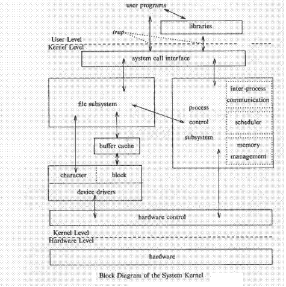 <a href="http://unixbyrahul.50webs.com/unix2.html" target="_blank" style="position: absolute; bottom: -8px; right: 4px; font-size: 12px;">[src]</a> </div> -->

- <div style="position: relative; display: inline-block;"> 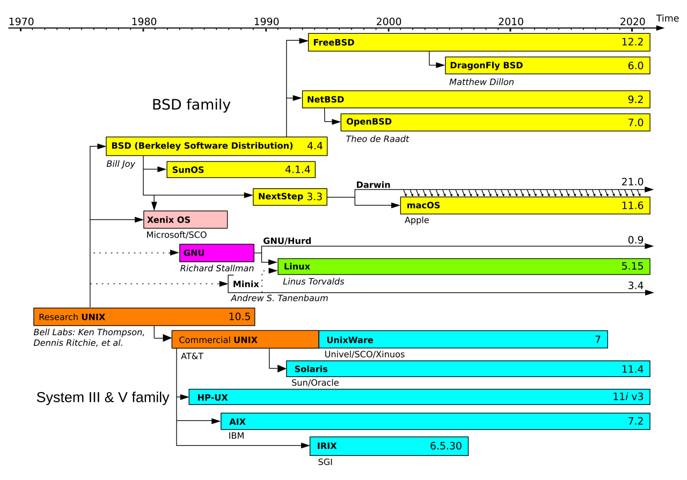 <a href="https://en.wikipedia.org/wiki/Unix-like" target="_blank" style="position: absolute; bottom: -8px; right: 4px; font-size: 12px;">[src]</a> </div>


### **1.3. Linux**

<p style="margin-bottom: 12px;"> </p>

[Linux](https://www.youtube.com/watch?v=E0Q9KnYSVLc&source_ve_path=MjM4NTE&embeds_referring_euri=http%3A%2F%2F127.0.0.1%3A4000%2F) began in 1991 as a personal project by Linus Torvalds to build a free, Unix-like kernel for the Intel 80386 architecture. Inspired by [MINIX]() (a teaching OS by Andrew Tanenbaum) and licensed under the [GPL](), it attracted contributions from developers worldwide and was paired with the [GNU Project]()’s user-space tools (e.g. gcc, glibc, coreutils) to form a complete open-source operating system. Unlike proprietary Unix systems tied to specific vendors, Linux grew through a decentralised, community-driven model, a development approach that would later be mirrored by the open-source AI community (e.g. Hugging Face, PyTorch, llama.cpp).

Architecturally, Linux uses a [monolithic kernel](), integrating core services such as process scheduling, virtual memory, networking, and file systems into a single privileged binary. To balance this with modularity, it supports [loadable kernel modules]() (LKMs) that allow dynamic insertion of drivers and extensions at runtime without rebooting. Written in portable C, Linux was quickly ported beyond x86 to architectures including ARM, PowerPC, and SPARC, and later incorporated features such as [control groups]() (cgroups), [namespaces](), and pluggable schedulers, features that now underpin containerised workloads (§607).

Though not derived from any Unix source tree, Linux closely follows POSIX standards and Unix design principles. By the early 2000s, it had displaced proprietary Unix as the dominant OS for servers and infrastructure. Today, it runs on everything from Android smartphones to all [Top500]() supercomputers, and serves as the default runtime for virtually all large-scale ML workloads. Cloud ML platforms (e.g. AWS SageMaker) run Linux-based containers, as do distributed training frameworks (e.g. DeepSpeed, Megatron-LM) and inference servers (e.g. vLLM, TGI), because its open-source nature and fine-grained hardware control make it the natural fit.

- <div style="position: relative; display: inline-block;"> 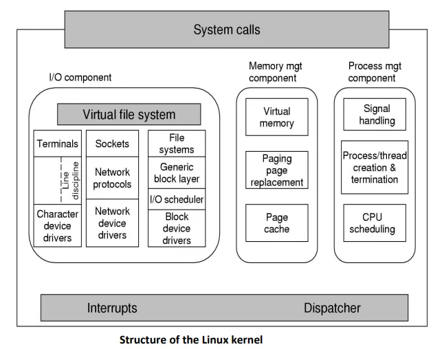 <a href="https://examradar.com/linux-architecture-linux-kernel-structure/" target="_blank" style="position: absolute; top: 4px; right: 4px; font-size: 12px;">[src]</a> </div>

<!-- ### **Linux Distribution**
<p style="margin-bottom: 12px;"> </p>

A Linux distribution (or "distro") bundles the Linux kernel with a curated set of user-space utilities, libraries, configuration defaults, and package management tools to form a complete operating system. As the Linux kernel alone is insufficient for end users, distributions emerged to provide usable environments tailored to various audiences—ranging from desktop users and system administrators to developers, embedded engineers, and cloud providers. Early distributions such as Slackware (1993), Debian (1993), and Red Hat Linux (1995) laid the groundwork for today’s ecosystem.

Each distribution makes distinct choices in areas such as init systems (e.g. systemd, OpenRC), packaging formats (e.g. .deb, .rpm, source-based), file system layout, release cadence, and included software stacks. For example, Debian emphasizes stability and is widely used as a base for derivatives like Ubuntu, which targets usability and long-term support for both desktops and servers. Red Hat Enterprise Linux (RHEL), and its derivatives like CentOS and AlmaLinux, prioritize commercial support and certification for enterprise workloads, while Arch Linux focuses on minimalism, rolling releases, and user control.

Distributions also diverge in tooling and update strategies. Package managers like apt, dnf, and pacman streamline software installation and system updates, while meta-tools like snap or flatpak aim to standardize application delivery across distros. Despite differences, most distributions remain interoperable through shared adherence to standards like POSIX, FHS, and the Linux Standard Base (LSB). As such, the choice of distribution often reflects the target use case, administrative preferences, or hardware constraints, rather than incompatibilities in the underlying Linux system.
 -->

<!-- - <iframe width="475" height="290" src="https://www.youtube.com/embed/E0Q9KnYSVLc?si=3xrEkT-sMcskztqz" title="YouTube video player" frameborder="0" allow="accelerometer; autoplay; clipboard-write; encrypted-media; gyroscope; picture-in-picture; web-share" referrerpolicy="strict-origin-when-cross-origin" allowfullscreen></iframe> -->

## II

---


Application developer + libc (user space)
│
│  // C source — open() and read() are libc wrappers
│  \#include <fcntl.h>
│  int fd = open("data.csv", O_RDONLY);
│  read(fd, buf, 4096);
│  close(fd);
│
│  // compiler (gcc/clang) generates:
│  mov rax, 2          // syscall number for open
│  mov rdi, <addr>     // pointer to "data.csv"
│  mov rsi, 0          // O_RDONLY
│  syscall              // trap to kernel
│  // kernel returns fd in rax
│
├─────────────────────────────────────────────────────
│  Kernel (Linux)
│
│  sys_open():
│    vfs_open()
│      → resolve path "data.csv" to inode
│      → allocate fd table entry
│      → return int fd to user space
│
│  sys_read(fd, buf, 4096):
│    vfs_read()
│      → check page cache (hit? return from RAM)
│      → miss? dispatch to filesystem
│
├─────────────────────────────────────────────────────
│  Device driver (.ko)
│
│  ext4_read():
│    → compute block number from inode
│    → submit I/O request to block layer
│    → block layer programs DMA controller
│    → returns; hardware will interrupt when done
│
├─────────────────────────────────────────────────────
│  Hardware (SSD)
│
│  NVMe controller:
│    → reads submission queue entry
│    → fetches blocks from NAND flash
│    → DMA writes data to RAM (page cache)
│    → raises MSI-X interrupt → driver → kernel
│    → kernel copies to user buf, wakes process


### **2.1. Kernel (+ Shell)**

<p style="margin-bottom: 12px;"> </p>


linux/
├── arch/           # architecture-specific (x86, arm64, riscv, ...)
│   ├── x86/
│   │   ├── boot/           # bootloader handoff
│   │   ├── kernel/         # trap handlers, syscall entry, context switch
│   │   ├── mm/             # page table format, TLB flush
│   │   └── include/        # register layouts, interrupt tables
│   └── arm64/
│       └── ...
│
├── kernel/         # portable: process lifecycle and scheduling (§3.1)
│   ├── fork.c              # do_fork() → creates new task_struct
│   ├── exit.c              # do_exit() → teardown, reparent children
│   ├── signal.c            # signal delivery and handling
│   ├── exec.c              # execve() → replaces address space with new binary
│   └── sched/              # CFS, EEVDF (pick next task_struct to run)
│
├── mm/             # portable: virtual memory (§3.2)
│   ├── page_alloc.c        # buddy allocator (physical page frames)
│   ├── mmap.c              # mmap(), vm_area_struct management
│   ├── filemap.c           # page cache (read/write pages for file I/O)
│   ├── swap.c              # swap-out/swap-in evicted pages
│   └── memory.c            # page fault handler (demand paging)
│
├── fs/             # portable: filesystem and file descriptors (§3.3)
│   ├── open.c              # sys_open() → allocates fd, creates struct file
│   ├── read_write.c        # sys_read/sys_write → dispatches via VFS
│   ├── namei.c             # path resolution (traverses dentry/inode tree)
│   ├── inode.c             # inode allocation and lifecycle
│   ├── ext4/               # on-disk filesystem implementation
│   ├── nfs/                # network filesystem (remote inodes over RPC)
│   ├── proc/               # procfs (/proc/pid/maps, /proc/cpuinfo)
│   └── devpts/             # pseudo-terminal device nodes
│
├── block/          # I/O scheduling between fs/ and drivers/
│   ├── blk-mq.c            # multi-queue block layer (request merging, ordering)
│   └── elevator.c          # I/O schedulers (mq-deadline, BFQ, none)
│
├── net/            # portable: TCP/IP stack, socket layer
├── drivers/        # device drivers (gpu, net, block, usb, ...)
├── include/        # kernel-wide headers
└── init/           # main.c → start_kernel() → PID 1

At boot, start_kernel() in init/ runs once and sets up:
  arch/x86/kernel/      trap table (IDT), syscall entry point (MSR_LSTAR)
  kernel/sched/         scheduler (picks first task to run)
  mm/                   page allocator, slab caches
  fs/                   mounts root filesystem via VFS
  drivers/              probes and initialises hardware
  init/                 execs /sbin/init (PID 1)

At runtime, the kernel only runs when entered via:
  syscall instruction   → arch/x86/entry/ → dispatches to kernel/, fs/, net/, mm/
  hardware interrupt    → arch/x86/kernel/irq → dispatches to drivers/


A [kernel](https://www.josehu.com/technical/2021/05/24/os-kernel-models.html) is a C binary compiled for a specific CPU architecture which remains resident for the lifetime of the machine, managing hardware on behalf of user programs: process scheduling, memory management, file systems, networking, and device control. It maintains all system state in C structs: what programs run (i.e. processes), where they live in memory (i.e. pages), and what they read/write (i.e. file descriptors). While it manages hardware through interrupt handling, device registers, and DMA, its codebase has architecture-specific code (e.g. *arch/x86/*, *arch/arm64/*) alongside portable C code (e.g. *kernel/*, *mm/*, *fs/*). <!-- At power-on, firmware (BIOS/UEFI) performs the power-on self-test (POST) and the bootloader loads the kernel into RAM, where it launches the first user-space process (i.e. PID 1). -->

 
- https://www.youtube.com/watch?v=ZmPIxfCggFw 

the kernel launches PID 1 and does not concern itself with what init does afterward; everything above (shell, desktop, services) is user space, and the user-space service infrastructure (init/systemd) is what defines different Linux distributions 


Its architecture varies in how much code runs privileged. [Monolithic kernels]() (e.g. Linux) place all services in a single binary for fast in-kernel function calls, and so a single bug can crash the entire system. [Microkernels]() (e.g. seL4) preserve scheduling, IPC, and memory management privileged, running other kernel components as user-space servers at the cost of IPC overhead. [Hybrid kernels]() (e.g. XNU on macOS) keep performance-critical services (e.g. file system, networking, graphics) in kernel space.<!-- Note: macOS is the full OS (kernel + frameworks + GUI); XNU is its kernel (Mach microkernel + BSD monolithic layer). Similarly, "Linux" is strictly the kernel, while Ubuntu/Fedora/etc. are the full OS distributions built around it. Windows NT is the kernel; "Windows" is the OS. --> The distinction matters most for [device drivers](), code that translates generic I/O requests into hardware-specific operations, as they are highly crash-prone components.

Regardless of architecture, user code executes in user mode and enters the kernel through a privilege transition. There are three causes: i) [system call]() (syscall): an intentional request by a program (e.g. *write()*, *fork()*), implemented via a [trap]() instruction (e.g. *syscall* on x86-64) that saves state and jumps to a kernel entry point<!-- not every trap is a syscall (faults and breakpoints are also traps), but every syscall uses a trap -->. ii) [Fault](): a synchronous exception raised by the CPU during instruction execution (e.g. page fault, division by zero), often restartable after the kernel resolves the cause, though some (e.g. invalid opcode) are fatal. iii) [Interrupt](): an asynchronous signal from hardware (e.g. disk I/O completion, timer tick), handled independently of any running process. Syscalls and faults are synchronous and handled in the context of the current process; interrupts can arrive at any time. The timer interrupt (every 1-10 ms) is what allows the kernel to preempt running programs. On x86-64, syscalls enter via MSR_LSTAR, while faults and interrupts dispatch through the [interrupt descriptor table]() (IDT).

- <div style="position: relative; display: inline-block;"> 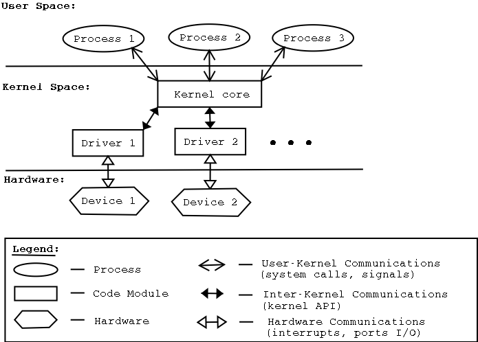 <a href="http://www.haifux.org/lectures/86-sil/kernel-modules-drivers/kernel-modules-drivers.html" target="_blank" style="position: absolute; top: 4px; right: 4px; font-size: 12px;">[src]</a> </div>

<!-- - <div style="position: relative; display: inline-block; background-color: white;">  <a href="https://leimao.github.io/blog/Microkernel-VS-Monolithic-Kernel-OS/" target="_blank" style="position: absolute; top: 0px; left: 4px; font-size: 12px;">[src]</a> </div> -->

Of the three, syscalls are the primary interface for user programs, typically issued through a [shell](), a command interpreter that parses input and dispatches the corresponding syscalls. The shell is a user-space process which repeatedly reads a command, forks a child, execs the binary, and waits for completion. CLI shells (e.g. Bash, [Zsh](https://github.com/ohmyzsh/ohmyzsh/wiki/Cheatsheet)) build on this loop with scripting, I/O redirection, job control, and process substitution. A pipeline such as *ls \| grep foo* compiles into the target syscalls: *fork()*, *pipe()*, *dup2()*, and *exec()*, orchestrated by the shell before any program executes. Graphical desktop environments (e.g. Aqua, GNOME) expose the same interface visually<!-- terminal emulators (e.g. Ghostty, iTerm2) merely host shell processes -->.

- <div style="position: relative; display: inline-block;"> 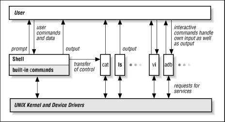 <a href="https://docstore.mik.ua/orelly/unix/upt/ch01_02.htm" target="_blank" style="position: absolute; top: 4px; right: 4px; font-size: 12px;">[src]</a> </div>

<!-- - <div style="position: relative; display: inline-block;"> 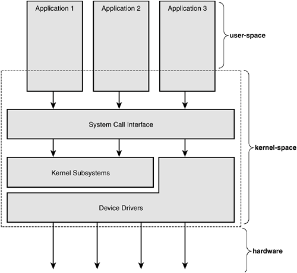 <a href="https://litux.nl/mirror/kerneldevelopment/0672327201/ch01lev1sec2.html" target="_blank" style="position: absolute; top: 4px; right: 4px; font-size: 12px;">[src]</a> </div> -->


<!-- My setup looks as below. -->
<!---->
<!-- ``` -->
<!-- sungkim@macbook -->
<!-- ----------------------- -->
<!-- 🖥️          Ghostty -->
<!-- 🐚          Zsh (ohmyzsh) -->
<!-- ✏️          Neovim (LazyVim) -->
<!-- 🍺          Homebrew -->
<!-- 🔧          [lsd, bat, fzf, fd, ripgrep, ...] -->
<!-- ``` -->


### **2.2. System Call**

<p style="margin-bottom: 12px;"> </p>

The [syscall lifecycle](https://www.youtube.com/watch?v=H4SDPLiUnv4) on Linux x86-64 proceeds as follows. The program calls a libc wrapper (e.g. *write()*), which places the syscall number in [rax](https://www.cs.uaf.edu/2017/fall/cs301/lecture/09_11_registers.html) (1 for write) and arguments in [rdi](), [rsi](), [rdx](), then executes the *syscall* instruction. The CPU saves the instruction pointer (RIP → RCX) and flags (RFLAGS → R11), switches to kernel mode, and jumps to the entry point registered in MSR_LSTAR. The kernel indexes into a [syscall table]() by the number in rax, dispatches the handler (e.g. *sys_write*), places the return value in rax, and executes *sysret* to restore user mode. The program resumes unaware of the privilege transition.

[Standard libraries]() (e.g. libc) wrap these register conventions and trap instructions into portable function signatures (*open()*, *read()*, *write()*, *close()*), so programmers never issue syscalls directly. In Python, *os.write(1, b"Hello")* chains through CPython’s C runtime into libc’s *write()*, which issues the *syscall* instruction. Windows exposes the same functionality through *WriteFile()* with a distinct [ABI]() and trap mechanism (*syscall* on x64, *int 0x2e* on early NT, *sysenter* from XP onward). Cross-platform portability is achieved via standardised APIs (e.g. [POSIX]()) or runtime layers (e.g. JVM, Python interpreter).

Linux x86-64 defines ~450 system calls, each identified by a number in a syscall table spanning process control (*fork()*, *execve()*), file operations (*open()*, *read()*), memory management (*mmap()*, *brk()*, used by *malloc* underneath), and networking (*socket()*, *connect()*). Fast syscalls like *getpid()* return immediately. [Blocking]() syscalls like *read()* or *accept()* may suspend the calling process, as the kernel marks it as waiting and schedules another until hardware signals completion via an interrupt. Each mode switch costs roughly 100-1000 ns, which is why performance-sensitive code minimises crossings through buffered I/O, vectored operations (*readv()*/*writev()*), or batching interfaces like *io_uring*.

- <div style="position: relative; display: inline-block;"> 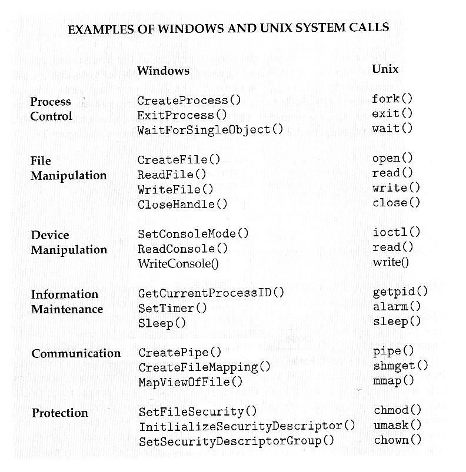 <a href="https://www.cs.uic.edu/~jbell/CourseNotes/OperatingSystems/2_Structures.html" target="_blank" style="position: absolute; bottom: -8px; right: 4px; font-size: 12px;">[src]</a> </div>


Example: malloc uses syscalls internally

  void *malloc(size_t size) {
      void *block = search_free_list(size);   // user-space, no syscall
      if (block) return block;
      return sbrk(size);                      // wraps brk() syscall
      // large allocations use mmap() instead
  }

  void free(void *ptr) {
      add_to_free_list(ptr);                  // user-space, no syscall
      // kernel pages may never be released
  }

Most malloc/free calls never reach the kernel. The syscall only fires
when the allocator needs fresh pages. This is why malloc is a user-space
abstraction layered on top of kernel-managed virtual memory.


<!--
SOURCE CODE (your_program.c)            ← exists only at development time
┌──────────────────────────────┐
│ #include <unistd.h>          │
│ int main() {                 │
│     write(1, "Hello", 5);    │
│ }                            │
└──────────────┬───────────────┘
               │ gcc compiles
               ▼
ELF BINARY (your_program) on disk       ← machine code, no C left
┌──────────────────────────────┐
│ mov rax, 1                   │
│ mov rdi, 1                   │
│ mov rsi, <addr of "Hello">   │
│ mov rdx, 5                   │
│ syscall                      │
└──────────────┬───────────────┘
               │ shell calls execve() → kernel loads binary into RAM
               ▼
RAM (virtual address space)             ← kernel created this space
┌──────────────────────────────┐
│ 0x401000: mov rax, 1         │  ← CPU fetches & executes these
│ 0x401004: mov rdi, 1         │
│ 0x401008: mov rsi, 0x402000  │
│ 0x40100c: mov rdx, 5         │
│ 0x401010: syscall ←──────────┼──── CPU trap: user → kernel mode
└──────────────────────────────┘
               │
               ▼
KERNEL (in its own region of RAM)
┌──────────────────────────────┐
│ sees: rax=1, rdi=1,          │  ← just register values
│       rsi=0x402000, rdx=5    │
│                              │
│ syscall_table[1] → sys_write │
│   find fd 1 → stdout → tty   │
│   copy 5 bytes from 0x402000 │
│   send to device driver      │
│   return 5 in rax            │
└──────────────┬───────────────┘
               │ sysret: kernel → user mode
               ▼
RAM (your program resumes)
┌──────────────────────────────┐
│ 0x401012: (next instruction) │  ← continues as if nothing happened
└──────────────────────────────┘

Kernel architecture determines how sys_write is handled internally:

    MONOLITHIC (Linux)                  MICROKERNEL (seL4)

    sys_write()                         kernel routes IPC message
      → vfs_write()                           │
      → ext4_write()                          ▼
      → block_driver()               ┌─────────────────────┐
      → disk hardware                │ FS SERVER (user space)│
                                     │   process the write   │
    all function calls               └──────────┬──────────┘
    same address space                     IPC message
    no mode switches                          │
                                              ▼
                                     ┌─────────────────────┐
                                     │ DISK SERVER (user sp.)│
                                     │   talk to hardware    │
                                     └──────────────────────┘

    Fast (direct calls)              Slow (multiple IPC hops)
    Risky (bug = full crash)         Safe (bug ≠ kernel crash)
-->

## III

---


§III overview: what happens when you run ./a.out

  test.c                     §3.3 File                    §3.2 Virtual Memory         §3.1 Process
  ┌──────┐    gcc    ┌──────────────────┐   page fault   ┌──────────────────┐       ┌──────────────┐
  │ int  │ ───────→  │ inode \#42        │  ───────────→  │ page frame 0x7a  │       │ task_struct  │
  │ main │  compile  │   blocks: [1047] │   load to RAM  │   virtual: 0x401 │       │   pid: 101   │
  │ ...  │           │   size: 8192     │                │   physical: 0x7a │       │   state: RUN │
  └──────┘           │   perms: rwxr-x  │                │                  │       │   mm: ...    │
                     └──────────────────┘                └──────────────────┘       │   files: ... │
                         disk (4KB blocks)                    RAM (pages)           └──────┬───────┘
                                                                                          │
                     ┌─────────────────────────────────────────────────────────────────────┘
                     │
                     ▼
               ┌─────────────────────────────────┐
               │ CPU ready queue                  │
               │                                  │
               │  [task 101] → [task 42] → [task 7]  │
               │       ↑                          │
               │   scheduler picks next           │
               └─────────────────────────────────┘

  shell$ ./a.out
    1. shell calls fork()          → new task_struct (pid 101)        §3.1
    2. child calls exec("a.out")   → kernel resolves path via VFS     §3.3
    3. kernel maps binary to pages → page table entries created       §3.2
    4. first instruction faults    → kernel loads block from disk     §3.2 + §3.3
    5. scheduler dispatches task   → CPU executes from 0x401000      §3.1


### **3.1. Process**

<p style="margin-bottom: 12px;"> </p>

<!--
§3.1 arc: what → how created → what it looks like in memory → lifecycle → scheduling (mechanism → policy → Linux) → communication

{what + how created}
  P1 — WHAT: process = resource-owning unit, thread = scheduling unit, task_struct blurs the two
  P2 — CREATION: fork (CoW) + exec + wait, shell cycle (ls example), zombie
  P3 — MEMORY LAYOUT: exec maps ELF segments (text/data/heap/stack), shared libraries, _start

{lifecycle + scheduling}
  P4 — LIFECYCLE: states (new/ready/running/waiting/terminated), queues, scheduler picks from ready queue
  P5 — MECHANISM: cooperative (yields) → preemptive (timer interrupt), context switch cost
  P6 — POLICY: classical algorithms (RR, SJF, HRN, priority, MLFQ)
  P7 — LINUX: CFS (virtual runtime, red-black tree) → EEVDF, nice values, SCHED_NORMAL/FIFO/RR

{communication}
  P8 — IPC: message passing (pipes, UDS, message queues) vs shared memory, all via fds → §3.3
  P9 — COMPOSITION: fork inherits fd table, pipe + dup2 + exec → shell pipelines (ls | grep)
-->

A [process]() (i.e. resource-owning unit) is the kernel's abstraction of a running program that provides an isolated address space and its own kernel resources. A [thread]() (i.e. scheduling unit) shares the process's address space and fd, but maintains its own stack, PC, SP, registers, and flags, to enable concurrent execution without duplicating the address space. In Linux, both are represented by a single *task_struct* (i.e. [process control block]()), where thread(s) in the same process simply point to the same *mm_struct* and *files_struct*. The distinction between the two is therefore structural rather than fundamental, while all processes always begin with a single [main thread]().


```c
// simplified Linux model: one struct for both processes and threads
// threads in the same process point to the same mm and files
typedef struct task_struct {
        int pid;
        int state;                     // READY, RUNNING, BLOCKED
        uint64_t pc, sp;               // program counter, stack pointer
        uint64_t regs[16];             // general-purpose registers
        void *stack_base;              // per-thread stack
        struct mm_struct *mm;          // address space (shared among sibling threads)
        struct files_struct *files;    // fd table (shared among sibling threads)
        struct task_struct *parent;
} task_struct;

// context switch: save current, load next
void context_switch(task_struct *old, task_struct *new) {
        save_registers(old);   // store CPU state -> old->regs, old->pc, old->sp
        load_registers(new);   // load new->regs, new->pc, new->sp -> CPU
        if (old->mm != new->mm)
                switch_mm(new->mm);  // swap page table (CR3), flush TLB
}
```


Creating a process from scratch would require allocating a fresh address space, page tables, and fd table. Unix avoids this with a two-step mechanism. i) [fork()]() (*kernel/fork.c*) duplicates the calling process via [copy-on-write]() (CoW), producing a child with a new PID that shares the parent's pages until either side writes; ii) The child calls [exec()]() to load a new program, and the parent calls [wait()]() to block until the child terminates; For example, when a user types *ls*, the shell forks → child execs */bin/ls* (i.e. replaces the shell code with the *ls* binary) → parent waits → next prompt. <!-- Commands like cd and export are built-in and run inside the shell process itself, since they must modify the shell's own state. --> A terminated child whose parent has not yet called *wait()* is also known as a [zombie process]().

<!-- e.g. 1: GUI application launch on macOS
  1. Finder forks
  2. Child execs /Applications/Safari.app/Contents/MacOS/Safari
  3. _start initialises C runtime
  4. _start calls main
  5. Safari runs
  Every program launch (terminal, file manager, dock) reduces to fork + exec.

e.g. 2: python script.py
  1. Shell forks
  2. Child execs /usr/bin/python3 with argv=["python3", "script.py"]
  3. _start initialises C runtime
  4. _start calls main (CPython's main)
  5. CPython's main initialises its own runtime (GC, import system, builtins)
  6. CPython reads and executes script.py
  Two layers of startup: _start (C) then CPython main (Python runtime) -->

Specifically, *exec()* reads the executable header (e.g. ELF, §602) and maps its segments into the process's (virtual-) address space. i) [text](): machine code, read-only and shareable via CoW; ii) [data/BSS](): initialised and zero-initialised global and static variables; iii) [heap](): growing upward via *brk()* / *mmap()*; iv) [stack](): growing downward for local variables and [function frames](); Notice that dynamically linked shared libraries are mapped between heap and stack by the runtime linker (_ld.so_), allowing multiple processes to share a single copy in physical memory (§602). Execution then begins at the entry point _\_start_, which initialises the C runtime and calls _main_.

- <div style="position: relative; background-color: white; display: inline-block;"> 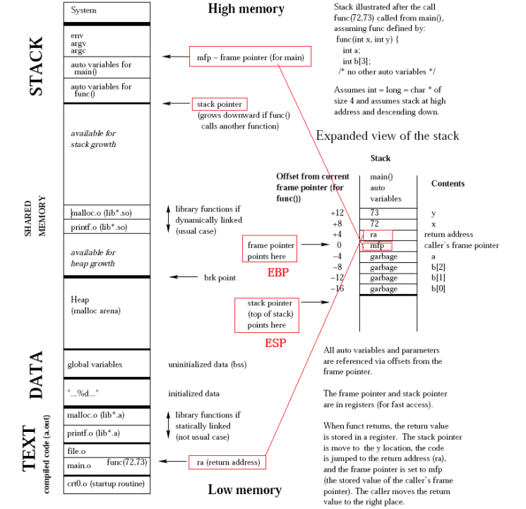 <a href="https://www.linkedin.com/pulse/c-memory-layout-naveen-suppala/" target="_blank" style="position: absolute; top: 4px; right: 4px; font-size: 12px;">[src]</a> </div>

Once created, each thread advances through a [life cycle]() of mutually exclusive states: new, ready (queued for CPU), running (actively scheduled), waiting (blocked on I/O or synchronisation), and terminated. Each transition corresponds to a field update in the thread's *task_struct*. For example, *read()* on a slow device moves the thread from running to waiting; the device interrupt moves it back to ready. The kernel organises threads by state into [queues](), maintaining a [ready queue]() for threads awaiting CPU time and [wait queues]() for those blocked on events. On multicore systems, the scheduler keeps per-core ready queues and periodically rebalances load.


A daemon is a background process that runs continuously without user
interaction, typically started at boot by init/systemd and persisting
for the lifetime of the machine. The name comes from Unix tradition
(inspired by Maxwell's demon in thermodynamics, a background agent
that works autonomously).

Examples: sshd (listens for SSH connections), cron (executes scheduled
tasks), syslogd (collects system logs). They sit idle until triggered
by an event (incoming connection, timer, log message), then handle it
and go back to waiting.

The "d" suffix in Unix (sshd, httpd, systemd) stands for "daemon."


The [CPU scheduler]() determines which ready thread to dispatch on each core. [Cooperative scheduling]() relies on threads voluntarily relinquishing the CPU (via *yield()*, I/O, or sleep), so a thread that never yields starves all others. [Preemptive scheduling](), adopted by all modern OSes, removes this dependency via the hardware timer interrupt<!-- every 1-10 ms -->. Each decision triggers a [context switch]() that saves the current thread's CPU state<!-- PC, SP, registers --> into its *task_struct* and restores the next thread's. Intra-process switches are inexpensive<!-- register swap, same address space -->, but inter-process switches require a page table swap and TLB flush<!-- reaching roughly 1-10 μs with cache pollution -->. Selecting which thread to run next is therefore a policy decision<!-- minimising the number of switches is another; see thread pools, event loops, coroutines (§604) -->.

The classical scheduling algorithms formalise its choice. [Round robin]() (RR) cycles through the ready queue with a fixed time quantum. [Shortest Job First]() (SJF) selects the smallest expected [CPU burst](), minimising average wait at the risk of starving long jobs. [Highest Response Ratio Next]() (HRN) mitigates this via $(w + s) / s$ ($w$ = waited, $s$ = est. service time), so longer-waiting threads eventually win. [Priority scheduling]() dispatches the highest-priority thread, risking [starvation]() unless [aging]() boosts lower priorities. [Multi-level feedback queues]() (MLFQ) unify these with multiple queues that dynamically adjust priority based on observed behaviour (I/O-bound promoted).

In practice, Linux synthesises these ideas into a fair scheduler. The [Completely Fair Scheduler]() (CFS, *kernel/sched/*) maintained a per-thread [virtual runtime]() that advances inversely with its [nice]() value (weight), dispatching the thread with the smallest value via a red-black tree ($O(\log n)$). The [EEVDF]() (Earliest Eligible Virtual Deadline First) scheduler replaced CFS in kernel 6.6 (2023), adding a deadline component to reduce latency for interactive tasks while keeping fairness. Both operate under the default *SCHED_NORMAL* policy; real-time tasks use *SCHED_FIFO* or *SCHED_RR* with fixed priorities that unconditionally preempt normal threads.


<!-- Pre-socket Unix IPC was fragmented:
  - Pipes (1969): unidirectional, parent-child only
  - FIFOs (named pipes): unidirectional, any processes, but no datagrams
  - System V IPC (1983): message queues, shared memory, semaphores — separate API, not fd-based
  - Signals: asynchronous but carry no data payload

BSD 4.2 (1983) unified local and network communication under the socket API:
  AF_UNIX (local) and AF_INET (network) share the same interface,
  so the same code works locally and over the network by changing the address family.

Not covered in the visible text:
  - Semaphores: synchronisation primitive, not data exchange — belongs in §604 (concurrency)
  - Signals: asynchronous notification with no data payload — covered briefly in §1.2

IPC methods summary:
  | Method          | Data exchange? | Covered in    |
  |-----------------|---------------|---------------|
  | Shared memory   | yes           | §3.1 (here)   |
  | Message passing | yes (category)| §3.1 (here)   |
  | Pipes           | yes           | §3.1 (here)   |
  | Sockets (UDS)   | yes           | §3.1 (here)   |
  | Message queues  | yes           | §3.1 (here)   |
  | Semaphores      | no (sync)     | §604          |
  | Signals         | no (notify)   | §1.2          | -->

- ...

Once scheduled and running, processes may need to exchange data across their isolated address spaces. The kernel facilitates this through [inter-process communication](https://www.youtube.com/watch?v=Y2mDwW2pMv4&list=PL9vTTBa7QaQPdvEuMTqS9McY-ieaweU8M&index=4) (IPC). [Message passing]() delegates transfer to the kernel via pipes, [Unix domain sockets]() (UDS), or message queues. Unlike TCP over loopback, UDS bypasses the network stack, addressed by a file path (e.g. _/var/run/docker.sock_)<!-- rather than an (IP, port) pair -->. [Shared memory]() maps the same physical pages into multiple address spaces, avoiding the copy<!-- Chrome passes rendered bitmaps from renderer to browser process this way -->. Message passing is simpler (the kernel handles synchronisation), but shared memory offers higher throughput since data never crosses the kernel boundary. All IPC mechanisms are accessed through file descriptors (§3.3).

<!-- TCP loopback vs UDS:
  TCP over loopback (127.0.0.1):
    Process A → socket → TCP → IP → loopback → IP → TCP → socket → Process B
                          ^^^^^^^^^^^^^^^^^^^^^^^^^^^^^^^^^^^^^^
                          full network stack, even though data never leaves the machine

  UDS (/var/run/docker.sock):
    Process A → socket → kernel buffer → socket → Process B
                          ^^^^^^^^^^^^^^
                          direct copy, no protocol overhead -->

- <div style="position: relative; display: inline-block;"> 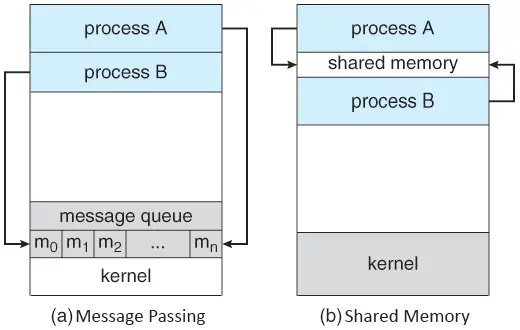 <a href="https://www.w3schools.in/operating-system/interprocess-communication-ipc" target="_blank" style="position: absolute; bottom: -8px; right: 4px; font-size: 12px;">[src]</a> </div>

*fork()* duplicates the parent process's fd table, and *exec()* preserves it<!-- except fds marked FD_CLOEXEC, which are closed on exec -->, so a child process inherits all open file descriptors. This inheritance is the mechanism behind shell [I/O redirection]() and [pipes](), where *pipe()* creates a pair of fds connected by a kernel buffer and *dup2(oldfd, newfd)* copies one fd onto another slot, replacing what was there. To build *ls | grep foo*, the shell creates a pipe, forks twice, uses *dup2()* to replace each child's stdout or stdin with the appropriate pipe end, then calls *exec()* in each child. Neither *ls* nor *grep* contains any redirection logic; both simply read from fd 0 and write to fd 1 as usual.
<!-- mmap() offers a different composition: instead of copying bytes via read(), it maps file-backed page-cache pages directly into the process's address space, letting page faults serve as implicit I/O (e.g. np.memmap). -->

- <div style="position: relative; display: inline-block;"> 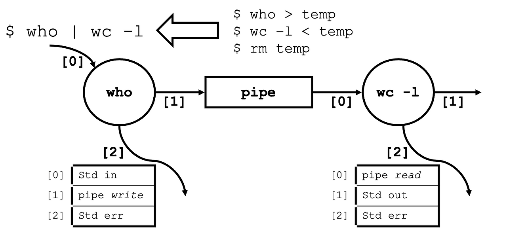 <a href="https://programmer-eun.tistory.com/72" target="_blank" style="position: absolute; top: 4px; right: 4px; font-size: 12px;">[src]</a> </div>

### **3.2. Virtual Memory**

<p style="margin-bottom: 12px;"> </p>

<!--
§3.2 arc: why → how → can it scale? → runtime → bridge to §3.3

{why}
  P1 — WHY: VM interposes MMU+TLB, giving isolation, sharing (CoW), overcommit

{how + scalability}
  P2 — HOW: pages/frames (4 KB), page table, translation [p|d] → [f|d], PTE as metadata (PPN, present, rwx), context switch (CR3)
  P3a — PROBLEM: fragmentation trade-off, flat table math ($2^{N-P+E}$), 512 GB on x86-64, prohibitive
  P3b — SOLUTION: multi-level allocates only populated subtrees, TLB amortises cost, miss → walk

{runtime + bridge}
  P4 — RUNTIME: demand paging, page fault → allocate/load from disk, replacement, thrashing
  P5 — BRIDGE: page cache, mmap (np.memmap), swap → §3.3
-->

Given that physical memory is a flat, byte-addressable array (§601), [virtual memory](https://www.cs.rpi.edu/academics/courses/fall04/os/c12/) interposes a hardware translation layer (e.g. MMU + TLB), in which each process sees a large, contiguous address space rather than physical memory. Modern general-purpose OSes leverage the abstraction, where the kernel maintains the mapping for the hardware to enforce it on every memory access, as it allows i) isolation: one process cannot access another's memory; ii) sharing: common pages mapped without duplication, with CoW deferring copies until a write occurs; and iii) overcommitment: total virtual allocation may exceed physical capacity, backed by disk.


Core idea: The CPU sees virtual addresses, DRAM uses physical addresses,
and the MMU sits between them translating one to the other using rules the kernel wrote.

Why:
  Without translation, every program would directly access DRAM. Program A could
  read Program B's data. Two programs couldn't both use address 0. The OS would
  have to manually arrange every program to fit in RAM without overlapping.

How (division of labour):
  KERNEL (software, runs occasionally):
    "Page 3 of Process 1 lives in frame 7"
    → writes this into a page table in DRAM
    → loads page table address into CR3

  MMU (hardware, runs on EVERY memory access):
    CPU says: "read virtual address 0x3A04"
    MMU says: "page 3, offset 0xA04 → look up page table → frame 7"
    DRAM receives: "read physical address 0x7A04"

              Kernel (software)                    MMU (hardware)
  When        process creation, context switch,    every single memory access
              page fault
  Does what   writes PTEs, loads CR3,              reads page table, translates
              allocates frames                     address
  Speed       slow (runs as code on CPU)           fast (~1 cycle with TLB hit)
  Analogy     city planner who draws the map       GPS that reads the map in real time

The kernel is the author. The MMU is the enforcer.

Address bit split:
  virtual address = [p | d]  →  physical address = [f | d]

  upper bits = page number (p) → selects which page → determines total pages in address space
  lower bits = offset (d) → which byte within that page (0 to 4095 for a 4 KB page)
                             the offset is the same in both virtual and physical addresses
                             because pages and frames are the same size

  4 KB page → 2^12 = 4096 bytes → 12 bits needed for offset
  remaining bits select the page:
    32-bit: 20-bit p (2^20 ≈ 1M pages) + 12-bit d
    48-bit: 36-bit p (2^36 ≈ 64B pages) + 12-bit d


The kernel partitions virtual address space and physical memory into fixed-size [pages]() and [frames](), respectively, typically 4 KB<!-- chosen to match disk block size -->. Each process is given a [page table](https://ece-research.unm.edu/jimp/310/slides/os_essentials.html) that maps virtual page numbers to physical frame numbers. On each memory access, the MMU splits the virtual address into a page number and an offset, looks up the page number in the table, and replaces it with the physical frame number. Each [page table entry]() (PTE) is per-page metadata that records the physical frame number, a present bit that triggers a page fault<!-- when cleared -->, and permission flags (rwx). On context switch, the kernel updates the [page table register](), e.g. {x86: CR3, ARM: TTBR}, to point to the new process's table.


Concrete address translation example (4 KB pages, 32-bit for simplicity):

  Virtual address: 0x00003A04  (= 14852 in decimal)

  Step 1: split into VPN + offset
    page size = 4096 = 2^12, so lower 12 bits = offset within page
    0x00003A04 = 0000 0000 0000 0000 0011 1010 0000 0100
                 |_______ VPN = 3 _______| |_ offset = 0xA04 (2564) _|

    VPN = 14852 ÷ 4096 = 3  (page 3)
    offset = 14852 mod 4096 = 2564

  Step 2: look up PTE for VPN 3
    page_table[3] = { PPN: 7, present: 1, permissions: rw- }

  Step 3: construct physical address
    physical address = PPN × 4096 + offset = 7 × 4096 + 2564 = 31236
    in hex: 0x7A04

  Summary:
    virtual  0x00003A04  →  page 3, offset 0xA04
    PTE[3]  →  frame 7
    physical 0x00007A04  →  frame 7, offset 0xA04

  The upper bits changed (3 → 7), the lower 12 bits (A04) pass through unchanged.


Fixed-size paging naturally eliminates [external fragmentation]() at the cost of [internal fragmentation]()<!-- since a page is the minimum allocation unit; e.g. a 5 KB allocation wastes 3 KB of its second 4 KB page -->. However, the tables also reside in physical memory, and a naive flat table becomes impractical as the address space widens. For instance, let $N$, $P$, and $E$ denote the virtual address width<!-- not always the CPU word size; x86-64 uses 48 bits, not 64 -->, page size exponent, and PTE size exponent, respectively. A flat table with one entry per page costs $2^{N - P + E}$ B per process. On x86-64<!-- the upper 16 bits must be sign-extended (canonical form) --> (i.e. $N = 48$, $P = 12$, $E = 3$), this yields $2^{39}$ B = 512 GB of pre-allocated memory per process, regardless of actual usage, which makes a flat table prohibitive.

<!-- - <div style="position: relative; display: inline-block; background-color: white">  <a href="https://pages.cs.wisc.edu/~bart/537/lecturenotes/s17.html" target="_blank" style="position: absolute; top: 2px; right: 4px; font-size: 12px;">[src]</a> </div> -->

- <div style="position: relative; display: inline-block; background-color: white"> 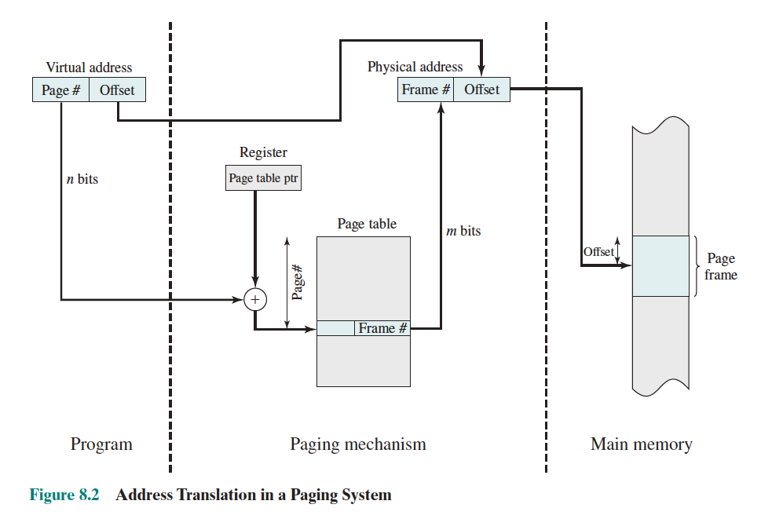 <a href="https://stevengong.co/notes/Page-Table" target="_blank" style="position: absolute; bottom: -8px; right: 4px; font-size: 12px;">[src]</a> </div>
  <p style="color: grey; font-size: 11px; margin-top: 0;">Stallings, <i>Operating Systems: Internals and Design Principles</i>, Fig. 8.2</p>

<!-- - <div style="position: relative; display: inline-block; background-color: white"> 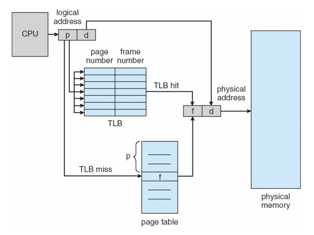 </div> -->

<!-- - <div style="position: relative; display: inline-block; background-color: white">  <a href="https://en.wikipedia.org/wiki/Page_table" target="_blank" style="position: absolute; bottom: -10px; right: 4px; font-size: 12px;">[src]</a> </div> -->

<!-- - <div style="position: relative; display: inline-block; background-color: white"> 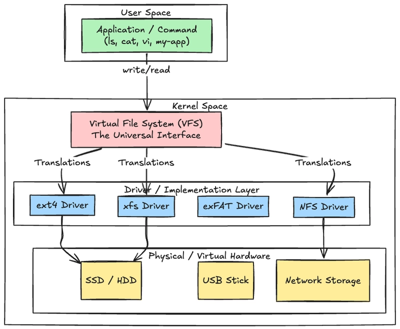 <a href="https://wiki.osdev.org/X86_Paging" target="_blank" style="position: absolute; bottom: -8px; left: 4px; font-size: 12px;">[src]</a> </div> -->

[Multi-level page tables]() solve the flat table problem by partitioning the virtual address into multiple index fields, each selecting an entry in a successively deeper table. Only subtrees covering populated regions are allocated, making each process's page table cost proportional to actual usage. x86 (32-bit) uses a 2-level hierarchy<!-- page directory + page table -->, requiring two memory reads per translation; x86-64 extends this to 4 levels<!-- PGD → PUD → PMD → PTE --> for wider address spaces. However, multiple memory reads per translation is still expensive, so the TLB (§601#1.3) caches recent translations. It is effective because programs exhibit strong locality: a single 4 KB page holds many instructions, so consecutive accesses frequently result in a [TLB hit](). A [TLB miss]() triggers the full page table walk, and a [TLB flush]()<!-- e.g. on context switch --> invalidates all cached entries.
<!-- Context switch → kernel writes new CR3 → TLB flush (all entries invalidated)
     → first access to each page → TLB miss → full page table walk → cache result in TLB
     → subsequent accesses to same page → TLB hit (fast, ~1 cycle)
     → TLB gradually warms up as process runs
     Modern CPUs mitigate with PCID (Process Context Identifiers), tagging TLB entries per process --> <!-- Modern CPUs support larger page sizes (e.g. 2 MB or 1 GB) to reduce address translation overhead, at the cost of increased internal fragmentation. -->

Physical frames are not allocated until first accessed, a strategy called [demand paging](). When a process touches an unmapped page, the CPU raises a [page fault]() (*mm/memory.c*) and the kernel allocates a frame, either zero-initialising it or loading content from disk. If physical memory is exhausted, a [page replacement]() policy<!-- e.g. FIFO, LRU, Clock --> evicts a victim frame. While this permits overcommitment, sustained faulting leads to [thrashing]().

In practice, virtual memory and file I/O are tightly coupled. The [page cache]() (*mm/filemap.c*) buffers disk blocks in RAM, so repeated reads of the same file resolve from memory rather than disk. [mmap()]() (*mm/mmap.c*) turns page faults into file reads, allowing *np.memmap* to access a large on-disk array as if it resided in memory, with the kernel paging in only the blocks actually touched. [Swap]() inverts this relationship, using disk as a backing store for memory pages with no file origin. In all three cases, the kernel moves data between RAM and disk in page-sized units, making the boundary between abstractions ii) and iii) thinner than it appears.

<!-- - <div style="position: relative; display: inline-block; background-color: white"> 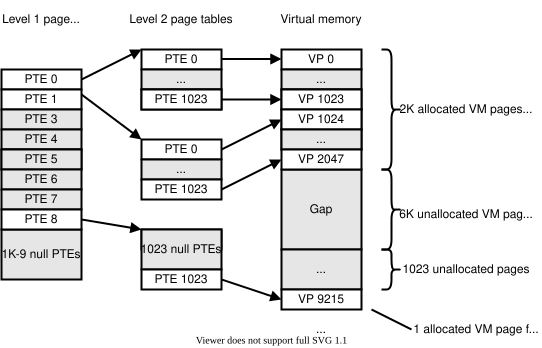 <a href="https://notes.eddyerburgh.me/computer-architecture/memory" target="_blank" style="position: absolute; top: 4px; right: 4px; font-size: 12px;">[src]</a> </div> -->

- <div style="position: relative; display: inline-block; background-color: white"> 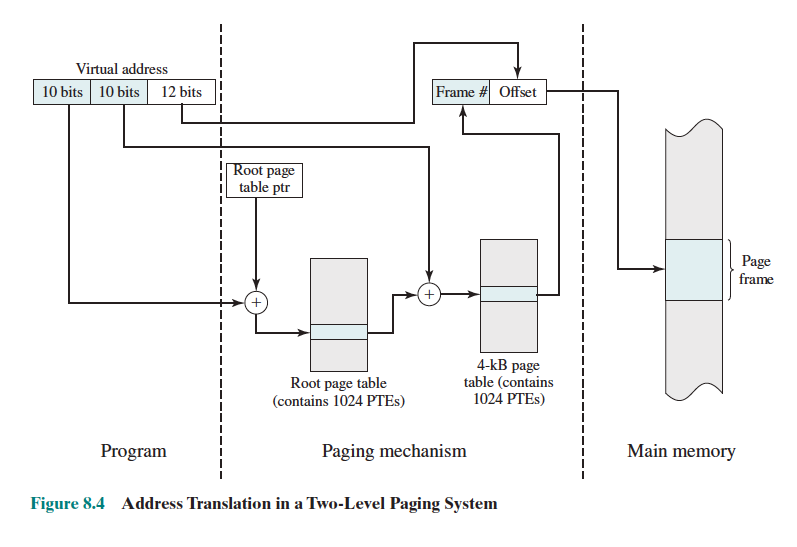 <a href="https://stevengong.co/notes/Page-Table" target="_blank" style="position: absolute; bottom: -8px; right: 4px; font-size: 12px;">[src]</a> </div>

<!-- - <div style="position: relative; display: inline-block; background-color: white">  <a href="https://userpages.umbc.edu/~squire/cs411_l23.html" target="_blank" style="position: absolute; bottom: -8px; right: 4px; font-size: 12px;">[src]</a> </div> -->

<!-- - <div style="position: relative; display: inline-block; background-color: white">  <a href="https://sam4k.com/page-table-kernel-exploitation/" target="_blank" style="position: absolute;  bottom: -8px; right: 4px; font-size: 12px;">[src]</a> </div> -->

<!-- - <div style="position: relative; display: inline-block; background-color: white"> 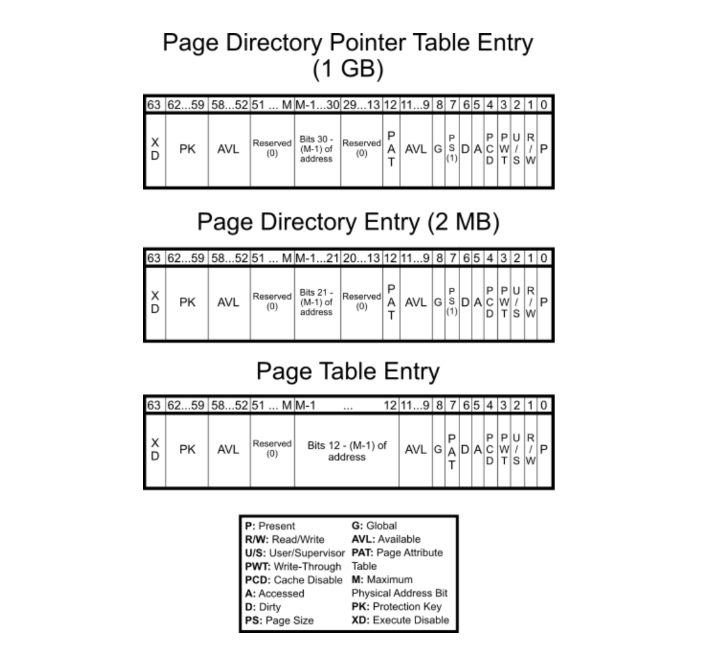 <a href="https://sam4k.com/page-table-kernel-exploitation/" target="_blank" style="position: absolute;  bottom: -8px; right: 4px; font-size: 12px;">[src]</a> </div> -->


### **3.3. File System**

<p style="margin-bottom: 12px;"> </p>

<!--
§3.3 arc: fd interface (what programs see) → filesystem internals (how one fs works) → VFS (how multiple coexist) → generalisation

{interface}
  P1 — file = unstructured bytes, file system = naming + metadata layer, indirection, format-agnostic
  P2 — fd: uniform identifier, three layers (fd table → open-file table → inode), stdin/stdout/stderr
  P3 — read/write semantics: short read, EOF, blocking, lseek, close, stdio wrapping
  [IMAGE: three-layer fd diagram]

{filesystem internals}
  P4 — on-disk vs in-memory inode, data blocks, indirect pointers, ext2/ext3 math (~4 TB)
  P5 — directories (name → inode), hard/symbolic links, link count, permissions, ls -l

{unification}
  P6 — different back-ends + tradeoffs → VFS, in-memory inode = VFS object, file_operations dispatch
  P6b — journaling
  [IMAGE: VFS dispatch diagram]

{generalisation}
  P7 — fd evolution (files → pipes → sockets → devices), device drivers, /dev, /proc, /sys
  [IMAGE: fd routing diagram]
-->

<!--
Why "everything is a file" matters — the Chrome example:

  1. Launch: GUI calls fork()+exec() on the Chrome binary (a file on disk)
  2. Type:  keyboard interrupt → kernel driver → delivers keystrokes to Chrome's fd
  3. Send:  Chrome write()s to a TCP socket fd → network stack → NIC driver → Google
  4. Recv:  NIC receives packets → kernel reassembles → Chrome read()s the same socket fd

Every step uses the same fd interface: read(fd) for keyboard and network input,
write(fd) for network requests and screen output. The process never talks to
hardware directly — the kernel routes each fd to the right driver.
-->

<!-- Programs need data to persist beyond process lifetime. -->In Unix, a [file]() is an unstructured sequence of bytes with no format imposed by the kernel<!-- pre-Unix systems like IBM OS/360 required programs to declare record formats (fixed-length, variable-length) and block sizes; Unix pushed all structure to user space -->, and a [file system]() is the software layer which organises files into a hierarchy of named paths, each associated with metadata (e.g. size, ownership, permission). The indirection (i.e. abstraction) between names and raw bytes is what maps files onto the raw blocks of a disk (§601#1.4), though the same interface extends to memory-backed (tmpfs), network-backed (NFS), and kernel-generated (/proc) file systems. Therefore, the kernel is format-agnostic, file extensions (e.g. *.txt*, *.py*) are merely a user-space convention, and *file(1)* inspects [magic bytes]() in the content to determine its type.


File system implementations are hardware-specific:

  Hardware              File systems                  Storage
  Disk/SSD (block)      ext4, btrfs, APFS, FAT32      persistent, block-addressed
  Raw NAND flash        JFFS2, YAFFS, F2FS            persistent, page/erase-block
  Memory (RAM)          tmpfs, ramfs                   volatile
  Network               NFS, CIFS/SMB                  remote
  None (kernel)         procfs, sysfs, devtmpfs        virtual (generated on read)

VFS unifies them all behind the same open/read/write/close interface.

Even on the same back-end, different filesystems make different tradeoffs:

                    ext4      btrfs      XFS
  Snapshots         No        Yes        No
  Copy-on-write     No        Yes        No
  Large file perf   Good      Good       Best
  Maturity          Best      Growing    Good


Programs do not access files directly; they ask the kernel for a [file descriptor]() (fd) via the *open()* syscall, which resolves the path and allocates entries in internal bookkeeping tables before returning a small non-negative integer. The fd is the mechanism that makes this uniform interface possible. The kernel tracks it through three layers of data structures: per-process [fd table]() $\to$ system-wide [open-file table]() $\to$ in-kernel file object, and it returns the lowest available integer, so the first three fds on a fresh process are 0 ([standard input]()), 1 ([standard output]()), 2 ([standard error]()) by convention (POSIX).

<!--
USER SPACE
┌─────────────────────────────────────────────────────────┐
│  Program: read(3, buf, 4096)                            │
│                                                         │
│  stdio (FILE*) wraps fd with buffering                  │
│  Python open() wraps stdio                              │
└────────────────────────┬────────────────────────────────┘
                         │ syscall trap
═════════════════════════╪════════════════════════════════════
KERNEL                   ▼
┌─────────────────────────────────────────────────────────┐
│  fd interface                                           │
│                                                         │
│  per-process fd table     open-file table    in-memory  │
│  ┌───┬────────────┐      ┌──────────────┐    inode     │
│  │ 0 │ stdin  ────┼─────→│ offset, mode ┼──→ ┌──────┐ │
│  │ 1 │ stdout ────┼─────→│ offset, mode ┼──→ │ inode│ │
│  │ 2 │ stderr ────┼─────→│ offset, mode ┼──→ │      │ │
│  │ 3 │ file   ────┼─────→│ offset, mode ┼──→ │      │ │
│  └───┴────────────┘      └──────────────┘    └──┬───┘ │
│                                                  │      │
│  VFS dispatch layer                              │      │
│  ┌───────────────────────────────────────────────┘      │
│  │  file_operations struct (function pointers)          │
│  │                                                      │
│  ├──→ ext4_read()    ──→ block device (SSD/HDD)         │
│  ├──→ nfs_read()     ──→ network                        │
│  ├──→ tmpfs_read()   ──→ RAM                            │
│  ├──→ proc_read()    ──→ kernel generates on read()     │
│  └──→ pipe_read()    ──→ kernel buffer                  │
│                                                         │
│  individual filesystem (e.g. ext4)                      │
│  ┌─────────────────────────────────────────────┐        │
│  │  on-disk inode #42                          │        │
│  │  ├── size: 8192                             │        │
│  │  ├── owner: uid 1000                        │        │
│  │  ├── perms: rwxr-xr--                       │        │
│  │  ├── link count: 2                          │        │
│  │  └── block ptrs: [1047, 1048]               │        │
│  │                                             │        │
│  │  directory /home/user/                      │        │
│  │  ├── "data.csv"   → inode #42               │        │
│  │  ├── "backup.csv" → inode #42  (hard link)  │        │
│  │  └── "notes.txt"  → inode #87               │        │
│  └─────────────────────────────────────────────┘        │
│                          │                              │
│  device drivers          │                              │
│  ┌───────────────────────┘                              │
│  │ upward: fd interface                                 │
│  │ downward: register protocol, interrupts, DMA         │
│  └──→ /dev/sda, /dev/nvidia0                            │
│  └──→ /proc/cpuinfo, /sys/...  (no disk, generated)     │
└─────────────────────────────────────────────────────────┘
                         │
═════════════════════════╪════════════════════════════════════
HARDWARE                 ▼
┌──────────┐  ┌─────────┐  ┌────────┐  ┌────────┐
│ SSD/HDD  │  │   NIC   │  │  RAM   │  │  GPU   │
│ block    │  │ network │  │ tmpfs  │  │ /dev/  │
│ 1047,1048│  │         │  │        │  │nvidia0 │
└──────────┘  └─────────┘  └────────┘  └────────┘
-->

*read(fd, buf, n)* receives up to $n$ bytes and *write(fd, buf, n)* sends them. Both return the number of bytes transferred, which may be less than requested (a short read/write), and *read()* returning 0 signals [end-of-file]() (EOF). By default, *read()* on a source with no available data (e.g. an empty pipe) [blocks]() the calling process until bytes arrive or the write end closes. *lseek()* repositions the fd's offset for random access, and *close()* releases the fd, decrementing the reference counts at each layer. In practice, standard libraries (e.g. C's stdio) wrap fds in buffered handles (e.g. *FILE\**), and higher-level languages (e.g. Python's *open()*) add further abstraction.

<!-- ```c
// POSIX syscalls (low-level): raw fd, direct syscalls
int fd = open("data.csv", O_RDONLY);  // kernel picks fd (e.g. 3)
read(fd, buf, 4096);                   // developer just uses the int
close(fd);                             // kernel frees the entry

// stdio (standard C library): FILE* wraps fd with user-space buffering
FILE *f = fopen("data.csv", "r");     // internally calls open(), wraps fd in FILE struct
fgets(buf, sizeof(buf), f);            // buffered read
fclose(f);                             // closes underlying fd
// fileno(f) retrieves the underlying fd from a FILE*
``` -->

- <div style="position: relative; display: inline-block;"> 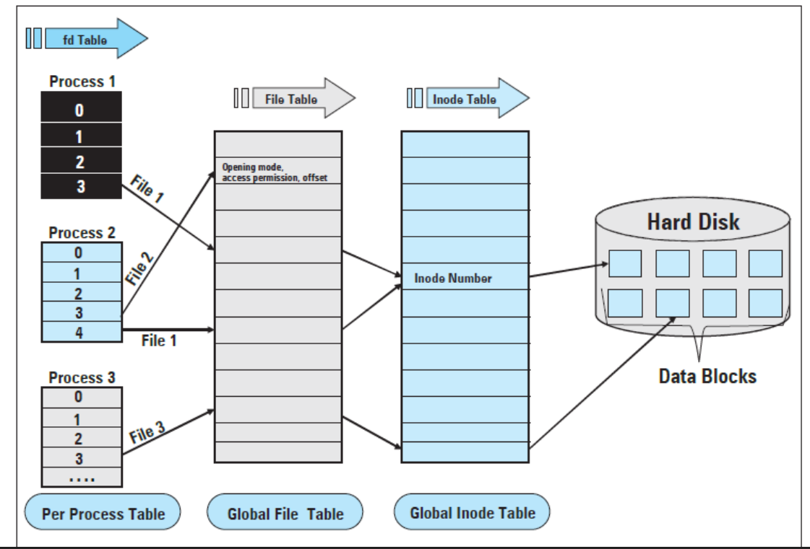 <a href="https://stackoverflow.com/questions/5256599/what-are-file-descriptors-explained-in-simple-terms" target="_blank" style="position: absolute; top: 4px; right: 6px; font-size: 12px;">[src]</a> </div>

<!--
"File" in Unix means any I/O endpoint exposed through a file descriptor:
  - Regular files: data on disk (.txt, .csv, .py)
  - Directories: files that map names to inodes
  - Device files: hardware as /dev/* (e.g. /dev/sda, /dev/null)
  - Sockets: network connections (TCP/UDP)
  - Pipes: byte streams between processes (ls | grep foo)
  - Symlinks: pointers to other files
  - Pseudo-files: /proc/cpuinfo, /sys/ (live kernel state, not on disk)
All accessed through the same open()/read()/write()/close() interface.

Example: Chrome downloading a file while terminal runs ls

Process: Chrome                   Process: Terminal (zsh)
  │                                 │
  ├── fd 0  → stdin (unused)        ├── fd 0  → keyboard (read keystrokes)
  ├── fd 1  → stdout (unused)       ├── fd 1  → terminal screen (write output)
  ├── fd 2  → stderr (log)          ├── fd 2  → terminal screen (write errors)
  ├── fd 5  → TCP socket (browsing) ├── fd 3  → pipe to child process (ls)
  ├── fd 8  → TCP socket (download) │
  └── fd 9  → /Downloads/app.dmg    Child Process: ls
              read(8) → write(9)      │
              read from network,      ├── fd 0  → inherited stdin
              write to disk           ├── fd 1  → pipe back to zsh (output)
                                      ├── fd 2  → inherited stderr
                                      └── fd 4  → /Users/you/ (readdir)

Each process has its own fd table. The kernel time-slices between them.
All interaction goes through the same read(fd)/write(fd) interface.

Every fd operation traps into the kernel, which looks up the fd and talks to hardware:

Process: Chrome (user space)
  │
  ├── read(5)  ─── syscall trap ──→ Kernel looks up fd 5 ──→ TCP socket ──→ NIC
  ├── read(8)  ─── syscall trap ──→ Kernel looks up fd 8 ──→ TCP socket ──→ NIC
  └── write(9) ─── syscall trap ──→ Kernel looks up fd 9 ──→ file ────────→ Disk

Process: zsh (user space)
  │
  ├── read(0)  ─── syscall trap ──→ Kernel looks up fd 0 ──→ keyboard
  ├── write(1) ─── syscall trap ──→ Kernel looks up fd 1 ──→ terminal screen
  └── read(3)  ─── syscall trap ──→ Kernel looks up fd 3 ──→ pipe ←─┐
                                                                     │
Child Process: ls (user space)                                       │
  │                                                                  │
  ├── read(4)  ─── syscall trap ──→ Kernel looks up fd 4 ──→ Disk   │
  └── write(1) ─── syscall trap ──→ Kernel looks up fd 1 ──→ pipe ──┘
-->

Given the uniform interface applicable to all I/O endpoints, each back-end<!-- block device, network, memory, kernel-generated --> has its own file system implementation. Specifically on disk, a file is represented as an [index node]() (inode) and [data blocks](). The on-disk inode is a per-file struct storing metadata<!-- size, ownership, timestamps --> and pointers to data blocks (fixed-size chunks, typically 4 KB) that hold the file's bytes; the kernel loads it into memory when the file is opened, producing the in-kernel file object in the three-layer model above. Just as a flat page table cannot scale to a wide address space, a fixed set of direct pointers cannot address a large file. ext2 solved this with 12 direct pointers plus single-, double-, and triple-indirect blocks; ext3 retained this scheme and added [journaling](), yielding a maximum file size of $(12 + p + p^2 + p^3) \times b$, where $b$ is the block size and $p = b/4$ the number of pointers per block. With $b = 4$ KB and $p = 1024$, this gives ~4 TB. ext4 replaced indirect blocks with extents, raising the limit further.


A 1-byte file still occupies one full 4 KB block (internal fragmentation).
An 8 KB file occupies two blocks:

  inode #42
  └── block pointers: [1047, 1048]

  block 1047 (4 KB):  |n|a|m|e|,|a|g|e|\n|a|l|i|c|e|,|3|0|...| (4096 bytes; inode size field marks valid extent)
  block 1048 (4 KB):  |b|o|b|,|2|5|\n|c|h|a|r|l|i|e|,|2|8|...| (4096 bytes; inode size field marks valid extent)

  each byte = 8 bits, so at the lowest level it's all binary.
  "data block" is the filesystem's abstraction over the raw bytes.
  the inode stores which block numbers hold this file's data,
  and the disk controller knows how to fetch block 1047 from the
  physical medium (NAND flash for SSD, magnetic platter for HDD).


The inode does not store the file name. A [directory]() is a file that maps names to inode numbers; directories referencing other directories form the tree hierarchy (/, /home, /usr, ...) that users navigate daily. On Linux, the [Filesystem Hierarchy Standard]() (FHS) standardises this layout (e.g. /bin for essential binaries, /etc for configuration, /home for user directories). Because names live in directory entries rather than inodes, multiple names can reference the same inode and renaming requires only updating the directory entry. A [hard link]() is a second directory entry for the same inode; the data persists until all links are removed (the inode tracks a [link count]()). A [symbolic link]() (symlink) is a separate inode that stores a target path; unlike a hard link, deleting the target leaves a broken symlink. Each inode encodes a 9-bit permission field (read/write/execute $\times$ owner/group/other) checked on every operation. In *ls -l* output, a leading character indicates the inode type (*d* for directory, *l* for symlink, *-* for regular file), followed by the nine permission bits (e.g. *drwxr-xr--* for a directory readable by all, executable by owner and group, writable only by the owner).


ls -l file type characters:
  d  directory
  l  symbolic link
  -  regular file
  b  block device (e.g. /dev/sda)
  c  character device (e.g. /dev/tty)
  p  named pipe (FIFO)
  s  socket


<!-- "root" is overloaded in Unix:
     / (root directory) — the top of the filesystem tree
     root (root user) — the superuser with uid 0, unrestricted access
     Completely different concepts, same word. -->

- <div style="position: relative; display: inline-block;"> 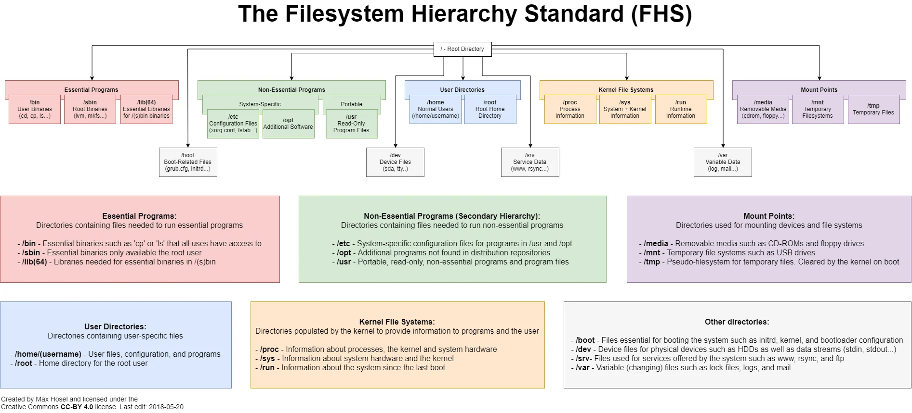 <a href="https://www.reddit.com/r/linux/comments/8kt99k/the_file_system_hierarchy_standard_visualized_or/" target="_blank" style="position: absolute; top: 4px; right: 4px; font-size: 12px;">[src]</a> </div>

The preceding paragraphs describe one file system on one disk, but a single machine may mount ext4 on its local disk, NFS for a remote share, and tmpfs for scratch space simultaneously. Even on the same back-end, different file systems embody different design tradeoffs (e.g. ext4 vs btrfs vs XFS). Without a common dispatch layer, every syscall would need to know which file system it is talking to. A [virtual file system]() (VFS) solves this by providing a single abstraction layer through which all file system operations pass. The in-kernel file object in the three-layer model is a VFS object, populated from the on-disk inode for disk-backed files or synthesised by the kernel for pipes, sockets, and pseudo-filesystems. Each filesystem registers a [file_operations]() struct whose function pointers implement *open*, *read*, *write* for that format; VFS dispatches every syscall through these pointers. [Mounting]() a FAT32 USB drive alongside APFS (Apple's default disk file system) requires no change to user-space code.

<!-- Every process resolves its binaries, libraries, and data relative to a root filesystem, and pivot_root() can change which filesystem tree a process sees as /. A union file system (e.g. OverlayFS, merged in Linux 3.18) stacks multiple directory trees, typically read-only lower layers and a single read-write upper layer, into one merged view via copy-on-write. These are examined in §607 (virtualisation). -->

<!--
An inode is a fixed-size struct stored on disk for every file.
It holds everything *about* the file except the name:

  inode #42
  ├── type:        regular file
  ├── size:        8,192 bytes
  ├── owner:       uid 1000
  ├── permissions: rwxr-xr--
  ├── timestamps:  created, modified, accessed
  ├── link count:  2 (two names point here)
  └── block pointers: [block 1047, block 1048]  ← where the actual bytes live on disk

A directory is just a file that maps names to inode numbers:

  directory /home/user/
  ├── "data.csv"    → inode #42
  ├── "backup.csv"  → inode #42   ← hard link, same inode
  ├── "notes.txt"   → inode #87
  └── ".bashrc"     → inode #91

The name isn't in the inode. The inode is the file; the directory entry
is the name. Two names can point to the same inode (hard link), and
deleting a name just decrements the link count. The actual bytes are
freed only when the link count hits zero.

The HFS is the naming layer (the tree of paths).
The VFS is the dispatch layer (routes operations to the right handler).
Together: HFS resolves path → inode, inode tells VFS what kind of thing
it is, VFS dispatches to the right code (filesystem, driver, procfs).
-->

<!-- Libraries like Python's *fsspec* replicate the VFS pattern in user space, letting *pd.read_csv()* accept local paths, S3 URIs, or HTTP URLs behind the same API, but those go through user-space HTTP clients (*boto3*), not the kernel's VFS. Mounting S3 as a local path via [FUSE]() (*s3fs*, *goofys*) bridges the two, routing VFS calls through a user-space daemon to the S3 HTTP API. -->


pipe() returns two fds pointing to one kernel buffer:
  Parent: fd 4 (write) ──→ pipe buffer ──→ fd 3 (read) :Child
  fork() duplicates the fd table, making cross-process pipes possible.

fd progression:
  files (1969)   → fd points to inode on disk
  pipes (1969)   → fd points to kernel buffer between processes
  sockets (1983) → fd points to network endpoint (IP, port)
  devices        → fd points to driver (/dev/*)


The fd abstraction grew from files (disk I/O) $\to$ pipes (inter-process byte streams) $\to$ sockets (network endpoints) $\to$ devices, each extending the same read/write interface to a new domain. In Unix, a file is therefore any I/O endpoint the kernel exposes through a file descriptor. [Device drivers]() bridge this abstraction to real hardware by implementing two contracts: upward, they conform to the kernel's file interface so that user-space sees a file descriptor; downward, they speak the device's register protocol, handle its interrupts, and manage its DMA buffers. When installed, a driver registers with the kernel's bus subsystem (e.g. PCI), probes the device, and exposes it as a file in */dev* (e.g. */dev/sda* for a disk, */dev/nvidia0* for a GPU). Pseudo-filesystems like */proc* (originating in 8th Edition Unix, 1984) and */sys* expose live kernel and hardware state through the same interface. These files have no backing data on disk; the kernel generates their contents dynamically on each *read()*, making system introspection as simple as reading a file.

- <div style="position: relative; display: inline-block;">  <a href="https://opensource.com/article/19/3/virtual-filesystems-linux" target="_blank" style="position: absolute; top: 4px; right: 4px; font-size: 12px;">[src]</a> </div>

<!-- <div style="position: relative; display: inline-block;"> 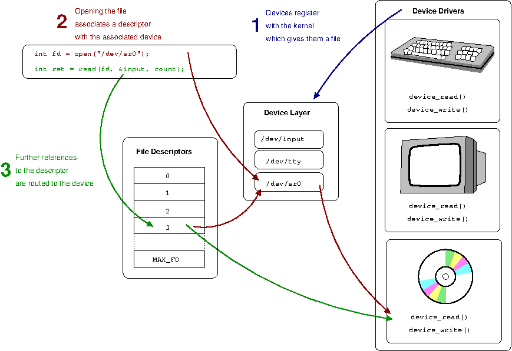 <a href="https://eng.libretexts.org/Under_Construction/Purgatory/Computer_Science_from_the_Bottom_Up_%28Wienand%29/0.02%3A_File_Descriptors" target="_blank" style="position: absolute; top: 4px; right: 4px; font-size: 12px;">[src]</a> </div> -->

<!-- tmpfs (/tmp) lives entirely in memory, not on disk.
     Temporary files disappear at reboot, avoiding device wear from frequent writes. -->

<!--
The same read(fd, buf, n) call, different sources of bytes:

  read(fd_file)       → kernel dispatches to filesystem → fetches from SSD
  read(fd_socket)     → kernel dispatches to TCP stack  → fetches from NIC
  read(fd_pipe)       → kernel copies from pipe buffer  → bytes from another process
  read(open("/proc/cpuinfo")) → kernel generates text   → live CPU info, not on disk
  read(open("/dev/urandom"))  → kernel generates bytes  → random number generator
  write(open("/sys/.../brightness"), "50") → kernel dispatches to driver → changes screen brightness

The application code is identical in every case. The kernel routes
the call to the right handler (filesystem, network stack, device driver,
or procfs) based on what the fd points to. This is why the abstraction
is powerful: the mechanism for moving bytes is uniform, regardless of
where they come from or go.

How data physically moves during read(fd, buf, 4096):

read(fd, buf, 4096)

USER SPACE                          RAM (physical)
┌──────────────┐
│ buf (virtual) │─ ─ ─ ─ ─ ─ ─ ─ ─ ─ ─ ─ ─ ─ ─ ─ ─ ─ ─ ─ ─ ─ ┐
└──────┬───────┘                                                  │
       │ 1. syscall                                               │
═══════╪══════════════════════════════════════════════════════════╪═══
       ▼                                                          │
KERNEL                                                            │
┌──────────────┐     ┌─────────────────────┐                      │
│ fd table     │────→│ 2. page cache       │──── hit? ────────────│
│ fd → inode   │     │ (RAM buffer)        │     copy to buf  ────┘
└──────────────┘     └────────┬────────────┘
                              │ miss?
                              ▼
                     ┌─────────────────────┐
                     │ 3. driver           │
                     │  compute block #    │
                     │  allocate DMA buf   │
                     │  program DMA ctrl   │
                     │  submit command     │
                     └────────┬────────────┘
                              │
═══════════════════════════════╪══════════════════════════════════════
                              ▼
HARDWARE (SSD)       ┌─────────────────────┐
                     │ 4. NVMe controller  │
                     │  read NAND flash    │
                     │  DMA write to RAM ──┼──→ page cache buffer
                     │  raise interrupt    │        │
                     └─────────────────────┘        │
                                                    ▼
                                          5. kernel copies to buf
                                             returns to user space

The CPU never moves the data from the device. The device writes
directly to RAM via DMA. The CPU only orchestrates (sets up DMA)
and gets notified (interrupt). This is why DMA exists (401 §1.1).
-->

