# Concurrency
---
> Concurrency, the interleaving of tasks so each advances without any finishing first, arises from two scarcities that appear similar yet demand opposite remedies: i) Waiting, where thousands of idle connections each tie down a thread, calls for event loops; and ii) Computing, where cores are few, calls for spreading work across them and the synchronisation shared memory forces.


 
- https://beej.us/guide/bgnet/html/split/                                

- §603 teaches what a thread is.
- §604 §I teaches when mapping one thread per connection is the wrong tool (I/O at scale); threading itself still lives underneath (event loops run in threads, Nginx offloads disk I/O to a thread pool).
- §604 §II teaches when you need shared-memory parallelism, what threads cost (synchronisation), and why Python reaches for processes instead (the GIL means CPython threads can't parallelise CPU-bound work until 3.13 free-threading).

I — Waiting. One thread per connection drowns at C10K (1.1) → one watchful thread over an event loop, kernel multiplexing beneath (1.2) → coroutines wrap the callbacks back into sequential code (1.3).
II — Computing. The second scarcity bites: cores must be fed. Processes, the safe way (2.1) → threads, the fast way that trades isolation for shared memory (2.2), ending on the bill coming due.
III — The bill. Shared memory races (3.1), hardware reorders (3.2), primitives cure both (3.3), and the cure deadlocks (3.4).

In one line: a scarcity of waiting solved by consolidation, a scarcity of computing solved by distribution, and the price of distribution paid in synchronisation.

Hardware → OS → Application arc (three layers, the isolated/shared axis runs through all):

  Hardware (CPU)              OS (nouns — what they are)          Application (verbs — how you wield them)
  ──────────────              ─────────────────────────           ────────────────────────────────────────
                        ┌──▶  process = resource-owning unit  ──▶ multiprocessing = parallelism via isolation
  N cores ─ parallelism ┤          (isolated address space)                        (no races, IPC cost → "safe")
  1 shared RAM/cache ───┤
                        └──▶  thread  = scheduling unit       ──▶ multithreading = parallelism via sharing
                                   (shared address space)                         (fast comms, synchronisation → "fast")

Hardware gives both rows the same two things: N cores (physical parallelism, §601 multi-core turn) over ONE
shared physical memory. The OS then packages that memory two ways — process ISOLATES it via virtual memory
(§603#3.2), thread EXPOSES it — so isolation is a software construction on top of physically-shared RAM,
while parallelism is the hardware given. The application turns each package into a technique.

One proportion: process : thread :: isolation : sharing :: multiprocessing : multithreading :: safe : fast
(N cores + one shared RAM are the common hardware root beneath both rows)

§601 owns the hardware (cores, the multi-core turn), §603 the middle column (defines the entities),
§604 the right (composes them into techniques). The isolated/shared address-space axis is the through-line.
Never cross the diagonal: §604 discusses multiprocessing/multithreading (techniques), never process/thread as OS entities.




Problem: Too many customers waiting at the same time

1.1 Thread-per-connection          1.2 I/O Multiplexing            1.3 Coroutines
─────────────────────────          ────────────────────            ──────────────

 Waiter A → Table 1                 One waiter watches             Same as 1.2,
 Waiter B → Table 2                 ALL tables at once             but the waiter's
 Waiter C → Table 3                                                notebook is
 Waiter D → Table 4                 "Anyone need something?"       easier to read
   ...                              → Table 7 says yes!
 Waiter 9999 → Table 9999           → Go serve Table 7
                                      "Anyone else?"
 😰 Too many waiters!               → Table 2 says yes!
 They bump into each other          → ...
 and the restaurant is full
 of staff, not food.               One waiter, 10,000 tables.       async/await
                                   select → poll → epoll            = neat handwriting

ELI5:

Imagine a restaurant where every table needs a waiter.

1.1 — You hire one waiter per table. Each waiter stands next to their table doing
nothing until the customer says "I'm ready to order." With 10 tables, fine. With 10,000
tables, your restaurant is packed with idle waiters who cost money and keep bumping
into each other. This is the C10K problem.

1.2 — You fire 9,999 waiters. One waiter stands in the middle and shouts "anyone need
anything?" The kitchen (kernel) tells him which tables are ready. He runs to those
tables, takes orders, comes back to the middle, and asks again. This is the event loop
with epoll. One waiter, thousands of tables.

1.3 — That one waiter's to-do list used to be a mess of sticky notes and callbacks
("when table 7 is ready, do X, then when Y finishes, do Z..."). Coroutines give him a
clean notebook where each page is one table's story from start to finish. He can pause
mid-page, help another table, and come back to the exact line he left off. This is
async/await — same waiter, same event loop, just much easier to read.



## I
---

### **1.1. Thread-per-Connection**

 

[Concurrency]() is the logical simultaneity of tasks making progress through interleaved executions, whereas [parallelism]() is their physical simultaneity on different processing units (e.g. CPU/GPU). Concurrency appeared first and spanned from batch processing and time-sharing to GUIs (i.e. Multics $\to$ UNIX $\to$ UI thread), but remained as the concern of the OS scheduler and the toolkit's message loop. Two developments pushed it onto the application programmer, who now composes the kernel's processes and threads (§603#3.1) rather than leaving them to the scheduler: i) networked services drove connections into the tens of thousands, exposing thread-per-connection limits; and ii) stalled clock speeds and the multi-core turn forced programs to be restructured explicitly.
 
- 
 
 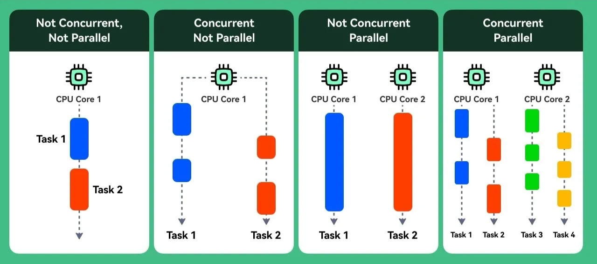 <a href="https://medium.com/hesaptech/from-threads-to-coroutines-modern-concurrency-and-parallelism-explained-ac5484377722" target="_blank" style="position: absolute; bottom: -8px; left: 4px; font-size: 12px;">[src]</a> 
 
E.g. single-core time-slicing is the 2nd case, and two independent programs on separate cores the 3rd.
 

<!-- - 
 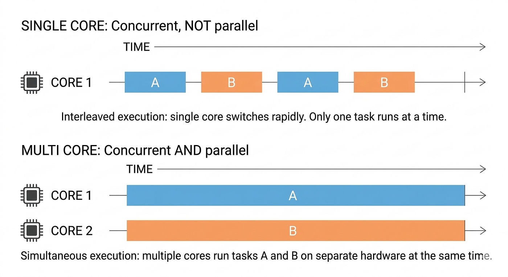 <a href="https://medium.com/womenintechnology/concurrency-parallelism-processes-threads-thread-safe-systems-1d4e7d351824" target="_blank" style="position: absolute; bottom: 2px; right: 4px; font-size: 12px;">[src]</a> 
 -->
 
The former arrived with the web (§605#3.2), whose tasks are predominantly [I/O-bound](), spending most of their time waiting on the network and other external resources (e.g. disk reads, DB queries).<!-- rather than on computation --> As client connections surged into the thousands, the initial attempt was the [thread-per-connection model]() (e.g. a multithreaded server), which assigns every connection its own kernel thread with a 1-8 MB user-space stack (§603#3.1). <!-- reminder: each thread gets its OWN stack + registers/PC, but SHARES the heap, code/data segments, and fd table with the other threads in the process. Stack is thread-private only by convention, not hardware protection (same address space), which is what makes data races possible (§III). Multiprocessing (§2.1) shares nothing, hence no races but needs IPC. --> However, the model fails at scale because those stacks exhaust memory and the OS scheduler spends more time context-switching than doing useful work. This wall at $10^4$ concurrent connections is known as the [C10K problem](http://www.kegel.com/c10k.html) (Dan Kegel, 1999). <!-- each stack is virtual and resident only as touched, alongside a 16 KB kernel stack for bookkeeping -->

If unbounded threads are the problem, a fixed thread pool bounds resource consumption but not concurrent capacity. A thread blocked in *read()* consumes no CPU <!-- which appears to cost nothing, --> yet still holds one of the pool's $N$ slots, and $N$ threads serve at most $N$ connections while further arrivals wait for a free slot. In effect, the scarce resource is the thread, not the idle CPU, because each connection pins one for the entire wait. The concurrency bound $N \gtrsim 10^4$ and the system-resource bound $N \ll 10^4$ leave no room for a viable $N$, so neither extreme cures a fault that lies in the [I/O model]() rather than the thread count, and reaching a better one first means surveying the I/O models on offer. <!-- an I/O model is the contract by which a program issues a request and learns of its completion -->


                        KERNEL                          │      APPLICATION
                                                        │      (thread pool, N=3)
  incoming                                              │      
  connections                                           │
  ──────────►   ┌──────────────────────────┐            │
                │   ACCEPT QUEUE (backlog) │            │
   C1 ────────► │                          │            │
   C2 ────────► │  the kernel finishes the │  accept()  │   ┌───────────┐
   C3 ────────► │  TCP handshake and parks │ ────────►  │   │ Thread 1  │─blocked on read(C1)
   C4 ────────► │  connections HERE until  │            │   ├───────────┤
   C5 ────────► │  a worker picks them up  │            │   │ Thread 2  │─blocked on read(C2)
   ...          │                          │            │   ├───────────┤
                │ \[C4\]\[C5\]\[C6\]\[C7\] │            │   │ Thread 3  │─blocked on read(C3)
                │   ▲                      │            │   └───────────┘
                │   │ waiting, established,│            │    all 3 slots taken
                │   │ but UNSERVICED       │            │
                └───┼──────────────────────┘            │
                    │                                   │
        queue fills │                                   │
                    ▼                                   │
   C99 ──────►  ✗ accept queue full → kernel drops the  │
                  client's ACK; the server retransmits  │
                  SYN-ACK, client eventually times out  │

Accepting a connection and serving it are different steps, done by different actors:

1. The kernel accepts connections on its own. C1-C99 all complete their TCP handshake without any worker thread, landing in the accept queue (the listen backlog). The kernel does not need your threads to establish a connection.
2. A worker thread must then call accept() to pull one off that queue and read() it. Here 3 threads each grabbed one connection (C1, C2, C3) and are now blocked in read(), waiting for that client to send data. That is the step that stalls when all N threads are busy.
3. While all 3 are blocked, C4, C5, C6... just sit in the queue, established but unserviced, because nobody is calling accept() for them. That is "queue behind them": they exist, they just wait.
4. The queue is finite. Once it fills, the kernel drops the client's ACK for further connections (C99) and never creates the socket; the server keeps retransmitting the SYN-ACK while the client re-ACKs, until a slot frees or the client eventually times out.

Two consequences make the point sharper:
- Latency balloons: a new connection waits for one of the N threads to free up before it gets any processing, even though the CPU is nearly idle.
- Past a point new connections do not merely wait, they fail.

This is why N-thread pooling does not solve C10K: serving 10,000 clients at once would need N ~ 10,000 blocked threads, the memory/scheduler wall from p2. The fix is to stop pinning a thread per connection so one thread can service many.


Specifically, two binary choices form the $2 \times 2$ matrix $R$ below. Its row index, {[synchronous](), [asynchronous]()}, distinguishes whether the I/O completes before the call returns or its completion is signalled later. Whereas, its column index, {[blocking](), [non-blocking]()}, hinges on whether the call suspends the thread or returns instantly. The thread-per-connection model $R_{00}$ cedes to the event loop $R_{10}$, in which one thread multiplexes many connections while still parking on a single wait. <!-- making waiting and working no longer compete for the same thread.--> Non-blocking is less favoured since $R_{01}$ squanders CPU busy-polling readiness through repeated $\text{EAGAIN}$ returns and $R_{11}$ awaited *io_uring* for a general completion interface. 


Blocking vs synchronous — pizza shop. Two axes:
  blocking     = do you stand still at the counter (thread parked)?
  synchronous  = is the pizza in hand when the interaction ends, or found out later (board/buzzer)?

  R00  sync  + blocking      order and STAND at the counter until handed the pizza.
                             wait (blocking), leave with it in hand (synchronous).       -> read()
  R01  sync  + non-blocking  order, then ASK "ready?" every 10s; instant "no / no / here".
                             never park, but keep pestering and collect it yourself.     -> read() + O_NONBLOCK (busy-poll)
  R10  async + blocking      order, then STARE at the "order ready" board, doing nothing
                             else until your number lights. stuck watching (blocking),
                             but the result is announced later (async); one board serves
                             every customer's order at once.                             -> select / epoll
  R11  async + non-blocking  order, take a BUZZER, go sit down / do other things; it buzzes
                             when ready. never waited, never asked — completion arrives.  -> AIO / io_uring

R01 (pestering) is non-blocking yet synchronous; R10 (watching the board) is blocking yet
asynchronous — which is why the two are separate axes. R00 (plain read) is both, where they get conflated.


- 
 
 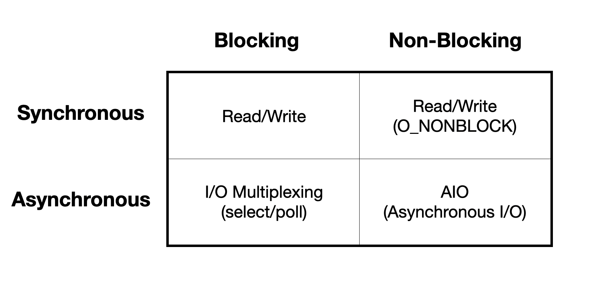 <a href="https://developer.ibm.com/articles/l-async/" target="_blank" style="position: absolute; top: 4px; right: 4px; font-size: 12px;">[src]</a> 
 
The matrix as arranged in the linked article. Stevens (<i>UNIX Network Programming</i>) instead classes multiplexing as synchronous, reserving asynchronous for AIO alone.
 

<!-- - <iframe width="500" height="285" src="https://www.youtube.com/embed/IMceN4_rieo?si=g-BBn2kbVFYctrXF" title="YouTube video player" frameborder="0" allow="accelerometer; autoplay; clipboard-write; encrypted-media; gyroscope; picture-in-picture; web-share" referrerpolicy="strict-origin-when-cross-origin" allowfullscreen></iframe> -->

<!-- - 
  <a href="https://notes.shichao.io/apue/ch15/" target="_blank" style="position: absolute;  bottom: -8px; right: 4px; font-size: 12px;">[src]</a> 
 -->

### **1.2. Event Loops**

 

Serving many connections from one thread demanded change on both sides. The application restructured around an event loop, while the OS evolved new syscalls to wait on many descriptors at once. Such a program is governed by [event-driven programming]() (§602#1.1), a paradigm that organises control flow around reactions to events rather than a fixed instruction sequence. The pattern long predates the C10K problem and appears in the GUI [message loop]() dispatching clicks and keystrokes (§603#1.1).<!-- also in discrete-event simulators advancing by popping the next event off a queue, showing the pattern is domain-general, not I/O-specific --> Networking is another instance with the same inversion of control in which the runtime, not the program, invokes the handlers whenever a descriptor becomes ready.



Inversion of control and cooperative scheduling are distinct axes that pair up here.
- Inversion of control = who calls whom: your code calls read() vs the loop calls your handler.
- Cooperative vs preemptive = who decides when to switch: the task yields voluntarily (await) vs the scheduler preempts via the timer interrupt.

The event loop is both: the loop calls your handlers (inverted) AND each handler runs to completion until it yields at an await (cooperative). Thread-per-connection is the opposite corner on both: your code drives the blocking read() (not inverted) and the kernel preempts it (preemptive). 1.3 p2 pays this off from the cooperative-scheduling angle (§603#3.1).



- 
 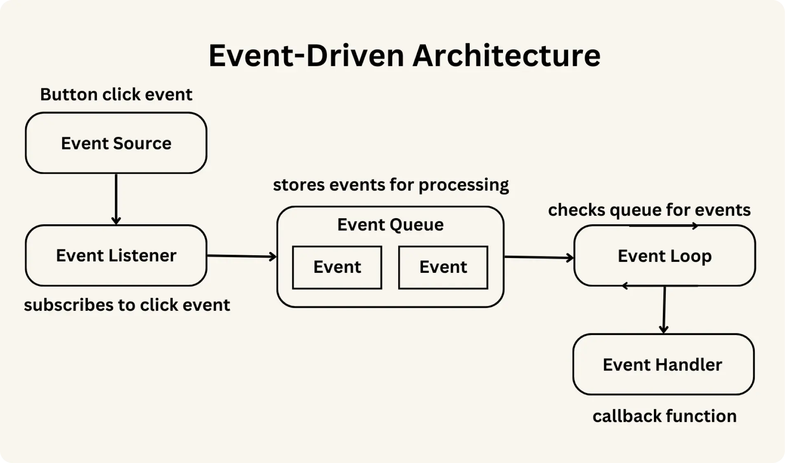 <a href="https://devworks.jp/blog/371" target="_blank" style="position: absolute; bottom: -8px; left: 4px; font-size: 12px;">[src]</a> 

The [event loop]() drives the invocation on a single application thread as a dispatcher rather than a program, running each ready handler to completion before returning to the wait, and thus lets the thread fan out across many connections instead of dedicating itself to one. Mechanically, it blocks on the kernel's multiplexing interface through a syscall (e.g. Linux: *epoll_wait()*, BSD: *kevent()*) until a watched descriptor becomes ready, then dispatches each ready descriptor to its registered handler (i.e. [callback]()). The same call also returns when a timeout set to the nearest scheduled timer elapses, which asyncio finds in $O(1)$ by keeping its timers in a [min-heap]() (i.e. the *heapq* module) keyed on deadline, so the loop runs due time-based callbacks even when no descriptor fires.<!-- libraries implement this dispatcher atop the readiness syscalls, e.g. libuv in Node.js, asyncio in Python (see 1.3). -->


The event loop is NOT a new kind of thread. It is the same ordinary OS thread running
different CODE. What changed is the shape of the code, not the thread. In C you write
both shapes by hand and they look different:

  // thread-per-connection: linear, blocks on read(). one thread per conn.
  void handle(int conn) {
      char buf[1024];
      read(conn, buf, 1024);   // blocks here until data arrives
      process(buf);
      write(conn, ...);
  }

  // event loop: YOU write the while(1) + epoll_wait dispatcher.
  while (1) {
      int n = epoll_wait(epfd, events, MAX, -1);   // blocks here, on ALL fds
      for (int i = 0; i < n; i++)
          handle(events[i].fd);                    // dispatch to per-fd handlers
  }

In Python asyncio HIDES that while-loop. You never type it:

  async def handle(conn):
      data = await conn.read(1024)   # reads linear, but SUSPENDS here
      ...
  asyncio.run(handle(conn))          # the while-True + epoll_wait lives in here

The await version looks like the linear C read() version, but underneath asyncio runs
the exact same while-True: epoll_wait -> dispatch loop. Coroutines (1.3) let you write
event-driven code in straight-line style while the loop runs hidden below. So: C = build
the loop by hand, two designs look different; Python = loop hidden, async def disguises
the event-driven version as linear code.



"a handler that blocks stalls every connection" is the same failure as the 1.3 coroutine case ("a coroutine that computes without awaiting stalls every other task"). The handler/ callback here IS the coroutine there. But the culprit is not the missing `await` keyword, it is the missing YIELD POINT: control returns to the loop only at an await that actually suspends (awaits I/O). Three cases:

1. async def, quick body, no await          -> fine. Runs to completion in microseconds.
2. async def, heavy CPU work, no await       -> STALLS. No yield point, thread stuck.
3. async def calling a blocking function      -> STALLS, even if it awaits elsewhere.
   (time.sleep, requests.get, sync DB driver)    No yield during the blocking call.

    async def handler(conn):
        time.sleep(2)            # blocking     -> loop frozen 2s, ALL connections stall
        await asyncio.sleep(2)   # yields       -> loop runs others meanwhile

Rule: not "you forgot await" but "this coroutine held the single thread without yielding."
Cases 2 and 3 are the real hazards; case 1 is harmless.




--- the epoll_wait cycle, userspace | kernel ------------------------------------

                     USERSPACE                        |        KERNEL
                                                      |
  await sock.read()  ----> register interest          |
  (coroutine suspends)     epoll_ctl(fd) -------------+--> add fd to watch-set
                                |                      |         |
                                v                      |         v
                          run other ready             |    kernel monitors fds,
                          coroutines...               |    marks ready as data
                                |                      |    arrives
                          nothing runnable?            |         |
                                v                      |         |
                          epoll_wait() ---------------+--> thread SLEEPS, 0% CPU
                          (thread parks)               |         |
                          wakes, gets  <--------------+--- return: [ready fds]
                          list of ready fds            |    (plain return, kernel
                                |                      |     never calls our code)
                                v                      |
                          map fd -> handler            |
                          (userspace table)            |
                                v                      |
  resume coroutine <------ call it  <-- THE CALLBACK    |
  (past the await)                                     |

Kernel side does NOT call back. epoll_wait() is a plain return that hands back the
ready fds. The "callback" is entirely userspace: the loop maps each ready fd to the
coroutine waiting on it and resumes it. Kernel = pull (we ask, it returns), not push.

--- mapped to Python -----------------------------------------------------------

- The loop IS asyncio's event loop, running on the main thread (asyncio.run() makes
  the main thread the loop). One thread total. uvloop swaps the engine (libuv) but
  keeps the same API; Uvicorn defaults to it when available.
- epoll_ctl / epoll_wait are reached via the stdlib `selectors` module, which picks
  epoll on Linux, kqueue on macOS/BSD. asyncio never calls epoll directly.
- `await sock.read()` = "register this fd, suspend me, resume me when it fires."
  The resume-after-await IS the callback; asyncio stored it as the fd's handler.
- epoll_wait() takes a timeout = time until the next scheduled timer (loop.call_later),
  so the loop wakes for timers too, not only fds. -1 = block forever, 0 = poll.


The loop however changed only what the application waits on, not how the I/O itself is performed. That is, the kernel still performs this through device drivers, DMA, and interrupts (§603#3.3), signalling the event loop the moment a descriptor is ready for its read. One main thread then suffices because I/O-bound work spends almost no CPU per connection. It stands in for the thousands that thread-per-connection needed and collapses their blocking waits into a single one.<!-- between events the loop holds nothing but a table of parked handlers --> Its one limit is concurrency without parallelism, since a single loop occupies one core and every additional core takes another loop.

- 
 
 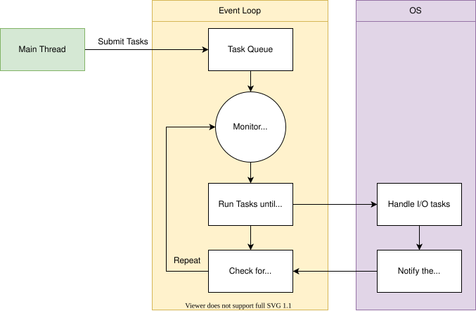 <a href="https://www.pythontutorial.net/python-concurrency/python-event-loop/" target="_blank" style="position: absolute; bottom: -8px; left: 4px; font-size: 12px;">[src]</a> 
 
A task is one unit of work the loop drives, run until it would block on I/O, handed to the OS, then resumed once the OS signals completion.
 

Beyond performing the I/O, the kernel must also watch it through [I/O multiplexing](), which lets many file descriptors (fds) share a single thread by tracking their readiness on the application's behalf. Its implementations (the syscall API) evolved from *select()* (4.2BSD, 1983, fixed fd limit, copies the entire fd set to the kernel on every call) $\to$ *poll()* (System V, 1986, dynamic, but still $O(n)$ scanning) $\to$ *epoll()* (Linux 2.5.44, 2002, registers fds once via *epoll_ctl* and returns only ready fds, achieving $O(1)$ per event) and *kqueue()* (FreeBSD, 2000). <!-- io_uring (Linux 5.1, 2019) is completion-based, not readiness multiplexing; see p6. --> In particular, *epoll()* supports two notification modes.


General multiplexing:     many consumers → one resource
  TDM:                    many users     → one CPU
  FDM:                    many signals   → one cable
  Statistical:            many packets   → one link
I/O multiplexing:         many fds       → one thread
 

[Level-triggered]() (default) reports an fd as ready whenever data is available in its buffer, so the application can read partially and be reminded on the next *epoll_wait()* call. [Edge-triggered]() (*EPOLLET*) reports an fd only when its state changes (e.g. new data arrives), so the application must drain the entire buffer in a loop until *EAGAIN* or risk missing data. The former is the default in Python's *selectors* module and most event loop libraries (e.g. Node.js's *libuv*) for its forgiving semantics, whereas the latter generates fewer notifications under high throughput and drives Nginx's network I/O and Go's *netpoller*<!-- Nginx is also widely used as a load balancer and TLS terminator due to its event-driven architecture -->.

The trigger modes govern network descriptors, yet the loop's coverage is not total. The readiness model assumes a descriptor can be *not ready*, which holds for sockets that wait on the network but not for regular files, whose data is deemed always available even when fetching it stalls on disk latency. Hence such reads report ready yet the actual *read()* blocks, and Nginx offloads blocking disk I/O (e.g. serving large video files) to a thread pool to keep the event loop responsive. Only [*io_uring*](https://kernel.dk/io_uring.pdf) (Linux 5.1, 2019) closes this gap, since its completion-based interface reports the finished read rather than a readiness that regular files cannot express. The kernel's side is thereby complete, leaving the application's, its logic scattered across callbacks, as the remaining cost. <!-- per-event handlers scatter one connection's logic across disconnected callbacks -->

- 
 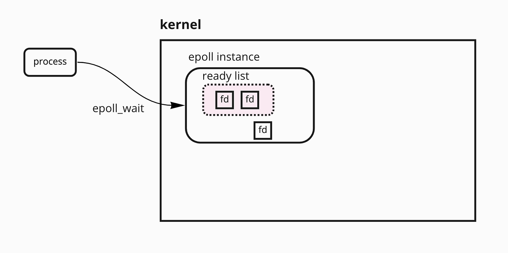 <a href="https://medium.com/@avocadi/what-is-epoll-9bbc74272f7c" target="_blank" style="position: absolute; bottom: -8px; left: 4px; font-size: 12px;">[src]</a> 

### **1.3. Coroutines**

 


The whole stack in one picture, read top-down. Everything above the ═══ line is your
process (user space, ONE thread); everything below is the kernel. `await` = "I'd block
here, so suspend me and let the loop ask the kernel to watch this fd." The thread never
blocks on a single connection — it blocks once, in epoll_wait, on behalf of all of them.

  ─────────────────  USER SPACE  (your process, ONE thread)  ─────────────────

  ┌─────────────────────────────────────────────────────────────┐
  │  YOUR CODE  (coroutines = async def functions)              │
  │   async def handle(conn):                                   │
  │       data = await conn.read(1024)   ← suspends here        │
  └───────────────┬─────────────────────────────────────────────┘
                  │ wrapped in
                  ▼
  ┌─────────────────────────────────────────────────────────────┐
  │  asyncio  (runtime / library)                               │
  │   Tasks:  (T1)(T2)(T3) ...   ← each Task = one coroutine    │
  │   ┌───────────────────────────────────────────────────┐     │
  │   │  THE EVENT LOOP  (while-True on the main thread   │     │
  │   │  — this IS the single thread)                     │     │
  │   │  1. pop a ready Task, run it until it awaits      │     │
  │   │  2. on await read(): register fd, park the Task   │     │
  │   │  3. no Task can run → BLOCK in the kernel         │     │
  │   │  4. kernel returns ready fds → wake their Tasks   │     │
  │   │  5. goto 1   ("Repeat")                           │     │
  │   └───────────────────────┬───────────────────────────┘     │
  │   ┌───────────────────────▼───────────────────────────┐     │
  │   │  selectors  (portability shim)                    │     │
  │   │   Linux → epoll   BSD/mac → kqueue   Win → IOCP   │     │
  │   └───────────────────────┬───────────────────────────┘     │
  └───────────────────────────┼─────────────────────────────────┘
                              │ epoll_wait()  (down, the ONE blocking call)
                              │ ready fds     (up, back to the loop)
  ════════════════════════════╪══════  KERNEL  ══════════════════
                              ▼
  ┌─────────────────────────────────────────────────────────────┐
  │  epoll instance  (kernel data structure, per process)       │
  │   registered fds:  fd3 fd7 fd9 fd12 ...   (interest)        │
  │   ready list:     (fd7)(fd12)   ← subset that fired         │
  │        └── epoll_wait returns ONLY these ──► back to loop   │
  └──────────────────────────▲──────────────────────────────────┘
                             │ readiness comes from below
  ┌──────────────────────────┴──────────────────────────────────┐
  │  sockets / TCP stack   (each fd has a recv buffer)          │
  └──────────────────────────▲──────────────────────────────────┘
                             │
  ┌──────────────────────────┴──────────────────────────────────┐
  │  NIC → DMA → interrupt   (hardware does the actual I/O)     │
  │  packet arrives → DMA into kernel memory → fd marked ready  │
  └─────────────────────────────────────────────────────────────┘

Trace of one request:
1. await read() — socket buffer empty, nothing to return.
2. coroutine SUSPENDS; asyncio registers the fd with epoll and parks the Task.
3. loop runs other Tasks; when none can progress, it calls epoll_wait() and the
   thread sleeps in the kernel (no CPU used).
4. packet arrives — NIC → DMA → interrupt fills fd7's socket buffer, fd7 → ready list.
5. epoll_wait returns just the ready fds (fd7) — not all registered ones (epoll's O(1)).
6. loop maps fd7 → parked Task, RESUMES it; read() copies bytes kernel→data; coroutine
   continues from the exact line it left off.
7. Repeat.

  ┌────────────┬──────────────────────────────────────────────┬───────────────────────┐
  │ term       │ what it is                                   │ where in the picture  │
  ├────────────┼──────────────────────────────────────────────┼───────────────────────┤
  │ coroutine  │ your async def, pausable at each await       │ top box               │
  │ Task       │ a coroutine the loop is actively driving     │ asyncio box           │
  │ event loop │ while-True on the single thread that runs    │ asyncio box           │
  │            │ Tasks and calls epoll_wait                   │                       │
  │ epoll      │ kernel structure + syscall that tracks which │ below the line        │
  │            │ fds are ready                                │                       │
  │ read()     │ the actual byte copy, kernel buffer → your   │ step 6                │
  │            │ variable, that runs AFTER readiness          │                       │
  └────────────┴──────────────────────────────────────────────┴───────────────────────┘


Coroutines do not replace the event loop but change its unit of work from a raw callback to a coroutine. A [coroutine](https://dl.acm.org/doi/10.1145/366663.366704) (Conway, 1963) generalises the ordinary [subroutine](), which runs from a single entry to completion, into a function that suspends at explicit points (*yield*, *await*) with its local state preserved and resumes exactly where it left off. Raw callbacks are error-prone and deeply nested (i.e. [callback hell]()), scattering one connection's logic across handlers and hand-threaded state, whereas a coroutine keeps that state in its local variables and its logic reads top to bottom as in the blocking style.

The event loop schedules cooperatively, its coroutines yielding control explicitly rather than being preempted. This revives the model the OS abandoned for the timer interrupt (§603#3.1), safe again since one loop's tasks belong to one program rather than strangers the kernel must referee. Each *await* on I/O suspends the coroutine and hands its fd to the loop, whose single thread blocks in the *epoll_wait()* a C programmer would write by hand, making *async* / *await* portable across readiness mechanisms. The bargain still binds, since a coroutine that computes or calls a blocking function without reaching an *await* stalls every other task, so CPU-bound work belongs in the mechanisms that follow.


Preemptive vs cooperative is a property of the scheduler, not a single object.

  Mechanism                  Scheduling
  ─────────────────────────  ────────────────────────────────────────────────
  OS threads                 Preemptive (OS can interrupt execution)
  Coroutines (async/await)   Cooperative (must explicitly yield with await)
  Event loop                 Cooperative dispatcher (never preempts a running task)

The loop and its coroutines are two halves of one cooperative regime: the coroutine
is the unit that yields (await), the loop is the dispatcher that depends on those yields.
Neither preempts — there is no timer interrupt inside the loop. Preemption is the OS
thread scheduler's job. So `while True: pass` in one coroutine hangs the whole loop.


Switching between coroutines is cheap, nanoseconds against the microseconds an OS thread context switch costs, since it saves only a suspended frame in user space, avoiding the kernel-mode transition a thread switch requires. This keeps a coroutine's cost in the language runtime rather than the scheduler, which is why one thread can hold far more of them than the machine could hold threads. Coroutines are a language-general construct, reaching C# (5.0, 2012) before Python and the rest (JavaScript, Kotlin, Rust) after, yet Python is the instructive case because its runtime hides the event loop most completely. <!-- [Stackful coroutines]() maintain their own stack (like threads but lighter), while [stackless coroutines]() use heap-allocated activation records. -->


Coroutines are a general concept, not Python-specific.
Term coined by Melvin Conway (1963), originally implemented in assembly.

  Simula (1967): coroutine-like constructs
  Lua (1993): stackful coroutines
  C# 5.0 (2012): async/await
  Python 3.5 (2015): async/await
  JavaScript ES2017 (2017): async/await
  Kotlin (2018): coroutines
  Rust (2019): async/await
  C++20 (2020): coroutines

The level of abstraction differs by language. In C, the event loop is your code:
you call epoll_wait directly, write the while loop, and dispatch handlers yourself.
In Python, the event loop is buried under layers of abstraction (asyncio, FastAPI),
and it's easy to forget there's a loop calling a kernel syscall underneath.

C programmer sees:                Python programmer sees:
                                  
while (1) {                       async def handle(request):
    n = epoll_wait(epfd, ...);        data = await db.fetch()
    for (i = 0; i < n; i++)           return Response(data)
        handle(events[i].fd);
}

Both are event loops. The Python one is just hidden.

Full responsibility stack:
  Kernel devs:      implement epoll
  Runtime devs:     implement coroutine machinery (CPython, V8)
  Library devs:     implement asyncio, libuv (wrap both above)
  Framework devs:   implement FastAPI, Express (wrap libraries)
  You:              write async def and await


- 
 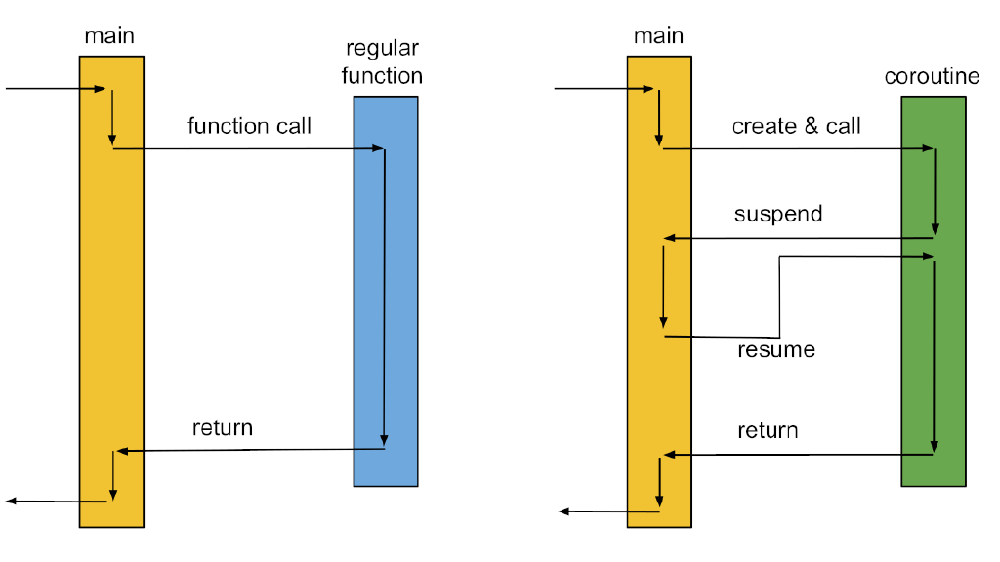 <a href="https://blog.eiler.eu/posts/20210512/" target="_blank" style="position: absolute; bottom: -8px; right: 4px; font-size: 12px;">[src]</a> 

Python's initial coroutine implementation repurposed [generators]() (*yield*, Python 2.2), which already suspend and resume on demand, and two amendments generalised it by letting a generator: i) receive values (*send*, [PEP 342](https://peps.python.org/pep-0342/)); and ii) delegate to sub-generators (*yield from*, [PEP 380](https://peps.python.org/pep-0380/)). The [*asyncio*](https://docs.python.org/3/library/asyncio.html) module (3.4, 2014) later implemented the event loop on this machinery, a *while* loop that repeatedly runs coroutines and waits for I/O readiness through the [*selectors*]() module, a thin wrapper over the kernel's multiplexing syscalls. Python 3.5 (2015, [PEP 492](https://peps.python.org/pep-0492/)) added native *async* / *await* keywords, so coroutines became a first-class construct rather than disguised generators, an *async def* function being a coroutine and each *await* its yield point.

Yet the syntax alone creates no concurrency since awaiting a coroutine merely runs it inline. Concurrency arises when the loop drives many coroutines at once, each wrapped in a [Task](), its scheduled form, which the loop places on the [ready queue]() and advances as the awaited fd signals. For example, *asyncio.gather* launches many Tasks together, thus one thread interleaves thousands of outstanding requests, each parked at its own *await*. *asyncio.TaskGroup* (3.11, 2022) was later introduced to provide [structured concurrency](), which scopes sibling Tasks so that one failure cancels the rest, while *gather* leaves them a loose bundle that fails independently.


import asyncio    # event loop + coroutine scheduler
import aiohttp    # async HTTP client built on asyncio (2014)
import httpx      # sync/async HTTP client (2019) — modern alternative to aiohttp

\# Python 3.4 — generator-based coroutine
@asyncio.coroutine
def fetch(url):
    response = yield from aiohttp.request('GET', url)
    body = yield from response.read()
    return body

\# Python 3.5 — native coroutine
async def fetch(url):
    response = await aiohttp.request('GET', url)
    body = await response.read()
    return body

"awaiting a coroutine merely runs it inline": from the caller's viewpoint,
await some_coro() behaves like an ordinary function call — the caller stops at
that line, the coroutine runs to completion, the result comes back, then the
next line executes ("inline" = within the caller's own execution path, as if
the body were pasted at the await site).

a = await fetch(url1)   # runs to completion first
b = await fetch(url2)   # only starts after a is done

→ strictly sequential, total time = sum, same as blocking calls. The two never
overlap because neither was made a Task, so the loop has one runnable chain and
just follows it. The suspension machinery still works — while fetch waits on
its socket the loop COULD run other Tasks — but if none were created there is
nothing to interleave. 

Concurrency needs siblings:

a, b = await asyncio.gather(fetch(url1), fetch(url2)) 
\# both in flight, time ≈ max


### **1.4. HTTP Servers**

 

The entire arc (i.e. thread-per-connection $\to$ event loops $\to$ coroutines) resurfaces in Python web frameworks. Historically a Python application was bound to a particular server through CGI or mod_python, until the [web server gateway interface]() (WSGI, 2003) decoupled the two so that any compliant app runs on any compliant server, a contract the [asynchronous server gateway interface]() (ASGI, 2016) later generalised to the asynchronous model. A WSGI framework exposes a single synchronous callable *app(environ, start_response)* that the server invokes once per request, whereas an ASGI framework exposes an *async def app(scope, receive, send)* whose *receive* and *send* channels stream events across the asyncio loop.

- 
 
 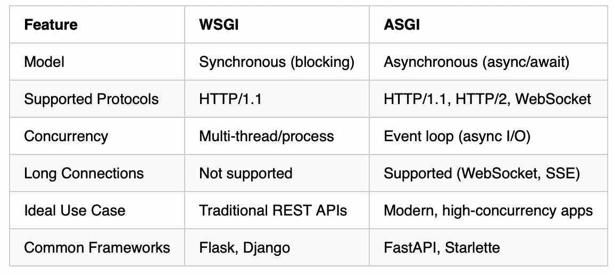 <a href="https://medium.com/@dynamicy/asgi-vs-wsgi-a-complete-guide-to-their-differences-and-fastapi-applications-9857f13c4521" target="_blank" style="position: absolute; bottom: -8px; right: 4px; font-size: 12px;">[src]</a> 
 
E.g. ASGI admits long-lived connections (WebSocket, SSE) that WSGI's one-request-one-response contract cannot express.
 

In practice, the ASGI side forms a stack of layers, each wrapping the one beneath. At the bottom, [*asyncio*]() (2014) is the event loop that drives the socket I/O via the OS (§603#2.2). [*Uvicorn*]() (2017), the ASGI server above it, runs the loop and turns each HTTP request into a coroutine call (e.g. *httptools* parses the raw bytes). [*FastAPI*]() (2018) atop the stack routes and validates the request into the *async def* handler the loop ultimately drives. Note that ASGI is only a contract between server and app, hence either side substitutes freely (e.g. Uvicorn $\leftrightarrow$ Hypercorn, FastAPI $\leftrightarrow$ Starlette), and even asyncio's loop engine may become [*uvloop*](), built on the same libuv as Node.js.

Within a single worker any request that blocks stalls the rest because they all share the loop's single thread. One such offender is an ordinary *def* endpoint, which carries no *await* and would hold the thread through its whole body unless the framework runs it in a thread pool. The same hazard attends any blocking call reached from a coroutine (e.g. *time.sleep* instead of *asyncio.sleep*, a synchronous database driver), thus an async server demands async libraries throughout. CPU-bound work stalls the loop equally but merits a process pool rather than a thread pool, since only processes convert the host's remaining cores into parallelism.<!-- computation that never waits gains nothing from an event loop -->

The loop occupies at most one core, however many the host offers, hence [*Gunicorn*]() (2010), a pre-fork master descended from Ruby's Unicorn, forks and supervises one Uvicorn worker per core by convention. The arrangement layers core-level parallelism over each loop's concurrency. In containerised deployments an orchestrator such as Kubernetes replaces the master and replicates single-worker containers for the same parallelism and resilience (§607#3.1). A reverse proxy such as [Nginx]() (2004, written in C) sits in front of the worker pool, where it terminates TLS and buffers slow clients such that the workers see only complete and fast requests.


The ASGI stack layers, each wrapping the one below, so the programmer only writes
async/await handlers:

  asyncio     the event loop — drives coroutines, calls selectors
  Uvicorn     ASGI server — runs the asyncio loop, speaks HTTP,          <- runs asyncio
              turns each request into a coroutine
  FastAPI     ASGI app framework — routing, validation, your handlers    <- runs on Uvicorn
  your code   async def endpoints

Not alternatives at one layer: asyncio IS the loop; Uvicorn is the SERVER that runs it; FastAPI is the APP framework that runs on the server. The contract between server and app is ASGI — swap either side (Uvicorn<->Hypercorn, FastAPI<->Starlette). Uvicorn can also swap the loop itself for uvloop (libuv-based, faster) without the layers above noticing.

One line: Uvicorn runs asyncio; FastAPI runs on Uvicorn via ASGI. (libuv is Node.js's
equivalent of the asyncio+uvloop layer.)


- 
 
 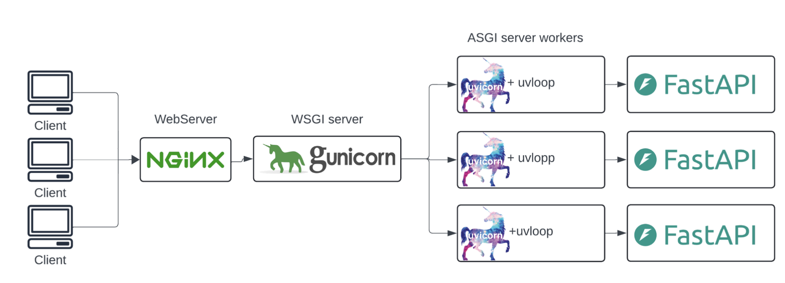 <a href="https://github.com/alisharify7/gunicorn-uvicorn-nginx" target="_blank" style="position: absolute; top: 4px; left: 4px; font-size: 12px;">[src]</a> 
 
Each tier owns one concern, Nginx the TLS and slow clients, Gunicorn the worker lifecycle, and each Uvicorn+uvloop worker the async request handling.
 

## II
---

### **2.1. Multiprocessing**

 

<!-- Progression: safe approach (multiprocessing) → fast approach (multithreading) → the cost of the fast approach (shared state) → naturally leads to §III Synchronisation -->

[CPU-bound]() workloads (e.g. numerical computation, compression, encryption) saturate the processor and benefit from true parallelism across multiple cores. Event loops solved the waiting that came with scaling connections, whereas stalled clock speeds and the multi-core turn are what now bite. Most real systems are hybrid, where I/O stages feed CPU stages in a pipeline (e.g. fetch → transform → write). More specifically, two approaches parallelise the CPU stages, multiprocessing and multithreading. They differ chiefly in whether the parallel work shares memory or stays isolated, hence in whether communication is cheap or synchronisation-free.

In fact, the speedup from adding processors is not automatic but bounded by a program's sequential fraction, as [Amdahl's Law](https://en.wikipedia.org/wiki/Amdahl%27s_law) (1967) and [Gustafson's Law](https://en.wikipedia.org/wiki/Gustafson%27s_law) (1988) formalise. The former sets the problem size fixed and says that, if a fraction $f$ of a program is sequential, the maximum speedup on $p$ processors is $1/(f + (1-f)/p) \to 1/f$ as $p \to \infty$ (e.g. $f = 0.05 \Rightarrow 1/f = 20$). The latter instead lets the problem grow with $p$, whereby the parallel part scales with $p$ while the serial part stays fixed, and yields the scaled speedup $f + (1-f)p$, linear in $p$. The two answer different questions: the speed gained on a fixed problem vs. the work gained in equal time.

[Multiprocessing]() runs parallel work in separate processes (§603#3.1), each in its own address space. Because it shares no memory, it rules out data races by construction and isolates crashes, for instance one Chrome tab failing without bringing down the others, at the cost of a per-process page table, fd table, and kernel bookkeeping plus explicit IPC to communicate. Even so, fork-based multiprocessing underlies traditional web servers (Apache prefork), database engines (PostgreSQL, §606#3.3), and modern ASGI deployments (Gunicorn forking one Uvicorn worker per core).

In Python, the *multiprocessing* module (2.6, 2008) and *ProcessPoolExecutor* (3.2, 2011) bypass the GIL by giving each worker process its own interpreter, and so its own cores. Each worker returns its result via serialisation (pickle, §605#4.1). A worker pool that maps one operation across partitioned data (*Pool.map*) is [data parallelism](), whereas routing distinct pipeline stages to distinct processes is [task parallelism](), the two ways to decompose parallel work that §608 scales from cores to machines.

- 
 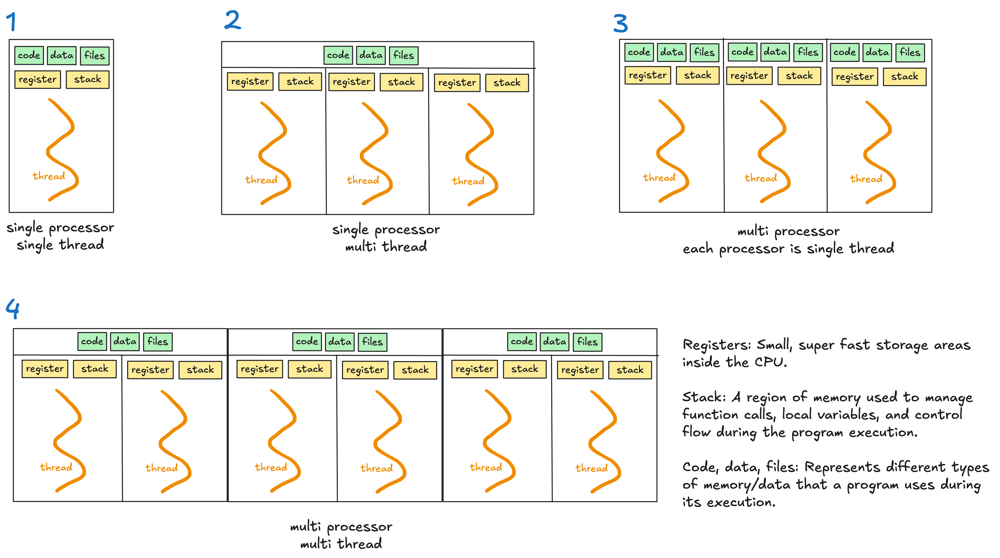 <a href="https://towardsdatascience.com/deep-dive-into-multithreading-multiprocessing-and-asyncio-94fdbe0c91f0/" target="_blank" style="position: absolute; bottom: -8px; right: 4px; font-size: 12px;">[src]</a> 

### **2.2. Multithreading**

 

[Multithreading]() trades isolation for a shared address space, partitioning the process's state such that every thread reads and writes the same regions (e.g. heap, text, data segments) and inherits the same kernel resources (e.g. fd table, signal dispositions), while private to each remain only its register set (PC included) and stack. It is lighter and so faster than multiprocessing, as communication reduces to ordinary memory access rather than IPC, but pays for it in synchronisation. The small private remainder also prices the switch. One between threads of a process leaves invariant the page table and TLB that one between processes must swap and flush (§603#3.1).

<!--
Analogy (people = cores, calculators = memory):
Multiprocessing:  2 people, 2 calculators. True parallelism, full isolation.
                  To share a result, write it on a note and pass it (IPC).
Multithreading:   2 people, 1 calculator (shared memory). True parallelism,
                  but must coordinate who presses buttons when (synchronisation).
GIL:              2 people, 1 calculator, but only one is allowed to touch it
                  at a time. The other just waits. You have the cores but can't use them.
-->

Yet the cost has not vanished. A thread reduces to a triple $($register set, stack, scheduler$)$, and whichever layer supplies the triple pays the same bill of creation, storage, and switching.<!-- the private pair (register set, stack) extended by a scheduler --> Namely, an application spawns $m$ [user threads](), each created by its runtime at an allocation and switched at a function call unseen by the kernel. By contrast, the kernel supplies $n$ [kernel threads](), each at a syscall and a kernel stack, orders of magnitude dearer, for they alone are dispatched onto cores. A threading model that fixes the ratio $m \colon n$ of user to kernel threads is hence a strategy for how much of the bill to pay at kernel prices by trading parallelism against abundance.<!-- parallelism, which only kernel threads reach; abundance, which only user-space cheapness affords -->

The [$1 \colon 1$ model]() (POSIX threads, Windows threads), today's default, sets $n = m$, backing each user thread with its own kernel thread, as glibc's [native POSIX thread library]() (NPTL, 2003) does on Linux beneath C, Java, and CPython threads alike. <!-- The model won Linux once kernel threads and futexes grew cheap, NPTL's simplicity beating IBM's m:n NGPT. --> Its virtue is that the runtime does nothing, every user thread being directly schedulable and stalling no other whether it blocks or computes, since the kernel deschedules it on a block and preempts it by the timer interrupt otherwise. Every operation is instead billed at kernel prices, and the cost scales as $O(m)$ in syscalls and memory alike, a *clone()* and a multi-MB stack per creation plus a kernel entry per block and wake, capping $m$ at the thousands, the earlier C10K wall.<!-- thread-per-connection's wall; also a ~16 KB kernel stack per thread -->

<!-- the two remaining models answer a different question, not how to use every core but how to hold more concurrent flows than the kernel could ever afford to carry --> The [$m \colon 1$ model]() ([green threads](), early Java) drops the kernel's share to zero. The runtime keeps every triple and multiplexes all user threads onto the process's main thread, cheap enough to spawn one flow per task. The kernel however sees one thread, so nothing runs in parallel and one blocking syscall (e.g. disk I/O) stalls all $m$. The [$m \colon n$ model]() (Go goroutines, Erlang processes, Java virtual threads) instead splits the bill such that cheapness and parallelism coexist. The runtime keeps the $m$ triples while the kernel carries a constant $n$ of typical kernel threads ($m \gg n$, one per core), and a [runtime scheduler]() migrates user threads across the $n$ on blocking. <!-- the kernel contributes nothing special here: the runtime merely requests n ordinary kernel threads and stacks its own scheduler on the kernel's -->

- 
 
 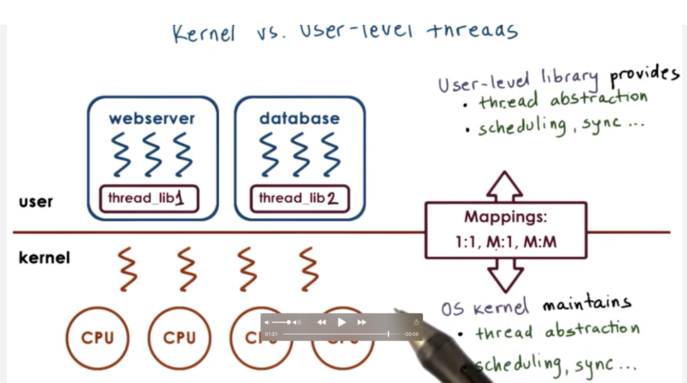 <a href="https://www.omscs-notes.com/operating-systems/thread-design-considerations/" target="_blank" style="position: absolute; bottom: -8px; left: 4px; font-size: 12px;">[src]</a> 
 
Each layer supplies its own thread abstraction, scheduling, and synchronisation, joined only by the mapping.
 

In practice, the $1 \colon 1$ default leaves threads too expensive to spawn per task, thus an application pre-creates a fixed number in a [thread pool]() and reuses them across tasks, amortising the creation cost. <!-- the OS only hands out kernel threads one clone() at a time; pooling is always the application layer or a library on its behalf --> Specifically, in Python, *ThreadPoolExecutor* is the explicit pool the application constructs and sizes. Libraries also provision one implicitly, as in i) *asyncio.to_thread*'s default executor; ii) FastAPI's $\sim$40-thread pool shielding its loop from *def* endpoints; and iii) OpenBLAS's worker threads beneath NumPy's linear algebra<!-- OpenBLAS is NumPy's default BLAS backend, MKL in some builds; also gRPC's server takes a ThreadPoolExecutor -->. Either way the size settles at the core count when CPU-bound and diverges as blocking rises when I/O-bound, since a blocked thread holds no core. <!-- in CPython the "CPU-bound pool" must be a process pool (GIL), unless the work releases the GIL (NumPy, hashing) --> <!-- FastAPI's def-endpoint pool is AnyIO's, via Starlette -->

The same shared address space that made these threads cheap now threatens their correctness, since communication through common memory equally lets concurrent access corrupt it. A function or data structure is thus [thread-safe]() only if concurrent calls cannot corrupt its result, won either by avoiding shared mutable state (immutability, thread-local storage) or by guarding it with synchronisation primitives. On Unix-like systems those primitives are standardised as [POSIX Threads]() (*pthreads*, POSIX.1c, 1995), whose *pthread_create*, *pthread_mutex_lock*, and related calls most languages wrap into higher-level APIs (Python's *threading*, C++'s *std::thread*).

More specifically, in CPython the [Global Interpreter Lock](https://wiki.python.org/moin/GlobalInterpreterLock) (GIL), a mutex admitting one thread to run bytecode at a time, withholds the parallelism *threading*'s real $1\colon1$ kernel threads would otherwise deliver. They speed only I/O-bound work, which releases the GIL while blocked in a syscall, never CPU-bound work, which yields it only when forced. That forcing is CPython's own 5 ms switch interval (*sys.getswitchinterval*), layered on the OS timer to make a long-running holder release the GIL so waiting threads take turns, one at a time and never in parallel.

The lock exists because even reading an object on the shared heap (§602#1.3) mutates its reference count, so per-object locks would number in the millions, their overhead crippling the single-threaded case Python (1991) was built for. One interpreter-wide lock collapses the millions to one at the price of multicore, a bargain struck by CPython, not the language, on the single-core machines of its day, and one sparing C extensions any change<!-- since refcounts are guarded wholesale -->.

Python 3.13 (2024) took the other path, the one Greg Stein's 1999 patch first tried and was rejected for slowing single-threaded code, now an experimental [free-threaded mode]() ([PEP 703](https://peps.python.org/pep-0703/)) that trades the single lock for per-object locking, at a measurable single-thread overhead and C extensions that must opt in (*Py_mod_gil*).<!-- per-object locking eased by biased reference counting, immortal singletons, deferred reference counting for hot globals (functions, modules), and a thread-safe mimalloc allocator --> The removal is staged, as 3.14 (2025, [PEP 779](https://peps.python.org/pep-0779/)) made the build officially supported and restored the specialising interpreter 3.13 had disabled, narrowing the overhead toward the single digits, while 3.15 converges on one free-threaded default build. The trade is worth making only now that idle cores cost more than the GIL ever saved, bringing true CPU-bound parallelism and with it the synchronisation problems that follow.

- 
 <iframe src="../assets/blog/memory-region.html" width="525" height="574" style="border: none; overflow: hidden; display: block;" scrolling="no"></iframe> 
Under the GIL only 1 of 4 cores runs Python, whereas free-threaded runs 3 threads on 3 cores.
 

<!--
1:1 Model (pthreads, Java, Python threading)

  Your Program                          OS Kernel
  ┌─────────────────────┐              ┌──────────────────────┐
  │  Thread A ──────────┼──────────────┼→ Kernel Thread 1 ──→ Core 0
  │  Thread B ──────────┼──────────────┼→ Kernel Thread 2 ──→ Core 1
  │  Thread C ──────────┼──────────────┼→ Kernel Thread 3 ──→ Core 2
  │  Thread D ──────────┼──────────────┼→ Kernel Thread 4 ──→ Core 3
  └─────────────────────┘              └──────────────────────┘

  ✓ true parallelism (4 cores)
  ✗ each thread = syscall + 1-8 MB stack + kernel bookkeeping

m:1 Model (green threads, early Java on Solaris)

  Your Program                          OS Kernel
  ┌─────────────────────┐              ┌──────────────────────┐
  │  User Thread A ─┐   │              │                      │
  │  User Thread B ─┤   │              │                      │
  │  User Thread C ─┼───┼──────────────┼→ Kernel Thread 1 ──→ Core 0
  │  User Thread D ─┤   │              │                      │
  │  User Thread E ─┘   │              │                      │
  │                     │              │  Core 1 (idle)       │
  │  [user scheduler    │              │  Core 2 (idle)       │
  │   picks A,B,C,D,E   │              │  Core 3 (idle)       │
  │   one at a time]    │              │                      │
  └─────────────────────┘              └──────────────────────┘

  ✓ cheap creation (no syscall, tiny stack)
  ✗ no parallelism (OS sees 1 thread, uses 1 core)
  ✗ one blocking syscall stalls all threads

m:n Model (Go goroutines, Erlang processes)

  Your Program                          OS Kernel
  ┌─────────────────────┐              ┌──────────────────────┐
  │  Goroutine 1 ─┐     │              │                      │
  │  Goroutine 2 ─┼─────┼──────────────┼→ Kernel Thread 1 ──→ Core 0
  │  Goroutine 3 ─┘     │              │                      │
  │                     │              │                      │
  │  Goroutine 4 ─┐     │              │                      │
  │  Goroutine 5 ─┼─────┼──────────────┼→ Kernel Thread 2 ──→ Core 1
  │  Goroutine 6 ─┘     │              │                      │
  │                     │              │                      │
  │ [runtime scheduler  │              │                      │
  │  assigns goroutines │              │  Core 2 (available)  │
  │  to kernel threads, │              │  Core 3 (available)  │
  │  migrates on block] │              │                      │
  └─────────────────────┘              └──────────────────────┘

  ✓ cheap creation (user space, ~2 KB stack)
  ✓ true parallelism (multiple kernel threads on multiple cores)
  ✓ blocking handled (runtime moves goroutine to another kernel thread)
-->

## III
---

### **3.1. Race Conditions**

 

Although shared memory makes communication fast, concurrent executions can corrupt whatever they share, and a [race condition]() is any such outcome whose correctness depends on the timing of concurrent operations (e.g. two processes both finding a file absent and both creating it). The root cause is [non-atomicity](), where a single statement (e.g. *x += 1*) typically compiles to several instructions ($\text{load}$, $\text{add}$, $\text{store}$), and another execution can interleave in any gap between them, whether by timer preemption (§603#3.1) on a single core or genuine simultaneity across two. <!-- even when x86 emits a single add [mem], 1, the read-modify-write is not atomic across cores without a LOCK prefix --> The span of code that must execute atomically is formally called the [critical section](). <!-- such that no other thread observes it half-finished --> <!-- Two threads reading and writing the same variable can produce different results on every run. -->

Thus, the unprotected critical section is the archetypal site of a race, though not the only one, and three forms recur. i) check-then-act: two actors test a condition and then both act on it, as in the file creation above; ii) lost wakeup: a signal fires before its waiter sleeps; and iii) the [data race](): two unsynchronised accesses touch one memory location with at least one write (i.e. two concurrent reads never conflict). The first form matters enough in security to carry its own name, [time-of-check to time-of-use](https://cwe.mitre.org/data/definitions/367.html) (TOCTOU), as an attacker who slips a symlink between a program's *access()* check and its *open()* redirects the privileged operation to a file of their choosing. <!-- TOCTOU = time-of-check to time-of-use: a privileged program validates a path then opens it, and an attacker races a symlink into the gap to reach a file it could not -->

The first two forms are semantic races, a matter of operations happening in the wrong order, whereas the data race stands apart as a memory-level condition. Despite the popular subset diagram, race condition and data race coincide in neither direction. Two individually atomic withdrawals racing on arrival order form a race condition without a data race, while unsynchronised reads of an approximate counter form a data race that is benign in practice. <!-- benign only as a correctness stance; C++ still deems any racy program undefined (§3.2), cf. Boehm --> When a data race does bite, the damage runs deeper than a lost update, since a wide value updated non-atomically (e.g. a 64-bit field on a 32-bit machine) can be read half-written, a [torn read]() of a value never actually stored.


Race condition vs data race — taxonomy:

  race condition (correctness depends on timing/order)
  ├── data race            unsynchronised conflicting accesses to one location
  ├── check-then-act       both threads pass if (!file_exists()) then both create
  ├── TOCTOU               time-of-check to time-of-use (security flavour of above)
  └── lost wakeup          signal fires before the waiter sleeps

Independence, both directions:

- race condition WITHOUT data race: every access individually atomic/locked, but the higher-level order is wrong (the atomic-withdrawals example; the file-exists example when the FS serialises the syscalls).

- data race WITHOUT race condition: a "benign" race, e.g. unsynchronised reads of an approximate stats counter where any interleaving is acceptable — no semantic failure. C++ still calls it UB (a language stance, not a correctness one), which is why the popular "every data race is a race condition" subset diagram is lossy. We say "either can occur without the other" instead (cf. Boehm, "How to miscompile programs with 'benign' data races").


However, races resist testing, as the triggering interleaving depends on interrupt timing and system load beyond the program's control (i.e. may arise once in millions of runs). Worse, print statements or a debugger perturb the timing enough to hide the bug, known as the [Heisenbug]() (Gray, 1985). <!-- after Heisenberg's uncertainty principle, where measurement disturbs the system --> [Dynamic race detectors](https://static.googleusercontent.com/media/research.google.com/ko//pubs/archive/37278.pdf) (e.g. ThreadSanitizer in Clang/GCC) <!-- also Helgrind in Valgrind --> therefore instrument every memory access and report data races. <!-- i.e. any conflicting pair that no synchronisation orders --> Still, the guarantee is bounded twice: i) a clean run vouches only for the schedules observed; and ii) a semantic race goes unreported, its accesses individually synchronised and the flaw in the gap between them. <!-- Static prevention is stronger, as safe Rust's ownership model and Send / Sync traits reject unsynchronised sharing of mutable state at compile time, ruling out data races before the program ever runs. -->

- ...

### **3.2. Memory Reordering**

 

Shared memory fails a second way, beneath the scheduler rather than within it, as the hardware itself reorders reads and writes for performance. Distinct from cache coherence (§601#1.3), which keeps copies of a single location aligned across cores, [memory consistency models]() define ordering guarantees for operations on different locations across threads. [Sequential consistency]() (Lamport, 1979), the ordering programmers implicitly assume, requires a single total order over all reads and writes, consistent with each thread's program order, where each read returns the latest prior write. <!-- requires that every execution's reads and writes be explained by a single total order -->

Most hardware instead provides relaxed consistency, where x86-TSO is relatively strong (only store-load reordering) while ARM weak ordering permits load-load, load-store, and store-store reorderings as well. The classic casualty on weakly ordered hardware is publication, where one thread writes data then sets a ready flag, yet a second thread that sees the flag still reads the stale data, since the store buffers and out-of-order execution that keep each core busy (§601#1.2) let stores drain late and loads issue early.

[Happens-before](https://lamport.azurewebsites.net/pubs/time-clocks.pdf) (Lamport, 1978) formalises visibility as a strict partial order generated by program order and synchronisation edges, so a data race is precisely a pair of conflicting accesses (i.e. same location, at least one a write) left incomparable by it. [Memory barriers]() (fences) are ISA-level instructions (*mfence* on x86, *dmb* on ARM, *fence* on RISC-V) that force the missing ordering, and compilers insert them behind language-level primitives (e.g. *std::atomic* in C++, *volatile* in Java). Language memory models build on the same order, C++11 declaring any racy program undefined while Java 5 bounds the damage with weak but defined semantics, and in both the fences arrive bundled inside the synchronisation primitives that follow, so correctly locked code is correctly ordered for free.

<!-- Synchronisation stack (top to bottom):
Application: threading.Lock(), asyncio.Lock(), multiprocessing.Lock()
Language:    std::atomic, synchronized (Java), Send/Sync (Rust)
Library:     pthread_mutex_lock(), pthread_barrier_wait()
Kernel:      futex() (Linux), manages sleep/wake queues
Compiler:    inserts barrier instructions at synchronisation points
ISA:         mfence (x86), dmb (ARM), fence (RISC-V)
Hardware:    CPU flushes/orders its memory pipeline

C barrier APIs (used in OS/kernel development):
  Linux kernel:  smp_mb(), smp_rmb(), smp_wmb(), barrier()
  GCC/Clang:     __sync_synchronize(), __atomic_load_n(&x, __ATOMIC_ACQUIRE)
  C11 standard:  atomic_thread_fence(memory_order_seq_cst)
These macros expand to the appropriate ISA instruction per architecture. -->

- ...

### **3.3. Synchronisation**

 

[Synchronisation primitives]() answer both problems at once, as they enforce atomicity over critical sections and insert the ordering that relaxed hardware omits. A [mutual exclusion lock]() (mutex) puts a waiting thread to sleep until the lock is released, while a [spinlock]() keeps the thread checking in a tight loop, skipping the context switch and thus faster when locks are held briefly on multicore machines but wasting cycles otherwise. <!-- another core can release the lock while the spinner runs; on a single core spinning merely delays the holder until the spinner is preempted --> A [reentrant lock]() (recursive mutex) maintains an acquisition count so the same thread can reacquire it without deadlocking against itself, and [read-write locks]() allow concurrent reads but exclusive writes for read-heavy workloads.

[Semaphores]() (Dijkstra, 1965) answer a second need beyond exclusion, namely coordination, by generalising the lock into an integer counter that holds the invariant $v \geq 0$, where *wait* decrements $v$ or blocks at zero and *signal* increments it. An initial value $N$ thus admits at most $N$ threads into a critical section simultaneously, and a [binary semaphore]() ($N = 1$) behaves like a mutex. Unlike a mutex, however, a semaphore has no owner, as any thread may signal it, which is what lets one thread wake another rather than merely unlock its own critical section. [Condition variables]() let a thread atomically release a lock and sleep until another thread signals that a predicate has changed, and the waiter must recheck the predicate in a loop because of [spurious wakeups]() <!-- (the thread may be woken without a signal) -->.

[Atomic operations]() are the hardware's own indivisible steps, single instructions the CPU executes without interruption. The earliest, [test-and-set]() (TAS, IBM System/360, 1964), sets a flag and returns its old value in one step, enough to build a spinlock but no more. [Compare-and-swap]() (CAS, System/370, 1970) generalises it, replacing a memory location's value only if it still holds an expected one (e.g. x86 *LOCK CMPXCHG*). The locks above are themselves built on these, since acquiring a lock is a check-then-set that two threads could interleave, recreating one level down the very race it guards against.

[Lock-free]() data structures instead use atomics directly, where an update reads the old value, computes the new, and retries the CAS until no other thread has interfered (e.g. C++'s *std::atomic*, Java's *AtomicInteger*). This guarantees that some thread always makes progress even if others stall, whereas a lock holder preempted mid-section blocks every waiter. The subtlety is that a location can change from $A$ to $B$ and back to $A$ between the read and the CAS, which then succeeds though the state moved beneath it, known as the [ABA problem]().

These primitives are best understood through classical synchronisation problems. The [producer-consumer]() (bounded buffer) problem has producers and consumers sharing a fixed-size buffer, and needs a mutex to protect it plus two semaphores (or condition variables) to block producers when it is full and consumers when it is empty. The [readers-writers]() problem schedules many readers and rare writers over one shared object without starving either side, and maps directly onto the read-write lock. Both illustrate that correct synchronisation fits the primitive to the access pattern rather than wrapping every operation in a lock, while scope matters equally, as one coarse lock serialises the very parallelism threads were meant to buy (the GIL being the extreme case), whereas finer locks, as in free-threaded CPython, recover it only by setting a thread to hold several at once, the setup for a failure of the cure's own making.


Why two families exist — synchronisation answers TWO different needs, not one:

  race on shared state ──► exclusion  ──► lock / mutex        (built on atomics)
  coordination needed  ──► counting   ──► counting semaphore
                       └─► signalling ──► binary semaphore / condition variable / monitor

  - Exclusion:    "keep everyone else OUT while I touch shared state."  N = 1.
  - Coordination: "how MANY may proceed (counting), and let one thread WAKE another
                   (signalling)."  Needs the ownerless-ness a mutex lacks.
  A binary semaphore (N=1) happens to behave like a mutex, which is why it looks like
  an exclusion tool, but that is a special case of the counter, not its purpose.

Synchronisation landscape — two axes: vertical = abstraction (each level built on the
one below), and the ownership split that trips everyone up (mutex owned, semaphore not).

                         THE PROBLEM (shared memory)
              ┌──────────────────────────┴──────────────────────────┐
        race conditions                                      memory reordering
      (interleaving, §3.1)                                  (visibility, §3.2)
        needs mutual exclusion                               needs ordering (fences)
              └──────────────────────────┬──────────────────────────┘
                                         │  both cured by ↓
══════════════════════════════ PRIMITIVES (§3.3) ═══════════════════════════════

  LEVEL 0 — hardware atoms  (one indivisible instruction)
     test-and-set (TAS, 1964)  →  compare-and-swap (CAS, 1970)   [x86 LOCK CMPXCHG]
     flips a flag, builds a       conditional swap of any value,
     spinlock, no more            general enough for lock-free
                        │ locks are built on these
                        │ (lock-free code uses them directly)
  LEVEL 1 — locks  (MUTUAL EXCLUSION: one thread in the critical section)
     spinlock     busy-waits in a loop            (no context switch)
     mutex        sleeps until woken   ── OWNED: only the holder may unlock
     reentrant    mutex the holder can re-lock (recursive mutex)
     read-write   many readers XOR one writer

  LEVEL 2 — counting & signalling
     semaphore    integer counter, admits N at once
                  ── NOT owned: any thread may signal → can wake ANOTHER
        ├ binary (N=1)    behaves like a mutex
        └ counting (N>1)  e.g. N pool slots
     condition variable   sleep until another signals a predicate changed
                          (recheck in a loop: spurious wakeups)

  LEVEL 3 — high-level construct
     monitor = mutex + condition variables + encapsulation
               one thread active inside at a time
               (Java synchronized, Python threading.Condition)
═════════════════════════════════════════════════════════════════════════════════
                          THE CURE'S OWN DISEASE (§3.4)
      deadlock (all stuck)   livelock (all spinning)   starvation (one denied)

Off the ladder:
- Dekker's / Peterson's — Level-1 mutual exclusion with ONLY loads/stores, no atomics.
  Historical: predate TAS/CAS, break on relaxed hardware without fences (see §3.2).
- The GIL — a Level-1 mutex whose critical section is the WHOLE interpreter (§2.1).

Ownership, the key distinction: a mutex is owned (only the locker unlocks → mutual
exclusion), a semaphore is not (anyone signals → one thread wakes another). A binary
semaphore and a mutex look identical (0/1) but differ exactly here.


- ...

### **3.4. Deadlock**

 

Locks cure races, yet holding one while acquiring another introduces a failure mode of their own. A [deadlock]() is a set of threads each permanently blocked on a lock another holds. <!-- thus none can proceed --> The [Coffman conditions]() (1971), illustrated by the [dining philosophers problem](https://www.cs.utexas.edu/~EWD/transcriptions/EWD03xx/EWD310.html) (Dijkstra, 1965), are jointly necessary for deadlock: i) mutual exclusion; ii) hold-and-wait; iii) no preemption; and iv) circular wait, a directed cycle in the [wait-for graph](), which draws an edge $T_i \to T_j$ whenever thread $T_i$ awaits a lock that $T_j$ holds. The cycle alone is also sufficient, as a lock frees only when its sole holder proceeds yet every holder on the cycle is itself blocked, hence no thread on it ever proceeds. 

Prevention strategies fall into the following: i) [lock ordering](): acquisitions only ascend a fixed total order and thus no cycle can close, as when every philosopher picks up the lower-numbered chopstick first; ii) timeouts: an acquisition that waits too long is abandoned and retried; and iii) detection: the wait-for graph is searched for cycles and one member is aborted to break any found. For example, when two transactions update the same two rows in opposite orders, each holds one exclusive row lock and awaits the other's, closing the cycle $T_1 \xrightarrow{\text{awaits}} T_2 \xrightarrow{\text{awaits}} T_1$. PostgreSQL runs DFS after the timeout (1$\text{s}$), <!-- *deadlock_timeout* --> aborts the checker, and thereby releases its locks <!-- for the other to commit --> (§606#2.2).


Walking the cycle with p1's edge definition (T_i → T_j: T_i awaits a lock T_j holds).

Setup — each transaction has done its FIRST update:
  T1 updated row A → holds the exclusive lock on A
  T2 updated row B → holds the exclusive lock on B

Each now attempts its SECOND update, in the opposite order:
  T1 wants row B, held by T2  →  edge T1 → T2
  T2 wants row A, held by T1  →  edge T2 → T1

Both edges together close the loop; traversing it as a path gives the notation
T1 → T2 → T1, the smallest possible cycle (two nodes). By p1's criterion,
cycle ⟺ deadlock — formed.

PostgreSQL: detector in deadlock.c runs after a lock wait exceeds deadlock_timeout
(1 s default); the checking backend aborts ITSELF → ERROR: deadlock detected.
InnoDB: checks eagerly at each lock wait; victim = smallest undo log (cheapest
rollback) → ERROR 1213; innodb_deadlock_detect=OFF trades iii) detection for
ii) timeouts (innodb_lock_wait_timeout, 50 s default).


Even so, deadlock has two milder relatives, both of which also violate the [liveness]() property, <!-- that every thread eventually makes progress, --> i.e. $\forall$ thread $\exists$ a later step where it makes progress. Specifically, [livelock]() violates it in motion, as threads change state indefinitely without progressing (e.g. two threads that time out, back off, and retry in lockstep). [Starvation]() violates it selectively, as one thread waits unboundedly while the rest proceed (e.g. a writer never admitted under a read-heavy read-write lock). Deadlock and its relatives close the account of concurrency where it began, with a scarcity of waiting answered by consolidation, <!-- (e.g. the event loop) --> and a scarcity of computing by distribution, <!-- (e.g. across cores) --> which is paid for <!-- , in the end, --> in synchronisation. <!-- (e.g. locks) -->

- 
 <iframe src="../assets/blog/dining-philosophers.html" width="400" height="290" style="border: none; overflow: hidden;" scrolling="no"></iframe> 
The lock-ordering toggle (lower-numbered chopstick first) makes the deadlock cycle impossible.
 

<!-- Scheduling algorithms moved to §603#3.1 (Process Management) where they naturally belong.
Backpressure and work-stealing are application-level patterns, not OS scheduling. -->

