# Concurrency
---
> The post sits on the application's side of the kernel, composing what the OS provides, the C APIs (e.g. pthreads) and their higher wrappings (e.g. Python's *threading*, *asyncio*), rather than how it provides them (§603). The theory lands in the working stack, FastAPI's workers on the event loop and free-threaded CPython on the cores, with synchronisation as the toll between them.


- §603 teaches what a thread is.
- §604 §I teaches when mapping one thread per connection is the wrong tool (I/O at scale). 
- §604 §II teaches when you need shared-memory parallelism, what processes/threads cost (synchronisation).

Hardware → OS → Application arc (three layers, the isolated/shared axis runs through all):

  Hardware (CPU)              OS (nouns — what they are)          Application (verbs — how you wield them)
  ──────────────              ─────────────────────────           ────────────────────────────────────────
                        ┌──▶  process = resource-owning unit  ──▶ multiprocessing = parallelism via isolation
  N cores ─ parallelism ┤          (isolated address space)                        (no races, IPC cost → "safe")
  1 shared RAM/cache ───┤
                        └──▶  thread  = scheduling unit       ──▶ multithreading = parallelism via sharing
                                   (shared address space)                         (fast comms, synchronisation → "fast")

Hardware gives both rows the same two things: N cores (physical parallelism, §601 multi-core turn) over ONE
shared physical memory. The OS then packages that memory two ways — process ISOLATES it via virtual memory
(§603#3.2), thread EXPOSES it — so isolation is a software construction on top of physically-shared RAM,
while parallelism is the hardware given. The application turns each package into a technique.

One proportion: process : thread :: isolation : sharing :: multiprocessing : multithreading :: safe : fast
(N cores + one shared RAM are the common hardware root beneath both rows)

§601 owns the hardware (cores, the multi-core turn), §603 the middle column (defines the entities),
§604 the right (composes them into techniques). The isolated/shared address-space axis is the through-line.



Problem: Too many customers waiting at the same time

1.1 Thread-per-connection          1.2 I/O Multiplexing            1.3 Coroutines
─────────────────────────          ────────────────────            ──────────────

 Waiter A → Table 1                 One waiter watches             Same as 1.2,
 Waiter B → Table 2                 ALL tables at once             but the waiter's
 Waiter C → Table 3                                                notebook is
 Waiter D → Table 4                 "Anyone need something?"       easier to read
   ...                              → Table 7 says yes!
 Waiter 9999 → Table 9999           → Go serve Table 7
                                      "Anyone else?"
 😰 Too many waiters!               → Table 2 says yes!
 They bump into each other          → ...
 and the restaurant is full
 of staff, not food.               One waiter, 10,000 tables.       async/await
                                   select → poll → epoll            = neat handwriting

ELI5:

Imagine a restaurant where every table needs a waiter.

1.1 — You hire one waiter per table. Each waiter stands next to their table doing nothing until the customer says "I'm ready to order." With 10 tables, fine. With 10,000 tables, your restaurant is packed with idle waiters who cost money and keep bumping into each other. This is the C10K problem.

1.2 — You fire 9,999 waiters. One waiter stands in the middle and shouts "anyone need anything?" The kitchen (kernel) tells him which tables are ready. He runs to those tables, takes orders, comes back to the middle, and asks again. This is the event loop with epoll. One waiter, thousands of tables.

1.3 — That one waiter's to-do list used to be a mess of sticky notes and callbacks ("when table 7 is ready, do X, then when Y finishes, do Z..."). Coroutines give him a clean notebook where each page is one table's story from start to finish. He can pause mid-page, help another table, and come back to the exact line he left off. This is async/await — same waiter, same event loop, just much easier to read.



## I
---

### **1.1. Thread-per-Connection**

 

[Concurrency]() is the logical simultaneity of tasks progressing through interleaved executions. [Parallelism]() is their physical simultaneity on different processing units. The former matured first, through batch processing, time-sharing, and GUIs<!-- Multics -> UNIX -> UI thread -->. In fact, it remained the concern of the OS scheduler and the toolkit's message loop, until two major developments left the application programmer to work directly with the kernel's processes and threads, i) waiting: networked services drove connections into the tens of thousands and exposed thread-per-connection limits; and ii) computing: stalled clock speeds and the multi-core turn forced programs to be restructured explicitly.

The waiting problem arrived with the web (§605#3.2), whose tasks are often [I/O-bound](), spending most time on the network, disk, or DB, not on computation. The initial try was the [thread-per-connection model]() (e.g. a multithreaded server), in which every *accept()* is followed by a *pthread_create()*, and the new thread blocks in *read()* while holding a 1-8 MB user-space stack (§603#3.1) throughout the wait. Notably, clients set the thread count by connecting, so nothing caps it as they surge into the thousands, whereupon these stacks exhaust memory and the OS scheduler mostly context-switches. The [C10K problem](http://www.kegel.com/c10k.html) (Dan Kegel, 1999) names this wall at $10,000$ concurrent connections. <!-- reminder: each thread gets its OWN stack + registers/PC, but SHARES the heap, code/data segments, and fd table with the other threads in the process. Stack is thread-private only by convention, not hardware protection (same address space), which is what makes data races possible (§III). Multiprocessing (§2.1) shares nothing, hence no races but needs IPC. --><!-- each stack is virtual and resident only as touched, alongside a 16 KB kernel stack for bookkeeping -->

- 
 
 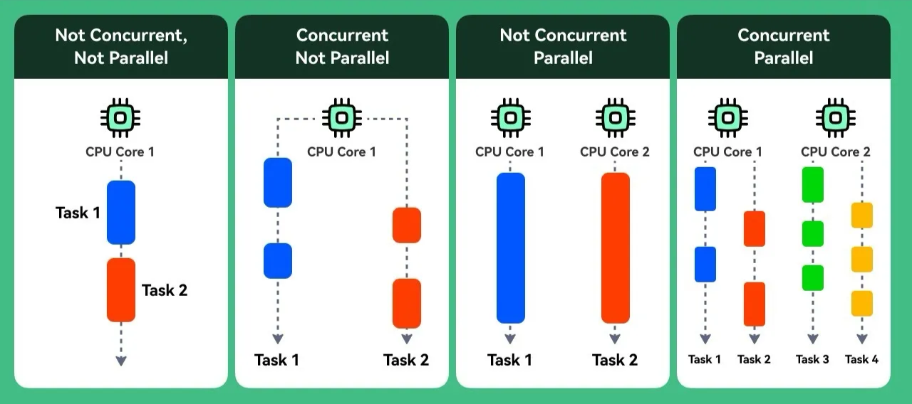 <a href="https://medium.com/hesaptech/from-threads-to-coroutines-modern-concurrency-and-parallelism-explained-ac5484377722" target="_blank" style="position: absolute; bottom: -8px; left: 4px; font-size: 11px;">[src]</a> 
 
E.g. single-core time-slicing is the 2nd case, and two independent programs on separate cores the 3rd.
 

<!-- - 
 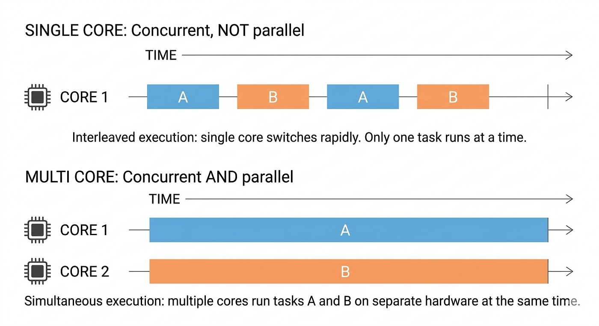 <a href="https://medium.com/womenintechnology/concurrency-parallelism-processes-threads-thread-safe-systems-1d4e7d351824" target="_blank" style="position: absolute; bottom: 2px; right: 4px; font-size: 11px;">[src]</a> 
 -->

The natural fix is a fixed-size [thread pool]() of $N$ worker threads fed from the accept queue. However, it bounds<!-- trim: It caps memory and scheduling overhead in one stroke. --> resource consumption, not concurrent capacity, because a worker blocked in *read()* consumes no CPU yet still occupies one of the $N$ slots. This pool serves at most $N$ connections and further arrivals queue until a slot frees, thus it has traded a memory blow-up for clients left waiting. That is, what it runs out of is threads, not CPU, as a waiting connection still holds one.<!-- trim: the scarce resource is the thread, not the CPU, as each connection pins one for the entire wait --> While the concurrency bound $N \gtrsim 10^4$ and the system-resource bound $N \ll 10^4$ leave no viable thread count $N$, the fault lies not in the most appropriate $N$ but in the [I/O model]() illustrated below. <!-- which appears to cost nothing, --><!-- an I/O model is the contract by which a program issues a request and learns of its completion -->


                        KERNEL                          │      APPLICATION
                                                        │      (thread pool, N=3)
  incoming                                              │      
  connections                                           │
  ──────────►   ┌──────────────────────────┐            │
                │   ACCEPT QUEUE (backlog) │            │
   C1 ────────► │                          │            │
   C2 ────────► │  the kernel finishes the │  accept()  │   ┌───────────┐
   C3 ────────► │  TCP handshake and parks │ ────────►  │   │ Thread 1  │─blocked on read(C1)
   C4 ────────► │  connections HERE until  │            │   ├───────────┤
   C5 ────────► │  a worker picks them up  │            │   │ Thread 2  │─blocked on read(C2)
   ...          │                          │            │   ├───────────┤
                │ \[C4\]\[C5\]\[C6\]\[C7\] │            │   │ Thread 3  │─blocked on read(C3)
                │   ▲                      │            │   └───────────┘
                │   │ waiting, established,│            │    all 3 slots taken
                │   │ but UNSERVICED       │            │
                └───┼──────────────────────┘            │
                    │                                   │
        queue fills │                                   │
                    ▼                                   │
   C99 ──────►  ✗ accept queue full → kernel drops the  │
                  client's ACK; the server retransmits  │
                  SYN-ACK, client eventually times out  │

Accepting a connection and serving it are different steps, done by different actors:

1. The kernel accepts connections on its own. C1-C99 all complete their TCP handshake without any worker thread, landing in the accept queue (the listen backlog). The kernel does not need your threads to establish a connection.
2. A worker thread must then call accept() to pull one off that queue and read() it. Here 3 threads each grabbed one connection (C1, C2, C3) and are now blocked in read(), waiting for that client to send data. That is the step that stalls when all N threads are busy.
3. While all 3 are blocked, C4, C5, C6... just sit in the queue, established but unserviced, because nobody is calling accept() for them. That is "queue behind them": they exist, they just wait.
4. The queue is finite. Once it fills, the kernel drops the client's ACK for further connections (C99) and never creates the socket; the server keeps retransmitting the SYN-ACK while the client re-ACKs, until a slot frees or the client eventually times out.

Two consequences make the point sharper:
- Latency balloons: a new connection waits for one of the N threads to free up before it gets any processing, even though the CPU is nearly idle.
- Past a point new connections do not merely wait, they fail.

This is why N-thread pooling does not solve C10K: serving 10,000 clients at once would need N ~ 10,000 blocked threads, the memory/scheduler wall from p2. The fix is to stop pinning a thread per connection so one thread can service many.


An I/O call could make two binary choices from the $2 \times 2$ matrix $R$, i) {[synchronous](), [asynchronous]()}: whether the call returns only once the I/O is complete or lets completion be signalled later; ii) {[blocking](), [non-blocking]()}: whether the call suspends the thread until then or returns at once. Apparently, the thread-per-connection model sits at $R_{00}$, whereas the event loop that displaced it sits at $R_{10}$ and lets one thread multiplex many connections by parking on a single wait. The non-blocking column saw less use, as $R_{01}$ wastes CPU by polling for readiness repeatedly with each attempt returning $\text{EAGAIN}$, and $R_{11}$ lacked a general completion interface on Linux until *io_uring*.<!-- making waiting and working no longer compete for the same thread.-->


Blocking vs synchronous — pizza shop. Two axes:
  blocking     = do you stand still at the counter (thread parked)?
  synchronous  = is the pizza in hand when the interaction ends, or found out later (board/buzzer)?

  R00  sync  + blocking      order and STAND at the counter until handed the pizza.
                             wait (blocking), leave with it in hand (synchronous).       -> read()
  R01  sync  + non-blocking  order, then ASK "ready?" every 10s; instant "no / no / here".
                             never park, but keep pestering and collect it yourself.     -> read() + O_NONBLOCK (busy-poll)
  R10  async + blocking      order, then STARE at the "order ready" board, doing nothing
                             else until your number lights. stuck watching (blocking),
                             but the result is announced later (async); one board serves
                             every customer's order at once.                             -> select / epoll
  R11  async + non-blocking  order, take a BUZZER, go sit down / do other things; it buzzes
                             when ready. never waited, never asked — completion arrives.  -> AIO / io_uring

R01 (pestering) is non-blocking yet synchronous; R10 (watching the board) is blocking yet
asynchronous — which is why the two are separate axes. R00 (plain read) is both, where they get conflated.


- 
 
 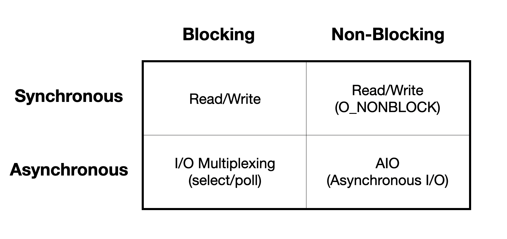 <a href="https://developer.ibm.com/articles/l-async/" target="_blank" style="position: absolute; top: 4px; right: 4px; font-size: 11px;">[src]</a> 
 
Stevens (<i>UNIX Network Programming</i>) instead reserves asynchronous for AIO alone, classing multiplexing as synchronous.
 

<!-- - <iframe width="500" height="285" src="https://www.youtube.com/embed/IMceN4_rieo?si=g-BBn2kbVFYctrXF" title="YouTube video player" frameborder="0" allow="accelerometer; autoplay; clipboard-write; encrypted-media; gyroscope; picture-in-picture; web-share" referrerpolicy="strict-origin-when-cross-origin" allowfullscreen></iframe> -->

<!-- - 
  <a href="https://notes.shichao.io/apue/ch15/" target="_blank" style="position: absolute;  bottom: -8px; right: 4px; font-size: 11px;">[src]</a> 
 -->

### **1.2. Event Loops**

 

Serving many connections from one thread demanded change on both sides. The application restructured around an event loop, while the OS evolved new syscalls to wait on many descriptors at once. Such a program is governed by [event-driven programming]() (§602#1.1), a paradigm that organises control flow around reactions to events rather than a fixed instruction sequence. The pattern long predates the C10K problem and appears in the GUI [message loop]() dispatching clicks and keystrokes (§603#1.1).<!-- also in discrete-event simulators advancing by popping the next event off a queue, showing the pattern is domain-general, not I/O-specific --> Networking is another instance with the same inversion of control in which the runtime, not the program, invokes the handlers whenever a descriptor becomes ready.


Inversion of control and cooperative scheduling are distinct axes that pair up here.
- Inversion of control = who calls whom: your code calls read() vs the loop calls your handler.
- Cooperative vs preemptive = who decides when to switch: the task yields voluntarily (await) vs the scheduler preempts via the timer interrupt.

The event loop is both: the loop calls your handlers (inverted) AND each handler runs to completion until it yields at an await (cooperative). Thread-per-connection is the opposite corner on both: your code drives the blocking read() (not inverted) and the kernel preempts it (preemptive). 1.3 p2 pays this off from the cooperative-scheduling angle (§603#3.1).


<!-- - 
 
 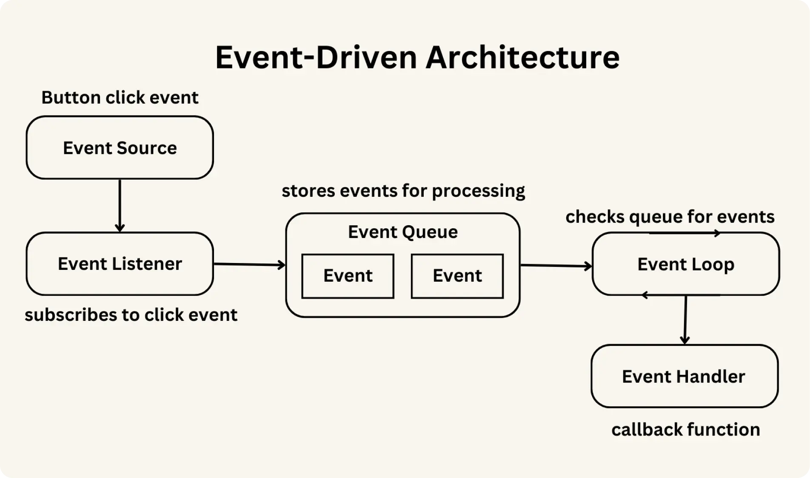 <a href="https://devworks.jp/blog/371" target="_blank" style="position: absolute; bottom: -8px; left: 4px; font-size: 11px;">[src]</a> 
 
An event travels from source through listener and queue to the loop, which dispatches its handler.
 
 -->

The [event loop]() drives the invocation on a single application thread as a dispatcher rather than a program, running each ready handler to completion before returning to the wait, and thus fans one thread out across many connections. Mechanically, it blocks on the kernel's multiplexing interface via a syscall (e.g. *epoll_wait()*) until watched descriptors become ready, then dispatches each to its registered handler (i.e. [callback]()). The same call also returns when the timeout set to the nearest timer elapses, so the loop runs due time-based callbacks even when no descriptor fires, a deadline asyncio finds in $O(1)$ by keeping its timers in a [min-heap]() (the *heapq* module).<!-- trim: instead of dedicating itself to one; BSD's kevent(); keyed on deadline --><!-- libraries implement this dispatcher atop the readiness syscalls, e.g. libuv in Node.js, asyncio in Python (see 1.3). -->


The event loop is NOT a new kind of thread. It is the same ordinary OS thread running
different CODE. What changed is the shape of the code, not the thread. In C you write
both shapes by hand and they look different:

  // thread-per-connection: linear, blocks on read(). one thread per conn.
  void handle(int conn) {
      char buf[1024];
      read(conn, buf, 1024);   // blocks here until data arrives
      process(buf);
      write(conn, ...);
  }

  // event loop: YOU write the while(1) + epoll_wait dispatcher.
  while (1) {
      int n = epoll_wait(epfd, events, MAX, -1);   // blocks here, on ALL fds
      for (int i = 0; i < n; i++)
          handle(events[i].fd);                    // dispatch to per-fd handlers
  }

In Python asyncio HIDES that while-loop. You never type it:

  async def handle(conn):
      data = await conn.read(1024)   # reads linear, but SUSPENDS here
      ...
  asyncio.run(handle(conn))          # the while-True + epoll_wait lives in here

The await version looks like the linear C read() version, but underneath asyncio runs
the exact same while-True: epoll_wait -> dispatch loop. Coroutines (1.3) let you write event-driven code in straight-line style while the loop runs hidden below. So: C = build the loop by hand, two designs look different; Python = loop hidden, async def disguises the event-driven version as linear code.


The loop however changed only what the application waits on, not how the I/O itself is performed. That is, the kernel still performs this through device drivers, DMA, and interrupts (§603#3.3), signalling the event loop the moment a descriptor is ready for its read. One main thread then suffices because I/O-bound work spends almost no CPU per connection. It stands in for the thousands that thread-per-connection needed and collapses their blocking waits into a single one.<!-- between events the loop holds nothing but a table of parked handlers --> Its one limit is concurrency without parallelism, since a single loop occupies one core and every additional core takes another loop.

- 
 
 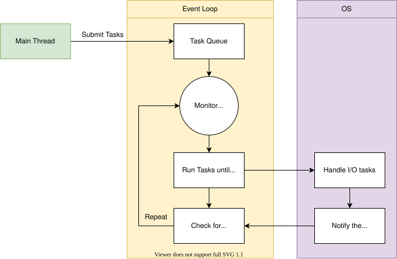 <a href="https://www.pythontutorial.net/python-concurrency/python-event-loop/" target="_blank" style="position: absolute; bottom: -8px; left: 4px; font-size: 11px;">[src]</a> 
 
A task is one unit of work the loop drives, run until it would block on I/O, handed to the OS, then resumed once the OS signals completion.
 

Beyond performing the I/O, the kernel must also watch it through [I/O multiplexing](), which lets many file descriptors (fds) share a single thread by tracking their readiness on the application's behalf. Its implementations (the syscall API) evolved from *select()* (4.2BSD, 1983, fixed fd limit, copies the entire fd set to the kernel on every call) $\to$ *poll()* (System V, 1986, dynamic, but still $O(n)$ scanning) $\to$ *epoll()* (Linux 2.5.44, 2002, registers fds once via *epoll_ctl* and returns only ready fds, its cost scaling with ready events rather than watched descriptors) and *kqueue()* (FreeBSD, 2000). <!-- io_uring (Linux 5.1, 2019) is completion-based, not readiness multiplexing; see p6. --> In particular, *epoll()* supports two notification modes.


General multiplexing:     many consumers → one resource
  TDM:                    many users     → one CPU
  FDM:                    many signals   → one cable
  Statistical:            many packets   → one link
I/O multiplexing:         many fds       → one thread
 

[Level-triggered]() (default) reports an fd as ready whenever data is available in its buffer, so the application can read partially and be reminded on the next *epoll_wait()* call. [Edge-triggered]() (*EPOLLET*) reports an fd only when its state changes (e.g. new data arrives), so the application must drain the entire buffer in a loop until *EAGAIN* or risk missing data. The former is the default in Python's *selectors* module and most event loop libraries (e.g. Node.js's *libuv*) for its forgiving semantics, whereas the latter generates fewer notifications under high throughput and drives Nginx's network I/O and Go's *netpoller*<!-- Nginx is also widely used as a load balancer and TLS terminator due to its event-driven architecture -->.

The trigger modes govern network descriptors, yet the loop's coverage is not total. The readiness model assumes a descriptor can be *not ready*, which holds for sockets but not for regular files, deemed always ready even when fetching stalls on disk. Hence a file read reports ready yet blocks, and Nginx offloads such disk I/O (e.g. large video files) to a thread pool to keep the loop responsive. Only [*io_uring*](https://kernel.dk/io_uring.pdf) (Linux 5.1, 2019) closes the gap, its completion-based interface reporting the finished read rather than a readiness files cannot express. The kernel's side is complete, leaving the application's, its logic scattered across callbacks, as the remaining cost. <!-- per-event handlers scatter one connection's logic across disconnected callbacks -->

- 
 
 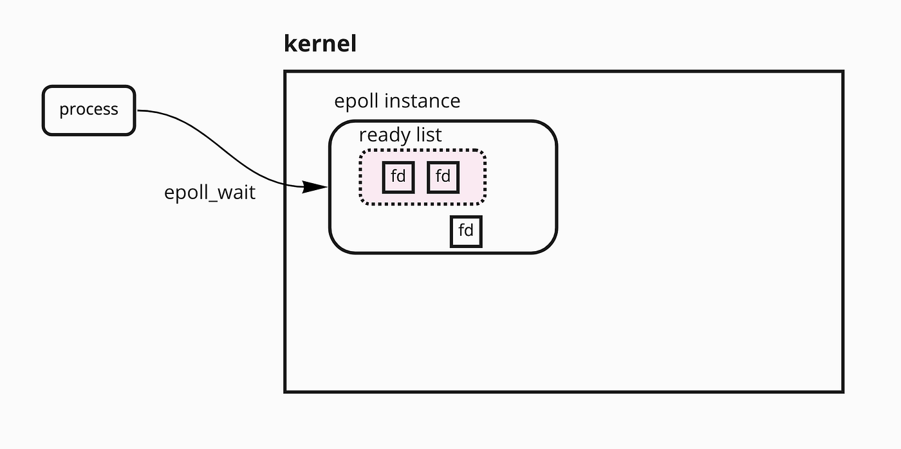 <a href="https://medium.com/@avocadi/what-is-epoll-9bbc74272f7c" target="_blank" style="position: absolute; bottom: -8px; left: 4px; font-size: 11px;">[src]</a> 
 
epoll_wait returns the ready list the kernel maintains, sparing the process a scan of every fd.
 

### **1.3. Coroutines**

 


The whole stack in one picture, read top-down. Everything above the ═══ line is your
process (user space, ONE thread); everything below is the kernel. `await` = "I'd block
here, so suspend me and let the loop ask the kernel to watch this fd." The thread never
blocks on a single connection — it blocks once, in epoll_wait, on behalf of all of them.

  ─────────────────  USER SPACE  (your process, ONE thread)  ─────────────────

  ┌─────────────────────────────────────────────────────────────┐
  │  YOUR CODE  (coroutines = async def functions)              │
  │   async def handle(conn):                                   │
  │       data = await conn.read(1024)   ← suspends here        │
  └───────────────┬─────────────────────────────────────────────┘
                  │ wrapped in
                  ▼
  ┌─────────────────────────────────────────────────────────────┐
  │  asyncio  (runtime / library)                               │
  │   Tasks:  (T1)(T2)(T3) ...   ← each Task = one coroutine    │
  │   ┌───────────────────────────────────────────────────┐     │
  │   │  THE EVENT LOOP  (while-True on the main thread   │     │
  │   │  — this IS the single thread)                     │     │
  │   │  1. pop a ready Task, run it until it awaits      │     │
  │   │  2. on await read(): register fd, park the Task   │     │
  │   │  3. no Task can run → BLOCK in the kernel         │     │
  │   │  4. kernel returns ready fds → wake their Tasks   │     │
  │   │  5. goto 1   ("Repeat")                           │     │
  │   └───────────────────────┬───────────────────────────┘     │
  │   ┌───────────────────────▼───────────────────────────┐     │
  │   │  selectors  (portability shim)                    │     │
  │   │   Linux → epoll   BSD/mac → kqueue   Win → IOCP   │     │
  │   └───────────────────────┬───────────────────────────┘     │
  └───────────────────────────┼─────────────────────────────────┘
                              │ epoll_wait()  (down, the ONE blocking call)
                              │ ready fds     (up, back to the loop)
  ════════════════════════════╪══════  KERNEL  ══════════════════
                              ▼
  ┌─────────────────────────────────────────────────────────────┐
  │  epoll instance  (kernel data structure, per process)       │
  │   registered fds:  fd3 fd7 fd9 fd12 ...   (interest)        │
  │   ready list:     (fd7)(fd12)   ← subset that fired         │
  │        └── epoll_wait returns ONLY these ──► back to loop   │
  └──────────────────────────▲──────────────────────────────────┘
                             │ readiness comes from below
  ┌──────────────────────────┴──────────────────────────────────┐
  │  sockets / TCP stack   (each fd has a recv buffer)          │
  └──────────────────────────▲──────────────────────────────────┘
                             │
  ┌──────────────────────────┴──────────────────────────────────┐
  │  NIC → DMA → interrupt   (hardware does the actual I/O)     │
  │  packet arrives → DMA into kernel memory → fd marked ready  │
  └─────────────────────────────────────────────────────────────┘

Trace of one request:
1. await read() — socket buffer empty, nothing to return.
2. coroutine SUSPENDS; asyncio registers the fd with epoll and parks the Task.
3. loop runs other Tasks; when none can progress, it calls epoll_wait() and the
   thread sleeps in the kernel (no CPU used).
4. packet arrives — NIC → DMA → interrupt fills fd7's socket buffer, fd7 → ready list.
5. epoll_wait returns just the ready fds (fd7) — not all registered ones (epoll's O(1)).
6. loop maps fd7 → parked Task, RESUMES it; read() copies bytes kernel→data; coroutine
   continues from the exact line it left off.
7. Repeat.

  ┌────────────┬──────────────────────────────────────────────┬───────────────────────┐
  │ term       │ what it is                                   │ where in the picture  │
  ├────────────┼──────────────────────────────────────────────┼───────────────────────┤
  │ coroutine  │ your async def, pausable at each await       │ top box               │
  │ Task       │ a coroutine the loop is actively driving     │ asyncio box           │
  │ event loop │ while-True on the single thread that runs    │ asyncio box           │
  │            │ Tasks and calls epoll_wait                   │                       │
  │ epoll      │ kernel structure + syscall that tracks which │ below the line        │
  │            │ fds are ready                                │                       │
  │ read()     │ the actual byte copy, kernel buffer → your   │ step 6                │
  │            │ variable, that runs AFTER readiness          │                       │
  └────────────┴──────────────────────────────────────────────┴───────────────────────┘


Coroutines do not replace the event loop but change its unit of work from a raw callback to a coroutine. A [coroutine](https://dl.acm.org/doi/10.1145/366663.366704) (Conway, 1963) generalises the ordinary [subroutine](), which runs from a single entry to completion, into a function that suspends at explicit points (*yield*, *await*) with its local state preserved and resumes exactly where it left off. Raw callbacks are error-prone and deeply nested (i.e. [callback hell]()), scattering one connection's logic across handlers and hand-threaded state, whereas a coroutine keeps that state in its local variables and its logic reads top to bottom as in the blocking style.

The event loop schedules cooperatively, its coroutines yielding control explicitly rather than being preempted. This revives the model the OS abandoned for the timer interrupt (§603#3.1), safe again since one loop's tasks belong to one program rather than strangers the kernel must referee. Each *await* on I/O suspends the coroutine and hands its fd to the loop, whose single thread blocks in the *epoll_wait()* a C programmer would write by hand, making *async* / *await* portable across readiness mechanisms. The bargain still binds, since a coroutine that computes or calls a blocking function without reaching an *await* stalls every other task, so CPU-bound work belongs in the mechanisms that follow.


Preemptive vs cooperative is a property of the scheduler, not a single object.

  Mechanism                  Scheduling
  ─────────────────────────  ────────────────────────────────────────────────
  OS threads                 Preemptive (OS can interrupt execution)
  Coroutines (async/await)   Cooperative (must explicitly yield with await)
  Event loop                 Cooperative dispatcher (never preempts a running task)

The loop and its coroutines are two halves of one cooperative regime: the coroutine
is the unit that yields (await), the loop is the dispatcher that depends on those yields.
Neither preempts — there is no timer interrupt inside the loop. Preemption is the OS
thread scheduler's job. So `while True: pass` in one coroutine hangs the whole loop.


Switching between coroutines is cheap, nanoseconds against the microseconds an OS thread context switch costs, since it saves only a suspended frame in user space, avoiding the kernel-mode transition a thread switch requires. This keeps a coroutine's cost in the language runtime rather than the scheduler, which is why one thread can hold far more of them than the machine could hold threads. The *async* / *await* syntax is language-general, arriving in C# (5.0, 2012)<!-- pioneered as F#'s async workflows (2007) --> before Python and the rest (JavaScript, Kotlin, Rust), yet Python is the instructive case because its runtime hides the event loop most completely. <!-- [Stackful coroutines]() maintain their own stack (like threads but lighter), while [stackless coroutines]() use heap-allocated activation records. -->


Coroutines are a general concept, not Python-specific.
Term coined by Melvin Conway (1963), originally implemented in assembly.

  Simula (1967): coroutine-like constructs
  Lua (1993): stackful coroutines
  C# 5.0 (2012): async/await
  Python 3.5 (2015): async/await
  JavaScript ES2017 (2017): async/await
  Kotlin (2018): coroutines
  Rust (2019): async/await
  C++20 (2020): coroutines

The level of abstraction differs by language. In C, the event loop is your code:
you call epoll_wait directly, write the while loop, and dispatch handlers yourself.
In Python, the event loop is buried under layers of abstraction (asyncio, FastAPI),
and it's easy to forget there's a loop calling a kernel syscall underneath.

C programmer sees:                Python programmer sees:
                                  
while (1) {                       async def handle(request):
    n = epoll_wait(epfd, ...);        data = await db.fetch()
    for (i = 0; i < n; i++)           return Response(data)
        handle(events[i].fd);
}

Both are event loops. The Python one is just hidden.

Full responsibility stack:
  Kernel devs:      implement epoll
  Runtime devs:     implement coroutine machinery (CPython, V8)
  Library devs:     implement asyncio, libuv (wrap both above)
  Framework devs:   implement FastAPI, Express (wrap libraries)
  You:              write async def and await


- 
 
 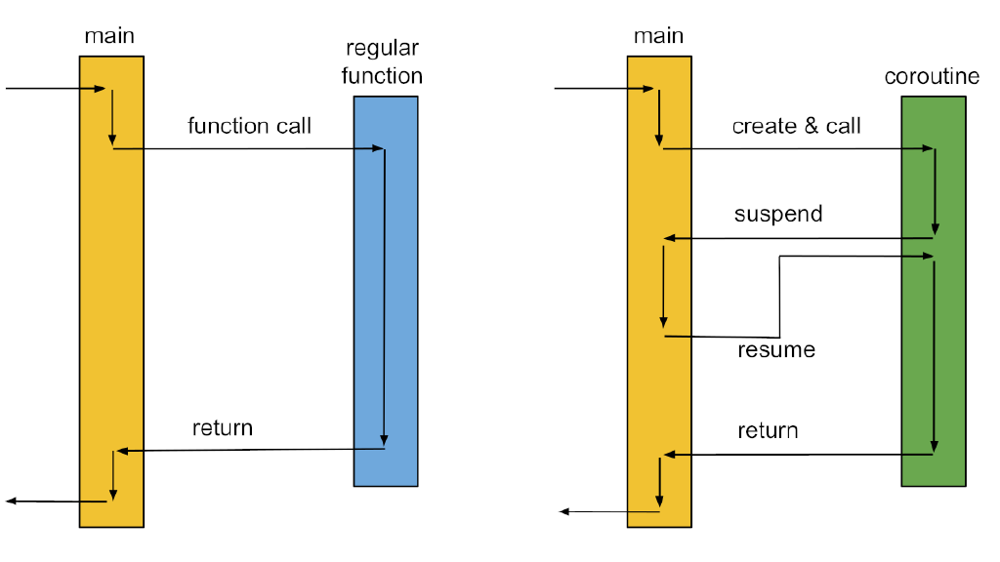 <a href="https://blog.eiler.eu/posts/20210512/" target="_blank" style="position: absolute; bottom: -8px; right: 4px; font-size: 11px;">[src]</a> 
 
A regular call runs to its single return, while a coroutine suspends and resumes before returning.
 

Python's initial coroutine implementation repurposed [generators]() (*yield*, Python 2.2), which already suspend and resume on demand, and two amendments generalised it by letting a generator: i) receive values (*send*, [PEP 342](https://peps.python.org/pep-0342/)); and ii) delegate to sub-generators (*yield from*, [PEP 380](https://peps.python.org/pep-0380/)). The [*asyncio*](https://docs.python.org/3/library/asyncio.html) module (3.4, 2014) later implemented the event loop on this machinery, a *while* loop that repeatedly runs coroutines and waits for I/O readiness through the [*selectors*]() module, a thin wrapper over the kernel's multiplexing syscalls. Python 3.5 (2015, [PEP 492](https://peps.python.org/pep-0492/)) added native *async* / *await* keywords, so coroutines became a first-class construct rather than disguised generators, an *async def* function being a coroutine and each *await* its yield point.

Yet the syntax alone creates no concurrency since awaiting a coroutine merely runs it inline. Concurrency arises when the loop drives many coroutines at once, each wrapped in a [Task](), its scheduled form, which the loop places on the [ready queue]() and advances as the awaited fd signals. For example, *asyncio.gather* launches many Tasks together, thus one thread interleaves thousands of outstanding requests, each parked at its own *await*. *asyncio.TaskGroup* (3.11, 2022) was later introduced to provide [structured concurrency](), which scopes sibling Tasks so that one failure cancels the rest, while *gather* leaves them a loose bundle that fails independently.


import asyncio    # event loop + coroutine scheduler
import aiohttp    # async HTTP client built on asyncio (2014)
import httpx      # sync/async HTTP client (2019) — modern alternative to aiohttp

\# Python 3.4 — generator-based coroutine
@asyncio.coroutine
def fetch(url):
    response = yield from aiohttp.request('GET', url)
    body = yield from response.read()
    return body

\# Python 3.5 — native coroutine
async def fetch(url):
    response = await aiohttp.request('GET', url)
    body = await response.read()
    return body

"awaiting a coroutine merely runs it inline": from the caller's viewpoint,
await some_coro() behaves like an ordinary function call — the caller stops at
that line, the coroutine runs to completion, the result comes back, then the
next line executes ("inline" = within the caller's own execution path, as if
the body were pasted at the await site).

a = await fetch(url1)   # runs to completion first
b = await fetch(url2)   # only starts after a is done

→ strictly sequential, total time = sum, same as blocking calls. The two never
overlap because neither was made a Task, so the loop has one runnable chain and
just follows it. The suspension machinery still works — while fetch waits on
its socket the loop COULD run other Tasks — but if none were created there is
nothing to interleave. 

Concurrency needs siblings:

a, b = await asyncio.gather(fetch(url1), fetch(url2)) 
\# both in flight, time ≈ max


### **1.4. Web Servers**

 

The entire arc (i.e. thread-per-connection $\to$ event loops $\to$ coroutines) resurfaces in Python web frameworks. The [web server gateway interface]() (WSGI, 2003) decoupled its application from the server, once bound together via CGI or mod_python, so that any app can run on any conforming server. The [asynchronous server gateway interface]() (ASGI, 2016) generalised the contract to the asynchronous model. That is, the former exposes a single synchronous callable *app(environ, start_response)* that the server invokes once per request, but the latter exposes an *async def app(scope, receive, send)* whose *receive* and *send* channels stream events across the asyncio loop.

In particular, ASGI is realised as a stack of layers, each wrapping the one beneath. [*FastAPI*]() (2018) routes and validates the request into its *async def* handler.<!-- trim: the loop ultimately drives --> [*Uvicorn*]() (2017), the ASGI server below it, turns each HTTP request into that coroutine call (e.g. *httptools* is used to parse the raw bytes) and runs the loop. [*asyncio*]() (2014) is the event-loop library underneath that drives the socket I/O via the OS (§603#2.3). Since ASGI is only a contract between server and app, either side is definitely interchangeable (e.g. Uvicorn $\leftrightarrow$ Hypercorn, FastAPI $\leftrightarrow$ Starlette), and the substitution can be extended to the loop itself, which asyncio can hand to [*uvloop*](), built on the same libuv as Node.js.

The concurrency of an ASGI worker rests on a single condition. All requests share the loop's one thread, so any request that blocks stalls every other, while a slow request only costs a single worker under WSGI. One such offender is a *def* endpoint, that has no *await* to yield at and would hold the thread for its whole body, so FastAPI keeps a thread pool to run it off the loop. Likewise, any blocking call inside a coroutine (e.g. *time.sleep*, a sync DB driver) holds a thread, thus an async server demands async libraries throughout.<!-- trim: instead of asyncio.sleep --> CPU-bound work, by contrast, stalls the loop equally but merits a process pool instead, since only this can reach the host's remaining cores under the GIL.<!-- trim: since only processes convert the host's remaining cores into parallelism --><!-- computation that never waits gains nothing from an event loop -->

- 
 
 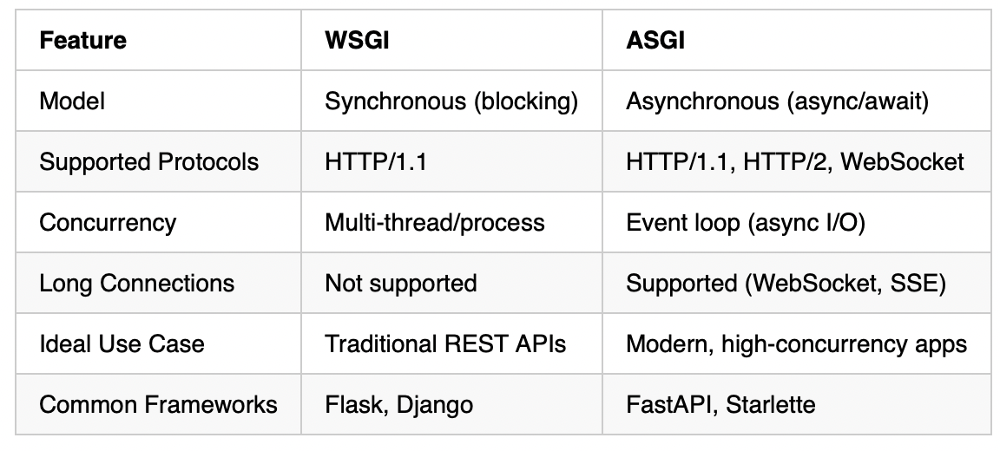 <a href="https://medium.com/@dynamicy/asgi-vs-wsgi-a-complete-guide-to-their-differences-and-fastapi-applications-9857f13c4521" target="_blank" style="position: absolute; top: 6px; right: 6px; font-size: 10.5px;">[src]</a> 
 
E.g. ASGI admits long-lived connections (WebSocket, SSE) that WSGI's one-request-one-response contract cannot express.
 

Yet the loop itself runs on one core regardless of how many the host offers, so one runs several loops under [*Gunicorn*]() (2010), a pre-fork master that calls *fork()* once per core and supervises the spawned Uvicorn workers.<!-- trim: descended from Ruby's Unicorn; before any request arrives --> The master never touches a request, as the workers inherit the listening socket, and the kernel hands each connection to one of them to serve end-to-end.<!-- trim: so no worker binds a port of its own; layers core-level parallelism over its loop's concurrency --> In containerised deployments, an orchestrator (e.g. Kubernetes) replaces the master and replicates single-worker containers to the same effect (§607#3.1).<!-- trim: for the same parallelism and resilience --> By contrast, [Nginx]() (2004) is a reverse proxy in front of either that sits on the data path to terminate TLS and buffer slow clients until the requests complete.<!-- trim: relaying every byte so that it can --><!-- trim: written in C; so the workers see only complete and fast requests -->


The ASGI stack layers, each wrapping the one below, so the programmer only writes
async/await handlers:

  asyncio     the event loop — drives coroutines, calls selectors
  Uvicorn     ASGI server — runs the asyncio loop, speaks HTTP,          <- runs asyncio
              turns each request into a coroutine
  FastAPI     ASGI app framework — routing, validation, your handlers    <- runs on Uvicorn
  your code   async def endpoints

Not alternatives at one layer: asyncio IS the loop; Uvicorn is the SERVER that runs it; FastAPI is the APP framework that runs on the server. The contract between server and app is ASGI — swap either side (Uvicorn<->Hypercorn, FastAPI<->Starlette). Uvicorn can also swap the loop itself for uvloop (libuv-based, faster) without the layers above noticing.

One line: Uvicorn runs asyncio; FastAPI runs on Uvicorn via ASGI. (libuv is Node.js's
equivalent of the asyncio+uvloop layer.)


- 
 
 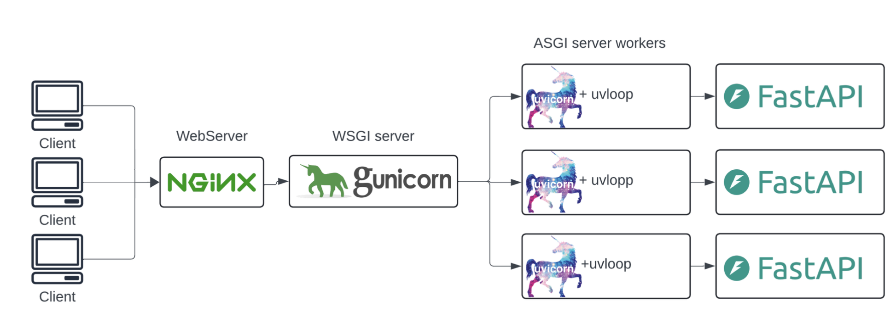 <a href="https://github.com/alisharify7/gunicorn-uvicorn-nginx" target="_blank" style="position: absolute; top: 4px; left: 4px; font-size: 11px;">[src]</a> 
 
Nginx relays every request, Gunicorn none, and each Uvicorn worker serves its own end-to-end.
 

## II
---

### **2.1. Multiprocessing**

 

<!-- Progression: safe approach (multiprocessing) → fast approach (multithreading) → the cost of the fast approach (shared state) → naturally leads to §III Synchronisation -->

[CPU-bound]() workloads (e.g. numerics) saturate a processor and gain only from true parallelism across cores. Two classical results bound the gain by the fraction of a program that runs serially. Namely, [Amdahl's Law](https://en.wikipedia.org/wiki/Amdahl%27s_law) (1967) holds the problem size fixed, so the serial part caps the speedup, and a program with serial fraction $f$ attains at most $1/(f + (1-f)/p) \to 1/f$ as the processor count $p \to \infty$ (e.g. $0.05 : 20$). [Gustafson's Law](https://en.wikipedia.org/wiki/Gustafson%27s_law) (1988) lets the problem grow with $p$ instead, the parallel part scaling with it while the serial part stays fixed, and yields the scaled speedup $f + (1-f)p$, linear in $p$. The former measures speed on a fixed problem, the latter work in a fixed time.

Two approaches deliver that parallelism, multiprocessing and multithreading, which differs in whether the work stays isolated or shares memory. [Multiprocessing]() runs it in separate processes each with its own address space (§603#3.1). The absence of shared memory rules out data races by construction and confines a crash to one process (e.g. one Chrome tab failing alone). The cost is then paid in memory, each process carrying its own page table, fd table, and kernel bookkeeping, and in explicit IPC to communicate. Fork-based multiprocessing still underlies traditional web servers (Apache prefork), DB engines (PostgreSQL, §606#3.3), and ASGI deployments (Gunicorn's workers).

The GIL-ed Python achieves parallelism through separate processes. The *multiprocessing* module (2.6, 2008) and *ProcessPoolExecutor* (3.2, 2011) supply them, one full interpreter per worker, that buys a core apiece but leaves $N$ workers holding $N$ copies of what threads would share.<!-- trim: each worker is a full interpreter importing its own modules and, under spawn, reloading any model the parent held --> Two kinds of work decomposition apply to such a pool, i) [data parallelism](): mapping one operation across partitioned data (e.g. *Pool.map*), the [embarrassingly parallel]() case in which workers never communicate; and ii) [task parallelism](): routing distinct pipeline stages (e.g. fetch $\to$ transform $\to$ write) to distinct processes, both of which §608#3.2 scales from cores to machines.<!-- trim: Each worker returns its result via serialisation (pickle, §605#4.1). -->

The two costs of a process pool, creating a worker and moving data through it, each hide a trap. A worker starts by *fork*, duplicating the parent via copy-on-write (§603#3.1), or by *spawn*, a fresh interpreter that re-imports every module and reloads any model the parent held. Fork is cheaper yet unsafe once the parent has threads, since a lock held by another thread at the fork is copied held and never released, hence spawn by default on macOS (3.8) and *forkserver* on Linux (3.14). Arguments and results then travel by pickling (§605#4.1), so for large arrays the copy can outweigh the compute, which *shared_memory* (3.8) avoids by mapping one buffer into every worker.<!-- trim: one of three [start methods](), i) fork; ii) spawn; iii) forkserver: forking from a clean helper. 3.12 warns when threads exist. -->

- 
 
 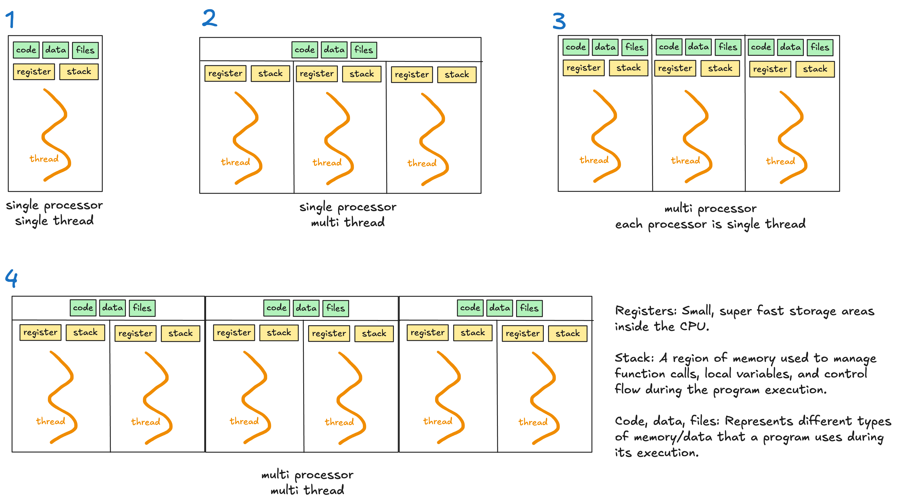 <a href="https://towardsdatascience.com/deep-dive-into-multithreading-multiprocessing-and-asyncio-94fdbe0c91f0/" target="_blank" style="position: absolute; top: 1px; right: 1px; font-size: 11px;">[src]</a> 
 
Threads share their process's code, data, and files while each owns a register set and stack, across one or many processors.
 

### **2.2. Multithreading**

 

Multiprocessing suits work that is partitioned once and rarely talks, whereas workers that share state continuously, a cache, a model, a queue, call for [multithreading](). It trades isolation for a shared address space, and is lighter and so faster, as communication reduces to ordinary memory access rather than IPC, but pays for it in synchronisation.<!-- trim: every thread reading and writing the same heap while keeping only its own register set and stack; partitioning the process's state such that every thread reads and writes the same regions (e.g. heap, text, data segments) and inherits the same kernel resources (e.g. fd table, signal dispositions), while private to each remain only its register set (PC included) and stack --> The sharing also shrinks the [memory footprint](), as $m$ threads carry one heap, text segment, and page table where $m$ processes each keep their own.<!-- trim: so a host holds more concurrent workers before memory runs out --> Fork's copy-on-write narrows the gap only until writes diverge the copies.<!-- trim: and in CPython even reads do, since touching an object mutates its reference count (§602#1.3) --> A thread switch also skips the page-table swap and TLB flush a process switch pays (§603#3.1).<!-- trim: The small private remainder also prices the switch. One between threads of a process leaves invariant the page table and TLB that one between processes must swap and flush -->

<!--
Analogy (people = cores, calculators = memory):
Multiprocessing:  2 people, 2 calculators. True parallelism, full isolation.
                  To share a result, write it on a note and pass it (IPC).
Multithreading:   2 people, 1 calculator (shared memory). True parallelism,
                  but must coordinate who presses buttons when (synchronisation).
GIL:              2 people, 1 calculator, but only one is allowed to touch it
                  at a time. The other just waits. You have the cores but can't use them.
-->

Given that a thread reduces to the triple $($register set, stack, scheduler$)$, it must pay for creation, storage, and context switch.<!-- the private pair (register set, stack) extended by a scheduler --> How much each costs depends on who supplies it. The user-space runtime supplies $m$ [user threads](), each created by an allocation and switched by a function call, unseen by the kernel. The kernel supplies $n$ [kernel threads](), each created by a system call and backed by a kernel stack. A threading model fixes the ratio $m \colon n$, that is, how many of a program's threads the kernel will know about. While every mainstream OS now buys one per thread, only a kernel thread can be dispatched onto a core, and hence each one bought is a core the program can use.<!-- trim: The latter cost orders of magnitude more --><!-- trim: a strategy for how much of the bill to pay at kernel prices by trading parallelism against abundance --><!-- parallelism, which only kernel threads reach; abundance, which only user-space cheapness affords -->


The 1:1 model is a statement about the middle: NPTL answers every pthread_create() with exactly one clone(), so every thread the program sees is one task_struct the scheduler sees. Nothing above NPTL knows or cares, which is why C, Java, and CPython threads all come out 1:1 on Linux. POSIX is a rule (API contract), NPTL is code (implementation), Linux is what the code calls into. Windows is a separate stack (CreateThread) with its own 1:1 kernel mapping.

Layer by layer, what one thread creation passes through on Linux:
  Python program           threading.Thread(target=f).start()
        |
        v
  CPython (C program)      Modules/_threadmodule.c -> PyThread_start_new_thread()
        |
        v
  POSIX Threads API        pthread_create()            <- the standard (POSIX.1c, 1995)
        |                                                 an interface, not code
        v
  glibc / NPTL             libpthread's implementation  <- the library that realises it
        |                  allocates the stack, then    on Linux (2003; LinuxThreads before)
        v
  syscall boundary         clone(CLONE_VM | CLONE_FILES | CLONE_SIGHAND | CLONE_THREAD ...)
        |
        v
  Linux kernel             task_struct created, put on a run queue
        |
        v
  CPU scheduler            dispatches the task_struct onto a core


For instance, Linux adopts the [$1 \colon 1$ model]() by setting $n = m$. A C program in user-space requests a thread by *pthread_create()*, the API that [POSIX Threads]() (POSIX.1c, 1995) standardise while leaving the mapping to each implementation, and glibc's [native POSIX thread library]() (NPTL, 2003) answers each call with one *clone()*, one *task_struct* per thread.<!-- The model won Linux once kernel threads and futexes grew cheap, NPTL's simplicity beating IBM's m:n NGPT. --> The runtime then writes no scheduler of its own. The kernel parks a thread that blocks, preempts one that computes, and resumes each in turn, so no thread can hold up another. Every one of those acts, however, is a syscall, and every thread a kernel stack.<!-- ~16 KB; trim: roughly a thousand user threads' worth per kernel thread --> The cost thus scales as $O(m)$ while one caps $m$ at the C10K wall.<!-- thread-per-connection's wall -->


The same thread in C on the two stacks. Different header, function, handle type, and worker signature; a compiled binary never crosses, and the source crosses only through a wrapper (C11 <threads.h>, C++ std::thread) or a shim (winpthreads). CPython wrapped it once (Python/thread_pthread.h vs thread_nt.h), which is why threading.Thread is identical on both. Same 1:1 shape, different names at every layer:

pthread_create() -> NPTL -> clone() -> task_struct -> CFS/EEVDF

  // POSIX (macOS, Linux)
  \#include <pthread.h>
  pthread_t t;
  pthread_create(&t, NULL, worker, arg);
  pthread_join(t, NULL);

CreateThread()   -> ntdll NtCreateThread -> KTHREAD -> NT scheduler

  // Windows
  \#include <windows.h>
  HoweverANDLE t = CreateThread(NULL, 0, worker, arg, 0, NULL);
  WaitForSingleObject(t, INFINITE);

\# Python (reference.)
  t = threading.Thread(target=worker, args=(arg,))
  t.start(); t.join()

    This source is the same because Python runs on top of C: CPython is the C program
    that differs per platform (thread_pthread.h vs thread_nt.h), compiled once per OS,
    so the Python program above it never sees the split.



<!-- the two remaining models answer a different question, not how to use every core but how to hold more concurrent flows than the kernel could ever afford to carry --> The [$m \colon 1$ model]() ([green threads](), early Java) drops the kernel's share to zero. The runtime multiplexes every user thread onto one kernel thread, cheap enough to spawn one flow per task, so nothing runs in parallel and one blocking syscall stalls all $m$.<!-- trim: The runtime keeps every triple; onto the process's main thread; The kernel however sees one thread; (e.g. disk I/O) --> The [$m \colon n$ model]() (Go goroutines, Java virtual threads) instead splits the bill so cheapness and parallelism coexist.<!-- trim: Erlang processes --> The runtime keeps the $m$ triples while the kernel carries a small $n$ ($m \gg n$, one per core), and a [runtime scheduler]() migrates user threads across the $n$ on blocking. Coroutines are the $m \colon 1$ model in all but name, one kernel thread carrying every flow, so a blocking call stalls the loop and Gunicorn must supply the $n$. <!-- the kernel contributes nothing special here: the runtime merely requests n ordinary kernel threads and stacks its own scheduler on the kernel's -->

<!-- trim (parked p5): In practice, the $1 \colon 1$ default leaves threads too expensive to spawn per task, thus an application pre-creates a fixed number in a thread pool and reuses them across tasks, amortising the creation cost. [[ the OS only hands out kernel threads one clone() at a time; pooling is always the application layer or a library on its behalf ]] Specifically, in Python, *ThreadPoolExecutor* is the explicit pool the application constructs and sizes. Libraries also provision one implicitly, as in i) *asyncio.to_thread*'s default executor; ii) FastAPI's $\sim$40-thread pool shielding its loop from *def* endpoints; and iii) OpenBLAS's worker threads beneath NumPy's linear algebra[[ OpenBLAS is NumPy's default BLAS backend, MKL in some builds; also gRPC's server takes a ThreadPoolExecutor ]]. Either way the size settles at the core count when CPU-bound and diverges as blocking rises when I/O-bound, since a blocked thread holds no core. [[ in CPython the "CPU-bound pool" must be a process pool (GIL), unless the work releases the GIL (NumPy, hashing) ]] [[ FastAPI's def-endpoint pool is AnyIO's, via Starlette ]] -->

- 
 
 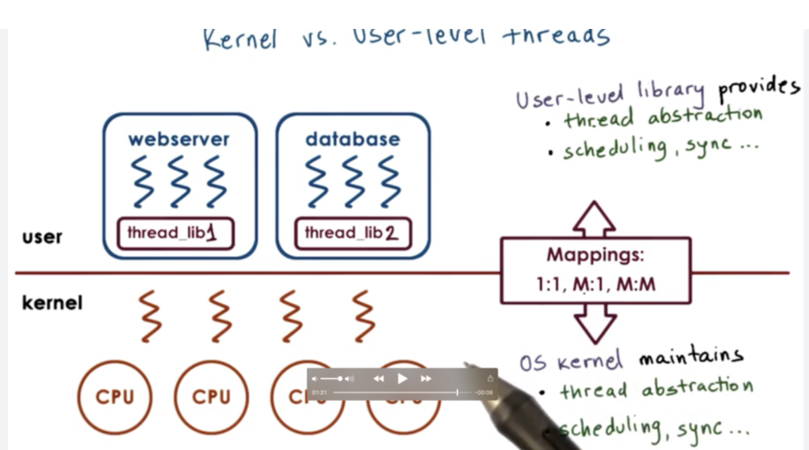 <a href="https://www.omscs-notes.com/operating-systems/thread-design-considerations/" target="_blank" style="position: absolute; bottom: -8px; left: 4px; font-size: 11px;">[src]</a> 
 
Each layer supplies its own thread abstraction, scheduling, and synchronisation, joined only by the mapping.
 

### **2.3. Thread Safety**

 

The shared address space that made threads cheap however lets concurrent access corrupt what they share. For the author, [thread safety]() means correctness under concurrent calls, held by avoiding shared mutable state (e.g. [immutability](), thread-local storage) or by guarding it with synchronisation primitives.<!-- trim: on purpose; and *logging* --> The latter ship with pthreads on Unix-like systems and most languages wrap its *pthread_mutex_lock* and related calls into higher-level APIs {e.g. Python: *threading*, C++: *std::thread*}. CPython's own [global interpreter lock]() (GIL) is such a mutex and admits a single thread to run its bytecode at a time, withholding the parallelism *threading*'s $1\colon1$ kernel threads would deliver.

For the caller, safety is stated explicitly, whether in the type (e.g. Java's *HashMap* against *ConcurrentHashMap*) or in the reference (e.g. CPython's *queue.Queue*). Note that the GIL's serialising of bytecode also makes a single *list.append* or *dict* lookup thread-safe, a benefit CPython delivers but never promises. The same serialisation means threads still help with I/O-bound work, since each releases the GIL before it blocks in a system call, and so many can wait at once while one runs CPython. By contrast, CPU-bound work gains nothing and the threads take turns at the GIL, each holding it until a waiter's 5 ms switch interval (see *sys.getswitchinterval*) expires and requests it.<!-- trim (parked, belongs to III): Two limits remain. The guarantee is safety alone, so two thread-safe components called in opposite orders can still deadlock. And it does not compose, so two safe calls in sequence leave the gap between them unguarded and `if k not in d: d[k] = v` races on a dict whose every method is safe. -->

The GIL dates from 1991 when single-core machines dominated and a whole-interpreter lock forfeited no parallelism since none existed beyond one core. Its necessity traces to CPython's use of reference counting for GC (§602#1.3), which puts a count on every object that even a read updates, and one lock over the interpreter was preferred to one on every object since concurrent reads race. The design became a liability once multicore arrived and Python rose to the language of data science, whose users saw one core in use and began complaining about the GIL. However, Linux faced the same trade with the [big kernel lock]() (BKL, §603#2.1) and removed it by 2.6.39 (2011).<!-- trim: through fine-grained locking --><!-- trim: a bargain CPython struck, not the language, sparing C extensions any change since refcounts are guarded wholesale; one lock admitting one CPU into the kernel at a time, over a decade; removing it proved hard since every C extension assumes it and every attempt slowed single-threaded code (covered by p4) -->


GIL and BKL — one pattern, two scales.

                  GIL                          BKL
  protects        interpreter state,           kernel data structures
                  chiefly refcounts
  grain           one lock, whole runtime      one lock, whole kernel
  cost            one thread runs bytecode     one CPU inside the kernel
  exit            per-object locking,          fine-grained locking,
                  3.13 -> 3.15                 removed in 2.6.39 (2011)

The asymmetry: BKL was introduced FOR SMP, a stopgap making a uniprocessor
kernel safe on many CPUs (Linux 2.0, 1996). The GIL was never introduced for
that — it was a simplification from CPython's start that only became a
liability once multicore arrived. Same bargain, opposite directions.


Greg Stein's 1996 patch against Python 1.4 tried the removal and was rejected for halving single-threaded speed. Once multicore was the norm, the trial was revived in 2023 as the *experimental* [free-threaded build]() of 3.13 (2024, [PEP 703](https://peps.python.org/pep-0703/)), that trades the single lock for per-object locking and atomic counts at the cost of single-thread overhead and C extensions opting in via *Py_mod_gil*. Subsequently, 3.14 (2025, [PEP 779](https://peps.python.org/pep-0779/)) promoted the build to *supported* and re-enabled the specialising interpreter to recover the lost speed, aiming at a free-threaded *default*. CPU-bound code will thus gain parallelism and with it the synchronisation problems that follow.

- 
 <iframe src="../assets/blog/memory-region.html" width="525" height="574" style="border: none; overflow: hidden; display: block;" scrolling="no"></iframe> 
Under the GIL only 1 of 4 cores runs Python, whereas free-threaded runs 3 threads on 3 cores.
 


1:1 Model (pthreads, Java, Python threading)

  Your Program                          OS Kernel
  ┌─────────────────────┐              ┌──────────────────────┐
  │  Thread A ──────────┼──────────────┼→ Kernel Thread 1 ──→ Core 0
  │  Thread B ──────────┼──────────────┼→ Kernel Thread 2 ──→ Core 1
  │  Thread C ──────────┼──────────────┼→ Kernel Thread 3 ──→ Core 2
  │  Thread D ──────────┼──────────────┼→ Kernel Thread 4 ──→ Core 3
  └─────────────────────┘              └──────────────────────┘

  ✓ true parallelism (4 cores)
  ✗ each thread = syscall + 1-8 MB stack + kernel bookkeeping

m:1 Model (green threads, early Java on Solaris)

  Your Program                          OS Kernel
  ┌─────────────────────┐              ┌──────────────────────┐
  │  User Thread A ─┐   │              │                      │
  │  User Thread B ─┤   │              │                      │
  │  User Thread C ─┼───┼──────────────┼→ Kernel Thread 1 ──→ Core 0
  │  User Thread D ─┤   │              │                      │
  │  User Thread E ─┘   │              │                      │
  │                     │              │  Core 1 (idle)       │
  │  [user scheduler    │              │  Core 2 (idle)       │
  │   picks A,B,C,D,E   │              │  Core 3 (idle)       │
  │   one at a time]    │              │                      │
  └─────────────────────┘              └──────────────────────┘

  ✓ cheap creation (no syscall, tiny stack)
  ✗ no parallelism (OS sees 1 thread, uses 1 core)
  ✗ one blocking syscall stalls all threads

m:n Model (Go goroutines, Erlang processes)

  Your Program                          OS Kernel
  ┌─────────────────────┐              ┌──────────────────────┐
  │  Goroutine 1 ─┐     │              │                      │
  │  Goroutine 2 ─┼─────┼──────────────┼→ Kernel Thread 1 ──→ Core 0
  │  Goroutine 3 ─┘     │              │                      │
  │                     │              │                      │
  │  Goroutine 4 ─┐     │              │                      │
  │  Goroutine 5 ─┼─────┼──────────────┼→ Kernel Thread 2 ──→ Core 1
  │  Goroutine 6 ─┘     │              │                      │
  │                     │              │                      │
  │ [runtime scheduler  │              │                      │
  │  assigns goroutines │              │  Core 2 (available)  │
  │  to kernel threads, │              │  Core 3 (available)  │
  │  migrates on block] │              │                      │
  └─────────────────────┘              └──────────────────────┘

  ✓ cheap creation (user space, ~2 KB stack)
  ✓ true parallelism (multiple kernel threads on multiple cores)
  ✓ blocking handled (runtime moves goroutine to another kernel thread)


## III
---

### **3.1. Race Conditions**

 


§III overview — shared memory fails, is cured, and the cure costs.

  3.1  Race Conditions    problem A, the scheduler interleaves
  3.2  Memory Ordering    problem B, the hardware reorders
  3.3  Synchronisation    the fix for both
  3.4  Liveness           what the fix costs

shared memory
│
├─ FAILS TWO WAYS ────────────────────────────────────────── 3.1, 3.2
│  ├─ within the scheduler   interleaving
│  │                         [race condition] [data race]
│  │                         [check-then-act] [TOCTOU] [lost wakeup]
│  └─ beneath it             hardware reordering
│                            [memory consistency] [sequential consistency]
│                            [happens-before] [memory barrier]
│
├─ CURED BY ───────────────────────────────────────────────────── 3.3
│  │
│  ├─ EXCLUSION ─── "am I alone with this?"
│  │  │              guards a code region to hold an invariant over data
│  │  │              lock <-> data is convention, never enforced
│  │  ├─ how to wait
│  │  │  ├─ poll ────── [spinlock]   burns cycles, skips the switch
│  │  │  └─ notify ──── [mutex]      sleeps, the releaser wakes it
│  │  │                              [futex] stays in user space while uncontended
│  │  └─ variants
│  │     ├─ [reentrant lock]     the holder may re-acquire
│  │     └─ [read-write lock]    many readers XOR one writer
│  │
│  ├─ COORDINATION ─ "may I proceed yet?"
│  │  ├─ how many? ──── [semaphore]  counts UNITS of a resource, not data
│  │  │                 │            N admitted -> they share nothing
│  │  │                 │            ownerless -> one thread may wake another
│  │  │                 └─ [binary semaphore]  N = 1, behaves like a mutex
│  │  └─ is it true? ── [condition variable]  the predicate is shared,
│  │                    hence the mutex it takes
│  │                    atomic release-and-sleep closes the lost wakeup
│  │                    a wake is a hint -> re-check in a loop [Mesa semantics]
│  │
│  ├─ the floor      [atomic operations] indivisible w.r.t. other cores'
│  │                 accesses to that location, not merely uninterrupted
│  │                 [test-and-set] -> [compare-and-swap]
│  │                 └─ used directly, no lock: [lock-free], [ABA problem]
│  │
│  └─ composing      fit   [producer-consumer] = mutex + 2 semaphores
│                          (or condition variables in their place)
│                          [readers-writers]   = [read-write lock]
│                    grain [coarse-grained lock] serialises what threads bought
│                          [fine-grained locking] recovers it, and can deadlock
│
└─ AT A COST ──────────────────────────────────────────────────── 3.4
   [deadlock]   a cycle in the wait-for graph
                (a lock never released strands its waiters just as long,
                 but forms no cycle, so no strategy below finds it)
   [livelock]   motion without progress
   [starvation] one thread denied indefinitely

Off the diagram:
  monitor = mutex + condition variables + encapsulation, one thread active
            inside (Java synchronized). Python's threading.Condition is a
            lock bundled with wait/notify, not a monitor.
  Dekker's (1962) / Peterson's (1981) — mutual exclusion from plain loads
            and stores alone, no atomic instruction, broken by relaxed
            hardware without fences
  CPython's GIL — a mutex whose critical section is the whole interpreter,
            released around blocking I/O and by opted-in C extensions


Although shared memory makes communication faster, concurrent executions can corrupt whatever they share, and a [race condition]() is any such outcome whose correctness depends on the timing of concurrent operations. For instance, if two threads read the same file and each writes back its own edit, then whoever finishes last silently erases the other. The root cause is [non-atomicity](), as *x += 1* compiles to a sequence $(\text{load}$, $\text{add}$, $\text{store})$ whose gaps admit another execution, whether by preemption (§603#3.1) on one core or simultaneity across two. An [atomic operation](), by contrast, is a single hardware instruction that runs to completion while no other core may touch its address. <!-- even when x86 emits a single add [mem], 1, the read-modify-write is not atomic across cores without a LOCK prefix -->


Where the shared state lives. §2.2: "every thread reads and writes the same
regions (e.g. heap, text, data segments)".

So a counter two threads increment is typically one of:
  - .data / .bss  a global or static variable. This is the textbook counter,
                  and it never touches the heap.
  - heap          an object or malloc'd buffer reached through a shared pointer.

A third case: another thread's stack. Stacks are thread-private by convention,
not by hardware — same address space — so a pointer to a local is shared like
anything else. Contrast §2.1, where separate page tables make the isolation
hardware-enforced and no pointer reaches across.


Programs acquire races in three recurring shapes. The narrowest is the [data race](), where two threads touch one memory location, at least one of them writing, with nothing ordering them (e.g. two threads incrementing the same counter).<!-- trim: two unsynchronised accesses with at least one write, i.e. two concurrent reads never conflict --> A [critical section]() is a region of code that must execute atomically over shared state, which threads must enter one at a time, and enclosing each access in one cures this shape. Unguarded, the counter loses an update, one write overwriting the other, and worse, a wide value updated non-atomically (e.g. a 64-bit field on a 32-bit machine) can be read half-written, a [torn read]() of a value never actually stored.

Wider gaps produce [semantic races](), faults in the order of operations that arise between sections each already guarded. In [check-then-act](), one thread tests a condition and acts on what it found while another invalidates it in between (e.g. both find a file absent and both create it). Security names this [time-of-check to time-of-use](https://cwe.mitre.org/data/definitions/367.html) (TOCTOU), as an attacker who slips a symlink between a program's *access()* check and its *open()* redirects the privileged operation to any file. <!-- TOCTOU: a privileged program validates a path then opens it, and an attacker races a symlink into the gap to reach a file it could not --> In the [lost wakeup](), one thread announces a change before its waiter listens (e.g. the queue fills just before the waiter sleeps). In both, the interval, not the operation, is what the section must span.

Race condition and data race are hence neither equivalent nor nested terms, the former a fault in order, the latter in the accesses, as two individually locked withdrawals race on arrival order with no data race at all. <!-- trim: despite the popular subset diagram, race condition and data race coincide in neither direction --> <!-- trim: the converse, a benign data race, e.g. unsynchronised reads of an approximate counter, losses no one minds; benign only as a correctness stance, C++ deems any racy program undefined (§3.2), cf. Boehm --> Yet both resist testing, as the triggering interleaving is outside the program's control,<!-- depends on interrupt timing and system load; may arise once in millions of runs --> and even a print statement perturbs the schedule enough to hide the [Heisenbug]() (Gray, 1985). <!-- after Heisenberg's uncertainty principle, where measurement disturbs the system --> [Dynamic race detectors](https://static.googleusercontent.com/media/research.google.com/ko//pubs/archive/37278.pdf) (e.g. ThreadSanitizer)<!-- in Clang/GCC; also Helgrind in Valgrind --> therefore instrument every access and report data races.<!-- i.e. any conflicting pair that no synchronisation orders --> Still, a clean run vouches only for the schedules observed, and a semantic race goes unreported, its accesses individually synchronised and the flaw in the gap between them. <!-- Static prevention is stronger, as safe Rust's ownership model and Send / Sync traits reject unsynchronised sharing of mutable state at compile time, ruling out data races before the program ever runs. -->


Race condition vs data race — taxonomy:

  race condition (correctness depends on timing/order)
  ├── data race            unsynchronised conflicting accesses to one location
  ├── check-then-act       both threads pass if (!file_exists()) then both create
  ├── TOCTOU               time-of-check to time-of-use (security flavour of above)
  └── lost wakeup          signal fires before the waiter sleeps

Independence, both directions:

- race condition WITHOUT data race: every access individually atomic/locked, but the higher-level order is wrong (the atomic-withdrawals example; the file-exists example when the FS serialises the syscalls).

- data race WITHOUT race condition: a "benign" race, e.g. unsynchronised reads of an approximate stats counter where any interleaving is acceptable — no semantic failure. C++ still calls it UB (a language stance, not a correctness one), which is why the popular "every data race is a race condition" subset diagram is lossy. We say "either can occur without the other" instead (cf. Boehm, "How to miscompile programs with 'benign' data races").


- 
 
 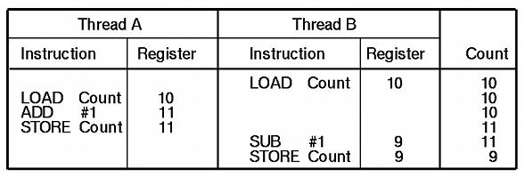 <a href="https://pages.mtu.edu/~shene/NSF-3/e-Book/RACE/overview.html" target="_blank" style="position: absolute; top: 8px; right: 8px; font-size: 11px;">[src]</a> 
 
Two interleaved read-modify-write sequences on one counter, whose final value depends on the schedule.
 

### **3.2. Memory Ordering**

 


3.1 vs 3.2 — both bite between threads, they differ in what went wrong.

                       3.1                        3.2
  cause                the OS scheduler           store buffers,
                       (§603#3.1) or true         out-of-order execution
                       parallelism across cores
  originates           between threads            within one thread
  bites                between threads            between threads
  one-word label       interleaving               visibility

"Within one thread" names where the reordering happens, not where the
failure does. A single-threaded program never suffers from it, since the
hardware keeps a thread's own instructions looking sequential to itself.
Reordering is invisible to the thread doing it and observable only by
another, which is why the opening clause says visibility.


Shared memory fails a second way, in visibility rather than interleaving, as the hardware itself reorders reads and writes for performance. Distinct from cache coherence (§601#1.3), which keeps copies of a single location aligned across cores, [memory consistency models]() define ordering guarantees, not atomicity, for operations on different locations across threads. [Sequential consistency]() (Lamport, 1979), the ordering programmers implicitly assume, requires a single total order over all reads and writes, consistent with each thread's program order, where each read returns the latest prior write. <!-- requires that every execution's reads and writes be explained by a single total order -->

Most hardware instead provides relaxed consistency, promising only some of sequential consistency's orderings. x86-TSO is relatively strong (only store-load reordering), while ARM's weak ordering permits load-load, load-store, and store-store reorderings as well. The classic casualty on weakly ordered hardware is publication, where one thread writes data then sets a ready flag, yet a second thread that sees the flag still reads the stale data, since the store buffers and out-of-order execution that keep each core busy (§601#1.2) let stores drain late and loads issue early. [Memory barriers]() (fences) are the ISA instructions that force the missing ordering (*mfence* on x86, *dmb* on ARM).

[Happens-before](https://lamport.azurewebsites.net/pubs/time-clocks.pdf) (adapted from Lamport, 1978) formalises visibility as a strict partial order generated by program order and synchronisation edges, so a data race is a pair of conflicting unsynchronised accesses (same location, at least one write) left incomparable by it. Language memory models build on the same order, C++11 declaring any racy program undefined while Java 5 bounds the damage with weak but defined semantics.<!-- JSR-133, forced by double-checked locking, below --> In both, the fences arrive behind language primitives (*std::atomic* in C++, *volatile* in Java) and inside the synchronisation primitives that follow, so correctly locked code is correctly ordered for free.


Double-checked locking — the idiom that forced JSR-133 (Java 5).

Published for years as the way to lazily initialise a singleton without
paying for a lock on every call:

  if (instance == null) {              // check 1, no lock, the fast path
      synchronized (this) {
          if (instance == null) {      // check 2, holding the lock
              instance = new Singleton();
          }
      }
  }
  return instance;

The last assignment is not one step but three:
  1. allocate the memory
  2. run the constructor
  3. publish the reference into `instance`

Nothing stopped 3 becoming visible before 2 finished, so `instance` went
non-null while the object was still half-built. A second thread hitting
check 1 saw non-null, skipped the lock entirely, and returned an object
whose fields were still zero.

This is p2's publication failure exactly: the reference is the ready flag,
the constructed fields are the data, and the flag arrives first. Declaring
the field volatile is the fix, and JSR-133 is what gave volatile the
semantics to deliver it.

Bacon et al., "The 'Double-Checked Locking is Broken' Declaration" (2001).


- ...

### **3.3. Synchronisation**

 


Synchronisation stack (top to bottom):

  Application: threading.Lock(), asyncio.Lock(), multiprocessing.Lock()
  Language:    std::atomic, synchronized (Java), Send/Sync (Rust)
  Library:     pthread_mutex_lock(), pthread_barrier_wait()
  Kernel:      futex() (Linux), manages sleep/wake queues
  Compiler:    inserts barrier instructions at synchronisation points
  ISA:         mfence (x86), dmb (ARM), fence (RISC-V)
  Hardware:    CPU flushes/orders its memory pipeline

C barrier APIs (used in OS/kernel development):

  Linux kernel:  smp_mb(), smp_rmb(), smp_wmb(), barrier()
  GCC/Clang:     __sync_synchronize(), __atomic_load_n(&x, __ATOMIC_ACQUIRE)
  C11 standard:  atomic_thread_fence(memory_order_seq_cst)

These macros expand to the appropriate ISA instruction per architecture.


Synchronisation primitives supply critical sections with atomicity and the ordering that relaxed hardware trades for speed.<!-- primitive: elementary operation --> The simplest, the [spinlock](), burns cycles in a [busy wait]() until the lock frees.<!-- on one core spinning merely delays the very holder it awaits, until the spinner is preempted; on a multicore machine another core can release the lock while the spinner runs --> A [mutual exclusion lock]() (mutex, e.g. *pthread_mutex_lock()*) instead sleeps until the release and trades the burn for a context switch that pays once the hold outlasts it. Linux's [fast userspace mutex]() (futex) enters the kernel only when contended, while the two combine in the [adaptive mutex]() by spinning briefly before parking. Variants adjust not the wait but whom they admit, as a [reentrant lock]() re-admits its holder<!-- without deadlocking against itself --> and [read-write locks]() admit many readers or one writer.<!-- trim: reentrant lock aka recursive mutex, which counts acquisitions; read-write locks suit read-heavy workloads --><!-- trim: puts a waiting thread to sleep until the lock is released; keeps the thread checking in a tight loop; allow concurrent reads but exclusive writes -->

Acquiring a lock is itself a check-then-set, which two threads could interleave to recreate the very race the lock guards against. Every lock is therefore built from a hardware atomic operation, requested of the hardware by an ISA instruction rather than of the OS by a syscall. The earliest such instruction, [test-and-set]() (IBM System/360, 1964), sets a flag and returns the flag's old value in one step, rich enough to build a spinlock but no more. [Compare-and-swap]() (CAS, System/370, 1970) generalises it by writing a new value only if the address still holds the one the caller expects (e.g. x86 *LOCK CMPXCHG*). A failure can only mean another thread wrote first. A LOCK-prefixed instruction moreover acts as a full fence, supplying the ordering along with the atomicity.

[Lock-free]() data structures instead use atomics directly, where an update reads the old value, computes the new, and retries the CAS on failure (e.g. C++'s *std::atomic*, Java's *AtomicInteger*). This guarantees some thread always progresses even if others stall, whereas a lock holder preempted mid-section blocks every waiter. The [ABA problem]() is the one caveat, as a location can change from $A$ to $B$ and back between the read and the CAS, which then succeeds though the state moved beneath it. It bites hardest on pointers, where a freed and reallocated node returns at its old address, and is defeated by packing a version counter beside the value so every write changes the pair.


Spin or sleep is one function, implemented two ways, and in practice both at once.
Same contract to the caller, same code at the call site.
What a program calls is the POSIX API, pthread_mutex_lock(); what follows is roughly what glibc's NPTL does inside it.

  void spin_lock(spinlock_t *s) {            // Linux kernel: spin_lock()
      while (xchg(&s->flag, 1))              // test-and-set: writes 1, returns old
          cpu_relax();                       //   (bitwise: test_and_set_bit())
  }

  void mutex_lock(mutex_t *m) {              // glibc NPTL: the lll_lock path
      while (atomic_exchange(&m->flag, 1))   // same operation, C11 spelling
          futex_wait(&m->flag, 1);           // hand the core back, wake on unlock
  }

  void adaptive_lock(mutex_t *m) {           // glibc: PTHREAD_MUTEX_ADAPTIVE_NP
      for (int i = 0; i < SPIN_LIMIT; i++) { // brief optimism, no syscall
          if (!atomic_exchange(&m->flag, 1)) return;
          cpu_relax();
      }
      while (atomic_exchange(&m->flag, 1))   // gave up, now park
          futex_wait(&m->flag, 1);
  }

Pedagogical shape, not current source. Linux spinlocks have been qspinlocks
since 4.2 (2015), MCS-style queues where each waiter spins on its own per-CPU
cache line, since a shared word storms the interconnect as cores are added.

The while survives in both, since waking is not winning, as a third thread may take the flag before the woken one is scheduled.

Python's threading module exposes all three, though only Lock() is primitive,
with Condition() and Semaphore() built over it in the interpreter.

An uncontended lock never enters the kernel — one atomic instruction and the caller is in. futex() is the contended path only, which is what "fast userspace mutex" names. Python's threading.Lock rests on the same pthreads calls on Linux.


- ...

[Semaphores]() (Dijkstra, 1965) extend the lock from exclusion to coordination by generalising its binary state to an integer counter, the [counting semaphore](), under the invariant $v \geq 0$, where P decrements $v$ or blocks at zero and V increments it, both named in his native Dutch. POSIX.1b (1993) ships the pair as *sem_wait()* and *sem_post()* in *\<semaphore.h\>*, and underneath *sem_wait()* parks on the same futex a contended mutex does. A DB connection pool is a notable realisation (§606#3.3), such that an initial value $N$ admits at most $N$ threads at once, a bound that suits a pool of $N$ interchangeable resources, not a critical section.

A mutex is a key its holder must return, a semaphore is a count any thread may raise, and a [binary semaphore]() ($N = 1$) is simply a mutex without an owner. Ownerlessness cuts both ways, letting one thread post what another awaits, a signalling no lock can express, while a wrong-thread release cannot be caught nor priority inheritance defined, hence mutexes for exclusion and semaphores for counting. The initial value declares the intent, $N$ for a pool and zero for a signal yet to come, where the first post mints what the first wait collects. Both thus bound admission to what they guard (e.g. section or pool), yet neither selects the admitted thread, as a release frees an arbitrary waiter.<!-- POSIX leaves the wake order unspecified under default scheduling; SCHED_FIFO/SCHED_RR instead wake the highest-priority, longest-waiting thread -->


Counting vs binary, in Python.

  sem = threading.Semaphore(10)   # at most 10 threads in flight
  sem.acquire()                   # wait: decrement, block at zero
  ...                             # e.g. 10 concurrent HTTP requests
  sem.release()                   # signal: increment, from any thread

  lock = threading.Lock()         # the binary case, but owner-checked in spirit:
                                  # release() from a non-holder is a bug, not a signal


- 
 
 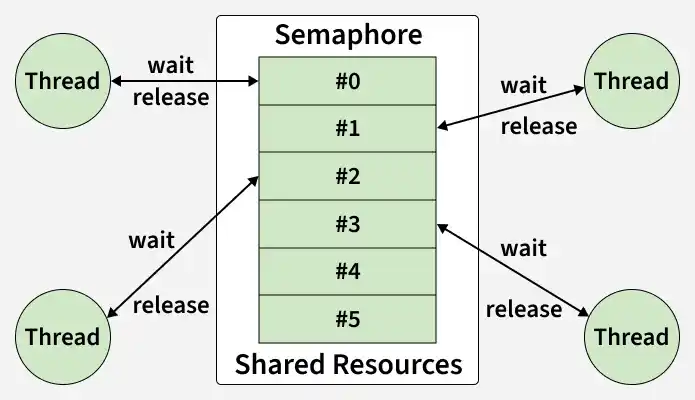 <a href="https://www.geeksforgeeks.org/operating-systems/semaphores-in-process-synchronization/" target="_blank" style="position: absolute; top: 1px; right: 1px; font-size: 11px;">[src]</a> 
 
The semaphore counts the pool's free units and admits at most N threads with no record of which, a count over resources rather than a key to a door.
 

A thread may own the lock yet be unable to proceed until its [predicate]() holds. For instance, a consumer finds the queue empty which only a producer needing that same lock can fill. The crude fix is to unlock, nap on a timer, and retry, although any interval merely trades lock contention against latency. [Condition variables]() remedy this with notification. Under POSIX, a consumer calls *pthread_cond_wait()* to atomically release the lock and sleep with no gap for a lost wakeup. The producer, on fill, calls *pthread_cond_signal()* or *\_broadcast()* to rouse one sleeper or all. The variable itself is only a queue of sleepers, so a signal without a waiter is discarded, unlike a semaphore's.

The waiter then rechecks the predicate in a loop, for a wake can be [spurious](), POSIX permitting returns with no signal, or stale, a third thread having taken the item first. [Mesa semantics]() (Xerox PARC, 1980) then promise only that the predicate may have changed. [Hoare semantics]() (1974) instead suspend the signaller and hand the lock straight to the waiter, so the predicate is guaranteed on waking. Yet the weaker guarantee is the one that composes, as *pthread_cond_broadcast()* cannot hand the lock to every waiter it wakes and a timed wait expires promising nothing, whereas one loop absorbs both. POSIX passes no lock with either call, so a woken thread reacquires it to proceed.


What it replaces. Holding the lock is no help when the queue is empty, since
only a producer can fix that and the producer needs the same lock. So the
consumer must step out and come back:

  pthread_mutex_lock(&m);
  while (queue_empty()) {
      pthread_mutex_unlock(&m);      // step out so a producer can get in
      sleep_a_bit();                 // how long? too long adds latency,
      pthread_mutex_lock(&m);        // too short hammers the lock
  }
  item = queue_pop();
  pthread_mutex_unlock(&m);

Correct, but it polls: the right moment to wake is "when a producer pushes",
which no timer knows. The condition variable replaces the three polling lines
with a sleep that ends on notification.

  CONSUMER                               PRODUCER
  pthread_mutex_lock(&m);                pthread_mutex_lock(&m);
  while (queue_empty())                  queue_push(x);
      pthread_cond_wait(&cv, &m);        pthread_cond_signal(&cv);
  item = queue_pop();                    pthread_mutex_unlock(&m);
  pthread_mutex_unlock(&m);

The test sits inside the lock: unlocked it is a data race and reopens
check-then-act (a producer can push and signal between test and wait), and
wait() without m held is undefined — it releases a mutex it does not own.

Why a wake can mislead, three ways: a POSIX signal interrupts the futex wait
and cond_wait returns anyway; implementations over-wake rather than track who
should hear which signal; a third thread can win m and take the item first.
The spurious wakeup mirrors the lost one: there a signal nobody heard, here
a wake though nothing relevant happened.

Hoare (1974): signal suspends the signaller and hands the mutex to the waiter,
so the predicate is guaranteed on waking —

  if (queue_empty())          // Hoare: on return, guaranteed non-empty
  while (queue_empty())       // Mesa: on return, look again

— at the cost of two extra context switches per signal and a critical section
broken in half. The difference is semantic, not implementational: spin-vs-sleep
is invisible to the caller, this changes what the caller must write.


A concurrent program ultimately borrows what it cannot do alone, the indivisible step only hardware can take and the sleep only the kernel can grant, and every primitive above is some ratio of the two. The classical problems rehearse it. The [producer-consumer]() problem<!-- aka. bounded buffer --> needs a mutex and two semaphores (or condition variables) to block producers when the fixed-size buffer is full and consumers when it is empty, whereas the [readers-writers]() problem schedules many readers and rare writers over one shared object without starving either side and maps onto the read-write lock. Correct synchronisation thus fits the primitive to the access pattern rather than wrapping every operation in a lock.

- ...

### **3.4. Liveness**

 

Correctness decomposes into two guarantees, [safety]() that nothing bad ever happens and [liveness]() that something good eventually does. A race and a hang are the failures of under- and over-synchronised sharing, violating the former and the latter respectively. The race does not cause the hang, its cure does, as locks buy safety by forbidding orders of execution, and an over-broad ban leaves none to run. [Lock granularity](), how much state one lock guards, decides the balance. Specifically, a single [coarse-grained lock]() serialises the very parallelism multithreading was meant to buy (e.g. the GIL), whereas [fine-grained locks]() (e.g. free-threaded CPython) buy it back.

If every object carries its own lock, then an operation touching two objects must hold both locks, and holding one while awaiting another is where the hang begins. Formally, a set of threads each permanently blocked on a lock another holds is called a [deadlock](),<!-- a fault no unsynchronised program can suffer, since nothing in it ever waits --> for which the [Coffman conditions]() (1971) are jointly necessary: i) mutual exclusion; ii) hold-and-wait; iii) no preemption; and iv) circular wait. The last appears as a cycle in the [wait-for graph](), where an edge $T_i \to T_j$ reads as $T_i$ waiting on a lock that $T_j$ holds. A chain of waits closed into a cycle is in fact the deadlock, since each thread proceeds only after the next, and so the loop has no first mover (i.e. cycle $\iff$ deadlock).

- 
 
 <iframe src="../assets/blog/dining-philosophers.html" width="400" height="290" style="border: none; overflow: hidden; transform: scale(0.8); transform-origin: 0 0;" scrolling="no"></iframe> 
 
The <a href="https://www.cs.utexas.edu/~EWD/transcriptions/EWD03xx/EWD310.html" target="_blank">dining philosophers problem</a> (Dijkstra, 1965), where the lock-ordering toggle (lower-numbered chopstick first) makes the cycle impossible.
 

Against the cycle stand three defences: i) [lock ordering](): acquisitions only ascend a fixed total order, so no cycle can close, as when every philosopher picks up the lower-numbered chopstick first; ii) [timeouts](): an acquisition that waits too long is abandoned and retried; and iii) [detection & recovery](): the wait-for graph is searched and a member of any cycle found is aborted. Ordering falsifies circular wait in advance, whereas timeouts and recovery break hold-and-wait and no-preemption respectively, after the fact. Ordering is strongest but presupposes that fixed total order, which locks created per row or taken inside libraries deny, and therefore the fallback to the other two.

For example, the cycle closes when PostgreSQL transactions update the same two rows in opposite orders ($T_1\colon A \to B$, $T_2\colon B \to A$). Its detector runs DFS after a 1$\text{s}$ timeout,<!-- *deadlock_timeout* --> and the checker, say $T_1$, aborts itself with *ERROR: deadlock detected*,<!-- SQLSTATE 40P01 --> its rollback releasing A for $T_2$ (§606#2.2). At the other extreme, Linux uses the [ostrich algorithm](), and ignores deadlock because a rare hang does not justify checking every wait.<!-- as do general-purpose kernels at large --><!-- Linux enforces lock ordering on its own locks, policed in debug builds by lockdep (CONFIG_PROVE_LOCKING), while user-space mutexes get no detection at all --> Neither helps against a lock never released, which hangs its waiters without any cycle, yet higher-level languages cure it with scope-bound acquisition (e.g. *with* in Python). It releases on every exit path one would accidentally miss (e.g. *pthread_mutex_unlock()* in C).


The release is structural or it is missed. One critical section, three languages.
The hazard is C's general contract, every resource a manual acquire/release pair
(malloc/free, open/close, pthread_mutex_lock/unlock), any early exit between the
pair leaking it; a leaked lock differs only in that someone is waiting on it.

C (pthreads) — the pair is explicit, so every exit path must repeat the unlock:

  void safe_insert(int i) {
      pthread_mutex_lock(&m);
      if (!valid(i)) return;            <- LEAK: returns still holding m
      list_insert(&my_list, i);
      pthread_mutex_unlock(&m);
  }                                     every later waiter blocks forever

Birrell (Modula-2+, 1989) — acquisition and release bound to one block:

  PROCEDURE SafeInsert(i: INTEGER) =
    BEGIN
      LOCK m DO
        MyList.insert(i)
      END              (* unlock, on every exit path *)
    END SafeInsert;

The descendants, wherever destructors or context managers exist:

  C++     { std::lock_guard<std::mutex> g(m); my_list.insert(i); }
  Python  with lock: my_list.insert(i)
  Rust    let mut v = m.lock().unwrap(); v.push(i);

The cure is scope, not ordering.


Beyond the hang, two subtler relatives also violate liveness.<!-- i.e. forall thread, exists a later step where it makes progress --> Specifically, [livelock]() violates it in motion, as threads change state indefinitely without progressing (e.g. two threads that time out, back off, and retry in lockstep). [Starvation]() violates it selectively, as one thread waits unboundedly while the rest proceed (e.g. a writer never admitted under a read-heavy read-write lock), and is cured by fairness, a bound on how long any waiter can be overtaken. Deadlock and its relatives close the account of concurrency where it began, with a scarcity of waiting answered by consolidation, <!-- (e.g. the event loop) --> and a scarcity of computing by distribution, <!-- (e.g. across cores) --> which is paid for <!-- , in the end, --> in synchronisation. <!-- (e.g. locks) -->

<!-- Scheduling algorithms moved to §603#3.1 (Process Management) where they naturally belong.
Backpressure and work-stealing are application-level patterns, not OS scheduling. -->

