# Networking
---
> At its core, networking is just tagging data with the right addresses and letting the network deliver it. The concept is one sentence, but the failure modes fill textbooks: packets arrive out of order, links congest, addresses exhaust, adversaries forge labels. The layered protocol stack and the protocols within each layer exist to solve these problems reliably at scale.

<!-- What if packets arrive out of order, or don't arrive at all? → TCP
What if the network is congested and packets pile up? → congestion control
What if we run out of addresses? → NAT, IPv6
What if someone forges the labels? → TLS, DNSSEC
What if millions of hosts need to find each other by name? → DNS
What if the physical link is unreliable? → checksums, retransmission -->

## I
---

### **1.1. Switching & Multiplexing**

 

Given a [network]() is a graph of nodes joined by [links]() (e.g. the copper pair, the fibre strand) that exchange data under shared protocols, many sources contending for finite link capacity poses two problems, i) path selection: the route by which data traverses intermediate nodes from source (src.) to destination (dst.); and ii) link sharing: how multiple transmissions divide a single physical link. [Switching]() answers the first and [multiplexing]() the second. How a link of capacity $C$ is partitioned among competing flows is what distinguishes the switching methods and governs the resulting throughput, latency, and loss.

Specifically, given that multiplexing admits i) [time-division multiplexing]() (TDM): each flow transmits in a fixed time slice; ii) [frequency-division multiplexing]() (FDM): each flow occupies a separate frequency band; and iii) [statistical multiplexing](): flows share capacity on-demand without pre-allocation; [circuit switching](https://en.wikipedia.org/wiki/Circuit_switching) leverages TDM/FDM and reserves resources (e.g. [bandwidth]()) for the connection's lifetime irrespective of utilisations. For example, the [public switched telephone network]() (PSTN), where each call reserves a dedicated circuit, suits steady voice calls though it reveals the approach's fundamental inefficiency for bursty, short-lived computer traffic. 
<!-- This reserved capacity would yield poor utilisation under bursty traffic, despite of several benefits earned by pre-allocation. -->

<!-- More specifically, routers use [store-and-forward]() semantics to have the entire packet before transmitting it on the next link, introducing a per-hop delay of $L/R$, where $L$ is packet size in bits and $R$ is link rate in bits/second. The total store-and-forward delay across $N$ hops is $N \times L/R$, with extra propagation and queuing delays. -->

[Packet switching]() instead adopts statistical multiplexing, partitioning data into [packets]() that share the link on-demand for near-maximum utilisation. Each packet carries its own destination address, and a [store-and-forward]() packet switch forwards it hop-by-hop by matching that address against a lookup table to select the next hop, a role realised at multiple layers. The per-packet [latency]() can be decomposed as $d_{\text{total}} = \sum_{i=1}^{N}(d_{\text{proc}} + d_{\text{queue}} + d_{\text{trans}} + d_{\text{prop}})\_i$, where $N$ is the number of hops, $d_{\text{trans}} = L/R$ (i.e. push $L$ bits onto the link at rate $R$), and $d_{\text{prop}} = d/s$ (i.e. signal traverses link of length $d$ at speed $s$), whilst $d_{\text{proc}}$ (e.g. header lookup, checksum) and $d_{\text{queue}}$ (e.g waiting behind other packets) are non-deterministic.

- 
 
 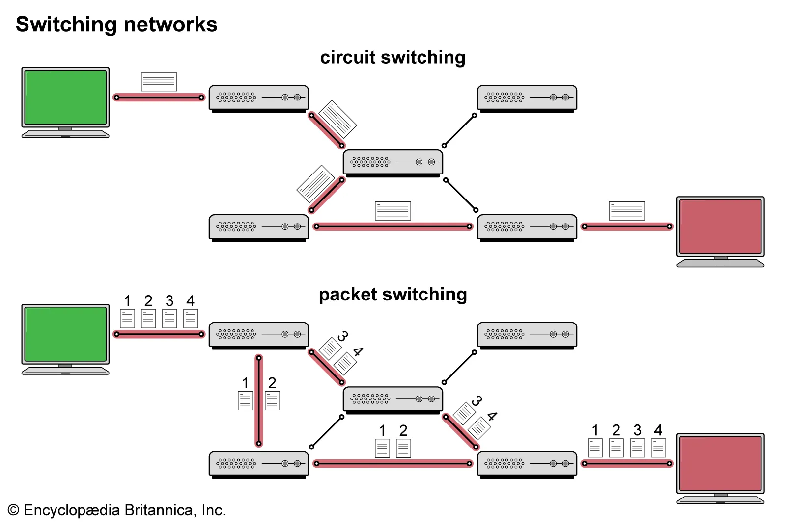 <a href="https://www.britannica.com/technology/packet-switched-network" target="_blank" style="position: absolute; top: 4px; right: 4px; font-size: 12px;">[src]</a> 
 
A reserved circuit against per-packet routes over shared links.
 

### **1.2. Network Models**

 

Networks are also classified by geographic scope, in increasing span [local area network]() (LAN), [metropolitan area network]() (MAN), and [wide area network]() (WAN). A LAN spans a building/campus at high bandwidth and sub-millisecond latency, predominantly over [Ethernet]() (1973, standardised as IEEE 802.3). <!-- (later redesigned with RJ-45 connectors on Steve Jobs' advice to be as easy to connect as a phone line).-->A MAN spans a city, a WAN spans countries or continents, interconnecting many LANs. Over WAN distances, $d_{\text{prop}} = d/s$ dominates, fixed by distance and signal speed, hence irreducible by bandwidth (a transatlantic round trip costs tens of ms), whereas LAN latency is transmission-bound. [ARPANET]() (1969), the first packet-switched WAN, grew into the foundation of the modern internet. 

The [open systems interconnection](https://spectrum.ieee.org/osi-the-internet-that-wasnt) (OSI) model, set by [international organisation for standardisation]() (ISO, 1977-84), has seven layers with strict separation of concerns. Designed by committee ahead of implementation, its protocol suites (e.g. X.25 for packet switching, X.400 for email, X.500 for directory services) proved over-specified and costly to implement. TCP/IP however took the opposite approach: implement and standardise what works. As a consequence, the US government also abandoned its OSI mandate (GOSIP, 1990) by 1995. Though OSI lost as a protocol suite, its layer numbering persists as standard vocabulary.

The [transmission control protocol](https://www.youtube.com/watch?v=3b_TAYtzuho) / [internet protocol]() (TCP/IP) model was developed through running implementations on ARPANET (NCP → TCP/IP on 1 January 1983, Flag Day), prevailing by shipping working code before any complete specification. It stacks four layers: i) [link](): frame transmission over a physical medium; ii) [internet](): logical addressing and best-effort routing; iii) [transport](): end-to-end process-to-process communication; and iv) [application](): user-space service semantics. This embodies the [end-to-end principle](https://en.wikipedia.org/wiki/End-to-end_principle) (1984), which holds that application-specific functions should reside at the endpoints rather than in the network, with the two middle layers implemented in kernel space. 

- 
 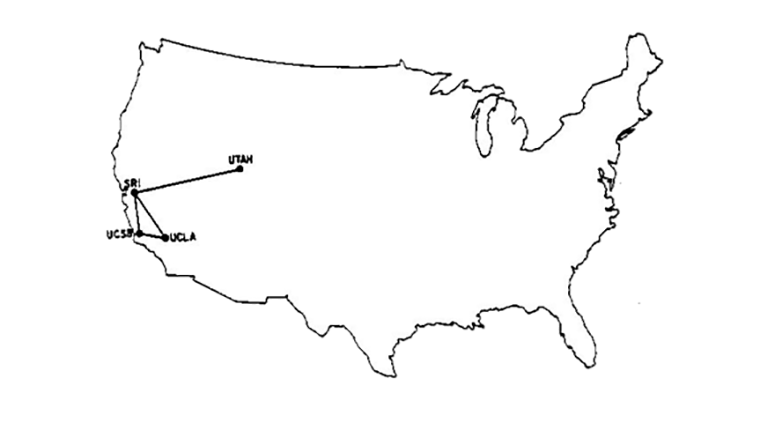 <a href="https://education.cfr.org/learn/timeline/origins-internet" target="_blank" style="position: absolute; bottom: 8px; right: 4px; font-size: 12px;">[src]</a> 
Maps of Arpanet from December 1969 to March 1977.
 

<!-- - 
 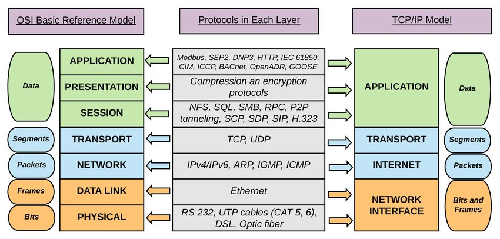 <a href="https://notes.davidvarghese.net/computer-networks/network-models/tcp-ip-model" target="_blank" style="position: absolute; top: 4px; right: 4px; font-size: 12px;">[src]</a> 
 -->

<!-- - 
 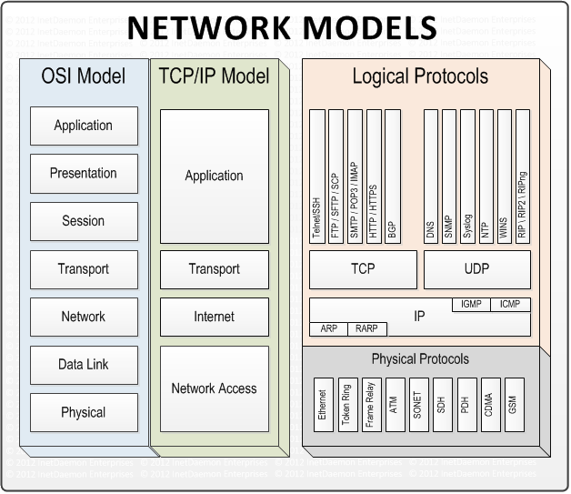 <a href="https://www.inetdaemon.com/tutorials/basic_concepts/network_models/comparison.shtml" target="_blank" style="position: absolute; top: 4px; right: 6px; font-size: 12px;">[src]</a> 
 -->

Each layer encapsulates the unit above as opaque [payload]() and prepends only its own header, producing its [protocol data unit]() (PDU), e.g. { $\text{L}1$: [bits]() on the wire, $\text{L}2$: a [frame](), $\text{L}3$: a [packet](), $\text{L}4$: a [segment]() (TCP) or [datagram]() (UDP), $\text{L}7$: a [message]() or data}. The receiver decapsulates this in reverse by stripping headers layer-by-layer. The isolation lets each layer evolve independently, so Wi-Fi replaces Ethernet at $\text{L}2$, or IPv6 replaces IPv4 at $\text{L}3$ without disturbing the others. <!-- Consider a browser requesting a YouTube video. After DNS resolves the domain to an IP address, the application layer constructs an HTTP request as its message, the transport layer wraps it in a TCP segment (e.g. src port 52431, dst port 443), the internet layer prepends src and dst IP addresses to form a packet, and the link layer frames it with the local router's MAC as the next hop. At each hop, the router strips the frame, reads the dst IP, and forwards in a new frame. -->

Encapsulation also fixes which addresses survive the journey. Delivery is addressed per link at $\text{L}2$ but end-to-end at $\text{L}3$, so a frame's MAC addresses are rewritten at every hop while the packet's IP addresses hold from source to destination, and the $\text{L}4$ port names the process the bytes are finally handed to.


A single delivery traverses the stack TWICE, tracing a V rather than a one-way OSI
ladder: encapsulation DOWN the sender's stack, then decapsulation UP the receiver's.
The trough is L1, the physical wire, the only place two machines physically touch, and
the zero-gradient turning point where software hands off to hardware and back.

 layer #
   L7  app ●                                        ● process     ┐
   L4  port ●                                    ●  (port)        │ software
   L3  IP    ●                                ●  IP               │
   L2  MAC    ●                            ●  MAC                 ┘
   L1  NIC ────●══════ the wire ══════●──── NIC        ← hardware, ∇ = 0  (turning point)
               └── SENDER: down ──┘└── RECEIVER: up ──┘
                 (encapsulation)     (decapsulation)

Same journey as the addressing analogy (Section I → II):
  IP (mailing address → building) → MAC/NIC (fingerprint → person at the door)
   → port (suite # → the desk / process) → TCP·UDP (registered courier vs postcard)


- 
 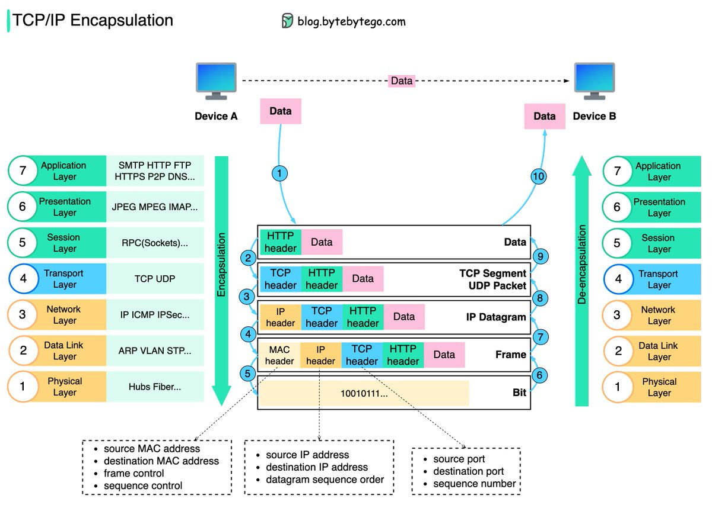 

 <a href="https://x.com/alexxubyte/status/1592193892530589696" target="_blank" style="position: absolute; bottom: 8px; right: 4px; font-size: 12px;">[src]</a> 
The L3 unit here is the formal <i>IP datagram</i> (RFC 791).
 

<!-- - 
  <a href="https://blog.reallabworkbook.com/p/what-is-tcpip-model" target="_blank" style="position: absolute; bottom: -8px; right: 4px; font-size: 12px;">[src]</a> 
 -->

<!-- - 
 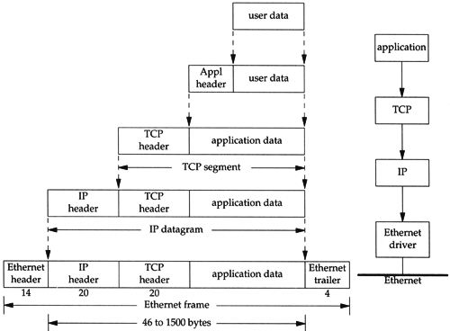 <a href="https://flylib.com/books/en/3.223.1.18/1/" target="_blank" style="position: absolute; top: 4px; left: 4px; font-size: 12px;">[src]</a> 
 -->

### **1.3. Ethernet [L1/L2]**

 


§1.3 arc:
- p1 (lower half) — how a frame physically comes to be and gets onto the wire: framing structure (MAC fields, CRC) and the PHY encoding it into signals. Hardware-facing.
- p2 (upper half) — how that frame is logically delivered: MAC as a delivery address, broadcast-domain scope, switch vs router forwarding, and ARP closing the IP-known/MAC-needed gap. Network-facing.
- p3 (details) — frame sizing: MTU and path MTU discovery.
- p4 (bridge) — zoom out from one broadcast domain to network scope (LAN/MAN/WAN), where LANs interconnect via L3 routers into the internet. Transitions Section I (L1/L2) to Section II (IP/L3).


Ethernet <!-- (named after the "ether," the hypothetical material once believed to carry light) --> spans the physical and link layers, partitioning the work between them. At $\text{L}2$, the [media access control]() (MAC) sublayer frames the payload by prepending src. and dst. MAC addresses and also appending a CRC-32 [checksum]() for error detection, where each MAC is a 48-bit identifier assigned to a [network interface card]() (NIC) on a host device. At $\text{L}1$, the physical sublayer (PHY) serialises this frame onto the medium (i.e. cable) through a line code that fixes voltage, clocking, and modulation (e.g. 100BASE-TX: 4B/5B, 1000BASE-X: 8b/10b). The frame is thus the $\text{L}2$ unit and the encoded bitstream the $\text{L}1$ unit, both governed by one standard.


A line code maps each block of data bits to a slightly larger symbol (4B/5B: 4→5 bits, used by 100BASE-TX i.e. 100 Mbit/s Ethernet over twisted pair; 8b/10b: 8→10 bits, used by 1000BASE-X i.e. gigabit Ethernet over fibre). The extra bits guarantee frequent signal transitions, so the receiver, which has no separate clock wire, can recover timing from the transitions themselves, and keep DC balance (roughly equal 0s and 1s to avoid baseline drift).


A MAC serves as a delivery address only within a single [broadcast domain]() (i.e. the nodes reachable by one $\text{L}2$ broadcast)<!--, not across the wider network.-->, so [link-layer switches]() forward frames within that domain by MAC (from a [forwarding table]() built by [self-learning](), IEEE 802.1D)<!-- while routers cross between domains at $\text{L}3$ -->. <!-- [Wi-Fi]() is a separate $\text{L}2$ technology, but it uses the same MAC addresses, and an access point bridges its devices into the same broadcast domain as wired Ethernet. --> The sender must frame to the next hop yet knows only its IP, a gap the [address resolution protocol]() (ARP) bridges by broadcasting a request to ff:ff:ff:ff:ff:ff that the owner answers and the sender caches. When the dst. IP falls outside the local subnet (determined by the subnet mask), the sender resolves the router's MAC instead and frames the packet to that gateway, which forwards it onward at $\text{L}3$. 

A frame's payload is bounded by the [maximum transmission unit]() (MTU), the largest L3 packet a link carries (1500 bytes on Ethernet), exclusive of the L2 header and CRC, so the on-wire frame is larger still. Headers eat into this budget, leaving $\text{IP packet} \leq \text{MTU}$ and $\text{payload}\_{\text{L4}} \leq \text{MTU} - H\_{\text{IP}} - H\_{\text{L4}}$ (1460 bytes for TCP over IPv4). Across mixed-MTU links the smallest governs, so an oversized packet is fragmented or dropped unless [path MTU discovery]() probes that minimum (IPv4 DF bit plus an ICMP reply) and the sender pre-sizes to fit. Data-centre and GPU-cluster fabrics (§601#2.4) raise it to [jumbo frames]() (9000 bytes), amortising header overhead across distributed-training transfers.


  IP  ──ARP──▶  MAC  ──is the address of──▶  NIC
 (L3, logical)  (L2, physical)            (the hardware)

- Start with an IP (logical, what apps and routing use).
- ARP resolves it to a MAC (the L2 address needed to build a frame).
- That MAC is the identity of a specific NIC (the physical interface).

Analogy:
- NIC  = the person (the body), the real physical thing.
- MAC  = that person's fingerprint / national ID; permanent, tied to the hardware,
         globally unique by design but used to identify them only within the local
         broadcast domain (the room they are standing in).
- IP   = that person's mailing address; assigned by whatever network they join (not by
         geography), so it changes on joining a new network but stays put while on the
         same one. The address the internet actually sees is the network's public IP
         (via NAT); the local one (e.g. 192.168.x.x) repeats across millions of
         networks.

A device with two interfaces (Wi-Fi + Ethernet) is like two people: two NICs, each with its own MAC and its own IP, which is why one machine can hold both at once.


- 
 
 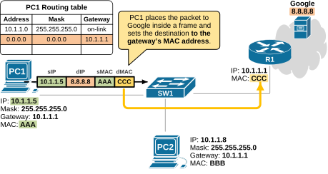 <a href="https://www.networkacademy.io/ccna/network-fundamentals/routers-layer3-switches" target="_blank" style="position: absolute; bottom: -8px; right: 4px; font-size: 12px;">[src]</a> 
 
Switches forward within a broadcast domain, the router between them.
 

<!-- - 
 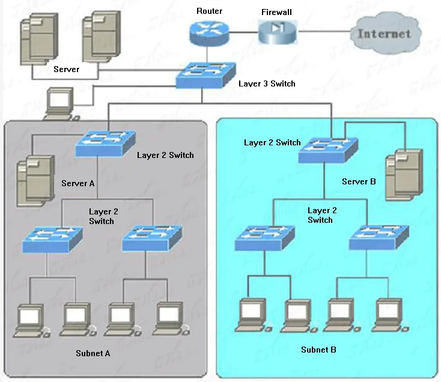 <a href="https://www.vsolcn.com/blog/layer-3-switch-routing-connection.html" target="_blank" style="position: absolute; top: 2px; right: 4px; font-size: 12px;">[src]</a> 
 -->

<!-- - 
 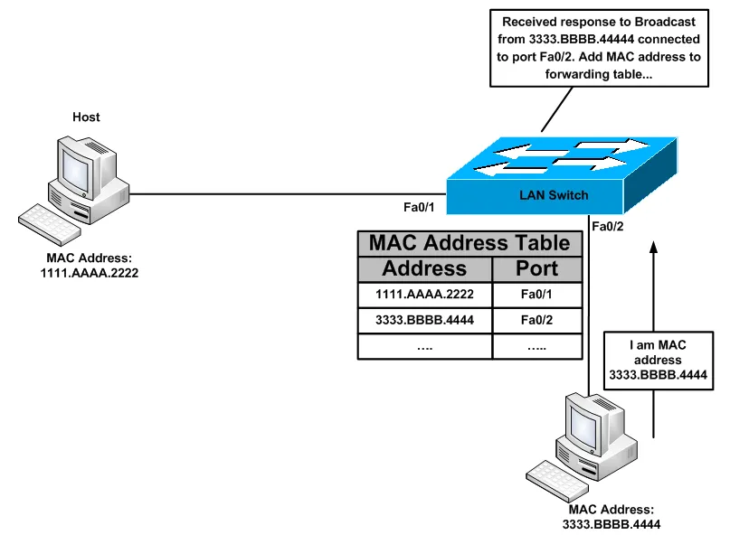 <a href="https://www.howtonetwork.com/certifications/cisco-2/layer1234-switching/" target="_blank" style="position: absolute; top: 4px; left: 4px; font-size: 12px;">[src]</a> 
 -->

## II
---

### **2.1. IP [L3]**

 


Here's the section's spine:

┌─────┬─────────────────────────────────────────┬──────────────────────────────┐
│  p  │                  topic                  │            needs             │
├─────┼─────────────────────────────────────────┼──────────────────────────────┤
│ p1  │ IP as the L3 address abstraction        │ —                            │
├─────┼─────────────────────────────────────────┼──────────────────────────────┤
│ p2  │ router — forwarding (data plane)        │ only "next hop"              │
├─────┼─────────────────────────────────────────┼──────────────────────────────┤
│ p3  │ prefix/host split, classful             │ motivated by "routing can't  │
│     │                                         │ scale to $2^{32}$"           │
├─────┼─────────────────────────────────────────┼──────────────────────────────┤
│ p4  │ subnet mask, CIDR                       │ prefix                       │
├─────┼─────────────────────────────────────────┼──────────────────────────────┤
│ p5  │ NAT, scopes                             │ prefix                       │
├─────┼─────────────────────────────────────────┼──────────────────────────────┤
│ p6  │ routing — longest-prefix match +        │ prefix, CIDR                 │
│     │ OSPF/RIP/BGP (control plane)            │                              │
└─────┴─────────────────────────────────────────┴──────────────────────────────┘


While a MAC delivers only within one broadcast domain, [internet protocol]() (IP) provides the $\text{L}3$ abstraction that spans heterogeneous physical networks (e.g. differ in frame format $A \neq B \neq C$ and addressing $A = B \neq C$, where $A$: Ethernet, $B$: Wi-Fi, $C$: cellular),<!-- Ethernet and Wi-Fi share the same 48-bit IEEE 802 MAC addressing, which is why an access point can bridge Wi-Fi into an Ethernet broadcast domain; cellular uses a different scheme. So addressing is A=B≠C even though the frame formats differ across all three. --> unifying them under a single logical address space with best-effort delivery.<!-- across any combination of underlying networks --> <!--IP itself guarantees nothing about ordering, reliability, or congestion, leaving those concerns to $\text{L}4$.--> An [IP address]() is a fixed-length identifier, either 32-bit [IPv4]() (RFC 791, 1981) or 128-bit [IPv6]() (RFC 2460, 1998), standardised by the [IETF]() in [requests for comments]() (RFCs). Such networks joined by routers form an [internet]() (inter-network), and the [Internet]() denotes the global instance, grown from ARPANET, reaching 6 billion users (74%, ITU 2025).

Every packet leaving its subnet passes through a [router](), the $\text{L}3$ realisation of the packet switch, stitching heterogeneous $\text{L}2$ networks into one internet. A link-layer switch stays within one broadcast domain, whereas a router forwards between domains, so a host reaches anything off-subnet only through its [default gateway](). The router strips the incoming $\text{L}2$ frame, reads the destination IP, looks up the next hop, decrements the [time-to-live]() (TTL, whose expiry elicits the ICMP replies that *traceroute* exploits), and re-frames to that hop's MAC, the per-packet [data plane]() distinct from the [control plane]() that builds the table. A router thus forwards toward a destination network, not an individual host. 



                  ONE BROADCAST DOMAIN  (L2 / subnet 10.0.0.0/24)
   ┌───────────────────────────────────────────────────────────────┐
   │   Host A              Host B              Host C                 │
   │   10.0.0.1            10.0.0.2            10.0.0.3               │
   │   aa:..:01            bb:..:02            cc:..:03               │
   │      │                   │                   │                  │
   │      └─────────┬─────────┴─────────┬─────────┘                  │
   │                │      SWITCH       │   (forwards by MAC,        │
   │                │                   │    stays inside the domain)│
   └────────────────┼────────────────────────────────────────────────┘
                    │
                 ROUTER  10.0.0.254  ── forwards by IP (L3) ──▶  other networks / Internet
       (the gateway: crosses between domains)

   ARP — turning an IP into the MAC needed to build the frame
   A wants to send to B (same subnet); A knows 10.0.0.2 but not its MAC:
     A ──▶ ff:ff:ff:ff:ff:ff   "Who has 10.0.0.2?"        (broadcast to whole domain)
     B ──▶ A                   "10.0.0.2 is at bb:..:02"  (unicast reply, A caches it)
     A ──▶ bb:..:02            frame sent; SWITCH forwards by MAC
   A wants to send outside (8.8.8.8): dst IP is off-subnet, so A ARPs for the
   ROUTER's MAC and frames it to the gateway, which forwards onward at L3.



Routing cannot scale to $2^{32}$ individual hosts, so IP splits each address into a network prefix and a host part, collapsing many hosts into one routable network, and only the destination network resolves the individual host. [Classful addressing]() (RFC 791, 1981) gave this split its first form, fixing the prefix length $n$ at 8, 16, or 24 by an address's leading bits, so Class A, B, and C networks held about 16M, 65k, and 254 hosts. The gaps were coarse, so an organisation needing 500 hosts overflowed a Class C and took a whole Class B (/16), stranding 65,000 addresses on one flat broadcast domain.

<!-- figure tbd: classful A/B/C split -->

[Subnetting]() (RFC 950, 1985) freed the boundary to any bit through the [subnet mask](), $n$ leading ones a host ANDs with an address to recover its prefix, each added bit doubling the subnets and halving the hosts. The mask thus induces an equivalence relation, $x \sim y$ iff $x$ AND mask $=$ $y$ AND mask, and a [subnet]() is one of its classes, one broadcast domain of $2^{32-n} - 2$ usable addresses<!-- the all-zeros network and all-ones broadcast reserved-->, where two hosts reach each other directly at $\text{L}2$ if and only if they fall in the same class, else via an $\text{L}3$ router. [Classless inter-domain routing]() (CIDR, RFC 1519, 1993) then abolished classes internet-wide, so $n$ can take any length and adjacent prefixes aggregate into one route (i.e. two sibling /$n{+}1$ classes merging into their parent /$n$, coarsening the partition), curbing forwarding-table growth. <!-- which strips the L2 frame, reads the IP header, determines the next hop, and wraps it in a new frame --> The assignment itself is automated by [dynamic host configuration protocol]() (DHCP, RFC 2131), a UDP exchange in which a joining host broadcasts a request and a server leases it an address, subnet mask, default gateway, and DNS resolver for a renewable term.


A 32-bit IPv4 address splits at /n into [ network prefix | host ],  n + (32-n) = 32.

masking: the network = address AND subnet mask  (mask 1-bits keep, 0-bits zero)
  addr  192.168.1.70    11000000.10101000.00000001.01000110
  mask  /26             11111111.11111111.11111111.11000000
  ───── AND ─────────────────────────────────────────────────
  net   192.168.1.64    11000000.10101000.00000001.01000000
                        └────────── 26 network ───────┘└6 host┘

same-subnet test: two addresses share a subnet iff they AND to the same network
  .70 → .64 ,  .100 → .64   ⇒ same /26, so they reach each other directly at L2
                              (8.8.8.8 → different network → send it to the L3 router)

size see-saw (from a /24 = 256 addresses):  subnets × addresses-each = 256 (constant)
  /24 1×256   /25 2×128   /26 4×64   /27 8×32   /30 64×4
  +1 prefix bit  ⇒  ×2 subnets, ÷2 hosts ;   usable = 2^(32-n) - 2
  reserved in each: .0 network (host all 0) , .last broadcast (host all 1)

terminology (prefix ≠ subnet ≠ address):

| Thing | What it is | Bits |
|---|---|---|
| **network prefix** | the shared leading bits, the identifier | the top *n* bits |
| **subnet** | the network those bits name, the set of addresses sharing the prefix | a range of $2^{32-n}$ addresses |
| **host address** | one interface inside the subnet | the full 32 bits |


<!-- - 
 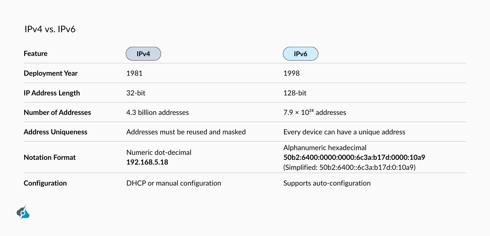 <a href="https://blog.servermania.com/ipv4-vs-ipv6" target="_blank" style="position: absolute; bottom: -8px; right: 4px; font-size: 12px;">[src]</a> 
 -->

<!-- - 
 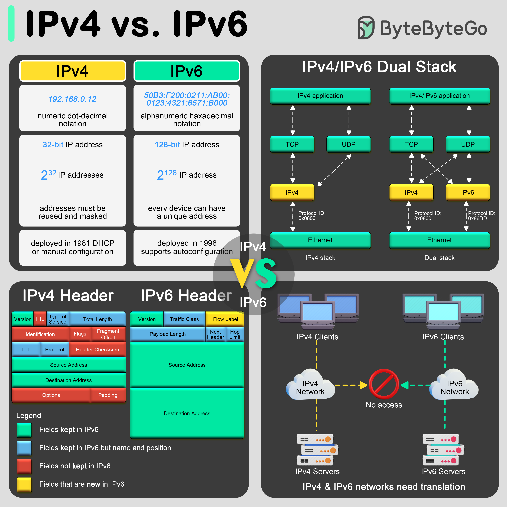 <a href="https://bytebytego.com/guides/ipv4-vs-ipv6/" target="_blank" style="position: absolute; bottom: -8px; right: 4px; font-size: 12px;">[src]</a> 
 -->

IPv4's $2^{32}$ addresses exhausted even under CIDR. [Address allocation for private internets (RFC 1918)]() reserves three non-routable ranges {10.0.0.0/8, 172.16.0.0/12, 192.168.0.0/16}, which [network address translation]() (NAT), specifically [port address translation]() (PAT), multiplexes behind one public IP by rewriting source ports, making them reusable across millions of networks but breaking end-to-end addressability. An address thus sits at one of three scopes, [loopback]() (127.0.0.0/8<!--, where 127 is the last Class A network reserved for self-referencing -->)<!-- jekyll/jupyter bind here by default; Docker containers have their own loopback (127.0.0.1 = container, not host), so Docker apps bind to 0.0.0.0 (all interfaces) and use host.docker.internal to reach the host --> $\to$ [private]() (a LAN) $\xrightarrow{\text{NAT}}$ public, and [IPv6]()'s $2^{128}$ space restores end-to-end reachability, largely retiring NAT as the dual-stack transition proceeds.
<!-- PAT analogy: an apartment building (public IP) has one street address; the front desk (router) uses unit numbers (ports) to route mail to residents (hosts). Unlike real units, port numbers are assigned dynamically per connection. -->

The same prefix that decides locality also drives delivery. Since a /$n$ prefix is an aligned block of $2^{32-n}$ addresses, any two prefixes are either disjoint or nested, so the [routing table]() entries containing a destination always form a chain and the [longest-prefix match](), the chain's most specific element, is well defined, with a default route (0.0.0.0/0) as the coarsest fallback. Routing protocols build that table. Within an [autonomous system]() (AS), one operator's network, [intradomain routing]() seeks shortest paths, [open shortest path first]() (OSPF) running [Dijkstra]() on a link-state map and [routing information protocol]() (RIP) exchanging distance vectors by [Bellman-Ford](). Between ASes, [interdomain routing]() by [border gateway protocol](https://en.wikipedia.org/wiki/Border_Gateway_Protocol) (BGP) advertises prefix reachability and picks paths by operator policy and AS-path length rather than distance, knitting the autonomous systems into one Internet. 

- 
 
  <a href="https://www.cisco.com/c/en/us/td/docs/ios/12_4t/ip_addr/configuration/guide/htaddrs.html" target="_blank" style="position: absolute; bottom: -8px; right: 4px; font-size: 12px;">[src]</a> 
 
PAT multiplexing private hosts behind one public address by source port.
 

### **2.2. TCP [L4]**

 

<!-- unreliable IP → connection (3WHS) → reliability (seq/ACK) → cost of reliability (flow/congestion) → application access (sockets) -->

Given that IP is not responsible for reliability, [transmission control protocol](https://ieeexplore.ieee.org/document/1092259) (TCP, RFC 675 1974; RFC 793 1981, now RFC 9293 2022) provides reliable, ordered, [byte-stream]() delivery over an unreliable packet-switched network. A TCP connection is identified by a 4-tuple (src IP, src port, dst IP, dst port), denoted IP:port (e.g. 127.0.0.1:8080), where [ports]() are 16-bit integers (0-1023 reserved) that multiplex a single IP to distinct processes. <!-- segment header (20-60 bytes) carries src/dst ports, 32-bit sequence and acknowledgement numbers, control flags, 16-bit window size, checksum, and variable-length options. Reusing the same 4-tuple after closing is called an incarnation. -->

Before any byte can be numbered both ends must agree where numbering starts, over a network that delays and duplicates, which is why connection establishment takes three messages and not two. In the [three-way handshake](https://en.wikipedia.org/wiki/Handshaking#TCP_three-way_handshake) (3WHS) the client sends [SYN]() with [initial sequence number]() (ISN) $x$, the server replies [SYN-ACK]() with ISN $y$ and ACK $x+1$, and the client completes with [ACK]() $y+1$, each side's ISN thus explicitly acknowledged, costing one [RTT](https://en.wikipedia.org/wiki/Round-trip_delay) before data transfer. Teardown uses a four-way FIN exchange. The same delayed-duplicate hazard outlives the connection, since a straggler segment from a closed connection could be taken for one from its successor on the same 4-tuple, so the closing side holds [TIME_WAIT]() for $2 \times$ [MSL]() (maximum segment lifetime), 240s under RFC 793's 120s MSL though Linux caps it at 60s. Each incarnation also begins from a distinct ISN, originally a 32-bit counter ticking every ~4µs (RFC 793), now a cryptographic hash (RFC 6528) that also resists off-path sequence prediction.

A connection is not yet reliable delivery, as IP beneath it may drop or reorder packets, and TCP reconstructs the ordered stream from [sequence numbers]() and [acknowledgements](), numbering each byte in the [stream]() so the receiver can return cumulative ACKs naming the next byte it expects. The sender holds a [sliding window]() of unacknowledged data and retransmits segments not acknowledged within the [retransmission timeout]() (RTO), but the right timeout cannot be fixed in advance when RTT varies by path and by congestion, so Jacobson's algorithm estimates it from smoothed RTT and its variance. Waiting out even a well-estimated timer is slow, and duplicate ACKs signal a loss earlier, so [fast retransmit]() resends on three duplicates for the same sequence number, cutting recovery from hundreds of milliseconds to roughly one RTT. A cumulative ACK still cannot say which later blocks arrived, forcing retransmission of data the receiver may already hold, and [selective acknowledgements]() (SACK, RFC 2018) close that last gap by reporting the received ranges so the sender resends only what is missing.

- 
 
 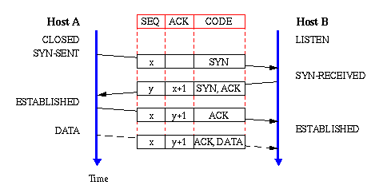 <a href="https://www.w3.org/People/Frystyk/thesis/TcpIp.html" target="_blank" style="position: absolute; bottom: -8px; right: 4px; font-size: 12px;">[src]</a> 
 
SYN, SYN-ACK, ACK, each side's ISN explicitly acknowledged.
 

Reliable delivery can still overwhelm its receiver or the network, two distinct problems with two distinct mechanisms. [Flow control](https://en.wikipedia.org/wiki/Flow_control_(data)) protects the *receiver* through a receiver-advertised window (rwnd), whereas [congestion control](https://en.wikipedia.org/wiki/TCP_congestion_control) protects the *network* through a congestion window (cwnd), and the sender transmits at $\min(\text{rwnd}, \text{cwnd})$, so the tighter constraint always governs throughput. The receiver can state its window outright, but the network cannot, so cwnd must be probed, a lesson learned from the 1986 internet congestion collapse and formalised by Van Jacobson in 1988. [Slow start]() initialises cwnd $= 1$ [maximum segment size]() (MSS, though modern stacks start at 10 per RFC 6928) and doubles it each RTT until threshold _ssthresh_, beyond which [congestion avoidance]() applies [additive increase/multiplicative decrease]() (AIMD), one MSS per RTT up and halving on loss. [CUBIC](https://en.wikipedia.org/wiki/CUBIC_TCP) (Linux default since 2006) replaces the linear increase with a cubic function $W(t) = C(t - K)^3 + W_{\max}$, recovering faster on high-bandwidth links, while [BBR](https://en.wikipedia.org/wiki/TCP_congestion_control#TCP_BBR) (Google, 2016) drops loss as the congestion signal altogether, since loss appears only after the bottleneck buffer has already filled and delay has already risen, instead estimating bottleneck bandwidth and minimum RTT and pacing packets to match capacity.



Progression:
  - §603#3.1: IPC (pipes, UDS) → local communication via fds
  - §603#3.3: everything is a file (fd)
  - §605#2.2: sockets = fd + (IP, port) → network communication via the same interface

\# UDS (local, §603#3.1)
sock = socket.socket(AF_UNIX, SOCK_STREAM)
sock.connect("/var/run/docker.sock")
sock.send(data)

\# TCP (network)
sock = socket.socket(AF_INET, SOCK_STREAM)
sock.connect(("host", 80))
sock.send(data)

\# UDP (network)
sock = socket.socket(AF_INET, SOCK_DGRAM)
sock.sendto(data, ("host", 53))



A [socket](https://www.youtube.com/watch?v=K9L9YZhEjC0&t=951s) (BSD 4.2, 1983) is a communication endpoint exposed as a file descriptor, created by specifying an [address family]() and a [socket type](). The address family determines what the socket is bound to: [AF_UNIX]() for a local filesystem path (§603#3.1, UDS), [AF_INET]() for an (IP, port) pair. The socket type determines the delivery semantics: [SOCK_STREAM]() for reliable byte streams (TCP), [SOCK_DGRAM]() for best-effort datagrams (UDP). BSD 4.2 unified local and network IPC under this single API, extending the fd interface (§603#3.3) from pipes and files to network endpoints, so the socket became the common gateway for both local IPC and network communication. Sockets are a [message-passing]() mechanism (§603#3.1) regardless of address family, as data is always copied through the kernel rather than shared directly. The application code is nearly identical in both cases; only the address struct differs, and the network stack transparently handles routing and reliability when the two processes happen to be on different machines.

A TCP server creates a socket, calls _bind()_ to attach it to a local (IP, port), then _listen()_ to mark it as a passive socket that accepts incoming connections. Each _accept()_ call blocks until a client connects via the three-way handshake, then returns a new connected fd for that client's 4-tuple, which is why §604#1.1's thread-per-connection model spawns one thread per _accept()_. Higher-level libraries (e.g. Python's _requests_) abstract this entirely, calling down through _urllib3_ → _socket_ module → [POSIX socket API]() → kernel TCP/IP stack.


Sockets are a kernel abstraction (implemented in net/ on Linux). Both AF_UNIX
and AF_INET share the same syscall API — socket(), bind(), connect(), send(),
recv(), close() — differing only in the address struct passed to bind/connect
(struct sockaddr_un for paths, struct sockaddr_in for IP:port). This is why
the same Python socket module works for both UDS and TCP.

AF_INET over loopback (127.0.0.1:port):
  Process A → socket → TCP → IP → loopback → IP → TCP → socket → Process B
                        ^^^^^^^^^^^^^^^^^^^^^^^^^^^^^^^^^^^^^^
                        full network stack, even though data never leaves the machine

AF_UNIX (/var/run/docker.sock):
  Process A → socket → kernel buffer → socket → Process B
                        ^^^^^^^^^^^^^^
                        direct copy, no protocol overhead

Same API, different address family, vastly different data path.


- 
 
 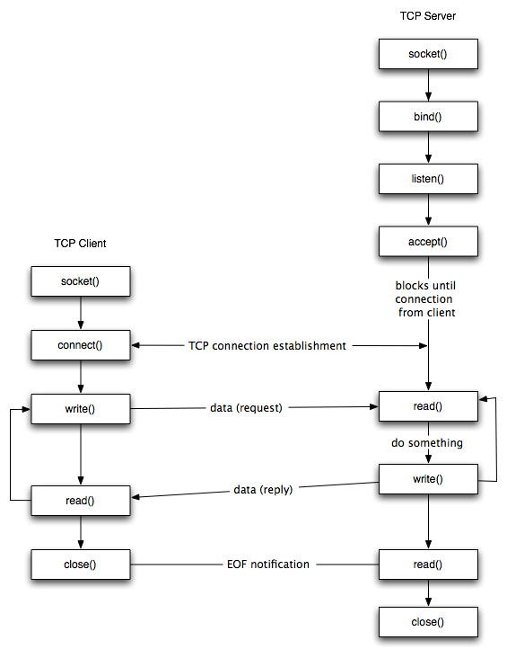 <a href="https://www.cs.dartmouth.edu/~campbell/cs50/socketprogramming.html" target="_blank" style="position: absolute; top: 4px; left: 4px; font-size: 12px;">[src]</a> 
 
The server's bind-listen-accept against the client's connect.
 

<!-- Network performance is characterised by [latency]() (single-packet traversal time) and [throughput]() (data volume per unit time). The [bandwidth-delay product](https://en.wikipedia.org/wiki/Bandwidth-delay_product) $\text{BDP} = \text{bandwidth} \times \text{RTT}$ represents the data in flight needed to fully utilise a link; for a 10 Gbps link with 10 ms RTT, $\text{BDP} = 12.5$ MB, meaning the TCP window must be at least this large. Socket buffer sizes (*SO_SNDBUF*, *SO_RCVBUF*) should match BDP for high-throughput transfers. Conversely, *TCP_NODELAY* disables [Nagle's algorithm](https://en.wikipedia.org/wiki/Nagle%27s_algorithm) (which coalesces small writes to amortise header overhead) and is essential for latency-sensitive protocols like SSH and RPC where each message should be sent immediately. -->

### **2.3. UDP [L4]**

 

Where TCP layers reliability, ordering, and flow control over IP, [user datagram protocol]() (RFC 768, 1980) keeps IP's best-effort, connectionless delivery and adds almost nothing but ports and a checksum. Its header is only 8 bytes (source port, destination port, length, checksum), compared to TCP's minimum 20-byte header, and there is no handshake, no acknowledgement, no retransmission, no ordering guarantee, and no flow or congestion control. This simplicity is a deliberate design choice for applications where the overhead of reliability exceeds the cost of occasional data loss. Like TCP, UDP is accessed through the socket API, using _SOCK\_DGRAM_ instead of _SOCK\_STREAM_.

Each canonical UDP application declines reliability for a different reason. DNS fits the typical request-response exchange in a single datagram, and the one RTT saved by skipping the three-way handshake matters for a service invoked before every HTTP connection. Real-time voice and video (VoIP, video conferencing) drop rather than retransmit, since an audio frame arriving 200 ms late is worse than a gap. Online games send state updates (player positions, actions) at 20-60 Hz where each supersedes the last, so a lost packet is repaired by the next one rather than by a retransmission. The application either tolerates loss, implements its own selective reliability on top of UDP, or treats the latest packet as the only one that matters.

Without built-in congestion control, a UDP application that sends at full rate regardless of network conditions risks contributing to [congestion collapse](), where the network is saturated with retransmissions and useful throughput approaches zero. Well-behaved UDP applications implement their own rate limiting or congestion-aware pacing. Packets exceeding the path MTU are fragmented at the IP layer in IPv4, and since losing any one fragment forces retransmitting the whole datagram, a UDP app keeps each message within the MTU, which is why DNS falls back to TCP when a UDP response is truncated, historically above 512 bytes though EDNS(0) permits up to 4096, with ~1232 the fragmentation-safe default since DNS Flag Day 2020.

- 
 
  <a href="https://skminhaj.wordpress.com/2016/02/15/tcp-segment-vs-udp-datagram-header-format/" target="_blank" style="position: absolute; bottom: -8px; right: 4px; font-size: 12px;">[src]</a> 
 
TCP's 20-byte header against UDP's 8.
 

## III
---

<!--
| Service | Purpose | Transport | Port |
|---------|---------|-----------|------|
| DNS | Name resolution | UDP/TCP | 53 |
| HTTP/S | Content transfer | TCP (QUIC/UDP for H3) | 80/443 |
| MCP | AI tool integration | HTTP/stdio | - |
| TLS | Encryption/authentication | TCP | 443 |
| SSH | Remote shell/tunnelling | TCP | 22 |
| SMTP | Email delivery | TCP | 25/587 |
| FTP | File transfer | TCP | 21 |
| DHCP | IP assignment | UDP | 67/68 |
-->

<!-- find it (DNS) → get it (HTTP) → secure it (TLS/SSH) → build on it (Services)
- 3.1 DNS: how names become addresses. the first step in any connection.
- 3.2 The Web: how the web came to exist. reach + linking → HTML/URL/HTTP → Gopher rival → PageRank.
- 3.3 HTTP: how content is transferred. request-response → statelessness → version evolution (1.0 → QUIC) → beyond request-response (SSE, WebSocket).
- 3.4 TLS/SSH: how it's all secured. TLS encrypts HTTP (HTTPS), certificate trust chain, forward secrecy. SSH for remote access with a different trust model (keys vs CAs). -->

<!-- With reliable transport (TCP) and best-effort datagrams (UDP) in place, application-layer protocols define *what* is communicated over *how* it is delivered. -->

### **3.1. DNS (+ CDN) [L7]**

 

<!-- P1: what DNS does and why → how resolution works (recursive resolver → root → TLD → authoritative) -->
<!-- P2: why DNS matters (precedes all connections) → record types beyond A → security (DNSSEC, DoH, DoT) -->
<!-- P3: CDN leverages DNS → CNAME to nearest PoP → cached responses → major providers -->

Transport carries bytes between numeric addresses, leaving the application layer to define what they mean, beginning with the service that turns a name into an address. [Domain name system (RFC 1035)]() (DNS, 1987) is a hierarchical, distributed system that resolves domain names to typed records, served conventionally over port 53. <!--since numeric addresses are neither memorable nor stable (servers change IPs, and one domain may resolve to many IPs for load balancing).-->A query such as _dig google.com A_ (or _nslookup_) triggers a [recursive resolver]() (e.g. ISP-provided) to resolve the domain proceeding through: i) 13 root server clusters identify the [top-level domain]() (TLD) where [anycast](https://www.cloudflare.com/ko-kr/learning/cdn/glossary/anycast-network/) routes a query to the nearest physical instance sharing the same IP; ii) the TLD server delegates to the domain's nameserver; and iii) the [authoritative nameserver]() provides an A record (IPv4). Each response carries a TTL governing how long resolvers may cache this.

[DNS record types]() extend beyond A records, including AAAA (IPv6), CNAME (alias), MX (email routing), TXT (domain verification), and SRV (service host, port, priority). In particular, CNAME records enable [content delivery networks]() (CDNs), where a domain's CNAME redirects resolution to the CDN's namespace and anycast returns the nearest [point of presence]() (PoP). Providers such as Cloudflare (~330 cities), Akamai (~4,100 PoPs), and CloudFront (~750 PoPs) operate using HTTP caching headers (*Cache-Control*, *ETag*) to govern freshness across them, while the PoP serves cached content directly and falls back to the origin on a cache miss. <!-- Large-scale providers like Google (Google Global Cache) and Netflix (Open Connect) build their own CDN infrastructure rather than paying third parties, since at their scale owning is cheaper than renting. -->


Client        Resolver         Auth NS        CDN NS        PoP       Origin
  |               |               |              |            |          |
  |- A query ---->|               |              |            |          |
  |               |- query ------>|              |            |          |
  |               |<- CNAME ------|              |            |          |
  |               |- follow CNAME -------------->|            |          |
  |               |<- PoP IP (anycast) ----------|            |          |
  |<- PoP IP -----|               |              |            |          |
  |                                                           |          |
  |------------------ GET /page ------------------------------>|          |
  |                                              cache hit → serve       |
  |                                              cache miss → fetch ---->|
  |<------------------ response --------------------------------|          |


Without encryption or signing, DNS is vulnerable to [cache poisoning](), in which an off-path attacker races the legitimate reply with a forged one and a resolver that accepts it serves the attacker's record for the TTL's duration. The 2008 [Kaminsky attack]() showed that the 16-bit query ID alone makes this race winnable within seconds, forcing resolvers to randomise source ports as a stopgap. [DNS security extensions]() (DNSSEC) address integrity, as each zone signs its records and the parent zone signs the child's key, forming a chain of signatures from the root that a resolver verifies before caching. [DoH]() (DNS over HTTPS) and [DoT]() (DNS over TLS) instead address confidentiality, encrypting the stub-to-resolver hop so an on-path observer cannot read or tamper with queries, though the resolver itself still sees every lookup.
- 
 
 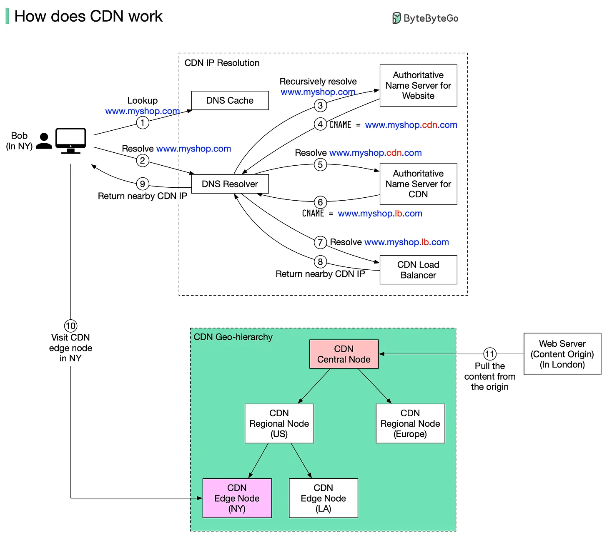 <a href="https://blog.bytebytego.com/p/how-does-cdn-work" target="_blank" style="position: absolute; bottom: -8px; right: 4px; font-size: 12px;">[src]</a> 
 
A CNAME handing resolution to the CDN, anycast picking the PoP.
 

### **3.2. The Web [L7]**

 

<!-- origin: two powers before the web (reach without links / links without reach) → Berners-Lee fuses them (HTML/URL/HTTP), web ≠ internet → Gopher rival, protocol vs document model (tree vs graph), HTML's two jobs (inline media, inline links) → consequence (HTTP momentum, then Google/PageRank as search over the link graph) -->

By 1989 the internet was two decades old, yet the two capabilities a web of documents would need still sat in separate systems, i) reach: crossing to a document on another machine; and ii) linking: an inline jump to another document. Reach existed without linking. [FTP]() (1971) and email over [SMTP]() (1982) moved documents across machines as flat files, no links. Linking existed without reach. It began with the Memex (1945) in [As We May Think]() <!-- Vannevar Bush's essay -->, a microfilm desk whose associative trails linked documents. Apple's HyperCard (1987) <!-- stacks of linked cards for interactive multimedia, databases, and applications --> made [hypertext](https://www.youtube.com/watch?v=hxHkNToXga8) <!-- term coined by Ted Nelson, 1965 --> mainstream, but its links never left one machine, unable to name documents elsewhere. No system held both.


The two axes, and why no pre-web system had both:

  axis A — reach:   can navigation cross to a document on ANOTHER machine?
  axis B — linking: are links embedded INSIDE the document (inline hypertext)?

                    NOT networked            networked
                    (local only)             (reaches other machines)
                 ┌───────────────────────┬───────────────────────┐
   in-document   │  HyperCard            │   THE WEB             │
   links (B)     │  (Memex, NLS)         │   HTML links + URL    │
                 ├───────────────────────┼───────────────────────┤
   no in-doc     │  a plain file,        │   Gopher, FTP, WAIS   │
   links (flat)  │  a book               │                       │
                 └───────────────────────┴───────────────────────┘

HyperCard and Gopher are DIAGONAL opposites, each holding exactly one axis:
  HyperCard = links but no reach (jumps stay on one machine)
  Gopher    = reach but no links (flat plain-text docs, links only in menus)
The Web is the only corner with BOTH — HyperCard's in-document links carried
over Gopher's networking, glued by the URL (a global address for every link).



"email over SMTP" — but modern webmail (Outlook, Gmail) is HTTP, so which is it?
BOTH, at different hops. SMTP is TRANSPORT (mail between servers); HTTP is ACCESS
(a human reaching the inbox). Alice (Outlook) emailing Bob (Gmail):

  ALICE'S SIDE                                     BOB'S SIDE

  ┌──────────┐                                   ┌──────────┐
  │  Alice   │                                   │   Bob    │
  │ (browser │                                   │ (browser │
  │  or app) │                                   │  or app) │
  └────┬─────┘                                   └────▲─────┘
       │  HTTPS                                 HTTPS │    ← ACCESS: how a
       │  (MAPI/HTTP, Graph,             (webmail, or │      human reaches
       │   or webmail)                      IMAP 993) │      the inbox
       ▼                                              │
  ┌──────────┐        SMTP (port 25)         ┌──────────┐
  │ Outlook/ │ ────────────────────────────▶ │  Gmail   │
  │ Exchange │   server-to-server delivery   │  server  │
  │  server  │   (THE EMAIL TRAVELS HERE)    │          │
  └──────────┘                               └──────────┘
   TRANSPORT: SMTP moves mail between systems, unchanged since 1982

Vertical hops = ACCESS (HTTP/IMAP), how a person reaches the mailbox.
Horizontal hop = TRANSPORT (SMTP), how the email crosses between systems.
You reach your inbox over HTTP, but your mail reaches Bob over SMTP.

  ┌─────────────────────────────────────────┬──────────────────────────┐
  │ hop                                     │ protocol                 │
  ├─────────────────────────────────────────┼──────────────────────────┤
  │ mail server → mail server (delivery)    │ SMTP (always, port 25)   │
  │ classic client sending                  │ SMTP submission (587)    │
  │ classic client receiving                │ IMAP (993) / POP3 (995)  │
  │ webmail in a browser                    │ HTTPS                    │
  │ Outlook desktop + Exchange/M365         │ MAPI over HTTP / Graph   │
  └─────────────────────────────────────────┴──────────────────────────┘


<!-- - 
 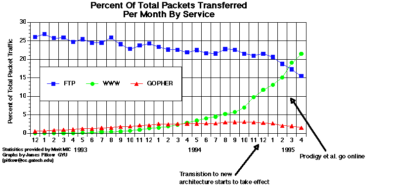 <a href="https://ils.unc.edu/callee/gopherpaper.htm" target="_blank" style="position: absolute; bottom: -8px; right: 4px; font-size: 12px;">[src]</a> 
 -->

At CERN, physicists on incompatible machines lost documents across unlinked systems. Tim Berners-Lee's 1989 memo [Information Management: A Proposal]() joined the two halves with three pieces, i) [hypertext markup language]() (HTML): a document format carrying inline links; ii) [uniform resource locators]() (URLs): one scheme naming any document on any host; and iii) [hypertext transfer protocol]() (HTTP): the protocol transferring it;<!-- CERN released the software into the public domain in 1993, so the web was free --> The result, the [world wide web]() (WWW, W3), is an $\text{L}7$ space of linked documents addressed by URL, one application over the internet, not the internet itself. So both are webs, the internet of networks and the web of documents.

While HTML structures a document into headings, paragraphs, and lists, its anchor element places a link anywhere in the running text. <!-- HTML was meant to be purely structural, so as the browser wars bolted presentation into it (, <blink>), styling split off into CSS (Håkon Wium Lie, 1994, at CERN) and behaviour into JS (Brendan Eich, Netscape, 1995), giving the structure/presentation/behaviour triad --> Any page can then reference any other on any host, forming a graph rather than a tree. The first browser to render it, [WorldWideWeb](https://www.w3.org/People/Berners-Lee/WorldWideWeb.html) editor (later renamed as Nexus) on a NeXT machine (1990), even displayed images inline, but only through the NeXT's own text system, so that ability stayed bound to the platform and was lost once the browser was ported to others. [Markdown]() (2004), a lighter markup language John Gruber designed, compiles to this same HTML while remaining readable as unrendered plain text. <!-- created with Aaron Swartz and released on Gruber's blog Daring Fireball -->

- 
 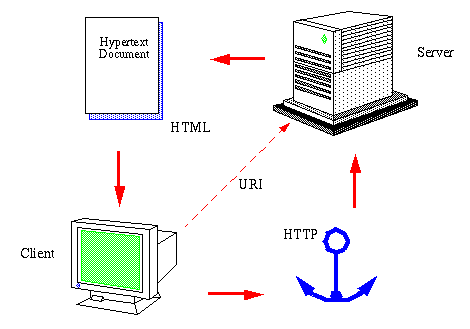 <a href="https://www.w3.org/People/Frystyk/thesis/WWW.html" target="_blank" style="position: absolute; bottom: 6px; right: 4px; font-size: 12px;">[src]</a> 
Basic W3 Model.
 

<!-- - 
 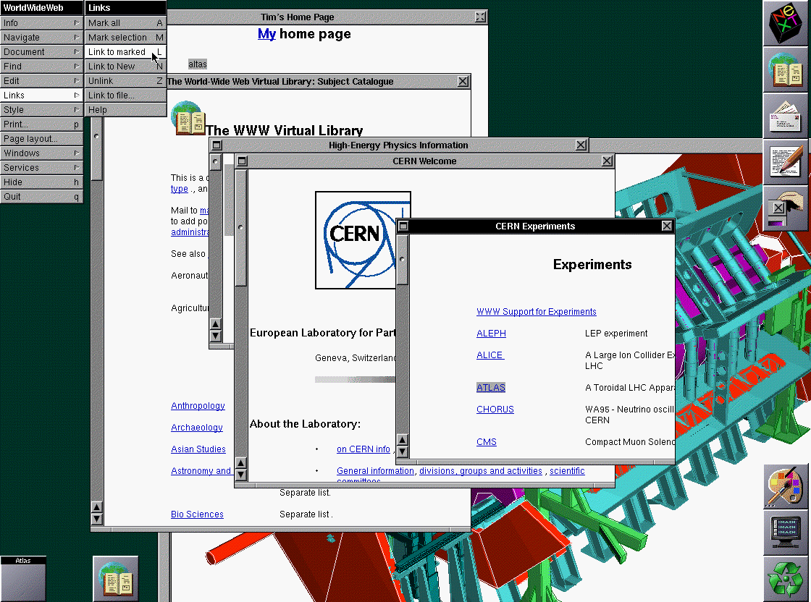 <a href="https://www.w3.org/People/Berners-Lee/WorldWideWeb.html" target="_blank" style="position: absolute; bottom: -8px; right: 4px; font-size: 12px;">[src]</a> 
Berners-Lee's original W3 browser-editor on the NeXT (1990).
 
 -->

<!-- - 
 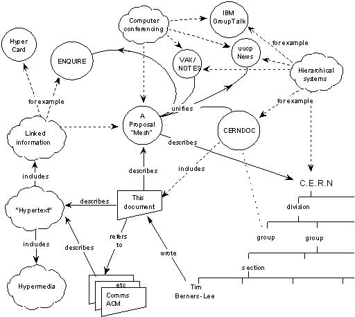 <a href="https://timeline.web.cern.ch/timeline-header/90" target="_blank" style="position: absolute; bottom: -8px; right: 4px; font-size: 12px;">[src]</a> 
The diagram from Berners-Lee's 1989 proposal, its central "Mesh" (his first name for the web) unifying the prior systems around it. The figure is itself a graph of labelled links, the structure it argues for.
 
 -->

A rival briefly looked likelier to win. [Gopher](https://www.youtube.com/watch?v=XT9i7tURutc) (1991, University of Minnesota) appeared just after the web, was likewise networked, and presented documents through nested menus, spreading faster for a year or two. The two differed not in protocol, since gopher and HTTP are near-twin request-response protocols, but in document model. Gopher stored documents as plain text and confined links to the menus, giving it the tree structure of a filesystem (§603#3.3) or code repository, navigated by drilling down and back up. Its native clients spoke only gopher://, never the web's http://.


Build & deploy workflow (what runs, what is created, local vs remote).

                 SOURCE  (_posts/*.md, _config.yml, assets/ … tracked in git)
                    │
        ┌───────────┴────────────┐
        │                        │  git push
        ▼                        ▼
  jekyll serve            GitHub Actions (jekyll build)
  (local, on save)        (remote, on push to main)
        │                        │
        ▼                        ▼
   _site/  (built)          _site/  (built on runner)
        │                        │
        ▼                        ▼
  localhost:4000          yongddeng.github.io
   (you preview)            (public site)

Both sides run the SAME build from the SAME source; neither _site/ is committed.

  | field          | Local               | Remote (GitHub)               |
  | --------------- | ------------------- | ----------------------------- |
  | what runs       | jekyll serve        | GitHub Actions → jekyll build |
  | triggered by    | file save (watch)   | git push to main              |
  | what's created  | _site/ on your disk | _site/ on runner → artifact   |
  | committed?      | no (.gitignore)     | no (artifact, not a commit)   |
  | served at       | localhost:4000      | yongddeng.github.io (Pages)   |
  | audience        | just you            | the public                    |



The "Uniform" in URL means it was built to address ANY protocol through its
scheme; native Gopher clients never showed a URL, using Gopher's own
host + port + selector addressing instead.

Why "Gopher"? Built at the University of Minnesota, the name is a triple pun:
  1. mascot  — U of M's Golden Gophers ("the Gopher State").
  2. go-fer  — a gofer who "goes for" things, i.e. fetches what you ask for.
  3. burrow  — gophers tunnel, matching the drill-down through nested menus.


- 
 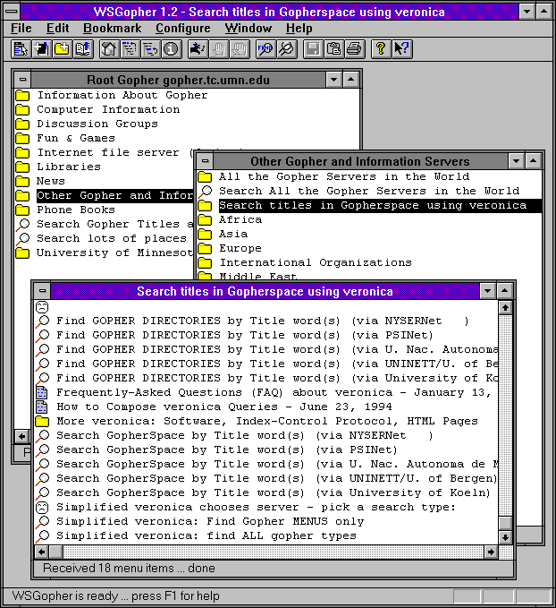 <a href="https://www.webdesignmuseum.org/web-design-history/veronica-search-engine-1992" target="_blank" style="position: absolute; bottom: -8px; right: 4px; font-size: 12px;">[src]</a> 
A Gopher client menu, its tree searchable by keyword through Veronica (1992), Gopher's index of menu titles across servers.
 

<!-- - 
 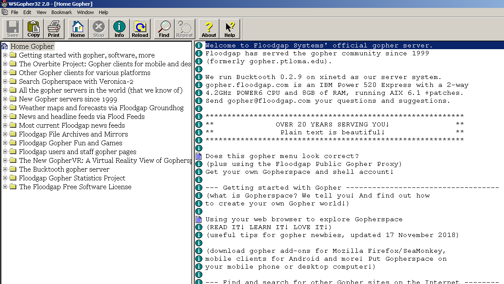 <a href="https://blog.somnolescent.net/2019/06/gopher-is-not-the-web/" target="_blank" style="position: absolute; bottom: -8px; right: 4px; font-size: 12px;">[src]</a> 
In a Gopher client the left pane drills down a menu tree like a filesystem, and each page on the right is plain text, with links living only in the menus.
 
 -->

<!-- - 
 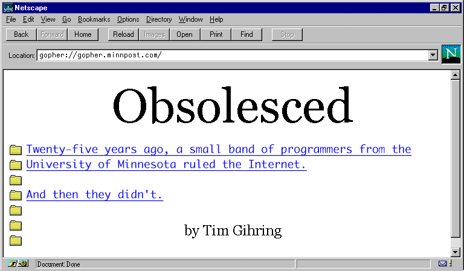 <a href="https://www.minnpost.com/business/2016/08/rise-and-fall-gopher-protocol/" target="_blank" style="position: absolute; bottom: -8px; right: 4px; font-size: 12px;">[src]</a> 
The Netscape web browser opening a gopher:// address, which renders like a web page yet is still the Gopher protocol underneath. Here MinnPost served its 2016 retrospective over Gopher itself.
 
 -->

The web soon overtook its rival on two fronts. In 1993 Minnesota's licensing fees drove adoption off Gopher while CERN placed the web in the public domain, and [Mosaic]() rendered inline images on commodity hardware, a medium richer than text-only Gopher that [Netscape]() (1994) carried to the mass market. Because a URL's scheme names the protocol, these browsers dispatched ftp://, mailto:, and gopher:// from one address bar, subsuming the rival rather than merely beating it. A fragment of Gopher endures there nonetheless, as Mark McCahill, one of its Minnesota creators, co-authored the URL specification (RFC 1738, 1994) and is credited with coining the term. <!-- the one-way subsumption behind the single universal browser we still use: Mosaic and Netscape rendered Gopher, FTP, and the web alike, so native single-protocol clients like WSGopher and TurboGopher became redundant -->

The same inline links soon became the web's retrieval problem. As the corpus grew to millions of documents, the constraint shifted from reaching a page to identifying the relevant one. Curated directories like [Yahoo]() and keyword engines like [AltaVista]() addressed this poorly, the former bounded by human editors, the latter gamed by repeating terms on a page. [Google]()'s [PageRank]() (1998) instead exploited the hyperlink graph, weighting each inbound link by the rank of its source, equivalently the stationary distribution of a random walk over it, made irreducible and aperiodic (hence ergodic with a unique stationary distribution, §212) by a damping term that teleports to a uniformly random page. The link an author placed for a reader thus doubled as the signal a machine ranked by, so one structure served both navigation and retrieval.

- 

    

      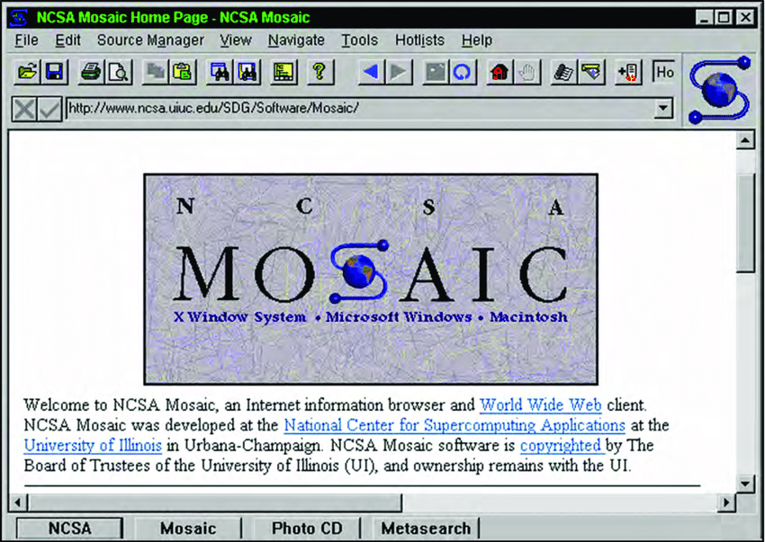
      <a href="https://webdirections.org/blog/years-of-transformation-1993-and-mosaic/" target="_blank" style="position: absolute; bottom: -8px; right: 4px; font-size: 12px;">[src]</a>
      
NCSA Mosaic (1993), the first popular browser to render HTML with inline images, not just text and links.

    

    

      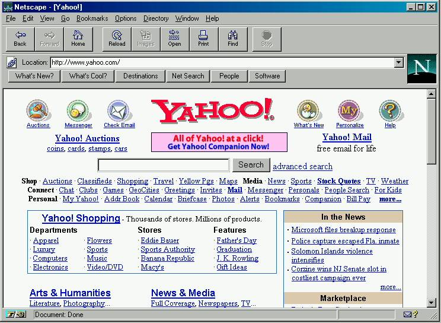
      <a href="https://www.donmouth.co.uk/web_design/browsermuseum/browsermuseum.html" target="_blank" style="position: absolute; bottom: -8px; right: 4px; font-size: 12px;">[src]</a>
      
Netscape Navigator (1994) showing Yahoo, the era's dominant browser opening the web's dominant portal.

    

  


Markdown → HTML (why this very file mixes three syntaxes). HTML is the real
format the browser renders (<h1>, <a>, 
, ). Markdown (John Gruber,
2004) is a lightweight plain-text syntax whose whole purpose is to be turned
into HTML by a processor, so it is not a dialect of HTML but compiles to it.

  ┌──────────────────────┬───────────────────────────┬────────────────────────────────┐
  │                      │ Markdown                  │ HTML                           │
  ├──────────────────────┼───────────────────────────┼────────────────────────────────┤
  │ heading              │ ## Networking             │ <h2>Networking</h2>            │
  │ link                 │ [Gopher](url)             │ <a href="url">Gopher</a>       │
  │ bold                 │ **bold**                  │ <strong>bold</strong>          │
  │ quote                │ > quote                   │ <blockquote>quote</blockquote> │
  │ readable unrendered? │ yes (Gruber's whole goal) │ cluttered with < >             │
  │ error-prone?         │ low                       │ easy to leave a tag unclosed   │
  └──────────────────────┴───────────────────────────┴────────────────────────────────┘

It is also a superset, raw HTML passes straight through, which is why the
figure blocks here are literal 
/.

The build turns this source file into a SEPARATE html file, replacing every
Markdown mark with its HTML, so the output .html contains no Markdown at all:

  _posts/2024-01-05-networking.md   (source you write)
        │
        ▼   Jekyll build (Liquid → kramdown → wrap in layout)
        │
  _site/20240105/networking.html    (generated output, per the permalink config)

  source (.md):
    ### **3.2. HTTP**
    [Gopher](https://youtu.be/…) appeared just after the web.

  generated (.html):
    <h3><strong>3.2. HTTP</strong></h3>
    
<a href="https://youtu.be/…">Gopher</a> appeared just after the web.

Both the Liquid comment tags and the <!-- --> HTML comments vanish from the
output at different stages, Liquid stripped first, HTML comments surviving
into the .html where the browser ignores them.


### **3.3. HTTP [L7]**

 

<!-- mechanics: message format (start line, headers, body) → headers as the extensibility surface → statelessness → cookies/tokens/status codes -->
<!-- evolution: versions 1.0 → 1.1 → 2 → 3, performance-driven; ossification forces QUIC onto UDP -->
<!-- beyond request-response: SSE (server push) → WebSocket (bidirectional) -->

An HTTP request opens in plain text with a start line naming the method, target URL, and protocol version, then header lines of key-value metadata and an optional body, and the response mirrors it with a status line, headers, and body. The target decomposes as scheme://host:port/path?query, its host resolved through DNS, a framing readable enough to inspect directly with _curl_ or _telnet_. Headers form the protocol's extensibility surface, the mandatory *Host* letting one IP serve many domains through [virtual hosting](), *Accept* and *Content-Type* driving [content negotiation]() over the representation and its media type (MIME, RFC 6838), and *Accept-Encoding* selecting compression (gzip, brotli). <!-- The body is framed by *Content-Length*, or by [chunked transfer-encoding]() when its length is unknown in advance. -->

HTTP is [stateless]() by design, the server retaining no memory between requests, so applications must carry state explicitly. [Cookies]() carry a session ID, while bearer tokens like a [JSON web token]() (JWT) ride the *Authorization* header, both threading client state. The session ID indexes server-side state, whereas a JWT carries signed claims inline, sparing the lookup but resisting revocation. [Status codes]() partition responses into five classes by the leading digit (1xx informational, 2xx success, 3xx redirection, 4xx client error, 5xx server error), of which 200, 301, 404, and 503 dominate debugging.

HTTP/1.0 (RFC 1945, 1996) opened a new TCP connection per request, wasting a round-trip. HTTP/1.1 (RFC 2068, 1997) added persistent connections and pipelining, but pipelined responses suffered [head-of-line blocking](), one slow response stalling those behind it, so browsers disabled pipelining and opened ~6 parallel connections per origin instead. HTTP/2 (RFC 7540, 2015) multiplexed streams over one TCP connection, yet a lone lost segment stalled every stream at once (transport-layer head-of-line blocking). HTTP/3 (RFC 9114, 2022) dissolved this with [QUIC](https://en.wikipedia.org/wiki/QUIC) (Google, 2012, standardised 2021 as RFC 9000), reimplementing TCP's reliability and TLS 1.3 encryption over UDP for 1-RTT establishment (0-RTT on resumption). The progression tracks [protocol ossification](), TCP so embedded in middleboxes that it proved immutable, forcing innovation onto UDP.

- 
 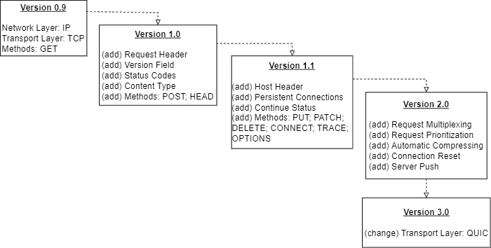 <a href="https://www.baeldung.com/cs/http-versions" target="_blank" style="position: absolute; top: 4px; right: 4px; font-size: 12px;">[src]</a> 

Applications sometimes require server-initiated data, but HTTP/1.x is strictly request-response, with the client initiating every exchange and only one in flight at a time per connection. [Long polling]() (~2006, Comet) simulated server push by holding requests open, wasting one TCP connection per pending event. [Server-sent events](https://en.wikipedia.org/wiki/Server-sent_events) (SSE, W3C 2015) solved it with persistent unidirectional streaming over a single HTTP connection (e.g. LLM token streaming, where tokens are generated sequentially but delivered in chunks due to I/O buffering). [WebSocket (RFC 6455)]() (2011), by contrast, uses an HTTP [Upgrade handshake]() to switch to a full-duplex protocol over TCP, which supports bidirectional use cases <!--such as chat and collaborative editing-->(e.g. Slack, Figma). <!-- SSE is simpler (plain HTTP, automatic reconnection, works through proxies) while WebSocket suits real-time bidirectional use cases like chat and collaborative editing. -->

- 
 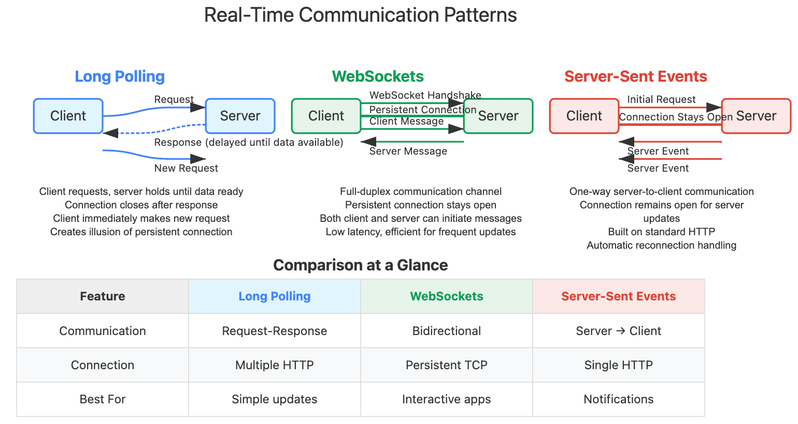 <a href="https://systemdr.systemdrd.com/p/web-sockets-vs-long-polling-vs-server" target="_blank" style="position: absolute; bottom: -8px; right: 4px; font-size: 12px;">[src]</a> 

### **3.4. HTTPS [L7]**

 

<!-- plaintext HTTP is exposed → TLS secures it (HTTPS = HTTP + TLS) → how trust is established → what if keys leak -->
<!-- P1: HTTP is plaintext → TLS (from SSL) provides encryption/authentication/integrity → HTTPS = HTTP + TLS → TLS 1.3 handshake → 0-RTT -->
<!-- P2: certificate chain of trust → hostname validation → forward secrecy via ephemeral keys → TLS 1.3 removes static RSA -->

HTTP transmits plaintext, exposing traffic to any observer on the path. [Transport layer security](https://en.wikipedia.org/wiki/Transport_Layer_Security) (TLS), evolved from Netscape's [Secure Sockets Layer]() (SSL, 1995, now obsolete), provides confidentiality, authentication, and integrity over TCP, and [HTTPS]() is simply HTTP spoken inside a TLS tunnel (i.e. port 443), though TLS also secures other protocols such as SMTP, database connections, and gRPC. In TLS 1.3 (RFC 8446, 2018), the client and server exchange [cipher suite]() preferences and [ECDHE]() key shares in a single round-trip, deriving a shared secret and verifying the server's identity via its [X.509 certificate](https://en.wikipedia.org/wiki/X.509). Resumed connections support [0-RTT]() by reusing a cached pre-shared key, trading replay vulnerability for zero-latency establishment.

Encryption alone would still leave an impostor holding the other end, so the server's identity rests on a [certificate chain of trust](), where the server presents a certificate signed by an [intermediate CA]() (Certificate Authority), itself signed by a [root CA]() pre-installed in the client's trust store. The client validates each signature and checks the hostname against the certificate's names. Trust so anchored is only as durable as the key it names, which is why TLS further achieves [forward secrecy]() through ephemeral key exchange, each session generating a unique Diffie-Hellman key pair discarded after the handshake, so a compromised long-term key cannot decrypt past traffic, and why TLS 1.3 mandates ephemeral exchange and removes static RSA.

What binds the certificate to the live session is the handshake itself, as the server signs a transcript of the handshake messages with the certificate's private key (i.e. [CertificateVerify]()), so a stolen certificate without its key cannot impersonate the server, and the derived secret then authenticates every subsequent record. Validation failures are correspondingly the common operational errors, where _SSL: CERTIFICATE\_VERIFY\_FAILED_ or _ERR\_CERT\_AUTHORITY\_INVALID_ typically indicates an expired certificate, a hostname mismatch, or a missing intermediate, and _curl -v_ or _openssl s\_client_ reveals the full handshake for debugging. Issuance itself is automated by [ACME]() (RFC 8555), the protocol behind [Let's Encrypt](https://letsencrypt.org/), which proves domain control through an HTTP or DNS challenge and issues short-lived 90-day certificates that a daemon renews, making HTTPS the default rather than a purchased add-on.

<!-- - 
 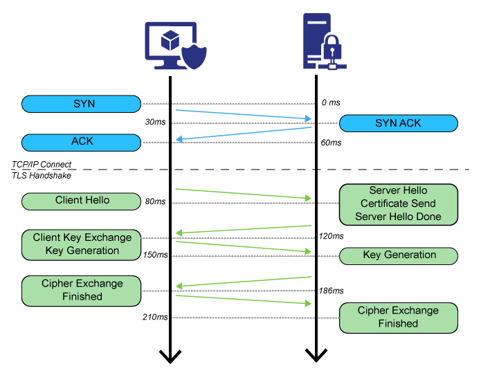 <a href="https://www.exoprise.com/2019/07/29/monitor-ssl-expiration-spoofing-changes/" target="_blank" style="position: absolute; bottom: -8px; right: 4px; font-size: 12px;">[src]</a> 
 -->

<!-- TODO: move SSH to 407 (operator access to remote infrastructure)
SSH (Secure Shell) provides encrypted remote shell access and secure tunnelling, using a similar cryptographic foundation to TLS but with a different trust model. Rather than certificate authorities, SSH uses public key authentication where the client proves possession of a private key corresponding to a public key stored in the server's ~/.ssh/authorized_keys. SSH tunnels (-L for local forwarding, -R for remote forwarding, -D for dynamic SOCKS proxy) create encrypted channels through which arbitrary TCP traffic can be forwarded, enabling access to services behind firewalls or NAT. Agent forwarding allows credentials to pass through intermediate bastion hosts (hardened jump servers that serve as the single entry point to private networks) without copying private keys to untrusted machines. -->

## IV
---

### **4.1. Application Programming Interface**

 


Arc: one contract, its format half settled here, its style half handed to 4.2-4.4.
  p1: the contract — API defined, trivial in-process, the boundary splits it into format and style
  p2: serialisation — pointers are process-local, the channel carries bytes, text's two steps vs binary's one, L6
  p3: formats — legibility vs density, schema'd vs schemaless, YAML ruled off the wire
  p4: change — compatibility kept by additive schema evolution, versioning only for the incompatible remainder
  p5: handoff — style graded by coupling, set by who the ends are, not by the calendar


The [application programming interface]() (API) is the contract by which one program exposes its operations to another. Within a single process it is no more than a shared function signature<!-- locally a printf the linker binds into one address space, its binary-level counterpart the ABI, §602#2.1; no wire format needed -->. A networked service instead stretches the contract across a process or machine boundary, where the stack delivers the payload intact but never interprets it, leaving what its bytes mean for the two endpoint programs to settle. That agreement runs along two axes. i) format: the data's encoding, replaceable without redesign, hence interchangeable; and ii) style: the operations and their semantics, pinned in both ends in advance, and so architecturally decisive. <!-- trim: two axes graded by coupling, the prior agreement the two ends must share before they interact (coupling moved to the style handoff); which either side may swap unannounced -->


"API" is any software-to-software contract, at ANY scale. Only the last row is networked — that is what §4.2 covers. "Agree on what the bytes denote" already scopes it, since bytes ⇒ serialised ⇒ a boundary was crossed.

  sense              | boundary crossed        | example                     | serialised?
  -------------------+-------------------------+-----------------------------+------------------------------
  library / function | none (in-process)       | numpy.mean(), libc, methods | no — live objects, shared mem
  syscall            | process ↔ kernel        | POSIX read(), socket()      | no (register/pointer handoff)
  IPC                | process ↔ process, host | UDS, pipes (§603#3.1)       | yes, but no network
  network (L7)       | host ↔ host             | REST, GraphQL, gRPC, MCP    | yes, over the wire

The dividing line is SERIALISATION. Locally the two ends share memory, so the "style" is just a function signature and there is no "format" at all. Crossing a process/machine boundary forces encoding on the wire — which is why format + style
appear only here. gRPC's stub then tries to make the network call read as local again (marshals args, hides transport), i.e. the tightest coupling is the one that most impersonates a local library call.


The format axis begins a step below the formats, at [serialisation](), the flattening of an object into self-contained bytes. It is needed because a heap object (e.g. a C struct, a Python dict) is a web of pointers, each a virtual address only its process's page tables translate (§603#3.2). No other host holds the mapping, nor does the channel carry a heap but only flat bytes. <!-- trim: a flat byte sequence, not a heap; the sender thus flattens its object --> Therefore, a text format flattens in two steps, ($\Rightarrow$) the sender serialising the object to text $\to$ [encoding]() it as [8-bit unicode transformation format]() (UTF-8) bytes, ($\Leftarrow$) the receiver [decoding]() $\to$ deserialising, whereas a binary format writes each field to bytes directly. <!-- trim: The bytes read identically whatever the two ends' language or [endianness]() (§601#1.2); canonical and platform-neutral --> This encoding, not delivery, is OSI's presentation layer ($\text{L}6$)<!-- trim: folded into the application by TCP/IP --><!-- each message is framed by a length prefix or delimiter marking its end, the byte stream having no boundaries of its own; meaning is fixed once at the top, then carried down by encapsulation (§1.2), each layer the opaque payload of the one below and unwrapped in reverse -->.

The formats atop it trade legibility for density. Text formats such as [JavaScript object notation]() (JSON) and [extensible markup language](https://namu.wiki/w/XML) (XML) stay human-readable and self-describing but verbose and slow to parse. YAML, a superset of JSON, earns the config and spec role<!-- trim: OpenAPI included --> by comments and indentation, and loses the wire to significant whitespace and unsafe deserialisation. Binary formats such as protobuf<!--, Avro, and MessagePack--> are denser and faster yet opaque. A format may further carry a [schema](), one definition both ends hold and validate against. The trade is flexibility for machine-checked agreement, since a breaking message fails at the boundary, where schemaless ends would misread it. <!-- trim: REST's schemaless JSON against gRPC's schema-bound protobuf, moved into the styles table --><!-- trim: the coupling the styles trade on -->


Why the boundary forces serialisation (the cross-cutting lesson):

- pointers are process-local — an object is a graph of ADDRESSES into this process's
  virtual address space; another process or host cannot dereference them.
- no shared memory across the boundary, so VALUES (not references) are copied out.
- the channel (TCP, pipe, file) carries a flat byte STREAM, never a heap graph.
- heterogeneous ends (language, endianness, word size, padding, float rep) need a
  canonical, platform-neutral encoding + framing (length prefix / delimiter).

Absent locally (shared memory); paid on every REST / gRPC / MCP exchange, stdio included. Cross-refs: §603#3.1 (IPC — UDS, pipes), §2.2 (sockets = fd + IP:port), §4.1 (format/style split, above).

Two steps, not one: json.dumps builds the TEXT document (structure + values),
.encode("utf-8") turns that text into BYTES. Together = full serialisation.

  out:  dict  --json.dumps()-->  str  --.encode("utf-8")-->  bytes  --> write
                └ serialise ┘          └ char-encode ┘
  in:   bytes --.decode("utf-8")--> str --json.loads()--> dict
              └ char-decode ┘          └ deserialise ┘

Shortcut: json.dump(obj, open("f.json","w")) / json.load(open("f.json")) hide the
UTF-8 step, since a text-mode file object encodes/decodes for you (Python default =
UTF-8). Open "rb" and you handle bytes -> decode yourself again.

Binary formats (protobuf) skip the whole-document text step: numbers written in
binary (defined byte order), only string FIELDS UTF-8'd, one at a time.


Note that the format fixes not just how bytes read, but also how they may change - the harder half once clients are live. They must stay backward-compatible (i.e. an old client understood by a new server) and forward-compatible (i.e. a new client tolerated by an old server), both kept by additive schema evolution, where an old field is never removed or repurposed. Only when a change cannot stay compatible is the API versioned, by URL (e.g. /v2/), header, or media type. For instance, [Stripe](https://stripe.com/blog/api-versioning) pins a version per account and threads old requests via compatibility shims, thus one code-base serves a decade of clients. [Google's AIP](https://google.aip.dev/) also forbids breaking change within a major version. 

<!-- - 
 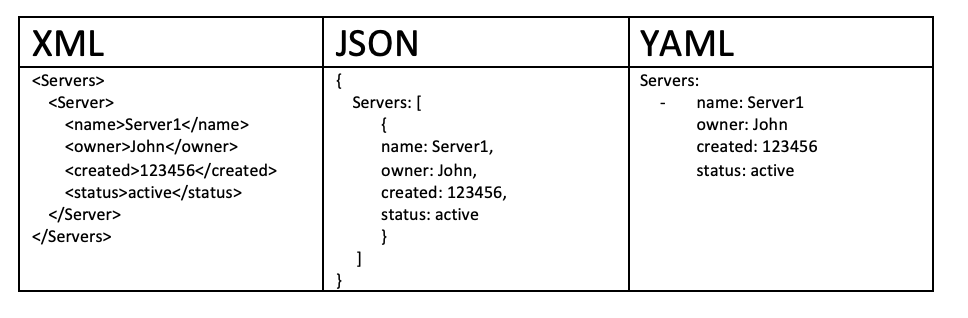 <a href="https://wiserli.com/blogs/optimizing-generation-process-with-large-language-models-for-specific-formats/" target="_blank" style="position: absolute; bottom: -10px; right: 4px; font-size: 12px;">[src]</a> 
 -->

- 

  <table>
    <tr style="background-color: #eef2f7; font-family: sans-serif; font-size: 10px;"><th>XML</th><th>JSON</th><th>YAML</th></tr>
    <tr style="vertical-align: top; font-family: monospace; white-space: nowrap;"><td style="padding: 3px 16px 3px 8px;">&lt;servers&gt; &nbsp;&nbsp;&lt;server&gt; &nbsp;&nbsp;&nbsp;&nbsp;&lt;name&gt;Server1&lt;/name&gt; &nbsp;&nbsp;&nbsp;&nbsp;&lt;owner&gt;John&lt;/owner&gt; &nbsp;&nbsp;&nbsp;&nbsp;&lt;created&gt;123456&lt;/created&gt; &nbsp;&nbsp;&nbsp;&nbsp;&lt;status&gt;active&lt;/status&gt; &nbsp;&nbsp;&lt;/server&gt; &lt;/servers&gt;</td><td style="padding: 3px 16px 3px 8px;">{ &nbsp;&nbsp;"servers": [ &nbsp;&nbsp;&nbsp;&nbsp;{ &nbsp;&nbsp;&nbsp;&nbsp;&nbsp;&nbsp;"name": "Server1", &nbsp;&nbsp;&nbsp;&nbsp;&nbsp;&nbsp;"owner": "John", &nbsp;&nbsp;&nbsp;&nbsp;&nbsp;&nbsp;"created": 123456, &nbsp;&nbsp;&nbsp;&nbsp;&nbsp;&nbsp;"status": "active" &nbsp;&nbsp;&nbsp;&nbsp;} &nbsp;&nbsp;] }</td><td style="padding: 3px 16px 3px 8px;">servers: &nbsp;&nbsp;- name: Server1 &nbsp;&nbsp;&nbsp;&nbsp;owner: John &nbsp;&nbsp;&nbsp;&nbsp;created: 123456 &nbsp;&nbsp;&nbsp;&nbsp;status: active</td></tr>
  </table>
  

  
The same record in three text formats.

<!-- - 
 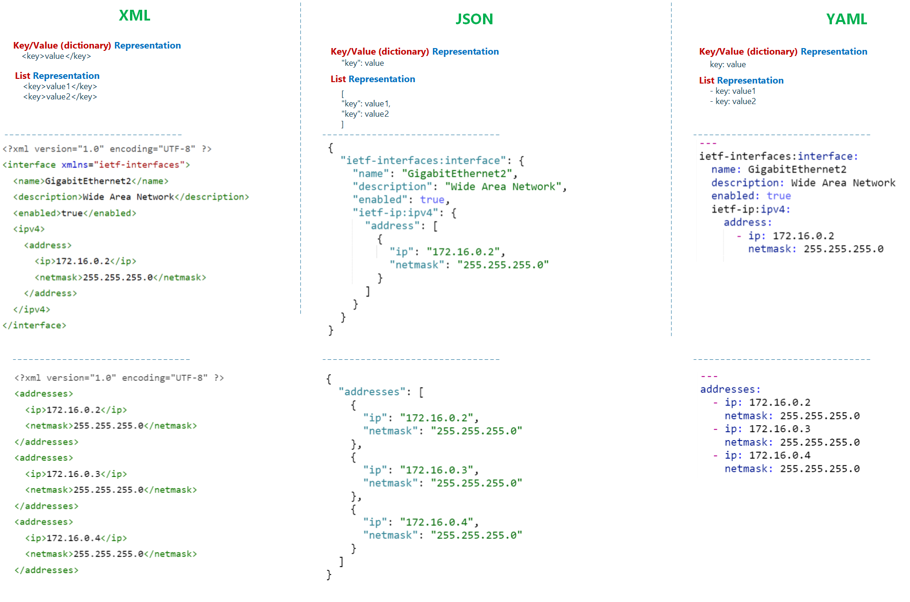 <a href="https://rayka-co.com/lesson/compare-xml-json-yaml/" target="_blank" style="position: absolute; bottom: -8px; right: 4px; font-size: 12px;">[src]</a> 
 -->

Beyond format lies style, the axis to which the remaining sections turn. Styles are graded by coupling, the prior agreement the two ends must share before they interact. Who the ends are decides how much agreement is affordable, since an unknown public client the server cannot redeploy forces the loosest contract while two co-deployed services afford the tightest. The grading does not track the calendar, with the tight procedure contracts of RPC and the [simple object access protocol]() (SOAP) coming first, REST loosening to inherit the web, and GraphQL and gRPC drawing the contract back as relationships narrowed. Each style is the contract its relationship makes possible.


§IV: 4.1 the API contract (definition, serialisation, evolution), 4.2 REST, 4.3 GraphQL, 4.4 RPC (JSON-RPC → gRPC, LSP → MCP).
More refs: protobuf schema-update rules (protobuf.dev), Avro schema resolution; Google
AIP-180 "Backwards compatibility"; Microsoft REST API Guidelines (versioning).


- 

  <table style="table-layout: fixed; width: 100%;">
    <tr style="font-family: sans-serif; font-size: 11px; text-align: center;"><td style="width: 66px;"></td><td style="padding: 2px 4px;">
<b>RPC</b> (1984)
</td><td style="padding: 2px 4px;">
<b>SOAP</b> (1999)
</td><td style="padding: 2px 4px;">
<b>REST</b> (2000)
</td><td style="padding: 2px 4px;">
<b>GraphQL</b> (2012)
</td></tr>
    <tr><td><b>Abstraction</b></td><td>procedure call</td><td>RPC envelope</td><td>resource</td><td>query language</td></tr>
    <tr><td><b>Pre-agreed</b></td><td>method to typed contract</td><td>WSDL contract</td><td>HTTP alone (loosest)</td><td>shared schema</td></tr>
    <tr><td><b>Protocol (L7)</b></td><td>HTTP or HTTP/2</td><td>any transport (SMTP, MQ&hellip;), one HTTP POST</td><td>HTTP</td><td>HTTP, one POST</td></tr>
    <tr><td><b>Format</b></td><td>schemaless JSON or schema-bound protobuf</td><td>XML envelope</td><td>any media type (text, XML, image&hellip;), JSON won</td><td>JSON</td></tr>
    <tr style="vertical-align: top; font-family: monospace; background-color: #fbfcfe;">
      <td style="font-family: inherit; border-top: 2px dashed #aaa; border-bottom: 2px dashed #aaa;"><b>Example</b></td>
      <td style="padding: 6px 4px; border-top: 2px dashed #aaa; border-bottom: 2px dashed #aaa;">&darr; stub.GetOrder(id=42)  &uarr; Order { status, &nbsp;&nbsp;&nbsp;&nbsp;customer { name } }</td>
      <td style="padding: 6px 4px; border-top: 2px dashed #aaa; border-bottom: 2px dashed #aaa;">&darr; POST /services &nbsp;&nbsp;&lt;soap:Envelope&gt;&lt;soap:Body&gt; &nbsp;&nbsp;&nbsp;&nbsp;&lt;getOrder&gt; &nbsp;&nbsp;&nbsp;&nbsp;&nbsp;&nbsp;&lt;id&gt;42&lt;/id&gt; &nbsp;&nbsp;&nbsp;&nbsp;&lt;/getOrder&gt; &nbsp;&nbsp;&lt;/soap:Body&gt;&lt;/soap:Envelope&gt;  &uarr; &lt;getOrderResponse&gt; &nbsp;&nbsp;&nbsp;&nbsp;&lt;status&gt;open&lt;/status&gt; &nbsp;&nbsp;&nbsp;&nbsp;&lt;customerName&gt;&hellip;&lt;/customerName&gt; &nbsp;&nbsp;&lt;/getOrderResponse&gt;</td>
      <td style="padding: 6px 4px; border-top: 2px dashed #aaa; border-bottom: 2px dashed #aaa;">&darr; GET /orders/42 &uarr; { "id": 42, &nbsp;&nbsp;&nbsp;&nbsp;"status": "open", &nbsp;&nbsp;&nbsp;&nbsp;"customer_id": 7, &nbsp;&nbsp;&nbsp;&nbsp;"total": &hellip; }  &darr; GET /customers/7 &uarr; { "name": &hellip;, &hellip; }</td>
      <td style="padding: 6px 4px; border-top: 2px dashed #aaa; border-bottom: 2px dashed #aaa;">&darr; POST /graphql &nbsp;&nbsp;{ order(id: 42) { &nbsp;&nbsp;&nbsp;&nbsp;&nbsp;&nbsp;status &nbsp;&nbsp;&nbsp;&nbsp;&nbsp;&nbsp;customer { name } } }  &uarr; { "data": { "order": { &nbsp;&nbsp;&nbsp;&nbsp;"status": "open", &nbsp;&nbsp;&nbsp;&nbsp;"customer": {"name": &hellip;} &nbsp;&nbsp;} } }</td>
    </tr>
    <tr><td><b>HTTP caching</b></td><td>&mdash;</td><td>lost (opaque POST)</td><td>per-URL, free</td><td>lost (one POST)</td></tr>
    <tr><td><b>Errors</b></td><td>error object or trailer</td><td>SOAP Fault in body</td><td>HTTP status codes</td><td>200 OK, errors[] in body</td></tr>
    <tr><td><b>Best for</b></td><td>service-to-service, ML serving</td><td>legacy, regulated systems (WS-*)</td><td>public web APIs</td><td>tailored client data</td></tr>
  </table>
  

  
All four default to synchronous request-response;<!-- the client blocks for its reply; the asynchronous, event-driven alternative, a message broker such as Kafka or AMQP decoupling sender from receiver in time, is a separate paradigm set aside here --> the example row reads order 42 and its customer's name in each style.

### **4.2. REST**

 


Arc: the loosest style — where it came from, how it is used, what it formally is.
  p1: origin — Fielding describes the running web; generality, loosest coupling
  p2: victory — with HTTP's grain vs SOAP/XML-RPC against it; JSON beats XML
  p3: vocabulary — resource, representation, verbs graded by guarantee
  p4: collections — pagination, offset against cursor
  p5: limitations — the six constraints beneath the practice; HATEOAS, the dropped clause


Roy Fielding, a co-author of HTTP/1.0 alongside Berners-Lee, shaped both HTTP/1.1 and the [uniform resource identifier]() (URI) syntax (e.g. _scheme://host/path?query_)<!-- edited 1.1, helped specify the URI syntax -->. There he observed that the web, where one HTTP request hands a document to a browser or data to a program, already behaves as an API. His 2000 dissertation distilled the observation into a model named [representational state transfer](https://roy.gbiv.com/pubs/dissertation/fielding_dissertation.pdf) (REST). Machinery built for documents extends unchanged to any resource a program names and serves an order or a user as readily as a page, yet the two ends share nothing bespoke beyond HTTP's generic contract<!-- generic = the uniform interface every REST service shares (verbs, status codes, media types); bespoke = a per-service schema or URIs, which the tighter styles compile into both ends in advance --> and couple as loosely as the web itself.

At the outset, a relatively minimal contract seemed an improbable victor over richer rivals, even so it won with the web's grain where the rivals cut against it<!-- trim: the edge, a contest rather than a coronation -->. SOAP and [XML-RPC]() (1998) rode HTTP as a pipe and buried each call in an opaque XML POST no intermediary can read. REST instead named the target in the URL and the effect in the verb, hence any cache or proxy could serve a repeat by method and URL alone. The same divide told in the formats. Browser-native JSON<!-- drawn from JavaScript's object literals, parsed without an XML DOM; carried to dominance by AJAX (asynchronous JavaScript and XML), which despite its name came to carry JSON not XML --> proved lighter than XML, whose markup heft descends from the [standard generalised markup language]() (SGML) roots shared with HTML. REST rode the winner while SOAP kept its envelopes.

Practically, the contract reduces to a brief vocabulary. Anything nameable is a [resource]() identified by a URI such that the server returns only a [representation]() of its state. A client acts on the HTTP verbs, {create: POST, read: GET, update: PUT, delete: DELETE}<!-- plus PATCH (RFC 5789), a partial update where PUT replaces whole, holding neither guarantee like POST -->. The verbs differ in guarantee. For instance, one has {GET} ⊂ {GET, PUT, DELETE}, as [safety]() (i.e. state unchanged) implies [idempotence]() (i.e. twice equals once, $f(f(x)) = f(x)$). Unlike a safe verb whose repeat changes nothing, POST holds neither and its repeat duplicates unless an idempotency key collapses it onto the first<!-- a client-generated token the server records so a retried call collapses onto the first; Stripe's pattern, letting a client safely retry a payment POST over a flaky link -->. The wire carries no schema and [OpenAPI]() (i.e. Swagger UI) recovers one out of band for docs<!-- trim: validation --><!-- and client/server stubs; Swagger UI renders that document into the interactive docs page (endpoint list, expandable schemas, Try-it-out); "Swagger" was the spec's pre-2015 name, renamed OpenAPI on donation to the Linux Foundation, the old name kept by the tooling (Swagger UI, Editor, Codegen, SmartBear) -->.

<!-- - 
 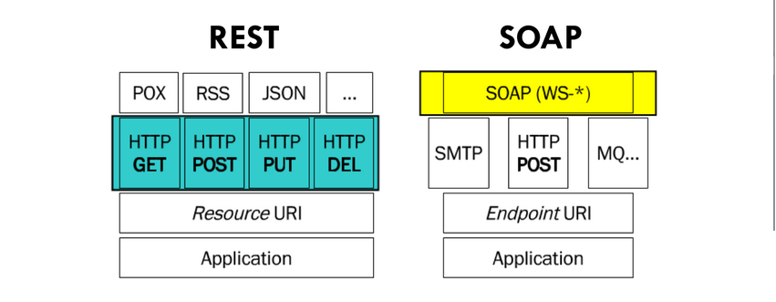 <a href="https://www.linkedin.com/pulse/soap-vs-rest-all-you-need-toknow-luis-soares-m-sc-" target="_blank" style="position: absolute; bottom: -8px; right: 4px; font-size: 12px;">[src]</a> 
 -->


URI vs URL — URI is the superset; a URL is a URI that also says how to LOCATE the resource.

              URI  (identifier)
             /        \
          URL          URN
      (by location)  (by name)
   https://…/page   urn:isbn:0131103628
   mailto:a@b.com

- URL (locator): the scheme implies an access mechanism (http, ftp, mailto) plus where
  to reach it. Every URL is a URI.
- URN (name): a persistent name independent of location (urn:isbn:…). A URN is a URI
  but not a URL.

So URL ⊂ URI and URN ⊂ URI, with URL and URN disjoint. A bare URI need not be
dereferenceable: //example.com/page locates nothing on its own.

Modern usage has collapsed the distinction — the WHATWG URL Standard (what browsers
implement) just calls everything a URL. The URL/URI/URN taxonomy is the RFC 3986 formal model, which is why 3.2 used URL (concrete web addressing) while REST here uses URI (the general term for a resource identifier).

URI SYNTAX (RFC 2396, 1998; RFC 3986, 2005) — the generic grammar every URI follows,
independent of scheme. This is what Fielding co-authored.

  URI = scheme ":" ["//" authority] path ["?" query] ["#" fragment]

           scheme    authority              path        query     fragment
            ┌─┴─┐  ┌───────┴────────┐  ┌──────┴─────┐   ┌──┴──┐    ┌──┴──┐
     https://user@example.com:443  /path/to/page   ?  q=1&n=2  #  section
            └──┬─┘└────┬────┘└┬─┘
            userinfo   host   port

- reserved chars (/ ? # [ ] @ : structurally meaningful) vs unreserved (A-Z a-z 0-9 - . _ ~)
- percent-encoding escapes the rest (%20 = space, %2F = a literal /)
- relative references resolve against a base (../page)

It is a SYNTAX, not a protocol: it fixes the SHAPE of an identifier, not how to fetch it,
so a parser splits https://example.com/x?y#z into its five parts without knowing HTTP.
That scheme-independent grammar is what lets one address bar hold http:, ftp:, mailto:,
and urn: alike, and why URL and URN are just two usages of the one URI syntax.


A resource need not be singular. A [collection]() gathers many under one URI (e.g. _GET /orders_ returns a list), thus it is unbounded, and the server leverages [pagination]() such that each reply carries one page whose edge is fixed by position or value. An [offset]() simply counts rows to skip<!-- trim: the simplest choice yet flawed twice -->. The database re-scans the skipped prefix at $O(N)$ for every page. An offset also names no row, so concurrent writes shift every later row and records repeat or vanish<!-- trim: between pages; the count drifts -->. A [cursor]() instead fixes the edge by the last-seen value of the sort key and resumes past it through an index at $O(\log N)$, immune to that drift at the cost of forbidding jumps to an arbitrary page and demanding a unique ordering<!-- trim: to break ties -->. <!-- trim: the scheme Stripe and Google's AIP-158 settle on --><!-- Filtering and sorting ride the query string, ?status=open&sort=-created reshaping the representation without a new endpoint, conventions in Google's AIP-132 -->

In summary, his dissertation grounds REST in six constraints chosen to induce scalability and generality, i) client-server separation, ii) statelessness, iii) cacheability, iv) a uniform interface, v) layering, and vi) optional code-on-demand<!-- trim: a layered system -->. While statelessness contributes the most, letting any server answer any request and capacity scale horizontally<!-- trim: each request is self-describing; in the machine count -->, the strictest is the uniform interface whose hardest clause [hypermedia as the engine of application state]() (HATEOAS) drives the client by server-returned links rather than URLs fixed in advance. The open web is therefore the purest REST, while most JSON services hardcode endpoints<!-- trim: keeping the name while dropping the constraint -->, a decay [Fielding decried in 2008](https://roy.gbiv.com/untangled/2008/rest-apis-must-be-hypertext-driven).<!-- the conventions REST leaves unspecified are supplied by industry design guides (Google's AIP, Microsoft's, Stripe's), already covered in the versioning paragraph of 4.1 -->


HATEOAS — the client follows links the server returns, not URLs it hardcoded.

Without HATEOAS (typical JSON API): the client hardcodes URL patterns from the docs.
To cancel order 42 it builds POST /orders/42/cancel from a memorised rule; the server
never told it that URL.

With HATEOAS: GET /orders/42 returns the data plus the next actions as links.
  {
    "id": 42, "status": "open",
    "_links": { "cancel": "/orders/42/cancel", "pay": "/orders/42/pay" }
  }
The client follows whichever links are present. If the order cannot be cancelled, the
server omits the cancel link and the client adapts — no hardcoded URLs.

Analogy: browsing the web, you click "Add to Cart" (a link the page handed back); you
never type amazon.com/product/B08…/add-to-cart. The HTML page IS hypermedia and drives
what you can do next, which is why the human-browsed web is REST in its purest form.
Most JSON "REST APIs" ship without these links — Richardson Maturity Model Level 2, not
Level 3 — so they are REST in name only.



REST vs SOAP vs XML-RPC vs HTTP — HTTP is the shared substrate, not a competitor.

1. LAYERING — the styles sit on HTTP and differ in how they USE it.

                    API STYLES  (what the client/server speak)
   ┌────────────────────────────┬──────────────────────────────────┐
   │  REST                      │  XML-RPC (1998) ──► SOAP (heir)   │
   │  resource style            │  remote-procedure style           │
   ├────────────────────────────┼──────────────────────────────────┤
   │  uses HTTP *as* the        │  uses HTTP *as* a dumb pipe        │
   │  application protocol       │                                   │
   │   • verbs GET/PUT/DELETE   │   • one POST, always              │
   │   • URLs address resources │   • method + args live in body    │
   │   • status codes + caching │   • HTTP semantics ignored         │
   ├────────────────────────────┼──────────────────────────────────┤
   │  payload: any type,        │  payload: XML envelopes (heavy)   │
   │  JSON won                  │                                   │
   └────────────────────────────┴──────────────────────────────────┘
                    │  both ride on ↓  │
   ┌───────────────────────────────────────────────────────────────┐
   │                 HTTP   (transport for all three)               │
   └───────────────────────────────────────────────────────────────┘
                              ↓
                             TCP

HTTP is not a competitor — REST, XML-RPC, and SOAP all run on HTTP. The split is
whether the style LEVERAGES HTTP's semantics (REST) or TUNNELS through it
(XML-RPC/SOAP). XML-RPC → SOAP is a lineage on the same side, not an opposition.

2. REQUEST SHAPE — the same intent "read order 42," three ways.

REST — intent is in the verb + URL, HTTP does the work
   GET /orders/42  HTTP/1.1
   Accept: application/json
   (empty body)

XML-RPC — HTTP is just the envelope carrier
   POST /RPC2  HTTP/1.1
   Content-Type: text/xml
   <methodCall>
     <methodName>getOrder</methodName>
     <params><param><value><int>42</int></value></param></params>
   </methodCall>

SOAP — same idea, heavier WS-* envelope
   POST /services  HTTP/1.1
   Content-Type: text/xml
   <soap:Envelope>
     <soap:Body><getOrder><id>42</id></getOrder></soap:Body>
   </soap:Envelope>

REST changes the verb + URL (GET /orders/42) so proxies and caches see "safe read
of resource 42" and cache it. XML-RPC and SOAP send an opaque POST /RPC2 with the
method buried in the XML, so no cache or proxy can tell what it does. That is "with
the grain" vs "against it," and why REST got caching and CDNs for free.


<!-- figure tbd -->

### **4.3. GraphQL**

 

A fixed REST endpoint over-fetches a whole resource for one field, or under-fetches into several round-trips. [GraphQL]() (Facebook 2012, open-sourced 2015) answers both by moving the shape of the response from server to client. A single typed schema, the first agreement REST did without and affordable since the vendor owned both ends<!-- built for Facebook's own mobile clients -->, describes the graph of available fields. One endpoint accepts a query naming exactly the fields wanted across related entities, returning them in one round-trip. Each field is answered by its [resolver](), the server-side function fetching it from its table or service, thus the join runs inside the server rather than across the client's round-trips.

The gain costs the leverage REST drew from HTTP. A lone POST endpoint defeats per-URL caching, and a query nesting to depth $d$ over branching factor $b$ fans out to $O(b^d)$ resolver calls, the [$N+1$ problem]() its routine instance. Practice pays these down. [Dataloader]() batching collapses the $N+1$ to $1+1$ by coalescing the keys requested within a tick into one query. [Persisted queries]() (a hash standing in for the query text) restore GET caching, while depth and complexity ceilings bound a query's cost.

GraphQL also rarely fronts one service, its schema an [aggregation]() layer. [Federation]() composes subgraphs, each owned by a separate backend, into one supergraph the gateway resolves, every field dispatched to its owning REST, gRPC, or datastore and reassembled into the requested shape. GitHub's v4 API and Shopify expose their platforms through a single such graph. GraphQL thus stands as a [backend-for-frontend]() before a microservice fleet rather than between its members, the gap the tightest style fills.

- 
 
 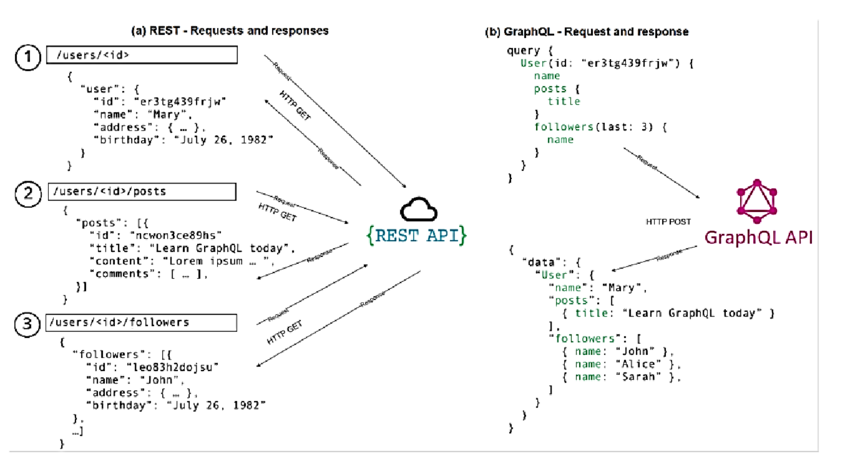 <a href="https://www.researchgate.net/figure/Comparison-of-the-REST-API-and-the-GraphQL-API-including-an-example-of-overfetching-and_fig1_387425014" target="_blank" style="position: absolute; top: 4px; left: 4px; font-size: 12px;">[src]</a> 
 
One REST round-trip per resource against a single shaped query.
 

<!-- - 
 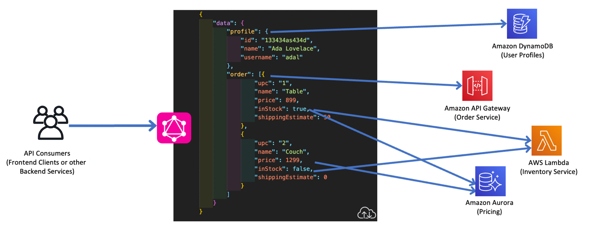 <a href="https://aws.amazon.com/ko/compare/the-difference-between-graphql-and-rest/" target="_blank" style="position: absolute; bottom: -8px; right: 4px; font-size: 12px;">[src]</a> 
 -->

<!-- - 
 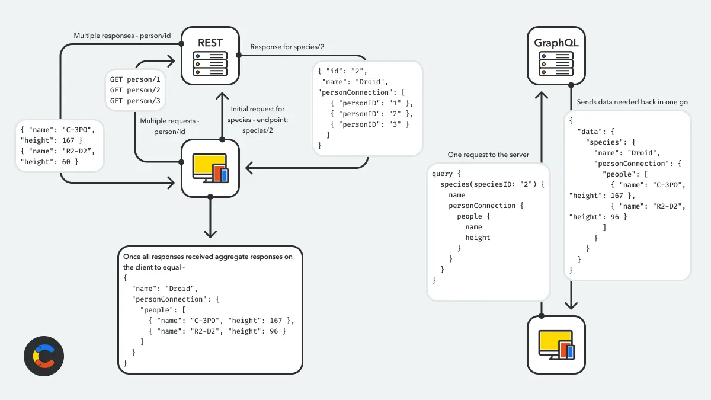 <a href="https://www.contentful.com/blog/graphql-vs-rest-exploring-how-they-work/" target="_blank" style="position: absolute; bottom: -8px; right: 4px; font-size: 12px;">[src]</a> 
 -->

<!-- - 
 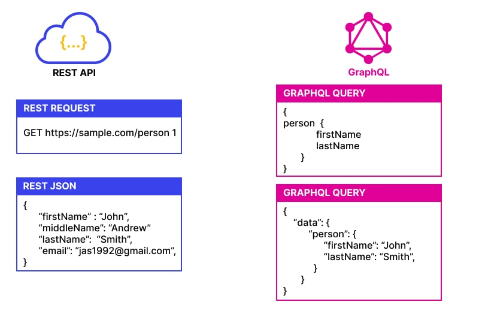 <a href="https://velog.io/@onegyeol/REST-API%EC%99%80-GraphQL" target="_blank" style="position: absolute; bottom: -8px; right: 4px; font-size: 12px;">[src]</a> 
 -->

<!-- - 
 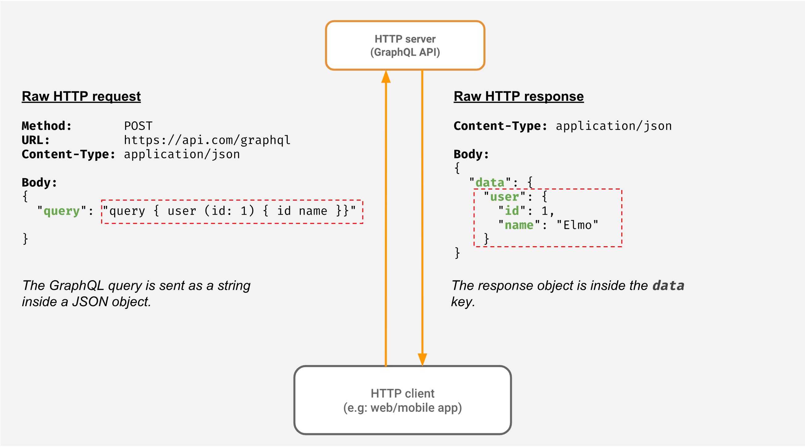 <a href="https://hasura.io/learn/graphql/intro-graphql/what-is-graphql/" target="_blank" style="position: absolute; bottom: -8px; right: 4px; font-size: 12px;">[src]</a> 
 -->

### **4.4. RPC**

 

REST addresses a resource and hands back a snapshot of its state, whereas RPC names a procedure for the server to run, a noun answered by state against a verb answered by a computation. Between co-deployed services REST and GraphQL's public-edge generality is dead weight, text over HTTP paying for reach no internal caller needs. [Remote procedure call]() (RPC, Birrell 1984) tightens here. The client invokes the procedure through a [stub](), a local proxy generated from an interface definition both ends compile in advance<!-- and share as a source dependency, a monorepo or schema registry rather than a loose file -->. The stub marshals the arguments and unmarshals the reply, and the call thus reads as local, an abstraction leaking where the network fails or stalls as a local call would not.

Tunnelled through HTTP by SOAP and XML-RPC, RPC lost to REST at the edge but returns on its own protocol, its implementations spread across coupling. [JSON-RPC](https://www.jsonrpc.org/specification) 2.0 (2010) sits at the loose end, a schemaless, transport-agnostic object of method, params, and id. [gRPC]() (Google, 2015), its internal Stubby opened up, holds the tight end, typed [protocol buffers]() (protobuf) over HTTP/2, whose multiplexing carries unary or streaming calls, fast but cache-opaque and unreachable from a browser without a [grpc-web]() proxy, a fit for intra-cluster links and ML serving<!-- both ends co-deploy so the pre-agreed contract costs nothing; Triton, TF Serving -->.

<!-- figure tbd -->


How the shared interface definition (.proto etc.) actually reaches both ends, roughly by prevalence:
1. Monorepo — protos in one shared dir alongside the services; one source of truth, a change and all its consumers move in one commit (Google, most gRPC-heavy shops).
2. Dedicated proto repo, vendored as a git submodule or pinned dependency; version bumps managed by hand.
3. Buf Schema Registry (BSR) — protos treated like packages: buf push to a registry, others declare a dependency and buf generate; adds breaking-change detection and linting ("npm for protos", where new projects land).
4. Publish the generated stubs as language packages (PyPI/npm/Go module/Maven) via CI; consumers pip install the stubs and never see the proto.
The through-line: protos are shared like source dependencies (versioned, in a repo or registry, codegen wired into the build), not like data files on object storage.



REST (Python):
  response = requests.post("https://api.example.com/predict", json={"input": [1.0, 2.0, 3.0]})
  result = response.json()

gRPC (Python):
  channel = grpc.insecure_channel("localhost:50051")
  stub = predict_pb2_grpc.PredictStub(channel)
  result = stub.Predict(predict_pb2.Input(values=[1.0, 2.0, 3.0]))

REST: construct URL, build JSON, parse JSON response. Everything explicit.
gRPC: call stub.Predict(...) like a local function. Proto-generated code handles serialisation, transport, deserialisation. That's the stub abstraction.


The [language server protocol]() (LSP, Microsoft, 2016) first built on JSON-RPC at scale. $M$ editors wired to $N$ languages by hand form an $M \times N$ tangle of bespoke plugins, which LSP collapses to $M+N$ by the same hub factorisation as LLVM's IR (§602#2.1), one JSON-RPC contract each language implements once for every editor and each editor once for every language. The insight was that language intelligence is a service, not an editor feature. <!-- trim: separated from the UI it composed freely, and rich completion and navigation turned from a per-editor luxury into a commodity every client inherits --> A language server, a separate process speaking the protocol over [stdio]() or a socket, answers completion, diagnostics, and go-to-definition, while the editor stays ignorant of the language's toolchain, a template a new $M \times N$ tangle would soon borrow.

Anthropic's [model context protocol](https://modelcontextprotocol.io/) (MCP, 2024) applies the same $M+N$ collapse to LLM agents, built on the same JSON-RPC, one open standard a tool implements once for any client. <!-- trim: replacing the hand-wired tangle of apps against tools; adopted by rival labs by 2025 --> A model's reach is bounded by what it can call, and a shared protocol for tools and context is what turns a chatbot into an agent, its context window a bus any capability can plug into. A server exposes {[resources](): data, [tools](): typed functions, [prompts](): templates} over [stdio]() or HTTP<!-- after a capability negotiation; tools typed by JSON Schema; stdio = same-host IPC (still serialised), HTTP = remote, both on p1's networked side -->. Its transport evolved like HTTP's, per-client [HTTP+SSE]() giving way to a stateless [Streamable HTTP](https://medium.com/@higress_ai/comparison-of-data-before-and-after-using-streamable-http-b094db8b414e) (2025) endpoint any node can serve<!-- keyed by Mcp-Session-Id, a swap beneath a fixed protocol -->, echoing QUIC displacing TCP under HTTP/3.


API vs stack, as a letter: the API (REST, gRPC, JSON-RPC, MCP) is the language
and content of the letter — what it asks and the shared vocabulary both programs understand (L7 semantics). The OSI/TCP-IP stack is the POSTAL SYSTEM that delivers it: HTTP is the envelope, TCP/UDP ships it registered or as a postcard (how reliably), IP routes it by address, link/physical carry the bits. 
Same letter — the language is the API, the delivery is the stack.

It nests (recursive encapsulation): the API rides another L7 protocol, not TCP directly.
  MCP / REST call      (the language)               L7
    over HTTP          (the envelope)               L7
      over TCP         (registered vs postcard)     L4
        over IP        (routing by address)         L3
          over Ethernet (the wire)                  L2/L1


<!-- - 
 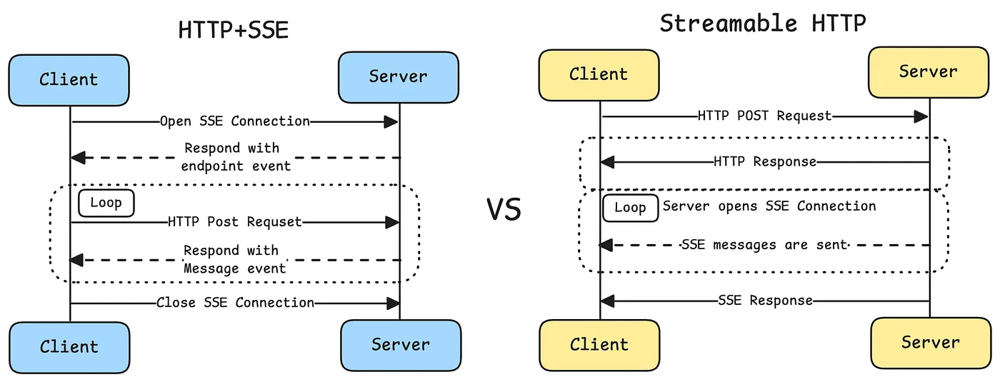 <a href="https://medium.com/@higress_ai/comparison-of-data-before-and-after-using-streamable-http-b094db8b414e" target="_blank" style="position: absolute; top: 4px; left: 4px; font-size: 12px;">[src]</a> 
 -->

<!-- - 
 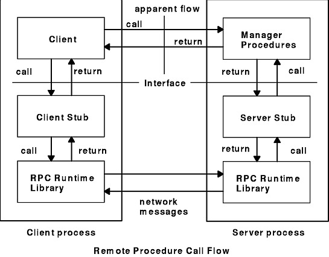 <a href="https://meongae.tistory.com/94" target="_blank" style="position: absolute; bottom: -8px; right: 4px; font-size: 12px;">[src]</a> 
 -->

- 
 
 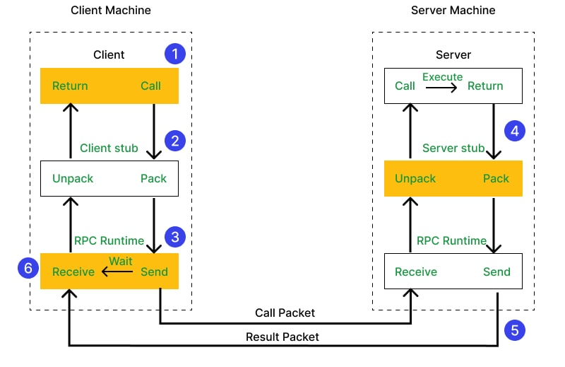 <a href="https://www.wallarm.com/what/grpc-vs-rest-comparing-key-api-designs-and-deciding-which-one-is-best" target="_blank" style="position: absolute; bottom: -8px; right: 4px; font-size: 12px;">[src]</a> 
 
The stub hiding marshalling, transport, and deserialisation.
 

