# Database
---
> Alongside compilers and operating systems, the DB is arguably one of the most fascinating pieces of [systems software]() (§603) ever built. It packs an extraordinary density of CS subfields into a single system, from relational algebra and B-tree indexing to write-ahead logging, multiversion concurrency control, query optimisation (which is essentially a compiler problem), and distributed consensus. Nearly every non-trivial application depends on one.

<!-- - https://www.youtube.com/watch?v=W2Z7fbCLSTw -->
<!-- - https://www.youtube.com/watch?v=byR3BcrChT8 -->

<!--
ANSI/SPARC three-schema architecture (1975):

  External level   — individual user views (what each application sees)
  Conceptual level  — the logical schema (tables, relationships, constraints)
  Internal level    — physical storage (files, pages, indexes)

Bottom-up arc (bare metal → compiler):
  §I  — the disk: how bytes are laid out and found (pages, B+ trees)
  §II — the safety: how concurrent access stays correct (ACID, MVCC, WAL)
  §III — the compute: how queries are compiled and executed (SQL, planner, process model)
-->

## I
---

### **1.1. Relational Model**

 

A [database]() (DB) is a structured collection of persistent data managed by a system that supports efficient retrieval and modification. Databases have historically exceeded main memory capacity. RAM (§601#1.3) in the 1960s–70s was measured in kilobytes, so the authoritative copy of data lived on disk, with memory serving only as a buffer. Early [navigational databases]() such as IBM's IMS (1966) <!-- originally built to track the bill of materials for the Saturn V rocket in NASA's Apollo programme --> and the CODASYL network model (1969) stored data in hierarchical or graph structures that programs traversed via linked pointers. Because programs referenced data by its physical address on disk, any storage reorganisation broke existing code.

Edgar Codd's [relational model](https://dl.acm.org/doi/10.1145/362384.362685) (1970) broke this coupling by proposing that data be organised as [relations](), sets of tuples over named attributes, manipulated through a closed algebra of operations (e.g. select, project, join) rather than procedural navigation. The model established [data independence](), separating logical structure from physical storage so that the engine could reorganise data without breaking applications. IBM's [System R]() and UC Berkeley's [Ingres]() (both 1974) were the first [relational database management systems]() (RDBMS) to demonstrate the model's practicality.

<!-- 
- A relational database is the data (the collection of relations); 
- RDBMS is the software that manages it. PostgreSQL is an RDBMS;
  => the data DBMS manages is the relational database. 
-->

<!-- - [er_diagram.webp](https://sqlmentalist.com/2013/10/13/bisql-laymen-to-sql-developer-23-entity-relationship-model-2-er-model-concept-with-an-example/) -->

In particular, System R introduced [structured query language](https://en.wikipedia.org/wiki/SQL) (SQL), a DSL for querying and managing relational databases (§602#2.2), where one specifies "what" data to retrieve or modify and the engine determines "how" to execute it efficiently. This separation of specification from execution enables query optimisation, since the engine can choose among equivalent strategies without changing semantics. Ingres, led by Michael Stonebraker (Turing Award, 2014), spawned a successor project called [Postgres]() (1986), whose Postgres95 release replaced its POSTQUEL query language with SQL (1995) before the rename to [PostgreSQL]() (1996), which remains the reference open-source RDBMS.

- 
 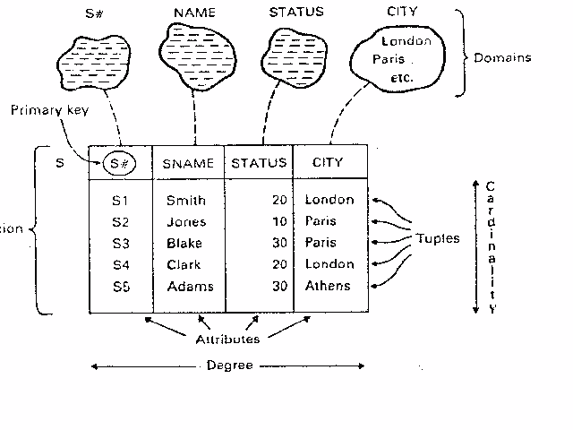 <a href="https://notesbonanza.wordpress.com/2013/05/22/relational-model/" target="_blank" style="position: absolute; bottom: -8px; right: 4px; font-size: 12px;">[src]</a> 

Practitioners refer to relations as [tables](), tuples as [rows](), and attributes as [columns](). Each table is defined by a [schema]() that specifies column names, data types, and constraints. [Primary keys]() (pk) uniquely identify rows and may span multiple columns ([composite key]()), and [foreign keys]() (fk) enforce [referential integrity]() by requiring that a value in one table correspond to an existing primary key in another. [Normalisation]() decomposes tables to eliminate redundancy and update anomalies. A [functional dependency]() $X \to Y$ holds when any two rows agreeing on attributes $X$ agree on $Y$, and successive [normal forms]() (1NF through BCNF) impose progressively stricter constraints on where such dependencies may sit, BCNF requiring every determinant $X$ to be a superkey. [Denormalisation]() deliberately reintroduces redundancy to optimise read performance for specific query patterns, at the cost of increased storage and write complexity.

- 
 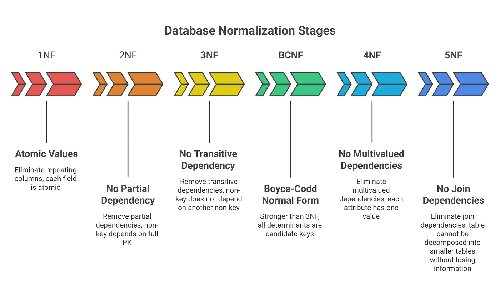 <a href="https://medium.com/@bsravani191/normalization-denormalization-in-sql-explained-clearly-with-interview-friendly-examples-33a71c0784ff" target="_blank" style="position: absolute; top: 4px; right: 4px; font-size: 12px;">[src]</a> 

<!-- - 
 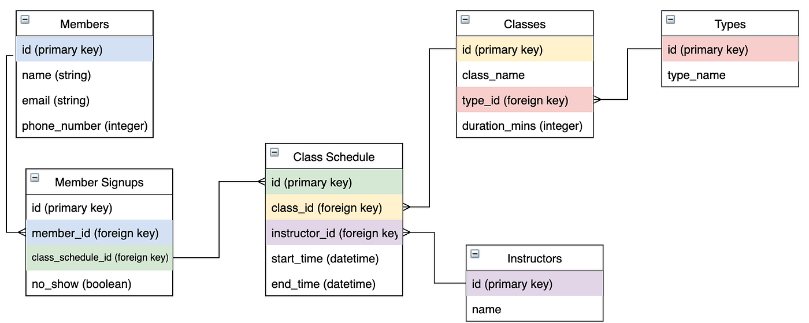 <a href="https://medium.com/@claire_logan/3-relational-data-model-examples-c9f70c61588c" target="_blank" style="position: absolute; bottom: -8px; right: 4px; font-size: 12px;">[src]</a> 
 -->

### **1.2. Storage Engine**

 

The relational model is a logical abstraction. The [storage manager]() (aka. [storage engine]()), the DBMS component responsible for data transfer between disk and memory, materialises relations on disk and serves them back efficiently. Since disk I/O (§601#1.4) is orders of magnitude slower than memory access, the storage manager's design is oriented around minimising it. Data is organised into fixed-size [pages]() (8 KB in PostgreSQL, 16 KB in InnoDB) aligned with the disk's block-oriented access, so every I/O transfers a useful unit of work. A [buffer pool]() caches recently accessed pages in memory, an approach Gray's [five-minute rule]() (1987) formalised economically: if a page is accessed more often than once every five minutes, keeping it resident is cheaper than re-reading it. The buffer pool deliberately duplicates the role of the OS page cache (§603#3.2), since the engine must control eviction itself (PostgreSQL approximates LRU with a clock-sweep) and must guarantee that a dirty page reaches disk only after its WAL records do (§2.3), an ordering the kernel's opaque write-back cannot promise.

<!--
Logical (SQL)          Physical (disk)
─────────────          ───────────────
database cluster  →    PGDATA directory (e.g. /var/lib/postgresql/data/)
database          →    subdirectory (base/OID)
schema            →    namespace only, no physical structure
table             →    heap file(s) (OID-named)
row               →    tuple within a page (header + data)
column value      →    bytes at an offset within the tuple
-->

In PostgreSQL, a [database cluster]() is the top-level directory (_PGDATA_), each database is a subdirectory under `base/` identified by OID, and each table is stored as one or more [heap files]() named by the table's OID. A heap file is a sequence of 8 KB pages, each containing multiple tuples. Each tuple is preceded by a 23-byte header (padded to 24 by alignment) containing transaction visibility fields (*xmin*, *xmax*), a [tuple identifier]() (*ctid*, pointing to the row's physical location as a page/offset pair), and an *infomask* encoding null flags, lock state, and hint bits. This header makes MVCC possible at the storage level, since the engine can determine visibility without consulting a separate structure. Values exceeding approximately 2 KB are compressed and moved out-of-line by [the oversized-attribute storage technique]() (TOAST) into a companion table, keeping the main heap pages compact.

Data layout can follow two fundamentally different orientations driven by workload. [Online Transaction Processing]() (OLTP) workloads read and write individual records, while [Online Analytical Processing]() (OLAP) workloads aggregate millions of rows over a few columns. The former favours the [N-ary Storage Model]() (NSM, row-oriented) where all columns of a row sit contiguously so that a single page read retrieves the full record. The latter favours the [Decomposition Storage Model]() (DSM, column-oriented) where values of the same column are stored together, enabling aggressive compression and vectorised scans. PostgreSQL uses NSM; Redshift<!-- , ClickHouse, and DuckDB --> uses DSM, yet both share the same SQL interface and PostgreSQL wire protocol, since Redshift forked from PostgreSQL 8.0 but replaced the storage engine entirely with a columnar, MPP architecture from ParAccel.
<!--
        PostgreSQL                    Redshift
  ┌──────────────────┐        ┌──────────────────┐
  │    SQL Layer      │        │    SQL Layer      │
  │  (PG wire proto)  │        │  (PG wire proto)  │
  ├──────────────────┤        ├──────────────────┤
  │  Query Processor  │        │  Query Processor  │
  │  (volcano model)  │        │  (MPP, vectorised)│
  ├──────────────────┤        ├──────────────────┤
  │  Storage Engine   │        │  Storage Engine   │
  │  row-oriented     │        │  column-oriented  │
  │  (NSM, heap file) │        │  (DSM, ParAccel)  │
  ├──────────────────┤        ├──────────────────┤
  │  Single-node disk │        │  Distributed disk │
  └──────────────────┘        └──────────────────┘
       OLTP workloads              OLAP workloads
-->

- 
 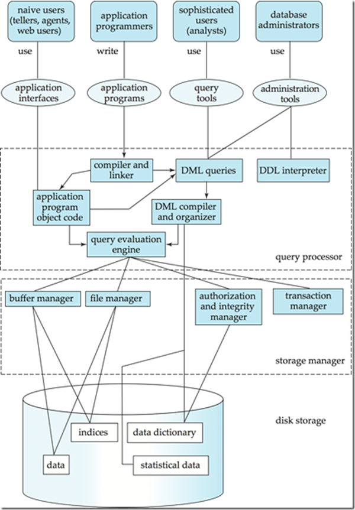   RDBMS architecture (Silberschatz et al.) <a href="https://sqlmentalist.com/2012/01/03/bisql-83-laymen-to-sql-developer-7-assignment-1-part-6-storage-manager-query-processing-transaction-management-and-internals/" target="_blank" style="position: absolute; bottom: 4px; right: 4px; font-size: 12px;">[src]</a> 

<!-- - 
 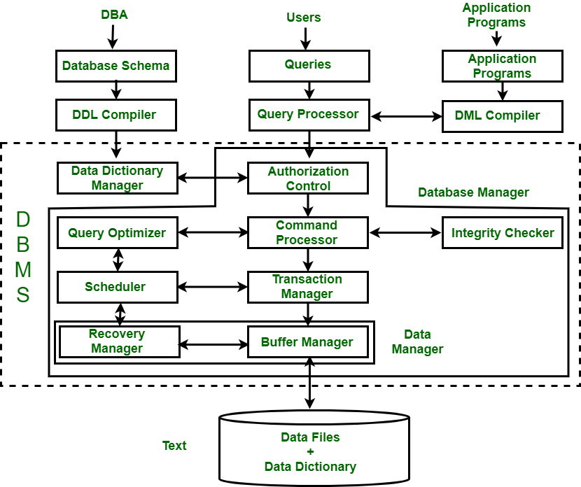 <a href="https://www.geeksforgeeks.org/dbms/structure-of-database-management-system/" target="_blank" style="position: absolute; bottom: -8px; right: 4px; font-size: 12px;">[src]</a> 
 -->

<!--
The same 8 KB page lives on disk and in the buffer pool (user-space RAM).
The buffer pool is managed independently of the OS page cache (§603#3.2),
because the database must control eviction (PostgreSQL uses clock-sweep,
an LRU approximation) and guarantee that dirty pages are flushed only
after their WAL records are on stable storage (§2.3).

         ┌─────────────────────┐
         │    Application      │
         │    (SQL queries)    │
         └─────────┬───────────┘
                   │
  User   ┌─────────▼───────────┐
  space  │   DB Buffer Pool    │  8 KB pages, clock-sweep
         └─────────┬───────────┘
                   │ read()/write() syscalls
 ─ ─ ─ ─ ─ ─ ─ ─ ─ ─ ─ ─ ─ ─ ─ ─
  Kernel ┌─────────▼───────────┐
  space  │   OS Page Cache     │  4 KB pages, LRU
         └─────────┬───────────┘
                   │ block I/O
         ┌─────────▼───────────┐
  Disk   │   Block Device      │
         └─────────────────────┘
-->

### **1.3. Indexing**
<!--
  p1 — problem → BST → B-tree (1972)
  p2 — B+ tree (refinement, splits, height)
  p3 — other index types; scalar (hash, composite, covering) → non-scalar (GIN, GiST, SP-GiST, BRIN)
  p4 — costs + planner selectivity
-->

 

Without an index, every lookup requires a sequential scan of the entire heap. An [index]() maps search keys to the physical locations<!-- (TIDs in PostgreSQL) --> of matching rows, trading write overhead<!-- (maintaining the index on every INSERT/UPDATE/DELETE) --> for read speed. The simplest indexing structure is a [binary search tree]() (BST): it narrows the search space by half at each level, giving $O(\log_2 n)$ node visits. But each visit is a separate disk read, so a billion-key BST requires roughly 30 I/Os per lookup, far too many when each I/O costs milliseconds. The [B-tree]() (Bayer and McCreight, 1972) solves this by exploiting the disk's block-oriented access: each node holds up to $m - 1$ keys and $m$ child pointers and maps to one page, so a single I/O retrieves an entire node and the height drops to 3-4 levels.

The [B+ tree](https://en.wikipedia.org/wiki/B%2B_tree) refines the B-tree by restricting row pointers to leaf nodes (internal nodes hold only keys for routing) and linking leaves via sibling pointers for sequential range scans. Insertion costs $O(\log_b n)$ worst case for the search, while the splits that propagate upward to maintain balance are $O(1)$ amortised. With a branching factor $b$ (typically in the hundreds, since one node fits one page) and $n$ keys, a B+ tree has height $O(\log_b n)$, so even tables with billions of rows require only 3-4 page reads per lookup.

- 
 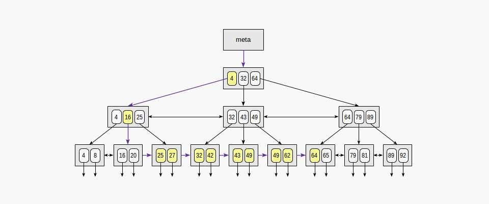   CREATE INDEX idx_age ON users (age);&nbsp; →&nbsp; SELECT * FROM users WHERE age BETWEEN 23 AND 64; <a href="https://postgrespro.com/blog/pgsql/4161516" target="_blank" style="position: absolute; top: 4px; right: 4px; font-size: 12px;">[src]</a> 

[Hash indexes]() provide $O(1)$ average-case point lookups but cannot serve range queries or ordered iteration<!-- ; they were not WAL-logged before PostgreSQL 10, making them unsafe for crash recovery -->. [Composite indexes]() on multiple columns $(c_1, c_2, \ldots, c_k)$ satisfy queries that filter on a [leftmost prefix]() of the indexed columns. A [covering index]() includes all columns a query needs, allowing the engine to answer entirely from the index without touching the heap (an [index-only scan]()). PostgreSQL also offers specialised access methods beyond B+ tree: [GIN]() (Generalised Inverted Index) for full-text search and JSONB containment, [GiST]() (Generalised Search Tree) for geometric and range types, [SP-GiST]() (Space-Partitioned GiST) for space-partitioned structures<!-- (e.g. k-d trees, radix trees) -->, and [BRIN]() (Block Range Index) for large, naturally ordered tables<!-- (e.g. append-only timestamp data) --> where storing min/max values per consecutive block range yields an index orders of magnitude smaller than a full B+ tree.

Indexes are not free. Every INSERT, UPDATE, or DELETE must maintain every index on the table, not just the heap. In PostgreSQL, indexes store pointers to all tuple versions including dead ones, so index bloat accumulates between VACUUM cycles and may eventually require [REINDEX](). <!-- Over-indexing, maintaining indexes the planner never selects, penalises write throughput without benefiting reads. -->The query planner chooses between an index scan and a sequential scan based on estimated [selectivity]() $s \in [0, 1]$: when $s$ is low (few matching rows), the index avoids reading irrelevant pages; when $s$ is high, a sequential scan is cheaper because it reads pages contiguously rather than issuing random I/O. The planner models this tradeoff via *random_page_cost* and *seq_page_cost* (default ratio 4:1 for spinning disks, often set to 1.1:1 for SSDs).<!-- When selectivity falls between the extremes, a [bitmap index scan]() combines results from one or more indexes into a bitmap of heap pages and reads them in physical order, converting random I/O to sequential. -->

- ...

## II
---
<!-- Transaction manager: the RDBMS component that enforces ACID.
  §2.1 — the properties themselves
  §2.2 — isolation (concurrency control, MVCC)
  §2.3 — atomicity and durability (WAL, crash recovery)
-->

### **2.1. ACID**

 

The storage layer so far assumes a single user. When multiple transactions access the same data concurrently, the system needs formal guarantees about correctness. A [transaction]() groups one or more operations into a logical unit of work satisfying the [ACID](https://en.wikipedia.org/wiki/ACID) properties, articulated by Jim Gray (Turing Award, 1998) and named by Härder and Reuter (1983): [atomicity]() (all-or-nothing execution), [consistency]() (valid state to valid state), [isolation]() (concurrent transactions do not observe intermediate states), and [durability]() (committed effects survive crashes). Each property has a cost. Atomicity requires an undo mechanism, durability requires forcing writes to stable storage, and strict isolation reduces concurrency.

Of the four properties, consistency stands apart. Atomicity, isolation, and durability are guarantees the database engine enforces mechanically, but consistency depends on the application defining correct invariants through constraints (NOT NULL, UNIQUE, CHECK, foreign keys) and transaction logic. A transfer that debits one account without crediting another violates consistency even if the transaction commits atomically. In practice, isolation is the most negotiable property, since full serialisability is expensive and most workloads tolerate weaker guarantees in exchange for higher throughput.

### **2.2. Concurrency Control**

 

The simplest way to guarantee isolation is to execute transactions serially, but serial execution forfeits concurrency. The challenge is to run transactions concurrently while producing results equivalent to some serial order, a property with a checkable criterion, since a schedule is [conflict-serialisable]() if and only if its [precedence graph]() (i.e. nodes are transactions, with an edge $T_i \to T_j$ whenever an operation of $T_i$ conflicts with and precedes one of $T_j$) is acyclic, the correctness counterpart of the deadlock cycle in §604#3.4. [Isolation levels]() formalise how much concurrency a system permits by relaxing this guarantee. [Read Uncommitted]() allows [dirty reads]() (seeing uncommitted writes). [Read Committed]() (PostgreSQL's default) prevents dirty reads but permits [non-repeatable reads]() (a row changes between two reads within the same transaction). [Repeatable Read]() prevents both but may allow [phantom reads]() under the ANSI standard (new rows appearing in a range query); PostgreSQL's Repeatable Read already prevents phantoms via snapshot isolation, so its [Serialisable]() level (SSI, below) targets [write skew]() and other serialisation anomalies instead.

[Two-phase locking]() (2PL), introduced in System R, is the classical enforcement mechanism: a transaction acquires locks before accessing data (growing phase) and releases them only after committing or aborting (shrinking phase). This guarantees serialisability but causes deadlocks and reduces concurrency, since readers block writers and vice versa. [Multiversion concurrency control]() (MVCC), pioneered by Reed (1978) and adopted by PostgreSQL, MySQL/InnoDB, and Oracle, adopts a different strategy. Each write creates a new version of the row rather than overwriting in place, and each transaction sees a consistent [snapshot]() of the database as of its start time. Readers never block writers and writers never block readers, which is why MVCC dominates in practice.

In PostgreSQL, MVCC is implemented at the storage level through the heap tuple header. Each row version is stamped with [xmin]() (the creating transaction ID) and [xmax]() (the deleting or locking transaction ID). A transaction's snapshot records the set of in-progress transaction IDs at snapshot time, and a row version is visible if its xmin has committed and its xmax has not. An UPDATE does not modify the existing tuple; it inserts a new version and sets xmax on the old one, leaving dead tuples that [VACUUM]() must eventually reclaim. [Autovacuum]() runs VACUUM automatically based on configurable thresholds. Because transaction IDs are 32-bit integers with a $2^{31}$ visibility horizon, PostgreSQL also requires periodic [anti-wraparound vacuuming]() to freeze old transaction IDs, and failure to vacuum can force the database into read-only mode. MySQL/InnoDB implements MVCC differently, using [undo logs]() to reconstruct older versions on demand from a single physical copy, avoiding dead-tuple accumulation but requiring undo log purging.

At the strongest isolation level, PostgreSQL implements [Serialisable Snapshot Isolation]() (SSI, Cahill et al. 2008), which detects dangerous patterns of read-write dependencies between concurrent transactions and aborts one to prevent anomalies, rather than acquiring predicate locks that would block concurrent access. SSI makes PostgreSQL's SERIALIZABLE level practical, since it preserves the non-blocking property of snapshot isolation while guaranteeing full serialisability.

### **2.3. Write-Ahead Logging**

 

[Write-ahead logging](https://en.wikipedia.org/wiki/Write-ahead_logging) (WAL) is the mechanism that provides atomicity and durability. Before any modification is applied to a data page, a log record describing the change is first written to a sequential, append-only log on stable storage. If the system crashes, committed changes can be replayed from the log; uncommitted changes are rolled back. Because the log is written sequentially, it is far cheaper than random writes to scattered data pages (§601#1.4), and the database can batch multiple transactions' log records into a single *fsync()* via [group commit]().

- 
 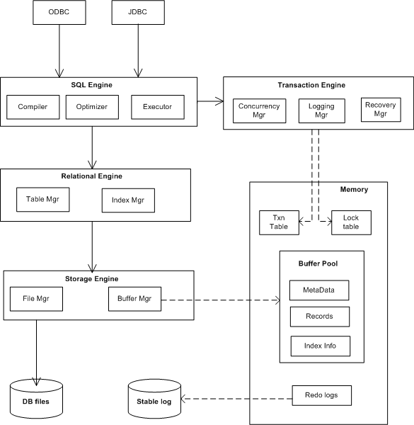 <a href="https://en.wikibooks.org/wiki/Design_of_Main_Memory_Database_System/Overview_of_DBMS" target="_blank" style="position: absolute; top: 6px; right: 4px; font-size: 12px;">[src]</a> 

In PostgreSQL, WAL records are written to 16 MB segment files in *pg_wal/* (formerly *pg_xlog/*). During normal operation, modified ("dirty") pages accumulate in the buffer pool and are flushed to disk lazily by the [background writer]() and [checkpointer](), but only after their corresponding WAL records have reached stable storage (the [WAL-before-data rule]()). A [checkpoint]() periodically forces all dirty pages to disk and records the [log sequence number]() (LSN) at which recovery can begin, bounding the amount of WAL that must be replayed after a crash. The WAL also enables [streaming replication](): a standby server continuously receives and replays WAL segments from the primary, maintaining a near-real-time copy. [Logical replication]() (PostgreSQL 10+) decodes the WAL into logical change events, enabling selective replication of individual tables or cross-version upgrades.

On crash recovery, the database replays the WAL from the last checkpoint forward. The [redo]() phase reapplies all changes (committed or not) that may not have reached the data files, restoring the database to the exact state at the moment of the crash. PostgreSQL then identifies transactions that were in progress at crash time and marks them as aborted, so their effects become invisible through normal MVCC visibility rules rather than requiring an explicit undo phase. This is possible because PostgreSQL's MVCC never overwrites data in place, so "undoing" an uncommitted transaction simply means its row versions are never visible to any future snapshot. File system journaling (e.g. ext3, 2001) adopted the same principle for metadata consistency.

## III
---
<!--
Arc: a query's lifecycle from user to hardware.
  §3.1 — what you write (SQL, its constructs) and how it enters the engine (compilation pipeline)
  §3.2 — what the engine does with it (optimisation, physical operators, execution)
  §3.3 — who runs it (process model, concurrency limits, connection pooling)
-->

<!-- The RDBMS architecture diagram splits the engine into a query processor and a storage manager.
Sections I and II covered the storage manager and transaction manager; this section covers the query processor. -->

### **3.1. Structured Query Language**

 

Codd's original algebra operates on sets with no concept of missing values or ordering. SQL is [relationally complete]() w.r.t. this algebra, but departs from it in three practical ways: i) it operates on [bags]() (i.e. multisets with duplicates) rather than sets to minimise the cost of deduplicating all intermediaries<!-- (performance) -->; ii) it introduces [NULL]() to represent missing or unknown values, which requires [three-valued logic]() (i.e. TRUE, FALSE, UNKNOWN) as any comparison involving NULL yields UNKNOWN<!-- (data modelling) -->; and iii) it adds ORDER BY to impose a sequence on inherently unordered relations<!-- (interface) -->; DISTINCT serves as the explicit operator to recover set semantics when needed.


Bags vs sets:
  SELECT o.id, p.name FROM orders o JOIN products p ON o.pid = p.id;

  set:  join → dedup → project → dedup   (dedup after every operator)
  bag:  join → project                   (no dedup unless DISTINCT)


SQL is standardised by ISO/IEC and revised periodically: adding recursive queries (SQL:1999), window functions (SQL:2003), JSON support (SQL:2016), and property graph queries (SQL:2023). SQL statements are often classified into: i) [Data manipulation language]() (DML) for reading / writing data; ii) [Data definition language]() (DDL) for defining / modifying schema; iii) [Data control language]() (DCL) for managing permissions; and iv) [Transaction control language]() (TCL) for demarcating transaction boundaries. Only DML passes through the optimiser (§3.2). In practice, however, each RDBMS carries a dialect with vendor-specific extensions and omissions.<!-- Modern data warehouses built on PostgreSQL (e.g. Redshift) extend the standard categories with commands like UNLOAD and COPY that move data between the database and external storage. -->


SQL:1999 — recursive queries (WITH RECURSIVE)
  WITH RECURSIVE subordinates AS (
    SELECT id, name, manager_id FROM employees WHERE id = 1
    UNION ALL
    SELECT e.id, e.name, e.manager_id
    FROM employees e JOIN subordinates s ON e.manager_id = s.id
  )
  SELECT * FROM subordinates;

SQL:2003 — window functions (OVER / PARTITION BY)
  SELECT department, name, salary,
         RANK() OVER (PARTITION BY department ORDER BY salary DESC) AS rnk
  FROM employees;

SQL:2016 — JSON support
  SELECT id, doc->>'name' AS name
  FROM documents
  WHERE doc @> '{"status": "active"}';   -- PostgreSQL JSONB syntax

SQL:2023 — property graph queries (SQL/PGQ)
  SELECT name
  FROM GRAPH_TABLE (social_graph
    MATCH (a:Person)-[:FOLLOWS]->(b:Person)
    WHERE a.name = 'Alice'
    COLUMNS (b.name AS name)
  );


These successive revisions have also extended SQL beyond the original algebra, which include adding [aggregation]() (e.g. GROUP BY with aggregate functions, filtered by HAVING), [subqueries]() (e.g. scalar, correlated, and EXISTS predicates), [common table expressions]() (e.g. WITH clauses, including recursive CTEs for hierarchical queries), and [window functions]() (e.g. OVER/PARTITION BY for running totals, ranks, and moving averages without collapsing rows). These constructs compose along SQL's [logical evaluation order](): FROM $\to$ WHERE $\to$ GROUP BY $\to$ HAVING $\to$ SELECT $\to$ ORDER BY, where each stage consumes the previous relation.<!-- This is the conceptual order defined by the SQL standard; the optimiser may execute stages in a different physical order. -->

- 
 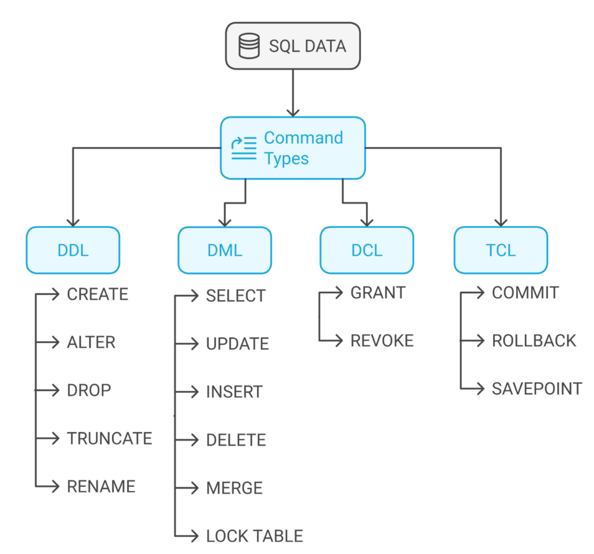 <a href="https://www.sitepoint.com/sql-commands/" target="_blank" style="position: absolute; bottom: -8px; right: 4px; font-size: 12px;">[src]</a> 

<!-- - 
 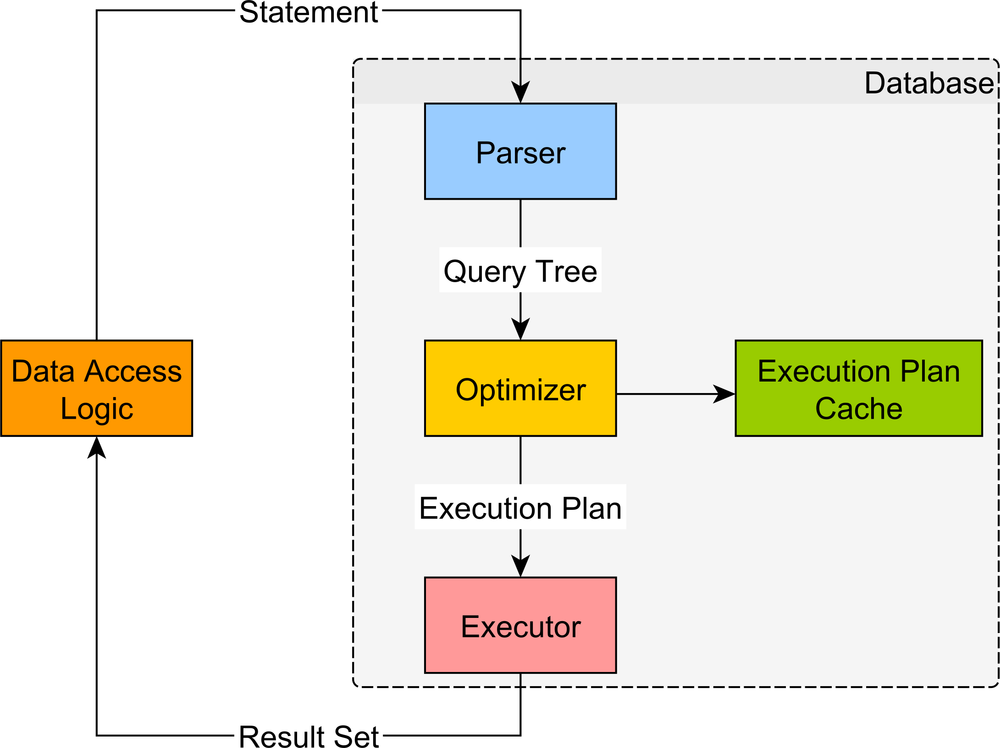 <a href="https://vladmihalcea.com/execution-plan-sql-server/" target="_blank" style="position: absolute; bottom: -8px; right: 4px; font-size: 12px;">[src]</a> 
 -->

### **3.2. Query Processor**

 



------------------------------------------------------------
Compilation (parser, analyser, rewriter)
  p1: pipeline (parser → binder → rewriter → planner)

Optimisation (planner)
  p2: cost-based optimiser, transformations, physical planner
  p3: statistics, cardinality estimation
  p4: EXPLAIN ANALYZE, diagnostics
  p5: join algorithms, join ordering, GEQO

Execution (executor)
  p6: volcano model, pipelining
  p7: vectorised execution, parallel query

------------------------------------------------------------
Colour mapping to sql_workflow.png (p1 image):
  Blue     Parser      p1
  Green    Analyzer    p1
  Yellow   Rewriter    p1
  Red      Planner     p2, p3, p4, p5
  Purple   Executor    p6, p7


The compilation pipeline that turns a SQL statement into executable operations mirrors a compiler (§602#2.2): a [parser]() (generated from a Bison grammar in PostgreSQL, *gram.y*) validates syntax and produces an AST, a [binder]() (called the [analyser]() in PostgreSQL) resolves names against the [catalogue]() (the database's metadata store of schemas, tables, columns, and constraints), and a [logical planner]() translates the AST into a tree of relational algebra operators. PostgreSQL inserts an additional [rewriter]() stage (*pg_rewrite_query*) between analysis and planning that expands [views]() (i.e. named queries stored in the catalogue and referenced like tables), applies rule-based transformations, and enforces row-level security policies. This pipeline is not unique to databases; engines such as SparkSQL ([Catalyst]()) reuse the same architecture to optimise relational algebra over DataFrames rather than stored tables.

- 
 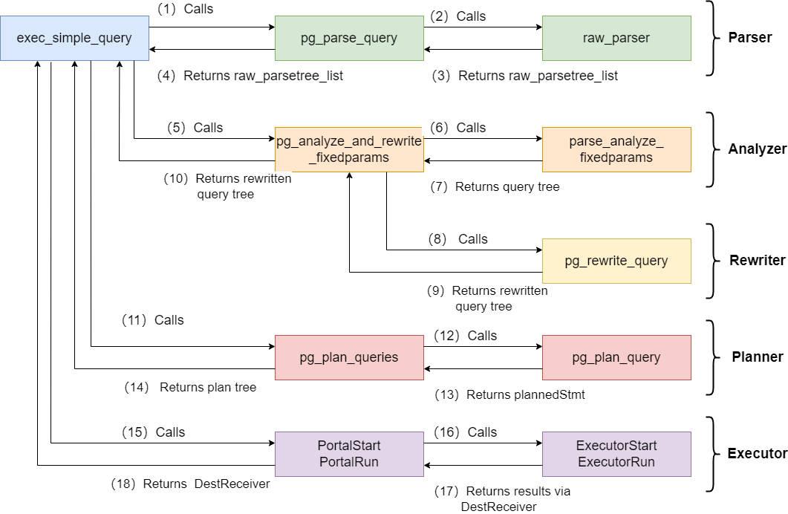 <a href="https://www.highgo.ca/2024/01/26/a-comprehensive-overview-of-postgresql-query-processing-stages/" target="_blank" style="position: absolute; bottom: -9px; right: 4px; font-size: 12px;">[src]</a> 

<!-- - 
 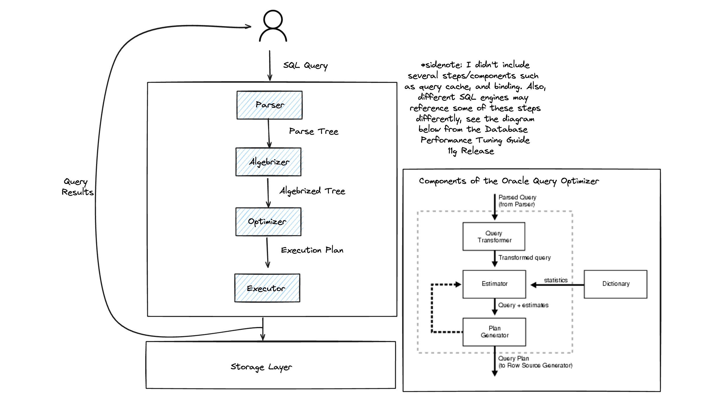   Terminology varies across engines: SQL Server's "Algebrizer" = PostgreSQL's "analyser" = Oracle's "Query Transformer" <a href="https://seattledataguy.substack.com/p/behind-the-scenes-of-sql-understanding" target="_blank" style="position: absolute; top: 4px; right: 4px; font-size: 12px;">[src]</a> 
 -->

The logical planner produces a tree of relational algebra operators, selection $\sigma$, projection $\pi$, and join $\bowtie$, so a SELECT-FROM-WHERE compiles to $\pi(\sigma(R \bowtie S))$, but the same query admits many equivalent trees with orders-of-magnitude difference in cost. System R (1979) introduced the first [cost-based optimiser](), treating plan selection as a search problem over equivalent expressions, an insight that made SQL practical and that every modern engine still follows. The optimiser applies equivalence-preserving transformations such as [predicate pushdown]() ($\sigma_\theta(R \bowtie S) = R \bowtie \sigma_\theta(S)$ when $\theta$ references only $S$'s attributes), join reordering, and projection pruning, then the [physical planner]() maps each logical operator to a concrete algorithm and estimates cost using statistics maintained on tables and columns. 


SELECT e.name, d.name
FROM employees e JOIN departments d ON e.dept_id = d.id
WHERE d.location = 'London';

1) Naive logical tree           2) After predicate pushdown

     π (e.name, d.name)              π (e.name, d.name)
           |                               |
     σ (d.location='London')         ⋈ (e.dept_id = d.id)
           |                         ┌─────┴─────┐
     ⋈ (e.dept_id = d.id)      employees   σ (d.location='London')
     ┌─────┴─────┐                               |
 employees   departments                    departments

π = projection (SELECT columns)
σ = selection  (WHERE filter)
⋈ = join       (JOIN ON condition)

Data flows bottom-up:
  leaves are scanned first, results flow to the root.
  σ is pushed below ⋈ so departments is filtered before the join,
  reducing the number of rows that enter it.

3) Physical plan (chosen by optimiser)

     Project (e.name, d.name)
           |
     Nested Loop Join (e.dept_id = d.id)
     ┌─────────┴─────────┐
  Seq Scan            Index Scan
  employees           departments
                      (location = 'London')

The optimiser maps each logical operator to a concrete
algorithm (e.g. nested loop, hash join) and chooses the
cheapest plan based on estimated cost from pg_statistic.


PostgreSQL stores these in *pg_statistic* (histograms, most-common-value lists, distinct counts), updated by the [*ANALYZE*]() command (run automatically by [autovacuum]()). [Cardinality estimation](), predicting how many rows an operator will produce, is inherently imprecise, and errors compound multiplicatively across joins. The primary source of error is the [independence assumption]() (that column values are uncorrelated); PostgreSQL 10+ added [multivariate statistics]() (CREATE STATISTICS) to model correlations between columns. The quality of the cardinality estimator remains the single largest determinant of plan quality in practice.

[*EXPLAIN ANALYZE*]() exposes the planner's chosen plan alongside actual execution statistics (rows, time, buffers), though its cost metric is an abstract unit rather than wall-clock time, and the BUFFERS option is needed to distinguish cache hits from disk reads. In production, [*auto_explain*]() captures plans of actual slow queries without manual intervention, and [*pg_stat_statements*]() tracks cumulative execution statistics (calls, total time, rows) per normalised query, making it the starting point for identifying slow queries.

[Join algorithms]() illustrate the range of physical operators. A [nested loop join]() iterates over the outer relation and probes the inner for each row ($O(n \cdot m)$), benefiting from an index on the inner side. A [hash join]() builds a hash table on the smaller relation and probes it with the larger ($O(n + m)$ expected), preferred when no useful index exists. A [sort-merge join]() sorts both relations on the join key and merges them in a single pass, performing well when inputs are already sorted or when the result must be ordered. PostgreSQL's planner evaluates all applicable algorithms for each join and selects the cheapest based on its cost model. Join ordering is [NP-hard](), and System R's [dynamic programming]() approach is exponential ($O(2^n)$ subsets) in the number of joined tables; when this becomes intractable, PostgreSQL falls back to a [GEnetic query optimiser]() (GEQO) (e.g. *geqo_threshold* = 12, default).


P: Problems where a solution can be found in polynomial time
   (e.g. sorting, shortest path).

NP: Problems where a solution can be verified in polynomial time,
    but not necessarily found efficiently. Given a proposed answer,
    you can check it quickly, but finding the best answer may
    require exponential search.

NP-hard: At least as hard as any NP problem. No known
         polynomial-time algorithm exists.

Join ordering example: 
  Given 10 tables, someone hands you a specific join order.
  You can quickly compute its cost and verify whether it's good.
  
  But finding the optimal order among all possible orderings requires 
  checking exponentially many candidates (O(2^n) subsets). 
  
  That's why it's NP-hard, and why PostgreSQL gives up on exhaustive search at 
  12 tables and uses a heuristic (GEQO) instead.


- ...

Once the planner selects a plan, the [executor]() runs it. The classical execution model is the [volcano]() (iterator) model (Graefe, 1994), where each operator implements an *open()*, *next()*, *close()* interface. Operators compose into a tree, and calling *next()* on the root pulls one tuple at a time through the pipeline. PostgreSQL uses this model, which supports [pipelining]() (producing output before consuming all input), but incurs per-tuple function-call and interpretation overhead that becomes significant on analytical workloads scanning millions of rows.

[Vectorised execution]() (e.g. DuckDB, ClickHouse) amortises this overhead by processing batches of tuples (typically 1024-4096) per *next()* call, enabling SIMD instructions and better cache utilisation. PostgreSQL's built-in operators and extension functions (e.g. pgvector's distance computations) are ahead-of-time compiled C, but the expression evaluator that combines them is interpreted.<!-- PostgreSQL 11+ added JIT compilation via LLVM to compile expressions and tuple deforming into native code on hot query paths when the estimated cost exceeds a threshold, reducing interpretation overhead without abandoning the volcano model. --> [Parallel query execution]() partitions work across multiple workers, with the [exchange]() (Gather) operator redistributing intermediate tuples between parallel pipeline segments. PostgreSQL supports intra-query parallelism for sequential scans, hash joins, and aggregations since version 9.6.

- ...

### **3.3. Process-per-Connection**

 

Everything covered so far, the storage engine (§I), transaction manager (§II), and query processor (§3.1–3.2), executes inside a single PostgreSQL [backend process](). The backend reads and writes data pages through a shared [buffer pool](), appends change records to shared WAL buffers, and coordinates with other backends via shared lock tables, all mapped into a single [shared memory]() segment. Outside the backend, [utility processes]() handle maintenance asynchronously: the [background writer]() and [checkpointer]() flush dirty pages (§2.3), the [WAL writer]() flushes WAL buffers, the [archiver]() ships completed WAL segments, and the [autovacuum launcher]() reclaims dead tuples (§2.2).

<!-- Oracle also uses process-per-connection on Linux; threads only on Windows. --> PostgreSQL uses a [process-per-connection model](https://www.reddit.com/r/PostgreSQL/comments/t5ahe9/why_does_postgres_use_1_process_per_connection/) (§604#2.1), an architectural choice inherited from 1980s Unix where threads were not portable and process isolation ensured that a crash in one backend could not corrupt another. The *postmaster* calls *fork()* to create a dedicated backend process for each new connection, so the number of concurrent connections directly determines how many OS processes compete for hardware. A consequence of this isolation is that each backend compiles and caches query plans independently; Oracle and SQL Server, by contrast, maintain a shared [plan cache]() across sessions, amortising compilation cost for repeated queries. <!-- PostgreSQL 14 substantially improved connection scalability by replacing the O(n) snapshot management in shared memory with a more efficient structure. -->

Each _fork()_ duplicates the parent's page table via copy-on-write and allocates a new *task_struct*, stack, and kernel resources (§603#3.1). A backend's private memory, including *work_mem* for sorts and hash tables, *maintenance_work_mem* for VACUUM and index builds, and the plan cache, is not shared and scales linearly with connection count. Context switches between backends are inter-process (§603#3.1), requiring a page-table swap (CR3 write) and TLB flush, rather than the cheaper intra-thread register swap. With hundreds of backends, the scheduler spends measurable time on these switches and the resulting cache pollution, which is precisely the overhead the USL's $\beta$ term captures.

Once active connections exceed what the hardware can service, processes contend for cores and disk bandwidth. The [Universal Scalability Law]() (USL, 1993) formalises this: $C(N) = N / (1 + \alpha(N-1) + \beta N(N-1))$, where $\alpha$ captures serialisation (Amdahl) and $\beta$ captures coherence (cross-process coordination such as lock contention and cache invalidation). The $\beta$ term causes throughput to *decline* past an optimal $N$, not merely plateau. The PostgreSQL community's pool sizing heuristic $\text{pool size} = 2C + D$, where $C$ is CPU cores and $D$ is effective disk spindles (approaching 0 for SSDs), deliberately keeps pools small. [HikariCP](https://www.youtube.com/watch?v=uhMhv8yGAyM) popularised this formula, demonstrating empirically that a 4-core SSD server with ~9 connections outperforms one with hundreds. The demand side follows from [Little's Law](), $L = \lambda W$ ($L$ = concurrent connections, $\lambda$ = [TPS](), $W$ = average latency), so 500 TPS at 10 ms needs only 5 connections. A [connection pool]() (e.g. HikariCP for JDBC) multiplexes application-level sessions onto this fixed set.

However, each pool instance holds its own connections. If $k$ application instances each maintain a pool of size $p$, the database sees $\sum p_i = k \times p$ backends, which must not exceed [*max_connections*]() (default 100). Scaling the application layer therefore shrinks the per-instance pool or exhausts database connections entirely. [PgBouncer]() resolves this by interposing a single proxy between all application instances and PostgreSQL, accepting thousands of application connections and multiplexing them onto the small DB-side pool ($\approx 2C + D$), so the constraint becomes $\text{PgBouncer pool} \leq \text{max\_connections}$ regardless of how many application instances connect.

- 
 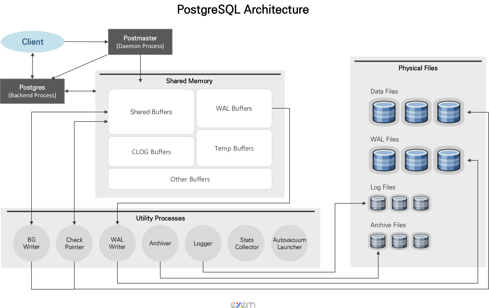 <a href="https://im-wali.github.io/database/PG-01/" target="_blank" style="position: absolute; top: 4px; right: 4px; font-size: 12px;">[src]</a> 

- https://kinsta.com/blog/what-is-postgresql/

<!-- - 
 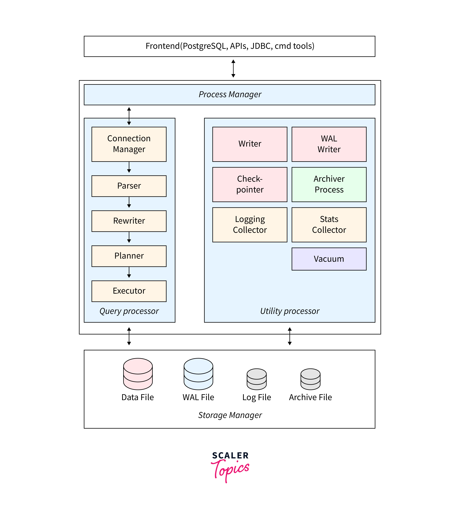 <a href="https://www.scaler.com/topics/postgresql/postgresql-administration/" target="_blank" style="position: absolute; bottom: -8px; right: 4px; font-size: 12px;">[src]</a> 
 -->

<!-- ## IV
---

### **4.1. Distribution and Alternatives**

 

A single-node database eventually hits the limits of one machine's CPU, memory, or storage. Scaling beyond it requires distributing data and computation across nodes, which introduces partial failures, network partitions, and clock skew as fundamental constraints. [Replication]() copies data to multiple nodes for fault tolerance and read throughput. [Leader-follower]() (primary-replica) replication, the model PostgreSQL's streaming replication uses, routes all writes through a single leader that propagates changes to followers via WAL shipping (§2.3). [Multi-leader]() and [leaderless]() (e.g. Dynamo-style) replication admit concurrent writes at multiple nodes, introducing conflict detection and resolution.

[Partitioning]() (or sharding) divides a dataset across nodes so that each node handles a subset of the data. [Range partitioning]() assigns contiguous key ranges to each node, supporting efficient range queries but risking hot spots under skewed access. [Hash partitioning]() distributes keys uniformly but sacrifices range locality. [Consistent hashing]() (e.g. DynamoDB, Cassandra) minimises data movement when nodes join or leave. Distributed transactions across partitions require coordination protocols such as [two-phase commit]() (2PC), which guarantees atomicity but blocks if the coordinator fails, since participants hold locks while awaiting a decision that may never arrive. PostgreSQL does not natively shard, but extensions such as [Citus]() add distributed query execution and hash-based sharding on top of the PostgreSQL engine.

The difficulty of distributing ACID transactions motivated alternative data models. The [NoSQL]() movement (late 2000s) traded some relational guarantees for horizontal scalability and schema flexibility: [key-value stores]() (e.g. Redis, DynamoDB) for sub-millisecond lookups, [document databases]() (e.g. MongoDB) for schema-flexible hierarchical data, [wide-column stores]() (e.g. Cassandra, HBase) for high write throughput, and [graph databases]() (e.g. Neo4j) for relationship-heavy traversals. [NewSQL]() systems (e.g. CockroachDB, Google Spanner, TiDB) later recovered what NoSQL abandoned, combining horizontal scalability with full ACID transactions via consensus protocols (Paxos in Spanner, Raft in CockroachDB and TiDB) and clock mechanisms ([TrueTime]() in Spanner, [hybrid logical clocks]() in CockroachDB) for global ordering.

### **4.2. Storage Engines**

 

Independently of the data model, the choice of storage engine determines the write/read tradeoff at the physical level. The [B+ tree]() (§1.3), used by PostgreSQL and InnoDB, updates pages in place, offering predictable read latency but requiring random I/O on writes. [LSM trees]() (Log-Structured Merge trees), used by RocksDB, Cassandra, and LevelDB, buffer writes in a [memtable]() and periodically merge sorted runs to disk via [compaction](), offering superior write throughput at the cost of [read amplification]() from checking multiple levels and [write amplification]() from repeated compaction. Many NewSQL systems (e.g. TiDB, CockroachDB) layer SQL processing on top of RocksDB, combining relational semantics with LSM write performance.

On the analytical side, the OLTP/OLAP distinction (§1.2) has driven architectural divergence. [Data warehouses]() (e.g. Snowflake, BigQuery, Redshift) optimise for large-scale aggregations over column-oriented storage with techniques such as late materialisation and dictionary encoding. [HTAP]() (Hybrid Transactional/Analytical Processing) systems aim to serve both workloads from a single engine, typically by maintaining a row store for transactions and a column store for analytics, synchronised via internal replication.

### **4.3. Vector Search**

 

ML pipelines interact with databases at multiple stages, from training data extracted via SQL or batch export, through [feature stores]() (e.g. Feast, Tecton) maintaining offline stores for training and online stores for low-latency inference, to serving-time queries for real-time features (e.g. user history, product metadata). The newest intersection is [approximate nearest neighbour]() (ANN) search over high-dimensional embedding spaces, driven by the rise of dense retrieval and large language models.

[Vector databases]() (e.g. Pinecone, Milvus, Weaviate), vector search libraries (e.g. FAISS), and vector extensions to existing databases (e.g. [pgvector]() for PostgreSQL) index vectors using structures such as [HNSW]() (Hierarchical Navigable Small World graphs), which builds a multi-layer navigable graph for logarithmic search time, or [IVF]() (Inverted File Index) with product quantisation for memory-efficient billion-scale search. This capability underpins [retrieval-augmented generation]() (RAG), recommendation systems, and semantic search. pgvector integrates ANN search directly into PostgreSQL, allowing vector similarity queries alongside relational joins and ACID transactions in a single system.
-->
