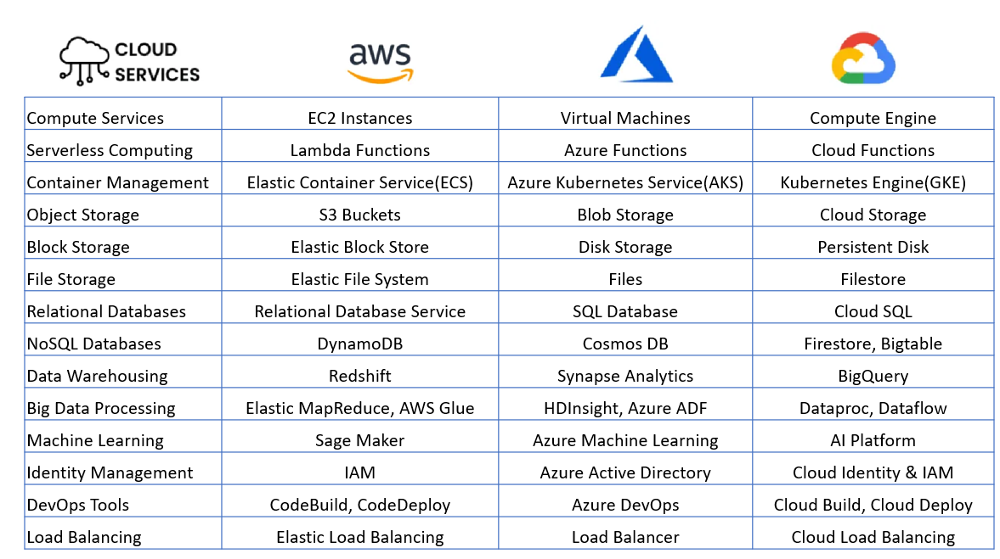
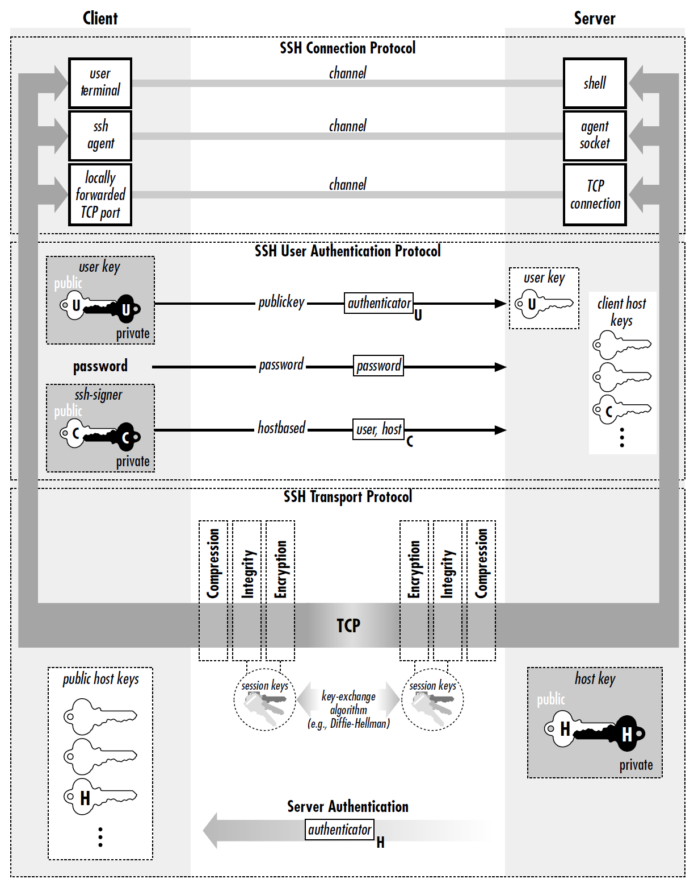

# Virtualisation
---
> Hardware used to dictate what software could do until virtualisation inverted the relationship. Since IBM CP-40 (1967), the story has run "abstract the machine away" $\to$ "slice it thinner" $\to$ "pack more workloads onto fewer boxes". Hypervisors virtualise entire computers, containers isolate without duplicating the kernel, and orchestrators now manage thousands of both.

<!-- - https://www.youtube.com/watch?v=zh0OMXg2Kog -->

<!-- Horizontal (within Section I): how to virtualise one resource more completely
  - 1.1 VM concept → 1.2 CPU virtualisation (x86 problem → solutions) → 1.3 all hardware (CPU + memory + storage + network)
Vertical (across sections): moving up the stack
  - Section I: virtualise hardware (full machine emulation)
  - Section II: virtualise OS (share kernel, isolate processes)
  - Section III: orchestrate many containers at scale -->

## I
---

### **1.1. Virtual Machine**

 

A [virtual machine]() (VM) is a software abstraction of a physical computer (e.g. CPU, RAM, NIC) solid enough that an unmodified guest OS boots on it. This full-hardware form is known as the [system VM](), as opposed to the process VM (§602#3.1). How guest instructions reach the physical CPU spans an axis. Specifically, [emulation]() translates instructions of a foreign ISA in software (e.g. the [quick emulator]() (QEMU) running an x86 guest on an ARM host). Whereas, [virtualisation]() executes guest code natively on the host with shared ISA, and intercepts the instructions touching privileged machine state. So, one machine carries isolated workloads, not one application at 10-15% utilisation.

The component that performs this interception is the [hypervisor]() (aka. [VM monitor]()), which creates, schedules, and manages VMs. [Type 1 hypervisors]() run directly on host hardware without an underlying OS (e.g. VMware ESXi, MS Hyper-V: Azure). [Type 2 hypervisors]() run as applications on a conventional OS (e.g. VMware Workstation), trading performance and isolation for convenience. The [kernel-based VM]() (KVM, 2007) is a Linux kernel module, making the kernel itself the hypervisor, as in Type 1 by privilege yet Type 2 by packaging. Hence, KVM reuses Linux's features (e.g. the scheduler, memory allocator, and device drivers), and both AWS and GCP build their clouds on it.

[Popek and Goldberg (1974)](https://dl.acm.org/doi/10.1145/361011.361073) formalised when such interception can rest on hardware privilege alone. It states that deprivileging the guest makes every sensitive instruction trap of its own accord, and [trap-and-emulate]() suffices where sensitive $\subseteq$ privileged, with an instruction being i) [sensitive](): if it alters or depends on the machine's configuration; and ii) [privileged](): if it traps outside the highest privilege level. For example, IBM's System/370 satisfied the inclusion by design and virtualised cleanly for decades. x86 instead executes a number of sensitive instructions in user mode without trapping, and therefore, falls outside the theorem and forces software workarounds. 


1. 1960s: IBM mainframes virtualised cleanly (CP-40, 1967). P-G formalised why it worked (1974). Trap-and-emulate was sufficient.
2. 1980s-90s: x86 rose to dominance but violated P-G. Nobody cared because mainframes were where virtualisation lived.
3. Late 1990s-2000s: x86 servers needed virtualisation (server consolidation). Software workarounds filled the gap (VMware BT 1999, Xen paravirt 2003).
4. 2005-06: Intel/AMD added hardware support (VT-x, AMD-V). Problem solved at the CPU level.
5. Then: EPT/NPT for memory, SR-IOV for networking, etc.
§I follows logical dependency (theory → CPU problem → all resources) rather than strict chronology.


<!-- - 
   trap-and-emulate on a Type 1 hypervisor <a href="https://dev.to/mdraevich/virtualization-emulation-explained-in-a-top-down-fashion-2of8" target="_blank" style="position: absolute; bottom: 4px; left: 4px; font-size: 11px;">[src]</a> 
 -->

- 
 <iframe src="../assets/blog/hypervisor-kvm.html" width="530" height="181" style="border: none; overflow: hidden; display: block;" scrolling="no"></iframe> 
Type 1 owns the hardware, type 2 a host OS (left). KVM occupies the former's position with an OS's contents (right).
 

### **1.2. Trap and Emulate**

 


Arc: the x86 hole, then two eras of filling it.
  p1: the defect — seventeen sensitive-unprivileged instructions fail silently, nothing traps
  p2: software fills the gap — BT rewrites the instruction stream, paravirt rewrites the kernel
  p3: hardware closes it — VT-x/AMD-V make every sensitive instruction exit, KVM/QEMU package it


On x86 the hypervisor claims the highest privilege level, so a guest kernel runs deprivileged while still expecting an authority the hardware no longer grants it. [Robin and Irvine (2000)](https://www.usenix.org/legacy/events/sec00/full_papers/robin/robin.pdf) counted seventeen Pentium instructions that are sensitive but not privileged, and rather than trapping they execute with the wrong semantics. *POPF* restores the flags register yet silently discards the interrupt-flag bit when the caller is unprivileged, so a guest that disables interrupts merely believes it has, and *SGDT* leaks the host's descriptor-table register into guest memory. The hypervisor observes neither, so trap-and-emulate has nothing to intercept. <!-- trim: "believes it has succeeded while the hardware ignores it" -->

Two software workarounds emerged. VMware (1999) introduced [binary translation](), scanning the guest instruction stream at runtime and rewriting sensitive instructions into safe sequences that trap or emulate correctly. It stayed tractable since only kernel-mode code required translation while user-mode code ran directly on the CPU, and cached translated blocks amortised the cost. Xen (2003) took the opposite path with [paravirtualisation](), modifying the guest kernel to replace sensitive instructions with [hypercalls]() to the hypervisor, which outruns translation but demands the kernel source, so an unmodified guest such as Windows cannot boot.

Intel [VT-x]() (2005) and [AMD-V]() (2006) eliminated both in hardware. A new non-root execution mode and a [VM control structure]() (VMCS) make sensitive instructions [VM exit]() regardless of privilege level, so the P-G inclusion holds again, after which the hypervisor adjusts guest state and *VMRESUME* returns control. The first generation nonetheless lost to binary translation on exit-heavy workloads, as a round trip cost roughly a thousand cycles against a cached block's none, and hardware prevailed only as exit latency fell and the CPU absorbed page-table shadowing too. KVM exposes it to user space through */dev/kvm*, while QEMU emulates the remaining devices.

- 
 
  <a href="https://dgtlinfra.com/server-virtualization/" target="_blank" style="position: absolute; bottom: -8px; right: 4px; font-size: 11px;">[src]</a> 
 
Trap-and-emulate on the left, a hypercall from a modified kernel on the right.
 

<!-- - 
  <a href="https://idery-123.tistory.com/74" target="_blank" style="position: absolute; bottom: -8px; right: 4px; font-size: 11px;">[src]</a> 
 -->

### **1.3. Resource Virtualisation**

 


Arc: the same three moves per resource — abstract, isolate, overcommit.
  p1: CPU — vCPUs, m:n overcommit, lock-holder preemption as the cost
  p2: memory — two composed mappings (shadow vs EPT), then capacity (ballooning, KSM)
  p3: disk — one host file; thin provisioning and snapshots defer their bills, yet storage stays cheapest to overcommit
  p4: network — software path first (vswitch, VirtIO), then the hardware bypass (SR-IOV) at the price of mobility
  p5: the payoff — a VM is state plus files, hence live migration, hence the cloud (EC2 2006)


Just as an OS multiplexes processes onto shared hardware, a hypervisor multiplexes VMs one level below. Every resource undergoes the same three moves of abstraction, isolation, and overcommitment. For example, the [virtual CPU]() (vCPU) abstracts the physical CPU, and the hypervisor schedules each vCPU onto the host's cores. Moreover, [overcommitment]() schedules $m$ vCPUs onto $n < m$ physical cores (e.g. $m/n \approx 3$ for general workloads) as VMs rarely demand full CPU at once. The guest scheduler however never sees the hypervisor preempt its vCPUs, and so suffers [lock-holder preemption](), where guest threads spin on a lock whose holder has been descheduled.

For memory, each VM sees its own physical address space, so translation composes two partial functions, the guest's $\pi_g$ (guest-virtual $\rightharpoonup$ guest-physical) and the hypervisor's $\pi_h$ (guest-physical $\rightharpoonup$ host-physical). In practice, [shadow page tables]() materialised it but trapped on every guest update, and [extended page tables]() (Intel EPT, AMD NPT) evaluate it lazily in hardware. <!-- Each access of the guest's walk then requires its own EPT walk, so a TLB miss on 4-level paging can cost up to (4+1)x(4+1)-1 = 24 memory references, yet cheaper than the shadow tables' traps. --> Capacity can also be overcommitted. [Memory ballooning]() inflates a driver in the guest until it surrenders frames, whereas a driverless guest leaves the host blind swapping. <!-- which may page out frames the guest already considers free --> [Kernel same-page merging]() (KSM) deduplicates identical pages across VMs via copy-on-write and trades a background scan for density.

A [virtual disk]() appears to the guest as a block device yet is one ordinary host file (e.g. QEMU's QCOW2). <!-- also VMDK (VMware), VHD (Hyper-V) --> Under [thin provisioning](), a disk declared as 100 GB is an upper bound whose file grows monotonically from near zero, and the host might hold only the 20 GB written. A [snapshot]() freezes the file read-only and chains a differencing file for later writes. Rollback is hence instant. Copy-on-write operates at cluster granularity, and a long chain pays read amplification on every lookup. Thin provisioning meanwhile lets the promised sizes sum past the host's capacity. Guests filling their disks then exhaust it. Nonetheless, storage stays the cheapest resource to overcommit.

<!-- dropped p4: The guest, for its part, formats the disk with its own filesystem (e.g. ext4, §603#3.3). A guest file is hence bytes within a guest filesystem within a host file within the host filesystem. The two storage stacks compose just as the two page tables do. The host accordingly sees the image as one opaque file and never the files inside it. This opacity is storage's share of the isolation. A shared folder (e.g. virtiofs) breaches it deliberately, serving a host directory to the guest past the virtual disk. -->

The hypervisor connects each VM's virtual NIC to a [virtual switch](), which forwards frames among co-resident VMs at memory speed and sends the rest out the physical NIC. Most cloud VMs use [VirtIO](), a standardised paravirtual interface whose shared-memory rings spare the hypervisor from emulating real hardware. For bare-metal performance, [SR-IOV]() discards the software layer. One physical NIC presents [virtual functions]() assigned directly to VMs, and an [IOMMU]() (Intel [VT-d]()) confines each function's DMA to its VM's memory. A virtual function however is PCIe state that no other host can reconstruct, so migratable instances stay on VirtIO. <!-- trim: "Networking is where the software layer is most readily discarded altogether", "(e.g. Open vSwitch)", "assigned PCIe state rather than a software device" -->

Ultimately, a VM decomposes into runtime state and disk files. [Live migration]() moves this data between hosts, copies memory in rounds as the VM runs, and briefly pauses to transfer the final dirty pages and switch execution. <!-- typically under 100 ms downtime is best case; Clark et al. (2005) measured 60 ms to seconds --> Given that the rounds converge only while the transfer rate exceeds the dirtying rate, if the inequality fails, then throttling the guest restores it. [Post-copy]() inverts the pre-copy rounds, resumes on the destination, and faults pages on demand. A network failure mid-move strands state on both hosts and destroys the VM, so pre-copy stays the default. <!-- Consolidation packed underused servers onto fewer machines while multi-tenancy rented one machine to strangers. --> Hourly rental of such machines became [cloud computing](), e.g. AWS's [elastic compute cloud]() (EC2, 2006).

- 
 
  <a href="https://blog.devgenius.io/understanding-the-parallel-offerings-of-aws-azure-and-gcp-cloud-comparisons-c6a1068c267b" target="_blank" style="position: absolute; top: 4px; right: 4px; font-size: 11px;">[src]</a> 
 
Parallel service offerings across AWS, Azure, and GCP.
 

### **1.4. Remote Machine**

 


Arc: the cloud's product is a machine you never touch.
  p1: the rented instance — image + size + key pair, no console; IaaS
  p2: SSH — key-based trust replaces the machine-room door; host keys the other half
  p3: tunnels and bastions — the network folded back to localhost; one-at-a-time limit → §III


A cloud instance is a VM rented on provider hardware. Launching one reduces to three parameters, an image, a size, and a [key pair](). The provider only returns an IP address. That is, the machine exists only over the network without GUI console, and ownership barely begins by a remote login (e.g. *ssh -i key.pem ubuntu@203.0.113.7*), where later act passes through the same channel (e.g. deploying, debugging, rebooting). The rental of raw machines forms the cloud's lowest rung, known as [infrastructure as a service]() (IaaS), and one can easily find an [amazon machine image]() (AMI), the AWS-specific form of the image for whom to launch a writable virtual disk with a preinstalled OS.


ssh client — essentially universal, every mainstream Unix/Linux and macOS ships the OpenSSH client. sshd (server) — not by default:

  System                        sshd default
  ----------------------------  -----------------------------------------------
  macOS                         installed, off (Settings -> Remote Login)
  Ubuntu desktop                not installed
  Ubuntu server / cloud images  installed + on
  Debian                        prompts during install
  Lima VM                       on — that's how limactl shell works

The pattern: servers accept connections by default, workstations don't; fewer open ports, smaller attack surface. OpenSSH itself is not POSIX or "Unix" — it came from OpenBSD (1999) and became a de-facto standard by adoption.

Check yours:
  sudo systemsetup -getremotelogin   # macOS
  systemctl status ssh               # in the VM


[Telnet]() (1969) had sent every login in cleartext for anyone on the path to read. [Secure shell]() (ssh, 1995) replaced it with an encrypted shell, whose server half [ssh daemon]() (*sshd*) ships listening on TCP port 22 in every cloud image. Running *ssh* connects to it, the pair negotiate a session key, and *sshd* starts a shell (§603#2.2) on the remote machine, so the local terminal drives a remote process with every keystroke and reply encrypted in transit. As with pthreads and NPTL (§604#2.2), SSH is the protocol and [OpenSSH]() (OpenBSD, 1999) the implementation that prevailed by adoption. Its *ssh*, *sshd*, and *ssh-keygen* are the programs (§602) one invokes in practice.

The trust model inverts TLS's (§605#3.4) as no certificate authority vouches for both ends. Each side instead generates a key pair and hands over its public half. The client's lands out of band in the instance's *~/.ssh/authorized_keys* before the first login. <!-- i.e. at first boot for the launch key --> The server holds its own pair, the [host key]() generated at first boot, and sends the public half inside the handshake. Its fingerprint<!-- i.e. a SHA-256 hash --> is accepted at the client's first connection, the key then stored in *~/.ssh/known_hosts* to validate the server thereafter. Under this setup, both proves possession by signing a nonce with the private half, which never travels, and a mismatch signals a different machine at the address or interception. <!-- why verify the server at all when it already holds our pubkey: an address is not an identity — DNS gets poisoned, ARP spoofed, routes hijacked, so reaching 10.0.0.5 never proves the answering machine is yours. Client auth answers "is this alice?" and says nothing about "is alice talking to the right machine?" — both questions need answering, hence both keypairs -->

A single connection multiplexes independent channels, and the one of type session executes remote work as exactly one request, i) *shell*: an interactive login, ii) *exec*: a single command (e.g. *ssh host 'docker compose up -d'*) running without a terminal and thereby scriptable, iii) *subsystem*: a named service (e.g. *sftp*). The same connection also carries files using [secure copy]() (*scp*) and [remote sync]() (*rsync*), ports via *-L* and *-R*, and unreachable hosts via *-J* to a [bastion](). <!-- in *ssh -L 8888:localhost:8888* the destination resolves on the far side, binding a remote Jupyter to a client port, while *-R* reverses it and *-D* opens a [SOCKS]() proxy; the *-J* relay runs a second handshake inside the tunnel, so it forwards ciphertext and holds no credentials; a bastion is the single hardened host exposed to the internet, and [agent forwarding]() lends the key onward without copying it --> The unit of deployment however remains the entire machine, as its image ships an OS per application, and packaging the application alone is left as a separate problem. <!-- installed by hand one *apt-get* at a time -->


From ssh-keygen to ssh-copy-id, both sides:

        CLIENT (your Mac)                      SERVER (host)
        -----------------                      -------------

  1. ssh-keygen -t ed25519 -f ~/.ssh/id_x
        |
        +-- id_x       (private) -- stays here, NEVER leaves
        +-- id_x.pub   (public)  -- safe to hand out

                                        0. admin: sudo useradd -m alice
                                             +-- creates /home/alice

  2. ssh-copy-id -i ~/.ssh/id_x.pub alice@host
        |
        |   ...... password, once ......>
        |                                    appends the pubkey to
        +----- id_x.pub ---------------->    /home/alice/.ssh/authorized_keys
                                             chmod 700 .ssh
                                             chmod 600 authorized_keys

  3. ssh alice@host
        |
        |  <----- "prove it: sign this nonce" -----
        |
        |  sign with id_x (private)
        |  ------- signature -------------->  verify against each key in
        |                                     authorized_keys
        |  <---------- shell ---------------

  Step 3's key idea: the private key is never transmitted. The server sends a
  random challenge, the client signs it, the server verifies with the public
  key it already has — nothing reusable crosses the wire, so a captured
  session replays to nothing.

  Who holds what:
    id_x             client only     private key
    id_x.pub         client+server   public key
    authorized_keys  server, ~user   public keys allowed to log in as that user
    known_hosts      client          the server's host key

  Two separate authentications happen in step 3, and this trips people up:
    server proves itself to you  -> known_hosts
    you prove yourself to server -> authorized_keys

    CLIENT                                SERVER
    own private key                       own private key
    own public key  ──────────────▶       (stored in authorized_keys)
    (stored in known_hosts) ◀──────────── own public key

  Each side generates its own pair, keeps its private half forever, and gives
  the other side a copy of its public half. Both directions run the same
  signing proof, independently:
    server challenges client -> client signs -> checked against authorized_keys
    client challenges server -> server signs -> checked against known_hosts

  The proofs are symmetric; the key exchanges are not:
  ┌─────────────┬───────────────────────────────────────────┬──────────────────────────┐
  │             │         Client's pubkey → server          │ Server's pubkey → client │
  ├─────────────┼───────────────────────────────────────────┼──────────────────────────┤
  │ when        │ before first login                        │ during first connection  │
  ├─────────────┼───────────────────────────────────────────┼──────────────────────────┤
  │ how         │ out-of-band (admin, cloud-init, web form) │ sent over the wire       │
  ├─────────────┼───────────────────────────────────────────┼──────────────────────────┤
  │ stored as   │ authorized_keys                           │ known_hosts              │
  ├─────────────┼───────────────────────────────────────────┼──────────────────────────┤
  │ trust basis │ someone vouched for it                    │ you clicked yes (TOFU)   │
  └─────────────┴───────────────────────────────────────────┴──────────────────────────┘

  The server's half thus arrives automatically inside the handshake, before
  any authentication; the client's half cannot — hence cloud-init. The one
  manual act is typing yes once.

  And step 0 means the admin must make the very first move — ssh cannot
  bootstrap itself; someone with existing privilege creates the account.

  On a cloud VM that admin is a machine: the provider's agent (cloud-init) 
  runs useradd and plants your pubkey at first boot, from the key you hardened
  the console at creation. Privilege has to already exist somewhere — the chain
  of trust ends at whoever owns the hardware or the hypervisor.

  How the pubkey physically arrives (Lima, same shape as AWS): the host bakes
  user.pub into a cloud-init seed ISO and attaches it as a virtual CD-ROM;
  the guest's cloud-init reads it at first boot and writes authorized_keys.
  So the first mover is the hypervisor — write access to the guest's disk
  before the guest exists, a channel more privileged than any network login.
  AWS injects the launch key pair identically.

  Verify:
    cat ~/.lima/_config/user.pub                 # host: the injected key
    cat ~/.ssh/authorized_keys                   # guest: should match it
    sudo grep -i ssh /var/log/cloud-init.log     # guest: the injection logged


- 
 
 
  
 <a href="https://devopedia.org/secure-shell" target="_blank" style="position: absolute; bottom: -4px; right: 8px; font-size: 11px;">[src]</a> 
 
The transport layer authenticates the host and derives session keys, the next authenticates the user, and the last multiplexes channels.
 

## II
---

### **2.1. Container**

 

[Containerisation]() shares a single host kernel rather than booting one per instance, and thus [OS-level virtualisation]() reduces the unit to its application, startup to sub-seconds, and footprint to $\text{MB}$s at the cost of weaker isolation. In fact, a production-ready container generally runs inside a VM, where the hypervisor and the container separate tenants and services, respectively. <!-- e.g. a Docker Compose stack on an EC2 instance --> The asymmetry reaches access, as the docker group yields host root by mounting the host's root directory into a container, while an SSH key yields one VM's own root. So, the [container]() is not a kernel object, but a runtime-assembled configuration of namespaces and cgroups, an ordinary process to the host. <!-- visible in plain *ps*; entering one is therefore a system call, as *docker exec* drops a fresh host process into the container's namespaces with *setns()*, whereas a VM owning its own kernel offers no such handle and admits only a network login (§1.4) -->


Two hops, two mechanisms:

        YOUR LAPTOP                              EC2 INSTANCE (a VM)
        ───────────                              ───────────────────

  terminal
     │
     │   ssh -i key.pem ubuntu@1.2.3.4
     └──────────────────────────────────────▶  sshd  ──▶  bash  (you are here)
                                                            │
                                                            │  docker ps
                                                            ▼
                                              ┌─────── Linux kernel ────────┐
                                              │                             │
                                              │   dockerd                   │
                                              │     │                       │
                                              │     ├── container "api"     │
                                              │     │     PID 1: uvicorn    │
                                              │     │                       │
                                              │     └── container "db"      │
                                              │           PID 1: postgres   │
                                              │                             │
                                              │   (one kernel, shared)      │
                                              └─────────────────────────────┘

  ssh          crosses a machine boundary    (laptop -> EC2, over the network)
  docker exec  crosses a namespace boundary  (EC2 -> container, same kernel)

  docker exec -it api bash   container "api" gains PID 7 bash (you); PID 1 uvicorn untouched
  docker exec api ls /app    PID 8 runs, prints, exits — no shell

Same goal, different hop — the container/VM distinction in one table:

                     limactl shell vm              docker exec -it api bash
  mechanism          ssh over TCP loopback         unix socket -> dockerd -> setns()
  auth               keypair + host key            file permissions on docker.sock
  the shell process  child of the guest's sshd     child of the host's dockerd
  works remotely     yes, it is just ssh           only through Docker's API

ps on the host shows a container's shell as an ordinary process, but never a process inside
a Lima guest — there one sees only qemu, a single opaque blob.

docker's -i keeps stdin open and -t allocates the PTY; without a PTY ~/.bashrc largely does
not run and $PATH differs from an interactive login.


A [namespace]() (_kernel/nsproxy.c_) wraps a global kernel resource (e.g. the proc table), so processes inside see their own isolated instance, and _clone()_ with the desired flags assembles a container from the eight types Linux provides, i) pid: provides each container a PID tree rooted at 1; ii) net: gives it a private network stack; iii) mnt: swaps the visible root filesystem via _pivot\_root()_; and iv) user: maps the container's UID 0 to an unprivileged host UID, enabling rootless containers. The remaining four, uts, ipc, cgroup, and time, isolate the hostname, IPC objects, cgroup root, and boot clock. <!-- a container's PID 1 still occupies the host's default pid namespace --> A namespace, however, bounds what a process sees rather than what it consumes.

A [cgroup]() (_kernel/cgroup/_) organises processes into hierarchical groups and caps its hardware resources, so precludes a single container from exhausting host memory or monopolising the CPU. The kernel enforces limits on CPU shares, memory, I/O bandwidth, and device access, with the memory limit enforced by an OOM killer scoped to the cgroup. Specifically, it throttles a container that exceeds its CPU quota yet kills one that breaches its memory cap. Born of Google's [Borg](https://research.google/pubs/large-scale-cluster-management-at-google-with-borg/?hl=it) (2003), cgroups entered Linux 2.6.24 (2008), and later cgroups v2 unified v1's fragmented hierarchies into one tree and added per-cgroup pressure stall information (PSI) for observability. <!-- both features are documented in the Linux [man-pages](https://man7.org/linux/man-pages/) project -->

Given that namespaces bound what a process sees and cgroups what it consumes, neither bounds what it may ask the kernel to do. Three further mechanisms supply the missing bound, i) [Linux capabilities](): root's authority split into roughly forty independent privileges, thus a container binds a low port without also being able to load kernel modules; ii) [seccomp](): every system call screened by a [Berkeley packet filter]() (BPF) program, narrowing the reachable kernel surface to the syscalls the application truly requires; and iii) [security modules]() (e.g. AppArmor, SELinux): mandatory policy on file, socket, and capability access, which even the container's root cannot alter.


Host kernel (single instance)
│
├── Container 1 (namespaces)              Container 2 (namespaces)
│   PID:   1(nginx)  2(worker)            PID:   1(flask)  2(gunicorn)
│   Net:   eth0 172.17.0.2                Net:   eth0 172.17.0.3
│   Mnt:   / → /var/lib/.../ct1           Mnt:   / → /var/lib/.../ct2
│
└── Host view (default namespace)
    PID:   1(systemd) ... 3847(nginx) 3848(worker) 3901(flask) 3902(gunicorn)

Container 1's nginx thinks it is PID 1, but the host sees it as PID 3847.
Same process, different namespace views.


- 
 
 
  
 <a href="https://bunny.net/academy/computing/what-is-a-linux-namespace-and-container-isolation/" target="_blank" style="position: absolute; top: 4px; right: 4px; font-size: 11px;">[src]</a> 
 
Kernel features underlying containers (5 of 8 namespace types shown).
 

### **2.2. Docker**

 


Arc: one design commitment (immutability), examined at both times.
  p1: immutability declared (layered image model, why: shippability)
  p2: build-time benefit — immutable layers make recomputation skippable (cache)
  p3: build-time cost — deletions don't delete (whiteouts, bloat), mitigated structurally
  p4: run time — immutability preserved by pushing all mutation into one writable layer
  p5: run-time cost — the writable layer is mortal and expensive (copy-up)
  p6: the escape — mounts route around the layer entirely
Build half and run half mirror each other: mechanism/benefit, then cost, then mitigation.


Isolation itself was old, running from FreeBSD jails (2000) and Solaris Zones (2005) to Linux's [LXC](https://linuxcontainers.org/) (2008). Yet none made a workload shippable while dependency packaging remained manual. [Docker]() (2013) resolved it with a declarative, layered image model, where an [image]() on disk is an immutable filesystem (fs) template, built once to serve many workloads. A [dockerfile]() prescribes the image's rootfs through FROM, RUN, and COPY steps, each yielding a content-addressed read-only layer (i.e. fs diff), so identical layers are stored once and skipped on pulls. That is, a Dockerfile captures the machine's setup as text, versioned and rebuilt rather than maintained by hand.

Every FROM chain bottoms out at *scratch*, an empty image that a distro's userland enters as a plain tarball of files. What enters above it varies by need, from a full distro userland (*ubuntu*, ~78 MB) through busybox-based [*alpine*]() (~7 MB) down to [distroless image]()s holding libc and the application binary alone. Formally, what an image bundles is a program's transitive dependency closure cut at the system call boundary (i.e. a userland but never a kernel). The [open container initiative]() (OCI) standardises image and runtime specifications to make images portable across compliant engines, and registries such as [docker hub]() and [elastic container registry]() (ECR) distribute them.


Image A: FROM ubuntu:22.04, installs flask → 2 layers [ubuntu, flask]
Image B: FROM ubuntu:22.04, installs nginx → 2 layers [ubuntu, nginx]

On disk, Docker stores 3 layers total, not 4. The ubuntu layer exists once
and both images reference it by digest. If you pull image B from a registry
and already have image A locally, Docker only downloads the nginx layer
since the ubuntu layer's digest already exists locally.


At build time, layer immutability decides what is recomputed. Each instruction's cache key derives from its parent layer's digest and the instruction itself, with a checksum of the copied files for COPY. A change at one step gives its layer a new digest, every later key inherits it through its parent, and the cache misses from that point down. This is also why Dockerfile order is structural rather than stylistic, as placing dependency manifests before application source confines a rebuild to the final steps. A RUN key is the command string rather than its effect, however, leaving _RUN apt-get update_ to reuse a stale layer until an earlier step changes or _--no-cache_ forces re-execution.


Where the bytes live: build context vs image filesystem.

YOUR MAC                                  IMAGE FILESYSTEM
/Users/yongseongkim/myapp/                (empty at FROM)
├── Dockerfile                            /
├── .dockerignore                         ├── bin/
├── requirements.txt                      ├── etc/     ← comes from python:3.12-slim
├── .venv/             ← ignored          ├── usr/
├── __pycache__/       ← ignored          └── ...
├── .git/              ← ignored
└── app/
    ├── main.py
    └── models.py

The Dockerfile:

FROM python:3.12-slim
WORKDIR /app
COPY requirements.txt .
RUN pip install --no-cache-dir -r requirements.txt
COPY . .
CMD ["python", "-m", "app.main"]

Instruction by instruction:

┌──────────────────────────────────────────────────────────────────┐
│ FROM python:3.12-slim                                            │
└──────────────────────────────────────────────────────────────────┘
   Downloads a prebuilt Debian filesystem with Python installed.
   Nothing of yours yet.

   IMAGE:  /
           ├── bin/  etc/  lib/
           └── usr/local/
               ├── bin/python3.12       ← the interpreter
               └── lib/python3.12/site-packages/   ← where pip installs

┌──────────────────────────────────────────────────────────────────┐
│ WORKDIR /app                                                     │
└──────────────────────────────────────────────────────────────────┘
   Creates /app INSIDE the image and cd's into it.
   Your Mac is untouched. No /app appears on your Mac.

   IMAGE:  /
           ├── bin/  etc/  usr/
           └── app/          ← new, empty.

┌──────────────────────────────────────────────────────────────────┐
│ COPY requirements.txt .                                          │
└──────────────────────────────────────────────────────────────────┘
        SOURCE = build context          DEST = relative to WORKDIR
        (your Mac folder)

   /Users/yongseongkim/myapp/
   └── requirements.txt     ─────────────►

   IMAGE:  /app/
           └── requirements.txt

┌──────────────────────────────────────────────────────────────────┐
│ RUN pip install --no-cache-dir -r requirements.txt               │
└──────────────────────────────────────────────────────────────────┘
   Executes NOW, at build time, cwd = /app.
   Reads /app/requirements.txt.
   Installs into site-packages — NOT into /app.

   IMAGE:  /app/
           └── requirements.txt

           /usr/local/lib/python3.12/site-packages/
           ├── fastapi/          ← packages
           ├── pydantic/            outside
           └── uvicorn/             /app

   Your Mac's .venv is irrelevant — never copied.
   The container IS the virtualenv. No venv needed inside.

┌──────────────────────────────────────────────────────────────────┐
│ COPY . .                                                         │
└──────────────────────────────────────────────────────────────────┘
   Everything from the build context, minus .dockerignore entries.

   /Users/yongseongkim/myapp/
   ├── Dockerfile           ──────►  /app/Dockerfile (ships unless .dockerignore lists it)
   ├── requirements.txt     ──────►  /app/requirements.txt (overwrites, same bytes)
   ├── app/main.py          ──────►  /app/app/main.py
   ├── app/models.py        ──────►  /app/app/models.py
   ├── .venv/               ──✕───   BLOCKED by .dockerignore
   ├── __pycache__/         ──✕───   BLOCKED
   └── .git/                ──✕───   BLOCKED by .dockerignore

   IMAGE:  /app/
           ├── Dockerfile
           ├── requirements.txt
           └── app/
               ├── main.py
               └── models.py

┌──────────────────────────────────────────────────────────────────┐
│ CMD ["python", "-m", "app.main"]                                 │
└──────────────────────────────────────────────────────────────────┘
   Runs NOTHING at build. Just records the default command.
   Executed later, when a container starts, with cwd = /app.
   -m finds the app package since the working directory joins sys.path.

The two directions:

BUILD TIME                          RUN TIME
docker build -t myapp .             docker run -v $(pwd):/app myapp
                                         │
   Mac folder ──COPY──► image            │  bind mount
   (a snapshot, one-way,                 ▼
    frozen into the image)          Mac folder ◄──live──► container
                                    (edits on either side are seen
                                     by the other)

A bind mount, unlike the compose example's named volume, shadows the
image's /app entirely — site-packages excepted, which lives outside it.


Immutability also decides what the image ships. A layer holds the files a step leaves behind rather than the commands it ran. Deleting a file in a later step hence removes nothing, because the new layer only adds a whiteout marker that masks the file, while its bytes remain in the earlier layer. Cleanup therefore belongs inside the instruction that creates the artefact (e.g. _RUN apt-get install ... && rm -rf /var/lib/apt/lists/\*_). Multi-stage builds answer the same problem structurally, where a _FROM ... AS builder_ stage compiles and a later stage copies only the artefact via _COPY --from_ into a minimal base or *scratch*, hence neither toolchain nor OS enters the shipped image.


What a base image ships:

Ships bash + full userland
  ubuntu, debian            apt, coreutils, the works
  postgres, mysql, redis    Debian-based by default
  python:3.12, node:22      full toolchain
  nginx                     Debian-based

Ships sh only (busybox — trimmed ls, ps, wget)
  alpine                                ~7 MB
  python:3.12-alpine, node:22-alpine    same tag pattern everywhere
  nginx:alpine, redis:alpine
  busybox

No shell at all
  gcr.io/distroless/*    Google's
  scratch                empty; for static Go/Rust binaries
  chainguard/*           distroless-style, security-focused

No shell also means no docker exec bash — a distroless container cannot be entered.


- 
 
  <a href="https://itnext.io/getting-started-with-docker-facts-you-should-know-d000e5815598" target="_blank" style="position: absolute; bottom: -10px; right: 2px; font-size: 11px;">[src]</a> 
 
The client only talks to the daemon, which pulls from the registry and runs containers.
 

At runtime, Docker turns an image into a container, an isolated process running the image's CMD, such as *["python", "-m", "app.main"]*, atop one writable layer. The CLI sends HTTP requests (e.g. build, run) to the [docker daemon]() via its REST API (§605#4.2) over a Unix socket (§603#3.1) or TCP. On _docker run_, the daemon delegates [containerd](), whose snapshotter stacks the writable layer over the image layers with OverlayFS. [Runc](), the OCI reference runtime, then creates the namespaces with _clone()_, applies cgroup limits, and starts the entrypoint as PID 1. On non-Linux hosts, [Docker desktop]() runs a hidden Linux VM whose OS is [LinuxKit](), a minimal distro assembled for the tasks. <!-- A Makefile is often used to wrap common docker and docker compose commands for convenience. -->


LXC (manual assembly via debootstrap, tarballs, or host copy):
  Full rootfs per container, no sharing
  Container A: /bin /lib /usr /etc ...  (2GB)
  Container B: /bin /lib /usr /etc ...  (2GB)
  Container C: /bin /lib /usr /etc ...  (2GB)
  Total: 6GB, no sharing

Docker (layered declaration):
  Dockerfile:
    FROM ubuntu:22.04        → layer 0 (base rootfs, 80MB)
    RUN apt-get install py3  → layer 1 (diff: +python3, 50MB)
    COPY app.py /app/        → layer 2 (diff: +app.py, 1KB)

  Container A: [layer 0] + [layer 1] + [layer 2] + writable
  Container B: [layer 0] + [layer 1] + [layer 3] + writable
  Container C: [layer 0] + [layer 4] + [layer 5] + writable
                  ↑              ↑
              shared (once     shared (once
              on disk)         on disk)


The writable layer is what keeps the image immutable, but it still fails persistent state in both permanence and performance. A container lives only while its PID 1 does, _docker rm_ deletes the stopped container with its writable layer, and the next redeploy erases any library installed into the layer (e.g. via _docker exec app apt-get install curl_). This erasure enforces [immutable infrastructure](), the discipline of replacing a running instance rather than patching it, so every environment change (packages, libraries, config) ships in a rebuilt image. <!-- rather than accumulating on the server --> A redeployment is then done by rm-and-run from the rebuilt image. Data however follows from no recipe and must survive elsewhere. <!-- _docker commit_ would instead snapshot the writable layer into a new image layer, and is shunned precisely because the result has no Dockerfile to rebuild it from -->

In contrast, performance fails when a container modifies a file held in a read-only layer. Specifically, the file cannot change in place, and so OverlayFS performs a [copy-up]() which duplicates it into the writable layer before the edit applies. This copy however spans the entire file even for a one-byte change. For instance, when an application issues INSERTs into a multi-gigabyte SQLite file shipped in the image, the first INSERT copies gigabytes while later ones edit the copy at normal speed. Reads meanwhile are exempt and pass through to the lower layers untouched. Deletion likewise adds a whiteout to the writable layer, the runtime twin of the build-time mask.

Mounts escape both problems by sitting outside the writable layer, while every mount covers the image content at its mount point (e.g. _/var/lib/postgresql/data_), leaving the files beneath unreachable while it holds. Docker offers i) [volumes](): Docker-managed directories (_/var/lib/docker/volumes/_) seeded from that content and outliving the container, for databases and other persistent data; ii) [bind mounts](): a chosen host path that hides the content and lives with the host directory, for live code reloading; and iii) [tmpfs](): an empty in-memory mount that dies with the container, for short-lived secrets (e.g. API tokens). A redeploy reattaches what the previous one wrote. 


One app (FastAPI + SQLite), written twice. Each BAD line violates one paragraph above.

\# BAD (Dockerfile):
  FROM python:3.12
  WORKDIR /app
  COPY . .                                <- p2: any edit invalidates every step below
  RUN apt-get update && apt-get install -y gcc
  RUN rm -rf /var/lib/apt/lists/*         <- p3: masks the bytes, the image keeps them
  RUN pip install uv && uv sync
  CMD ["uv", "run", "uvicorn", "main:app", "--host", "0.0.0.0"]
  \# app.db rides in via COPY . .          <- p5: first INSERT copy-ups it, docker rm erases it

\# GOOD (Dockerfile):
  FROM python:3.12 AS builder
  COPY --from=ghcr.io/astral-sh/uv:latest /uv /usr/local/bin/
  WORKDIR /app
  COPY pyproject.toml uv.lock .           <- p2: manifests before source, the cache holds
  RUN apt-get update && apt-get install -y gcc \
   && rm -rf /var/lib/apt/lists/*         <- p3: cleanup inside the creating instruction
  RUN uv sync --frozen --no-dev --no-install-project
  FROM python:3.12-slim
  WORKDIR /app
  COPY --from=builder /app/.venv .venv    <- p3: gcc and uv never enter the shipped image
  COPY main.py .
  CMD [".venv/bin/uvicorn", "main:app", "--host", "0.0.0.0"]

\# GOOD, extended (compose.yaml):
  services:
    api:
      build: .                            <- built from the Dockerfile above
      ports: ["8000:8000"]
      environment:
        DATABASE_URL: sqlite:////data/app.db
      volumes:
        - dbdata:/data                    <- p6: rows survive docker rm and redeploys
    cache:
      image: redis:7                      <- pulled prebuilt, no Dockerfile involved
  volumes:
    dbdata:

  $ docker compose up --build             <- builds api, pulls redis, starts both
  $ docker compose down                   <- removes containers, dbdata persists


- 
 
  <a href="https://peeknpoke.net/docker-volume-management/" target="_blank" style="position: absolute; top: 2px; left: 2px; font-size: 11px;">[src]</a> 
 
One host directory mounted into two containers at once.
 


Docker commands actually typed daily:
  docker ps -a
  docker logs -f NAME
  docker exec -it NAME bash
  docker build -t myapp .
  docker run -d -p 8080:8000 --name api myapp
  docker compose up -d --build
  docker system prune



Host filesystem (ext4/xfs)
┌─────────────────────────────────────────────────────────┐
│                                                         │
│  /var/lib/docker/overlay2/abc123/                       │
│  ┌───────────────────────────────────────────┐          │
│  │  R/W layer (CoW)                          │          │
│  │  nginx writes access.log here             │          │
│  │  ⚠ deleted on docker rm                   │          │
│  ├───────────────────────────────────────────┤          │
│  │  Layer 2  (RO)  COPY nginx.conf          │          │
│  ├───────────────────────────────────────────┤          │
│  │  Layer 1  (RO)  FROM nginx               │          │
│  └───────────────────────────────────────────┘          │
│                         ▲                               │
│                    OverlayFS merges                      │
│                         │                               │
│  ┌──────────────────────┴────────────────────┐          │
│  │         Container sees:                   │          │
│  │         /                                 │          │
│  │         ├── /etc/nginx/nginx.conf         │          │
│  │         ├── /var/log/nginx/access.log     │          │
│  │         ├── /data ──────────────────────┐ │          │
│  │         └── /src ─────────────────────┐ │ │          │
│  └───────────────────────────────────────┼─┼─┘          │
│                                          │ │            │
│         ┌────────────────────────────────┘ │            │
│         │ Volume                           │            │
│         ▼                                  │            │
│  /var/lib/docker/volumes/data/             │            │
│  ┌─────────────────────────┐               │            │
│  │  db files, uploads ...  │               │            │
│  │  ✓ survives docker rm   │               │            │
│  └─────────────────────────┘               │            │
│                                            │            │
│         ┌──────────────────────────────────┘            │
│         │ Bind mount                                    │
│         ▼                                               │
│  /home/user/src/                                        │
│  ┌─────────────────────────┐                            │
│  │  your source code       │                            │
│  │  edit on host →         │                            │
│  │  visible in container   │                            │
│  └─────────────────────────┘                            │
│                                                         │
└─────────────────────────────────────────────────────────┘


### **2.3. Docker Networking**

 


Arc: connectivity grows outward from an empty namespace, one radius at a time.
  p1: outbound (container → anywhere, via the host) — veth + bridge + masquerade
  p2: inbound (anywhere → container, via the host) — DNAT rewrites dst., and the firewall with them
  p3: sideways (container → container, one host) — user-defined bridges add DNS
  p4: cross-host (container → container, across machines) — VXLAN closes the L2 gap, orchestration takes the rest
Each radius has its cost attached to the mechanism that buys it.


A network namespace begins with nothing but a loopback interface, and a container therefore has no path off the host until one is built for it. Docker places one end of a [virtual ethernet]() (veth) pair inside the namespace as _eth0_ and enslaves the other to a software bridge (i.e. the [_docker0_]()). The bridge's address (172.17.0.1, private per RFC 1918, §605#2.1) then serves every container as its default gateway. The host thereby acts as an L2 switch among its containers (one broadcast domain, §605#1.3) and as an L3 router beyond them. <!-- a veth pair is a kernel device with two ends, one in each namespace --> Since no host elsewhere routes 172.17.0.0/16, an outbound packet from a container (e.g. 172.17.0.2) leaves masqueraded behind the host's address.

Inbound traffic must instead be published since an external client cannot name a private IP address. For instance, _-p 8080:80_ publishes via a [DNAT]() rule rewriting the destination (host:8080 to 172.17.0.2:80), while _EXPOSE_ merely records intent. <!-- trim: EXPOSE records intent as image metadata --> <!-- the DNAT rewrite happens ahead of the routing decision (PREROUTING); rules enter iptables at container start --> Docker also writes rules of its own via [iptables]() into the host's [firewall](), the rule list against which the kernel admits or drops every packet by its tuple $($address, port, protocol$)$. The kernel consults Docker's entries before those a tool such as UFW administers, thus a published port stays open to the LAN even after a deny, which holds only when placed in the DOCKER-USER chain that Docker checks first. <!-- trim: a userland docker-proxy covers the cases DNAT (PREROUTING) misses, loopback and hairpin traffic; it re-originates connections, so access logs attribute every request to the gateway 172.17.0.1 -->

Reaching other containers is a separate matter. The default _docker0_ affords L2 forwarding but no name resolution, so a container reaches another only by IP address, which restarts may reassign. <!-- a legacy of the deprecated --link flag that wrote peer entries into each container's /etc/hosts --> Docker instead provides [user-defined bridge networks](), carrying their own subnet (172.18.0.0/16, §605#2.1) with an embedded DNS server (127.0.0.11), which resolves container and alias names to current addresses. In practice, [Docker compose]() automatically creates one such network per project from a [YAML ain't markup language]() (YAML) file and starts containers in dependency order. <!-- trim: which is why its services address one another by name --> Containers on separate bridges remain isolated, as no rule forwards between them.


One stack (api + postgres), wired twice. Port 8080 published, LAN untrusted.

\# BAD (docker run, default bridge):
  docker run -d --name db postgres:16
  docker run -d --name api -p 8080:8000 myapp
  ufw deny 8080
  -> postgres://db:5432 fails to resolve  <- p3: docker0 has no DNS
  -> api resorts to db's 172.17.0.3       <- p3: reassigned on restart
  -> the LAN still reaches host:8080      <- p2: DNAT precedes UFW's chains

\# GOOD (compose.yaml):
  services:
    db:
      image: postgres:16              <- unpublished, reachable on the project network alone
    api:
      build: .
      ports: ["8080:8000"]              <- the only door the outside gets
      environment:
        DATABASE_URL: postgres://db:5432/appdb   <- p3: resolves via 127.0.0.11
      depends_on: [db]

  $ iptables -I DOCKER-USER -p tcp --dport 8000 ! -s 192.168.0.0/16 -j DROP
  ^ p2: post-DNAT, hence the container port; the chain Docker honours

Where the two wirings land:

  Internet
    ↑↓ NAT outbound, DNAT inbound (-p 8080:8000)
  Host
    ├── docker0 (L2 only, no DNS)          <- BAD
    │     db 172.17.0.2 ←──→ api 172.17.0.3
    └── myapp_default (L2 + DNS)           <- GOOD, compose auto-creates <project>_default
          db ←── by name ──→ api

  docker0 ←✗→ myapp_default: different bridges, isolated



<!-- trim (was p4, network drivers): the bridge buys isolation at a cost (veth traversal, NAT), and the remaining drivers decline to pay. --network host creates no namespace, so NAT and veth vanish, a bind to port 80 inside occupies the host's port 80, and -p loses its meaning. --network container:<id> joins the named container's namespace instead of creating one, so the two share one stack and reach each other over 127.0.0.1, the mechanism behind the Kubernetes pod. -->


The isolation hardens across machines. An L2 bridge is confined to its host, thus the _docker0_ bridges on two hosts each issue 172.17.0.0/16, and neither has a path to the other. An [overlay network]() supplies one by wrapping container frames in UDP packets between hosts ([VXLAN](), §605#1.2). <!-- containers on separate machines then communicate as if co-located --> Wrapping costs 50 header bytes, hence the MTU of 1450. Paths that filter ICMP break path MTU discovery (§605#1.3) and full-size packets vanish, thus overlay faults surface as hangs on large responses rather than refused connections. Reachability is nonetheless the smaller half. The larger half, scheduling and repairing workloads across machines, falls to orchestration.

- 
 
  <a href="https://dev.to/nobleman97/docker-networking-101-a-blueprint-for-seamless-container-connectivity-3i5b" target="_blank" style="position: absolute; bottom: -8px; right: 4px; font-size: 11px;">[src]</a> 
 
Default docker0 and a user-defined bridge, each an isolated subnet behind the host NIC.
 

## III
---

### **3.1. Container Orchestration**

 


Arc: declare the fixed point, then the machine that holds it, then the unit it holds.
  p1: the problem — production needs scheduling, healing, rollouts; orchestration reconciles toward a declared fixed point
  p2: the machine — etcd behind the API server, scheduler/controllers/kubelet each reconcile a slice
  p3: the unit — pod shares network/volumes/lifecycle, ephemeral by design


A single host suffices for development, but production must schedule workloads across a [cluster]() (a set of networked machines), restart failures, balance load, and roll out updates without downtime. [Container orchestration]() treats the pool as a single logical compute surface and maintains a [desired state]() (e.g. "run 5 replicas with 2 CPUs and 4 GB each") which a [control loop]() restores by correcting observed drift. The desired state is thus a fixed point of the reconcile map, toward which the loop drives the system anew after every disturbance, and declaring the fixed point rather than the path to it is what distinguishes orchestration from imperative commands. <!-- e.g. docker run; trim: "of this container", "computes the difference, and takes corrective action" -->

[Kubernetes](https://kubernetes.io/) (K8s <!-- K + 8 letters (ubernete) + s, same pattern as i18n and l10n -->), built at Google on Borg, open-sourced in 2014, separates a cluster into a [control plane]() and [worker nodes](). Cluster state lives in [etcd](), a Raft-replicated key-value store that only the [API server]() reads or writes, so every other component watches that entry point (§605#4.2), never the store. A [scheduler]() places pods by filtering infeasible nodes and scoring the rest. A [controller manager]() runs one control loop per resource type, each reconciling its slice. A [kubelet]() on each node starts its assigned pods through the [container runtime interface]() (CRI). Managed offerings ([EKS](), [GKE]()) host the control plane, typically leaving users nodes and workloads. <!-- trim: "a distributed key-value store replicated by Raft consensus", "rather than the store itself", "delegates container creation via the CRI to a runtime such as containerd or CRI-O" -->

A [pod]() is the fundamental scheduling unit, a group of one or more containers that share a network namespace, storage volumes, and a lifecycle. Most pods run a single container, but the abstraction allows co-locating tightly coupled containers as [sidecars]() (e.g. a web server alongside a log collector or service-mesh proxy) that share localhost and are scheduled together. <!-- Docker's --network container:<id> is the same move, one namespace joined by several containers --> Pods are ephemeral by design, as a rescheduled pod is a new pod with a new IP and a fresh filesystem rebuilt from the image rather than the old one relocated, so whatever an application keeps locally is lost at that moment. Stateless workloads absorb this, and stateful ones do not.


K8s manages containers across multiple machines automatically. You tell it what you want (desired state), and it figures out how to make it happen and keeps it that way.

Without K8s, you'd SSH into each server, run docker run manually, check if containers are alive, restart crashed ones, figure out which server has spare CPU, set up networking between them — all by hand or with fragile scripts.

K8s replaces all of that with one loop:
1. You submit a spec: "I want 5 copies of my app, each with 2 CPUs and 4 GB RAM"
2. The scheduler finds nodes with enough resources
3. The kubelet on each chosen node pulls the image and starts the containers (as pods)
4. The controller manager watches continuously — if a pod dies or a node goes down, it creates a replacement
5. A Service gives your pods a stable IP so other apps can find them regardless of which pods are alive




e.g. Airflow KubernetesExecutor submits a pod spec to the K8s API server, the scheduler picks a node, kubelet starts the container, and when the task finishes, the pod is cleaned up. If the node crashes mid-task, K8s reschedules it elsewhere.

Real-world example: DE hosted Airflow on EC2. I built a separate Airflow project
with a DAG (Python 3.13 + different libs). K8s solved the dependency isolation —
my DAG ran in its own pod with its own image, while DE's DAGs ran on the same
scheduler. The pod itself was lightweight (just API calls), orchestrating:
  Redshift (UNLOAD) → Glue (complex transformation) → PostgreSQL (INSERT)

EC2 Instance
┌──────────────────────────────────────────────┐
│  Airflow Scheduler                           │
│  ┌────────────────────────────────────────┐  │
│  │  DE's DAGs            My DAGs          │  │
│  │  (Python X.X)         (Python 3.13)    │  │
│  │      │                     │           │  │
│  └──────┼─────────────────────┼───────────┘  │
│         │              KubernetesExecutor     │
│         │                     ▼              │
│         │              ┌────────────┐        │
│         │              │ Pod (mine) │        │
│         │              │ py3.13+libs│        │
│         │              └─────┬──────┘        │
└─────────┼────────────────────┼───────────────┘
          │                    │
          ▼                    ▼
  ┌──────────────┐    Redshift → Glue → PostgreSQL
  │  DE's        │
  │  storage     │
  └──────────────┘


- 
 
  <a href="https://kubernetes.io/docs/concepts/architecture/" target="_blank" style="position: absolute; bottom: -8px; right: 4px; font-size: 11px;">[src]</a> 
 
Every arrow ends at the API server.
 

### **3.2. K8s Workloads**

 


Arc: one reconcile loop varied over different targets.
  p1: stateless — Deployment → ReplicaSet indirection, rolling update/rollback, HPA/Cluster Autoscaler
  p2: stateful — identity and ordered replacement (StatefulSet), then DaemonSet/Job/CronJob
  p3: what pods consume — config and secrets, storage claims and their failure domains
  p4: cluster hygiene — namespaces, quotas, RBAC, manifests as declared fixed points


A pod alone has no self-healing, so a failed node erases its pods. [Deployments]() close this gap for stateless applications with a replica count and a pod template, and find them by [label selector]() over [labels]() such as _app: nginx_. <!-- trim: "key-value pairs attached to K8s resources to express ownership" --> A Deployment acts only through a [ReplicaSet](), which holds one template, drives the matching pod count toward it, and replaces failures. That indirection makes updates reversible, as a [rolling update]() shifts replicas to a fresh ReplicaSet for the new template, while the old survives at zero so rollback shifts them back. The [Horizontal Pod Autoscaler]() resizes replicas on metrics, whereas the [Cluster Autoscaler]() adds nodes when pods fit on none. <!-- trim: "on CPU, memory, or custom metrics" --> <!-- trim: "attached to K8s resources to express ownership", "on CPU, memory, or custom metrics", "adds or removes nodes" -->


Scaling analogy: a bank with 5 identical teller windows. You walk in, take a number,
and get sent to whichever window is free. If one teller goes on break (pod dies),
the system stops sending people there and spins up a replacement. If the queue gets
long (CPU spikes), HPA opens more windows.

The full stack for an API on K8s:
- Deployment — declares replica count + pod template
- HPA — scales replicas by CPU/traffic
- Service — stable IP + load balancing across pods
- Ingress — external HTTP routing, TLS termination
- Cluster Autoscaler — adds/removes nodes as needed



Not every workload tolerates interchangeable replicas. A Raft or Kafka quorum addresses members by identity and expects each to return with its log, which a ReplicaSet cannot give since its pods are anonymous and their storage dies with them. [StatefulSets]() supply it, as each pod receives a stable ordinal name (pod-0, pod-1) and DNS record, a volume that survives rescheduling, and ordered startup and shutdown, so a rolling update replaces one member at a time. The remaining controllers vary the loop over other targets, where [DaemonSets]() run one pod per eligible node for node agents and device plugins, [Jobs]() run a pod to completion, and [CronJobs]() schedule them. <!-- trim: "rather than in parallel", "on a cron expression" --> <!-- trim: "rather than restarting the quorum in parallel", "rather than indefinitely" -->

Pods also need configuration and storage decoupled from the image. [ConfigMaps]() and [Secrets]() inject environment variables or mounted files so the same image runs unchanged across environments, though a Secret is base64-encoded rather than encrypted and is guarded only by etcd access control and RBAC until encryption at rest is configured. [PersistentVolumeClaims]() (PVCs) request storage from the cluster and [StorageClasses]() provision it dynamically (e.g. an EBS volume), which keeps manifests portable but binds the claim to the volume's failure domain, so a pod whose zonal volume has no schedulable node in its zone stays Pending. <!-- trim: "across development and production", "or a GCE persistent disk", "rather than moving to one that has room" -->

K8s [namespaces]() (distinct from Linux namespaces) partition a cluster into logical units (e.g. _dev_, _staging_, _prod_) that scope resource names and access policies. A [ResourceQuota]() caps the aggregate CPU and memory a namespace may claim, so one team's workloads cannot starve another's, and [RBAC]() roles bind permissions at the same boundary, so a user or service account holds rights within its namespace and nothing beyond. Every resource is declared as a YAML [manifest]() applied via [kubectl](), where _kubectl apply_ merges the declaration into the desired state held by the API server rather than issuing imperative commands, the same fixed point the control loops then maintain. <!-- trim: "the primary CLI" -->


docker CLI → Docker daemon → containers on one host
kubectl CLI → K8s API server → resources across a cluster

docker:
1. docker build -t myapp .          — build image from Dockerfile
2. docker run -p 8080:80 myapp      — start a container
3. docker ps                        — list running containers
4. docker logs <container>          — view container output
5. docker stop <container>          — stop a container

kubectl:
1. kubectl apply -f deployment.yaml — create/update resources from manifest
2. kubectl get pods                 — list running pods
3. kubectl logs <pod>               — view pod output
4. kubectl describe pod <pod>       — inspect pod details and events
5. kubectl delete pod <pod>         — delete a pod


- 
 
  <a href="https://dev.to/docker/from-zero-to-kubernetes-a-beginners-guide-to-orchestrating-docker-containers-leg" target="_blank" style="position: absolute; top: 4px; right: 4px; font-size: 11px;">[src]</a> 
 
Deployment drives replica scaling (3 to 5) and rolling updates.
 

### **3.3. K8s Networking**

 


Arc: a flat network, then the ladders built on it.
  p1: flat pod network without NAT — CNI plugins divide on encapsulation vs routes vs eBPF
  p2: stable names over unstable IPs — Service, kube-proxy datapath
  p3: the exposure ladder — NodePort → LoadBalancer → Ingress
  p4: series closer — isolation traded for density, microVMs in the middle


Kubernetes replaces the host-local bridge with a [flat network]() where every pod holds a cluster-routable address and reaches any other without NAT, so a service sees its caller's real address. <!-- trim: "the source address survives end to end", "rather than a gateway's" --> The cluster must now assign cluster-unique addresses and route them everywhere, the problem [CNI]() (container network interface) plugins solve. They divide on defaults, where Flannel encapsulates pod frames in VXLAN and pays the header cost to run anywhere, Calico advertises pod routes over BGP to travel unencapsulated wherever the underlay carries them, and Cilium programs the datapath in eBPF, which extends policy to L7 where Calico stops at L3/L4 and Flannel omits it. <!-- trim: "The burden this shifts is real", "make each one reachable from every other", "leaves policy to another plugin entirely" -->

Pod IPs change on every restart, so [Services](https://kubernetes.io/docs/concepts/services-networking/service/) typically provide a stable virtual IP ([ClusterIP]()) and DNS name that load-balance across whichever pods currently match a label selector. On each node [kube-proxy]() programs that mapping into iptables rules, whose count grows with services and endpoints, so newer clusters move to its nftables mode or an eBPF datapath that hashes to a backend in constant time. <!-- IPVS dropped: deprecated in v1.37, removal by v1.43, and it still rode on iptables underneath -->

Reaching a Service from outside the cluster is a separate ladder, where [NodePort]() opens the same port on every node from a default 30000-32767 range yet offers no single address to publish, [LoadBalancer]() puts a cloud load balancer in front of those ports and so supplies the address at the cost of one balancer per Service, and [Ingress]() (or its successor the [Gateway API]()) terminates TLS and routes on hostname and path so that many Services share one balancer, implemented by controllers such as Nginx Ingress or Traefik.

From hypervisors that virtualise entire machines, to containers that share a kernel, to orchestrators that schedule across clusters, each layer trades isolation for density and abstracts the one below it. [MicroVM]() runtimes (e.g. AWS Firecracker, which underpins Lambda and Fargate) and sandboxed runtimes (e.g. gVisor's user-space kernel) occupy the middle ground, and restore per-workload hardware isolation at near-container startup cost. The unit of deployment has moved from a physical server to a VM to a container to a pod, but the underlying goal is unchanged, to pack more workloads onto fewer boxes.

<!-- ### **3.4. ML Infrastructure** -->
<!---->
<!-- 
 
 -->
<!---->
<!-- GPU scheduling in Kubernetes requires the [NVIDIA device plugin](), a DaemonSet that registers GPU resources (*nvidia.com/gpu*) with the kubelet. When a pod requests a GPU via its resource limits, the scheduler places it on a node with available GPUs, and the device plugin mounts the appropriate */dev/nvidia** device nodes, driver libraries, and CUDA runtime into the container. The [NVIDIA GPU Operator]() automates the full stack, deploying GPU drivers, container toolkit, device plugin, and [DCGM]() (Data Center GPU Manager) for monitoring, as a set of Kubernetes-native resources that adapt to the host's hardware. -->
<!---->
<!-- For distributed training across multiple pods and nodes, [Kubeflow](https://www.kubeflow.org/) and its [Training Operator]() define custom resources (PyTorchJob, TFJob, MPIJob) that coordinate multi-worker training sessions. A PyTorchJob specification declares the number of workers and a master, and the operator handles pod creation, environment variable injection for rank and world size, and failure recovery (restarting failed workers while preserving the training run). -->
<!---->
<!-- Storage for ML workloads involves [PersistentVolumes]() (PVs) backed by network file systems (NFS), cloud block storage (EBS, GCE PD), or parallel file systems (Lustre, GPFS). [PersistentVolumeClaims]() (PVCs) decouple pod specifications from storage provisioning, and [StorageClasses]() enable dynamic provisioning so that requesting a PVC automatically creates the underlying volume. For large-scale training where datasets exceed terabytes, data pipelines often stream directly from object stores (S3, GCS) via FUSE mounts or specialised data loaders rather than pre-staging to persistent volumes. Monitoring and observability at this scale rely on [Prometheus]() for time-series metrics collection, [Grafana]() for visualisation and alerting, and log aggregation systems like [Fluentd]() or [Loki]() for debugging training failures across hundreds of pods. -->
