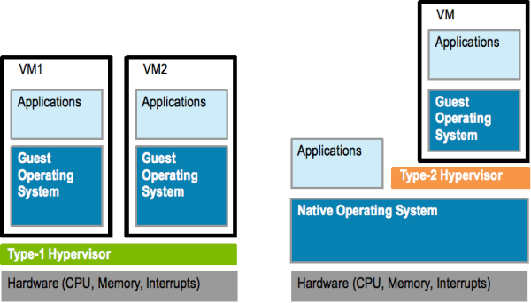
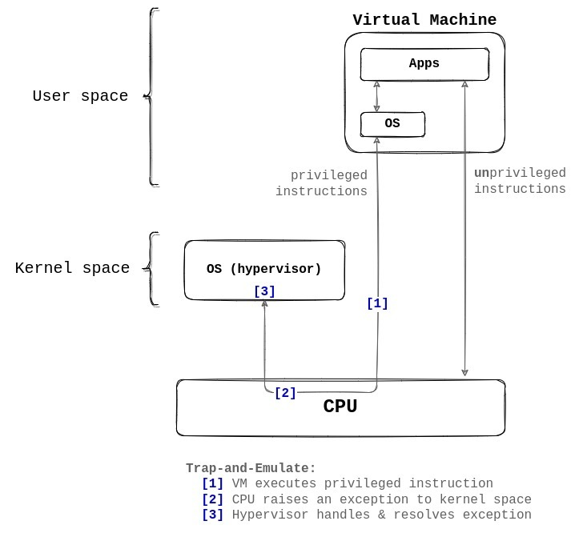
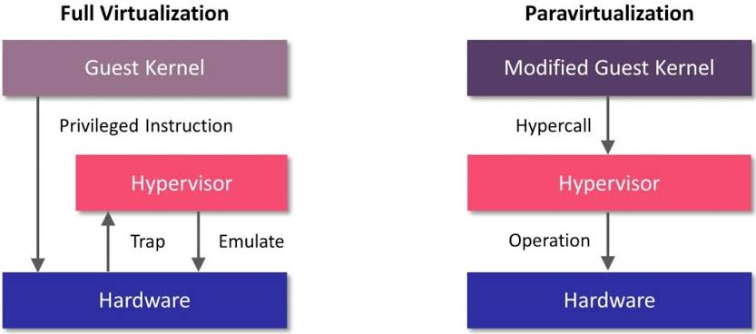
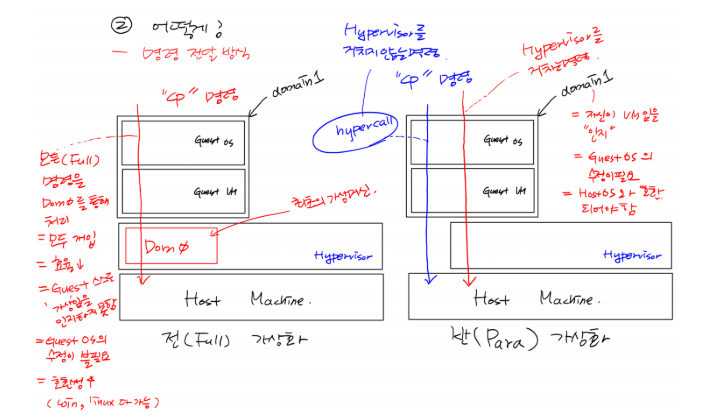
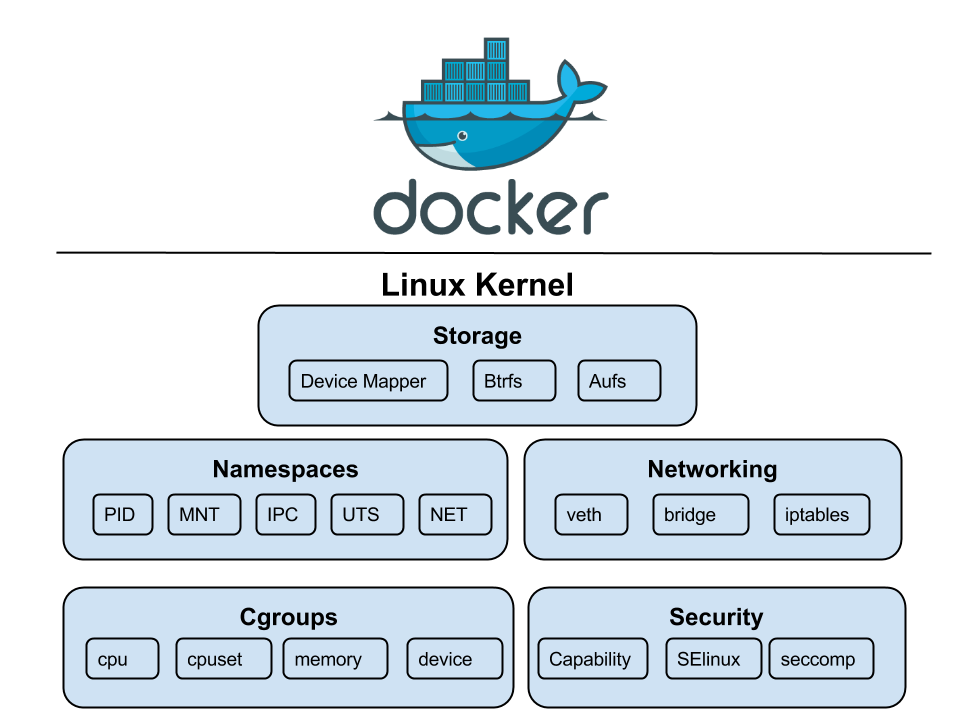
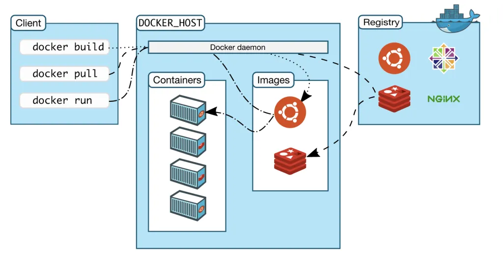
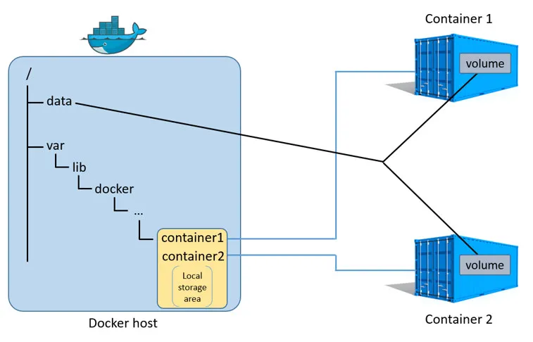
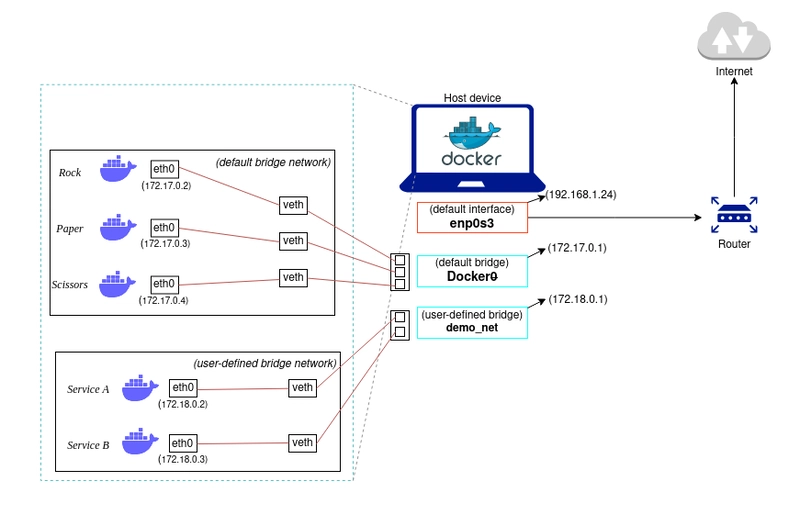
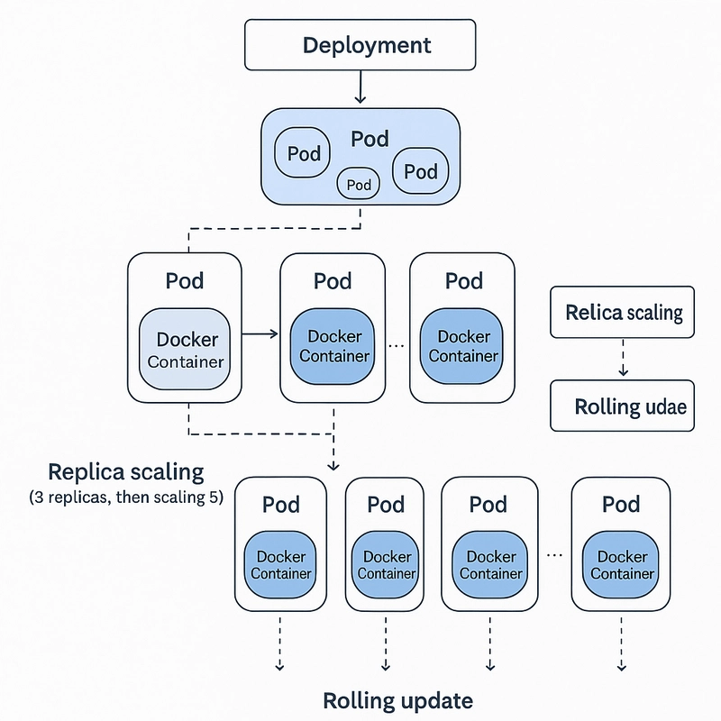

# Virtualisation
---
> Hardware used to dictate what software could do. Virtualisation inverted that relationship. Since IBM CP-40 (1967), the story has been to "abstract the machine away" $\to$ "slice it thinner" $\to$ "pack more workloads onto fewer boxes". Began with hypervisors that virtualise entire computers, then containers that isolate without duplicating the kernel, and now orchestrators that manage thousands of both.

<!-- - https://www.youtube.com/watch?v=zh0OMXg2Kog -->

<!-- Horizontal (within Section I): how to virtualise one resource more completely
  - 1.1 VM concept → 1.2 CPU virtualisation (x86 problem → solutions) → 1.3 all hardware (CPU + memory + storage + network)
Vertical (across sections): moving up the stack
  - Section I: virtualise hardware (full machine emulation)
  - Section II: virtualise OS (share kernel, isolate processes)
  - Section III: orchestrate many containers at scale -->

## I
---

### **1.1. Virtual Machine**

 

A [virtual machine]() (VM) is a software abstraction of a physical computer (e.g. CPU, RAM, SSD, NIC) that an unmodified guest OS boots. Such a system VM virtualises the full hardware, while a process VM (e.g. JVM, PVM, §602#3.1) does only bytecode ISA for a single program. [Virtualisation]() executes guest code natively on the host ISA and intercepts only sensitive operations, admitting many isolated workloads on a machine that historically ran merely one application at 10-15% utilisation. It is distinct from [emulation](), that does not execute guest code on the host CPU but translates a foreign ISA entirely in software, as when QEMU in TCG mode runs an ARM guest on an x86 host.

The component that performs this interception is the [hypervisor]() (aka. [VM monitor]()), which creates, schedules, and manages VMs. [Type 1 hypervisors]() run directly on host hardware without an underlying OS (e.g. VMware ESXi, MS Hyper-V: {Azure}). [Type 2 hypervisors]() run as applications on a conventional OS (e.g. VirtualBox, VMware Workstation), trading performance and isolation for convenience. KVM: {AWS, GCP} sits between the two, a kernel module that turns Linux itself into a Type 1 hypervisor while reusing Linux features, such as scheduler, memory allocator, and device drivers, rather than implementing its own.

[Popek and Goldberg (1974)](https://dl.acm.org/doi/10.1145/361011.361073) formalised the condition under which such interception can rest on hardware privilege alone. Specifically, an instruction is i) [sensitive]() if it alters the machine's configuration or behaves differently according to it, and ii) [privileged]() if it traps when executed outside the highest privilege level. Where sensitive $\subseteq$ privileged, deprivileging the guest makes every sensitive operation trap of its own accord, and [trap-and-emulate]() suffices. IBM mainframes satisfied the inclusion and virtualised cleanly for decades. x86 instead executes a number of sensitive instructions in user mode without trapping and forces software workarounds.


1. Guest runs ALL code directly on the CPU at a lower privilege level.
2. Normal instructions (arithmetic, loads, branches) execute at full speed, no intervention.
3. Privileged instructions trap (hardware exception) → hypervisor emulates that one instruction → returns control.
4. 99%+ of instructions never involve the hypervisor.
5. x86 problem: some sensitive instructions don't trap, they silently execute with wrong results, so the hypervisor never gets to intercept them.



1. 1960s: IBM mainframes virtualised cleanly (CP-40, 1967). P-G formalised why it worked (1974). Trap-and-emulate was sufficient.
2. 1980s-90s: x86 rose to dominance but violated P-G. Nobody cared because mainframes were where virtualisation lived.
3. Late 1990s-2000s: x86 servers needed virtualisation (server consolidation). Software workarounds filled the gap (VMware BT 1999, Xen paravirt 2003).
4. 2005-06: Intel/AMD added hardware support (VT-x, AMD-V). Problem solved at the CPU level.
5. Then: EPT/NPT for memory, SR-IOV for networking, etc.
§I follows logical dependency (theory → CPU problem → all resources) rather than strict chronology.


- 
 
  <a href="https://microkerneldude.org/2010/10/14/much-ado-about-type-2/" target="_blank" style="position: absolute; top: 2px; left: 2px; font-size: 12px;">[src]</a> 
 
Type 1 owns the hardware, type 2 sits on a host OS.
 

<!-- - 
   trap-and-emulate on a Type 1 hypervisor <a href="https://dev.to/mdraevich/virtualization-emulation-explained-in-a-top-down-fashion-2of8" target="_blank" style="position: absolute; bottom: 4px; left: 4px; font-size: 12px;">[src]</a> 
 -->

### **1.2. CPU Virtualisation**

 


Arc: the x86 hole, then two eras of filling it.
  p1: the defect — seventeen sensitive-unprivileged instructions fail silently, nothing traps
  p2: software fills the gap — BT rewrites the instruction stream, paravirt rewrites the kernel
  p3: hardware closes it — VT-x/AMD-V make every sensitive instruction exit, KVM/QEMU package it


On x86 the hypervisor claims the highest privilege level, so a guest kernel runs deprivileged while still expecting an authority the hardware no longer grants it. [Robin and Irvine (2000)](https://www.usenix.org/legacy/events/sec00/full_papers/robin/robin.pdf) counted seventeen Pentium instructions that are sensitive but not privileged, and rather than trapping they execute with the wrong semantics. *POPF* restores the flags register yet silently discards the interrupt-flag bit when the caller is unprivileged, so a guest that disables interrupts merely believes it has, and *SGDT* leaks the host's descriptor-table register into guest memory. The hypervisor observes neither, so trap-and-emulate has nothing to intercept. <!-- trim: "believes it has succeeded while the hardware ignores it" -->

Two software workarounds emerged. VMware (1999) introduced [binary translation](), scanning the guest instruction stream at runtime and rewriting sensitive instructions into safe sequences that trap or emulate correctly. It stayed tractable since only kernel-mode code required translation while user-mode code ran directly on the CPU, and cached translated blocks amortised the cost. Xen (2003) took the opposite path with [paravirtualisation](), modifying the guest kernel to replace sensitive instructions with [hypercalls]() to the hypervisor, which outruns translation but demands the kernel source, so an unmodified guest such as Windows cannot boot.

Intel [VT-x]() (2005) and [AMD-V]() (2006) eliminated both in hardware. A new non-root execution mode and a [VM control structure]() (VMCS/VMCB) make sensitive instructions [VM exit]() regardless of privilege level, so the P-G inclusion holds again, after which the hypervisor adjusts guest state and *VMRESUME* returns control. The first generation nonetheless lost to binary translation on exit-heavy workloads, as a round trip cost roughly a thousand cycles against a cached block's none, and hardware prevailed only as exit latency fell and the CPU absorbed page-table shadowing too. [KVM]() (2007) exposes it to user space through */dev/kvm*, while [QEMU]() emulates the remaining devices.

- 
 
  <a href="https://dgtlinfra.com/server-virtualization/" target="_blank" style="position: absolute; bottom: -8px; right: 4px; font-size: 12px;">[src]</a> 
 
Trap-and-emulate on the left, a hypercall from a modified kernel on the right.
 

<!-- - 
  <a href="https://idery-123.tistory.com/74" target="_blank" style="position: absolute; bottom: -8px; right: 4px; font-size: 12px;">[src]</a> 
 -->

### **1.3. Resource Virtualisation**

 


Arc: the same three moves per resource — abstract, isolate, overcommit.
  p1: CPU — vCPUs, 3:1 overcommit, lock-holder preemption as the cost
  p2: memory (translation) — two composed mappings, shadow tables vs EPT
  p3: memory (capacity) — ballooning needs cooperation, KSM buys density
  p4: disk — thin provisioning and snapshots, both copy-on-write, both deferring a bill
  p5: network — software path first (vswitch, VirtIO), then the hardware bypass (SR-IOV) at the price of mobility
  p6: the payoff — a VM is state plus files, hence live migration, hence the cloud


Just as an OS multiplexes processes onto shared hardware, a hypervisor multiplexes VMs one level below, repeating the same three moves per resource, abstraction, isolation, and overcommitment. The hypervisor presents each VM with [virtual CPUs]() (vCPUs) scheduled onto physical cores. [Overcommitment]() allows a host with 64 cores to run 200 vCPUs (~3:1 for general workloads) since VMs rarely demand full CPU at once, but blinds the guest scheduler, which is unaware that its vCPUs are themselves preempted. [Lock-holder preemption]() follows, where a descheduled guest thread still holds a spinlock and its peers spin on a lock whose holder is not running.

Each VM sees its own physical address space, so translation composes two partial functions, the guest's $\pi_g$ (guest-virtual $\rightharpoonup$ guest-physical, §603#3.2) and the hypervisor's $\pi_h$ (guest-physical $\rightharpoonup$ host-physical). [Shadow page tables]() materialised the composition $\pi_h \circ \pi_g$ at the cost of a trap on every guest update. [Extended page tables]() (Intel EPT, AMD NPT) instead evaluate the composition lazily in hardware. Each access of the guest's walk then requires its own EPT walk, so a TLB miss on 4-level paging can cost up to $(4{+}1) \times (4{+}1) - 1 = 24$ memory references, yet cheaper than the shadow tables' traps.

Memory is overcommitted as well as translated. [Memory ballooning]() reclaims pages by inflating a balloon driver inside the guest until it surrenders physical frames, so reclamation depends on guest cooperation and a driverless guest leaves the host nothing but blind swapping, which may page out frames the guest already considers free. [Kernel same-page merging]() (KSM) instead deduplicates identical pages across VMs via copy-on-write, trading a background scan for density.

A virtual disk is an ordinary host file (VMDK, QCOW2, VHD), which makes storage the cheapest resource to overcommit. [Thin provisioning]() allocates physical storage only as the guest writes rather than reserving the virtual size upfront, so a 100 GB disk might occupy 20 GB. [Snapshots]() freeze the disk state by redirecting later writes to a new differencing layer, so rollback is instant. Copy-on-write here operates at the cluster (64 KB in QCOW2) rather than the file, so a long snapshot chain pays read amplification, since each lookup walks the backing chain, while thin provisioning leaves the host to exhaust its storage once guests fill the disks they were promised.

The hypervisor connects each VM's virtual NIC to a [virtual switch](), which forwards frames among co-resident VMs at memory speed and routes the rest through the physical NIC. Most cloud VMs use [VirtIO](), a standardised paravirtual interface whose shared-memory rings spare the hypervisor from emulating real hardware. For bare-metal performance, [SR-IOV]() discards the software layer altogether, as a single physical NIC presents lightweight [virtual functions]() assignable directly to VMs, while an [IOMMU]() (Intel [VT-d]()) confines each function's DMA to its VM's memory. A virtual function is PCIe state that cannot be reconstructed elsewhere, so migratable instances stay on VirtIO. <!-- trim: "Networking is where the software layer is most readily discarded altogether", "(e.g. Open vSwitch)", "assigned PCIe state rather than a software device" -->

Since a VM is ultimately CPU/memory state plus virtual disk files, [live migration]() moves a running VM between hosts by copying memory pages in rounds while the VM keeps executing, then pausing briefly (typically under 100 ms) to transfer the final dirty pages and switch execution. The iteration converges only while pages move faster than the guest dirties them, so a write-heavy VM on a narrow link forces the hypervisor to stop the guest outright, whereas [post-copy]() migration inverts the order by resuming on the destination first and faulting pages across on demand. Server consolidation and multi-tenancy on this basis gave rise to cloud computing.

## II
---

### **2.1. Container**

 

[OS-level virtualisation](https://en.wikipedia.org/wiki/OS-level_virtualization) (aka. [containerisation]()) shares a single host kernel rather than booting one per instance. It reduces startup to sub-seconds and footprint to megabytes at the cost of weaker isolation, in that a kernel-level escape would compromise the host and every container it runs. Specifically, a [container]() is not a kernel primitive but a user-space abstraction built from two Linux kernel features, namespaces and cgroups, to restrict a process's view of the system and bound the hardware resources available to that process. They were originated in FreeBSD jails (2000) and Solaris Zones (2005), then reached Linux through [LXC](https://linuxcontainers.org/) (2008) and [Docker]() (2013, §603#1.3). 

A [namespace]() (_kernel/nsproxy.c_) wraps a global resource so processes inside see their own isolated instance. Linux provides eight types: pid gives each container a PID tree rooted at 1, net gives it a private network stack, mnt with _pivot\_root()_ swaps the visible root fs, and user maps UID 0 inside to an unprivileged host UID for rootless containers, while uts, ipc, cgroup, and time isolate the hostname, IPC objects, cgroup root, and boot clock. From the host, a container's PID 1 is just another process in the default namespace, assembled by _clone()_ with the desired flags. A namespace, however, bounds what a process sees rather than what it consumes.

A [cgroup]() (_kernel/cgroup/_) organises processes into hierarchical groups and caps their hardware resources. Without cgroups a single container could exhaust host memory or monopolise CPU, so the kernel enforces limits on CPU shares, memory (with an OOM killer scoped to the cgroup), I/O bandwidth, and device access. Driven by Google's experience running [Borg](https://research.google/pubs/large-scale-cluster-management-at-google-with-borg/?hl=it), cgroups were merged in 2008 (Linux 2.6.24). Cgroups v2 unified v1's fragmented hierarchies into one tree and added per-cgroup pressure stall information (PSI) for observability. The first two fail differently, as a container over CPU quota is throttled whereas one over its memory limit is killed. <!-- both features are documented in the Linux [man-pages](https://man7.org/linux/man-pages/) project -->

What a process may ask the kernel to do is, however, bounded by neither feature but by three further mechanisms. i) Linux capabilities: root's authority decomposed into roughly forty independent privileges; ii) [Seccomp](): a [Berkeley packet filter]() (BPF) program screens all system calls; and iii) security modules: mandatory policy on file, socket, and capability access under AppArmor or SELinux. Each lets a container bind a low port without also being able to load kernel modules, cuts the reachable surface to the calls actually needed, and enforces policy its own root cannot alter, respectively.


Host kernel (single instance)
│
├── Container 1 (namespaces)              Container 2 (namespaces)
│   PID:   1(nginx)  2(worker)            PID:   1(flask)  2(gunicorn)
│   Net:   eth0 172.17.0.2                Net:   eth0 172.17.0.3
│   Mnt:   / → /var/lib/.../ct1           Mnt:   / → /var/lib/.../ct2
│
└── Host view (default namespace)
    PID:   1(systemd) ... 3847(nginx) 3848(worker) 3901(flask) 3902(gunicorn)

Container 1's nginx thinks it is PID 1, but the host sees it as PID 3847.
Same process, different namespace views.


- 
 
 
  
 <a href="https://bunny.net/academy/computing/what-is-a-linux-namespace-and-container-isolation/" target="_blank" style="position: absolute; top: 4px; right: 4px; font-size: 12px;">[src]</a> 
 
Kernel features underlying containers (5 of 8 namespace types shown).
 

### **2.2. Docker**

 


Arc: one design commitment (immutability), examined at both times.
  p1: immutability declared (layered image model, why: shippability)
  p2: build-time benefit — immutable layers make recomputation skippable (cache)
  p3: build-time cost — deletions don't delete (whiteouts, bloat), mitigated structurally
  p4: run time — immutability preserved by pushing all mutation into one writable layer
  p5: run-time cost — the writable layer is mortal and expensive (copy-up)
  p6: the escape — mounts route around the layer entirely
Build half and run half mirror each other: mechanism/benefit, then cost, then mitigation.


Isolation alone did not make a workload shippable while dependency packaging remained manual. Docker answered with a declarative, layered image model, where an [image]() on disk is an immutable filesystem (fs) template, built once to serve many workloads. One uses a [Dockerfile]() to build the image's rootfs through FROM, RUN, and COPY steps, yet identical layers are stored once and skipped on pulls, and each step instead yields a content-addressed read-only layer (i.e. fs diff). The [open container initiative]() (OCI) standardised image and runtime specifications, letting an image run on any compliant engine, while registries such as [Docker hub]() distribute the images.


Image A: FROM ubuntu:22.04, installs flask → 2 layers [ubuntu, flask]
Image B: FROM ubuntu:22.04, installs nginx → 2 layers [ubuntu, nginx]

On disk, Docker stores 3 layers total, not 4. The ubuntu layer exists once
and both images reference it by digest. If you pull image B from a registry
and already have image A locally, Docker only downloads the nginx layer
since the ubuntu layer's digest already exists locally.


At build time, layer immutability decides what is recomputed. Each instruction's cache key derives from its parent layer's digest and the instruction itself, with a checksum of the copied files for COPY. A change at one step gives its layer a new digest, every later key inherits it through its parent, and the cache misses from that point down. This is also why Dockerfile order is structural rather than stylistic, as placing dependency manifests before application source confines a rebuild to the final steps. A RUN key is the command string rather than its effect, however, leaving _RUN apt-get update_ to reuse a stale layer until an earlier step changes or _--no-cache_ forces re-execution.


Where the bytes live: build context vs image filesystem.

YOUR MAC                                  IMAGE FILESYSTEM
/Users/yongseongkim/myapp/                (empty at FROM)
├── Dockerfile                            /
├── .dockerignore                         ├── bin/
├── requirements.txt                      ├── etc/     ← comes from python:3.12-slim
├── .venv/             ← ignored          ├── usr/
├── __pycache__/       ← ignored          └── ...
├── .git/              ← ignored
└── app/
    ├── main.py
    └── models.py

The Dockerfile:

FROM python:3.12-slim
WORKDIR /app
COPY requirements.txt .
RUN pip install --no-cache-dir -r requirements.txt
COPY . .
CMD ["python", "-m", "app.main"]

Instruction by instruction:

┌──────────────────────────────────────────────────────────────────┐
│ FROM python:3.12-slim                                            │
└──────────────────────────────────────────────────────────────────┘
   Downloads a prebuilt Debian filesystem with Python installed.
   Nothing of yours yet.

   IMAGE:  /
           ├── bin/  etc/  lib/
           └── usr/local/
               ├── bin/python3.12       ← the interpreter
               └── lib/python3.12/site-packages/   ← where pip installs

┌──────────────────────────────────────────────────────────────────┐
│ WORKDIR /app                                                     │
└──────────────────────────────────────────────────────────────────┘
   Creates /app INSIDE the image and cd's into it.
   Your Mac is untouched. No /app appears on your Mac.

   IMAGE:  /
           ├── bin/  etc/  usr/
           └── app/          ← new, empty.

┌──────────────────────────────────────────────────────────────────┐
│ COPY requirements.txt .                                          │
└──────────────────────────────────────────────────────────────────┘
        SOURCE = build context          DEST = relative to WORKDIR
        (your Mac folder)

   /Users/yongseongkim/myapp/
   └── requirements.txt     ─────────────►

   IMAGE:  /app/
           └── requirements.txt

┌──────────────────────────────────────────────────────────────────┐
│ RUN pip install --no-cache-dir -r requirements.txt               │
└──────────────────────────────────────────────────────────────────┘
   Executes NOW, at build time, cwd = /app.
   Reads /app/requirements.txt.
   Installs into site-packages — NOT into /app.

   IMAGE:  /app/
           └── requirements.txt

           /usr/local/lib/python3.12/site-packages/
           ├── fastapi/          ← packages
           ├── pydantic/            outside
           └── uvicorn/             /app

   Your Mac's .venv is irrelevant — never copied.
   The container IS the virtualenv. No venv needed inside.

┌──────────────────────────────────────────────────────────────────┐
│ COPY . .                                                         │
└──────────────────────────────────────────────────────────────────┘
   Everything from the build context, minus .dockerignore entries.

   /Users/yongseongkim/myapp/
   ├── Dockerfile           ──────►  /app/Dockerfile (ships unless .dockerignore lists it)
   ├── requirements.txt     ──────►  /app/requirements.txt (overwrites, same bytes)
   ├── app/main.py          ──────►  /app/app/main.py
   ├── app/models.py        ──────►  /app/app/models.py
   ├── .venv/               ──✕───   BLOCKED by .dockerignore
   ├── __pycache__/         ──✕───   BLOCKED
   └── .git/                ──✕───   BLOCKED by .dockerignore

   IMAGE:  /app/
           ├── Dockerfile
           ├── requirements.txt
           └── app/
               ├── main.py
               └── models.py

┌──────────────────────────────────────────────────────────────────┐
│ CMD ["python", "-m", "app.main"]                                 │
└──────────────────────────────────────────────────────────────────┘
   Runs NOTHING at build. Just records the default command.
   Executed later, when a container starts, with cwd = /app.
   -m finds the app package since the working directory joins sys.path.

The two directions:

BUILD TIME                          RUN TIME
docker build -t myapp .             docker run -v $(pwd):/app myapp
                                         │
   Mac folder ──COPY──► image            │  bind mount
   (a snapshot, one-way,                 ▼
    frozen into the image)          Mac folder ◄──live──► container
                                    (edits on either side are seen
                                     by the other)

A bind mount, unlike the compose example's named volume, shadows the
image's /app entirely — site-packages excepted, which lives outside it.


Immutability decides not only what is rebuilt but also what the image ships. A layer records the filesystem state a step leaves behind rather than the operations it performs. Deleting a file in a later step therefore merely masks it with a whiteout marker while the bytes remain, which is why cleanup belongs inside the instruction that creates the artefact (e.g. _RUN apt-get update && apt-get install -y ... && rm -rf /var/lib/apt/lists/\*_). Multi-stage builds answer the same problem structurally, where a _FROM ... AS builder_ stage compiles and a later stage copies only the finished artefact via _COPY --from_, thus the toolchain never enters the shipped image.

- 
 
  <a href="https://itnext.io/getting-started-with-docker-facts-you-should-know-d000e5815598" target="_blank" style="position: absolute; bottom: -10px; right: 2px; font-size: 12px;">[src]</a> 
 
The client only talks to the daemon, which pulls from the registry and runs containers.
 

At runtime, Docker turns an image into a container, a running isolated process with one writable layer. The CLI sends build, push, and run requests to the [Docker daemon](https://www.youtube.com/watch?v=1UHaR54i3ak) through its REST API (§605#4.2), usually over a local Unix socket (§603#3.1), but also over TCP. On _docker run_, the daemon delegates [containerd]() to prepare the rootfs, where its snapshotter stacks the writable layer over the image layers with OverlayFS (§603#3.3). It then invokes [runc](), the OCI reference runtime, which creates the namespaces with _clone()_, applies cgroup limits, and starts the image's entrypoint as PID 1. [Docker desktop]() runs hidden Linux VM for non-Linux hosts such as macOS and Windows. <!-- A Makefile is often used to wrap common docker and docker compose commands for convenience. -->


LXC (manual assembly via debootstrap, tarballs, or host copy):
  Full rootfs per container, no sharing
  Container A: /bin /lib /usr /etc ...  (2GB)
  Container B: /bin /lib /usr /etc ...  (2GB)
  Container C: /bin /lib /usr /etc ...  (2GB)
  Total: 6GB, no sharing

Docker (layered declaration):
  Dockerfile:
    FROM ubuntu:22.04        → layer 0 (base rootfs, 80MB)
    RUN apt-get install py3  → layer 1 (diff: +python3, 50MB)
    COPY app.py /app/        → layer 2 (diff: +app.py, 1KB)

  Container A: [layer 0] + [layer 1] + [layer 2] + writable
  Container B: [layer 0] + [layer 1] + [layer 3] + writable
  Container C: [layer 0] + [layer 4] + [layer 5] + writable
                  ↑              ↑
              shared (once     shared (once
              on disk)         on disk)


The writable layer is what keeps the image immutable, but it fails persistent state in both permanence and performance. For instance, a container lives only while its PID 1 does, _docker rm_ deletes the stopped container with its layer, and thus the next redeploy erases any library installed into the writable layer via _docker exec app apt-get install curl_. Performance instead fails when a container modifies a file held in a read-only layer. That is, the file cannot change in place, OverlayFS performs [copy-up]() (i.e. copies the whole file up into the writable layer and edits it). One INSERT into a multi-gigabyte SQLite file shipped in the image therefore begins by copying gigabytes. <!-- the unit is the entire file however small the write --> <!-- later writes reuse the copy; a redeploy is rm + run, so the fresh container starts from the image again --> <!-- anything written there shares the container's lifetime -->

Mounts escape both problems by placing data outside the writable layer. Docker offers three. i) [volumes](): Docker-managed directories (_/var/lib/docker/volumes/_) for databases and persistent application data, ii) [bind mounts](): a chosen host path mapped into the container for live code reloading in development, and iii) [tmpfs](): files held in memory alone for short-lived secrets (e.g. TLS keys, API tokens). In every case the mount shadows the image content at its destination path, where Docker seeds a new empty volume from that content whereas a bind mount simply hides it. <!-- a distinction that can otherwise make an expected file appear to vanish -->


One app (FastAPI + SQLite), written twice. Each BAD line violates one paragraph above.

\# BAD (Dockerfile):
  FROM python:3.12
  WORKDIR /app
  COPY . .                                <- p2: any edit invalidates every step below
  RUN apt-get update && apt-get install -y gcc
  RUN rm -rf /var/lib/apt/lists/*         <- p3: masks the bytes, the image keeps them
  RUN pip install uv && uv sync
  CMD ["uv", "run", "uvicorn", "main:app", "--host", "0.0.0.0"]
  \# app.db rides in via COPY . .          <- p5: first INSERT copy-ups it, docker rm erases it

\# GOOD (Dockerfile):
  FROM python:3.12 AS builder
  COPY --from=ghcr.io/astral-sh/uv:latest /uv /usr/local/bin/
  WORKDIR /app
  COPY pyproject.toml uv.lock .           <- p2: manifests before source, the cache holds
  RUN apt-get update && apt-get install -y gcc \
   && rm -rf /var/lib/apt/lists/*         <- p3: cleanup inside the creating instruction
  RUN uv sync --frozen --no-dev --no-install-project
  FROM python:3.12-slim
  WORKDIR /app
  COPY --from=builder /app/.venv .venv    <- p3: gcc and uv never enter the shipped image
  COPY main.py .
  CMD [".venv/bin/uvicorn", "main:app", "--host", "0.0.0.0"]

\# GOOD, extended (compose.yaml):
  services:
    api:
      build: .                            <- built from the Dockerfile above
      ports: ["8000:8000"]
      environment:
        DATABASE_URL: sqlite:////data/app.db
      volumes:
        - dbdata:/data                    <- p6: rows survive docker rm and redeploys
    cache:
      image: redis:7                      <- pulled prebuilt, no Dockerfile involved
  volumes:
    dbdata:

  $ docker compose up --build             <- builds api, pulls redis, starts both
  $ docker compose down                   <- removes containers, dbdata persists


- 
 
  <a href="https://peeknpoke.net/docker-volume-management/" target="_blank" style="position: absolute; top: 2px; left: 2px; font-size: 12px;">[src]</a> 
 
One host directory mounted into two containers at once.
 


Docker commands actually typed daily:
  docker ps -a
  docker logs -f NAME
  docker exec -it NAME bash
  docker build -t myapp .
  docker run -d -p 8080:8000 --name api myapp
  docker compose up -d --build
  docker system prune



Host filesystem (ext4/xfs)
┌─────────────────────────────────────────────────────────┐
│                                                         │
│  /var/lib/docker/overlay2/abc123/                       │
│  ┌───────────────────────────────────────────┐          │
│  │  R/W layer (CoW)                          │          │
│  │  nginx writes access.log here             │          │
│  │  ⚠ deleted on docker rm                   │          │
│  ├───────────────────────────────────────────┤          │
│  │  Layer 2  (RO)  COPY nginx.conf          │          │
│  ├───────────────────────────────────────────┤          │
│  │  Layer 1  (RO)  FROM nginx               │          │
│  └───────────────────────────────────────────┘          │
│                         ▲                               │
│                    OverlayFS merges                      │
│                         │                               │
│  ┌──────────────────────┴────────────────────┐          │
│  │         Container sees:                   │          │
│  │         /                                 │          │
│  │         ├── /etc/nginx/nginx.conf         │          │
│  │         ├── /var/log/nginx/access.log     │          │
│  │         ├── /data ──────────────────────┐ │          │
│  │         └── /src ─────────────────────┐ │ │          │
│  └───────────────────────────────────────┼─┼─┘          │
│                                          │ │            │
│         ┌────────────────────────────────┘ │            │
│         │ Volume                           │            │
│         ▼                                  │            │
│  /var/lib/docker/volumes/data/             │            │
│  ┌─────────────────────────┐               │            │
│  │  db files, uploads ...  │               │            │
│  │  ✓ survives docker rm   │               │            │
│  └─────────────────────────┘               │            │
│                                            │            │
│         ┌──────────────────────────────────┘            │
│         │ Bind mount                                    │
│         ▼                                               │
│  /home/user/src/                                        │
│  ┌─────────────────────────┐                            │
│  │  your source code       │                            │
│  │  edit on host →         │                            │
│  │  visible in container   │                            │
│  └─────────────────────────┘                            │
│                                                         │
└─────────────────────────────────────────────────────────┘


### **2.3. Docker Networking**

 


Arc: connectivity grows outward from an empty namespace, one radius at a time.
  p1: outbound (container → anywhere, via the host) — veth + bridge + masquerade
  p2: inbound (anywhere → container, via the host) — DNAT rewrites dst., and the firewall with them
  p3: sideways (container → container, one host) — user-defined bridges add DNS
  p4: cross-host (container → container, across machines) — VXLAN closes the L2 gap, orchestration takes the rest
Each radius has its cost attached to the mechanism that buys it.


A network namespace begins with nothing but a loopback interface, and a container therefore has no path off the host until one is built for it. Docker places one end of a [virtual ethernet]() (veth) pair inside the namespace as _eth0_ and enslaves the other to a software bridge (the default _docker0_). The bridge's address (172.17.0.1, private per RFC 1918, §605#2.1) then serves every container as its default gateway. The host thereby acts as an L2 switch among its containers (one broadcast domain, §605#1.3) and as an L3 router beyond them. <!-- a veth pair is a kernel device with two ends, one in each namespace --> Since no host elsewhere routes 172.17.0.0/16, an outbound packet from, for example, 172.17.0.2 leaves masqueraded behind the host's address.

Inbound traffic must instead be published since an external client cannot name a private IP address. For instance, _-p 8080:80_ publishes via a [DNAT]() rule rewriting the destination (host:8080 to 172.17.0.2:80), while _EXPOSE_ merely records intent. <!-- trim: EXPOSE records intent as image metadata --> <!-- the DNAT rewrite happens ahead of the routing decision (PREROUTING); rules enter iptables at container start --> Docker also writes rules of its own via [iptables]() into the host's [firewall](), the rule list against which the kernel admits or drops every packet by its tuple $($address, port, protocol$)$. The kernel consults Docker's entries before those a tool such as UFW administers, thus a published port remains open to the LAN even after a deny, and the deny holds only from the DOCKER-USER chain, which Docker consults first. <!-- trim: a userland docker-proxy covers the cases DNAT (PREROUTING) misses, loopback and hairpin traffic; it re-originates connections, so access logs attribute every request to the gateway 172.17.0.1 -->

Reaching other containers is a separate matter. The default _docker0_ affords L2 forwarding but no name resolution. That is, a container reaches another by IP address, while restarts may reassign the address. <!-- a legacy of the deprecated --link flag that wrote peer entries into each container's /etc/hosts --> Docker instead provides [user-defined bridge networks](), carrying their own subnet (172.18.0.0/16, §605#2.1) with an embedded DNS server (127.0.0.11), which resolves container and alias names to current addresses. In practice, [Docker compose]() automatically creates one such network per project from a [YAML ain't markup language]() (YAML) file and starts containers in dependency order. <!-- trim: which is why its services address one another by name --> Containers on separate bridges remain isolated, as no rule forwards between them.


One stack (api + postgres), wired twice. Port 8080 published, LAN untrusted.

\# BAD (docker run, default bridge):
  docker run -d --name db postgres:16
  docker run -d --name api -p 8080:8000 myapp
  ufw deny 8080
  -> postgres://db:5432 fails to resolve  <- p3: docker0 has no DNS
  -> api resorts to db's 172.17.0.3       <- p3: reassigned on restart
  -> the LAN still reaches host:8080      <- p2: DNAT precedes UFW's chains

\# GOOD (compose.yaml):
  services:
    db:
      image: postgres:16              <- unpublished, reachable on the project network alone
    api:
      build: .
      ports: ["8080:8000"]              <- the only door the outside gets
      environment:
        DATABASE_URL: postgres://db:5432/appdb   <- p3: resolves via 127.0.0.11
      depends_on: [db]

  $ iptables -I DOCKER-USER -p tcp --dport 8000 ! -s 192.168.0.0/16 -j DROP
  ^ p2: post-DNAT, hence the container port; the chain Docker honours

Where the two wirings land:

  Internet
    ↑↓ NAT outbound, DNAT inbound (-p 8080:8000)
  Host
    ├── docker0 (L2 only, no DNS)          <- BAD
    │     db 172.17.0.2 ←──→ api 172.17.0.3
    └── myapp_default (L2 + DNS)           <- GOOD, compose auto-creates <project>_default
          db ←── by name ──→ api

  docker0 ←✗→ myapp_default: different bridges, isolated



<!-- trim (was p4, network drivers): the bridge buys isolation at a cost (veth traversal, NAT), and the remaining drivers decline to pay. --network host creates no namespace, so NAT and veth vanish, a bind to port 80 inside occupies the host's port 80, and -p loses its meaning. --network container:<id> joins the named container's namespace instead of creating one, so the two share one stack and reach each other over 127.0.0.1, the mechanism behind the Kubernetes pod. -->


The isolation hardens across machines. An L2 bridge is confined to its host, thus the _docker0_ on two hosts each issue 172.17.0.0/16, and neither has a path to the other. An [overlay network]() supplies one by wrapping container frames in UDP packets between hosts ([VXLAN](), §605#1.2). <!-- containers on separate machines then communicate as if co-located --> Wrapping costs 50 header bytes, hence the MTU of 1450. Paths that filter ICMP break path MTU discovery (§605#1.3) and full-size packets vanish, thus overlay faults surface as hangs on large responses rather than refused connections. Reachability is nonetheless the smaller half. The larger half, scheduling and repairing workloads across machines, falls to orchestration.

- 
 
  <a href="https://dev.to/nobleman97/docker-networking-101-a-blueprint-for-seamless-container-connectivity-3i5b" target="_blank" style="position: absolute; bottom: -8px; right: 4px; font-size: 12px;">[src]</a> 
 
Default docker0 and a user-defined bridge, each an isolated subnet behind the host NIC.
 

## III
---

### **3.1. Container Orchestration**

 


Arc: declare the fixed point, then the machine that holds it, then the unit it holds.
  p1: the problem — production needs scheduling, healing, rollouts; orchestration reconciles toward a declared fixed point
  p2: the machine — etcd behind the API server, scheduler/controllers/kubelet each reconcile a slice
  p3: the unit — pod shares network/volumes/lifecycle, ephemeral by design


A single host suffices for development, but production must schedule workloads across a [cluster]() (a set of networked machines), restart failures, balance load, and roll out updates without downtime. [Container orchestration]() treats the pool as a single logical compute surface and maintains a [desired state]() (e.g. "run 5 replicas with 2 CPUs and 4 GB each") which a [control loop]() restores by correcting observed drift. The desired state is thus a fixed point of the reconcile map, toward which the loop drives the system anew after every disturbance, and declaring the fixed point rather than the path to it is what distinguishes orchestration from imperative commands. <!-- e.g. docker run; trim: "of this container", "computes the difference, and takes corrective action" -->

[Kubernetes](https://kubernetes.io/) (K8s <!-- K + 8 letters (ubernete) + s, same pattern as i18n and l10n -->), built at Google on Borg, open-sourced in 2014, separates a cluster into a [control plane]() and [worker nodes](). Cluster state lives in [etcd](), a Raft-replicated key-value store that only the [API server]() reads or writes, so every other component watches that entry point (§605#4.2), never the store. A [scheduler]() places pods by filtering infeasible nodes and scoring the rest. A [controller manager]() runs one control loop per resource type, each reconciling its slice. A [kubelet]() on each node starts its assigned pods through the [container runtime interface]() (CRI). Managed offerings ([EKS](), [GKE]()) host the control plane, typically leaving users nodes and workloads. <!-- trim: "a distributed key-value store replicated by Raft consensus", "rather than the store itself", "delegates container creation via the CRI to a runtime such as containerd or CRI-O" -->

A [pod]() is the fundamental scheduling unit, a group of one or more containers that share a network namespace, storage volumes, and a lifecycle. Most pods run a single container, but the abstraction allows co-locating tightly coupled containers as [sidecars]() (e.g. a web server alongside a log collector or service-mesh proxy) that share localhost and are scheduled together. <!-- Docker's --network container:<id> is the same move, one namespace joined by several containers --> Pods are ephemeral by design, as a rescheduled pod is a new pod with a new IP and a fresh filesystem rebuilt from the image rather than the old one relocated, so whatever an application keeps locally is lost at that moment. Stateless workloads absorb this, and stateful ones do not.


K8s manages containers across multiple machines automatically. You tell it what you want (desired state), and it figures out how to make it happen and keeps it that way.

Without K8s, you'd SSH into each server, run docker run manually, check if containers are alive, restart crashed ones, figure out which server has spare CPU, set up networking between them — all by hand or with fragile scripts.

K8s replaces all of that with one loop:
1. You submit a spec: "I want 5 copies of my app, each with 2 CPUs and 4 GB RAM"
2. The scheduler finds nodes with enough resources
3. The kubelet on each chosen node pulls the image and starts the containers (as pods)
4. The controller manager watches continuously — if a pod dies or a node goes down, it creates a replacement
5. A Service gives your pods a stable IP so other apps can find them regardless of which pods are alive




e.g. Airflow KubernetesExecutor submits a pod spec to the K8s API server, the scheduler picks a node, kubelet starts the container, and when the task finishes, the pod is cleaned up. If the node crashes mid-task, K8s reschedules it elsewhere.

Real-world example: DE hosted Airflow on EC2. I built a separate Airflow project
with a DAG (Python 3.13 + different libs). K8s solved the dependency isolation —
my DAG ran in its own pod with its own image, while DE's DAGs ran on the same
scheduler. The pod itself was lightweight (just API calls), orchestrating:
  Redshift (UNLOAD) → Glue (complex transformation) → PostgreSQL (INSERT)

EC2 Instance
┌──────────────────────────────────────────────┐
│  Airflow Scheduler                           │
│  ┌────────────────────────────────────────┐  │
│  │  DE's DAGs            My DAGs          │  │
│  │  (Python X.X)         (Python 3.13)    │  │
│  │      │                     │           │  │
│  └──────┼─────────────────────┼───────────┘  │
│         │              KubernetesExecutor     │
│         │                     ▼              │
│         │              ┌────────────┐        │
│         │              │ Pod (mine) │        │
│         │              │ py3.13+libs│        │
│         │              └─────┬──────┘        │
└─────────┼────────────────────┼───────────────┘
          │                    │
          ▼                    ▼
  ┌──────────────┐    Redshift → Glue → PostgreSQL
  │  DE's        │
  │  storage     │
  └──────────────┘


- 
 
  <a href="https://kubernetes.io/docs/concepts/architecture/" target="_blank" style="position: absolute; bottom: -8px; right: 4px; font-size: 12px;">[src]</a> 
 
Every arrow ends at the API server.
 

### **3.2. K8s Workloads**

 


Arc: one reconcile loop varied over different targets.
  p1: stateless — Deployment → ReplicaSet indirection, rolling update/rollback, HPA/Cluster Autoscaler
  p2: stateful — identity and ordered replacement (StatefulSet), then DaemonSet/Job/CronJob
  p3: what pods consume — config and secrets, storage claims and their failure domains
  p4: cluster hygiene — namespaces, quotas, RBAC, manifests as declared fixed points


A pod alone has no self-healing, so a failed node erases its pods. [Deployments]() close this gap for stateless applications with a replica count and a pod template, and find them by [label selector]() over [labels]() such as _app: nginx_. <!-- trim: "key-value pairs attached to K8s resources to express ownership" --> A Deployment acts only through a [ReplicaSet](), which holds one template, drives the matching pod count toward it, and replaces failures. That indirection makes updates reversible, as a [rolling update]() shifts replicas to a fresh ReplicaSet for the new template, while the old survives at zero so rollback shifts them back. The [Horizontal Pod Autoscaler]() resizes replicas on metrics, whereas the [Cluster Autoscaler]() adds nodes when pods fit on none. <!-- trim: "on CPU, memory, or custom metrics" --> <!-- trim: "attached to K8s resources to express ownership", "on CPU, memory, or custom metrics", "adds or removes nodes" -->


Scaling analogy: a bank with 5 identical teller windows. You walk in, take a number,
and get sent to whichever window is free. If one teller goes on break (pod dies),
the system stops sending people there and spins up a replacement. If the queue gets
long (CPU spikes), HPA opens more windows.

The full stack for an API on K8s:
- Deployment — declares replica count + pod template
- HPA — scales replicas by CPU/traffic
- Service — stable IP + load balancing across pods
- Ingress — external HTTP routing, TLS termination
- Cluster Autoscaler — adds/removes nodes as needed



Not every workload tolerates interchangeable replicas. A Raft or Kafka quorum addresses members by identity and expects each to return with its log, which a ReplicaSet cannot give since its pods are anonymous and their storage dies with them. [StatefulSets]() supply it, as each pod receives a stable ordinal name (pod-0, pod-1) and DNS record, a volume that survives rescheduling, and ordered startup and shutdown, so a rolling update replaces one member at a time. The remaining controllers vary the loop over other targets, where [DaemonSets]() run one pod per eligible node for node agents and device plugins, [Jobs]() run a pod to completion, and [CronJobs]() schedule them. <!-- trim: "rather than in parallel", "on a cron expression" --> <!-- trim: "rather than restarting the quorum in parallel", "rather than indefinitely" -->

Pods also need configuration and storage decoupled from the image. [ConfigMaps]() and [Secrets]() inject environment variables or mounted files so the same image runs unchanged across environments, though a Secret is base64-encoded rather than encrypted and is guarded only by etcd access control and RBAC until encryption at rest is configured. [PersistentVolumeClaims]() (PVCs) request storage from the cluster and [StorageClasses]() provision it dynamically (e.g. an EBS volume), which keeps manifests portable but binds the claim to the volume's failure domain, so a pod whose zonal volume has no schedulable node in its zone stays Pending. <!-- trim: "across development and production", "or a GCE persistent disk", "rather than moving to one that has room" -->

K8s [namespaces]() (distinct from Linux namespaces) partition a cluster into logical units (e.g. _dev_, _staging_, _prod_) that scope resource names and access policies. A [ResourceQuota]() caps the aggregate CPU and memory a namespace may claim, so one team's workloads cannot starve another's, and [RBAC]() roles bind permissions at the same boundary, so a user or service account holds rights within its namespace and nothing beyond. Every resource is declared as a YAML [manifest]() applied via [kubectl](), where _kubectl apply_ merges the declaration into the desired state held by the API server rather than issuing imperative commands, the same fixed point the control loops then maintain. <!-- trim: "the primary CLI" -->


docker CLI → Docker daemon → containers on one host
kubectl CLI → K8s API server → resources across a cluster

docker:
1. docker build -t myapp .          — build image from Dockerfile
2. docker run -p 8080:80 myapp      — start a container
3. docker ps                        — list running containers
4. docker logs <container>          — view container output
5. docker stop <container>          — stop a container

kubectl:
1. kubectl apply -f deployment.yaml — create/update resources from manifest
2. kubectl get pods                 — list running pods
3. kubectl logs <pod>               — view pod output
4. kubectl describe pod <pod>       — inspect pod details and events
5. kubectl delete pod <pod>         — delete a pod


- 
 
  <a href="https://dev.to/docker/from-zero-to-kubernetes-a-beginners-guide-to-orchestrating-docker-containers-leg" target="_blank" style="position: absolute; top: 4px; right: 4px; font-size: 12px;">[src]</a> 
 
Deployment drives replica scaling (3 to 5) and rolling updates.
 

### **3.3. K8s Networking**

 


Arc: a flat network, then the ladders built on it.
  p1: flat pod network without NAT — CNI plugins divide on encapsulation vs routes vs eBPF
  p2: stable names over unstable IPs — Service, kube-proxy datapath
  p3: the exposure ladder — NodePort → LoadBalancer → Ingress
  p4: series closer — isolation traded for density, microVMs in the middle


Kubernetes replaces the host-local bridge with a [flat network]() where every pod holds a cluster-routable address and reaches any other without NAT, so a service sees its caller's real address. <!-- trim: "the source address survives end to end", "rather than a gateway's" --> The cluster must now assign cluster-unique addresses and route them everywhere, the problem [CNI]() (container network interface) plugins solve. They divide on defaults, where Flannel encapsulates pod frames in VXLAN and pays the header cost to run anywhere, Calico advertises pod routes over BGP to travel unencapsulated wherever the underlay carries them, and Cilium programs the datapath in eBPF, which extends policy to L7 where Calico stops at L3/L4 and Flannel omits it. <!-- trim: "The burden this shifts is real", "make each one reachable from every other", "leaves policy to another plugin entirely" -->

Pod IPs change on every restart, so [Services](https://kubernetes.io/docs/concepts/services-networking/service/) typically provide a stable virtual IP ([ClusterIP]()) and DNS name that load-balance across whichever pods currently match a label selector. On each node [kube-proxy]() programs that mapping into iptables rules, whose count grows with services and endpoints, so newer clusters move to its nftables mode or an eBPF datapath that hashes to a backend in constant time. <!-- IPVS dropped: deprecated in v1.37, removal by v1.43, and it still rode on iptables underneath -->

Reaching a Service from outside the cluster is a separate ladder, where [NodePort]() opens the same port on every node from a default 30000-32767 range yet offers no single address to publish, [LoadBalancer]() puts a cloud load balancer in front of those ports and so supplies the address at the cost of one balancer per Service, and [Ingress]() (or its successor the [Gateway API]()) terminates TLS and routes on hostname and path so that many Services share one balancer, implemented by controllers such as Nginx Ingress or Traefik.

From hypervisors that virtualise entire machines, to containers that share a kernel, to orchestrators that schedule across clusters, each layer trades isolation for density and abstracts the one below it. [MicroVM]() runtimes (e.g. AWS Firecracker, which underpins Lambda and Fargate) and sandboxed runtimes (e.g. gVisor's user-space kernel) occupy the middle ground, and restore per-workload hardware isolation at near-container startup cost. The unit of deployment has moved from a physical server to a VM to a container to a pod, but the underlying goal is unchanged, to pack more workloads onto fewer boxes.

<!-- ### **3.4. ML Infrastructure** -->
<!---->
<!-- 
 
 -->
<!---->
<!-- GPU scheduling in Kubernetes requires the [NVIDIA device plugin](), a DaemonSet that registers GPU resources (*nvidia.com/gpu*) with the kubelet. When a pod requests a GPU via its resource limits, the scheduler places it on a node with available GPUs, and the device plugin mounts the appropriate */dev/nvidia** device nodes, driver libraries, and CUDA runtime into the container. The [NVIDIA GPU Operator]() automates the full stack, deploying GPU drivers, container toolkit, device plugin, and [DCGM]() (Data Center GPU Manager) for monitoring, as a set of Kubernetes-native resources that adapt to the host's hardware. -->
<!---->
<!-- For distributed training across multiple pods and nodes, [Kubeflow](https://www.kubeflow.org/) and its [Training Operator]() define custom resources (PyTorchJob, TFJob, MPIJob) that coordinate multi-worker training sessions. A PyTorchJob specification declares the number of workers and a master, and the operator handles pod creation, environment variable injection for rank and world size, and failure recovery (restarting failed workers while preserving the training run). -->
<!---->
<!-- Storage for ML workloads involves [PersistentVolumes]() (PVs) backed by network file systems (NFS), cloud block storage (EBS, GCE PD), or parallel file systems (Lustre, GPFS). [PersistentVolumeClaims]() (PVCs) decouple pod specifications from storage provisioning, and [StorageClasses]() enable dynamic provisioning so that requesting a PVC automatically creates the underlying volume. For large-scale training where datasets exceed terabytes, data pipelines often stream directly from object stores (S3, GCS) via FUSE mounts or specialised data loaders rather than pre-staging to persistent volumes. Monitoring and observability at this scale rely on [Prometheus]() for time-series metrics collection, [Grafana]() for visualisation and alerting, and log aggregation systems like [Fluentd]() or [Loki]() for debugging training failures across hundreds of pods. -->
